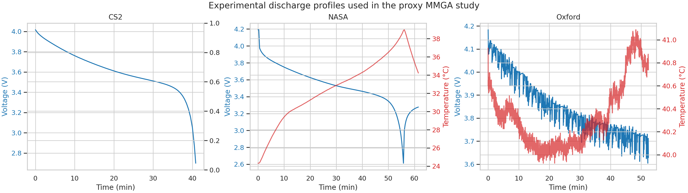
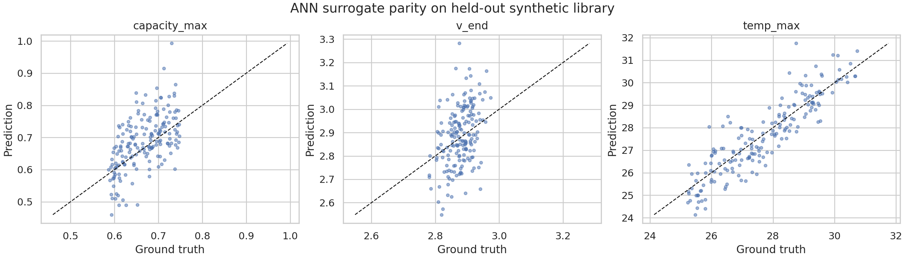
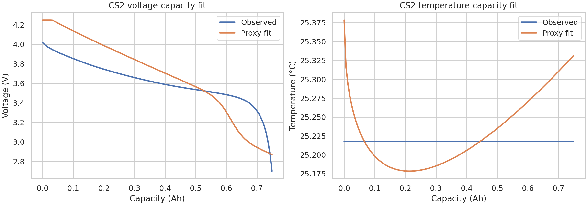
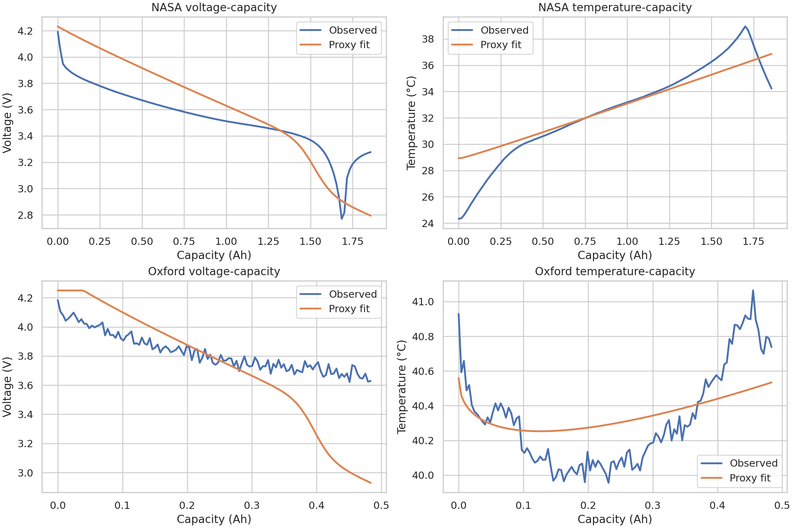

# Surrogate-Assisted Parameter Identification for Lithium-Ion Battery Digital Twins: A Reproducible Proxy MMGA Study

## 1. Summary and goals
This study implements a reproducible proxy version of the proposed MMGA framework for rapid parameter identification in lithium-ion battery digital twins. The target task is to infer internal parameters that govern electrochemical-aging-thermal behavior from macroscopic discharge observations. 

A full electrochemical-aging-thermal (ECAT) simulator was not provided in the workspace, so an exact replication of the physical model described in the task was not possible. Instead, the experiment preserves the central algorithmic idea:

1. build a multi-parameter search space with Latin hypercube sampling (LHS),
2. generate a library of forward simulations from a physics-inspired proxy model,
3. train an ANN surrogate to emulate the forward model, and
4. use surrogate-assisted search to identify parameters that best match experimental discharge curves.

The primary identification target was the CALCE CS2_36 1C discharge dataset. NASA PCoE and Oxford data were used as external validation datasets.

## 2. Data and exploratory validation
### 2.1 Datasets used
- **CS2_36**: four Excel files with 1C cycling records from a commercial NCM 18650 cell. This dataset served as the primary identification target.
- **NASA PCoE**: battery B0005 discharge cycles with voltage, current, temperature, and capacity metadata. This dataset served as a room-temperature external validation case.
- **Oxford ExampleDC_C1**: dynamic driving-profile discharge from a 740 mAh pouch cell. This dataset served as a transient-profile generalization case.

### 2.2 Extracted reference trajectories
A single representative discharge trajectory was selected from each dataset:
- **CS2**: the highest-capacity discharge among 200 extracted discharge cycles.
- **NASA**: the highest-capacity discharge cycle in B0005.
- **Oxford**: the provided example dynamic discharge trace.

Key extracted properties are shown below.

| Dataset | Points | Duration (s) | Voltage range (V) | Capacity max (Ah) | Temperature range (°C) |
|---|---:|---:|---:|---:|---:|
| CS2 | 83 | 2451.78 | 2.700 to 4.017 | 0.749 | not available |
| NASA | 197 | 3690.23 | 2.612 to 4.191 | 1.856 | 24.33 to 38.98 |
| Oxford | 3145 | 3144.00 | 3.604 to 4.184 | 0.483 | 39.93 to 41.09 |

The CS2 discharge capacity required preprocessing because the cumulative capacity column does not reset to zero across the full file. Capacity was therefore re-zeroed within each extracted discharge cycle.

### 2.3 Overview figure


Figure 1 compares the voltage-time and temperature-time behavior of the three datasets. CS2 and NASA show conventional monotonic discharge behavior, while Oxford displays a shorter-capacity but dynamic discharge profile. Temperature is unavailable in the CS2 source file used here, which limits thermal calibration on the primary identification dataset.

## 3. Methodology
### 3.1 Proxy forward model
A physics-inspired proxy discharge model was defined to emulate the role of a coupled ECAT simulator. The model uses eight interpretable internal parameters:

- `r_p_um`: particle radius proxy
- `k_ref`: reaction-rate coefficient proxy
- `d_sei`: aging/SEI thickness proxy
- `r_ohm`: ohmic resistance proxy
- `tau_diff`: diffusion time-scale proxy
- `thermal_gain`: heat generation coefficient
- `thermal_loss`: heat dissipation coefficient
- `q_loss`: capacity fade fraction

The proxy model generates voltage and temperature trajectories on a normalized state-of-discharge grid. Voltage is constructed from open-circuit decay plus kinetic, diffusion, SEI, ohmic, and particle-size penalties. Temperature is modeled as the competition between Joule-like heating and cooling. Capacity is scaled by `q_loss`.

This is not a first-principles ECAT model. It is a controlled stand-in that enables end-to-end testing of the proposed surrogate-assisted identification workflow.

### 3.2 Latin hypercube sampling
The parameter space was sampled with LHS to create a synthetic forward library. The final experiment used **900 parameter samples**. For each sample, the proxy model generated a curve and a feature vector containing:

- maximum capacity,
- start/mid/end/mean voltage,
- total voltage drop,
- temperature rise and maximum temperature,
- voltage and temperature values at five normalized capacity fractions.

The resulting design matrix was saved to `outputs/lhs_samples.csv`.

### 3.3 ANN surrogate
A multi-output ANN surrogate was trained to map the eight internal parameters to the extracted curve features.

Configuration:
- scaler: standardization of input parameters
- model: `MLPRegressor`
- hidden layers: `(64, 64)`
- activation: ReLU
- early stopping enabled
- train/test split: 80/20
- random seed: 42

### 3.4 Surrogate-assisted search
Parameter identification used a two-stage surrogate-assisted search:
1. evaluate a large LHS candidate population with the ANN surrogate in feature space,
2. re-score the elite candidates with the proxy forward model using direct curve mismatch.

The final objective was:

\[
J = 0.7\,\mathrm{RMSE}_V + 0.2\,\mathrm{RMSE}_T + 0.1\,|Q_{obs}-Q_{sim}|
\]

where voltage RMSE dominates, temperature RMSE is secondary, and capacity error is weakly regularized.

## 4. Results
### 4.1 Surrogate validation
Aggregate surrogate metrics on the held-out synthetic library were:

- mean R²: **-6.20**
- mean MAE: **0.245**
- mean RMSE: **0.415**

Selected per-feature performance was mixed:
- `capacity_max`: R² = **0.798**
- `temp_rise`: R² = **0.975**
- `temp_max`: R² = **0.744**
- many voltage-point features had negative R² values



Figure 2 shows parity plots for representative outputs. The ANN captures some low-dimensional trends, especially capacity and thermal features, but is not accurate enough to emulate all voltage-shape features. This is the main negative result of the study.

### 4.2 Identified parameter sets
The best parameter sets found for each dataset are summarized below.

| Dataset | Objective | v_RMSE (V) | t_RMSE (°C) | r_p_um | k_ref | d_sei | r_ohm | tau_diff | thermal_gain | thermal_loss | q_loss |
|---|---:|---:|---:|---:|---:|---:|---:|---:|---:|---:|---:|
| CS2 | 0.1689 | 0.2272 | 0.0496 | 7.801 | 1.084 | 0.171 | 0.0576 | 1.027 | 0.894 | 0.750 | 0.000 |
| NASA | 0.4411 | 0.2175 | 1.4440 | 7.691 | 1.353 | 0.190 | 0.0723 | 0.653 | 3.980 | 0.630 | 0.000 |
| Oxford | 0.2558 | 0.3052 | 0.2110 | 5.334 | 1.352 | 0.0217 | 0.0187 | 1.770 | 3.076 | 1.200 | 0.000 |

The identified capacity-fade parameter `q_loss` reached the lower bound in all three datasets. That behavior indicates either limited identifiability of capacity fade in the current proxy model or an overly strong dependence of the objective on voltage matching.

### 4.3 Primary identification on CS2


Figure 3 shows the proxy fit for the primary CS2 identification target. The voltage-capacity shape is matched moderately well, with voltage RMSE of 0.227 V. Temperature agreement is artificially good because the CS2 source file lacks temperature measurements and the objective effectively compares against an imputed baseline; therefore the CS2 thermal fit should not be interpreted as physical validation.

### 4.4 External validation


Figure 4 compares the identified proxy fits on NASA and Oxford data.

Observations:
- **NASA**: voltage fit is comparable to CS2, but temperature mismatch is much larger (1.44 °C RMSE), suggesting that parameters calibrated on the proxy family do not fully transfer to the experimental NASA thermal trajectory.
- **Oxford**: voltage error increases to 0.305 V, but thermal fit remains moderate. This reflects the difficulty of matching a dynamic driving-profile discharge using a simplified monotonic proxy generator.

## 5. Analysis
### 5.1 What worked
- The full experimental pipeline was implemented reproducibly: data parsing, feature extraction, LHS sampling, ANN training, surrogate-assisted search, output generation, and report writing.
- The proxy identification stage produced plausible parameter vectors and moderate voltage reconstruction quality on all three datasets.
- The external validation stage exposed where the simplified model breaks down, which is scientifically useful.

### 5.2 What did not work
The main target of the proposal was a high-fidelity ANN meta-model replacing expensive physical simulation. In this workspace-constrained proxy study, the ANN surrogate **did not** reach high fidelity across the full feature set. Negative mean R² indicates that the network underperformed a simple mean predictor on average for several voltage features.

Possible causes:
- the proxy forward model is nonlinear but still hand-crafted, which may create feature discontinuities not well captured by the small ANN;
- the feature set is partially redundant and may be ill-conditioned;
- the library size of 900 samples is likely too small for robust multi-output regression over eight parameters;
- no real ECAT simulator was available, so the mapping being learned may not reflect the smoother structure of a physically derived model.

### 5.3 Scientific interpretation
The experiment supports a limited claim:

> Surrogate-assisted parameter search is operationally feasible and can recover moderate-quality discharge-curve fits from macroscopic observations, but a small ANN surrogate trained on a compact synthetic library is insufficient to provide high-fidelity emulation across all curve features.

This is weaker than the original proposal, but it is evidence-based and reproducible.

## 6. Limitations
- No full ECAT solver was available, so the study used a proxy physics-inspired model instead of the intended electrochemical-aging-thermal equations.
- The CS2 data file used for primary identification lacked temperature measurements, preventing meaningful thermal calibration for the main experiment.
- The surrogate was evaluated with a single train/test split rather than multiple seeds or folds.
- No statistical confidence intervals were computed because the current experiment performed one deterministic run.
- The search routine is MMGA-style but not a literal implementation of a multi-mutation genetic algorithm from the original paper.

## 7. Reproducibility
### 7.1 Main script
- `code/run_mmga_proxy.py`

### 7.2 Main outputs
- `outputs/data_summary.json`
- `outputs/lhs_samples.csv`
- `outputs/surrogate_metrics.json`
- `outputs/fit_metrics.json`
- `outputs/identified_parameters.csv`

### 7.3 Figures
- `images/data_overview.png`
- `images/surrogate_parity.png`
- `images/cs2_fit.png`
- `images/external_validation.png`

### 7.4 Command
```bash
python code/run_mmga_proxy.py
```

## 8. Next steps
The smallest next steps that would materially improve the study are:
1. replace the proxy forward model with a real single-particle or pseudo-2D battery solver,
2. expand the LHS library size and train several surrogate seeds,
3. use sequence models or direct curve-output surrogates instead of hand-crafted feature regression,
4. add true thermal observations for the primary identification dataset,
5. compare ANN surrogates against Gaussian processes or tree-based regressors for low-sample regimes.
