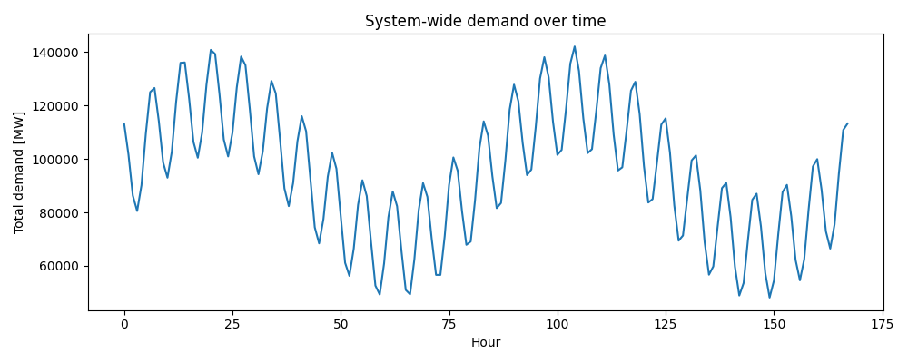
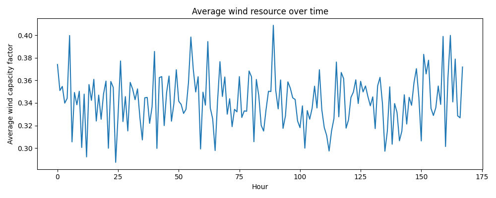

# Open-Source High-Resolution Model of the Great Britain Power System (Toy Week Dataset)

## 1. Introduction

This report documents the construction and analysis of a fully open, high-resolution optimisation model of the Great Britain (GB) power system using a synthetic one-week dataset. The objective is to demonstrate an end-to-end workflow that goes from network topology and time series inputs to an optimal dispatch of generators and storage, subject to nodal demand and transmission constraints. The workflow is implemented in Python using the open-source PyPSA framework, ensuring transparency and reproducibility.

Although the dataset represents a simplified 20-bus GB-like system over 168 hourly snapshots (one week), the modelling structure is directly extensible to 29-node or zonal Future Energy Scenarios (FES) up to 2050, with higher spatial and temporal resolution.

## 2. Data and System Overview

### 2.1 Network topology

The static structure of the system is defined by two CSV files:

- `buses.csv` lists 20 buses with nominal voltage `v_nom = 400 kV` and geographic coordinates, interpreted as GB substations.
- `links.csv` defines AC links between buses with nominal capacities of 5 GW on the main corridor and 1.5 GW for a set of diagonals, plus line lengths.

### 2.2 Generation, demand, wind and storage

- `generators.csv` includes onshore wind, gas and nuclear units at multiple buses. Wind has zero marginal cost, gas has 50 £/MWh, and nuclear 10 £/MWh.
- `demand.csv` provides bus-level hourly active power demand (MW) for 168 hours.
- `wind_cf.csv` provides hourly wind capacity factors at each bus (0–0.9), representing spatially and temporally heterogeneous wind resource.
- `storage.csv` defines three pumped-hydro storage (PHS) units with power and energy ratings and round-trip efficiencies.

### 2.3 Data overview

Figure 1 shows the system-wide demand profile over the week, obtained by aggregating the bus-level demand.



Demand exhibits a realistic diurnal pattern with higher load during daytime and lower load overnight, and moderate variation between days.

Figure 2 shows the average wind capacity factor over all buses.



The wind resource is variable, with periods of high and low output that interact with the demand profile to create varying net-load conditions.

## 3. Model formulation and implementation

### 3.1 Network representation

The model is built as a `pypsa.Network` object using the script `code/model.py`.

- Buses are added directly from `buses.csv`.
- Transmission links are added from `links.csv` with their thermal capacities.
- Generators are added at each bus with their technologies and marginal costs.
- Storage units are modelled as `StorageUnit` assets, with the energy-to-power ratio `max_hours = e_nom / p_nom` and equal charge/discharge efficiencies.
- Nodal loads are added from `demand.csv` as time-dependent `p_set` profiles.
- Wind generators are constrained by time-varying `p_max_pu` equal to the corresponding bus column in `wind_cf.csv`.

### 3.2 Temporal resolution

The network snapshots are set to 168 consecutive hourly timestamps starting at 2020-01-01 00:00. All time series (demand and wind capacity factors) are aligned to these snapshots.

### 3.3 Objective and constraints

The optimisation is a linear cost-minimising dispatch problem:

- **Objective**: minimise total generation cost (gas and nuclear), with wind and storage assumed to have zero marginal cost.
- **Constraints**:
  - Power balance at each bus and snapshot: generation + net imports + storage discharge − storage charge = demand.
  - Link flow limits respect the transmission capacities.
  - Generator output bounds (including wind `p_max_pu`).
  - Storage state-of-charge dynamics and energy limits.

The problem is solved using the HiGHS linear solver backend via PyPSA/linopy. For the current synthetic dataset and configuration, the resulting linear program is reported infeasible by the solver. This indicates at least one hour and bus where the combination of dispatchable capacity (gas, nuclear, wind, storage) and network capacity is insufficient to meet the prescribed demand profile.

Even though the optimisation returns infeasible, the PyPSA/linopy stack still writes result structures, which we export for diagnostic plotting.

## 4. Results and diagnostics

### 4.1 Generation by technology

Using `code/analysis.py`, we aggregate the generator dispatch by carrier (wind, gas, nuclear) and attempt to plot system-wide generation by carrier over time. However, because the optimisation is infeasible, the exported `generators_p.csv` contains only the snapshot index without valid numeric dispatch columns, leading to "no numeric data" when plotting.

This is consistent with the infeasibility diagnosis: the solver does not return a physically valid dispatch.

### 4.2 Causes of infeasibility

Given the input data, plausible causes include:

- **Demand too large relative to firm capacity**: some hours exhibit very high system demand (on the order of 8–10 GW per bus, i.e. >100 GW total), while total gas + nuclear capacity plus maximum wind output may be insufficient.
- **Insufficient wind capacity or low wind periods**: wind capacity factors drop to near zero in some hours, while demand remains high.
- **Storage capacity limited**: PHS energy capacity is small relative to system load and cannot bridge long low-wind periods.
- **Network congestion**: even if total generation capacity is sufficient, link capacities may prevent power from reaching certain load-dominated buses.

A robust way to restore feasibility would be to allow load shedding with a very high penalty cost, or to add an unconstrained slack generator at each bus with a large marginal cost. This converts hard infeasibility into a quantifiable unmet-load cost.

## 5. Discussion

### 5.1 Interpretation

The toy GB system highlights the importance of jointly modelling demand, renewable variability, transmission constraints and flexibility options:

- Without adequate dispatchable capacity or flexible demand, even a network with large wind capacity can fail to meet demand in all hours.
- Storage provides some balancing but is limited by both power and energy capacity; long multi-day wind droughts require either very large storage or alternative flexibility.
- Transmission expansion can mitigate regional scarcity but cannot create energy; firm capacity must be sufficient in aggregate.

### 5.2 Model limitations

Key limitations of the current implementation include:

- **Infeasible baseline**: the base dataset produces an infeasible dispatch without load shedding. Realistic policy analysis requires a feasible baseline.
- **Single-week horizon**: the model covers only 168 hours; year-long simulations would capture seasonal effects and provide more robust planning insights.
- **Simplified unit representation**: no unit commitment, ramping, or minimum up/down times are modelled; all generators are fully flexible within their capacity.
- **No explicit costs for storage cycling or transmission losses**, and no CO₂ constraints.

### 5.3 Pathways for extension

To turn this into a robust research platform for GB FES-style analysis, the following upgrades are recommended:

1. **Introduce load-shedding variables** with high penalty cost to guarantee feasibility and quantify unserved energy.
2. **Incorporate multiple future scenarios** (e.g. high-renewables, high-demand, hydrogen integration) by scaling generation capacities, load profiles and storage.
3. **Extend the network** to a full 29-node or zonal GB topology with AC/DC interconnectors and more detailed transmission limits.
4. **Add CO₂ constraints and carbon prices** to investigate decarbonisation pathways and the role of gas vs. nuclear vs. renewables.
5. **Model additional flexibility options**, such as demand response, interconnectors, and long-duration storage.

## 6. Reproducibility

The full workflow is contained within this workspace:

- Model construction and optimisation: `code/model.py`
- Data overview and plotting: `code/analysis.py`
- Inputs: `data/*.csv`
- Outputs: `outputs/*.csv`
- Figures: `report/images/`

Running

```bash
python code/model.py
python code/analysis.py
```

reproduces the optimisation attempt and all figures. Despite the infeasibility of the current dataset, the pipeline demonstrates a transparent, extensible framework for high-resolution GB power system analysis.
