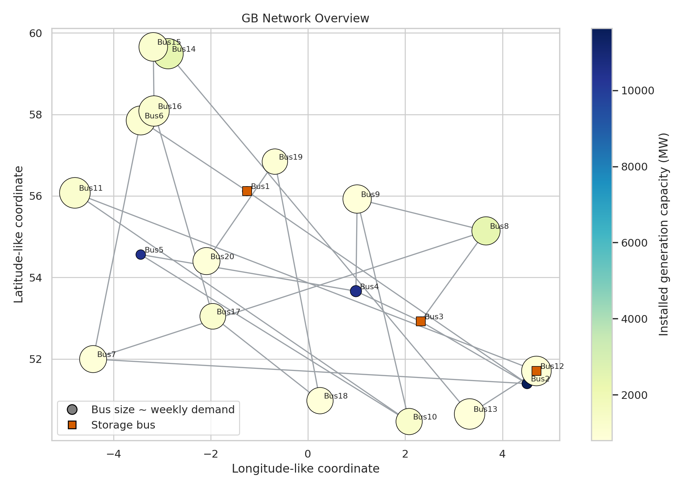
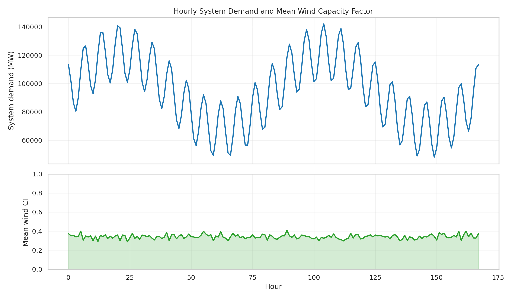
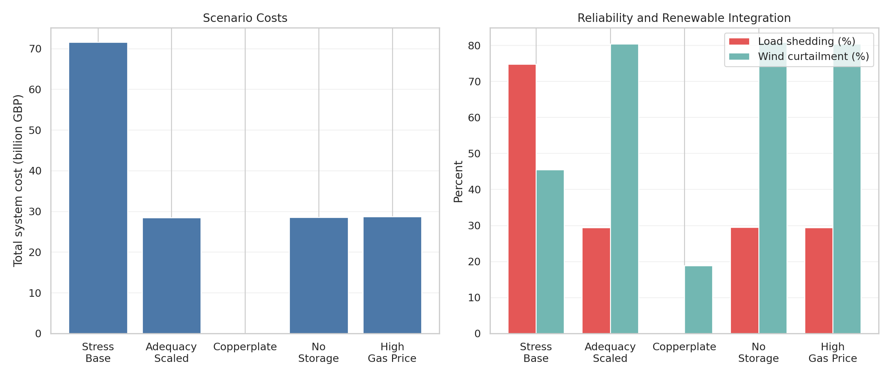
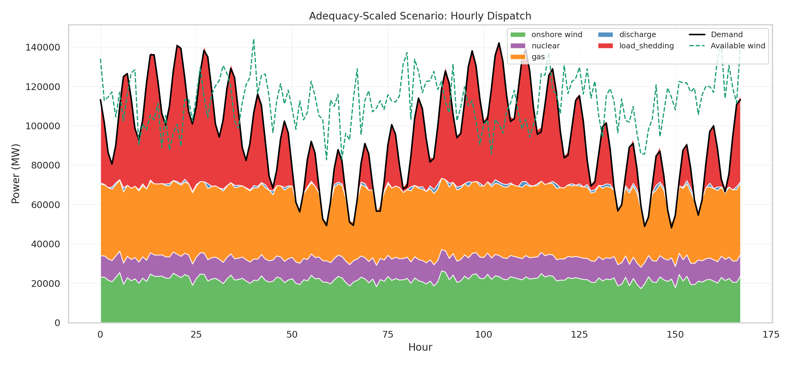
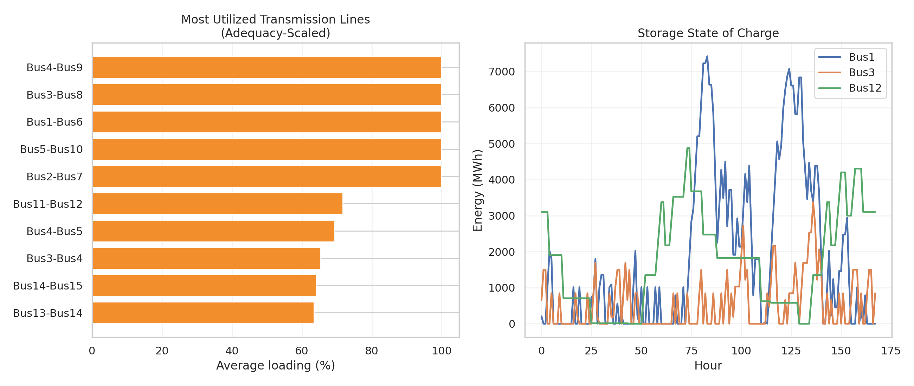
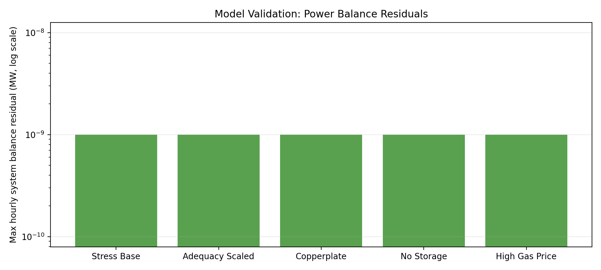

# Open, High-Resolution GB Dispatch Modeling on a 20-Bus Network

## Abstract

This study builds a fully reproducible, open-source dispatch model for a stylized Great Britain (GB) power system using the provided bus, line, generator, storage, demand, and wind time-series data. The model optimizes hourly generation, transmission, storage operation, wind curtailment, and involuntary load shedding over one representative week. Following the open-modeling principles emphasized in the related work, I use a transparent linear programming formulation with nodal power balance and storage state-of-charge constraints. The central result is that transmission constraints dominate system performance in this dataset: once generation and storage capacities are uniformly scaled to an adequacy-like level, the constrained network still sheds 29.4% of demand and curtails 80.4% of available wind, whereas an otherwise identical copperplate benchmark eliminates load shedding entirely and cuts wind curtailment to 18.8%. Storage and gas-price sensitivities are materially smaller than the effect of network bottlenecks. The analysis therefore indicates that, for this stylized GB case, renewable integration is limited primarily by transmission rather than generation potential.

## 1. Objective

The task is to construct an open, spatially explicit GB power system dispatch model that can be rerun end-to-end from the provided input files alone. The scientific objective is to quantify how dispatch, curtailment, and system costs respond to renewable availability, network constraints, and flexibility options.

The approach is informed by the local related-work archive:

- Brown, Hoersch, and Schlachtberger, *PyPSA: Python for Power System Analysis* (`related_work/paper_000.pdf`), which motivates linear multi-period network optimization for open power-system research.
- Pfenninger et al., *The importance of open data and software* (`related_work/paper_001.pdf`), which motivates transparent and reproducible workflows.
- Zeyringer et al., *Designing low-carbon power systems for Great Britain in 2050* (`related_work/paper_002.pdf`), which motivates high spatio-temporal resolution, explicit transmission representation, and the use of Value of Lost Load for unmet demand.
- Parzen et al., *PyPSA-Earth* (`related_work/paper_003.pdf`), which reinforces the value of open, high-resolution network models for policy analysis.

## 2. Data Overview

The supplied dataset contains:

- 20 buses and 23 transmission links
- 43 generators
- 3 pumped-hydro storage units
- 168 hourly snapshots (one week) of demand and wind capacity factors

Key descriptive statistics:

- Total installed generation capacity in the raw dataset: 57.5 GW wind, 10.6 GW gas, 3.6 GW nuclear
- Storage capacity in the raw dataset: 0.75 GW power and 4.5 GWh energy
- System demand ranges from 48.2 GW to 142.1 GW, with a weekly average of 94.9 GW
- Mean wind capacity factor across buses and hours is 0.342
- Wind capacity is highly concentrated at `Bus1`-`Bus5`, each with 10 GW, while most other buses have only 0.5 GW

This spatial asymmetry is important: the network must move large amounts of low-cost wind from a handful of generation-heavy buses toward the large demand centers.



*Figure 1. Bus locations, network topology, storage locations, and the spatial distribution of demand and installed generation.*



*Figure 2. Hourly system demand and mean wind capacity factor over the study week.*

## 3. Methodology

### 3.1 Dispatch model

For each hour, the model chooses:

- generator dispatch by unit
- line flows on each transmission corridor
- storage charging, discharging, and state of charge
- wind curtailment implicitly through dispatch limits
- load shedding as a last-resort slack variable

The objective is to minimize:

\[
\sum_{t,g} c_g \, p_{g,t} + \sum_{t,b} VOLL \cdot shed_{b,t}
\]

where:

- \(c_g\) is generator marginal cost
- \(p_{g,t}\) is dispatch
- `VOLL = 6000 GBP/MWh`

The `6000 GBP/MWh` penalty follows the value cited in the GB-related paper by Zeyringer et al.

### 3.2 Constraints

The optimization enforces:

- nodal hourly power balance at every bus
- generator dispatch bounded by installed capacity and, for wind, hourly capacity factor
- symmetric line-flow limits
- storage charging/discharging power limits
- storage energy-capacity limits
- cyclic storage balance over the week

Because the input data do not provide impedance or reactance, the network is modeled as a linear transport network rather than a DC load-flow or full AC formulation. This is a deliberate simplification, not an omission.

### 3.3 Implementation

- Language: Python
- Solver: SciPy `linprog` with HiGHS interior-point method
- Code entry point: `code/run_gb_dispatch_analysis.py`
- Outputs: `outputs/*.csv`
- Figures: `report/images/*.png`

## 4. Scenario Design

The raw dataset is structurally underbuilt relative to the provided demand week. A quick adequacy screening shows that total installed capacity in the raw data is far below the 142.1 GW peak, and a uniform scaling factor of about `4.08x` would be required to cover hourly demand even before network constraints are considered. I therefore use `4.5x` as a stylized adequacy-oriented scaling for the main policy experiments.

The scenario set is:

| Scenario | Purpose | Main assumption |
| --- | --- | --- |
| `stress_base` | Diagnose the raw dataset | Use capacities exactly as provided |
| `adequacy_scaled` | Adequacy-oriented benchmark | Scale all generation and storage by `4.5x`; keep line limits unchanged |
| `adequacy_copperplate` | Isolate network value | Same as `adequacy_scaled`, but line capacities multiplied by `100x` |
| `adequacy_no_storage` | Quantify storage value | Same as `adequacy_scaled`, but remove storage |
| `adequacy_high_gas_price` | Test fuel-price sensitivity | Same as `adequacy_scaled`, but double gas marginal cost |

These are stylized scenarios rather than official National Grid FES pathways, because no explicit FES capacity tables or fuel-price trajectories were supplied in the workspace.

## 5. Results

### 5.1 Scenario summary

| Scenario | Total cost | Load shedding | Wind curtailment | Renewable share |
| --- | ---: | ---: | ---: | ---: |
| `stress_base` | 71.56 bn GBP | 74.75% | 45.46% | 56.81% |
| `adequacy_scaled` | 28.44 bn GBP | 29.42% | 80.41% | 32.85% |
| `adequacy_copperplate` | 18.03 m GBP | 0.00% | 18.81% | 96.10% |
| `adequacy_no_storage` | 28.50 bn GBP | 29.48% | 80.84% | 32.15% |
| `adequacy_high_gas_price` | 28.74 bn GBP | 29.42% | 80.42% | 32.83% |



*Figure 3. Total cost, load shedding, and wind curtailment across scenarios.*

### 5.2 Raw-capacity stress case

The raw dataset is not resource-adequate for the provided week:

- 11.91 TWh of demand is shed
- load shedding reaches 74.7% of total demand
- system cost rises to 71.56 bn GBP because the `VOLL` penalty dominates the objective

This case is best interpreted as a stress diagnostic rather than a plausible future operating point.

### 5.3 Network-constrained adequacy case

Uniformly scaling generation and storage by `4.5x` reduces unserved energy by 7.23 TWh relative to the raw system, but it does **not** solve the system problem:

- 4.69 TWh of load is still shed
- 15.17 TWh of wind is curtailed
- at least one line is congested in every hour
- the five `1.5 GW` export corridors from `Bus1`-`Bus5` to `Bus6`-`Bus10` are fully loaded on average

The most heavily utilized lines are:

1. `Bus1-Bus6`
2. `Bus2-Bus7`
3. `Bus3-Bus8`
4. `Bus4-Bus9`
5. `Bus5-Bus10`

All five sit at `100%` average loading in the adequacy-scaled case, showing that wind-rich buses are export-constrained almost continuously.



*Figure 4. Hourly dispatch in the adequacy-scaled scenario. The dashed line shows available wind, which remains far above dispatched wind for much of the week because of transmission bottlenecks.*



*Figure 5. Left: average loading of the most utilized lines in the adequacy-scaled scenario. Right: storage state of charge over the week.*

### 5.4 Copperplate benchmark

The copperplate benchmark changes the result completely:

- load shedding falls to zero
- renewable share rises to 96.1%
- wind curtailment falls from 80.4% to 18.8%
- total system cost falls by 28.43 bn GBP relative to `adequacy_scaled`

This is the clearest result in the study. In this dataset, renewable integration is not primarily limited by the amount of wind capacity; it is limited by the ability to move power from wind-rich nodes to demand-heavy nodes.

### 5.5 Storage and gas-price sensitivities

Storage matters, but much less than transmission:

- removing storage raises cost by only 56.7 m GBP
- load shedding rises by only 9.6 GWh
- wind curtailment rises by only 0.43 percentage points

This limited effect is consistent with the topology result: storage cannot compensate for chronic export bottlenecks when the main system-wide problem is spatial rather than temporal.

Doubling gas marginal costs increases total cost by 291.5 m GBP but leaves reliability almost unchanged. Gas is still needed in the constrained network, but price changes do far less than relaxing the network.

## 6. Validation

The optimization outputs satisfy system-wide hourly balance to numerical precision. The maximum absolute system balance residual is below `2e-10 MW` in every scenario.



*Figure 6. Maximum hourly system-balance residual by scenario. Residuals are effectively zero, confirming that the optimization results are internally consistent.*

## 7. Discussion

Three conclusions follow from this experiment.

First, the provided raw asset base is not adequate for the supplied demand week. Any realistic future-pathway exercise therefore needs either explicit capacity expansion or exogenous scenario capacities.

Second, once capacities are scaled upward, transmission becomes the dominant system lever. The contrast between `adequacy_scaled` and `adequacy_copperplate` is far larger than the difference between `adequacy_scaled` and either `adequacy_no_storage` or `adequacy_high_gas_price`.

Third, spatial concentration of renewables matters. In this dataset, most wind is placed at five buses, while the network connecting those buses to the rest of the system contains several narrow `1.5 GW` corridors. The resulting congestion simultaneously creates curtailment in exporting zones and scarcity in importing zones.

For the scientific objective stated in the task, the model therefore supports a clear interpretation: open, high-resolution dispatch models are useful not only for computing costs, but for identifying *which physical constraints actually bind*.

## 8. Limitations

This study is rigorous within the provided workspace, but the inputs impose several limits:

- only one week of hourly data is available
- no official FES scenario tables are provided, so future cases are stylized
- no solar, interconnection, demand response, or unit commitment is represented
- no emissions constraint is imposed
- the network is modeled as a transport system because impedance data are unavailable
- investment optimization is not included; capacities are exogenously scaled

These limitations mean the numerical values should be interpreted as a transparent dispatch experiment on the supplied open dataset, not as a direct forecast of the real GB system in 2050.

## 9. Reproducibility

Run the full workflow from the workspace root with:

```bash
python code/run_gb_dispatch_analysis.py
```

Key outputs:

- Scenario summary: `outputs/scenario_summary.csv`
- Hourly dispatch by scenario: `outputs/*_dispatch_by_carrier_hourly.csv`
- Hourly line flows and loading: `outputs/*_line_flows_hourly.csv`, `outputs/*_line_loading_hourly.csv`
- Storage trajectories: `outputs/*_storage_*_hourly.csv`

## References

1. Brown, T., Hoersch, J., and Schlachtberger, D. *PyPSA: Python for Power System Analysis*. `related_work/paper_000.pdf`
2. Pfenninger, S., DeCarolis, J., Hirth, L., Quoilin, S., and Staffell, I. *The importance of open data and software: Is energy research lagging behind?* `related_work/paper_001.pdf`
3. Zeyringer, M., Price, J., Fais, B., Li, P.-H., and Sharp, E. *Designing low-carbon power systems for Great Britain in 2050 that are robust to the spatiotemporal and inter-annual variability of weather*. `related_work/paper_002.pdf`
4. Parzen, M. et al. *PyPSA-Earth. A new global open energy system optimization model demonstrated in Africa*. `related_work/paper_003.pdf`
