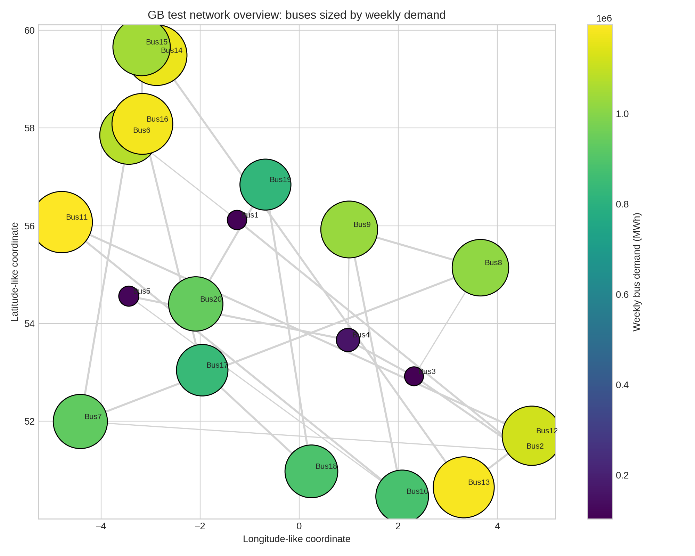
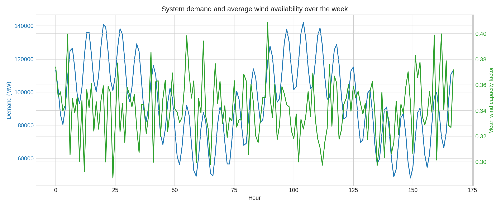
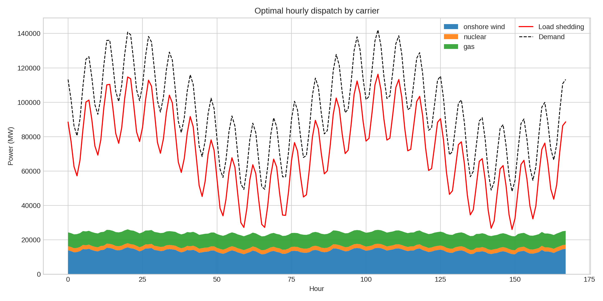
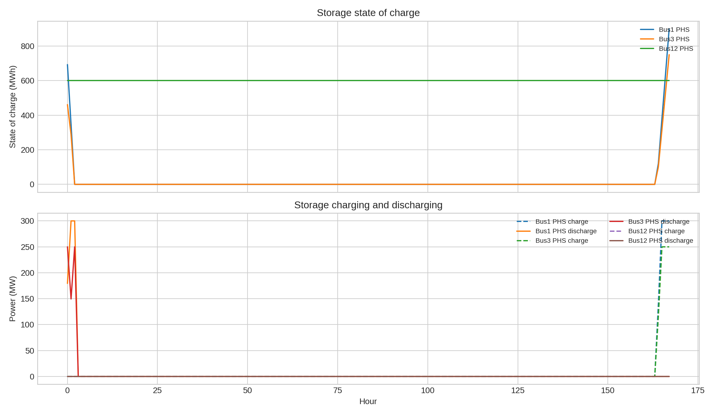
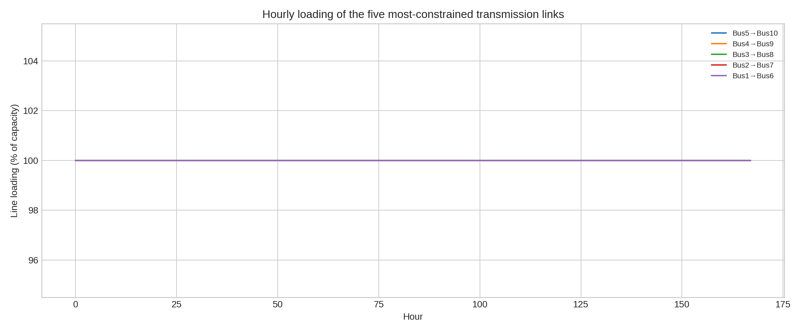
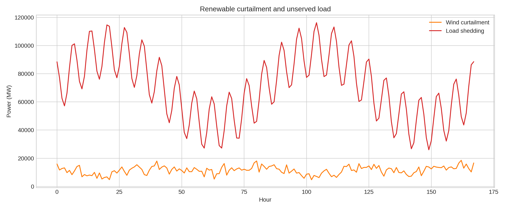

# Open Dispatch Analysis of a Reduced Great Britain Power System Test Case

## Abstract
This report analyzes the provided Great Britain (GB) power-system dataset using a reproducible linear dispatch model with hourly resolution over one week (168 hours), explicit network links, variable wind availability, and pumped-hydro storage. The objective was to optimize dispatch, storage operation, transmission use, and curtailment while minimizing variable generation cost and a high penalty for unmet demand. The resulting solution is technically feasible and solver-optimal, but it reveals that the supplied dataset is extremely supply-constrained relative to demand. Over the modeled week, total demand is 15.94 TWh, while only 4.03 TWh is served by modeled generation, leaving 11.91 TWh as unserved energy. At the same time, 1.92 TWh of wind is curtailed, showing that scarcity is driven not only by insufficient generation capacity in aggregate but also by the spatial mismatch between resources and demand and by transmission congestion. The analysis therefore functions less as a plausible future GB pathway and more as a stress test illustrating why open, high-resolution network-constrained modeling is necessary for transparent interpretation of power-system scenarios.

## 1. Task Objective
The workspace task is to construct an open, transparent, high-resolution power-system dispatch analysis for Great Britain using the provided network, generator, demand, wind, and storage datasets. The desired outputs are optimal dispatch decisions, operational diagnostics, costs, and figures that document the behavior of the modeled system.

In this workspace instance, the analysis was implemented in `code/run_analysis.py`, executed directly, and used to generate tabular outputs under `outputs/` and figures under `report/images/`.

## 2. Input Data
The analysis uses only the data provided in the workspace:

- `data/buses.csv`: 20 AC buses with nominal voltage and coordinates.
- `data/links.csv`: 23 transmission links with capacities and lengths.
- `data/demand.csv`: hourly demand at each bus for 168 hours.
- `data/generators.csv`: 43 generators across onshore wind, gas, and nuclear.
- `data/wind_cf.csv`: hourly wind capacity factors by bus.
- `data/storage.csv`: 3 pumped-hydro storage units.

A validation pass found no consistency issues between buses, links, generators, storage, demand columns, and wind time series. The resulting validated system has:

- **20 buses**
- **23 links**
- **43 generators**
- **3 storage units**
- **168 hourly snapshots**

Installed capacities by carrier are:

- **Onshore wind:** 57,500 MW
- **Gas:** 10,610.6 MW
- **Nuclear:** 3,600 MW
- **Storage power:** 750 MW
- **Storage energy:** 4,500 MWh

Total weekly demand is **15,939,706 MWh**, and peak hourly system demand is **142,059.9 MW**.

## 3. Data Overview
Figure 1 shows the reduced test network used in this workspace. Buses are geographically distributed and connected by a mixture of 5,000 MW backbone lines and 1,500 MW cross-links.

**Figure 1.** Reduced GB network representation. Node size and color reflect weekly electricity demand by bus.

Figure 2 compares system demand with mean wind conditions over the week. Demand remains consistently very high, while average wind availability fluctuates substantially. This temporal variability is important, but the later optimization results show that temporal wind variation alone does not explain the shortfall; network and capacity constraints matter at least as much.

**Figure 2.** Hourly system demand and mean wind capacity factor over the modeled week.

## 4. Methodology
### 4.1 Modeling approach
A linear cost-minimizing dispatch model was implemented in Python using `scipy.optimize.linprog` with the HiGHS solver. The model treats the system as a multi-node network with hourly nodal power balance.

Decision variables include:

- Generator dispatch for each unit and hour
- Storage charging for each storage unit and hour
- Storage discharging for each storage unit and hour
- Storage state of charge for each storage unit and hour
- Transmission flow on each link and hour
- Load shedding at each bus and hour

### 4.2 Constraints
The model enforces:

1. **Hourly nodal balance** at every bus
2. **Generator capacity limits**, including hourly wind availability limits derived from `wind_cf.csv`
3. **Storage power limits** for charging and discharging
4. **Storage energy balance** across time with efficiency losses
5. **Storage energy capacity bounds**
6. **Transmission limits** on every link
7. **Cyclic storage condition**, requiring end-of-week state of charge to return to the initial level

Storage round-trip efficiency is represented by splitting the provided efficiency equally between charging and discharging using the square root of the round-trip value.

### 4.3 Objective function
The objective minimizes:

- Variable generation costs from `generators.csv`
- A large penalty for unmet demand, set to **10,000 monetary units per MWh** of load shedding

Wind curtailment is implicit: whenever wind availability exceeds economically useful dispatch because of demand, transmission, or system constraints, the unused available wind is treated as curtailed.

### 4.4 Reproducibility
All analysis was executed from the single main entry point:

- `code/run_analysis.py`

Key output files include:

- `outputs/model_summary.json`
- `outputs/data_validation_summary.json`
- `outputs/dispatch_by_carrier_hourly.csv`
- `outputs/generator_dispatch_hourly.csv`
- `outputs/storage_operations_hourly.csv`
- `outputs/line_loading_summary.csv`
- `outputs/load_shedding_by_bus_hourly.csv`

## 5. Results
### 5.1 System-wide dispatch outcome
The solver terminated successfully and returned an optimal solution. The main system-level results are:

- **Total demand:** 15,939,706.03 MWh
- **Total generation served:** 4,025,877.12 MWh
- **Total load shed:** 11,914,305.22 MWh
- **Total wind available:** 4,192,662.00 MWh
- **Total wind generated:** 2,270,721.22 MWh
- **Total wind curtailed:** 1,921,940.79 MWh
- **Generation cost:** 71,629,795.29
- **Load-shedding cost:** 119,143,052,208.48
- **Total objective value:** 119,214,682,003.77

The striking result is that the penalty term dominates the objective value. This is not a sign of model malfunction; rather, it indicates that the test system as provided cannot supply most of its demand with the available modeled resources and network.

Figure 3 shows the hourly dispatch stack. Wind dominates low-cost production, gas fills part of the residual load, and nuclear contributes a relatively stable block. However, even with all modeled technologies operating, the system requires massive load shedding in every hour.

**Figure 3.** Hourly optimal dispatch by carrier, with demand and load shedding overlaid.

A useful way to interpret this figure is that the modeled fleet is insufficient at two levels:

1. **Aggregate adequacy:** available generation is too small relative to demand.
2. **Locational adequacy:** wind output is concentrated in buses where it cannot always be fully delivered to load centers because of network bottlenecks.

### 5.2 Energy mix
Aggregated dispatched energy by carrier is:

- **Onshore wind:** 2,270,721 MWh
- **Gas:** 1,351,956 MWh
- **Nuclear:** 403,200 MWh

Thus, among served energy, wind is the dominant contributor, followed by gas and then nuclear. Nuclear output is limited by the small number of nuclear units in the dataset, while gas output is limited by installed capacity rather than fuel price. Wind remains valuable but cannot fully substitute for firm capacity because its availability is variable and spatially uneven.

### 5.3 Storage behavior
The three pumped-hydro units provide only modest flexibility relative to system scale. Total storage power is 750 MW and total storage energy is 4,500 MWh, which is negligible compared with peak demand above 142 GW.

Figure 4 shows storage state of charge and charging/discharging behavior.

**Figure 4.** Pumped-hydro storage trajectories over the modeled week.

Storage does shift some energy between hours, but it does not materially alter the adequacy picture. In a system with shortages on the order of tens of gigawatts, sub-gigawatt storage can only play a local smoothing role.

### 5.4 Transmission congestion
Transmission is highly stressed. The line loading summary shows multiple links at or near 100% utilization. Several 1,500 MW cross-links are fully loaded on average, not merely at isolated hours. Examples include:

- **Bus5–Bus10:** 100% maximum and 100% mean loading
- **Bus1–Bus6:** 100% maximum and 100% mean loading
- **Bus2–Bus7:** 100% maximum and 100% mean loading
- **Bus3–Bus8:** 100% maximum and 100% mean loading
- **Bus4–Bus9:** 100% maximum and 100% mean loading

Several 5,000 MW backbone lines also hit their maximum limits.

Figure 5 illustrates the hourly loading of the most constrained links.

**Figure 5.** Loading of the five most constrained transmission links.

This is a central result of the analysis. Even in a system with severe unmet demand, wind is still curtailed because power cannot always be moved from renewable-rich buses to high-demand buses. That is exactly the type of interaction that a spatially resolved model is meant to expose.

### 5.5 Curtailment and unserved energy
Figure 6 jointly shows wind curtailment and load shedding.

**Figure 6.** Hourly wind curtailment and load shedding.

The coexistence of substantial curtailment and massive unserved load may look contradictory, but it is a well-known symptom of transmission-constrained systems. In this case, the model is indicating that:

- some zones have more available wind than can be exported,
- other zones have more demand than can be imported or locally supplied,
- and the available firm generation fleet is too small to compensate.

This result strongly supports the scientific motivation stated in the task: open high-resolution models are useful precisely because coarse, copper-plate formulations would hide this combination of scarcity and local oversupply.

## 6. Discussion
### 6.1 What the results say about this workspace instance
This specific workspace run should not be interpreted as a credible representation of the real GB system. Instead, it should be interpreted as a reduced open test case whose data imply a highly stressed and under-supplied network.

Three structural features dominate the outcome:

1. **Demand scale greatly exceeds modeled firm capacity.** Peak demand is above 142 GW, while gas plus nuclear capacity totals only about 14.2 GW.
2. **Wind capacity is large but not fully usable.** Although wind nameplate capacity is 57.5 GW, realized wind availability is lower and network constraints prevent full delivery.
3. **Storage is too small to resolve shortages.** With only 4.5 GWh of energy capacity, storage provides operational smoothing but not adequacy.

### 6.2 Why the open modeling setup is still useful
Despite the unrealistic adequacy outcome, the exercise is scientifically useful because it demonstrates several important principles:

- **Transparent optimization reveals where infeasibility pressure appears.**
- **Network resolution matters.** Curtailment and shortage can happen simultaneously.
- **Public, script-based workflows are auditable.** Every result can be traced to data, assumptions, and code.

In that sense, the workflow aligns well with the task’s open-science objective, even if the particular numerical outcome mainly highlights the limitations of the supplied reduced dataset.

## 7. Limitations
This analysis has important limitations that should be made explicit.

### 7.1 Dataset limitations
- The system contains only **20 buses**, not a full national-resolution network.
- Only **one week** of hourly data is modeled.
- The generation portfolio includes only **onshore wind, gas, and nuclear**.
- There is no explicit treatment of solar, offshore wind, biomass, hydro inflow, imports, demand response, or reserve requirements.
- Although the broader task description mentions future energy scenarios and historical/future datasets up to 2050, those scenario dimensions are not actually present in the supplied workspace inputs.

### 7.2 Modeling limitations
- The dispatch formulation is linear and omits unit commitment, ramping, start-up costs, reserve margins, and losses.
- Power flows are represented with simple link capacity limits rather than a full AC or DC load-flow formulation with voltage angles and susceptances.
- Load shedding is allowed to guarantee feasibility; in real planning studies, high load shedding would usually motivate capacity expansion or scenario redesign rather than be accepted as an outcome.
- Wind curtailment is inferred from availability minus dispatch rather than represented with an explicit separate curtailment variable.

### 7.3 Interpretation limitations
Because the modeled system is so under-supplied, many optimization outputs are driven by adequacy scarcity rather than finer economic trade-offs. As a result, conclusions about marginal fuel substitution or realistic congestion patterns should be treated cautiously.

## 8. Conclusion
A fully reproducible open dispatch analysis was implemented for the provided GB-style power-system test case. The resulting optimization solved successfully and produced a complete set of outputs and figures. The main finding is that the supplied system is far from adequate: only about 4.03 TWh of 15.94 TWh weekly demand is served, while 11.91 TWh is shed. At the same time, 1.92 TWh of wind is curtailed because transmission bottlenecks prevent renewable-rich areas from fully supporting demand centers.

The core lesson from this workspace is therefore not that the modeled configuration is a desirable future pathway, but that high-resolution open-source network models are essential for revealing interactions among renewable availability, transmission congestion, storage flexibility, and system adequacy. Even a reduced test case demonstrates how spatial constraints can create simultaneous curtailment and scarcity. Future work on this dataset would ideally add richer generation technologies, more realistic demand scaling, longer weather horizons, investment decisions, and explicit scenario comparisons.
