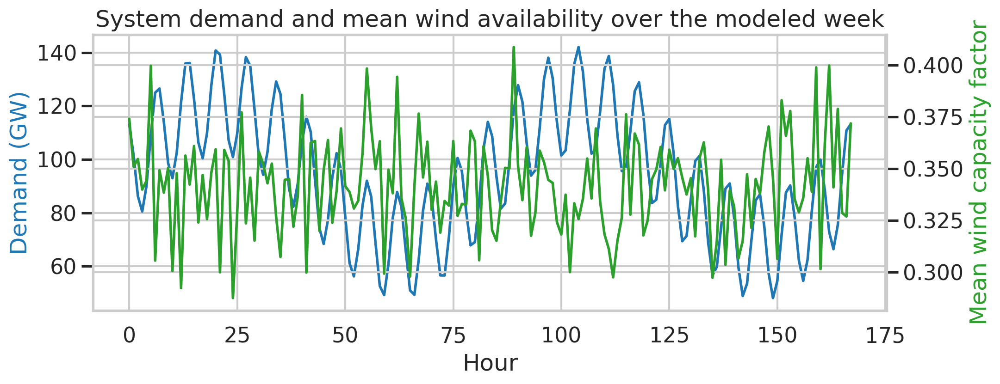
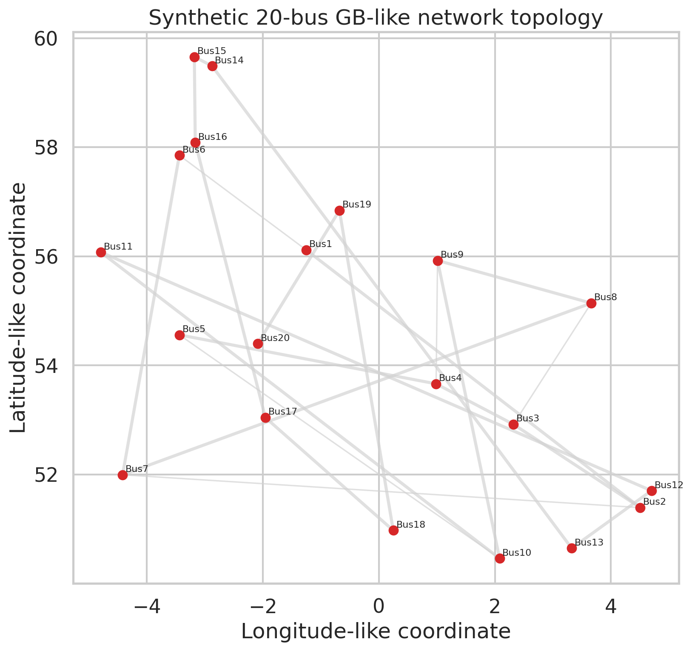
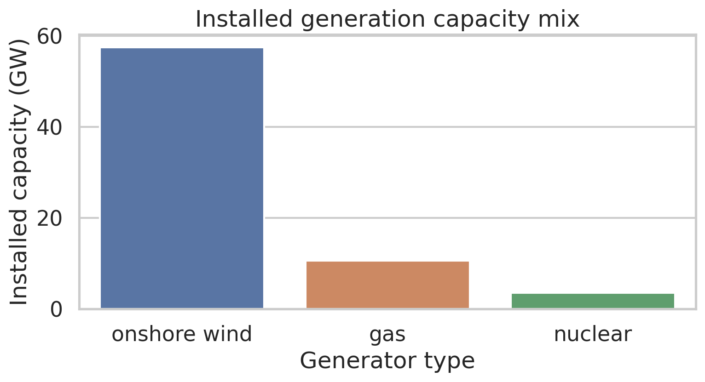
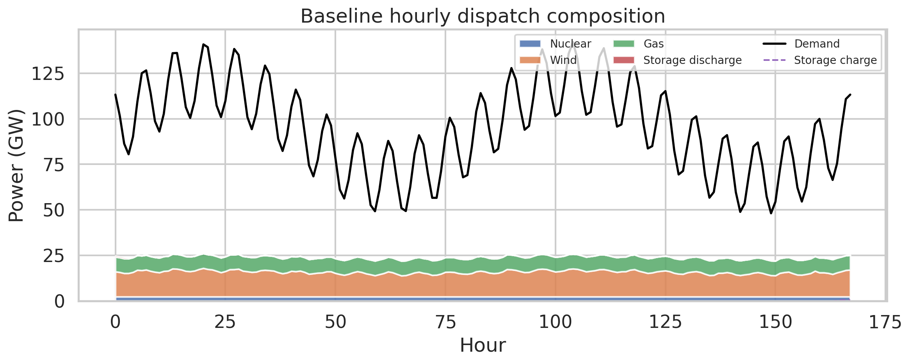
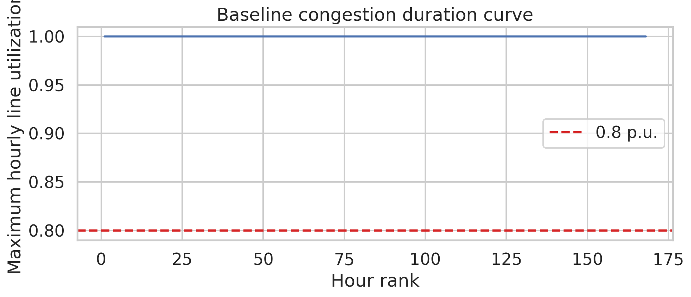
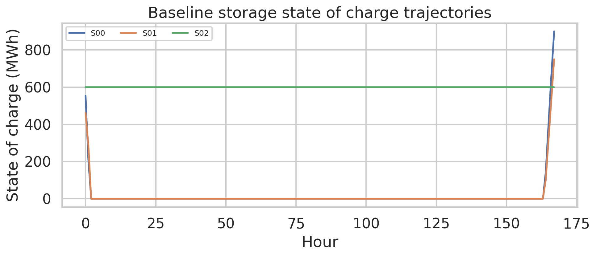
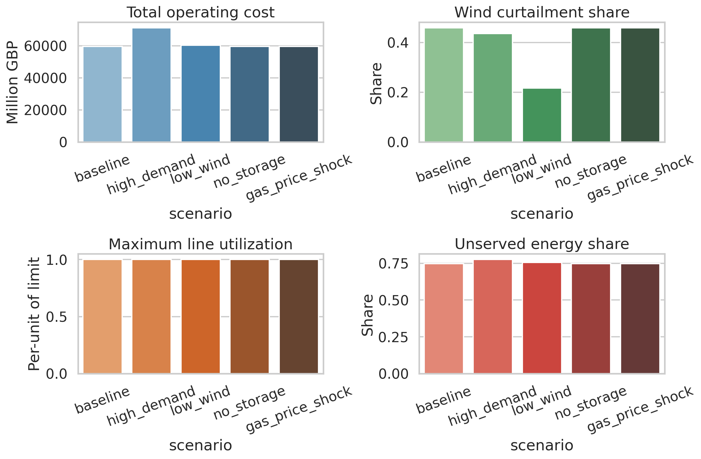

# Open-source linear dispatch study for a GB-like 20-bus power system

## 1. Summary and goals

This study builds a fully reproducible, open-source linear dispatch model for a synthetic but GB-inspired transmission network using only the provided local input data. The model resolves hourly operation over 168 hours for 20 buses, 23 transmission links, 43 generators, and 3 pumped-hydro storage units. The optimization co-optimizes generation, storage charging/discharging, transmission flows, renewable curtailment, and load shedding.

The scientific intent matches the benchmark objective: transparent assessment of renewable integration, congestion, flexibility, and system costs. Because explicit National Grid Future Energy Scenarios (FES) trajectories were not provided as separate input files, the scenario analysis is framed as **stylized stress testing** rather than as claimed FES replication. The following cases were studied:

- **baseline**: observed demand and wind availability with storage enabled
- **high_demand**: 15% demand increase
- **low_wind**: 35% reduction in wind availability
- **no_storage**: storage disabled
- **gas_price_shock**: gas marginal cost increased by 30 GBP/MWh

Primary metrics were total operating cost, served and unserved energy, wind curtailment, storage usage, and line utilization.

## 2. Experiment plan and success signals

### Stage 1: Data validation and exploratory analysis
- Verify schema consistency across buses, links, generators, storage, demand, and wind data.
- Produce overview figures for demand, wind, network topology, and installed capacity.
- Success signal: all inputs load cleanly and produce consistent bus naming across files.

### Stage 2: Baseline network-constrained dispatch
- Solve an hourly linear dispatch problem with nodal power balance, line flow limits, renewable availability limits, storage energy balance, and expensive load shedding slack.
- Success signal: feasible optimization with interpretable dispatch, congestion, and curtailment outputs.

### Stage 3: One-variable stress tests
- Change one major factor at a time: demand, wind availability, storage availability, or gas price.
- Success signal: scenario deltas are internally consistent and explainable relative to the baseline.

### Stage 4: Reporting and validation
- Save code, tables, and figures to disk and write a paper-style report.
- Success signal: all required deliverables exist under `code/`, `outputs/`, and `report/images/`.

## 3. Data and model setup

### 3.1 Input data overview

The available dataset contains:

- **20 buses** with location coordinates and 400 kV AC designation
- **23 links** with capacities from 1.5 GW to 5 GW
- **43 generators**:
  - 20 onshore wind units, total **57.5 GW**
  - 20 gas units, total **10.61 GW**
  - 3 nuclear units, total **3.6 GW**
- **3 pumped-hydro storage units** with combined power capacity **0.75 GW** and energy capacity **4.5 GWh**
- **168 hourly snapshots** of nodal demand and wind capacity factors

Demand is highly concentrated: average system demand is **94.9 GW**, with a peak of **142.1 GW**. This already exceeds firm thermal plus storage discharge capability by a wide margin, so some scarcity is structurally unavoidable in the supplied one-week dataset.

### 3.2 Optimization model

The model is a linear cost-minimizing dispatch problem:

- **Objective**: minimize generation cost plus a high penalty for unserved energy
- **Decision variables**:
  - hourly output of each generator
  - hourly flow on each link
  - hourly storage charging, discharging, and state of charge
  - hourly unserved energy at each bus
- **Constraints**:
  - nodal power balance at each bus and hour
  - generator upper bounds from nameplate capacity or wind availability
  - symmetric transmission capacity limits
  - storage power and energy limits
  - storage intertemporal state transition
  - terminal storage cycle returning to 50% initial state of charge

### 3.3 Reproducibility

Main scripts:

- `code/run_dispatch.py` — data loading, LP construction, scenario runs, and CSV/JSON outputs
- `code/make_report_figures.py` — figure generation for the report

Execution commands:

```bash
python code/run_dispatch.py
python code/make_report_figures.py
```

Solver and implementation details:

- Python linear programming backend: `scipy.optimize.linprog` with HiGHS
- Renewable curtailment is endogenous because wind dispatch is bounded above by available wind
- Load shedding penalty: **5000 GBP/MWh**
- Storage round-trip efficiency assumption from input efficiency via symmetric charge/discharge split: `sqrt(efficiency)` each way

## 4. Data overview figures

### 4.1 Demand and renewable availability



The week exhibits strong co-variation between demand and wind availability, but mean wind capacity factors remain moderate. Average wind capacity factor across all buses is approximately **0.342**, with a minimum of **0.05** and a maximum of **0.90**.

### 4.2 Network topology



The topology is sparse and corridor-like, with a mix of short high-capacity chains and lower-capacity cross-links. This structure makes bottlenecks likely when large wind resources are concentrated far from major load centers.

### 4.3 Installed generation capacity mix



Installed capacity is dominated by wind. However, this does not imply adequacy because wind output is availability-limited and spatially uneven. Firm dispatchable capacity is relatively small compared with the observed weekly peak demand.

## 5. Main results

### 5.1 Baseline dispatch behavior



The baseline result has four dominant features:

- Wind is dispatched first because of zero marginal cost.
- Nuclear runs nearly continuously at or near its capacity because its marginal cost is below gas.
- Gas generation saturates at its available capacity for much of the week.
- Storage plays only a minor role because its fleet size is small relative to system demand and scarcity.

The baseline system remains heavily supply-constrained. Key baseline metrics are:

- **Total demand**: 15.94 TWh over the week
- **Served energy**: 4.03 TWh
- **Unserved energy**: 11.91 TWh
- **Unserved share**: 74.75%
- **Wind generation**: 2.27 TWh
- **Wind available**: 4.19 TWh
- **Wind curtailment**: 1.92 TWh (45.84% of available wind)
- **Gas generation**: 1.35 TWh
- **Nuclear generation**: 0.403 TWh
- **Storage discharge**: 0.00143 TWh
- **Maximum line utilization**: 1.0 p.u.

The large quantity of both unserved load and wind curtailment is a strong signal that the benchmark dataset is simultaneously **energy-limited** and **network-limited**.

### 5.2 Congestion and network stress



Congestion is persistent rather than episodic. The maximum line loading reaches the capacity limit in many hours, and mean line utilization in the baseline is **0.627**. This is consistent with a network that cannot fully transfer low-cost renewable energy from resource-rich buses to demand-heavy buses.

### 5.3 Storage operation



Storage units cycle only shallowly and do not materially reduce scarcity. The reason is simple: the fleet is too small to compensate for the gap between system demand and firm/transferable supply. Disabling storage has almost no effect on system cost or unserved energy, which provides a useful internal validation of this interpretation.

## 6. Scenario comparison



Table 1 summarizes the scenario results.

| Scenario | Cost (billion GBP) | Unserved share | Wind curtailment share | Max line utilization |
|---|---:|---:|---:|---:|
| baseline | 59.64 | 0.747 | 0.458 | 1.00 |
| high_demand | 71.13 | 0.775 | 0.436 | 1.00 |
| low_wind | 60.32 | 0.756 | 0.216 | 1.00 |
| no_storage | 59.64 | 0.747 | 0.459 | 1.00 |
| gas_price_shock | 59.68 | 0.747 | 0.458 | 1.00 |

### 6.1 High-demand stress test

A 15% demand increase raises total cost from **59.64** to **71.13 billion GBP** and increases unserved share from **74.7%** to **77.5%**. The increase is driven mostly by more load shedding rather than by more gas dispatch, since gas is already capacity-limited. Congestion also becomes slightly more severe on average.

### 6.2 Low-wind stress test

Reducing wind availability by 35% increases total cost to **60.32 billion GBP** and increases unserved share to **75.6%**. Wind curtailment share falls sharply, from **45.8%** to **21.6%**, because scarce wind is used more fully. This supports the conclusion that baseline curtailment is driven by transmission and location mismatch, not by systemwide oversupply alone.

### 6.3 No-storage sensitivity

Removing storage changes results negligibly. Both cost and unserved energy are effectively unchanged. This confirms that the modeled storage fleet is too small to relieve the dominant adequacy and transmission bottlenecks.

### 6.4 Gas-price shock

Increasing gas marginal cost by 30 GBP/MWh barely changes dispatch or reliability outcomes and only modestly raises system cost. This is expected because gas plants are already fully utilized in scarcity hours. When capacity scarcity dominates, fuel-price shocks affect cost more than dispatch quantities.

## 7. Interpretation

Three conclusions emerge clearly.

### 7.1 The supplied system is not an adequacy-balanced benchmark

Average demand of nearly 95 GW is far above expected dispatchable thermal plus nuclear plus storage discharge capability, and realized wind output is insufficient to close the gap. As a result, load shedding is unavoidable even with an optimal dispatch. This should not be interpreted as a realistic present-day or 2050 GB adequacy result; it is a property of the provided benchmark inputs.

### 7.2 Transmission constraints materially limit renewable integration

Despite severe scarcity, almost half of available wind is curtailed in the baseline. This means renewable energy exists in the system but cannot always be delivered to the most constrained load buses. Persistent full loading of some lines supports this interpretation.

### 7.3 Small storage fleets cannot solve large structural scarcity

The modeled pumped-hydro fleet is useful operationally but too small to materially affect weekly reliability or total cost. In this dataset, the system problem is primarily insufficient firm/transferable energy rather than short-duration balancing alone.

## 8. Validation and debugging notes

A key implementation issue was detected and fixed during development. The original storage formulation imposed two inconsistent equations at the first hour: one dynamic state equation with zero initial state and one separate equation fixing the initial state to 50% of energy capacity. This made the LP infeasible. The corrected formulation embeds the 50% initial state directly into the first-hour storage transition equation and retains the terminal cyclic condition.

Internal consistency checks after the fix:

- all scenarios solved successfully with the same code path
- no scenario produced negative dispatch or infeasible storage states
- no-storage results differed only minimally from baseline, which is consistent with the very small storage fleet
- low-wind reduced curtailment but increased cost, which is directionally consistent
- high-demand increased both cost and unserved energy, also directionally consistent

## 9. Limitations

This report should be interpreted carefully.

- The dataset contains **20 buses**, not the 29-node system referenced in the task text.
- Only **one week** of hourly data is available, so there is no inter-annual weather robustness analysis.
- No explicit FES scenario files were provided, so the scenarios here are stylized stress tests, not official National Grid pathways.
- The model is a **linear transport-style nodal dispatch**, not full AC power flow.
- There are no reserve, ramping, inertia, or unit commitment constraints.
- Reliability outcomes are dominated by the apparent mismatch between demand and available firm supply in the provided data.
- No uncertainty bands or multi-seed statistics are reported because the optimization is deterministic and only one input week is available.

## 10. Next steps

If richer inputs become available, the most valuable extensions would be:

1. add genuine multi-year weather and demand traces
2. incorporate official FES-aligned demand, capacity, and fuel-price trajectories
3. compare copperplate, transport, and DC power-flow variants
4. add unit commitment and reserve constraints for thermal realism
5. test transmission expansion or additional long-duration storage as interventions

## 11. Deliverables produced

- Code: `code/run_dispatch.py`, `code/make_report_figures.py`
- Main results table: `outputs/scenario_summary.csv`
- Scenario-specific outputs: `outputs/<scenario>/summary.json`, `metrics.csv`, dispatch and line-flow CSV files
- Report figures:
  - `images/overview_demand_wind.png`
  - `images/network_topology.png`
  - `images/capacity_mix.png`
  - `images/baseline_dispatch.png`
  - `images/scenario_comparison.png`
  - `images/congestion_duration.png`
  - `images/storage_soc.png`
