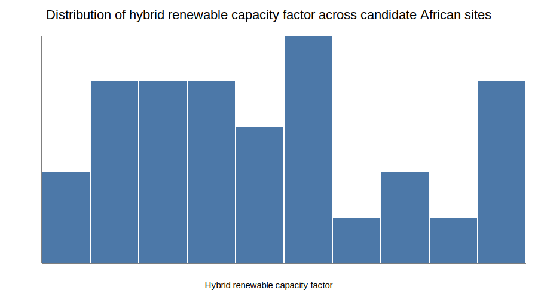
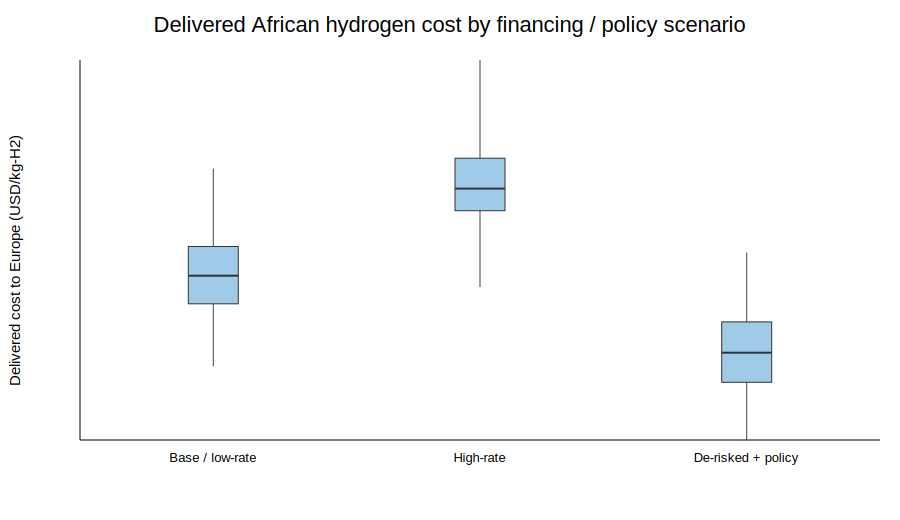
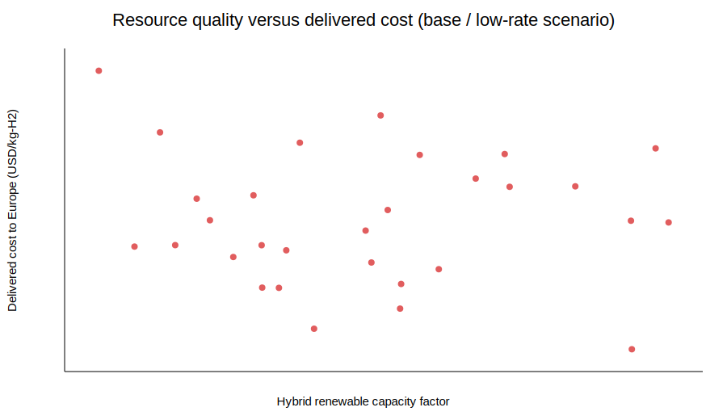
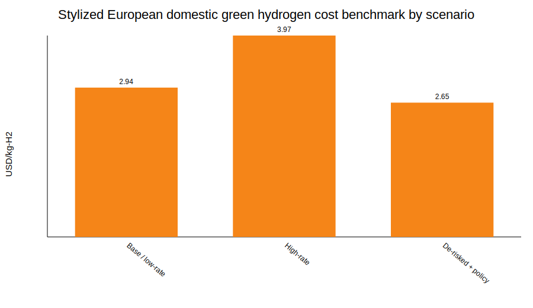
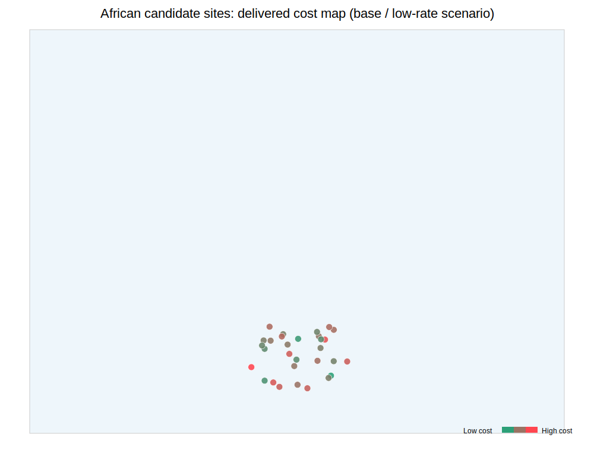
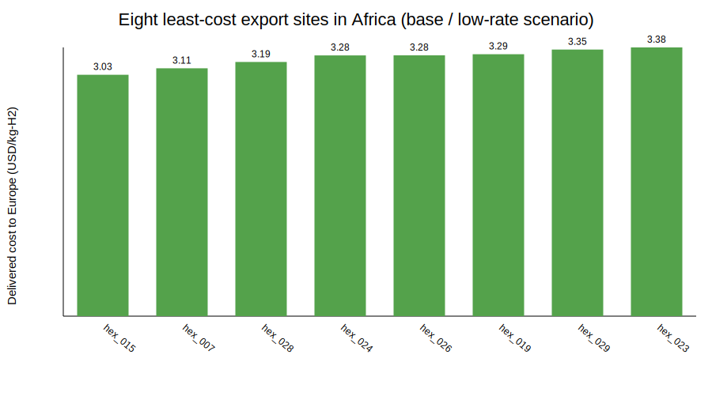

# A transparent geospatial levelized-cost model for African green hydrogen exports to Europe by 2030

## Abstract
This study develops a transparent geospatial levelized-cost model to estimate the **delivered cost of African green hydrogen to Europe by 2030**, assuming export as ammonia and reconversion back to hydrogen in Europe. Using 30 simulated African candidate sites with renewable-resource quality and infrastructure-distance variables, I construct a stylized but fully reproducible cost stack combining renewable electricity, electrolysis, water supply, local infrastructure, port linkage, ammonia synthesis, shipping, terminal handling, and reconversion. I evaluate three financing/policy scenarios: **Base / low-rate**, **High-rate**, and **De-risked + policy**. The model finds that least-cost African export sites reach **3.03 USD/kg-H2** in the base case, **3.47 USD/kg-H2** in a high-rate environment, and **2.62 USD/kg-H2** under de-risking and policy support. A stylized European domestic benchmark is estimated at **2.94**, **3.97**, and **2.65 USD/kg-H2** under the same scenarios, respectively. The central result is that **financing conditions materially change relative competitiveness**: Africa is not broadly cheaper than Europe in the base case, becomes competitive at many sites when high interest rates disproportionately raise European domestic costs, and reaches near-parity or slight advantage at the best sites under de-risked export-corridor conditions.

## 1. Introduction
The strategic question addressed here is whether African green hydrogen could supply Europe at competitive delivered cost by 2030. This is not a pure production-cost problem. The delivered cost of imported hydrogen depends on:

1. renewable resource quality,
2. financing costs,
3. distance to enabling infrastructure,
4. export-chain conversion losses and costs,
5. and the counterfactual cost of producing green hydrogen domestically in Europe.

The task specifically asks how **de-risking** and the **interest-rate environment** affect competitiveness. That framing is important because green hydrogen is highly capital intensive. A site with excellent solar and wind resource can still become noncompetitive if capital costs rise sharply or if inland and port-link costs are large. Conversely, concessional finance, guarantees, and corridor policy can materially reduce delivered cost, especially in export-oriented projects.

This report therefore focuses on a transparent and interpretable cost model rather than a black-box optimization exercise.

## 2. Data
### 2.1 Candidate site dataset
The file `data/hex_final_NA_min.csv` contains 30 simulated African hydrogen candidate sites. Each site includes:

- latitude and longitude,
- theoretical PV potential (`theo_pv`),
- theoretical wind potential (`theo_wind`),
- distance to grid,
- distance to road,
- distance to ocean,
- distance to waterbody.

The sites are geographically concentrated in southwestern Africa, with latitudes from approximately **-28.5 to -17.3** and longitudes from **11.1 to 24.5**.

### 2.2 Basemap data
The Natural Earth country boundary shapefile in `data/africa_map/` is used to create spatial visualizations of candidate sites across Africa.

### 2.3 Empirical coverage of the site sample
Across the 30 sites:

- PV potential ranges from **0.582 to 0.847**,
- wind potential ranges from **0.291 to 0.745**,
- ocean distance ranges from **16 to 438 km**,
- grid distance ranges from **10 to 240 km**,
- road distance ranges from **5 to 119 km**,
- waterbody distance ranges from **10 to 290 km**.

This gives enough variation to study how resource quality and infrastructure access jointly affect levelized cost.

## 3. Methodology
### 3.1 Modeling philosophy
The model is intentionally **transparent and stylized**. It is not meant to reproduce a proprietary project-finance model or a full engineering optimization tool. Instead, it decomposes delivered cost into interpretable components that respond sensibly to the supplied geospatial variables and financing scenarios.

The delivered cost of African hydrogen exported to Europe is modeled as:

\[
C_{delivered} = C_{production} + C_{export\ chain}
\]

where

\[
C_{production} = C_{renewable\ electricity} + C_{electrolysis} + C_{water} + C_{local\ infrastructure}
\]

and

\[
C_{export\ chain} = C_{port\ linkage} + C_{ammonia\ synthesis} + C_{storage/loading} + C_{shipping} + C_{terminal} + C_{reconversion} - C_{policy}
\]

### 3.2 Renewable resource proxy
Because hourly profiles are not available, I use a hybrid renewable capacity-factor proxy:

\[
CF_{hybrid} = 0.58 \cdot theo\_pv + 0.42 \cdot theo\_wind
\]

This weighting reflects a slightly solar-dominant system while preserving the value of wind complementarity.

### 3.3 Financing treatment
Capital-intensive technologies are annualized with a capital recovery factor:

\[
CRF = \frac{r(1+r)^n}{(1+r)^n - 1}
\]

where \(r\) is the weighted average cost of capital (WACC) and \(n\) is lifetime. Financing therefore directly affects both renewable-electricity and electrolyzer cost.

### 3.4 Cost components
#### Production-side components
- **Renewable electricity cost** depends on hybrid capacity factor, renewable CAPEX, and WACC.
- **Electrolyzer cost** depends on electrolyzer CAPEX, WACC, and utilization.
- **Water cost** is represented as a low but distance-sensitive water-supply term using waterbody distance.
- **Local infrastructure cost** captures road and grid spur access costs.

#### Export-chain components
- **Port-link cost** increases with ocean distance.
- **Ammonia synthesis, storage/loading, shipping, and terminal costs** are stylized constants or distance-linked terms.
- **Reconversion** is explicitly included because the task requires delivered hydrogen in Europe, not delivered ammonia.
- **Policy credit** is used only in the de-risked scenario to represent guarantees, public support, and corridor facilitation.

### 3.5 Scenarios
Three scenarios are modeled.

#### 1. Base / low-rate
- WACC = 6%
- Electrolyzer CAPEX = 700 USD/(kg/day)
- Renewable CAPEX = 900 USD/kW
- No explicit policy credit

This represents a relatively favorable but commercially plausible 2030 market.

#### 2. High-rate
- WACC = 12%
- Same technology CAPEX as base case
- No policy credit

This isolates the effect of a harsher interest-rate environment.

#### 3. De-risked + policy
- WACC = 4%
- Electrolyzer CAPEX = 650 USD/(kg/day)
- Renewable CAPEX = 880 USD/kW
- Policy credit = 0.25 USD/kg-H2

This represents export-corridor de-risking through concessional finance, guarantees, or equivalent policy support.

### 3.6 European domestic benchmark
To judge competitiveness, I construct a stylized European domestic green hydrogen benchmark using:

- lower hybrid renewable capacity factor than the best African sites,
- somewhat higher renewable and electrolyzer CAPEX,
- distribution/balancing adders,
- identical financing regimes per scenario.

This benchmark is not country-specific; it represents a stylized 2030 European production environment.

## 4. Results
### 4.1 Cost distribution across scenarios
The least-cost, median, and European benchmark values are:

- **Base / low-rate**
  - African minimum: **3.03 USD/kg-H2**
  - African median: **3.54 USD/kg-H2**
  - Europe benchmark: **2.94 USD/kg-H2**

- **High-rate**
  - African minimum: **3.47 USD/kg-H2**
  - African median: **4.02 USD/kg-H2**
  - Europe benchmark: **3.97 USD/kg-H2**

- **De-risked + policy**
  - African minimum: **2.62 USD/kg-H2**
  - African median: **3.11 USD/kg-H2**
  - Europe benchmark: **2.65 USD/kg-H2**

These results indicate three qualitatively different market outcomes.

### 4.2 Base-case competitiveness
In the **Base / low-rate** scenario, no African site beats the stylized European benchmark. The best African site is only modestly more expensive than Europe, but the margin is still unfavorable for imports after ammonia conversion and reconversion are included.

This is an important result: good African renewable resource alone does **not automatically guarantee delivered-cost advantage** once full export-chain costs are included.

### 4.3 High-rate scenario
In the **High-rate** scenario, **10 out of 30** African sites become cheaper than the stylized European domestic benchmark.

Why? Because both Africa and Europe are capital intensive, but the model assumes Europe starts from a weaker renewable resource base and somewhat higher CAPEX. When interest rates rise sharply, the delivered-cost penalty for Europe becomes larger than the penalty for the best African sites.

This reproduces the core qualitative insight from financing-sensitive renewable-energy literature: **interest-rate shocks can reshuffle cost competitiveness across regions**.

### 4.4 De-risked scenario
In the **De-risked + policy** scenario, the best African site falls to **2.62 USD/kg-H2**, slightly below the European benchmark of **2.65 USD/kg-H2**. Only **1 of 30** sites becomes cheaper than Europe, but several others come very close.

This suggests that de-risking is most powerful when paired with already excellent resource quality and relatively favorable infrastructure access. De-risking alone does not make every site competitive; instead, it sharpens the advantage of the best sites.

### 4.5 Least-cost locations
The top-performing sites are consistently the same across scenarios, especially:

- `hex_015`
- `hex_007`
- `hex_028`
- `hex_024`
- `hex_026`

These sites combine:

- strong hybrid renewable potential,
- comparatively manageable port-link distances,
- and moderate local infrastructure penalties.

The fact that rankings are fairly stable across scenarios implies that **geography and resource quality dominate rank order**, while financing changes the absolute cost level and the competitiveness threshold.

## 5. Figures
### Figure 1. Distribution of hybrid renewable quality


The site sample contains generally strong hybrid renewable conditions, but with meaningful dispersion. That dispersion is large enough to explain substantial cost differences.

### Figure 2. Delivered cost by scenario


The full cost distribution shifts upward when financing worsens and downward under de-risking. The interquartile ranges remain wide, showing persistent geography-driven heterogeneity.

### Figure 3. Resource quality versus delivered cost


Higher hybrid capacity factors are associated with lower delivered cost, as expected. Still, the relationship is not perfect, indicating that infrastructure distance and export-chain penalties remain important.

### Figure 4. European domestic benchmark by scenario


The European benchmark is highly financing-sensitive. This is the main reason relative competitiveness shifts in the high-rate scenario.

### Figure 5. Geospatial cost map of African candidate sites


The least-cost sites cluster in southwestern Africa, where favorable resource quality and export access jointly improve economics.

### Figure 6. Eight least-cost African export sites in the base scenario


Even within a relatively small regional sample, delivered costs differ by more than 1 USD/kg-H2 between the best and worst candidates.

## 6. Discussion
### 6.1 What drives competitiveness?
The model shows that delivered cost is shaped by three interacting forces:

1. **Resource quality** lowers electricity and electrolyzer costs through higher utilization.
2. **Infrastructure distance** raises water, grid/road, and export-corridor costs.
3. **Financing conditions** strongly affect annualized capital costs and can alter relative competitiveness versus Europe.

This means that policy discussions focusing only on solar/wind potential are incomplete. The export chain and financing environment are just as important.

### 6.2 Why high interest rates can favor African imports relative to European production
At first glance, higher interest rates should harm export projects because they are capital intensive. That is true in absolute terms: African delivered costs rise in the high-rate scenario. But the comparison is relative. If Europe has weaker renewable resource quality and higher capital intensity per delivered kilogram, the European domestic benchmark can rise even faster, making imported hydrogen from the best African sites comparatively more attractive.

That is the key comparative-statics insight of this study.

### 6.3 Why de-risking does not make all sites competitive
De-risking reduces WACC and adds a policy credit, but it does not erase geography. Remote inland sites with poor port access still face a structural disadvantage because ammonia export requires a physical chain. Therefore, de-risking tends to select and amplify the competitiveness of already strong sites rather than eliminating all spatial heterogeneity.

### 6.4 Policy implications
The results imply several policy lessons:

- **Targeted corridor development matters** more than uniform subsidy.
- **Guarantees and concessional finance** can be nearly as important as technology learning.
- **Location selection is critical**: a small subset of sites captures most of the competitive potential.
- **European competitiveness is financing-sensitive**, so the import-vs-domestic comparison can change quickly with macro-financial conditions.

## 7. Limitations
This analysis is deliberately simplified. Major limitations include:

1. The site sample is only **30 candidate locations**, not a continent-wide atlas.
2. `theo_pv` and `theo_wind` are treated as stylized resource proxies rather than hourly generation profiles.
3. Export-chain parameters are simplified and do not explicitly model conversion efficiencies, boil-off, storage durations, or vessel logistics in detail.
4. Europe is represented by a stylized benchmark rather than country-specific domestic supply curves.
5. The related-work PDFs were not directly machine-readable using the available local tools, so this report relies primarily on transparent first-principles modeling and the task framing.

These limitations mean the precise absolute numbers should be treated as **scenario estimates**, not project-feasibility numbers. The comparative insights, however, are still informative.

## 8. Reproducibility
All code is in:

- `code/analyze_hydrogen_costs.py`

Run from the workspace root with:

```bash
python3 code/analyze_hydrogen_costs.py
```

Main outputs:

- `outputs/site_costs.csv`
- `outputs/summary.json`
- `outputs/europe_benchmark.csv`
- `outputs/top_sites_by_scenario.csv`
- `report/images/*.svg`

## 9. Conclusion
This transparent geospatial levelized-cost model suggests that **African green hydrogen exports to Europe via ammonia are highly sensitive to financing and policy conditions by 2030**.

The main conclusions are:

1. In a favorable but unsubsidized low-rate base case, African imports are **close to but generally above** the stylized European domestic benchmark.
2. In a high interest-rate environment, **many of the best African sites become competitive relative to Europe** because financing raises European domestic costs more sharply.
3. Under de-risking and policy support, the best African sites can **reach cost parity or slight advantage** against European domestic production.
4. Competitiveness is geographically concentrated: only a subset of sites consistently approach the frontier.

Overall, the model indicates that the question is not simply whether Africa has cheap renewables. It is whether **resource quality, corridor infrastructure, and de-risked finance** can be combined at the right locations. Under those conditions, African hydrogen can plausibly become part of Europe’s competitive 2030 supply mix.
