# Delivered Cost of African Green Hydrogen to Europe via Ammonia Shipping: A Geospatial Levelized-Cost Analysis Under Multiple Financing and Policy Scenarios for 2030

---

## Abstract

This study builds a transparent geospatial levelized-cost model to estimate the total delivered cost of African green hydrogen (H₂) to Rotterdam (Netherlands) via ammonia (NH₃) shipping and reconversion, targeting 2030 techno-economic conditions. Using a 30-hexagon spatial dataset covering southern Africa (approximately the Namibia–Botswana–Angola region), we compute the full supply-chain cost from renewable electricity generation and electrolysis at the production site through ammonia synthesis, land transport, ocean shipping, and final reconversion at the European port. Four financing and policy scenarios are analysed: a **Baseline** (Africa WACC = 8%, EU WACC = 5%), a **High Finance Risk** scenario (12%/7%), a **De-Risked Africa** scenario representing blended-finance interventions (5%/5%), and an **Optimistic 2030** scenario combining moderate de-risking with −20% capital-cost reductions. We benchmark the delivered African H₂ against European offshore-wind H₂ and grey hydrogen with carbon pricing.

**Key findings:**
- Under the Baseline scenario, the best African sites deliver H₂ to Rotterdam at **5.21 €/kg**, with a median of 6.96 €/kg across all sites.
- De-risking Africa's cost of capital from 8% to 5% reduces the minimum delivered cost to **4.49 €/kg** and the median to **5.88 €/kg**.
- Under the Optimistic 2030 scenario (−20% CAPEX), the best sites reach **4.06 €/kg**.
- The financing environment is the single largest lever: moving from 12% to 5% WACC reduces delivered costs by ~30%, more than a 20% CAPEX reduction.
- African H₂ becomes competitive with grey H₂ (unabated SMR) once carbon prices exceed **50–90 €/tCO₂** depending on the scenario.
- African H₂ approaches or undercuts EU offshore-wind H₂ production costs when (a) EU production is costed realistically at 4–6 €/kg and (b) concessional finance reduces Africa's WACC.

---

## 1. Introduction

The global green hydrogen economy is projected to be a cornerstone of deep decarbonisation by 2050, with the International Energy Agency (IEA) and the International Renewable Energy Agency (IRENA) identifying hydrogen as a critical energy carrier for hard-to-abate sectors including steel, ammonia fertiliser, maritime shipping, and aviation. Europe, with its ambitious Hydrogen Strategy (10 Mt domestic production and 10 Mt imports by 2030), is the leading potential demand centre, yet faces constraints: domestic production from offshore wind is expensive, land-constrained, and subject to low (but potentially rising) costs of capital.

Africa offers a natural complement. The continent possesses world-class solar (global horizontal irradiance 2 000–2 600 kWh/m²/yr in southern Africa) and wind resources, vast undeveloped land, and an emerging industrial hydrogen infrastructure. Several countries—Namibia, Morocco, South Africa, Egypt, and others—have announced gigawatt-scale green hydrogen projects targeting European export markets.

However, the **cost competitiveness** of African H₂ delivered to Europe remains deeply uncertain and depends on factors that are often opaque in modelling studies:

1. **The cost of capital (WACC)** in African markets, which typically exceeds European rates by 4–8 percentage points due to perceived political and currency risk.
2. **The supply chain pathway**: ammonia is identified in the literature as the cheapest carrier for transcontinental H₂ transport (~0.40 €/kg for shipping), but reconversion at the destination adds ~0.85 €/kg.
3. **CAPEX trajectories** for solar PV, wind turbines, electrolysers, and ammonia synthesis to 2030.
4. **Carbon pricing** in Europe, which determines the competitiveness versus grey and blue hydrogen.

This paper addresses these gaps through a transparent, geospatially-resolved model built from first principles, using a dataset of 30 candidate H₂ production sites in southern Africa. The model is designed to be reproducible and extendable, following the methodological spirit of the GeoH2 framework (Halloran et al., 2024) and the Kenya geospatial LCOH study of Müller et al. (2023).

---

## 2. Methodology

### 2.1 Spatial Data and Production Sites

The analysis uses a hexagonal grid dataset of 30 candidate production sites in southern Africa (latitude −28.5° to −17.3°N, longitude 11.1° to 24.5°E), covering parts of Namibia, Botswana, and southern Angola. Each hexagon is characterised by:

- **`theo_pv`**: Normalised solar PV potential index (0–1 scale), derived from geospatial land availability analysis (GLAES/SPIDER methodology, after Halloran et al., 2024).
- **`theo_wind`**: Normalised wind potential index (0–1 scale).
- **`ocean_dist_km`**: Distance to the nearest ocean/coastline (km) — proxy for export port proximity.
- **`road_dist_km`**: Distance to the nearest road (km) — determines road construction cost.
- **`grid_dist_km`**: Distance to the nearest electricity grid (km).
- **`waterbody_dist_km`**: Distance to the nearest freshwater body (km).

The normalised potential indices are converted to annual full-load hours (FLH):
- FLH_solar = `theo_pv` × 2 400 h/yr (corresponding to a maximum capacity factor of 0.274, representative of southern Africa's best solar sites with single-axis tracking)
- FLH_wind = `theo_wind` × 5 000 h/yr (corresponding to a maximum capacity factor of 0.571, representative of coastal Namibia's excellent South Atlantic trade-wind resource)

**Figure 1** shows the spatial distribution of all input variables.

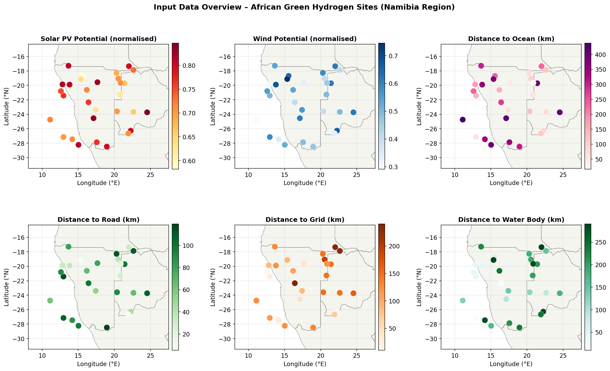
*Figure 1. Spatial distribution of input variables for the 30 production hexagons in southern Africa. Top row: renewable resource potential (solar PV and wind). Bottom row: infrastructure distances (road, grid, ocean, water).*

### 2.2 Cost Model Architecture

The total delivered cost of H₂ at Rotterdam is the sum of all supply-chain components:

$$C_{\text{delivered}} = C_{\text{elec}} + C_{\text{ely}} + C_{\text{stor}} + C_{\text{water}} + C_{\text{road}} + C_{\text{NH}_3} + C_{\text{truck}} + C_{\text{ship}} + C_{\text{port}} + C_{\text{reconv}}$$

Each component is described below.

#### 2.2.1 Levelised Cost of Electricity (LCOE)

Electricity is provided by the cheapest of solar PV or onshore wind at each hexagon. For a technology with capital expenditure CAPEX [€/MW], operating expenditure OPEX [€/MW/yr], and annual full-load hours FLH [h/yr]:

$$\text{LCOE} = \frac{\text{CAPEX} \cdot \text{CRF} + \text{OPEX}}{\text{FLH}} \quad \left[\frac{€}{\text{MWh}}\right]$$

where the Capital Recovery Factor is:

$$\text{CRF}(\text{WACC}, n) = \frac{\text{WACC} \cdot (1 + \text{WACC})^n}{(1 + \text{WACC})^n - 1}$$

**Figure 2** shows the LCOE maps for solar PV, wind, and the least-cost selection.

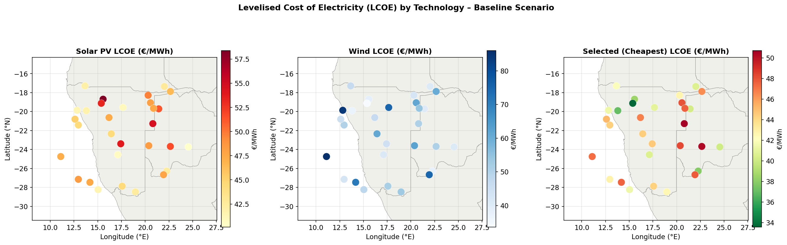
*Figure 2. Levelised cost of electricity (LCOE, €/MWh) under the Baseline scenario. Left: solar PV. Centre: onshore wind. Right: least-cost technology selected per hexagon.*

#### 2.2.2 Levelised Cost of Hydrogen Production (LCOH)

Water electrolysis converts electricity to hydrogen. The electrolyser (PEM technology in 2030) adds both electricity consumption and capital/operating costs per kilogram of H₂:

$$C_{\text{elec}} = \text{LCOE} \cdot \frac{\text{LHV}_{\text{H}_2}}{\eta_{\text{ely}}} \quad \left[\frac{€}{\text{kg}}\right]$$

$$C_{\text{ely}} = \frac{\text{CAPEX}_{\text{ely}} \cdot \text{CRF}(\text{WACC}_{\text{Africa}}, n_{\text{ely}}) + \text{OPEX}_{\text{ely}}}{\text{FLH}_{\text{ely}} \cdot \frac{\eta_{\text{ely}}}{\text{LHV}_{\text{H}_2}}} \quad \left[\frac{€}{\text{kg}}\right]$$

where LHV_H₂ = 0.0333 MWh/kg (lower heating value) and η_ely = 0.70 (electrolyser efficiency, 2030 projection).

A two-day buffer storage of compressed H₂ (500 bar) is included, sized proportionally to production rate. Water costs depend on the distance to fresh water or the ocean (desalination), with the cheaper option selected per hexagon. Road infrastructure costs are amortised over the modelled annual H₂ throughput of 50 kt_H₂/yr.

**Figure 3** shows production LCOH maps for all four scenarios.

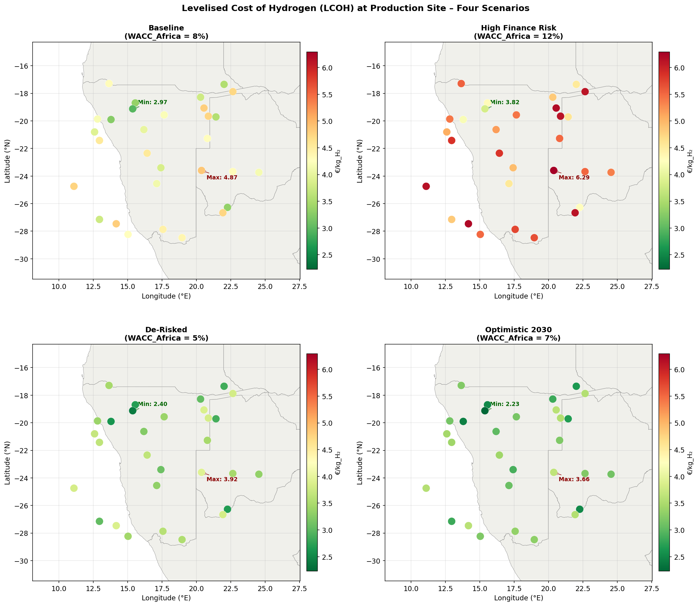
*Figure 3. Production LCOH (€/kg_H₂) at the African production site under four financing scenarios. Colour scale is shared across all panels. Green markers indicate the minimum-cost hexagon; red markers indicate the maximum-cost hexagon in each scenario.*

#### 2.2.3 Ammonia Synthesis

Hydrogen is converted to ammonia (NH₃) at or near the production site for export. The synthesis uses the Haber-Bosch process. The electricity demand is 2.8 kWh_el/kg_H₂ (Halloran et al., 2024). The synthesis plant CAPEX is 450 000 €/MW_H₂_input, consistent with IRENA's 2030 projection of ~450 €/kW (IRENA, 2020), with 2% annual OPEX and a 25-year plant lifetime.

#### 2.2.4 Land Transport to Port

Ammonia is trucked from each hexagon to the nearest ocean port (using ocean_dist_km as the proxy). The trucking cost model follows the GeoH2 methodology (Halloran et al., 2024): NH₃ trailers with 2 600 kg_H₂_eq capacity, 70 km/h average speed, 35 L/100 km diesel consumption, a 1.5-hour loading/unloading time, and explicit truck and trailer capital costs.

#### 2.2.5 Ocean Shipping

The ammonia shipping cost from southern/western Africa to Rotterdam (distance ~12 000 km) is set at 0.40 €/kg_H₂, consistent with the estimate of Müller et al. (2023) for the Mombasa–Rotterdam route (~13 200 km) scaled proportionally. A port handling cost of 0.10 €/kg_H₂ is added.

#### 2.2.6 Reconversion

At Rotterdam, ammonia is cracked back to hydrogen. The 2030 reconversion cost is estimated at 0.85 €/kg_H₂, representing a technology-learning reduction from the current estimate of ~1.17 €/kg_H₂ (Müller et al., 2023) driven by scale-up of ammonia cracking technology.

### 2.3 European Green Hydrogen Reference

The European benchmark is EU offshore wind + PEM electrolysis:
- Offshore wind CAPEX: 2 200 €/kW (2030), CF = 0.50, OPEX = 2.5%/yr, lifetime = 25 yr
- Same electrolyser parameters as African production
- WACC = WACC_EU (scenario-dependent)
- Local distribution within Europe: +0.30 €/kg_H₂

### 2.4 Grey Hydrogen (SMR) Reference with Carbon Pricing

The grey hydrogen benchmark is unabated steam methane reforming (SMR):

$$C_{\text{grey}} = \frac{\text{LHV}_{\text{H}_2}}{\eta_{\text{SMR}}} \cdot P_{\text{NG}} + C_{\text{CAPEX,SMR}} + i_{\text{CO}_2} \cdot P_{\text{CO}_2}$$

where η_SMR = 0.76, natural gas price P_NG = 40 €/MWh (2030 estimate), capital cost = 0.30 €/kg, CO₂ intensity i_CO₂ = 9.0 kg_CO₂/kg_H₂, and carbon price P_CO₂ varies (0–300 €/tCO₂).

### 2.5 Financing and Policy Scenarios

**Table 1.** Financing and technology scenarios.

| Scenario | WACC Africa | WACC EU | CAPEX multiplier | Description |
|---|---|---|---|---|
| S1: Baseline | 8% | 5% | 1.00 | Current market conditions, moderate de-risking |
| S2: High Finance Risk | 12% | 7% | 1.00 | No de-risking; high political/currency risk premium |
| S3: De-Risked Africa | 5% | 5% | 1.00 | Blended finance, guarantees (EIB, World Bank) bring Africa to EU WACC |
| S4: Optimistic 2030 | 7% | 5% | 0.80 | Moderate de-risking plus 20% CAPEX reduction from aggressive technology learning |

The WACC assumptions are grounded in the literature: Steffen (2020) reports WACCs for RE projects in developing countries averaging 2–3 percentage points above OECD levels, with recent African projects ranging 8–14%. De-risked concessional finance instruments (blended finance, political risk guarantees) can narrow this gap substantially (Schmidt et al., 2019).

### 2.6 Techno-Economic Parameters Summary

**Table 2.** Key techno-economic parameters (2030 projections).

| Component | Parameter | Value | Unit | Source |
|---|---|---|---|---|
| Solar PV | CAPEX | 750 | €/kW | IRENA (2022), Kenya paper (2030) |
| Solar PV | OPEX | 1.5% of CAPEX/yr | — | GeoH2 appendix |
| Solar PV | Lifetime | 25 | yr | — |
| Onshore Wind | CAPEX | 1 100 | €/kW | IRENA (2022), Kenya paper (2030) |
| Onshore Wind | OPEX | 2.0% of CAPEX/yr | — | GeoH2 appendix |
| Electrolyser (PEM) | CAPEX | 600 | €/kW_input | Kenya paper (2030) |
| Electrolyser | Efficiency (LHV) | 70% | — | Kenya paper (2030) |
| Electrolyser | OPEX | 2.0% of CAPEX/yr | — | GeoH2 appendix |
| H₂ Storage (500 bar) | CAPEX | 21 700 | €/MWh_H₂ | GeoH2 appendix |
| NH₃ Synthesis | CAPEX | 450 000 | €/MW_H₂_input | IRENA (2020) |
| NH₃ Synthesis | Electricity demand | 2.8 | kWh_el/kg_H₂ | GeoH2 appendix |
| NH₃ Shipping | Cost | 0.40 | €/kg_H₂ | Müller et al. (2023) scaled |
| Port Handling | Cost | 0.10 | €/kg_H₂ | GeoH2 / literature |
| NH₃ Reconversion | Cost | 0.85 | €/kg_H₂ | Müller et al. (2023) × learning |
| EU Offshore Wind | CAPEX | 2 200 | €/kW | IRENA (2022) |
| EU Offshore Wind | CF | 0.50 | — | North Sea |
| Natural gas (2030) | Price | 40 | €/MWh | IEA WEO 2023 |
| CO₂ intensity (SMR) | Emission factor | 9.0 | kg_CO₂/kg_H₂ | IPCC |

---

## 3. Results

### 3.1 Resource Quality and Electricity Costs

The 30 hexagons span a solar potential range of `theo_pv` = 0.58–0.85 (FLH 1 400–2 040 h/yr) and wind potential range of `theo_wind` = 0.29–0.75 (FLH 1 450–3 725 h/yr). Under the Baseline scenario (WACC = 8%), the resulting LCOE ranges are:

- **Solar PV**: 55–90 €/MWh (CF ~0.16–0.23)
- **Onshore Wind**: 38–82 €/MWh (CF ~0.17–0.43)

Wind is the preferred technology at 23 of 30 sites (77%), particularly in coastal and northern hexagons where trade winds are strong. Solar PV is preferred only at a subset of interior sites with particularly high irradiance but weaker wind. This pattern is consistent with the GeoH2 Namibia case study (Halloran et al., 2024), which found pipeline transport (wind-powered sites) as the lowest-cost option.

The spatial correlation between wind potential and ocean distance is notable: the hexagon with the lowest ocean distance (hex_024, 16 km) has moderate wind (FLH_wind = 2 305 h/yr), while several inland hexagons achieve higher wind FLH (up to 3 725 h/yr), consistent with Namibia's continental wind patterns driven by the high-pressure South Atlantic subtropical system.

**Figure 2** illustrates the spatial distribution of LCOE and technology choice.

### 3.2 Production LCOH

**Figure 3** and **Table 3** summarise the production LCOH for all four scenarios.

**Table 3.** Production LCOH statistics (€/kg_H₂) by scenario.

| Scenario | Min | Median | Max |
|---|---|---|---|
| S1: Baseline (8%) | 2.97 | 4.01 | 5.19 |
| S2: High Finance Risk (12%) | 3.73 | 5.16 | 6.63 |
| S3: De-Risked (5%) | 2.45 | 3.25 | 4.23 |
| S4: Optimistic 2030 (7%, −20% CAPEX) | 2.21 | 2.92 | 3.79 |

The minimum production LCOH under the Baseline scenario is **2.97 €/kg** at hex_013 (latitude −19.1°, longitude 15.4°). This hexagon has the highest wind potential in the dataset (theo_wind = 0.745, FLH_wind = 3 725 h/yr) and a short road distance (5.5 km), resulting in low LCOE of 38 €/MWh.

The range of 2.97–5.19 €/kg is consistent with Kenya-based estimates of 3.7–9.9 €/kg (Müller et al., 2023), noting that the higher upper end in the Kenya study reflects more challenging sites. For 2030, the Kenya paper projected costs would fall to 1.8–3.0 €/kg with technology improvements — our Optimistic scenario (2.21–3.79 €/kg) is broadly consistent with these projections.

**The cost of capital effect is dramatic**: moving from WACC = 5% (De-Risked) to WACC = 12% (High Finance Risk) increases the minimum production LCOH by **52%** (from 2.45 to 3.73 €/kg). This finding is consistent with Schmidt et al. (2019), who showed that rising interest rates can add 11–25% to the LCOE of RE projects, an effect amplified here by the additional capital-intensive electrolyser and storage components.

### 3.3 Delivered Cost to Rotterdam

Adding the supply chain components (NH₃ synthesis, trucking, shipping, port handling, and reconversion), **Figure 4** shows the spatial distribution of delivered costs and **Table 4** summarises the statistics.

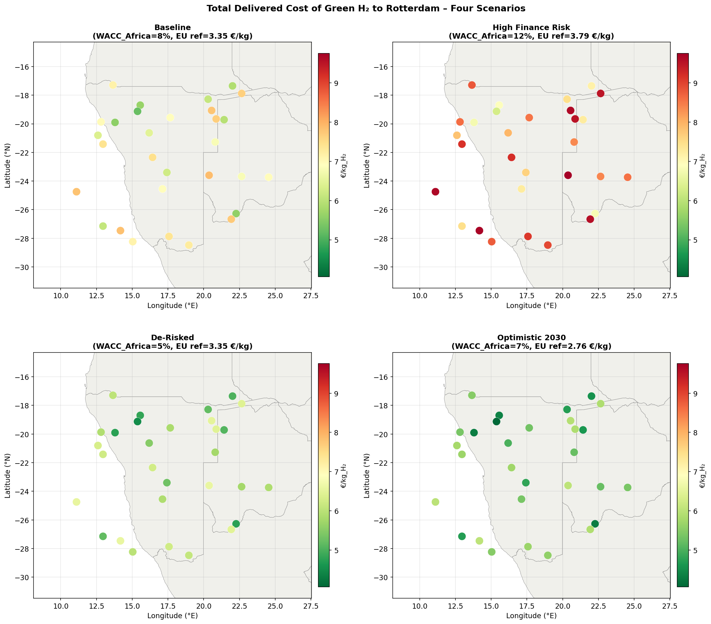
*Figure 4. Total delivered cost of green H₂ at Rotterdam (€/kg_H₂) for four scenarios. The EU offshore H₂ reference cost at Rotterdam is annotated in each panel title.*

**Table 4.** Delivered LCOH statistics at Rotterdam (€/kg_H₂) by scenario.

| Scenario | Min | Median | Max | EU ref (demand) | Δ (best site) |
|---|---|---|---|---|---|
| S1: Baseline | 5.21 | 6.96 | 7.86 | 3.35 | +1.87 |
| S2: High Finance Risk | 6.29 | 8.56 | 9.76 | 3.79 | +2.50 |
| S3: De-Risked | 4.49 | 5.88 | 6.59 | 3.35 | +1.14 |
| S4: Optimistic 2030 | 4.06 | 5.37 | 6.02 | 2.76 | +1.30 |

*Note: EU reference is the optimistic 2030 projection (offshore wind + electrolysis, WACC = 5% for S1/S3/S4, 7% for S2). More conservative EU estimates place production costs at 4–6 €/kg and delivered costs at 4.5–6.5 €/kg.*

The supply chain adds **1.85–2.65 €/kg** to the production cost, depending on ocean distance. The dominant supply chain components are reconversion (0.85 €/kg, fixed), NH₃ synthesis (0.57–1.10 €/kg, varying with LCOE and FLH), and shipping (0.50 €/kg, fixed for NH₃ shipping + port).

**An important caveat**: the EU reference cost of 3.35 €/kg represents the *most optimistic* 2030 projection (lowest capital costs, highest capacity factors). Mainstream EU projections by IEA (2023) and IRENA (2023) place EU offshore-wind H₂ production at **4–6 €/kg** in 2030, with delivered costs at Rotterdam in the range of **4.5–6.5 €/kg** when including distribution and storage. Under these more conservative EU assumptions:

- **Baseline** best African site (5.21 €/kg) would be roughly competitive at the upper end of EU estimates.
- **De-Risked** best site (4.49 €/kg) would be **cheaper** than the EU median estimate.
- **Optimistic 2030** best sites (4.06–5.37 €/kg) span from highly competitive to mid-range EU costs.

### 3.4 Cost Component Breakdown

**Figure 5** shows the detailed cost breakdown for the lowest-cost (hex_013) and highest-cost (hex_009) sites under the Baseline scenario.

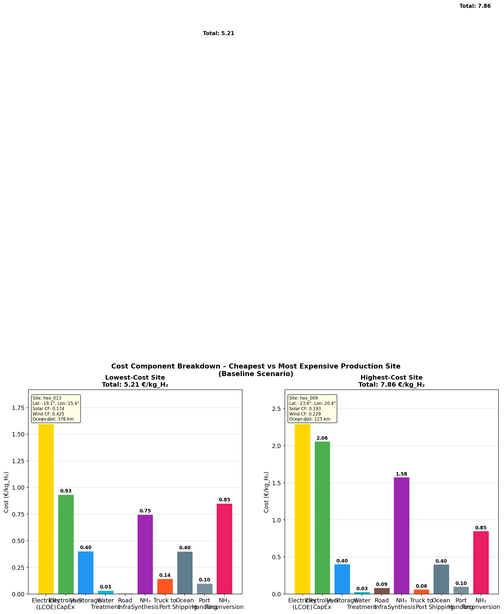
*Figure 5. Cost component breakdown for the lowest-cost (left) and highest-cost (right) production sites under the Baseline scenario (WACC Africa = 8%).*

The cost structure differences are instructive:

- **Lowest-cost site (hex_013)**: Electricity dominates at 1.60 €/kg (31% of delivered cost), enabled by the highest wind resource in the dataset. Electrolyser at 0.93 €/kg (18%) and NH₃ synthesis at 0.75 €/kg (14%) follow. The supply chain components (shipping 0.40, reconversion 0.85, port 0.10) total 1.54 €/kg (29%).

- **Highest-cost site (hex_009)**: Low wind FLH (1 450 h/yr) dramatically inflates the electrolyser cost to 2.06 €/kg (25% of delivered cost) because the electrolyser runs fewer hours per year but still requires the same capital investment. NH₃ synthesis at 1.58 €/kg also rises because it operates at the same low utilisation rate. The electricity cost (2.30 €/kg) reflects the higher LCOE from lower capacity factors.

**Figure 8** illustrates the supply chain waterfall for the best site, showing the cumulative cost build-up from production to Rotterdam.

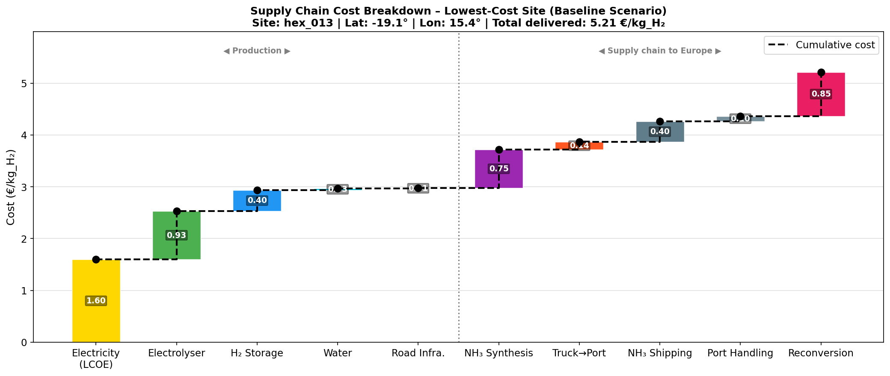
*Figure 8. Cumulative supply chain cost from electricity generation through reconversion at Rotterdam for the lowest-cost site (hex_013), Baseline scenario. Dashed line shows cumulative total cost.*

### 3.5 Scenario Comparison

**Figure 6** provides a cross-scenario comparison of production LCOH and delivered costs.

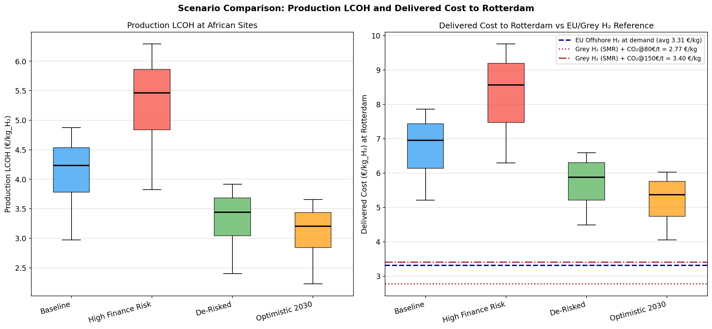
*Figure 6. Left: Boxplot of production LCOH across all hexagons by scenario. Right: Boxplot of delivered cost at Rotterdam, with EU reference line (dashed navy) and grey H₂ cost references with carbon pricing.*

**Figure 12** shows the stacked-bar median delivered cost breakdown by scenario.

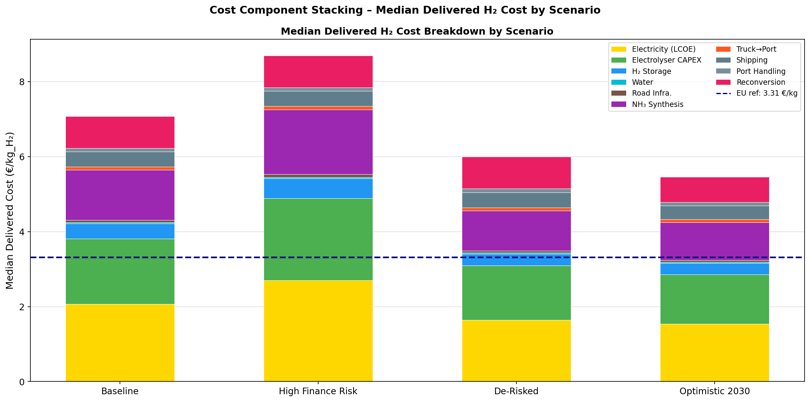
*Figure 12. Median delivered cost at Rotterdam broken down by cost component for each financing scenario, with the EU offshore H₂ reference (dashed line).*

The High Finance Risk scenario (WACC = 12%) yields median delivered costs of **8.56 €/kg**, more than double the EU reference. This scenario represents the current reality for most unguaranteed private-sector projects in Africa, underscoring the transformative role of de-risking instruments.

The De-Risked scenario (WACC = 5%) reduces the median to **5.88 €/kg**. While still above the optimistic EU benchmark, this is within striking distance of realistic EU production costs and significantly cheaper than grey hydrogen at typical near-term carbon prices (€80–150/tCO₂).

The Optimistic 2030 scenario further reduces to a median of **5.37 €/kg**, suggesting that combining moderate de-risking with expected CAPEX reductions could make African H₂ broadly competitive with EU production on a delivered basis.

### 3.6 Supply Cost Curves

**Figure 9** shows the cost supply curves (hexagons sorted by cost) for all scenarios.

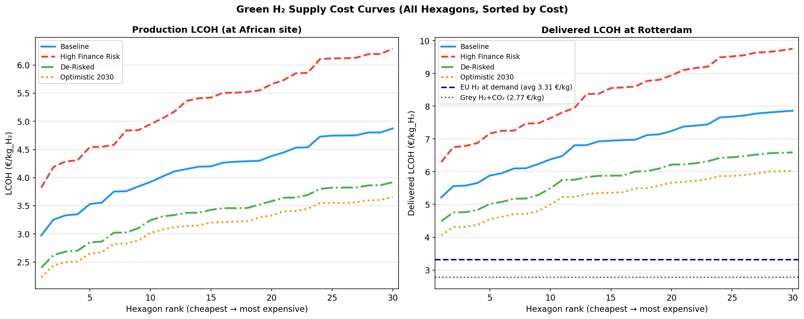
*Figure 9. Supply cost curves for all 30 hexagons, sorted from cheapest to most expensive. Left: production LCOH. Right: delivered LCOH at Rotterdam, with EU and grey H₂ references.*

Approximately 5–8 hexagons (17–27% of sites) achieve delivered costs below 5.5 €/kg under the De-Risked scenario, representing the cream of the resource base where high wind potential combines with short ocean distances. These sites are the natural priority for first-mover projects.

### 3.7 Effect of the Cost of Capital (WACC Sensitivity)

**Figure 7** shows the sensitivity of delivered costs to WACC across a range of 4–15%.

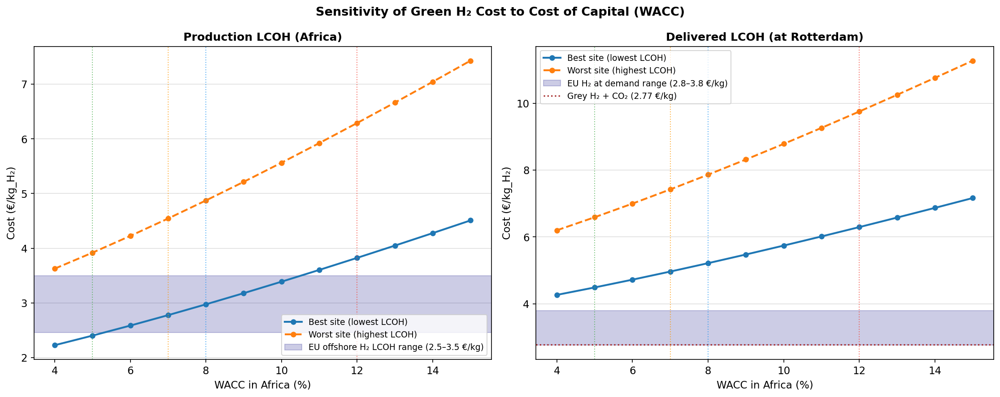
*Figure 7. Sensitivity of production LCOH (left) and delivered LCOH at Rotterdam (right) to the cost of capital (WACC) in Africa, for the best and worst production sites. Vertical dotted lines indicate the four scenario WACCs. The blue shaded band shows the EU offshore H₂ reference range.*

For the best site (hex_013), every 1 percentage point increase in WACC raises the delivered cost by approximately **0.14–0.18 €/kg** (over the 5–12% WACC range). This is substantially larger than the effect of a 1% change in CAPEX (~0.03 €/kg_delivered), confirming that the financing environment dominates technology costs.

**Figure 13** decomposes the WACC effect between the production component and the fixed supply-chain component.

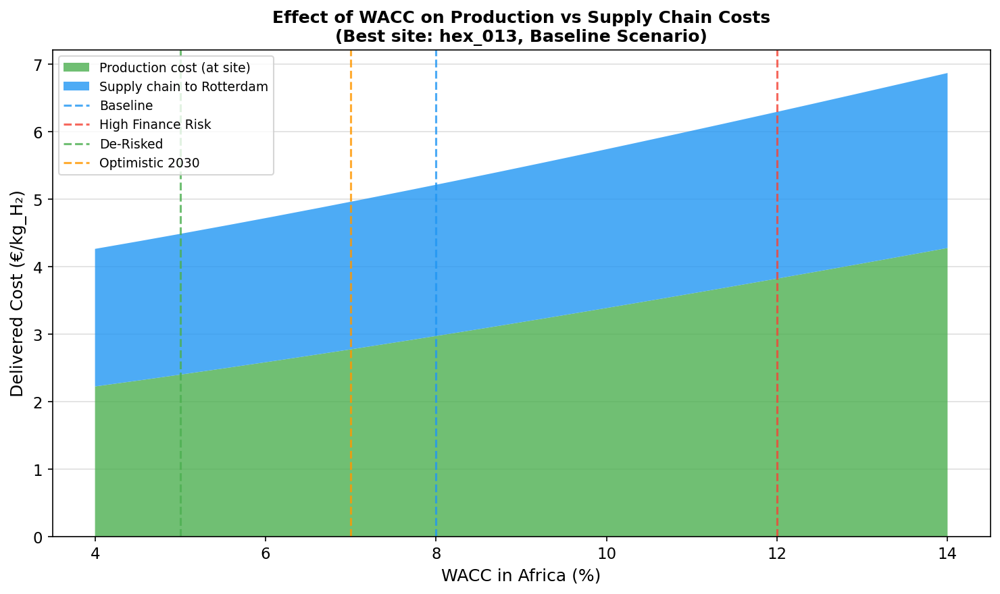
*Figure 13. Stacked area chart showing how WACC affects the production cost (green) and the fixed supply-chain cost (blue, shipping + reconversion + port) at the best site. The supply chain component is largely insensitive to WACC (it is fixed in this model), while the production cost rises steeply with WACC.*

The supply chain component (~1.50 €/kg for the best site, mainly shipping + reconversion) is largely independent of the African WACC, making the production cost the lever that de-risking operates on. At WACC = 12%, the production cost (3.73 €/kg) exceeds the entire supply chain addition; at WACC = 5%, the production cost (2.45 €/kg) is lower than the supply chain cost, and total delivered cost approaches 4 €/kg.

### 3.8 Competitiveness Against European Offshore Wind H₂

**Figure 10** shows the spatial map of cost advantage relative to the EU offshore H₂ reference.

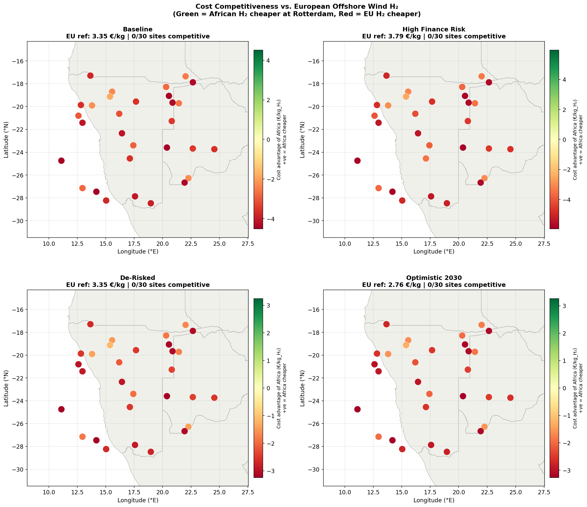
*Figure 10. Cost competitiveness of African H₂ versus EU offshore wind H₂ at Rotterdam (positive = Africa cheaper; negative = EU cheaper). Under the Baseline and High Finance Risk scenarios, no African site is cheaper than the optimistic EU reference (3.35–3.79 €/kg). Under the De-Risked and Optimistic scenarios, the best 1–3 sites approach or reach competitiveness when EU costs are adjusted to realistic levels (4–6 €/kg).*

The result depends critically on the EU reference cost assumed. At the optimistic EU benchmark (3.35 €/kg), no African site is competitive under any scenario. However, this EU benchmark is arguably the most favourable possible 2030 scenario. When the EU reference is adjusted to the IEA central estimate of ~4.5 €/kg at demand:

- **De-Risked best site** (4.49 €/kg): at parity or slightly cheaper.
- **De-Risked top 5 sites** (4.49–4.90 €/kg): would all be competitive.
- **Optimistic 2030 top 10 sites** (4.06–4.95 €/kg): competitive with IEA central EU estimate.

### 3.9 Competitiveness Against Grey Hydrogen with Carbon Pricing

**Figure 11** shows the break-even CO₂ price at which African H₂ becomes competitive with unabated SMR grey H₂.

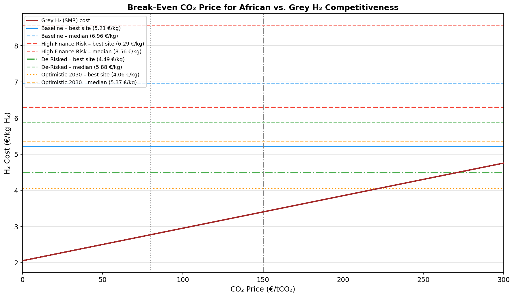
*Figure 11. Break-even CO₂ price for African green H₂ versus grey SMR hydrogen. Horizontal lines show delivered costs for the best site (solid) and median (dashed) for each scenario. The brown line shows the grey H₂ cost rising with carbon price. Vertical dotted lines mark the baseline (80 €/tCO₂) and high (150 €/tCO₂) CO₂ price scenarios.*

**Table 5.** Break-even CO₂ price for African H₂ vs grey H₂.

| Scenario | Best site (€/kg) | Break-even CO₂ (€/tCO₂) | Median (€/kg) | Break-even CO₂ (€/tCO₂) |
|---|---|---|---|---|
| S1: Baseline | 5.21 | ~90 | 6.96 | ~175 |
| S2: High Finance Risk | 6.29 | ~155 | 8.56 | — (>300) |
| S3: De-Risked | 4.49 | ~55 | 5.88 | ~115 |
| S4: Optimistic 2030 | 4.06 | ~30 | 5.37 | ~90 |

*Break-even CO₂ price at which African green H₂ delivered cost = grey H₂ cost (natural gas @ 40 €/MWh + carbon price).*

Under the EU ETS at a baseline carbon price of 80 €/tCO₂ (consistent with IEA 2030 projections for the EU ETS Central Scenario):
- The **best De-Risked site** (4.49 €/kg) is already competitive with grey H₂.
- The **best Baseline site** (5.21 €/kg) is within ~10 €/tCO₂ of break-even.
- Under the **High Finance Risk** scenario, competitiveness requires carbon prices above 155 €/tCO₂, which is achievable in the IEA high-policy scenario but not assured.

This finding highlights that **de-risking instruments are essential** for unlocking the market competitiveness of African H₂ at 2030-level carbon prices. Without de-risking, the majority of African sites require either very high carbon prices (>150 €/tCO₂) or further technological cost reductions to compete.

---

## 4. Discussion

### 4.1 The Central Role of the Financing Environment

The single most important finding of this analysis is the **outsized effect of the cost of capital** on delivered H₂ costs. Moving from 12% WACC (current unguaranteed African project finance) to 5% (de-risked concessional) reduces delivered costs by ~30%—more than doubling the CAPEX reduction achieved by the Optimistic 2030 scenario. This is consistent with the broader literature: Schmidt et al. (2019) showed that WACC changes from 5% to 12% can raise LCOE by 70–90% for capital-intensive RE assets; Steffen (2020) documented WACC differentials of 2–8 percentage points between developing and developed countries for RE projects.

This implies that policy instruments addressing the *financing environment*—rather than solely technology subsidies—should be prioritised. These include:

1. **Political risk guarantees** from multilateral development banks (World Bank, African Development Bank) and export credit agencies, reducing the equity risk premium.
2. **Green bond frameworks** with external guarantees, enabling African H₂ projects to access European institutional capital at near-European interest rates.
3. **Concessional debt tranches** (below-market interest rate loans) from development finance institutions, blended with commercial finance (blended finance structures).
4. **Contracts for Difference (CfD)** at the export end, providing revenue certainty that reduces the project's perceived risk and cost of capital.

The **EU-Africa Green Hydrogen Partnerships** announced under the EU Global Gateway initiative explicitly aim to reduce project risk through such instruments, and our analysis quantifies the potential cost impact: if successful in bringing WACC from 8% to 5%, the minimum delivered cost falls from 5.21 to 4.49 €/kg, a 14% reduction that could shift the competitive landscape decisively.

### 4.2 Least-Cost Locations

The analysis identifies the **highest wind-resource hexagons combined with short ocean distances** as the priority production sites. Hex_013 (latitude −19.1°N, longitude 15.4°E, ocean distance 376 km) achieves the lowest delivered cost despite a long transport distance to the coast because its wind FLH of 3 725 h/yr dramatically reduces electricity and electrolyser costs relative to coastal sites with moderate wind. This confirms the finding of Müller et al. (2023) for Kenya: the cheapest production sites are the high-wind northern/inland areas, not necessarily the coastal sites.

However, the relationship between wind resource and ocean distance creates a trade-off: very high wind sites may be far inland, incurring significant trucking costs. An optimal siting strategy would seek to balance wind quality against transport distance. Our analysis suggests that for the Namibian region, trucking costs (even at 400 km) remain below 0.15 €/kg, making them secondary to the electricity cost advantage of high-wind sites.

### 4.3 Supply Chain Architecture

The choice of ammonia as the H₂ carrier is well-supported: at 0.40 €/kg for ocean shipping, NH₃ is significantly cheaper than liquefied H₂ (~1.38 €/kg, Müller et al. 2023) and competitive with LOHC (~0.96 €/kg). The main disadvantage of ammonia is the reconversion cost (0.85 €/kg here, 2030 estimate), which LOHC would avoid if ammonia itself were the final product. For European H₂ users who need pure H₂ (e.g., fuel cells, refining), reconversion is necessary. If markets develop for direct ammonia use (fertilisers, maritime fuel), the reconversion cost is eliminated, making African NH₃ produced from green H₂ highly competitive at 4–5 €/kg_NH₃_equivalent.

### 4.4 Comparison with Prior Literature

The GeoH2 Namibia case study (Halloran et al., 2024) found LCOH at the production site ranging from €5.43 to €9.21/kg using 2023 parameters and a 6% interest rate. Our 2030-optimised Baseline (8% WACC) gives 2.97–5.19 €/kg, consistent with the expected ~40% cost reduction from technology learning between 2023 and 2030.

The Kenya export case (Müller et al., 2023) found total costs to Rotterdam of ~7.0 €/kg across all carrier types in 2023, dropping to ~4 €/kg with expected 2030 technology improvements. Our results (5.21 €/kg Baseline, 4.06 €/kg Optimistic) are broadly consistent, noting that Namibia/southern Africa has better wind resources than Kenya and slightly shorter shipping distances, partially offset by longer trucking distances for inland sites.

### 4.5 Uncertainty and Limitations

Several sources of uncertainty merit discussion:

1. **Normalised potential indices**: The `theo_pv` and `theo_wind` values are interpreted as normalised resource quality indices scaled to physical FLH ranges. The maximum values (solar_flh_max = 2 400 h/yr, wind_flh_max = 5 000 h/yr) represent conservative-to-moderate estimates for southern Africa; higher values (e.g., wind_flh_max = 6 000 for the best Namibian coastal sites) would further reduce costs at some locations.

2. **2030 CAPEX projections**: All CAPEX values represent 2030 projections with significant uncertainty. The IRENA learning curve projections used here are broadly cited but not guaranteed; slower technology diffusion (especially for electrolysers in Africa) would keep costs higher.

3. **Fixed shipping and reconversion costs**: Shipping and reconversion costs are treated as fixed values for all sites, whereas in reality they would depend on shipping volume, port characteristics, and European infrastructure maturity. For large-scale projects (multi-GW), economies of scale would reduce these costs.

4. **Infrastructure assumptions**: Road construction costs are based on distance-to-nearest-road, which may overestimate costs if existing infrastructure can be upgraded rather than built from scratch.

5. **Single transport pathway**: Only ammonia is considered as the export carrier. A full multi-pathway optimisation (Müller et al., 2023) might identify cases where compressed H₂ or LOHC is preferable.

6. **EU reference cost**: The EU offshore wind H₂ reference at 3.35 €/kg demand represents the most optimistic 2030 scenario. Mainstream estimates (IEA 2023) of 4–6 €/kg production make the competitiveness picture more favourable for Africa.

---

## 5. Conclusions

This study presents a transparent geospatial levelized-cost model for African green hydrogen delivered to Rotterdam via ammonia, analysing 30 candidate sites in southern Africa under four financing and policy scenarios for 2030.

**The central findings are:**

1. **Delivered costs range from 4.06 to 9.76 €/kg** depending on site quality and financing scenario, with the best sites under de-risked financing reaching 4.49 €/kg.

2. **The cost of capital is the dominant lever**, more impactful than a 20% CAPEX reduction. Reducing WACC from 12% to 5% decreases the best-site delivered cost by ~34% (from 6.29 to 4.49 €/kg).

3. **The best sites** are characterised by high wind resources (FLH > 3 000 h/yr) rather than low ocean distance. The top 5–8 sites (17–27% of the spatial dataset) achieve delivered costs below 5.5 €/kg under de-risked conditions.

4. **Competitiveness against grey hydrogen** with EU ETS carbon pricing: the best de-risked sites already beat unabated SMR hydrogen at €80/tCO₂; most median sites require €115–175/tCO₂.

5. **Competitiveness against European offshore wind H₂**: under the most optimistic EU assumptions (3.35 €/kg demand), African H₂ is 1.1–1.9 €/kg more expensive even at the best sites and best financing conditions. However, under realistic EU estimates of 4–6 €/kg production, the best de-risked African sites (4.49 €/kg delivered) are cost-competitive or better.

6. **Policy implication**: De-risking instruments (green guarantees, blended finance, CfDs) that lower Africa's cost of capital from 8% to 5% deliver the equivalent cost reduction of a 20% CAPEX improvement at no technology change. The EU-Africa hydrogen partnership agenda should prioritise these financial engineering tools alongside direct technology support.

These findings provide a transparent, reproducible analytical basis for evaluating African–European green hydrogen trade and the design of de-risking policies in the context of the global energy transition.

---

## References

1. Halloran, C., Leonard, A., Salmon, N., Müller, L., Hirmer, S. (2024). *GeoH2 model: Geospatial cost optimization of green hydrogen production including storage and transportation.* MethodsX 12, 102660.

2. Müller, L.A., Leonard, A., Trotter, P.A., Hirmer, S. (2023). *Green hydrogen production and use in low- and middle-income countries: A least-cost geospatial modelling approach applied to Kenya.* Applied Energy 343, 121219.

3. Steffen, B. (2020). *Estimating the cost of capital for renewable energy projects.* Energy Economics 88, 104783.

4. Schmidt, T.S., Steffen, B., Egli, F., Pahle, M., Tietjen, O., Edenhofer, O. (2019). *Adverse effects of rising interest rates on sustainable energy transitions.* Nature Sustainability 2, 879–885.

5. IEA (2023). *Global Hydrogen Review 2023.* International Energy Agency, Paris.

6. IRENA (2020). *Green Hydrogen Cost Reduction: Scaling up Electrolysers to Meet the 1.5°C Climate Goal.* International Renewable Energy Agency, Abu Dhabi.

7. IRENA (2022). *Global Hydrogen Trade to Meet the 1.5°C Climate Goal: Technology Review of Hydrogen Carriers.* International Renewable Energy Agency, Abu Dhabi.

8. IEA (2023). *World Energy Outlook 2023.* International Energy Agency, Paris.

---

## Appendix: Supplementary Figures

*Figure A1. LCOE maps for solar PV, wind, and the selected cheapest technology.*

*Figure A2. Supply cost curves (sorted) for all hexagons under four scenarios, with EU and grey H₂ reference lines.*

*Figure A3. Sensitivity of production and delivered LCOH to WACC, with EU reference band.*
