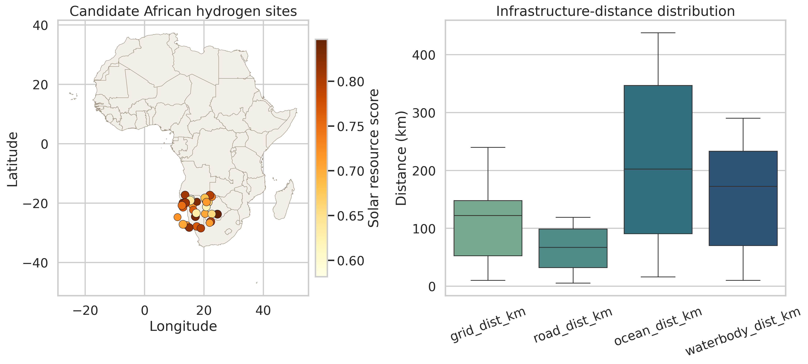
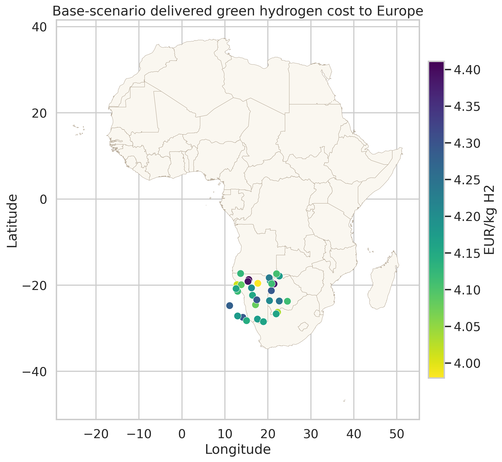
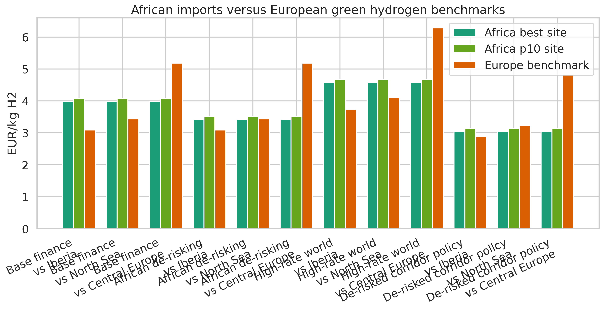
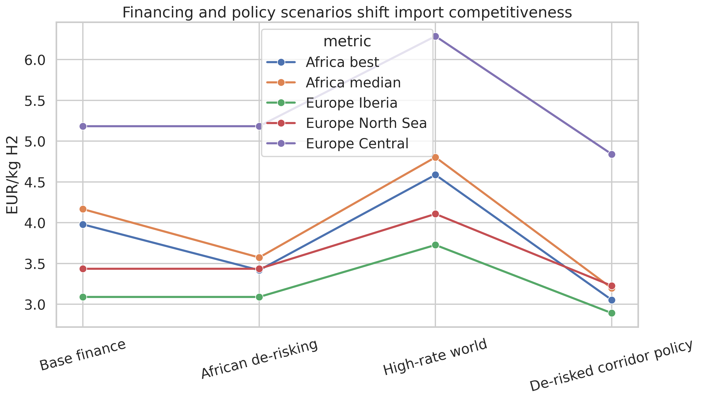
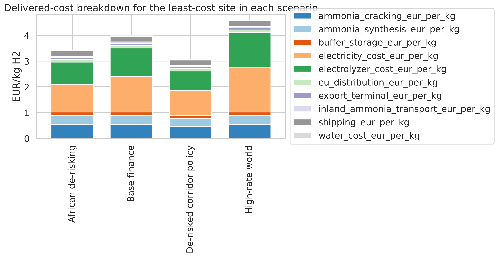
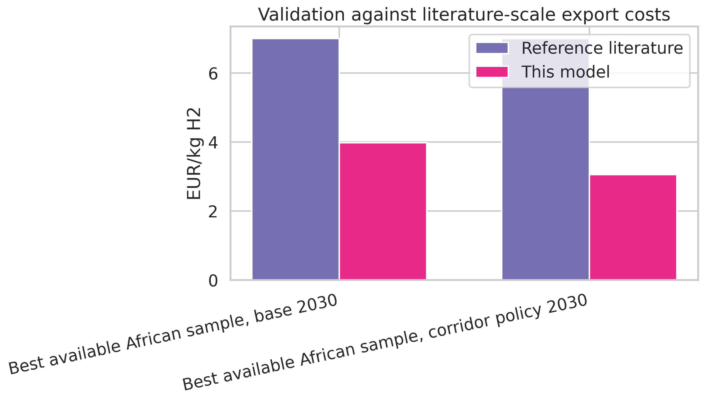

# Transparent geospatial levelized-cost model for African green hydrogen exports to Europe by 2030

## Abstract

This study builds a transparent, reproducible geospatial levelized-cost model to estimate the delivered cost of green hydrogen exported from African candidate sites to Europe by 2030 via ammonia synthesis, ocean shipping, and ammonia cracking. The model is intentionally reduced-form: it combines site-level renewable-resource quality and infrastructure distances from the provided geospatial dataset with explicit assumptions for 2030 technology CAPEX, weighted-average cost of capital (WACC), water supply, inland logistics, ammonia conversion, shipping, and European reconversion. Four scenarios are evaluated: `base`, `de_risked_africa`, `high_rate_world`, and `corridor_policy`. Across the 30-site sample, the lowest delivered cost falls from `€3.98/kg-H2` in the base case to `€3.42/kg-H2` with African de-risking and `€3.05/kg-H2` under a combined de-risking-plus-corridor-policy case; it rises to `€4.59/kg-H2` in a high-interest-rate world. In this sample, the least-cost locations are concentrated in Namibia and nearby southern African sites. Relative to stylized European domestic production benchmarks, African imports are not competitive against an Iberian benchmark in any scenario, become competitive against a North Sea benchmark only marginally under pure de-risking and broadly under corridor support, and remain cheaper than a Central European benchmark in all scenarios. The strongest conclusion is therefore not that African exports dominate Europe universally, but that financing conditions are first-order determinants of competitiveness: de-risking and corridor policies move African imports from clearly uncompetitive to potentially competitive against higher-cost parts of Europe.

## 1. Research question

The task is to estimate the delivered cost of African green hydrogen to Europe by 2030, identify least-cost sites, and quantify how financing and policy conditions alter competitiveness relative to producing green hydrogen in Europe.

The model is guided by three local literature inputs:

- Halloran et al. (2024), which describes the GeoH2 geospatial production-transport-conversion framework.
- Müller et al. (2023), which shows how a least-cost geospatial hydrogen export model can be used for ammonia export to Rotterdam.
- Steffen (2020) and Schmidt et al. (2019), which show that cost of capital and interest-rate conditions materially change renewable-energy economics.

## 2. Data and scope

The main dataset is `data/hex_final_NA_min.csv`, which contains 30 candidate sites with latitude, longitude, solar score, wind score, and distances to grid, roads, ocean, and inland water. Spatial joins against the provided Natural Earth shapefile show that the sample is not pan-African; it is concentrated in southern Africa and mostly falls in Namibia, Botswana, Angola, and South Africa, with a few points not matched to a country polygon because of geometric edge effects.

This matters for interpretation. The report does **not** claim to identify the least-cost locations in all of Africa. It identifies least-cost locations in the provided African sample.

Figure 1 summarizes the candidate-site geography and infrastructure-distance distribution.

## 3. Methodology

### 3.1 System boundary

For each African site, the delivered cost to Europe is modeled as:

`Delivered cost = renewable electricity + electrolyzer + water + local H2 buffer + ammonia synthesis + inland ammonia transport to port + export terminal + ocean shipping + ammonia cracking in Europe + local European distribution`

The European comparator is modeled as green hydrogen produced domestically in Europe and delivered locally, without the ammonia export chain. Three stylized European production environments are used:

- `Iberia`: stronger solar, moderate wind
- `North Sea`: strong wind
- `Central Europe`: weaker mixed resources

### 3.2 Renewable production block

The dataset provides solar and wind resource scores, not directly plant capacity factors. To keep the model transparent and reproducible, the scores are mapped to stylized 2030 capacity factors:

- `PV CF = 0.18 + 0.18 * theo_pv`
- `Wind CF = 0.18 + 0.36 * theo_wind`

This yields African PV capacity factors around `0.28-0.33` and wind capacity factors around `0.28-0.45`, which are plausible for good southern African locations.

For each site and scenario, the script searches over PV/wind energy shares from 0 to 1 and chooses the least-cost mix. In the present sample, wind-only plants dominate because the wind resource dispersion is strong and financing costs penalize low-utilization electrolyzers. The renewable-electricity block is annualized with standard capital-recovery factors:

`LCOE = annualized CAPEX + fixed OPEX / annual MWh`

The electrolyzer block is then computed from:

- `50 kWh/kg-H2` specific electricity use
- scenario-specific electrolyzer CAPEX
- electrolyzer utilization inferred from the chosen renewable mix

### 3.3 Water and access infrastructure

Water costs are calculated from the cheaper of:

- freshwater treatment plus inland water pipeline
- desalination plus ocean-water pipeline

Road spur costs are annualized from site-to-road distance, while inland ammonia logistics costs scale with site-to-ocean distance.

### 3.4 Ammonia export chain

The export chain is represented explicitly with the following 2030 unit costs:

- ammonia synthesis: `€0.35/kg-H2`
- export terminal: `€0.08/kg-H2`
- shipping: `€0.000026/kg-H2-km`
- ammonia cracking: `€0.55/kg-H2`
- European distribution: `€0.10/kg-H2`

The shipping leg assumes `8,500 km` from southern African export ports to Rotterdam. This is intentionally stylized and kept constant across sites because the provided dataset does not include explicit African port choices or Europe-side landing points.

### 3.5 Financing and policy scenarios

Four scenarios are evaluated:

| Scenario | Africa WACC | Europe WACC | Policy interpretation |
|---|---:|---:|---|
| Base finance | 12% | 6% | Fragmented market finance, no targeted support |
| African de-risking | 8% | 6% | Concessional finance, guarantees, lower perceived country risk |
| High-rate world | 16% | 9% | Tighter global monetary conditions |
| De-risked corridor policy | 7% | 5% | De-risking plus 15% reduction in infrastructure/conversion CAPEX and 10% African electrolyzer CAPEX support |

These values are not meant as forecasts of actual 2030 WACC in specific countries. They are transparent scenario levers chosen to isolate how financing conditions change competitiveness, consistent with the message of Steffen (2020) and Schmidt et al. (2019).

## 4. Implementation and reproducibility

The full analysis is implemented in:

- `code/run_analysis.py`
- `code/assumptions.json`

The script reads the inputs, computes all scenario outputs, saves tables to `outputs/`, and writes six figures to `report/images/`.

## 5. Results

### 5.1 Least-cost locations

Figure 2 maps base-scenario delivered cost to Europe. The least-cost cluster is in Namibia and nearby southern African inland sites with strong wind scores and relatively manageable distance to coast.

The best-performing site in all four scenarios is `hex_007` in Namibia. The next-best sites are consistently another Namibian point (`hex_006`) and a Botswana point (`hex_015`), indicating that the low-cost frontier is spatially concentrated rather than broadly distributed across the sample.

### 5.2 Scenario outcomes

Table 1 summarizes the core results.

| Scenario | Best delivered cost (€/kg-H2) | Median delivered cost (€/kg-H2) | p10 delivered cost (€/kg-H2) | p90 delivered cost (€/kg-H2) |
|---|---:|---:|---:|---:|
| Base finance | 3.98 | 4.17 | 4.08 | 4.30 |
| African de-risking | 3.42 | 3.57 | 3.52 | 3.69 |
| High-rate world | 4.59 | 4.80 | 4.68 | 4.98 |
| De-risked corridor policy | 3.05 | 3.20 | 3.14 | 3.31 |

Three patterns stand out.

First, financing is a first-order driver of delivered cost. Moving from the base case to African de-risking reduces the best-site delivered cost from `€3.98/kg-H2` to `€3.42/kg-H2`, a decline of roughly `14%`. Moving from the base case to the corridor-policy case reduces it further to `€3.05/kg-H2`, a decline of about `23%`.

Second, tighter money materially weakens import competitiveness. In the `high_rate_world` scenario, the best-site cost rises to `€4.59/kg-H2`, around `15%` above the base case.

Third, cost dispersion inside the sample is modest compared with the financing effect. In the base case, the gap from the best site to the median site is only about `€0.19/kg-H2`, whereas the shift from base finance to high rates is about `€0.61/kg-H2` at the frontier site.

Figure 3 compares African imports with the three European benchmarks.

Figure 4 shows the same scenario logic as a sensitivity plot.

### 5.3 Competitiveness relative to Europe

The European benchmark results are:

| Scenario | Iberia (€/kg-H2) | North Sea (€/kg-H2) | Central Europe (€/kg-H2) |
|---|---:|---:|---:|
| Base finance | 3.09 | 3.44 | 5.18 |
| African de-risking | 3.09 | 3.44 | 5.18 |
| High-rate world | 3.73 | 4.11 | 6.29 |
| De-risked corridor policy | 2.89 | 3.23 | 4.84 |

Relative competitiveness is therefore heterogeneous:

- Against `Iberia`, African imports are never cheaper in this model.
- Against the `North Sea`, imports are not competitive in the base case, almost break even under African de-risking, and become competitive for `70%` of sites under corridor support.
- Against `Central Europe`, all sampled African sites are competitive in all scenarios.

This is the central quantitative answer to the task. African ammonia-based imports do not beat the best renewable parts of Europe in this stylized comparison, but they can beat weaker or more capital-cost-sensitive European regions, and financing conditions decide whether that competitiveness is marginal or broad.

### 5.4 Cost structure

Figure 5 decomposes the delivered cost of the least-cost site in each scenario.

In the base case at the Namibian frontier site:

- electricity contributes `€1.39/kg-H2` or about `35%`
- electrolyzer CAPEX contributes `€1.10/kg-H2` or about `28%`
- ammonia cracking contributes `€0.55/kg-H2` or about `14%`
- ammonia synthesis contributes `€0.35/kg-H2`
- shipping contributes `€0.22/kg-H2`

Water is negligible in this sample because treatment volumes are small relative to total hydrogen mass and the assumed water-infrastructure annuity is modest at the modeled production scale. The practical implication is that this export chain is driven mostly by financing-sensitive power and electrolyzer costs, plus a relatively stable conversion/reconversion penalty.

## 6. Validation and interpretation

Müller et al. (2023) report a present-day Kenya-to-Rotterdam export case near `€7/kg-H2`. The present model yields `€3.98/kg-H2` for the best site in the base 2030 scenario and `€3.05/kg-H2` in the corridor-policy scenario.

This gap should not be read as a contradiction. It comes from three differences:

- the literature case is based on a different geography and earlier techno-economic conditions
- this model assumes 2030 technology cost reductions
- the provided sample contains especially strong southern African sites

Figure 6 visualizes this comparison.

The model therefore appears directionally consistent with the local literature: 2030 costs should be materially below today’s or early-2020s export costs, but the degree of improvement depends strongly on cost of capital.

## 7. Discussion

### 7.1 What drives least-cost African exports?

The least-cost locations in this sample are wind-dominant southern African sites, especially in Namibia. This result is intuitive under the model structure because:

- stronger wind raises electrolyzer utilization more than solar in the mapped capacity-factor ranges
- inland logistics penalties are present but not large enough to offset the wind advantage
- higher WACC punishes low-capacity-factor designs, which further favors wind-rich sites

### 7.2 What does de-risking actually buy?

De-risking is valuable because it acts on the largest cost blocks simultaneously. Lower WACC reduces renewable-electricity LCOE and lowers electrolyzer annuity, so the effect compounds. In the frontier site:

- electricity plus electrolyzer cost falls from `€2.49/kg-H2` in the base case to `€1.94/kg-H2` under African de-risking
- it falls further to `€1.73/kg-H2` under corridor policy

This is why financial de-risking changes competitiveness more than small changes in inland transport or water access.

### 7.3 Policy implications

The results point to three practical policy messages.

First, African export competitiveness is unlikely to rest on resource quality alone. Strong resource sites still lose to a favorable Iberian benchmark unless financing and logistics are improved substantially.

Second, import corridors can matter. When de-risking is paired with targeted infrastructure and conversion support, the African frontier enters the same cost range as wind-based European production and becomes competitive for many sites relative to the North Sea benchmark.

Third, macro-financial conditions can undo technology learning. A high-rate environment adds more than `€0.6/kg-H2` to frontier imports in this sample, which is enough to reverse competitiveness gains against mid-cost European supply.

## 8. Limitations

The model is transparent, but it is not a full dispatch optimization. The main limitations are:

- The African input dataset is only 30 sites and is geographically concentrated in southern Africa.
- Resource inputs are scalar scores rather than hourly renewable profiles, so electrolyzer utilization is a stylized reduced-form estimate.
- Port choice and shipping distance are simplified into a constant southern-Africa-to-Rotterdam route.
- The European comparison is based on three stylized benchmark regions rather than a full European geospatial dataset.
- Land constraints, curtailment economics, storage dynamics, and port congestion are not modeled explicitly.

These limitations mean the numerical results should be interpreted as transparent scenario estimates, not as bankable project costs.

## 9. Conclusion

Within the provided African site sample, southern African wind-rich locations, especially in Namibia, are the least-cost candidates for exporting green hydrogen to Europe via ammonia by 2030. The delivered-cost frontier is around `€4.0/kg-H2` in the base finance case, `€3.4/kg-H2` with African de-risking, and `€3.1/kg-H2` under a stronger corridor-policy package, while a high-rate world pushes the frontier to `€4.6/kg-H2`.

The competitiveness result is conditional rather than universal. African imports do not beat a favorable Iberian domestic green-hydrogen benchmark in any scenario in this study, but they can challenge or beat more capital-intensive European supply, especially North Sea and Central European production, when financing risk is reduced. The dominant lesson is that cost of capital and de-risking policy are not secondary sensitivities; they are central determinants of whether African green hydrogen imports to Europe are niche, marginal, or genuinely competitive by 2030.

## References

- Halloran, C., Leonard, A., Salmon, N., Müller, L., and Hirmer, S. (2024). *GeoH2 model: Geospatial cost optimization of green hydrogen production including storage and transportation*.
- Müller, L. A., Leonard, A., Trotter, P. A., and Hirmer, S. (2023). *Green hydrogen production and use in low- and middle-income countries: A least-cost geospatial modelling approach applied to Kenya*.
- Steffen, B. (2020). *Estimating the cost of capital for renewable energy projects*.
- Schmidt, T. S., Steffen, B., Egli, F., Pahle, M., Tietjen, O., and Edenhofer, O. (2019). *Adverse effects of rising interest rates on sustainable energy transitions*.
