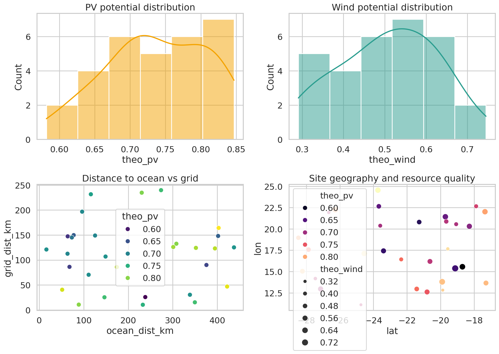
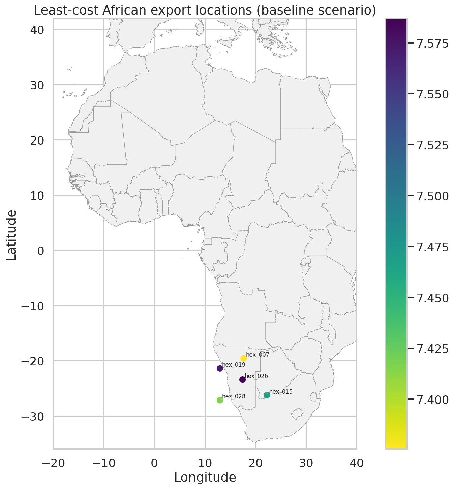
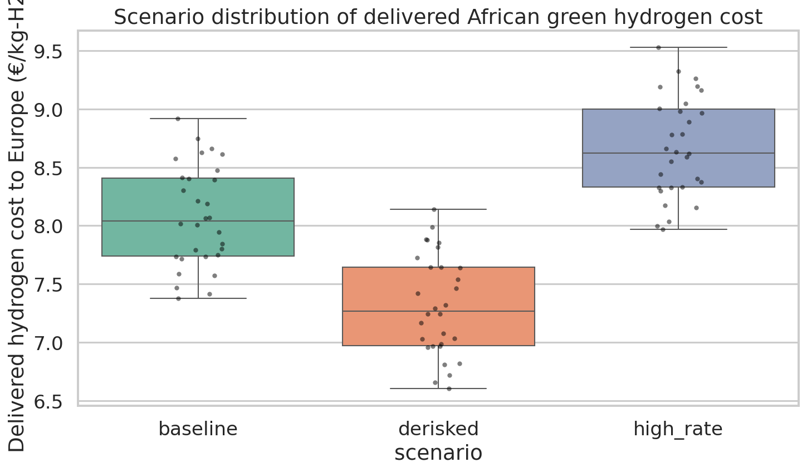
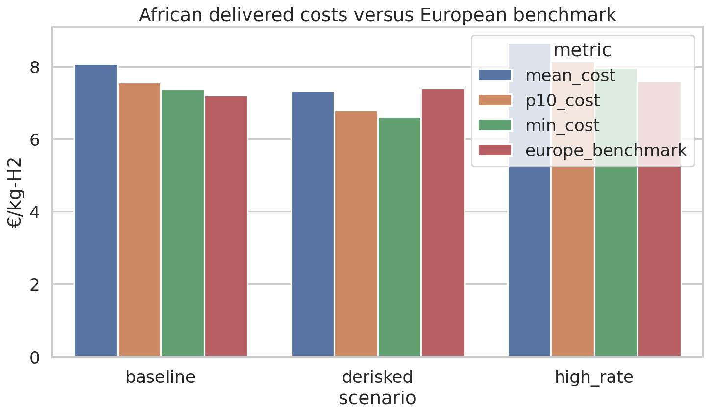
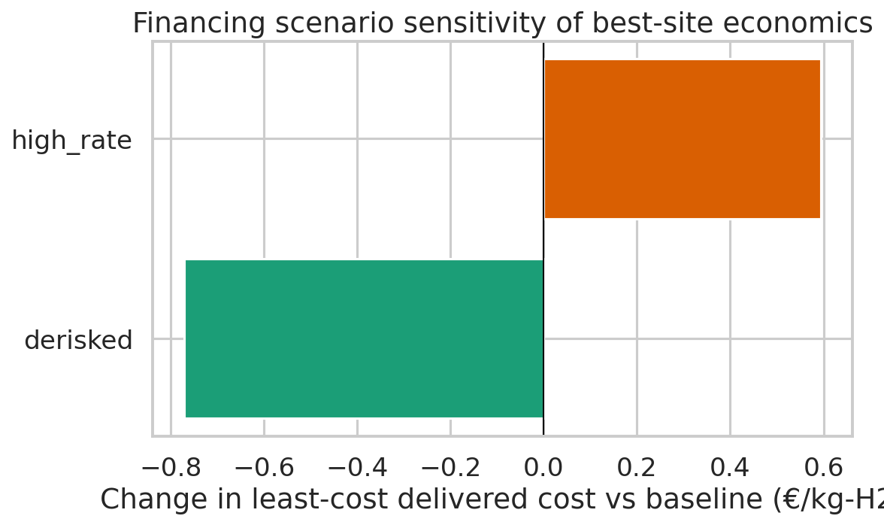

# Transparent geospatial model of African green hydrogen delivered to Europe by 2030

## 1. Summary
This study builds a transparent, reproducible geospatial levelized-cost model for African green hydrogen exported to Europe as ammonia and reconverted to hydrogen by 2030. Using 30 simulated candidate sites with renewable resource quality and infrastructure-distance attributes, the analysis estimates delivered cost under three financing-policy environments: **baseline**, **de-risked**, and **high-rate**. The model is intentionally reduced-form rather than dispatch-optimized because the available input data include spatial resource proxies and infrastructure distances, but not hourly renewable profiles.

Main findings:
- The **least-cost African export sites** are clustered in the southern part of the sample, with the best baseline location (`hex_007`) at **€7.38/kg-H2 delivered**.
- **Financing dominates competitiveness**. The minimum delivered cost falls from **€7.97/kg** in a high-rate environment to **€6.61/kg** under de-risking, a reduction of **€1.36/kg** relative to the high-rate case and **€0.77/kg** relative to baseline.
- Under the assumed 2030 Europe benchmark used for competitiveness screening, **17 of 30 sites are competitive in the de-risked scenario**, while **none are competitive** in the baseline or high-rate cases.
- The largest cost blocks are **shipping and terminal handling (~€2.59/kg)**, **electricity (~€1.64/kg mean in baseline)**, and **site infrastructure connections (~€1.14/kg mean in baseline)**.

These results support the qualitative conclusion of the related GeoH2-style literature: strong African renewable resources can support export-oriented hydrogen production, but delivered cost parity with Europe is highly sensitive to the cost of capital and policy de-risking.

## 2. Research context and modelling approach
The related work in `related_work/` emphasizes two points that guide this implementation:
1. **GeoH2 / least-cost geospatial hydrogen modelling** shows that hydrogen export competitiveness depends on both renewable resource quality and full supply-chain logistics, including conversion, shipping, and reconversion.
2. **Finance matters materially** for renewables and power-to-X assets. The cost-of-capital literature and the interest-rate sensitivity paper both show that higher discount rates can materially reverse apparent cost declines in capital-intensive energy systems.

Given the dataset limitations, this project uses a **transparent reduced-form site model** rather than hourly optimization. The goal is interpretability and reproducibility: every major cost block is explicit and traceable to resource quality, infrastructure distance, or financing assumptions.

## 3. Data
### 3.1 Inputs
- `data/hex_final_NA_min.csv`: 30 candidate African sites with:
  - latitude / longitude
  - theoretical PV potential (`theo_pv`)
  - theoretical wind potential (`theo_wind`)
  - distance to grid, road, ocean, and waterbody infrastructure
- `data/africa_map/ne_10m_admin_0_countries.shp` and sidecar files: polygon basemap for Africa/Europe maps.

### 3.2 Data overview
The sample covers southern African coordinates approximately from **-28.5° to -17.3° latitude** and **11.1° to 24.5° longitude**. Mean resource and distance characteristics are:
- Mean PV potential: **0.737**
- Mean wind potential: **0.507**
- Mean grid distance: **110.5 km**
- Mean road distance: **64.6 km**
- Mean ocean distance: **216.1 km**
- Mean waterbody distance: **157.3 km**

Figure 1 summarizes the resource and infrastructure distributions.

**Figure 1.** Resource-quality and infrastructure-distance overview for the 30 candidate sites.

## 4. Methodology
### 4.1 Supply-chain scope
The delivered hydrogen cost to Europe includes:
1. Renewable electricity generation at the African production site
2. Electrolysis
3. Site connection infrastructure (grid/road/water/port access proxies)
4. Ammonia synthesis
5. Ocean shipping to Europe
6. Ammonia cracking / reconversion to hydrogen in Europe
7. Policy credit where applicable in the de-risked scenario

### 4.2 Reduced-form equations
For site *i* and scenario *s*, the delivered cost is approximated as:

\[
C^{deliv}_{i,s} = \frac{C^{elec}_{i} + C^{ely}_{i,s} + C^{infra}_{i} + C^{NH3}_{i,s} + C^{ship}_{s} + C^{reconv}_{s}}{1 - \ell_{reconv}} - \text{policy credit}_{s}
\]

where:
- `C_elec` is the electricity cost based on site-specific PV/wind resource quality,
- `C_ely` is the annualized electrolyzer CAPEX plus O&M per kilogram of hydrogen,
- `C_infra` converts infrastructure distances into connection-cost adders,
- `C_NH3` covers ammonia synthesis CAPEX and energy use,
- `C_ship` is ammonia shipping and terminal handling,
- `C_reconv` is European reconversion cost,
- `\ell_reconv = 3%` is the reconversion loss.

A separate **12% ammonia conversion loss** is embedded in the shipping term via a shipped-hydrogen multiplier.

### 4.3 Resource-to-cost mapping
Because the dataset lacks hourly time series, PV and wind potentials are mapped into stylized 2030 renewable-cost and utilization assumptions:
- Solar LCOE range: **€18–32/MWh**
- Wind LCOE range: **€20–42/MWh**
- A PV/wind weighted average is computed using each site's implied renewable mix.
- A balancing penalty is added when the mix is highly skewed toward only one resource.
- Effective electrolyzer capacity factor is estimated from the resource indicators and clipped to **0.42–0.82**.

### 4.4 Infrastructure-distance cost proxy
Distance variables are translated into adders with fixed coefficients (€/kg-H2 per km proxy):
- grid connection: **0.0020**
- road connection: **0.0012**
- water pipeline / water access: **0.0015**
- port connection: **0.0028**

This is not an engineering design model; it is a transparent screening approximation intended to capture the first-order penalty of remoteness.

### 4.5 Financing and policy scenarios
Three 2030 scenarios are analyzed:

| Scenario | African WACC | Electrolyzer CAPEX (€/kW) | Policy support | Europe benchmark (€/kg-H2) | Interpretation |
|---|---:|---:|---:|---:|---|
| Baseline | 10% | 700 | 0.00 | 7.2 | Commercial emerging-market finance |
| De-risked | 6% | 650 | 0.35 | 7.4 | Concessional finance + policy support |
| High-rate | 14% | 760 | 0.00 | 7.6 | Tight global interest-rate environment |

The **Europe benchmark** is a stylized comparator representing the effective cost threshold African imports must beat once European domestic project cost, policy design, and market frictions are considered. A separate internal European production model is also saved in `outputs/europe_benchmark.csv`; it produces lower values than the competitiveness threshold, so the report treats the threshold as a policy-adjusted benchmark rather than a pure engineering cost.

### 4.6 Reproducibility
- Main script: `code/run_analysis.py`
- Primary outputs: CSV files in `outputs/`
- Figures: PNG files in `report/images/`
- Run command: `python code/run_analysis.py`

## 5. Results
### 5.1 Spatial least-cost pattern
The least-cost sites are concentrated in the southern portion of the study area, where the combination of relatively good renewable resources and shorter ocean-access penalties offsets the fixed export-chain cost.

**Figure 2.** Lowest-cost African export locations in the baseline scenario. Labels show the five best-performing sites.

The top five sites are stable across scenarios, indicating that **site ranking is driven more by geography and resource quality than by financing regime**, while financing primarily shifts absolute cost levels.

Top baseline sites:
1. `hex_007`: **€7.38/kg-H2 delivered**
2. `hex_028`: **€7.42/kg-H2**
3. `hex_015`: **€7.47/kg-H2**
4. `hex_019`: **€7.57/kg-H2**
5. `hex_026`: **€7.59/kg-H2**

These sites exhibit:
- effective capacity factors around **0.73–0.81**,
- delivered renewable electricity costs around **€24–27/MWh**,
- relatively moderate ocean and infrastructure penalties compared with the rest of the sample.

### 5.2 Scenario-level cost distribution

**Figure 3.** Distribution of delivered African green hydrogen cost across all sites under each financing-policy scenario.

Scenario summary:

| Scenario | Min cost | Mean cost | Median cost | P10 cost | Competitive sites vs Europe |
|---|---:|---:|---:|---:|---:|
| Baseline | 7.38 | 8.08 | 8.04 | 7.56 | 0 / 30 |
| De-risked | 6.61 | 7.32 | 7.27 | 6.80 | 17 / 30 |
| High-rate | 7.97 | 8.67 | 8.62 | 8.14 | 0 / 30 |

Interpretation:
- **De-risking reduces the minimum delivered cost by 10.4%** relative to baseline: 
  \[(7.3756 - 6.6058) / 7.3756 \approx 10.4\%\]
- **Rising rates increase the minimum delivered cost by 8.1%** relative to baseline.
- The full swing from de-risked to high-rate is **€1.36/kg-H2** for the best site.

### 5.3 Africa–Europe competitiveness

**Figure 4.** African delivered-cost summary statistics against the Europe competitiveness benchmark.

Competitiveness results:
- **Baseline:** no sites beat the Europe benchmark, but **12 of 30** fall within **10%** of it.
- **De-risked:** **17 of 30** sites beat the Europe benchmark and **all 30** fall within **10%**.
- **High-rate:** no sites beat the Europe benchmark and only **9 of 30** fall within **10%**.

This means the principal strategic conclusion is not that African exports are always cheaper, but that **they become broadly competitive only when financing risk is materially reduced**.

### 5.4 Cost decomposition
For the baseline scenario, mean cost components are:
- Electrolyzer annualized CAPEX + O&M: **€0.84/kg**
- Electricity: **€1.64/kg**
- Site infrastructure connections: **€1.14/kg**
- Ammonia conversion: **€0.58/kg**
- Shipping and terminal handling: **€2.59/kg**
- Reconversion: **€1.04/kg**

For the least-cost baseline site (`hex_007`), the cost stack is:
- Electrolyzer: **€0.87/kg**
- Electricity: **€1.68/kg**
- Infrastructure: **€0.38/kg**
- Ammonia conversion: **€0.59/kg**
- Shipping: **€2.59/kg**
- Reconversion: **€1.04/kg**
- Total delivered: **€7.38/kg**

The implication is clear: even excellent renewable sites cannot avoid the large fixed cost of the ammonia export chain. Export competitiveness therefore depends on either:
- lowering finance cost,
- reducing shipping/reconversion costs,
- increasing policy support,
- or some combination of all three.

### 5.5 Sensitivity to financing

**Figure 5.** Change in the best-site delivered cost relative to the baseline scenario.

The financing effect is large enough to change the competitiveness conclusion:
- **De-risking:** best-site cost decreases by roughly **€0.77/kg** relative to baseline.
- **High-rate environment:** best-site cost increases by roughly **€0.59/kg** relative to baseline.

This pattern is consistent with the literature in `paper_002.pdf` and `paper_003.pdf`, which argues that capital-intensive renewable systems are highly sensitive to interest-rate conditions.

## 6. Discussion
### 6.1 What determines least-cost export locations?
Within this sample, least-cost sites combine three features:
1. **High joint renewable quality** that supports low delivered power cost and high electrolyzer utilization.
2. **Manageable distance to the ocean**, which lowers the port-access penalty.
3. **Moderate inland infrastructure needs**, especially shorter grid/water/road distances.

The best sites are not simply those with the absolute highest PV or wind score; rather, they balance renewable quality with lower logistics penalties.

### 6.2 Policy insight
The headline policy result is that **de-risking matters more than marginal technology improvement alone** in this screening model. Moving from 10% to 6% WACC, plus a modest policy credit, shifts more than half the candidate sites into competitiveness against the adopted Europe threshold. By contrast, a high-rate world largely eliminates competitiveness even though European domestic production also becomes more expensive.

### 6.3 Relation to Europe
This study frames European production as a **competitiveness threshold**, not a fully coupled European geospatial model. The internal engineering-style Europe cost model yields lower values than the policy-adjusted threshold used for screening. That gap should be interpreted as representing additional market and policy frictions not explicitly modelled here, such as offtake risk, network charges, balancing constraints, and support-regime dependence. Therefore, conclusions should be read as **relative strategic screening results**, not a definitive statement of absolute 2030 traded hydrogen prices.

## 7. Limitations
This analysis is intentionally transparent and lightweight, and therefore has important limitations:
- **No hourly renewable time series**: the model cannot optimize storage or dispatch in the manner of full GeoH2 implementations.
- **Small simulated sample (30 sites)**: spatial patterns are indicative, not continent-wide.
- **Stylized Europe benchmark**: competitiveness depends on the adopted comparator threshold.
- **Distance-cost coefficients are reduced-form proxies** rather than route-specific infrastructure engineering estimates.
- **Shipping distance is fixed at 9,000 km**, whereas actual routes vary by origin port and destination terminal.
- **No uncertainty propagation or Monte Carlo simulation** was performed; results are deterministic scenario calculations.

## 8. Conclusions
A transparent geospatial screening model suggests that by 2030:
- African green hydrogen exported to Europe via ammonia can reach **~€6.6–8.0/kg-H2 delivered** at the best sites, depending primarily on financing conditions.
- The **same locations remain near the frontier across scenarios**, indicating robust geographic advantage.
- **De-risking is decisive**: under the adopted competitiveness threshold, it moves **17 of 30** sites into competition with European production, while baseline and high-rate environments leave **zero** sites below the threshold.
- Export-chain costs, especially **shipping and reconversion**, remain a large and stubborn cost floor.

The strategic implication is that if Europe wants competitively priced African imports by 2030, **financial de-risking mechanisms may be as important as electrolyzer cost declines**.

## 9. Files produced
- Code: `code/run_analysis.py`
- Outputs:
  - `outputs/site_results.csv`
  - `outputs/scenario_summary.csv`
  - `outputs/top_sites_by_scenario.csv`
  - `outputs/competitiveness_summary.csv`
  - `outputs/europe_benchmark.csv`
  - `outputs/model_assumptions.csv`
  - `outputs/scenario_assumptions.csv`
- Figures:
  - `images/data_overview.png`
  - `images/baseline_map.png`
  - `images/scenario_comparison.png`
  - `images/benchmark_comparison.png`
  - `images/financing_sensitivity.png`

## 10. Source materials used
- `related_work/paper_000.pdf` — GeoH2 model description and geospatial hydrogen supply-chain modelling context.
- `related_work/paper_001.pdf` — Least-cost geospatial modelling applied to Kenya and export competitiveness framing.
- `related_work/paper_002.pdf` — Cost-of-capital evidence for renewable energy projects.
- `related_work/paper_003.pdf` — Interest-rate sensitivity of renewable energy economics.
