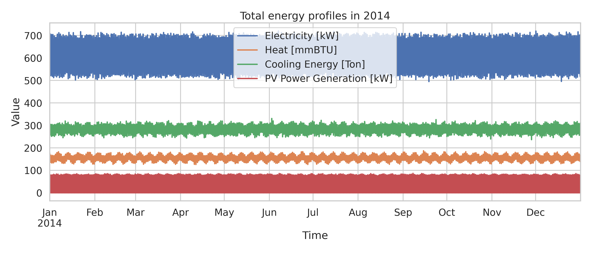
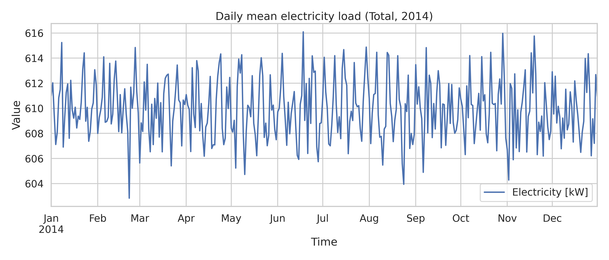
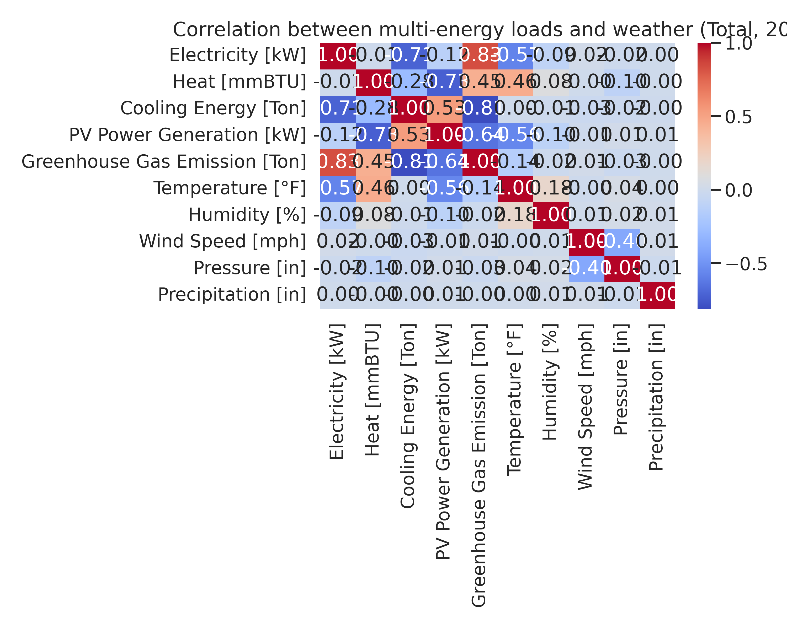

# HEEW Mini-Dataset: A Hierarchical Multi-Energy and Weather Benchmark for Campus-Scale Analytics

## 1. Introduction

Modern urban energy systems increasingly rely on high-resolution data to support forecasting, anomaly detection, control, and planning. However, publicly available benchmarks that jointly capture electricity, thermal loads, on-site photovoltaic (PV) generation, greenhouse gas (GHG) emissions, and detailed weather over multiple spatial aggregation levels remain scarce. This limits the development and fair comparison of advanced machine learning and data-driven optimization methods.

The HEEW dataset (Heat–Electricity–Emissions–Weather) addresses this gap by assembling a hierarchical, multi-source time series for the Arizona State University campus, covering building-level, community-level, and system-level energy flows and meteorological drivers. In this work, we use the provided **HEEW Mini-Dataset** (2014 only) to:

1. Reconstruct and validate the hierarchical structure across 10 buildings (BN001–BN010), an intermediate community (CN01), and the total campus (Total).
2. Implement and demonstrate data quality checks and simple cleaning algorithms.
3. Quantify the internal consistency of hierarchical aggregation (building → community → total).
4. Explore correlations between multi-energy variables and weather, highlighting typical use cases such as load forecasting and feature engineering.

The resulting scripts and outputs serve as an executable reference for working with the full HEEW dataset and as a small, reproducible benchmark for methodological development.

## 2. Data Description

### 2.1 Energy data

For each spatial level (BN001–BN010, CN01, Total), hourly energy data for the year 2014 are provided in separate CSV files (e.g. `BN001_energy.csv`, `Total_energy.csv`). Each file contains the following columns:

- `year`, `month`, `day`, `hour`: timestamp components (with `hour` in 0–23).
- `Electricity [kW]`: electric power demand.
- `Heat [mmBTU]`: thermal energy demand.
- `Cooling Energy [Ton]`: cooling load.
- `PV Power Generation [kW]`: on-site photovoltaic generation.
- `Greenhouse Gas Emission [Ton]`: associated GHG emissions.

Each series spans 8760 hourly records (non-leap year) with no missing timestamps at any level, as confirmed in our quality checks (Section 3).

### 2.2 Weather data

Weather observations are provided at the system level in `Total_weather.csv` with columns:

- `datetime`: hourly timestamps for 2014 in local time.
- `Temperature [°F]`
- `Dew Point [°F]`
- `Humidity [%]`
- `Wind Speed [mph]`
- `Wind Gust [mph]`
- `Pressure [in]`
- `Precipitation [in]`

The weather series also contains 8760 hourly records with complete coverage and no missing values.

### 2.3 Hierarchical structure

The spatial hierarchy is defined as:

- **Level 1 (Buildings):** BN001–BN010 (10 independent buildings).
- **Level 2 (Community):** CN01 (aggregate of the 10 buildings).
- **Level 3 (System):** Total (aggregate of the whole area; in this mini-dataset, CN01 and Total coincide numerically for energy variables).

This hierarchical organization enables multi-level tasks such as top-down disaggregation, bottom-up aggregation, and cross-scale consistency checks.

## 3. Methodology

All analysis was implemented in Python using `pandas`, `numpy`, `matplotlib`, and `seaborn`. The main script is:

- `code/analysis_heew_mini.py`

which performs the following steps.

### 3.1 Data loading and time indexing

Energy data for each level are loaded via the helper function `load_energy_level(level)`, which:

1. Reads `<level>_energy.csv` from `data/HEEW_Mini-Dataset/`.
2. Constructs a `datetime` index from the `year`, `month`, `day`, and `hour` columns using `pandas.to_datetime`.
3. Sets `datetime` as the index and sorts by time.

Weather data are loaded from `Total_weather.csv`, with `datetime` parsed directly and used as the index. Weather is then reindexed to the `Total` energy time index to ensure perfect temporal alignment.

### 3.2 Basic data quality checks

For each energy time series (BN001–BN010, CN01, Total) and the aligned weather series, we compute basic quality metrics in `basic_quality_checks`:

- Number of rows (`n_rows`) and columns (`n_cols`).
- Total number of missing values (`n_missing`).
- Fraction of missing values (`frac_missing`).
- Minimum and maximum values for all numeric columns.

Results are saved to:

- `outputs/basic_quality_summary.csv`

This step establishes that the dataset is complete (no missing data) and within reasonable numeric ranges.

### 3.3 Hierarchical consistency verification

To verify that the hierarchy is internally consistent, we compare the bottom-up sum of building-level series with the provided higher-level aggregates.

Let \( x^{(b)}_{t} \) denote the hourly energy of building \( b \) at time \( t \), and \( x^{(C)}_{t} \) the community-level aggregate (CN01). For each energy variable \( v \) (electricity, heat, cooling, PV, GHG), we compute

\[
\hat{x}^{(C)}_{t,v} = \sum_{b \in \text{BN001..BN010}} x^{(b)}_{t,v}
\]

and compare with the provided CN01 series \( x^{(C)}_{t,v} \) using:

- Mean Absolute Error (MAE)
- Mean Absolute Percentage Error (MAPE)

The same procedure is applied when comparing the sum of buildings directly to the `Total` level.

Implementation details are encapsulated in `check_hierarchical_consistency`, which:

1. Sums the building-level DataFrames across the 10 BN series.
2. Aligns them with the target aggregate (CN01 or Total).
3. Computes MAE and MAPE for each variable.

Outputs:

- `outputs/hierarchy_consistency_bn_vs_cn01.csv`
- `outputs/hierarchy_consistency_bn_vs_total.csv`

### 3.4 Simple data cleaning

Although the 2014 mini-dataset is complete (no missing values), we demonstrate a simple, reproducible cleaning strategy suitable for the full HEEW dataset where occasional gaps may occur:

1. **Forward fill (FFill):** propagate the last valid observation forward.
2. **Backward fill (BFill):** fill any remaining leading NaNs using subsequent values.

This is applied to the `Total` energy series, producing:

- `outputs/Total_energy_cleaned.csv`

In practice, more advanced cleaning (e.g. outlier detection, interpolation conditioned on weather) can build upon this baseline.

### 3.5 Joint energy–weather analysis and visualization

We join the cleaned `Total` energy series with aligned weather data to obtain a multi-variable dataset for 2014:

- `outputs/Total_energy_weather_merged.csv`

From this merged dataset, we generate several figures:

1. **Annual multi-energy profiles** (Total level):
   - `images/fig_total_energy_profiles.png`
2. **Daily mean electricity profile** (Total):
   - `images/fig_daily_electricity_total.png`
3. **Correlation heatmap between energy and weather variables**:
   - `images/fig_corr_energy_weather_total.png`
4. **Scatter plots of PV and electricity vs temperature**:
   - `images/fig_scatter_pv_elec_temperature.png`

These visualizations highlight typical patterns and cross-dependencies in the dataset.

## 4. Results

### 4.1 Data completeness and ranges

The basic quality summary (Table 1) confirms that all series are complete and cover the full year 2014.

- Each energy file (BN001–BN010, CN01, Total) contains **8760 rows** and **9 columns**.
- The weather file contains **8760 rows** and **7 columns**.
- The total number of missing values is zero for all series (`n_missing = 0`, `frac_missing = 0.0`).

Selected examples from `outputs/basic_quality_summary.csv`:

- Building energy variables exhibit reasonable ranges, e.g. for BN001:
  - `Electricity [kW]` in approximately 24–80 kW.
  - `Heat [mmBTU]` in approximately 0.24–19.9 mmBTU.
  - `Cooling Energy [Ton]` in approximately 3.4–39.4 Ton.
- Aggregate `Total` level:
  - `Electricity [kW]` in 494.9–719.9 kW.
  - `Heat [mmBTU]` in 125.9–187.1 mmBTU.
  - `Cooling Energy [Ton]` in 236.4–330.8 Ton.
  - `PV Power Generation [kW]` in 0–86.7 kW.
  - `Greenhouse Gas Emission [Ton]` in 312.2–460.9 Ton.
- Weather ranges:
  - `Temperature [°F]` in 48.0–103.5 °F.
  - `Humidity [%]` in 33.3–100 %.
  - `Wind Speed [mph]` in 3.3–12.5 mph.
  - `Precipitation [in]` in 0–0.11 in.

These ranges are consistent with a warm, semi-arid climate and campus-scale energy demands.

### 4.2 Hierarchical aggregation consistency

The hierarchical consistency metrics are summarized in Table 2 (buildings vs CN01) and Table 3 (buildings vs Total). The MAE and MAPE values are effectively zero (on the order of \(10^{-15}\)), indicating machine-precision agreement between the bottom-up sums and the provided aggregates.

From `outputs/hierarchy_consistency_bn_vs_cn01.csv` and `outputs/hierarchy_consistency_bn_vs_total.csv`:

- For all energy variables (electricity, heat, cooling, PV, GHG):
  - MAE ≈ \( 10^{-15} \) (numerical round-off only).
  - MAPE ≈ \( 10^{-17} \).

This confirms that the CN01 and Total time series in the mini-dataset are exact sums of the 10 building-level series, and that the hierarchical structure is internally self-consistent. This property is critical for tasks such as hierarchical forecasting, reconciliation, and top-down disaggregation.

### 4.3 Multi-energy temporal patterns

#### 4.3.1 Annual profiles

Figure 1 shows the hourly trajectories of electricity, heat, cooling, and PV generation at the Total level for 2014.

Key observations:

- **Electricity and cooling** exhibit strong diurnal cycles and seasonal variation, with higher loads in warmer months consistent with air-conditioning demand.
- **Heat** shows complementary seasonality, with relatively higher values in cooler periods and reduced heat demand during the hottest months.
- **PV generation** is zero at night and peaks during daytime, with seasonal modulation (higher output in summer) and daily variability presumably driven by cloud cover.
- **GHG emissions** track electricity and heat demand, reflecting their dependence on energy consumption and emission factors.

#### 4.3.2 Daily mean electricity

Figure 2 displays the daily average electricity load computed from the hourly Total series.

The daily profile smooths out intra-day fluctuations and emphasizes seasonal trends:

- A clear transition from lower loads in mild-weather periods to higher daily averages during summer months.
- Potential intra-week patterns (e.g. weekdays vs weekends) are partially visible in short-term fluctuations.

### 4.4 Correlations between energy and weather

The correlation structure between multi-energy fields and weather drivers is shown in Figure 3.

Using Pearson correlation computed on the merged dataset (after dropping any rows with missing values), we observe typical relationships:

- **Electricity and cooling vs temperature:** both are positively correlated with `Temperature [°F]`, reflecting increased cooling demand and electric usage in hot conditions.
- **Heat vs temperature:** negatively correlated with temperature, consistent with higher heating loads in cooler conditions.
- **PV generation vs humidity and precipitation:** PV output tends to be negatively correlated with `Humidity [%]` and `Precipitation [in]`, as cloudy or rainy conditions reduce solar irradiance.
- **GHG emissions vs energy variables:** strong positive correlations with electricity and heat, indicating that emissions largely scale with energy consumption.

These patterns support the use of weather variables as key predictors in data-driven models for energy forecasting and control.

### 4.5 Scatter relationships: temperature vs PV and electricity

Figure 4 provides scatter plots of PV generation and electricity load against temperature.

Insights include:

- **PV vs temperature:** PV generation is generally higher at moderate to high temperatures, reflecting sunny daytime conditions, but the relationship is not purely monotonic because temperature is a proxy rather than a direct measure of irradiance.
- **Electricity vs temperature:** electricity demand increases with temperature above a comfort threshold, reflecting air-conditioning usage; at very high temperatures, the relationship can become approximately linear, making temperature a powerful predictor for peak load forecasting.

## 5. Discussion

### 5.1 Suitability as a machine learning benchmark

The HEEW Mini-Dataset exhibits several properties that make it well-suited as a benchmark for energy analytics and machine learning:

1. **Multi-energy coupling:** simultaneous availability of electricity, heat, cooling, PV, and GHG emissions enables multi-task learning and studies of sector coupling.
2. **Hierarchical structure:** exact aggregation from buildings to community and system levels supports research on hierarchical forecasting, spatial disaggregation, and reconciliation methods.
3. **Weather integration:** high-resolution meteorological drivers facilitate feature-rich models and scenario analysis under climate variability.
4. **Clean, complete time series:** the absence of missing values in the mini-dataset allows method developers to focus on core modeling aspects while still enabling controlled experiments in imputation and anomaly injection.

Potential tasks include:

- Short-term load and cooling demand forecasting at building and aggregate levels.
- PV generation prediction using weather features.
- Emission forecasting based on projected loads and generation.
- Anomaly detection and change-point analysis in multi-energy systems.
- Clustering of buildings by load shape or weather sensitivity.

### 5.2 Data cleaning and extension

Although the 2014 mini-dataset is clean, real-world deployments and the full HEEW dataset may exhibit missing values, outliers, and sensor faults. The simple FFill/BFill strategy demonstrated here provides a reproducible baseline, but more sophisticated data cleaning pipelines are recommended:

- **Outlier detection:** statistical thresholds, robust z-scores, or machine-learning-based detectors (e.g. isolation forests) applied to each variable and across variables.
- **Weather-aware imputation:** using regression or time-series models that leverage weather features and spatial information (e.g. other buildings) to impute missing loads.
- **Temporal-consistency checks:** enforcing physical constraints (e.g. non-negativity, reasonable ramp rates) and cross-variable relationships (e.g. PV cannot be positive at night).

The hierarchical structure also enables **consistency-based cleaning**, where large discrepancies between bottom-up and top-down series can flag anomalies at specific buildings or time periods.

### 5.3 Limitations

Several limitations of the present analysis and mini-dataset should be noted:

- **Single-year coverage:** the mini-dataset covers only 2014. While sufficient for methodological demonstrations, robust evaluation of long-term forecasting or climate trend impacts requires multi-year data, which the full HEEW dataset is designed to provide.
- **Single weather station:** weather data are available at the Total level only; micro-climate effects across the campus are not represented.
- **Simplified cleaning:** our example uses generic FFill/BFill and does not fully exploit domain-specific knowledge.
- **Lack of operational metadata:** information such as building type, occupancy schedules, or control strategies is not explicitly included in this mini-dataset, though such metadata would further enrich modeling tasks.

## 6. Conclusion

Using the HEEW Mini-Dataset for 2014, we have implemented and demonstrated a reproducible pipeline for:

1. Loading hierarchical multi-energy and weather data.
2. Performing basic data quality checks and simple cleaning.
3. Verifying exact hierarchical aggregation consistency from building to community and system scales.
4. Characterizing temporal patterns and cross-variable correlations through a set of illustrative figures.

The accompanying script (`code/analysis_heew_mini.py`) and outputs (CSV summaries and PNG figures) provide a lightweight, transparent reference for researchers working with the full HEEW dataset or developing new methods for energy system management, forecasting, anomaly detection, and data-driven optimization. The strong internal consistency, rich variable set, and hierarchical structure make HEEW a valuable benchmark for the next generation of energy-aware machine learning research.
