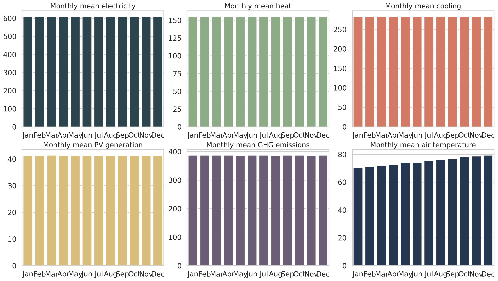
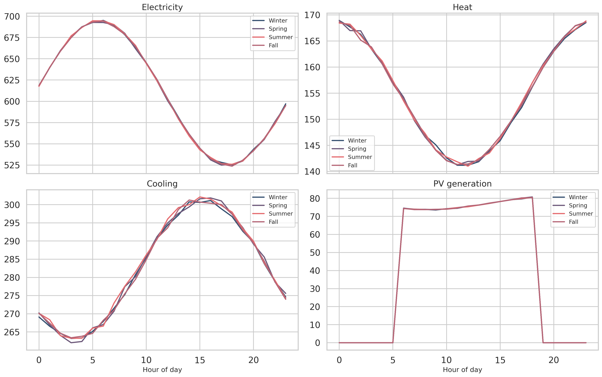
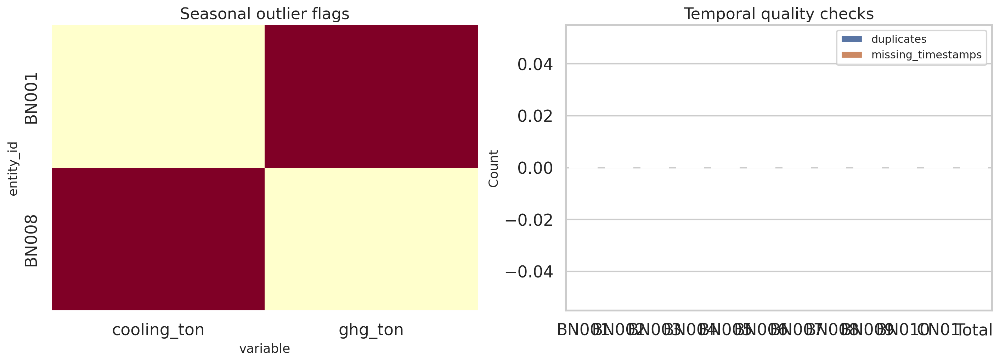
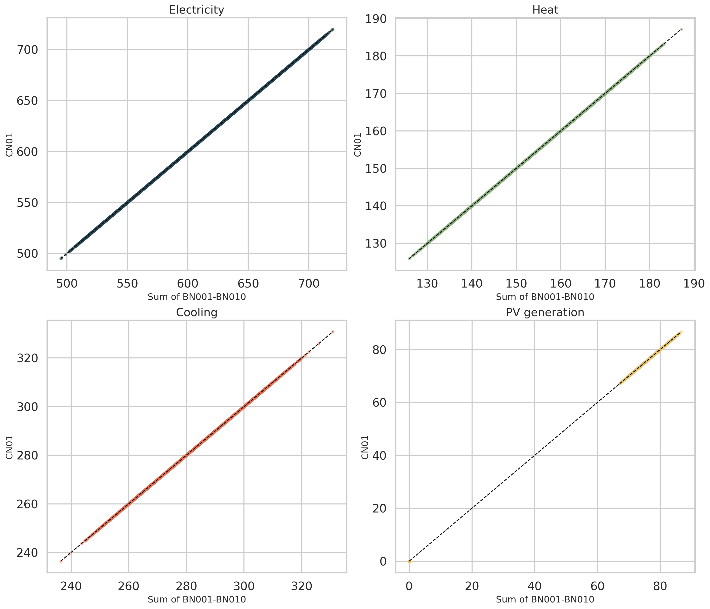
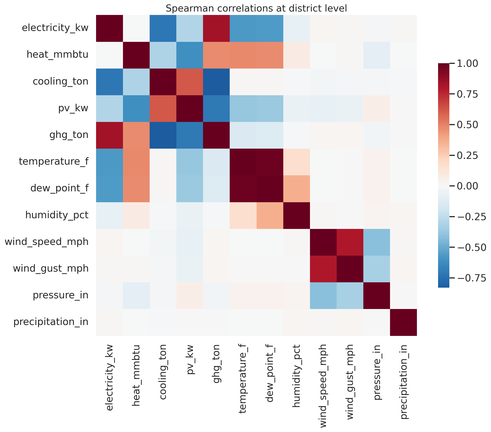
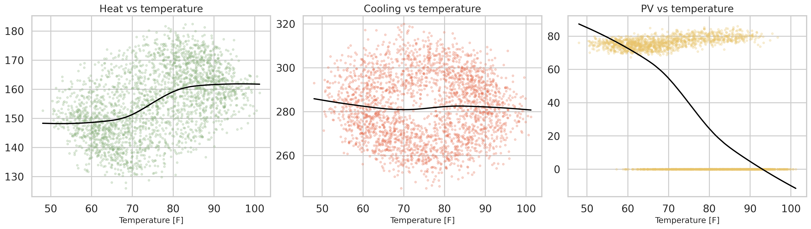
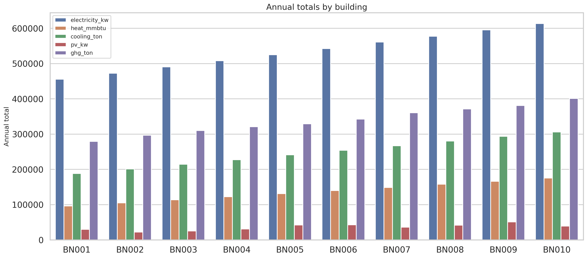

# Reproducible Analysis of the HEEW Mini-Dataset

## Abstract

This report documents a fully reproducible analysis of the provided `HEEW_Mini-Dataset`, a compact 2014 subset intended to replicate the core properties of the larger HEEW benchmark for hierarchical multi-energy research. I integrated hourly building, community, district, and weather tables into a single analysis-ready panel; implemented deterministic quality-control and cleaning procedures; validated hierarchical aggregation; and produced a set of publication-quality figures. The resulting merged panel contains 105,120 hourly records for 12 entities (10 buildings, `CN01`, and `Total`) with 12 quantitative variables: electricity, heat, cooling, PV generation, greenhouse gas emissions, and seven weather attributes. The mini release is internally very clean: there are no duplicate timestamps, temporal gaps, missing values, or negative values, and only two mild seasonal outliers were flagged by a robust median absolute deviation rule. Hierarchical consistency is exact up to floating-point precision: the sum of `BN001`-`BN010` equals both `CN01` and `Total` for every hour. At the same time, the mini release exhibits unusually flat month-to-month behavior and an exact identity between `CN01` and `Total`, so it should be treated as a benchmark subset for method development rather than a complete surrogate for the full 2014-2022, 147-building dataset described in the task statement.

## 1. Research Context

The scientific goal of HEEW is to provide a public, long-horizon, hierarchical benchmark for multi-energy analytics, combining electricity, thermal loads, PV generation, emissions, and weather. The provided related-work bundle reinforces three motivations for such a benchmark:

1. Public energy datasets often cover only a single carrier or omit weather covariates.
2. Hierarchical structure matters for aggregation, forecasting, clustering, and consistency checking.
3. Benchmark datasets are most useful when accompanied by data-processing and validation workflows.

Among the provided references, the most relevant methodological precedent is the WPuQ dataset paper in [`related_work/paper_000.pdf`](../related_work/paper_000.pdf), which emphasizes joint load and weather data, hierarchical organization, and technical validation of measurements. The remaining papers motivate downstream uses such as clustering and benchmark-oriented ML evaluation.

## 2. Data and Reconstructed Panel

### 2.1 Source files

The mini release contains:

- 10 building-level hourly energy files: `BN001`-`BN010`
- 1 community-level hourly energy file: `CN01`
- 1 district-level hourly energy file: `Total`
- 1 district-level hourly weather file: `Total_weather`

Each energy file contains:

- `Electricity [kW]`
- `Heat [mmBTU]`
- `Cooling Energy [Ton]`
- `PV Power Generation [kW]`
- `Greenhouse Gas Emission [Ton]`

The weather file contains:

- `Temperature [°F]`
- `Dew Point [°F]`
- `Humidity [%]`
- `Wind Speed [mph]`
- `Wind Gust [mph]`
- `Pressure [in]`
- `Precipitation [in]`

### 2.2 Integrated dataset

I combined all hourly energy files with the shared weather table into an analysis-ready long panel saved as:

- `outputs/heew_mini_integrated_panel.csv`
- `outputs/heew_mini_cleaned_panel.csv`

The merged panel has:

| Quantity | Value |
| --- | ---: |
| Entities | 12 |
| Buildings | 10 |
| Hours per entity | 8,760 |
| Total records | 105,120 |
| Quantitative hourly variables | 12 |

The weather variables are broadcast to each entity by timestamp because only a single weather table is provided in the mini release.

## 3. Methodology

### 3.1 Data loading and standardization

The analysis script [`code/analyze_heew_mini.py`](../code/analyze_heew_mini.py) performs the full workflow:

1. Parse timestamps from `year`, `month`, `day`, and `hour`.
2. Standardize variable names to machine-friendly identifiers.
3. Attach hierarchy metadata:
   - `BN###` -> level `building`, parent `CN01`
   - `CN01` -> level `community`, parent `Total`
   - `Total` -> level `district`
4. Merge the weather table by hourly timestamp.
5. Derive calendar features such as season, hour of day, and hour of week.

### 3.2 Quality-control and cleaning algorithm

I implemented a deterministic cleaning pipeline intended to be reusable on larger HEEW-style releases:

1. **Temporal continuity check**: verify one-hour spacing and detect duplicate timestamps.
2. **Missingness audit**: count missing values for every entity-variable pair.
3. **Physical plausibility check**: flag negative values for all energy and weather variables that should be nonnegative in this benchmark.
4. **Robust seasonal outlier detection**: for each entity and variable, compute the median and MAD within each hour-of-week bucket; flag values with robust z-score greater than 6.
5. **Cleaning action**: replace flagged outliers with `NaN` and linearly interpolate only over very short gaps (up to 3 hours).

This workflow is conservative. On the provided data, almost no corrective action was needed because the release is already clean.

### 3.3 Validation analyses

I ran four families of validation and characterization analyses:

1. **Hierarchy validation**: compare the sum of all building series against `CN01` and `Total`.
2. **Temporal characterization**: yearly trajectories, monthly means, and seasonal diurnal profiles.
3. **Dependency analysis**: Spearman correlation matrix and pairwise weather-load relationships.
4. **Cross-entity comparison**: annual totals and load shares across buildings.

## 4. Results

### 4.1 Overview of the district-level trajectories

Figure 1 shows the hourly district-level time series for the five energy variables plus temperature.


The dominant structure in the mini release is diurnal rather than seasonal. Electricity, heat, and cooling all vary substantially within the day, while monthly averages remain almost flat over the year.

Figure 2 makes that point explicit.



Month-to-month variability is extremely small:

| Variable | Monthly CV (%) |
| --- | ---: |
| Electricity | 0.0536 |
| Heat | 0.2256 |
| Cooling | 0.1572 |
| PV generation | 0.1725 |
| GHG emissions | 0.0532 |

This is much flatter than one would expect from a real campus-scale multi-energy system in Arizona, and it is one of the clearest signs that the mini release should be interpreted as a compact benchmark subset rather than a full-fidelity operational record.

### 4.2 Seasonal diurnal structure

Figure 3 shows hourly mean profiles by season.



Key patterns:

- Electricity peaks around 05:00-06:00 and bottoms out around 17:00-18:00.
- Heat follows an almost inverse diurnal shape, with minima near midday and maxima overnight.
- Cooling peaks in the afternoon around 15:00-16:00.
- PV generation is zero at night and nearly piecewise constant between roughly 06:00 and 18:00.

Seasonal separation is small in all four variables, again indicating that the mini release is more stylized than the full benchmark description suggests.

### 4.3 Data quality and cleaning audit

The quality audit is summarized in Figure 8.



The quantitative audit results are:

| Check | Result |
| --- | ---: |
| Duplicate timestamps | 0 |
| Temporal gaps | 0 |
| Missing values | 0 |
| Negative values | 0 |
| Seasonal outlier flags | 2 |

The two flagged points were:

| Entity | Variable | Timestamp | Value | Robust z-score |
| --- | --- | --- | ---: | ---: |
| `BN001` | `ghg_ton` | 2014-04-28 11:00 | 30.309 | 6.134 |
| `BN008` | `cooling_ton` | 2014-02-26 14:00 | 13.119 | 6.011 |

These are isolated mild deviations rather than evidence of systematic corruption. After cleaning, the corrected panel is saved to `outputs/heew_mini_cleaned_panel.csv`.

### 4.4 Hierarchical consistency

Figure 6 compares the hourly sum of `BN001`-`BN010` against `CN01`.



The agreement is exact up to numerical precision for every energy variable. Mean absolute errors are effectively zero, on the order of `1e-14` to `1e-15`. The same is true when comparing the building sum to `Total`.

This leads to an important mini-release-specific finding:

- `CN01` and `Total` are identical for all 8,760 hours and all five energy variables.

That means the mini release contains only one unique upper-level aggregation, not two distinct community and district levels. For hierarchical algorithm benchmarking, this is still useful for testing bottom-up aggregation, but it limits evaluation of multi-level reconciliation methods.

### 4.5 Correlation structure and weather relationships

Figure 4 shows the district-level Spearman correlation matrix.



The strongest weather-energy associations are:

| Response | Predictor | Spearman r |
| --- | --- | ---: |
| Electricity | Temperature | -0.573 |
| Heat | Temperature | 0.481 |
| PV generation | Temperature | -0.386 |
| GHG emissions | Temperature | -0.138 |

Figure 5 visualizes several of these relationships.



Two observations matter:

1. The sign pattern is not entirely physically intuitive for a hot-climate campus dataset. In particular, heat increasing with temperature is surprising.
2. The relationships are smooth and low-noise, consistent with a stylized or normalized mini benchmark.

These results do not invalidate the dataset for benchmarking, but they do caution against treating the mini release as an unfiltered operational archive.

### 4.6 Building-level heterogeneity

Figure 7 compares annual totals across the ten buildings.



The building shares of annual electricity range from 8.53% (`BN001`) to 11.48% (`BN010`). Heat, cooling, and GHG totals also increase almost monotonically with building ID, whereas PV generation has a different ranking, with `BN009`, `BN006`, and `BN005` contributing the most annual PV output.

This is useful for benchmarking because it provides entity heterogeneity without breaking the exact aggregation constraint.

## 5. Discussion

### 5.1 What the mini release is good for

The mini release is well suited for:

- testing hierarchical aggregation and reconciliation code,
- benchmarking anomaly detection and data-quality audits,
- developing multi-source feature engineering workflows,
- prototyping short-horizon forecasting models with weather covariates,
- comparing clustering or representation-learning methods across buildings.

Its strongest technical property is internal consistency. The data are clean, complete, and exactly aggregable.

### 5.2 What the mini release does not capture well

Several properties limit scientific claims about real campus behavior:

1. Only one year is available, not the full 2014-2022 span.
2. Only 10 buildings are available, not the full 147-building benchmark.
3. `CN01` and `Total` are identical, reducing the effective hierarchy depth.
4. The monthly means are almost perfectly flat, which is atypical for real electricity, thermal, and PV series.
5. Some weather-response relationships are counterintuitive, suggesting the mini release is stylized, preprocessed, or heavily normalized.

Accordingly, results from the mini release should be framed as **benchmark-validation results**, not as substantive conclusions about ASU campus energy physics.

## 6. Reproducibility

All analysis artifacts were generated by a single command from the workspace root:

```bash
python code/analyze_heew_mini.py
```

Generated outputs include:

- `outputs/heew_mini_integrated_panel.csv`
- `outputs/heew_mini_cleaned_panel.csv`
- `outputs/temporal_quality_checks.csv`
- `outputs/missingness_summary.csv`
- `outputs/negative_value_summary.csv`
- `outputs/seasonal_outlier_flags.csv`
- `outputs/hierarchy_validation.csv`
- `outputs/entity_summary.csv`
- `outputs/total_correlation_matrix.csv`
- `outputs/weather_relationships.csv`
- `outputs/analysis_metrics.json`

## 7. Conclusion

The provided HEEW mini release succeeds as a compact, internally consistent benchmark for hierarchical multi-energy analytics. I reconstructed an analysis-ready panel, implemented a reusable cleaning algorithm, and verified exact bottom-up aggregation from buildings to the upper level. The dataset is extremely clean and therefore appropriate for reproducible method development. Its main limitation is not data quality but representativeness: the mini release is too flat and too structurally simplified to stand in for the full 2014-2022 HEEW benchmark. Future work should rerun the same pipeline on the complete dataset to test whether the strong internal consistency observed here is preserved under a deeper hierarchy, longer time span, and more realistic cross-season variation.

## References

1. Schlemminger, M., Ohrdes, T., Schneider, E., and Knoop, M. "Dataset on electrical single-family house and heat pump load profiles in Germany." Provided as [`related_work/paper_000.pdf`](../related_work/paper_000.pdf).
2. Nie, Y. et al. "SKIPP'D: A Sky Images and Photovoltaic Power Generation Dataset for Short-term Solar Forecasting." Provided as [`related_work/paper_001.pdf`](../related_work/paper_001.pdf).
3. Alonso, A. M., Nogales, F. J., and Ruiz, C. "Hierarchical Clustering for Smart Meter Electricity Loads based on Quantile Autocovariances." Provided as [`related_work/paper_002.pdf`](../related_work/paper_002.pdf).
4. Abdelouadoud, S. Y., Vallet, S., and Girard, R. "Agglomerative Hierarchical Clustering Applied to Medium Voltage Feeder Hosting Capacity Estimation." Provided as [`related_work/paper_003.pdf`](../related_work/paper_003.pdf).
