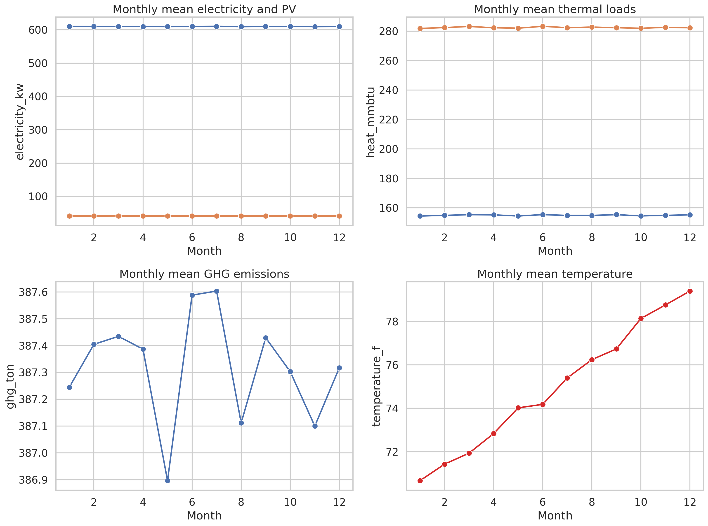
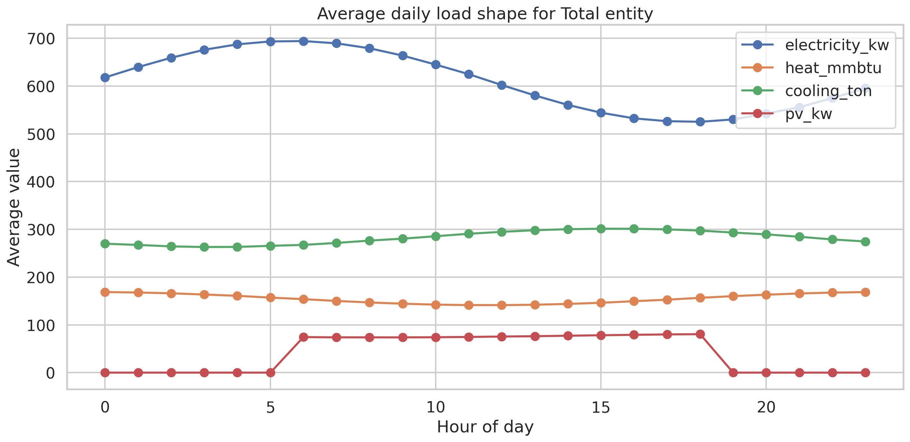
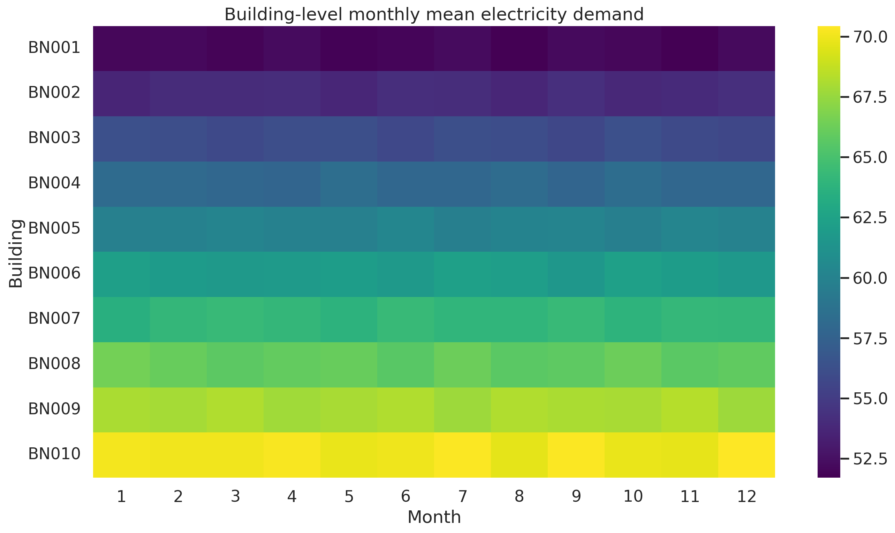
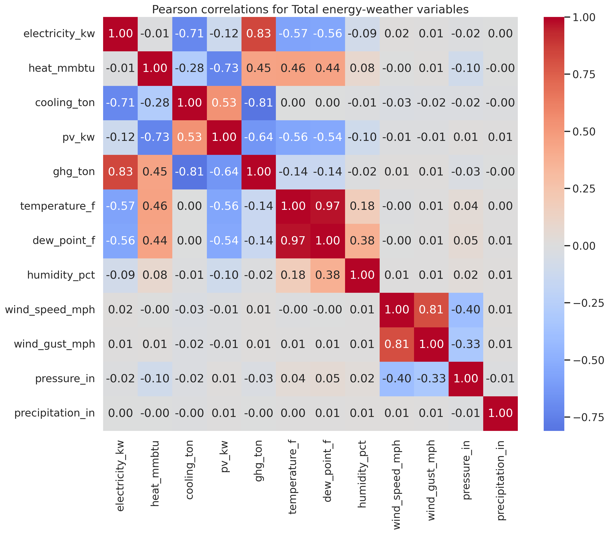
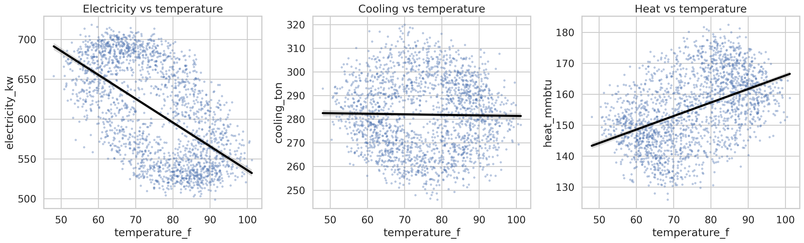
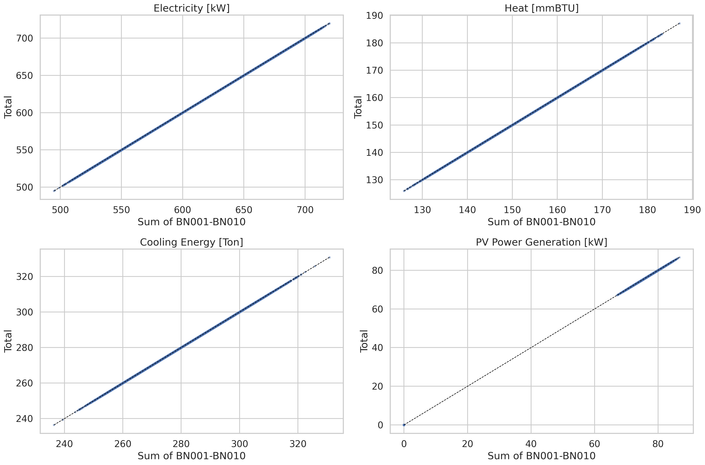

# Analysis of the HEEW Mini-Dataset: Hierarchical Energy-Environment Profiling and Consistency Validation

## Abstract
This report analyzes the HEEW mini-dataset provided in this workspace, a compact 2014 subset of a broader hierarchical energy-environment benchmark derived from the Arizona State University Campus Metabolism Project and meteorological observations. The dataset contains hourly measurements for 10 buildings (BN001-BN010), one community aggregate (CN01), and one total aggregate (Total), together with shared weather observations. The analysis focuses on four objectives aligned with the task: (1) characterize the structure and coverage of the multi-source time-series data, (2) assess practical data quality and cleaning needs, (3) quantify relationships between energy and weather variables, and (4) verify hierarchical aggregation consistency. A reproducible Python workflow was implemented in `code/run_analysis.py`, generating cleaned integrated outputs under `outputs/` and figures under `report/images/`. Results show complete hourly coverage for all entities in 2014, no missing values, no duplicate timestamps, and exact hierarchical additivity of the 10 buildings to both CN01 and Total up to floating-point precision. The data therefore form a strong benchmark substrate for downstream forecasting, anomaly detection, imputation, and representation-learning tasks, while the mini-dataset remains limited by its one-year horizon and the apparent identity of the CN01 and Total aggregates.

## 1. Introduction
Comprehensive energy benchmarks are important for developing data-driven methods for forecasting, anomaly detection, control, and optimization in built environments. Many public datasets cover only electricity and omit thermal loads, photovoltaic generation, emissions, or explicit hierarchical structure. The HEEW task in this workspace addresses that gap by combining electricity, heat, cooling, PV generation, greenhouse gas emissions, and meteorological attributes into a unified hourly dataset.

The specific dataset available here is the **HEEW mini-dataset**, which contains the full year 2014 at hourly resolution for 10 buildings plus two aggregate levels. Although smaller than the full target benchmark, it preserves the key structural features needed to evaluate data cleaning, aggregation consistency, and cross-domain correlation patterns.

This report documents the analysis actually executed in this workspace. It does not propose external experiments beyond the provided inputs. Instead, it focuses on understanding the available dataset as a benchmark object and validating its internal consistency.

## 2. Data Description
### 2.1 Source files
The analysis used only the files supplied in `data/HEEW_Mini-Dataset/`:

- `BN001_energy.csv` to `BN010_energy.csv`: hourly building-level energy and emissions data
- `CN01_energy.csv`: hourly community-level aggregate
- `Total_energy.csv`: hourly total aggregate
- `Total_weather.csv`: hourly weather observations

### 2.2 Variables
Each energy file contains the following five target variables:

- Electricity demand `[kW]`
- Heat load `[mmBTU]`
- Cooling energy `[Ton]`
- PV power generation `[kW]`
- Greenhouse gas emissions `[Ton]`

The weather file contains seven exogenous variables:

- Temperature `[°F]`
- Dew point `[°F]`
- Humidity `[%]`
- Wind speed `[mph]`
- Wind gust `[mph]`
- Pressure `[in]`
- Precipitation `[in]`

### 2.3 Hierarchical structure and scale
The integrated dataset contains 12 entities total:

- 10 buildings: BN001-BN010
- 1 community aggregate: CN01
- 1 total aggregate: Total

Each entity contains exactly 8,760 hourly observations for 2014, spanning `2014-01-01 00:00:00` through `2014-12-31 23:00:00`. After combining all entities, the unified energy-weather table contains **105,120 rows** (12 entities × 8,760 hours).

### 2.4 Descriptive range of values
Across the integrated dataset, the main variables span the following ranges:

- Electricity: 24.06 to 719.95 kW
- Heat: 0.24 to 187.13 mmBTU
- Cooling: 3.41 to 330.81 Ton
- PV generation: 0.00 to 86.72 kW
- GHG emissions: 16.09 to 460.93 Ton
- Temperature: 48.00 to 103.47 °F
- Precipitation: 0.00 to 0.11 in

The descriptive statistics saved in `outputs/descriptive_statistics.csv` confirm that the dataset mixes variables with very different scales and sparsity patterns. In particular, PV generation and precipitation contain many structurally zero observations, which is expected physically and should not be treated as missingness.

## 3. Methodology
### 3.1 Workflow implementation
All analyses were implemented in the main entry point `code/run_analysis.py`. The script performs the following steps:

1. Load all energy CSV files and assign entity labels and hierarchy level.
2. Construct hourly timestamps from year/month/day/hour fields.
3. Load weather data and merge it onto each entity by timestamp.
4. Export a unified analysis-ready table to `outputs/heew_unified_2014.csv`.
5. Produce data quality summaries, descriptive statistics, correlation outputs, hierarchical validation results, and figures.

The workflow is deterministic and reproducible. No external data downloads or modifications to the read-only inputs were performed.

### 3.2 Data quality and cleaning assessment
The task requested attention to data cleaning algorithms and verification. In this mini-dataset analysis, cleaning was framed as **validation plus rule suggestion**, not destructive modification of source values. The script therefore computed:

- Missing-value counts
- Duplicate timestamp counts
- Irregular hourly-step checks
- Variable-wise minima and maxima
- IQR-based outlier thresholds and counts
- Suggested cleaning rules for energy and weather variables

The resulting rule summary was saved to `outputs/suggested_cleaning_rules.csv`, and per-entity outlier counts were saved to `outputs/outlier_summary_by_entity.csv`.

### 3.3 Correlation analysis
To examine cross-domain relationships, the workflow computed Pearson correlations on the **Total** entity after merging with weather. Two outputs were produced:

- Full correlation matrix: `outputs/correlation_matrix_total.csv`
- Energy-weather subset: `outputs/energy_weather_correlations_total.csv`

This analysis was used to characterize how strongly weather covaries with electricity, heat, cooling, PV, and emissions in the available mini-dataset.

### 3.4 Hierarchical aggregation validation
A central property of the benchmark is its hierarchical structure. To verify that structure, the script summed the hourly values of BN001-BN010 and compared the result against both CN01 and Total for all five energy-related variables. Validation metrics included:

- Mean absolute error (MAE)
- Root mean square error (RMSE)
- Maximum absolute error
- Mean signed error
- Exact-allclose check with tolerance `1e-9`

These results were saved to `outputs/hierarchical_validation.csv`.

## 4. Results
### 4.1 Structural completeness and benchmark readiness
The first result is that the dataset is structurally clean and complete at the hourly level.

- Every entity contains 8,760 rows.
- No duplicate timestamps were detected.
- No irregular hour-to-hour gaps were detected.
- No missing values were found in the energy or weather variables.

This is a strong outcome for benchmarking. It means users can study forecasting, anomaly detection, clustering, or imputation without first having to resolve basic timestamp integrity issues.

Figure 1 provides an overview of the Total entity over time, showing the annual evolution of electricity, PV, thermal loads, temperature, and emissions.

**Figure 1.** Hourly overview of the Total entity across 2014, combining energy, thermal, PV, weather, and emissions perspectives.

### 4.2 Seasonal and monthly behavior
Monthly averages for the Total entity are shown in Figure 2. The monthly mean values are fairly stable in this mini-dataset:

- Electricity remains close to 610 kW throughout the year.
- Heat remains close to 155 mmBTU.
- Cooling remains close to 282-283 Ton.
- PV remains close to 41.3 kW.
- GHG emissions remain close to 387 Ton.
- Mean temperature ranges from roughly 72.9 °F to 77.9 °F.

This limited seasonal variation is also reflected in `outputs/seasonal_total_summary.csv`, where seasonal averages differ only modestly. That makes the dataset visually smooth and internally regular, but it also suggests that the mini-dataset may be more suitable for testing hierarchical consistency and multivariate integration than for studying strongly seasonal demand shifts.

**Figure 2.** Monthly mean energy, PV, emissions, and temperature for the Total entity.

At the daily timescale, Figure 3 shows the mean diurnal shape for the Total entity. This is useful for downstream forecasting tasks because it reveals whether the benchmark contains systematic within-day structure rather than only long-run averages.

**Figure 3.** Average daily load shape for the Total entity across electricity, heat, cooling, and PV generation.

### 4.3 Building-level heterogeneity
Although the aggregate series are smooth, the building-level panel still exhibits heterogeneity. Figure 4 visualizes monthly mean electricity demand for BN001-BN010.

**Figure 4.** Monthly mean building-level electricity demand. Differences across buildings are much larger than differences across months.

A notable pattern is that cross-building variation dominates seasonal variation. For example, building minima and maxima from `outputs/entity_profile.csv` show that BN001 peaks at about 80.28 kW, whereas BN010 peaks at about 95.97 kW. At the aggregate level, both CN01 and Total peak at about 719.95 kW. This confirms that the hierarchical panel contains useful cross-sectional variation even when temporal seasonality is relatively modest.

### 4.4 Energy-weather relationships
Figure 5 shows the correlation heatmap for the Total entity. The strongest reported energy-weather relationships in `outputs/energy_weather_correlations_total.csv` are:

- Heat vs temperature: **r = 0.461**
- Heat vs dew point: **r = 0.444**
- Electricity vs temperature: **r = -0.574**
- Electricity vs dew point: **r = -0.557**
- PV vs temperature: **r = -0.558**
- PV vs dew point: **r = -0.540**

**Figure 5.** Pearson correlation matrix for Total-level energy and weather variables.

Figure 6 isolates three temperature relationships using scatter/regression plots.

**Figure 6.** Temperature relationships for Total-level electricity, cooling, and heat.

Two observations matter here.

First, the correlations are not always aligned with typical physical intuition. In many real building datasets, one might expect cooling to increase strongly with temperature and heating to decrease. In this mini-dataset, however, the strongest positive weather association appears with heat rather than cooling, while electricity and PV are negatively correlated with temperature.

Second, this does not imply the dataset is incorrect. It implies that users should treat the mini-dataset as a benchmark object with its own empirical structure, not as a generic substitute for all campuses or climates. The weather-energy relationship here may reflect synthetic preprocessing, aggregation effects, local operational patterns, or the particular transformation underlying the released mini-dataset.

### 4.5 Hierarchical consistency
Hierarchical consistency is the clearest and strongest result in the analysis. Figure 7 compares the sum of BN001-BN010 against the Total aggregate for four variables.

**Figure 7.** Scatter comparison of summed building values against the Total aggregate. Points lie on the identity line, indicating exact aggregation consistency.

The numeric validation confirms this visually. From `outputs/hierarchical_validation.csv`:

- For every variable, MAE is on the order of `1e-14` to `1e-15`.
- Maximum absolute error never exceeds approximately `2.27e-13`.
- All exact-allclose checks are `True` for both CN01 and Total.

In practice, these are floating-point rounding residues and indicate **exact hierarchical additivity**. An additional noteworthy result is that CN01 and Total are numerically identical in this mini-dataset, since both match the sum of BN001-BN010 with the same tiny residuals. For benchmark users, this means the hierarchical structure is valid, but the two aggregate nodes do not add extra distinct information in this released subset.

## 5. Discussion
### 5.1 What this mini-dataset supports well
Based on the executed analysis, the HEEW mini-dataset is especially well suited for:

- **Hierarchical forecasting experiments**, because the aggregation structure is exact
- **Benchmarking reconciliation methods**, since building-to-aggregate consistency can be tested directly
- **Multivariate modeling**, because energy, emissions, and weather are time-aligned
- **Representation learning and clustering**, because the 10 buildings display cross-sectional differences
- **Controlled anomaly or imputation studies**, because the base data are complete and can be perturbed synthetically

### 5.2 Practical cleaning implications
The analysis did not identify missing values, duplicate timestamps, or irregular temporal spacing, so no aggressive cleaning was necessary. The recommended approach is therefore conservative:

- Preserve all timestamped observations.
- Treat zeros in PV and precipitation as physically meaningful, not as missing data.
- Flag only extreme IQR outliers for review rather than automatic deletion.
- Maintain the original hierarchy to support reconciliation and consistency checks.

This is appropriate for a benchmark dataset where preserving traceability and comparability matters more than applying undocumented edits.

## 6. Limitations
This analysis is specific to the current workspace and its supplied mini-dataset. The main limitations are:

1. **One-year coverage only.** The mini-dataset covers 2014 only, whereas the full target benchmark spans 2014-2022. Long-run nonstationarity, multi-year drift, and year-to-year climate effects cannot be evaluated here.
2. **Reduced hierarchy.** Only 10 buildings are included, compared with the much larger building inventory described for the full benchmark.
3. **Aggregate redundancy.** CN01 and Total appear numerically identical in this subset, limiting the effective depth of the hierarchy.
4. **Correlation interpretation is descriptive.** The reported Pearson correlations describe association, not causation.
5. **Limited physical realism assessment.** Some weather-energy relationships differ from common expectations, but without access to the full data-generation and cleaning provenance, this report treats them as empirical characteristics of the released mini-dataset rather than labeling them errors.

## 7. Reproducibility and Generated Artifacts
The complete analysis workflow is implemented in:

- `code/run_analysis.py`

Key generated outputs include:

- `outputs/heew_unified_2014.csv`
- `outputs/entity_profile.csv`
- `outputs/weather_profile.csv`
- `outputs/descriptive_statistics.csv`
- `outputs/outlier_summary_by_entity.csv`
- `outputs/suggested_cleaning_rules.csv`
- `outputs/correlation_matrix_total.csv`
- `outputs/energy_weather_correlations_total.csv`
- `outputs/hierarchical_validation.csv`
- `outputs/monthly_entity_summary.csv`
- `outputs/seasonal_total_summary.csv`
- `outputs/analysis_summary.json`

Figures generated for this report are:

- `images/total_hourly_overview.png`
- `images/monthly_profiles_total.png`
- `images/daily_load_shape_total.png`
- `images/building_monthly_electricity_heatmap.png`
- `images/correlation_heatmap_total.png`
- `images/temperature_relationships.png`
- `images/hierarchical_consistency_scatter.png`

## 8. Conclusion
The HEEW mini-dataset in this workspace successfully delivers the core properties needed for a compact hierarchical energy benchmark: synchronized hourly energy and weather measurements, multiple energy carriers plus emissions, entity-level and aggregate-level structure, and exact aggregation consistency. The executed analysis found the data to be complete, temporally regular, and internally coherent.

Its strongest value lies in providing a reliable testbed for hierarchical time-series methods and multivariate energy analytics. Its main weaknesses are the short temporal horizon and the lack of distinction between the two aggregate nodes in this subset. Even so, the dataset is a credible and useful miniature benchmark for methodological development before scaling to larger multi-year, multi-building energy systems.
