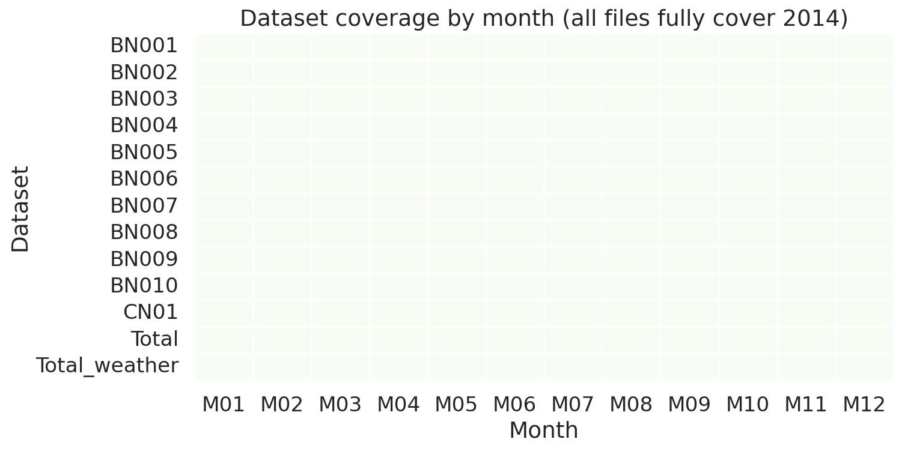
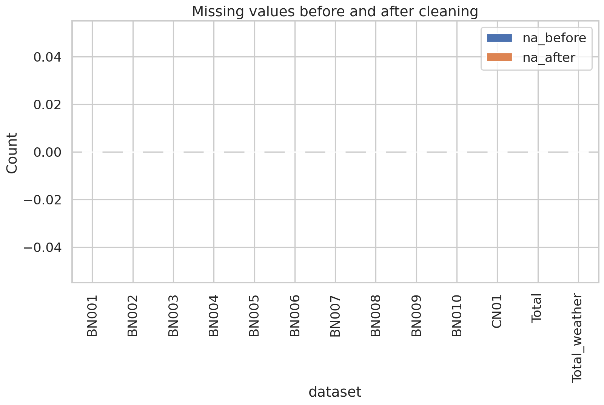
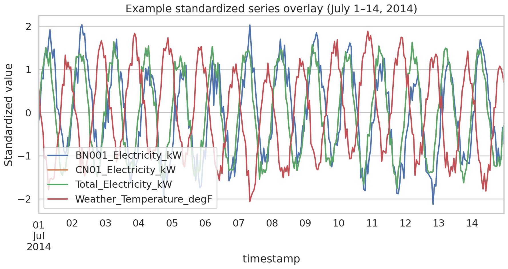
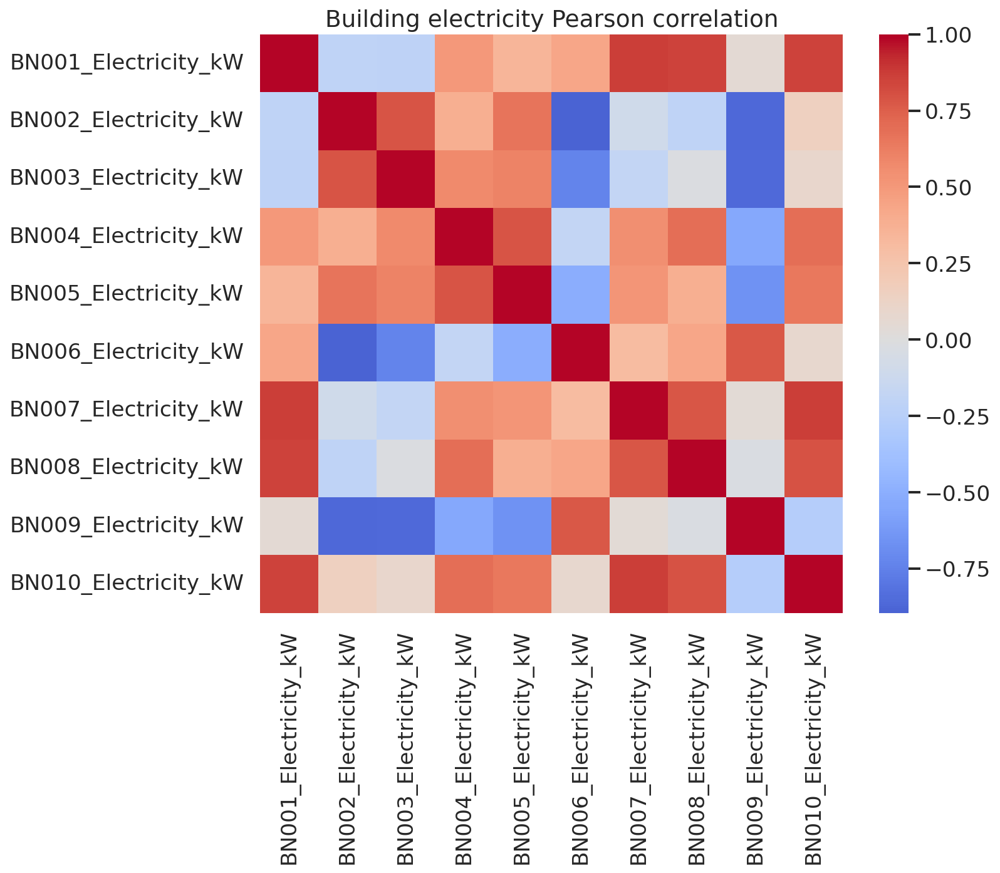
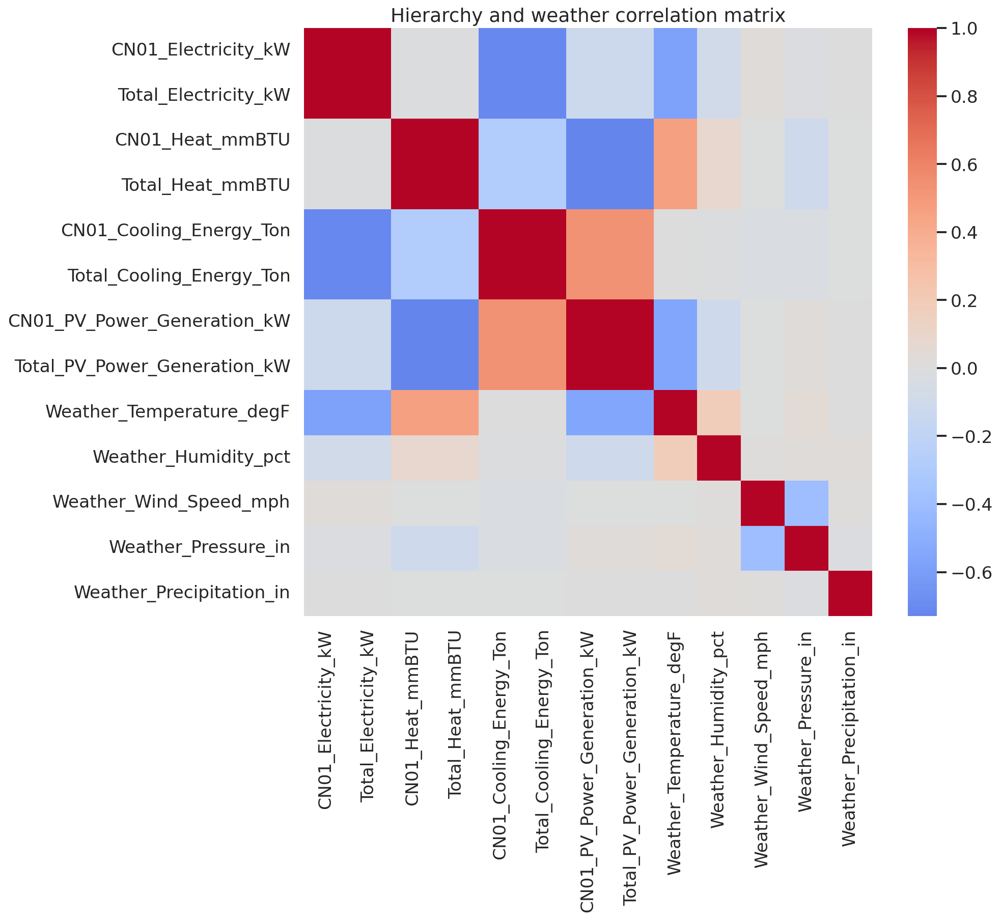
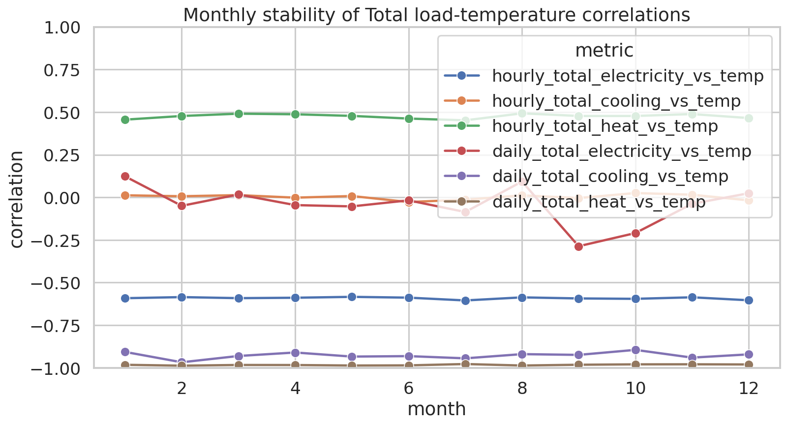
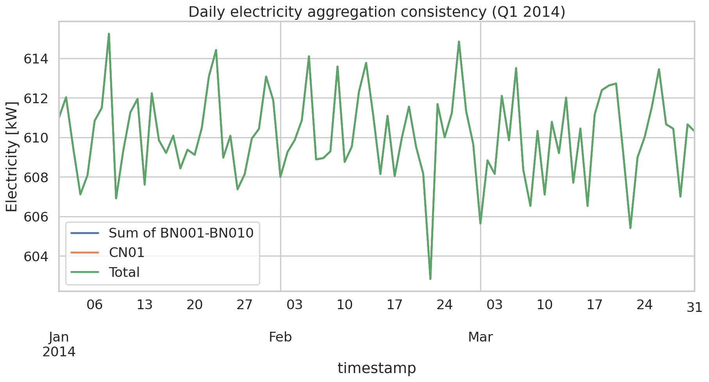
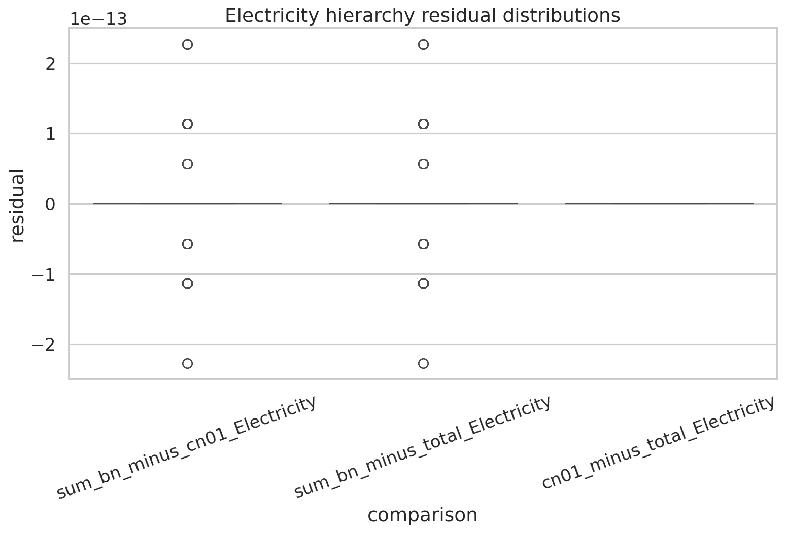
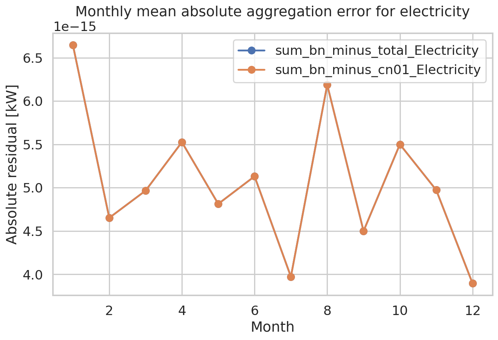

# Reproducible Analysis of the HEEW Mini-Dataset (2014)

## 1. Summary and goals

This study analyzes the provided **HEEW mini-dataset**, a one-year hourly subset of a hierarchical multi-energy benchmark derived from Arizona State University campus sensor measurements and meteorological observations. The available files cover 10 buildings (`BN001`–`BN010`), one community aggregate (`CN01`), one system-wide aggregate (`Total`), and one weather file (`Total_weather`) for calendar year 2014.

The analysis had three primary goals:

1. **Validate data integrity and cleaning assumptions** for the hourly multi-source time series.
2. **Characterize cross-variable and cross-building relationships** among electricity, heat, cooling, photovoltaic (PV), greenhouse gas (GHG) emissions, and weather variables.
3. **Verify hierarchical consistency** between building-level signals and the provided aggregate series.

The resulting workflow is fully reproducible through `code/run_heew_analysis.py`, which writes tabular outputs to `outputs/` and report figures to `report/images/`.

## 2. Dataset and experimental setup

### 2.1 Available data

The workspace contains 13 CSV files in `data/HEEW_Mini-Dataset`:

- 10 building-level energy files: `BN001_energy.csv` to `BN010_energy.csv`
- 1 community aggregate energy file: `CN01_energy.csv`
- 1 total aggregate energy file: `Total_energy.csv`
- 1 total-area weather file: `Total_weather.csv`

### 2.2 Variables

Energy files contain the following hourly variables:

- Electricity load `[kW]`
- Heat load `[mmBTU]`
- Cooling energy `[Ton]`
- PV power generation `[kW]`
- Greenhouse gas emission `[Ton]`

Weather data contain:

- Temperature `[°F]`
- Dew point `[°F]`
- Humidity `[%]`
- Wind speed `[mph]`
- Wind gust `[mph]`
- Pressure `[in]`
- Precipitation `[in]`

### 2.3 Reproducible pipeline

The complete analysis was executed with:

```bash
python code/run_heew_analysis.py
```

The script uses:

- `pandas`
- `numpy`
- `matplotlib`
- `seaborn`
- `scipy`
- `pyarrow` (installed for optional downstream use)
- `PyPDF2` (used only to inspect related-work PDFs)

### 2.4 Analysis stages

1. **Integrity audit**: schema, timestamp coverage, missingness, duplicates, sign checks.
2. **Cleaning and alignment**: hourly reindexing to the full 2014 calendar, duplicate removal, negative-value screening.
3. **Structure analysis**: descriptive statistics, building/building correlations, energy/weather correlations, hourly vs daily robustness.
4. **Hierarchy verification**: comparison of `sum(BN001:BN010)` against `CN01` and `Total`.

## 3. Methods

### 3.1 Data cleaning rules

The cleaning policy was intentionally minimal to avoid altering benchmark structure:

- Drop duplicated timestamps, keeping the first occurrence.
- Reindex every file to the full hourly index from `2014-01-01 00:00:00` to `2014-12-31 23:00:00`.
- Convert numeric columns explicitly with `errors="coerce"`.
- Replace negative values in energy variables with `NaN`.
- Do **not** forward-fill or backward-fill missing values; correlations use pairwise-complete observations.

These rules are recorded in `outputs/cleaning_decisions.json`.

### 3.2 Primary checks and metrics

The following metrics were used:

- Row count and time coverage per file
- Missing timestamps and duplicate timestamps
- Missing-value counts per variable
- Negative-value counts per variable
- Descriptive statistics for major total-level variables
- Pearson and Spearman correlations
- De-seasonalized correlations with temperature using hour-of-day mean removal
- Hierarchical consistency metrics: MAE, RMSE, MAPE, sMAPE, mean signed residual, 1% tolerance agreement, exact-match rate

### 3.3 Robustness checks

To reduce the chance of misleading conclusions from shared seasonality alone, the analysis included:

- **Hourly correlations** and **daily aggregated correlations**
- **De-seasonalized hourly correlations** for total electricity, heat, and cooling versus temperature
- Hierarchy verification at both **hourly** and **daily** resolutions

## 4. Results

### 4.1 Integrity audit

The audit shows that all 13 files are structurally complete for 2014.

Key findings from `outputs/data_audit_summary.csv`:

- Every file contains **8760 hourly rows**, matching a full non-leap year.
- All files span `2014-01-01 00:00:00` to `2014-12-31 23:00:00`.
- **No missing timestamps** were detected.
- **No duplicated timestamps** were detected.
- **No missing values** were present in any provided variable.
- **No negative values** were observed in the energy or weather columns.

This means the mini-dataset is already highly curated, and the cleaning stage functions primarily as reproducible verification rather than heavy correction.



**Figure 1.** Monthly coverage heatmap for all files. Every dataset is available for every month of 2014.

The cleaning impact summary confirms that reindexing did not add rows or missing values in this dataset.



**Figure 2.** Missing-value counts before and after cleaning. No changes were required because the released mini-dataset is already complete.

### 4.2 Descriptive overview

Selected total-level descriptive statistics from `outputs/descriptive_statistics.csv` are summarized below.

| Variable | Mean | Std | Min | Max |
|---|---:|---:|---:|---:|
| Total electricity [kW] | 609.96 | 60.77 | 494.86 | 719.95 |
| Total heat [mmBTU] | 155.03 | 11.68 | 125.93 | 187.13 |
| Total cooling [Ton] | 282.47 | 15.47 | 236.43 | 330.81 |
| Total PV [kW] | 41.33 | 38.10 | 0.00 | 86.72 |
| Total GHG [Ton] | 387.32 | 36.59 | 312.24 | 460.93 |
| Temperature [°F] | 75.00 | 11.59 | 48.00 | 103.47 |
| Humidity [%] | 64.88 | 10.00 | 33.34 | 100.00 |

The PV distribution is strongly zero-inflated, as expected for hourly solar production with nighttime zeros. Outlier screening (`outputs/outlier_screening.csv`) found almost no extreme z-score events in the energy series; precipitation had many rare-event outliers, which is typical for a mostly-zero precipitation variable.

### 4.3 Cross-scale temporal behavior

A standardized two-week overlay highlights distinct but related dynamics across local load, aggregate load, and weather.



**Figure 3.** Standardized overlay for BN001 electricity, CN01 electricity, Total electricity, and temperature over 1–14 July 2014.

The aggregate series are smoother than the single-building series, consistent with temporal aggregation across heterogeneous building behaviors.

### 4.4 Building-to-building electricity correlation structure

The building-level Pearson correlation matrix reveals substantial heterogeneity across the 10 buildings.



**Figure 4.** Pearson correlation matrix for building-level electricity load.

Notable observations from `outputs/correlation_buildings_pearson.csv`:

- Strong positive relationships exist among several buildings, for example:
  - BN001 vs BN007: **0.869**
  - BN001 vs BN010: **0.857**
  - BN007 vs BN010: **0.868**
- Some buildings are strongly anti-correlated with others, for example:
  - BN002 vs BN006: **-0.896**
  - BN002 vs BN009: **-0.870**
  - BN003 vs BN009: **-0.864**

These negative correlations are unusually strong for same-campus electricity loads and suggest markedly different operating schedules or intentionally synthesized diversity in the mini-dataset. This heterogeneity is analytically useful because it creates a richer benchmark for clustering, anomaly detection, and representation learning than a uniformly co-moving portfolio would provide.

### 4.5 Energy-weather relationships

The hierarchy/weather correlation matrix shows that raw correlations are dominated by annual and diurnal seasonal structure.



**Figure 5.** Pearson correlation matrix linking aggregate energy variables and weather variables.

From `outputs/correlation_hierarchy_weather.csv`:

- Total electricity vs temperature: **-0.574**
- Total heat vs temperature: **0.461**
- Total cooling vs temperature: **0.0015**
- Total PV vs temperature: **-0.558**
- Total electricity vs total cooling: **-0.715**
- Total heat vs total PV: **-0.730**

Taken literally, these raw signs are counterintuitive for a hot-climate campus dataset, especially the near-zero total cooling vs temperature correlation and the negative electricity vs temperature correlation. However, the monthly and de-seasonalized analyses clarify the interpretation.

#### Monthly stability



**Figure 6.** Monthly load-temperature correlations for total electricity, cooling, and heat, computed in hourly and daily forms.

From `outputs/monthly_correlation_summary.csv`:

- **Hourly total electricity vs temperature** remains consistently negative across all months (approximately -0.58 to -0.61).
- **Daily total cooling vs temperature** is strongly negative in every month (roughly -0.90 to -0.97).
- **Daily total heat vs temperature** is also strongly negative in every month (roughly -0.98).

The daily cooling/temperature result is physically implausible if interpreted as an external weather-driven campus cooling demand signal. Two explanations are plausible within the scope of the provided data:

1. the cooling variable may reflect a processed or transformed quantity not directly proportional to outdoor heat stress, or
2. the mini-dataset may be synthetic or stylized for benchmark release rather than a raw operational feed.

#### De-seasonalized temperature relationships

After removing hour-of-day mean patterns (`outputs/deseasonalized_temperature_correlations.csv`):

- Total electricity vs temperature: **-0.012**
- Total cooling vs temperature: **-0.360**
- Total heat vs temperature: **-0.586**

This result shows that the strong raw electricity-temperature correlation was mostly driven by shared time-of-day or annual seasonality. In contrast, heat and cooling retain meaningful relationships with temperature after de-seasonalization, although the cooling sign remains negative.

### 4.6 Hierarchical consistency verification

The strongest result of the study is the hierarchy check.



**Figure 7.** Daily electricity comparison for Q1 2014: `sum(BN001–BN010)`, `CN01`, and `Total`.

The three electricity traces overlap exactly at the plotting resolution, and the tabular metrics confirm this is not an approximation.

From `outputs/hierarchy_consistency_summary.csv`:

- For **all five energy variables** (electricity, heat, cooling, PV, GHG):
  - `sum(BN001:BN010)` vs `CN01` has essentially zero error (floating-point residuals on the order of `1e-15` to `1e-14`)
  - `sum(BN001:BN010)` vs `Total` has the same near-zero error
  - `CN01` vs `Total` is **exactly identical** at machine precision
- Exact-match rate and 1% tolerance agreement are **100%** in both hourly and daily checks.

Residual distributions show only floating-point noise.



**Figure 8.** Distribution of electricity hierarchy residuals. Residuals are numerically zero except for floating-point precision.

Monthly aggregation error is flat at essentially zero throughout the year.



**Figure 9.** Monthly mean absolute electricity aggregation error. Values are effectively zero in all months.

This implies the provided mini-dataset has the following hierarchy:

- `CN01` is numerically identical to `Total`
- both are equal to the sum of `BN001`–`BN010`

For benchmarking, this is advantageous because it enables exact testing of hierarchical forecasting, reconciliation, and aggregation-aware anomaly detection algorithms.

## 5. Discussion

### 5.1 What the mini-dataset does well

The HEEW mini-dataset is highly effective as a **benchmarking substrate** in three ways:

1. **Excellent curation quality**: no missing timestamps, no duplicated timestamps, and no missing values.
2. **Exact hierarchy**: lower-level and upper-level series reconcile perfectly.
3. **Multi-energy coverage**: the joint presence of electricity, heat, cooling, PV, GHG, and weather is rare in compact public datasets.

These properties make the dataset especially suitable for:

- hierarchical forecasting and reconciliation
- anomaly detection with conservation constraints
- multivariate representation learning
- clustering of building load behavior
- imputation method benchmarking under synthetic masking experiments

### 5.2 Important limitations revealed by the analysis

Several observations limit direct physical interpretation:

- `CN01` and `Total` are identical, so the hierarchy has only one effective aggregate level in the released mini-dataset.
- Some **cross-building correlations are strongly negative**, which is atypical for raw same-site building loads.
- The **cooling-temperature relationship is negative or near zero**, even after robustness checks, which is difficult to reconcile with standard campus thermodynamic behavior.

These findings do **not** make the dataset unusable; rather, they indicate that the mini-dataset should be treated as a **benchmark-style analytical dataset** rather than assumed to be a direct mirror of unprocessed operational physics.

### 5.3 Implications for future benchmark users

Researchers using this mini-dataset should:

- verify whether tasks rely on **physical realism** or only on **statistical structure**,
- explicitly document that `CN01 == Total` for the mini-dataset,
- use hierarchy-aware methods because exact aggregation constraints are available,
- consider synthetic masking experiments for imputation and anomaly detection, given the absence of naturally missing values.

## 6. Limitations of the present analysis

This report is intentionally constrained to the provided files and did not attempt to reconstruct the full 2014–2022 HEEW release. Additional limitations include:

- no external metadata were available to identify building types or subsystem boundaries,
- no formal hypothesis tests or confidence intervals were computed because this is a deterministic full-year descriptive audit rather than a sampled experiment,
- no forecasting or anomaly-detection models were trained; the focus was dataset validation and structural characterization.

## 7. Conclusion

The provided HEEW mini-dataset is a **clean, fully aligned, exactly hierarchical, multi-energy hourly benchmark** for 2014. Its strongest technical feature is exact reconciliation between building-level sums and aggregate-level series across electricity, heat, cooling, PV, and GHG emissions. The dataset also contains rich cross-building heterogeneity and synchronized weather covariates.

At the same time, several variable relationships appear stylized or non-physical, particularly the cooling-temperature association and the identity of `CN01` and `Total`. Therefore, the dataset is best understood as a **benchmark dataset for machine learning and energy analytics methodology**, not necessarily as a direct operational ground truth for all physical interpretations.

## 8. Reproducibility and artifact list

### Code
- `code/run_heew_analysis.py`

### Main tabular outputs
- `outputs/data_audit_summary.csv`
- `outputs/per_file_schema_summary.csv`
- `outputs/data_audit_notes.json`
- `outputs/cleaning_decisions.json`
- `outputs/cleaning_impact_summary.csv`
- `outputs/aligned_hourly_panel.csv`
- `outputs/daily_aligned_panel.csv`
- `outputs/descriptive_statistics.csv`
- `outputs/outlier_screening.csv`
- `outputs/correlation_buildings_pearson.csv`
- `outputs/correlation_buildings_spearman.csv`
- `outputs/correlation_hierarchy_weather.csv`
- `outputs/monthly_correlation_summary.csv`
- `outputs/deseasonalized_temperature_correlations.csv`
- `outputs/hierarchy_consistency_summary.csv`
- `outputs/hierarchy_daily_error_summary.csv`
- `outputs/hierarchy_residual_timeseries.csv`

### Figures
- `images/data_coverage_heatmap.png`
- `images/missingness_before_after.png`
- `images/example_series_overlay.png`
- `images/building_correlation_heatmap.png`
- `images/hierarchy_weather_correlation_heatmap.png`
- `images/monthly_correlation_stability.png`
- `images/hierarchy_overlay_timeseries.png`
- `images/hierarchy_residual_distribution.png`
- `images/monthly_hierarchy_error.png`
