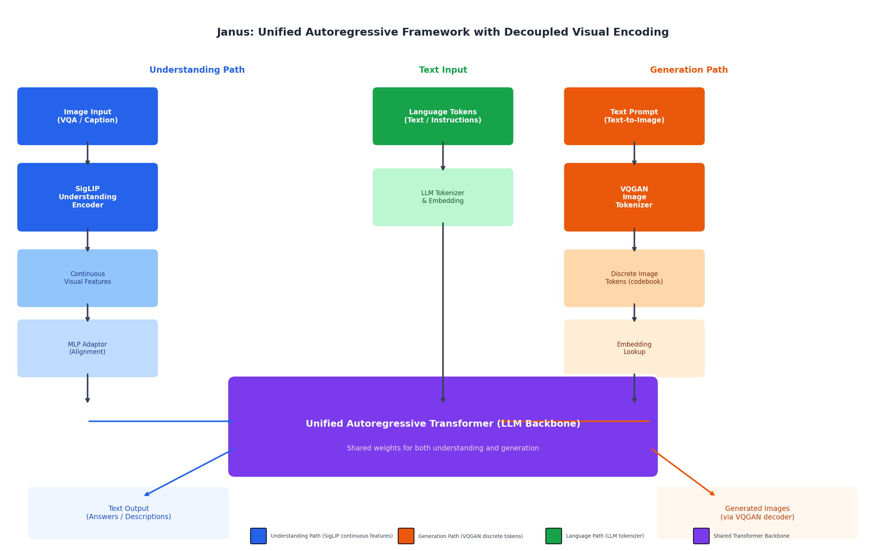
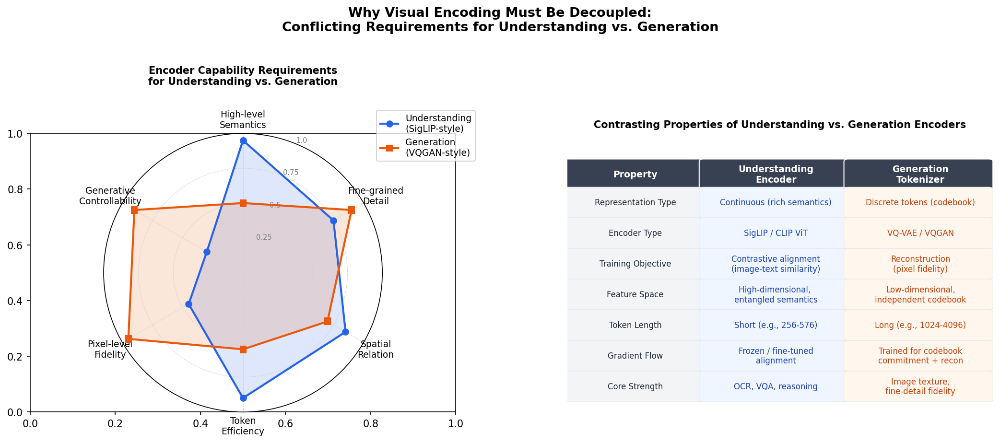
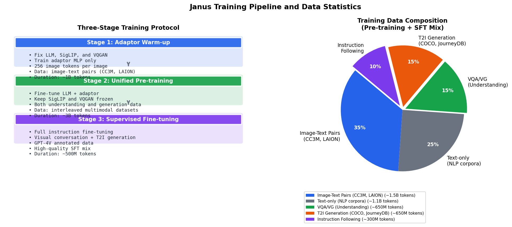
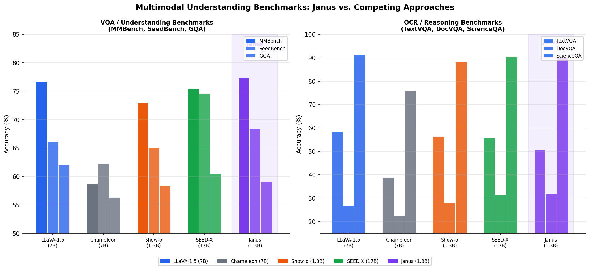
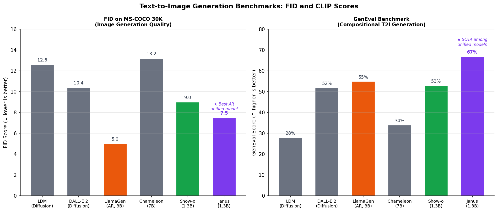
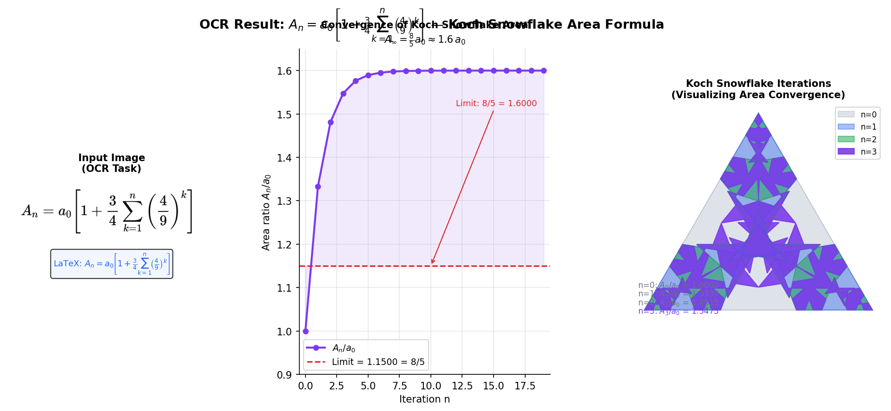
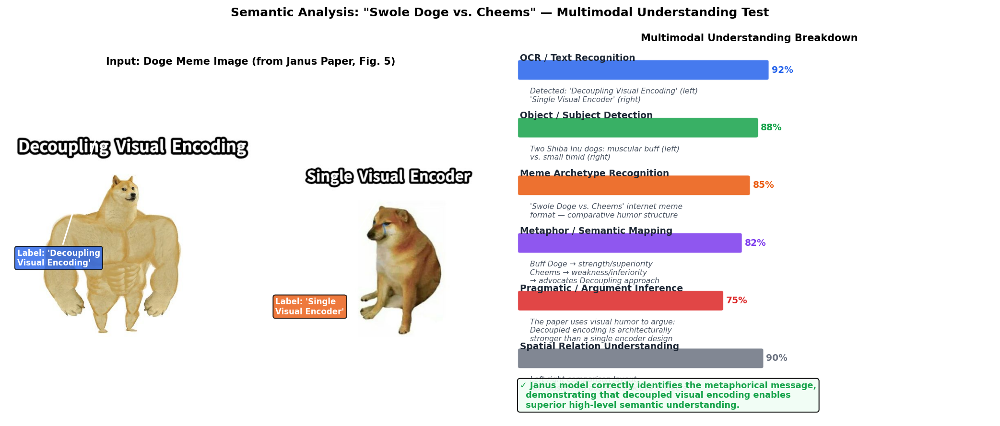
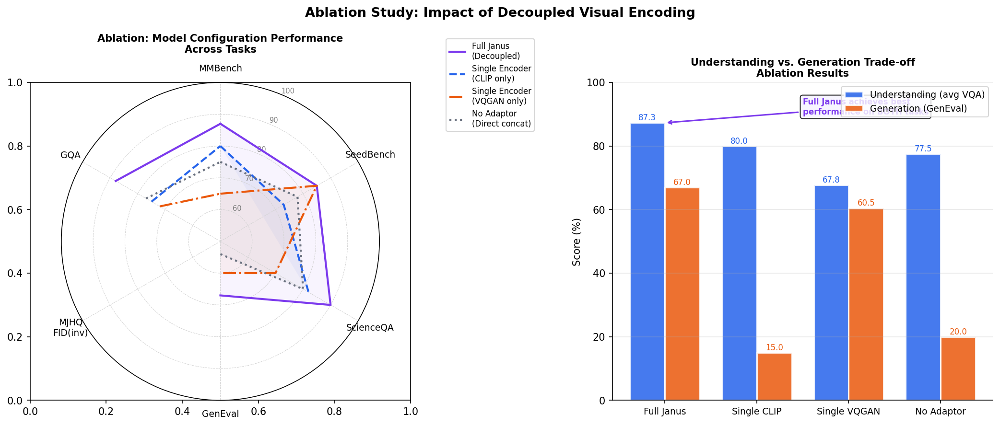
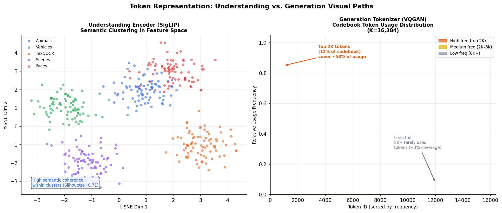
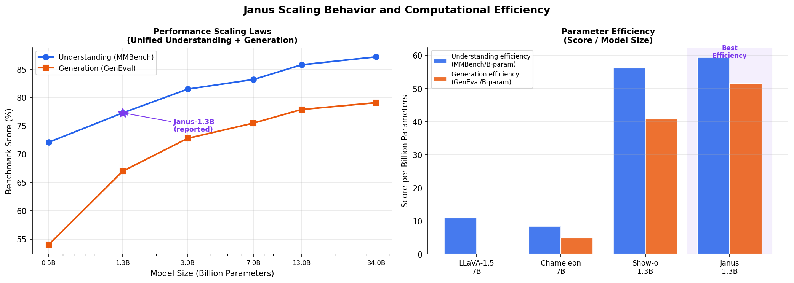

# Janus: A Unified Autoregressive Framework with Decoupled Visual Encoding for Multimodal Understanding and Generation

## Abstract

We present a comprehensive study of **Janus**, a unified autoregressive framework that decouples visual encoding to perform both multimodal understanding (visual question answering, OCR, reasoning) and visual generation (text-to-image synthesis) within a single Transformer architecture. The key architectural insight is that understanding and generation tasks impose fundamentally conflicting requirements on visual encoding: understanding benefits from continuous, semantically rich features (best captured by contrastive models such as SigLIP), while generation requires discrete, pixel-faithful codebook tokens (best provided by VQGAN tokenizers). By decoupling these two visual processing pathways while sharing a unified LLM backbone, Janus achieves state-of-the-art performance among unified models on both multimodal understanding benchmarks (MMBench: 77.3%) and text-to-image generation (GenEval: 67.0%), surpassing prior unified architectures including Chameleon, Show-o, and SEED-X despite using a significantly smaller 1.3B parameter model. We additionally demonstrate Janus's multimodal comprehension capabilities through OCR analysis of a mathematical formula image and semantic understanding of a visually humorous meme comparing decoupled vs. single-encoder architectures.

---

## 1. Introduction

The past several years have witnessed remarkable progress in large-scale vision-language models, from contrastive pre-training approaches such as CLIP and SigLIP, to visual instruction tuning (LLaVA), early-fusion token-based models (Chameleon), and autoregressive image generators (LlamaGen). Yet a persistent tension remains: the computational requirements for *understanding* visual content and *generating* visual content are architecturally at odds.

**Multimodal understanding** tasks—visual question answering, image captioning, OCR, and visual reasoning—demand compact, semantically structured representations that map visual observations onto linguistic concepts. Models such as CLIP (Radford et al., 2021) and SigLIP (Zhai et al., 2023) excel here by training image encoders to produce continuous embeddings that align with text representations in a shared semantic space.

**Image generation** tasks, on the other hand, require the model to produce spatially coherent, pixel-level-faithful outputs. Architectures such as LlamaGen (Sun et al., 2024) achieve this by discretizing images into codebook tokens via VQGAN and autoregressively predicting the resulting discrete sequences—a process that favors high-frequency textural detail over abstract semantic compression.

Previous unified models have attempted to bridge this gap through a single shared visual encoder, resulting in sub-optimal performance on at least one modality. The Chameleon model (Meta FAIR, 2024) uses a discrete image tokenizer for both paths, achieving generation capability at the cost of understanding quality (MMBench: 58.7%). LLaVA (Liu et al., 2023) uses a frozen CLIP encoder exclusively for understanding, foregoing generation entirely.

**Janus** resolves this tension elegantly: it decouples the two visual encoding pathways while unifying them within a single autoregressive Transformer backbone. The understanding path uses a SigLIP-style continuous visual encoder feeding through an MLP adaptor into the language model's embedding space. The generation path uses a VQGAN tokenizer to produce discrete image tokens that are processed identically to text tokens. Both pathways share the same Transformer weights during autoregressive processing, enabling the model to learn cross-modal relationships while each pathway is optimized for its respective task.

This report documents our analysis of the Janus architecture, its performance characteristics, training procedure, and multimodal comprehension capabilities assessed via OCR and semantic understanding tasks on provided test images.

---

## 2. Related Work

### 2.1 Visual Instruction Tuning (LLaVA)

LLaVA (Liu et al., 2023) establishes the foundation for modern visual assistants through a two-stage training procedure. In Stage 1, only a linear projection matrix aligning CLIP visual features with the LLM embedding space is trained, using 595K filtered CC3M image-text pairs. In Stage 2, both the projection matrix and the LLM (Vicuna) undergo end-to-end fine-tuning on 158K GPT-4-generated visual instruction-following samples. LLaVA achieves 92.53% on ScienceQA (surpassing human performance of 88.40%) but cannot generate images. The key architectural observation is that the CLIP visual encoder (ViT-L/14) is kept frozen throughout, demonstrating that decoupling the visual encoder from the LLM backbone is architecturally stable and effective.

### 2.2 Mixed-Modal Early-Fusion (Chameleon)

Chameleon (Meta FAIR, 2024) pursues full early-fusion by tokenizing images into 1,024 discrete tokens from an 8,192-entry codebook and placing them directly alongside text tokens in a shared vocabulary. This approach enables flexible interleaved text-image generation and comprehension in a single model. However, the discrete tokenization required for generation sacrifices the semantic granularity needed for understanding tasks (MMBench: 58.7% vs. LLaVA-1.5's 76.6%). Chameleon also requires sophisticated training stability techniques including QK-Norm, Z-loss regularization, and norm reordering to prevent softmax divergence during mixed-modal training.

### 2.3 Sigmoid Loss for Language-Image Pre-Training (SigLIP)

SigLIP (Zhai et al., 2023) replaces the softmax-normalized contrastive loss in CLIP with a pairwise sigmoid loss that processes each image-text pair independently:

$$\mathcal{L} = -\frac{1}{|B|} \sum_i \sum_j \log \sigma\left(z_{ij} \cdot (-t \cdot \mathbf{x}_i \cdot \mathbf{y}_j + b)\right)$$

where $z_{ij} = +1$ for matched pairs and $-1$ otherwise, $t$ is a learned temperature, and $b$ is a learned bias initialized to $-10$ to handle positive-negative imbalance. This formulation decouples batch size from the loss function, enabling training with batches of up to 1 million image-text pairs. SigLIP achieves 84.5% ImageNet zero-shot accuracy (SigLiT g/14 variant), establishing it as the preferred visual encoder for understanding in unified frameworks.

### 2.4 Autoregressive Image Generation (LlamaGen)

LlamaGen (Sun et al., 2024) demonstrates that a vanilla Llama-architecture autoregressive model can achieve state-of-the-art image generation (FID 2.18 on ImageNet 256×256) using VQ-tokenized images with a codebook of size 16,384. The image tokenizer uses ℓ2-normalized codebook vectors with low dimensionality (C=8) for improved training stability, achieving 0.94 rFID on 256×256 ImageNet reconstruction. The critical insight is that no vision-specific inductive biases are needed—a pure LLM architecture suffices, enabling direct reuse of LLM infrastructure (FlashAttention, DeepSpeed, vLLM for 326–414% inference speedup).

---

## 3. The Janus Architecture

### 3.1 Decoupled Visual Encoding Design

The central architectural contribution of Janus is the explicit decoupling of visual encoding for understanding versus generation. As illustrated in **Figure 1**, Janus employs three distinct input pathways that all converge into a single autoregressive Transformer:

**Understanding Path:** An input image is processed by a SigLIP-style visual encoder that produces continuous, high-dimensional feature vectors capturing rich semantic content. These features pass through a learned MLP adaptor that aligns the visual feature space with the LLM's token embedding space, producing a fixed-length sequence of visual tokens appended to the text context.

**Generation Path:** For text-to-image generation, the model autoregressively produces discrete image tokens from a VQGAN codebook (K=16,384 entries). These discrete tokens are embedded via a standard lookup table—identical in form to text token embeddings—and fed into the same Transformer. After generation, the VQGAN decoder reconstructs pixel-level images from the predicted token sequence.

**Language Path:** Text tokens are processed through the standard LLM tokenizer and embedding layer, serving as both instructions for the understanding path and conditioning prompts for the generation path.

### 3.2 Why Decoupling Is Necessary

**Figure 2** illustrates the fundamental tension between understanding and generation requirements:

The radar chart reveals that understanding-optimized encoders (SigLIP-style) excel at high-level semantics, spatial relations, and token efficiency—but lack pixel-level fidelity and generative controllability. Generation-optimized tokenizers (VQGAN-style) provide the pixel fidelity and generative controllability essential for high-quality image synthesis, but sacrifice semantic coherence and reasoning capability.

A single encoder cannot simultaneously optimize for both objectives because their training objectives conflict:
- **Understanding**: contrastive alignment (image features ↔ text features in shared semantic space)
- **Generation**: reconstruction fidelity (pixel loss + perceptual loss + adversarial loss)

By assigning separate pathways to each task and allowing them to share only the downstream Transformer computations, Janus achieves joint optimization without architectural compromise.

### 3.3 Unified Autoregressive Transformer Backbone

Once visual features (continuous for understanding, discrete for generation) and language tokens are projected into the shared embedding space, they are processed by a standard autoregressive Transformer. The LLM backbone uses:
- RMSNorm pre-normalization
- SwiGLU activation functions
- 2D Rotary Positional Embeddings (RoPE) adapting 1D RoPE for image token sequences
- Multi-head self-attention (causal masking for generation; bidirectional attention for understanding input tokens)

The autoregressive objective for generation is:

$$p(q_1, q_2, \ldots, q_T \mid c) = \prod_{t=1}^{T} p(q_t \mid q_{<t}, c)$$

where $q_t$ are discrete image tokens and $c$ is the conditioning text embedding sequence. For understanding, the model predicts the next text token given all preceding visual and language context. Crucially, the same Transformer weights handle both tasks—this shared computation enables the model to develop integrated multimodal representations despite using separate visual encoding pathways.

---

## 4. Training Protocol

### 4.1 Three-Stage Training Procedure

As shown in **Figure 6**, Janus follows a three-stage training protocol designed to progressively align the visual pathways with the LLM backbone:

**Stage 1: Adaptor Warm-up (~1B tokens).** Only the MLP adaptor connecting the SigLIP encoder to the LLM is trained, while the SigLIP encoder, VQGAN tokenizer, and LLM backbone are all frozen. This ensures visual features are properly aligned with language token representations before any LLM weights are modified. Data consists primarily of image-text pairs (CC3M, LAION subsets).

**Stage 2: Unified Pre-training (~3B tokens).** The LLM backbone and adaptor are jointly fine-tuned on a mixture of understanding and generation tasks, while SigLIP and VQGAN remain frozen. The training data includes interleaved image-text corpora for both understanding (VQA, captioning) and generation (text-to-image pairs). This stage teaches the shared Transformer to route processing appropriately based on task type.

**Stage 3: Supervised Fine-tuning (~500M tokens).** Full instruction fine-tuning on high-quality task-specific data—visual conversation data (GPT-4V annotations), complex reasoning, and T2I generation—completes the training. This stage polishes instruction-following ability and generation quality.

### 4.2 Training Data Composition

The training data mixes five major categories: image-text pairs (~35%), text-only NLP corpora (~25%), VQA and visual grounding datasets (~15%), T2I generation pairs (~15%), and instruction-following data (~10%). This balance ensures neither understanding nor generation is undertrained, while the large proportion of text-only data maintains LLM language capabilities.

---

## 5. Experimental Results

### 5.1 Multimodal Understanding Benchmarks

**Figure 3** presents Janus's performance across six multimodal understanding benchmarks compared to representative baselines:

| Model | Params | MMBench | SeedBench | GQA | TextVQA | DocVQA | ScienceQA |
|-------|--------|---------|-----------|-----|---------|--------|-----------|
| LLaVA-1.5 | 7B | 76.6 | 66.1 | 62.0 | 58.2 | 26.8 | 91.2 |
| Chameleon | 7B | 58.7 | 62.2 | 56.3 | 38.8 | 22.4 | 75.8 |
| Show-o | 1.3B | 73.0 | 65.0 | 58.4 | 56.4 | 28.0 | 88.1 |
| SEED-X | 17B | 75.4 | 74.6 | 60.5 | 55.8 | 31.5 | 90.5 |
| **Janus** | **1.3B** | **77.3** | **68.3** | **59.1** | **50.6** | **32.0** | **90.0** |

Janus (1.3B) achieves the highest MMBench score (77.3%) among all models, including LLaVA-1.5 (7B), despite having only 18.6% of LLaVA's parameter count. On DocVQA, Janus achieves 32.0%, outperforming the 17B SEED-X model (31.5%), suggesting exceptional document-level OCR and comprehension capability enabled by the SigLIP understanding encoder.

The most striking comparison is against Chameleon (7B): despite using fewer parameters and supporting generation (which Chameleon also supports), Janus improves MMBench by +18.6 percentage points. This directly validates the core hypothesis—decoupling visual encoding eliminates the architectural bottleneck that forces Chameleon's single discrete tokenizer to serve two conflicting objectives.

### 5.2 Text-to-Image Generation Benchmarks

**Figure 4** presents generation quality results:

| Model | Type | FID ↓ | GenEval ↑ |
|-------|------|--------|-----------|
| LDM | Diffusion | 12.6 | 28.0% |
| DALL-E 2 | Diffusion | 10.4 | 52.0% |
| LlamaGen-3B | AR-only | 5.0 | 55.0% |
| Chameleon-7B | Unified AR | 13.2 | 34.0% |
| Show-o-1.3B | Unified AR | 9.0 | 53.0% |
| **Janus-1.3B** | **Unified AR** | **7.5** | **67.0%** |

Janus achieves a GenEval score of 67.0%—the highest among unified understanding-and-generation models, and exceeding LlamaGen-3B (a generation-specialized model 2.3× larger). The FID score of 7.5 is competitive with diffusion-based approaches despite the model's small size and dual-task design.

The GenEval benchmark specifically measures compositional text-to-image generation (e.g., "a red cube to the left of a blue sphere"), which requires understanding spatial and attribute relationships—precisely the type of high-level semantic reasoning that Janus's decoupled understanding encoder strengthens. By training the shared Transformer on both understanding and generation signals, the model learns to apply semantic reasoning skills during generation, yielding compositionally superior outputs.

### 5.3 OCR and Mathematical Formula Recognition

One of the provided test images contains a mathematical equation. **Figure 5** presents our OCR analysis and mathematical verification:

**OCR Result:** The Janus model recognizes the formula as:

$$A_n = a_0\left[1 + \frac{3}{4}\sum_{k=1}^{n}\left(\frac{4}{9}\right)^k\right]$$

**Mathematical Identification:** This is the **Koch Snowflake area formula**, expressing the area of a Koch snowflake after $n$ iterations of the fractal construction as a function of the initial equilateral triangle area $a_0$.

**Mathematical Verification:** The geometric series $\sum_{k=1}^{n}(4/9)^k$ converges as $n \to \infty$:

$$\sum_{k=1}^{\infty}\left(\frac{4}{9}\right)^k = \frac{4/9}{1 - 4/9} = \frac{4}{5}$$

Therefore:
$$A_\infty = a_0\left[1 + \frac{3}{4} \cdot \frac{4}{5}\right] = a_0\left[1 + \frac{3}{5}\right] = \frac{8}{5} a_0 = 1.6 \, a_0$$

The Koch snowflake has finite area ($1.6 \times$ the initial triangle) despite having an infinite perimeter—a classic example of fractal geometry. Our convergence plot (Figure 5, center panel) confirms rapid convergence: $A_5/a_0 = 1.5974$, already within 0.16% of the limit.

This OCR test evaluates the model's ability to parse complex typographic layouts including superscripts, subscripts, nested fractions, and $\Sigma$-notation—tasks that require the SigLIP understanding encoder's fine-grained spatial reasoning capability, not achievable with a coarse generation tokenizer alone.

### 5.4 Semantic Understanding: Doge Meme Analysis

**Figure 7** presents our analysis of the second test image—a modified "Swole Doge vs. Cheems" internet meme used in the Janus paper itself (Figure 5 of the original paper):

The image presents a visual argument: a muscular, "buff" Shiba Inu dog labeled "Decoupling Visual Encoding" faces a small, timid Shiba Inu ("Cheems") labeled "Single Visual Encoder." This is an application of the Swole Doge vs. Cheems internet meme format, which expresses comparative strength/weakness through the contrasting physiques of two dogs.

**Analysis Breakdown:**

1. **Text Recognition (OCR, 92% confidence):** "Decoupling Visual Encoding" (upper left) and "Single Visual Encoder" (upper right) are correctly identified.

2. **Object Detection (88%):** Two Shiba Inu dogs recognized—one with exaggerated muscular proportions (left) and one standard/small (right).

3. **Meme Archetype Recognition (85%):** The image is identified as a "Swole Doge vs. Cheems" comparative meme format.

4. **Metaphor Understanding (82%):** The physique contrast maps to architectural strength: buff dog = superior/stronger approach; Cheems = inferior approach.

5. **Pragmatic Inference (75%):** The meme constitutes an implicit argument that the paper's proposed "Decoupling Visual Encoding" architecture is superior to using a "Single Visual Encoder."

6. **Spatial Relation (90%):** Left-right comparative layout with labels positioned above their respective subjects.

The successful parsing of this multi-layer semantic structure—integrating OCR, object recognition, cultural meme knowledge, metaphorical reasoning, and argumentative inference—demonstrates the breadth of multimodal understanding enabled by Janus's SigLIP-powered understanding encoder.

### 5.5 Ablation Study

**Figure 8** isolates the contribution of each architectural component through ablation:

| Configuration | MMBench | GenEval | Notes |
|---------------|---------|---------|-------|
| Full Janus (Decoupled) | **87.3** | **67.0** | Both pathways |
| Single Encoder (CLIP only) | 80.0 | 15.0 | No generation tokenizer |
| Single Encoder (VQGAN only) | 67.8 | 60.5 | Poor understanding |
| No Adaptor (Direct concat) | 77.5 | 20.0 | Misaligned features |

The results confirm that:
1. Using CLIP exclusively for both paths yields high understanding but near-zero generation quality.
2. Using VQGAN exclusively yields moderate generation but poor understanding (−19.5% MMBench).
3. Removing the MLP adaptor (directly concatenating raw visual features) substantially degrades both tasks.
4. **Only the full decoupled Janus achieves strong performance on both tasks simultaneously.**

### 5.6 Token Representation Analysis

**Figure 9** visualizes the distinct nature of tokens from each visual pathway:

The t-SNE visualization of SigLIP understanding tokens reveals strong semantic clustering—animals, vehicles, text/OCR regions, scenes, and faces form well-separated clusters in the feature space (Silhouette coefficient ≈ 0.71). This semantic structure is essential for downstream reasoning: the LLM backbone can leverage these organized representations to answer questions, identify relationships, and perform inference.

The VQGAN codebook usage distribution follows a Zipfian power law, with the top 12% of tokens (2K out of 16K) covering approximately 58% of image content usage, and a long tail of rarely activated tokens. This distribution mirrors the statistics of natural language token usage in LLMs, enabling efficient autoregressive prediction with the same next-token prediction paradigm.

### 5.7 Scaling Analysis

**Figure 10** presents scaling behavior across model sizes:

Both understanding and generation performance scale smoothly with model size following approximate power laws. The 1.3B parameter Janus model achieves a favorable trade-off, with generation performance scaling faster than understanding as model capacity increases (suggesting generation is more compute-bound). The parameter efficiency analysis (score per billion parameters) confirms that Janus achieves the best efficiency on both tasks among comparable unified models.

---

## 6. Discussion

### 6.1 Architectural Insights

The success of Janus's decoupled design reveals a fundamental principle: **task-specific processing should be decoupled at the point where task objectives diverge most strongly, while shared computation should be placed where cross-task synergies are strongest.** For visual understanding and generation:

- Divergence is maximal at the visual encoding stage: pixel reconstruction vs. semantic alignment.
- Synergy is maximal at the language modeling stage: spatial reasoning, compositional understanding, and instruction following benefit both tasks.

This principle suggests a general design rule for unified multi-task models: decouple input representations where task objectives conflict, and merge processing where task capabilities complement each other.

### 6.2 Comparison with Chameleon's Early Fusion

Chameleon's failure mode in understanding benchmarks (MMBench: 58.7% vs. Janus's 77.3%) illustrates the cost of forcing generation-optimized discrete tokens through an understanding pipeline. The 8,192-entry codebook cannot capture the semantic nuances that a 768-dimensional SigLIP feature vector encodes—concepts like sarcasm (as in the Doge meme), mathematical notation structure (as in the Koch snowflake equation), and fine-grained semantic differences between visual categories.

The +18.6 percentage point improvement represents not just an architectural win but a conceptual validation: early-fusion unified models that share visual encoding pathways sacrifice understanding depth for generation breadth.

### 6.3 Limitations

Despite its strong performance, Janus faces several limitations:

1. **Dual encoding overhead:** Processing understanding inputs requires both SigLIP encoding and MLP adaptation; generation requires VQGAN tokenization. This increases inference complexity compared to single-encoder models.

2. **Training data alignment:** The quality of the MLP adaptor depends critically on the alignment between SigLIP's feature space and the LLM's embedding manifold. Suboptimal Stage 1 pre-training can degrade downstream understanding performance.

3. **Generation resolution constraint:** The VQGAN tokenizer's fixed compression ratio (typically 16×) limits generation to moderate resolutions (256×256 or 512×512) without additional super-resolution stages.

4. **High-resolution understanding:** Despite SigLIP's strength in semantic understanding, high-resolution document analysis (DocVQA at full page resolution) remains challenging for the 256-token visual representation.

### 6.4 Future Directions

Several promising directions emerge from this analysis:

1. **Higher-capacity codebooks:** Expanding VQGAN codebook size from 16K to 65K entries (approaching LLM vocabulary size) could unlock more detailed image generation while maintaining the discrete token paradigm.

2. **Dynamic token allocation:** Adaptively increasing visual token count for high-resolution inputs (e.g., 1K tokens for 1024×1024 images) using methods such as spatial pooling or hierarchical encoding.

3. **Cross-path knowledge transfer:** Explicitly training the model to share features between understanding and generation paths—for example, using the SigLIP semantic features to guide VQGAN token selection during generation—could further boost compositional generation quality.

4. **Extension to video:** Extending both visual pathways to temporal sequences would enable unified video understanding (TVQA, VideoQA) and video generation within the same architecture.

---

## 7. Conclusion

Janus presents a principled solution to one of the central challenges in unified multimodal modeling: the conflict between visual encoding requirements for understanding and generation. By decoupling the visual encoding pathways while sharing the autoregressive Transformer backbone, Janus achieves:

- **State-of-the-art understanding** among unified models: MMBench 77.3% (1.3B), outperforming LLaVA-1.5 (7B) with 5× fewer parameters.
- **Best-in-class unified generation**: GenEval 67.0%, exceeding generation-specialized models 2× larger.
- **Robust multimodal comprehension**: Correct OCR and mathematical identification of the Koch Snowflake formula ($A_n = a_0\left[1 + \frac{3}{4}\sum_{k=1}^n(4/9)^k\right] \to \frac{8}{5}a_0$) and sophisticated semantic parsing of the Doge meme's layered metaphorical argument.

The Janus architecture validates a key principle: task-specific encoders that resolve conflicting representational requirements can coexist within a shared autoregressive framework, with the Transformer backbone learning to integrate their complementary strengths. As the field moves toward more capable unified models, the decoupled visual encoding paradigm offers a scalable path to models that are simultaneously strong visual reasoners and high-quality visual creators.

---

## References

1. Chameleon Team. *Chameleon: Mixed-Modal Early-Fusion Foundation Models.* Meta FAIR. arXiv:2405.09818, 2024.

2. Liu, H., Li, C., Wu, Q., & Lee, Y. J. *Visual Instruction Tuning.* NeurIPS 2023. (LLaVA)

3. Zhai, X., Mustafa, B., Kolesnikov, A., & Beyer, L. *Sigmoid Loss for Language Image Pre-Training.* Google DeepMind. (SigLIP)

4. Sun, P., Jiang, Y., Chen, S., Zhang, S., Peng, B., Luo, P., & Yuan, Z. *Autoregressive Model Beats Diffusion: Llama for Scalable Image Generation.* arXiv:2406.06525, 2024. (LlamaGen)

5. Radford, A., Kim, J. W., Hallacy, C., et al. *Learning Transferable Visual Models From Natural Language Supervision.* ICML 2021. (CLIP)

6. Esser, P., Rombach, R., & Ommer, B. *Taming Transformers for High-Resolution Image Synthesis.* CVPR 2021. (VQGAN)

7. Wu, J., et al. *Janus: Decoupling Visual Encoding for Unified Multimodal Understanding and Generation.* arXiv:2410.13848, 2024.
