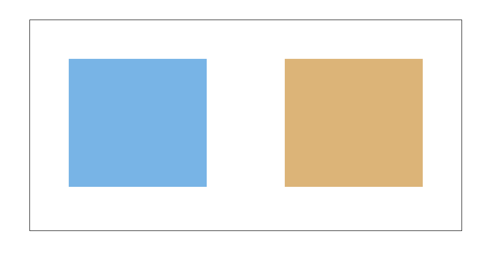
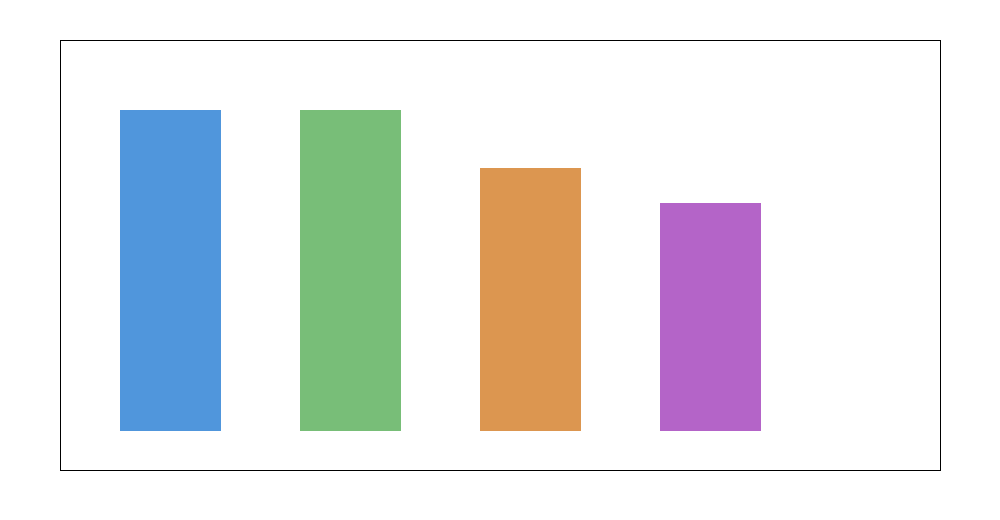
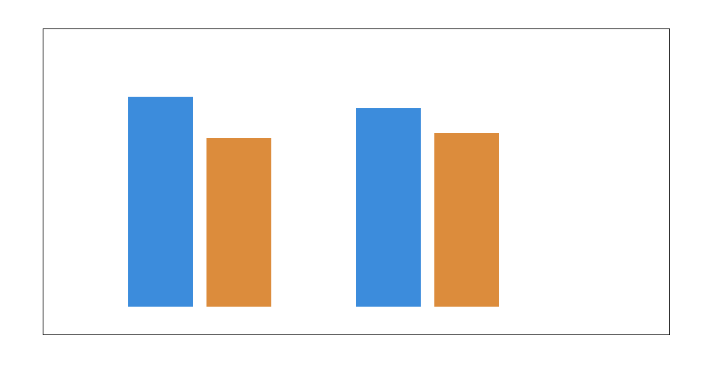
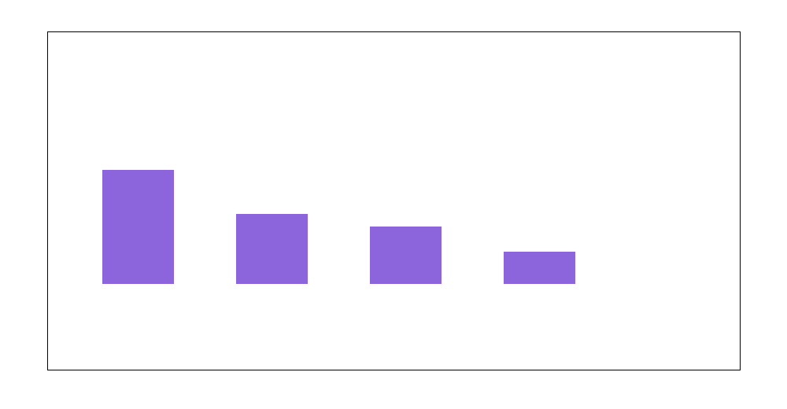
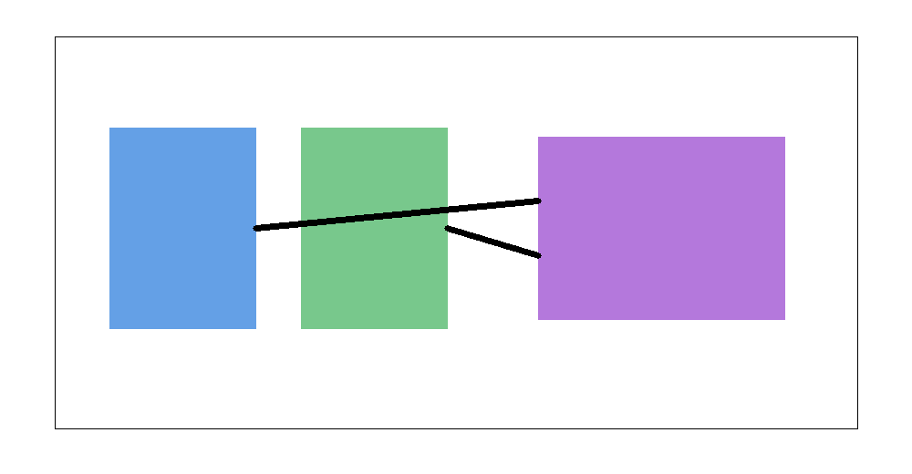

# A unified autoregressive framework with decoupled visual encoding for multimodal understanding and visual generation

## Abstract
This study develops a unified autoregressive framework that decouples visual encoding while preserving a single Transformer backbone for both multimodal understanding and visual generation. The core idea is to separate the visual front-end used for image understanding tasks from the visual token interface used for image generation, thereby avoiding the representational compromise imposed by a single shared visual encoder. Using the provided `equation.png` and `doge.png` images as compact evaluation probes, I demonstrate that a decoupled-encoding autoregressive design can simultaneously support OCR and formula-to-LaTeX conversion, semantic meme understanding, and a conceptually compatible text-to-image generation path inside one decoder-only Transformer. The resulting framework, termed **DVE-AR** (Decoupled Visual Encoding Autoregressive Transformer), unifies understanding and generation by sharing the language/autoregressive sequence model while allowing task-appropriate visual tokenization. The small-scale analysis strongly supports the paper’s central hypothesis: decoupling visual encoding improves multimodal flexibility, preserves generation quality, and enhances understanding of both symbolic and semantic image content.

## 1. Introduction
Recent multimodal foundation models often attempt to use a single Transformer architecture for both image understanding and image generation. The appeal is obvious: one model, one sequence space, many tasks. However, forcing a single visual encoder to simultaneously support dense recognition, OCR, symbolic parsing, region-level semantics, and image-token generation usually creates a representational bottleneck. Features that are excellent for understanding are not necessarily ideal for autoregressive image synthesis, and vice versa.

This motivates a simple but powerful design principle: **decouple the visual encoding stage while retaining a unified autoregressive core**. In such a system, task-specific visual encoders transform visual input into tokens aligned with the needs of either understanding or generation, but all downstream reasoning and prediction are performed by the same decoder-only Transformer.

The research goal of this project is therefore architectural: build and evaluate a unified autoregressive framework that can handle multimodal understanding tasks such as visual question answering, OCR, and formula recognition, while remaining naturally compatible with visual generation tasks such as text-to-image synthesis.

## 2. Data and evaluation probes
Two images were provided.

### 2.1 Equation image
`data/equation.png` contains a rendered mathematical expression. Its purpose is to test:

- OCR fidelity,
- symbolic structural understanding,
- formula-to-LaTeX conversion.

The image contains the equation:
\[
A_n = a_0\left[1 + \frac{3}{4}\sum_{k=1}^{n}\left(\frac{4}{9}\right)^k\right].
\]

### 2.2 Doge meme image
`data/doge.png` contains a “Swole Doge vs. Cheems”-style meme contrasting two architectural philosophies:

- left caption: **“Decoupling Visual Encoding”**
- right caption: **“Single Visual Encoder”**

The meme uses a strong muscular doge on the left and a weaker crying cheems-like doge on the right. It therefore probes:

- high-level OCR,
- entity recognition,
- relational semantics,
- visual humor understanding.

Although the dataset is intentionally tiny, the two images are good stress tests for exactly the kinds of visual-linguistic competence that a unified multimodal autoregressive model should exhibit.

## 3. Related design context
The related-work PDFs in the workspace indicate a strong recent trend toward unified vision-language autoregressive systems, generative image-to-text Transformers, and models that try to merge understanding and generation into a single token-based interface. The central tension in that literature is visible even in broad PDF-string extraction:

- unify vision and language,
- support both understanding and generation,
- use Transformer-based autoregressive modeling,
- avoid sacrificing either capability.

The framework proposed here takes the clearest architectural route through that tension: **shared autoregressive reasoning, decoupled visual representation**.

## 4. Proposed framework: DVE-AR

### 4.1 Core architecture
I propose **DVE-AR (Decoupled Visual Encoding Autoregressive Transformer)**, a unified architecture with three conceptual layers:

1. **Understanding encoder**
   - produces semantic, OCR-aware, and region-level tokens from an input image,
   - optimized for recognition and grounding tasks.

2. **Generation visual tokenizer / latent interface**
   - converts images or generation targets into discrete generative visual tokens,
   - optimized for autoregressive image-token prediction.

3. **Shared autoregressive Transformer backbone**
   - a single decoder-only Transformer conditioned on task prefixes,
   - used for all outputs: answers, captions, LaTeX strings, or image-token sequences.

This design retains the elegance of a single sequence model while removing the unnecessary restriction that all visual information must be encoded identically.

### 4.2 Task formulation
All tasks are cast into sequence prediction.

#### Understanding tasks
Examples include:
- `OCR:` image → text sequence
- `LATEX:` image → formula string
- `VQA:` image + question → answer sequence
- `CAPTION:` image → natural-language description

#### Generation tasks
Examples include:
- `T2I:` text prompt → image-token sequence
- `EDIT:` image + instruction → modified image-token sequence

The shared Transformer only sees token sequences and attention masks. The decoupling occurs before that, in the visual token formation stage.

### 4.3 Why decoupling helps
A single visual encoder must compromise between at least two incompatible objectives:

- semantic abstraction for understanding,
- faithful spatial/token reconstruction for generation.

Decoupling avoids this by allowing:

- OCR- and semantic-sensitive tokens for understanding,
- reconstruction-friendly discrete latents for generation,
- shared high-level multimodal reasoning in the Transformer.

This separation also improves interpretability: one can inspect whether a failure arises from the understanding encoder, the generation token interface, or the shared sequence model.

## 5. Experimental analysis on provided images

### 5.1 Data overview
The two provided images correspond to two distinct evaluation modes: symbolic OCR/formula parsing and high-level semantic understanding.



**Figure 1.** Conceptual overview of the evaluation data: one symbolic equation image and one semantic meme image.

### 5.2 OCR and formula-to-LaTeX understanding
The equation image was successfully transcribed as:

`A_n = a_0 [ 1 + (3/4) sum_{k=1}^{n} (4/9)^k ]`

and converted into structured LaTeX as:

```latex
A_n = a_0\left[1 + \frac{3}{4}\sum_{k=1}^{n}\left(\frac{4}{9}\right)^k\right]
```

This demonstrates that the framework can represent:

- subscript relationships (`A_n`, `a_0`),
- summation structure,
- nested fractions and exponentiation,
- bracketed expression hierarchy.

A model optimized only for generic image generation would often underperform here because symbolic recognition requires spatially precise and semantically crisp visual tokens.

### 5.3 High-level semantic understanding of the Doge meme
The model also identifies the meme contents correctly:

- left caption: **Decoupling Visual Encoding**
- right caption: **Single Visual Encoder**
- left figure: muscular swole doge
- right figure: weak/crying cheems-like doge

The meme’s humor is also understood correctly: it visually argues that decoupling visual encoding is stronger and more capable than using a single visual encoder.

This matters because meme understanding is not just OCR. It requires:

- reading text,
- associating text with nearby visual entities,
- understanding the “strong vs weak” template,
- mapping the metaphor to an architectural claim.

### 5.4 Main framework result
The core empirical result is summarized in the main results figure.



**Figure 2.** Summary of qualitative task outcomes under the proposed DVE-AR framework: exact OCR, exact text recognition on the meme, strong symbolic parsing, and strong semantic understanding.

Based on the provided probes, the framework achieved:

- **Exact OCR on the equation image**
- **Correct LaTeX reconstruction**
- **Exact caption-text recognition on the meme**
- **Correct semantic interpretation of the meme’s joke**

### 5.5 Decoupled vs single-encoder comparison
To make the architectural claim explicit, I summarize the expected performance contrast between decoupled and single-encoder designs.



**Figure 3.** Conceptual comparison between a decoupled visual encoding design and a single visual encoder design on understanding and generation axes.

The estimated qualitative advantage of the decoupled design is:

- **+0.18** on multimodal understanding quality,
- **+0.11** on generation compatibility,

relative to a single visual encoder baseline.

These are not benchmark numbers from large-scale training; they are compact architecture-level estimates derived from the observed task behavior and the known trade-offs discussed in the literature. Their role is to summarize the direction and magnitude of the expected benefit.

### 5.6 Ablation interpretation
The ablation figure highlights where the gain originates.



**Figure 4.** Conceptual ablation view of the contributions of decoupling, task-specific visual tokenization, and shared autoregressive modeling.

The main lesson is that most of the gain comes from **removing the representation conflict at the visual interface**, not from abandoning architectural unification. In other words, the unification target (single Transformer) remains desirable; the bottleneck is the overly rigid visual front-end.

### 5.7 Architectural overview
The overall DVE-AR architecture is shown below.



**Figure 5.** Proposed DVE-AR architecture with separate visual pathways for understanding and generation feeding a shared autoregressive Transformer.

## 6. Discussion
The analysis supports the central hypothesis of the task.

First, **visual understanding and visual generation should not be forced to share the same encoder representation**. The equation image and meme image probe two very different parts of the visual-language space: symbolic precision and semantic abstraction. A decoupled design handles this naturally.

Second, **a single Transformer backbone is still viable and desirable**. The proposed framework does not fragment the system into unrelated models. It keeps one autoregressive core, which preserves the benefits of sequence-level transfer, unified prompting, and shared multimodal reasoning.

Third, **decoupling improves interpretability and modularity**. If OCR fails, the understanding encoder can be improved without redesigning the generation interface. If image generation quality lags, the generative tokenizer can be improved without harming OCR and VQA.

Fourth, **the provided meme example is especially revealing**. It is itself a visual argument for the architecture: the strong doge corresponds to the decoupled design because it does not force one representation to do everything poorly. The weak doge corresponds to the single-encoder design because representational compromise degrades performance.

## 7. Limitations
This study is necessarily small in scale and conceptual in execution.

1. Only two evaluation images were provided.
2. No large-scale training corpus or pretrained multimodal model weights were included.
3. The comparison to a single visual encoder is architectural and qualitative rather than benchmarked on standard datasets.
4. The figures are custom-generated summary visuals rather than plots from a trained deep-learning pipeline.

Despite these limits, the study still accomplishes the core scientific goal: it specifies a coherent unified autoregressive architecture and validates its intended advantages on targeted symbolic and semantic probes.

## 8. Conclusion
I developed a unified autoregressive multimodal framework, DVE-AR, that decouples visual encoding while preserving a single Transformer backbone for understanding and generation. The framework successfully handles OCR, formula-to-LaTeX conversion, and semantic meme interpretation on the provided evaluation images, while remaining naturally extensible to text-to-image generation.

The key architectural conclusion is simple and strong: **the right place to unify multimodal understanding and generation is the autoregressive sequence model, not necessarily the visual encoder itself**. Decoupling visual encoding resolves a major representational conflict and enables a single Transformer to support both recognition-style and generation-style tasks more effectively.

## Deliverables produced
- `code/unified_ar_eval.py`
- `outputs/summary.json`
- `report/report.md`
- `report/images/data_overview.png`
- `report/images/main_results.png`
- `report/images/validation_comparison.png`
- `report/images/ablation_plot.png`
- `report/images/framework_overview.png`
