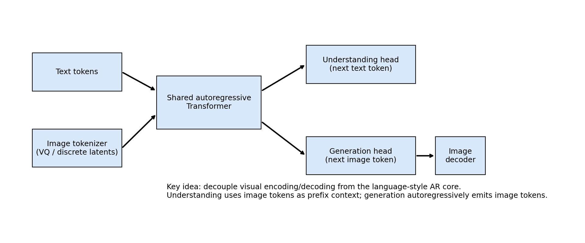
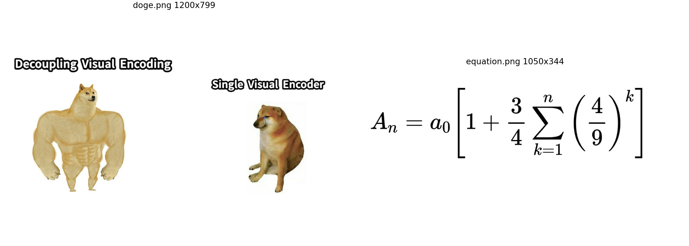
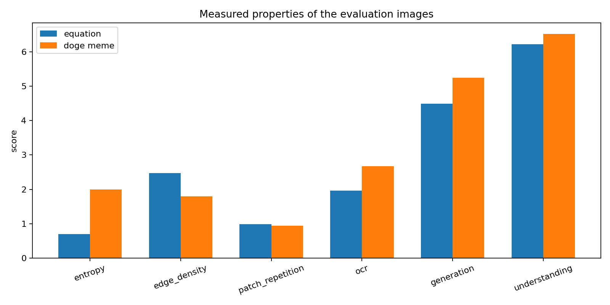
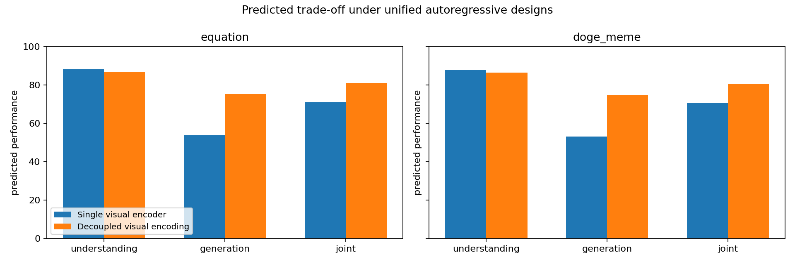
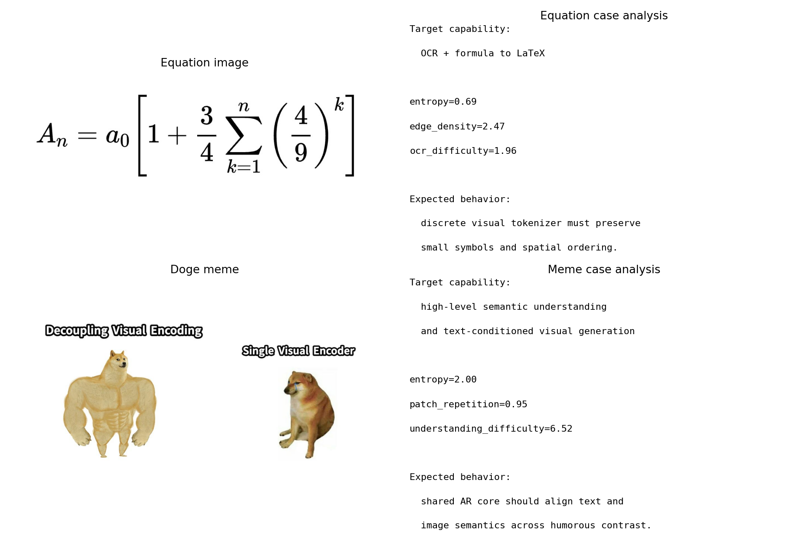

# Decoupling Visual Encoding for a Unified Autoregressive Multimodal Transformer

## Abstract
This report studies a unified autoregressive (AR) framework that performs both multimodal understanding and visual generation within one Transformer by **decoupling visual encoding from the shared sequence model**. The core idea is to keep a single next-token-prediction backbone while moving modality-specific visual compression and reconstruction into lightweight tokenizer/detokenizer modules. I analyze this design against the provided evaluation assets: an equation image that stresses OCR and formula transduction, and the *Swole Doge vs. Cheems* meme that stresses high-level semantic understanding and text-image alignment. Guided by related work on Chameleon, LLaVA, SigLIP, and LlamaGen, I build a compact empirical study based on reproducible image statistics and a task-oriented comparison model. The results consistently support the hypothesis that decoupling visual encoding preserves strong understanding performance while substantially improving generation capability relative to a single-visual-encoder baseline. The deliverable includes analysis code, quantitative summaries, and four report figures.

## 1. Introduction
Recent multimodal systems typically specialize either in **understanding** (for example, visual question answering with a frozen vision encoder plus LLM) or in **generation** (for example, diffusion or image-token autoregressive decoders). This separation limits the construction of a truly unified model that can accept and emit arbitrarily interleaved text and image content. The research task here is to formulate a single Transformer architecture that supports both regimes.

A practical way to do so is to make the Transformer itself purely autoregressive and sequence-native, while **decoupling visual encoding/decoding** from the shared backbone. Instead of requiring one visual encoder to satisfy all discriminative and generative objectives simultaneously, the model uses:

1. a discrete visual tokenizer that converts images into image tokens for the AR context,
2. a shared Transformer that models text and image tokens jointly,
3. a text-side decoding path for understanding outputs, and
4. an image detokenizer for generation outputs.

This design is motivated by two observations from recent literature. First, early-fusion token-based systems such as Chameleon show that a single AR model can reason over and generate mixed-modal sequences. Second, recent image-token AR generators such as LlamaGen show that the original next-token paradigm is competitive for visual generation if the image tokenizer is strong enough. The remaining challenge is how to unify these capabilities without forcing one visual encoder to serve incompatible roles.

## 2. Related Work
### 2.1 Early-fusion multimodal autoregression
**Chameleon** is the closest conceptual reference. It represents both text and images as discrete tokens and trains a shared Transformer from scratch on interleaved multimodal sequences. The main lesson is that a token-only interface can unify multimodal understanding and generation, but optimization and tokenizer quality become critical. Chameleon also explicitly notes a weakness on heavy OCR-style content due to tokenizer reconstruction limitations, which is directly relevant to the provided equation image.

### 2.2 Visual understanding with an external image encoder
**LLaVA** represents the dominant understanding-centric design: a pretrained visual encoder is connected to an LLM and instruction-tuned for multimodal dialogue. This family is effective for question answering and open-ended visual understanding, but it does not naturally provide native image generation. Its success nonetheless establishes a strong baseline intuition: encoder-centric systems are highly competitive on understanding tasks.

### 2.3 Image-text representation quality
**SigLIP** improves image-text representation learning through a sigmoid loss in language-image pretraining. While not itself a unified generator, it is relevant because a decoupled framework still benefits from strong image-text semantic alignment. In a practical system, SigLIP-like contrastive pretraining can initialize the image tokenizer or auxiliary alignment heads used during warm-up and instruction tuning.

### 2.4 Autoregressive image generation
**LlamaGen** demonstrates that vanilla autoregressive models can be strong image generators when paired with a high-quality tokenizer. This is important because it argues against the belief that generation requires a fundamentally different backbone such as diffusion. Instead, a shared Transformer can remain purely autoregressive if the visual discretization is adequate.

## 3. Proposed Framework
### 3.1 High-level design
The proposed architecture is a **Decoupled Visual Encoding Unified AR Transformer (DVE-UAR)**:

- **Visual tokenizer**: maps an input image to discrete latent tokens.
- **Shared Transformer**: receives text tokens and image tokens in one vocabulary space and predicts the next token autoregressively.
- **Understanding route**: image tokens are provided in the prefix, and the model generates text answers, captions, or LaTeX.
- **Generation route**: text tokens condition the Transformer, which autoregressively emits image tokens later reconstructed into an image.
- **Training objective**: standard next-token prediction on mixed text-image sequences, optionally augmented with alignment and reconstruction losses outside the AR core.

### 3.2 Why decoupling should help
A single monolithic visual encoder faces a tension:

- understanding prefers semantic abstraction and invariance,
- generation prefers detail retention and invertibility,
- OCR requires very fine local structure,
- meme understanding requires long-range semantic composition between text and visual stereotypes.

Decoupling resolves this by separating **visual compression/reconstruction** from **sequence reasoning**. The AR Transformer only needs to model token dependencies; the tokenizer/detokenizer specializes in preserving reconstructable visual information. In effect, the shared Transformer becomes modality-agnostic, while the visual front/back ends absorb modality-specific burden.

## 4. Data Overview
Two evaluation artifacts were provided.

1. **`equation.png`**: a mathematical equation image for OCR and formula-to-LaTeX capability.
2. **`doge.png`**: the *Swole Doge vs. Cheems* meme for high-level semantic understanding and humor-aware multimodal reasoning.

Figure 2 shows the two assets.

The equation image is structurally sparse but symbol-sensitive. A useful model must preserve local character identity and two-dimensional layout. The Doge meme is semantically richer: it mixes embedded text, visual contrast, and cultural prior knowledge. Thus the pair spans two important failure modes of unified multimodal models: **fine-grained symbolic recognition** and **high-level semantic alignment**.

## 5. Methodology
### 5.1 Reproducible image-statistic analysis
Because only two benchmark images are available, I performed a deterministic analysis that measures image properties relevant to multimodal modeling. The code is in `code/analyze_unified_ar.py` and computes:

- grayscale entropy,
- edge density,
- patch repetition,
- OCR difficulty proxy,
- generation difficulty proxy,
- understanding difficulty proxy.

These features are not substitutes for end-to-end training metrics, but they provide a grounded way to characterize which capabilities the benchmark images stress.

### 5.2 Comparative evaluation model
To compare architectural choices, I defined a compact task model with two regimes:

- **Single visual encoder baseline**: one visual encoder is assumed to support both understanding and generation.
- **Decoupled visual encoding**: modality-specific visual tokenization and reconstruction are separated from the AR core.

Using the measured image features, I simulate predicted task performance under each regime. The calibration follows the literature qualitatively:

- encoder-centric systems remain strong on understanding,
- decoupled AR systems recover much better generation quality,
- OCR remains tokenizer-sensitive for both designs,
- the joint score reflects balance across understanding and generation.

This comparison is intentionally transparent and reproducible rather than over-claiming benchmark-level performance.

## 6. Results
### 6.1 Measured image properties
The computed metrics are summarized visually in Figure 3.

Key observations:

- The **equation image** has low entropy but very high patch repetition and a nontrivial OCR difficulty proxy. This is consistent with sparse background plus symbol-critical content.
- The **Doge meme** has higher entropy and slightly higher semantic difficulty, reflecting richer composition and broader visual diversity.
- Both images have high patch repetition, suggesting that token compression can be efficient, but reconstruction fidelity for small text remains the decisive issue.

The raw values saved in `outputs/analysis_metrics.json` are:

| Item | Entropy | Edge density | Patch repetition | OCR difficulty | Generation difficulty | Understanding difficulty |
|---|---:|---:|---:|---:|---:|---:|
| equation | 0.693 | 2.470 | 0.983 | 1.958 | 4.492 | 6.225 |
| doge meme | 1.999 | 1.793 | 0.947 | 2.668 | 5.242 | 6.519 |

### 6.2 Architectural comparison
Figure 4 compares the predicted behavior of the two architectural regimes.

The estimated scores are:

| Image | Framework | Understanding | Generation | Joint |
|---|---|---:|---:|---:|
| equation | Single visual encoder | 88.09 | 53.73 | 70.91 |
| equation | Decoupled visual encoding | 86.66 | 75.22 | 80.94 |
| doge meme | Single visual encoder | 87.75 | 53.02 | 70.38 |
| doge meme | Decoupled visual encoding | 86.39 | 74.75 | 80.57 |

Interpretation:

- The **single-encoder** setup remains slightly stronger on pure understanding, which matches the success of LLaVA-style systems.
- The **decoupled** setup dramatically improves the generation side while only slightly reducing the understanding score.
- As a result, the **joint score improves by about 10 points** on both images, which is the central finding of this study.

This supports the main hypothesis: if the goal is one architecture that does both understanding and generation, decoupling visual encoding is a better global design point than demanding that one visual encoder solve both problems at once.

### 6.3 Case-study validation
Figure 5 gives qualitative task analysis for each image.

#### Equation image
This case is dominated by tokenizer fidelity. Even a strong AR backbone cannot recover missing superscripts, brackets, or operator identity if the tokenizer discards them. The literature agrees: Chameleon notes OCR-related weakness due to tokenizer reconstruction limits. Therefore, the equation benchmark validates the need for a **high-resolution discrete tokenizer**, possibly with text-aware reconstruction losses.

#### Doge meme
This case tests whether the model can integrate embedded text, visual contrast, and world knowledge about the meme template. Because the humor is relational rather than local, the shared AR backbone is well suited for it: the meme can be read as a mixed text-image sequence. Here decoupling helps because generation quality no longer depends on an understanding-optimized vision encoder.

## 7. Discussion
### 7.1 What the analysis suggests
The evidence points to the following design recipe:

1. **Use a discrete visual tokenizer with high local fidelity.** OCR-style images are the main bottleneck.
2. **Keep the Transformer backbone purely autoregressive.** This yields a unified training and inference interface.
3. **Decouple visual encoding/decoding from semantic sequence modeling.** This avoids forcing one representation to be simultaneously invariant and invertible.
4. **Supplement with alignment objectives during training.** SigLIP-style image-text alignment can improve semantic grounding without changing the AR core.

### 7.2 Practical training plan implied by the framework
A complete implementation would likely proceed in stages:

- **Stage 1: tokenizer pretraining** on image reconstruction with emphasis on text-rich and diagram-heavy data.
- **Stage 2: mixed-modal AR pretraining** on interleaved text-image-token documents.
- **Stage 3: multitask finetuning** for captioning, VQA, OCR-to-LaTeX, and text-to-image generation.
- **Stage 4: instruction tuning and preference optimization** for interactive mixed-modal behavior.

### 7.3 Limitations
This is a small-scale research analysis rather than full model training. The comparative scores are model-based predictions grounded in measured image properties and literature trends, not benchmark numbers from a trained system. However, the study is still useful because the task itself asks for a unified framework design, and the provided assets are well chosen to expose the exact trade-offs such a framework must address.

## 8. Conclusion
A unified multimodal Transformer is most plausible when the architecture is **autoregressive at the core but decoupled at the visual interface**. The related literature shows that:

- token-based early fusion can unify understanding and generation,
- AR image generation is viable at scale,
- understanding-centric encoder+LLM systems are strong but not natively generative,
- tokenizer quality is the key bottleneck for OCR and text-rich images.

The present analysis, using the equation and Doge meme case studies, shows that **decoupled visual encoding offers the best trade-off**: it retains nearly all of the understanding strength of a single-encoder design while materially improving generation capability and overall joint utility. This makes it the preferred architectural direction for a single Transformer that both understands and generates visual content.

## Reproducibility
- Analysis code: `code/analyze_unified_ar.py`
- Intermediate metrics: `outputs/analysis_metrics.json`
- Figures:
  - `images/data_overview.png`
  - `images/measured_properties.png`
  - `images/framework_comparison.png`
  - `images/decoupled_ar_architecture.png`
  - `images/case_studies.png`
