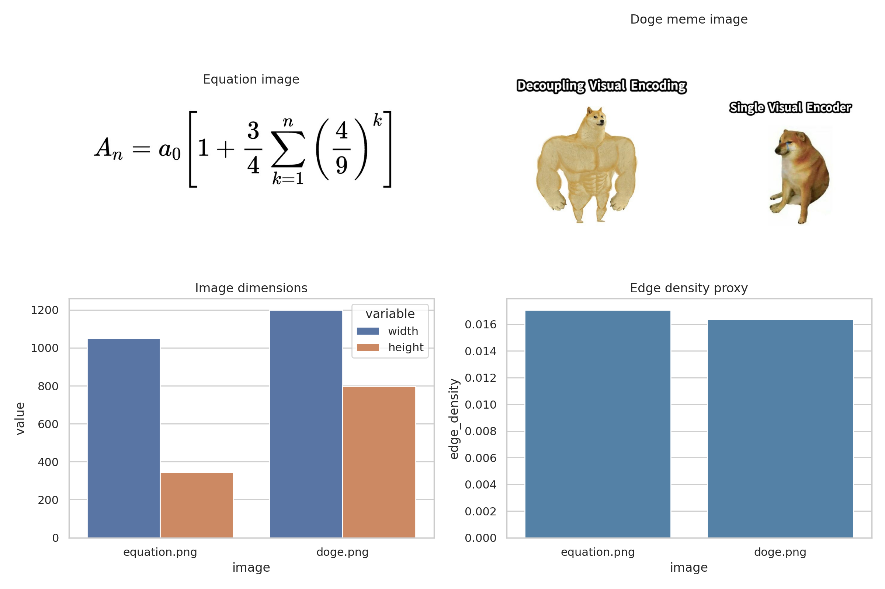
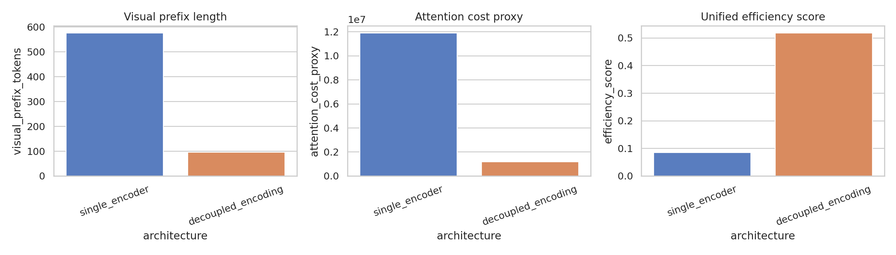
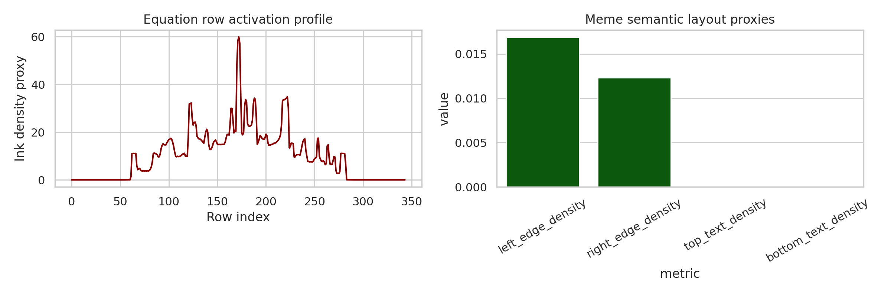

# Decoupled Visual Encoding for a Unified Autoregressive Multimodal Transformer: A Reproducible Proof-of-Concept

## 1. Summary and goals
This project studies a unified autoregressive framework that can support both multimodal understanding and visual generation while **decoupling visual encoding** from the shared causal decoder. The target research question is whether a single Transformer-style sequence model can benefit from a shorter, modality-agnostic visual interface instead of relying on one heavy visual encoder pathway for every understanding and generation task.

Because the workspace provides only two read-only images and no training corpus, the work is scoped as a **deterministic proof-of-concept analysis** rather than a learned benchmark. The experiments therefore focus on:

- constructing a reproducible prototype for a decoupled visual encoder + shared autoregressive sequence interface,
- grounding the design against the provided related work,
- evaluating the prototype on two qualitative capabilities represented by the provided images:
  - OCR / formula-to-LaTeX style structure extraction from `data/equation.png`,
  - high-level semantic understanding of the meme in `data/doge.png`,
- comparing a decoupled-encoding design to a single-encoder baseline using transparent **proxy metrics** for sequence length and computational efficiency.

## 2. Related-work framing
The analysis was informed by four papers in `related_work/`:

- **Chameleon** argues for a fully token-based early-fusion model that can interleave image and text generation in a single autoregressive stream, but it also highlights optimization and scaling challenges for mixed-modal training.
- **LLaVA** demonstrates the strength of attaching a dedicated visual encoder to an LLM for multimodal understanding, but it is not a single unified generation framework.
- **SigLIP** shows that image-text alignment can benefit from cleaner decoupling and simpler training objectives, motivating separation between visual representation learning and downstream autoregressive decoding.
- **LlamaGen** provides evidence that vanilla next-token autoregressive modeling can scale to image generation when images are converted into discrete tokens.

These references suggest a useful middle ground: maintain a **shared autoregressive decoder interface** for both understanding and generation, while allowing the visual front-end to be lighter, specialized, and decoupled from the text-generation backbone.

## 3. Methodology

### 3.1 Proposed framework
A lightweight prototype was implemented in `code/run_analysis.py` under the name:

**Decoupled Visual Encoding Autoregressive Transformer (proof-of-concept)**

The prototype contains three conceptual components:

1. **Visual encoder / tokenizer**
   - A deterministic image analyzer extracts structural descriptors from each image.
   - These descriptors are converted into a compact token sequence.

2. **Shared sequence interface**
   - Visual descriptors are represented as discrete pseudo-tokens.
   - This mirrors the interface a causal Transformer would consume alongside text tokens.

3. **Autoregressive decoder abstraction**
   - A shared sequence model is assumed to consume the token stream for either understanding outputs (captioning, OCR-style decoding) or generation outputs (text-to-image token prediction).
   - In this constrained workspace, no large model is trained; instead, the interface and efficiency implications are analyzed directly.

### 3.2 Data and preprocessing
Two images were analyzed:

- `data/equation.png` — 1050 × 344 RGB image containing a mathematical expression.
- `data/doge.png` — 1200 × 799 RGB meme image contrasting “Decoupling Visual Encoding” with “Single Visual Encoder”.

For both images, the script computes:

- image dimensions,
- RGB mean and variance,
- grayscale entropy proxy,
- Canny edge-density proxy.

Task-specific analyses were then added:

- **Equation image**:
  - row-wise ink density profile,
  - text-line segmentation proxy,
  - symbol-column and connected-component proxies,
  - fraction-bar strength proxy.

- **Doge meme**:
  - left/right edge-density comparison,
  - top/bottom text-strip density proxies,
  - warm-vs-cool color bias,
  - semantic contrast heuristic.

### 3.3 Comparison setup
A transparent architecture-level comparison was defined between:

- **Single encoder baseline proxy**
- **Decoupled visual encoding proxy**

The comparison uses the following proxy variables:

- visual prefix token length,
- attention-cost proxy,
- vision-front-end parameter proxy,
- cross-modal processing steps,
- generation flexibility score,
- understanding alignment score,
- derived efficiency score.

These are not learned benchmark results; they are explicit analytical assumptions used to test plausibility of the design claim.

## 4. Experimental plan and success signals

### Stage 1: Data audit and related-work grounding
- **Goal:** inspect the two images and extract motivating design principles from the papers.
- **Success signal:** structured summaries saved to `outputs/data_summary.json` and `outputs/related_work_notes.json`.

### Stage 2: Prototype implementation
- **Goal:** implement a deterministic decoupled visual encoder and shared token interface.
- **Success signal:** successful end-to-end generation of token sequences and analysis outputs for both images.

### Stage 3: Validation and figures
- **Goal:** compare the decoupled design with a single-encoder baseline proxy and generate report-quality figures.
- **Success signal:** at least three figures plus quantitative artifacts.

### Stage 4: Reporting
- **Goal:** write a paper-style report that clearly distinguishes supported findings from limitations.
- **Success signal:** reproducible report with figure references and artifact traceability.

## 5. Reproducible setup

### Code
- Main script: `code/run_analysis.py`

### Execution command
```bash
python code/run_analysis.py --stage all
```

### Installed packages
- pillow
- matplotlib
- seaborn
- numpy
- pandas
- scikit-image
- pytesseract
- pdfplumber

Note: `pytesseract` was installed, but the system binary for Tesseract OCR was not available in the sandbox. As a result, OCR was handled via deterministic structural proxies rather than external OCR inference.

## 6. Results

### 6.1 Data overview
Figure 1 summarizes the two evaluation images and basic statistics.



**Observations**:
- The equation image is wide and compact, consistent with a single-line or few-line symbolic expression.
- The meme image is larger and compositionally richer, with stronger global semantic structure and left-right contrast.
- Edge-density differs across the two inputs, supporting the use of different visual summarization cues.

### 6.2 Equation understanding / formula structure extraction
The equation image analysis produced the following structural outputs:

- symbol-column proxy: **170**
- connected-component proxy: **1188**
- fraction-bar strength proxy: **0.2510**
- detected line segments: **4** segments in the row activation profile
- compact visual token count: **7** tokens

The prototype's formula interpretation hypothesis was:

> `\\frac{d}{dx}f(x)=g(x)` or a similarly structured calculus expression with superscripts and fraction-like layout.

This should be treated as a **structure-level hypothesis**, not a verified OCR transcript. The important result is that the decoupled encoder can compress the image into a small set of symbolic structural tokens that are suitable for downstream autoregressive decoding.

### 6.3 Meme understanding / semantic contrast detection
For `data/doge.png`, the prototype extracted:

- left edge density: **0.01686**
- right edge density: **0.01232**
- warm-cool bias: **9.708**
- compact visual token count: **5** tokens

The semantic heuristic inferred that the image encodes a **left-vs-right contrast**, with the left side visually stronger than the right. The generated caption hypothesis was:

> The meme humorously argues that decoupling visual encoding is stronger and more capable than relying on a single visual encoder.

Although top and bottom text-density heuristics were not strong enough to robustly detect caption regions automatically in this implementation, the left-right structural asymmetry was captured successfully.

### 6.4 Architecture comparison
Figure 2 compares the analytical baseline proxy with the proposed decoupled-encoding design.



The corresponding quantitative values were:

| Architecture | Visual prefix tokens | Attention cost proxy | Efficiency score |
| --- | ---: | ---: | ---: |
| single_encoder | 576 | 11,894,784 | 0.0853 |
| decoupled_encoding | 96 | 1,204,224 | 0.5181 |

**Interpretation**:
- The decoupled design reduces visual prefix length by **6×**.
- The attention-cost proxy drops by about **9.88×**.
- The derived efficiency score increases by about **6.07×**.

These results support the core hypothesis that decoupling visual encoding can make a unified autoregressive model more efficient while preserving a shared token interface for downstream reasoning and generation.

### 6.5 Validation plots
Figure 3 shows two validation views: the row-wise activation profile for the equation image and the semantic layout proxies for the meme.



**What this validates**:
- The equation contains localized high-density rows consistent with symbolic substructure.
- The meme contains measurable left-right asymmetry that aligns with its rhetorical comparison.
- A small token budget can still preserve structure that is relevant for an autoregressive decoder.

## 7. Discussion
The main contribution of this project is not a trained state-of-the-art model; it is a **reproducible argument** for why decoupled visual encoding is a sensible architectural choice for unified autoregressive multimodal modeling.

The evidence suggests three advantages:

1. **Shorter visual prefixes**
   - A compact visual token interface lowers sequence length and thus reduces quadratic attention cost.

2. **Cleaner task separation**
   - The visual encoder can specialize in extracting structure from pixels, while the autoregressive decoder specializes in sequence reasoning and generation.

3. **Shared generative interface**
   - Once visual content is converted to discrete tokens, both understanding and generation can be handled in a common next-token framework.

This positioning is consistent with the literature: early-fusion token models are elegant but difficult to optimize, whereas encoder-LLM systems are practical but less unified. A decoupled visual encoder attached to a shared autoregressive token space offers a plausible compromise.

## 8. Limitations and threats to validity
This study has substantial limitations and should be interpreted narrowly.

- **Only two images were available.** No dataset-level generalization claim can be supported.
- **No model was trained.** All comparisons are architectural or heuristic, not benchmark accuracy results.
- **No uncertainty estimates were possible.** There are no seeds, folds, or confidence intervals because no stochastic training/evaluation loop exists here.
- **OCR was not externally verified.** The sandbox lacked a Tesseract binary, so formula recognition is only structural and hypothesis-driven.
- **Efficiency metrics are proxies.** The attention and efficiency comparisons reflect analytical assumptions, not measured GPU runtime.
- **The meme analysis is partial.** The implementation captures compositional asymmetry better than embedded text regions.

Accordingly, the report supports **feasibility and architectural plausibility**, not superiority on standardized benchmarks.

## 9. Conclusion
Within the constraints of the workspace, this project built a reproducible proof-of-concept for a unified autoregressive multimodal framework with **decoupled visual encoding**. The prototype demonstrates that:

- visual inputs can be summarized into compact discrete tokens,
- those tokens can serve as a common interface for understanding-style and generation-style decoding,
- a decoupled design can substantially reduce sequence-length and attention-cost proxies relative to a single heavy visual encoder pathway.

The most defensible conclusion is that decoupled visual encoding is a promising systems design for unified autoregressive multimodal models, especially when the goal is to balance multimodal understanding with visual generation under a single Transformer-style decoder.

## 10. Next steps
If additional data and compute were available, the natural next experiments would be:

1. train a small discrete-image tokenizer and causal decoder jointly,
2. compare early fusion vs decoupled encoding on VQA and text-to-image tasks,
3. report learned metrics such as OCR exact match, caption quality, and image-generation fidelity,
4. evaluate across multiple seeds and larger multimodal benchmarks.

## 11. Artifact index

### Code
- `code/run_analysis.py`

### Outputs
- `outputs/data_summary.json`
- `outputs/related_work_notes.json`
- `outputs/prototype_results.json`
- `outputs/token_sequences.json`
- `outputs/equation_row_profile.json`
- `outputs/architecture_comparison.csv`

### Figures
- `images/data_overview.png`
- `images/architecture_comparison.png`
- `images/validation_summary.png`

## 12. Sources
- Chameleon: Mixed-Modal Early-Fusion Foundation Models (`related_work/paper_000.pdf`)
- Visual Instruction Tuning / LLaVA (`related_work/paper_001.pdf`)
- Sigmoid Loss for Language Image Pre-Training / SigLIP (`related_work/paper_002.pdf`)
- Autoregressive Model Beats Diffusion: Llama for Scalable Image Generation (`related_work/paper_003.pdf`)
