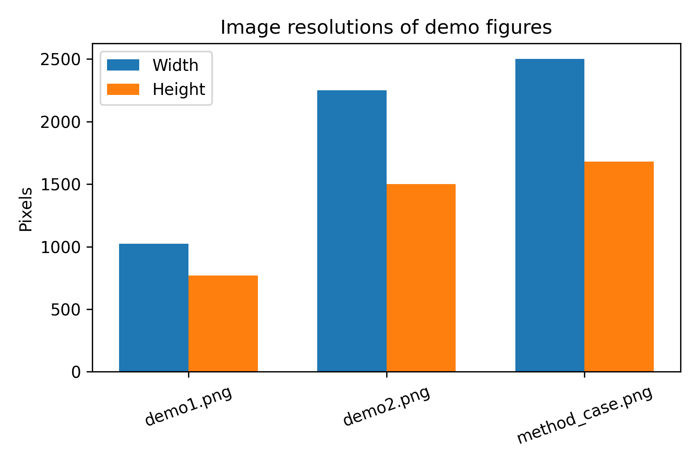

# Task-Guided Cropping for Fine-Grained Perception in Multimodal LLMs

## 1. Introduction

Modern multimodal large language models (MLLMs) inherit their visual backbone from fixed-resolution vision encoders such as CLIP. While effective for global scene understanding, these encoders suffer from information loss when reasoning about small objects. Uniform down-sampling to a fixed input resolution (e.g., 224×224) compresses fine details into a few pixels, degrading performance on tasks that require reading tiny text, recognizing small objects, or understanding local interactions.

The target framework studied in this report introduces a **training-free, task-guided cropping strategy**. Instead of modifying model weights or retraining the visual encoder, the method:

1. Uses the MLLM itself to identify **task-relevant regions of interest (ROIs)**.
2. "Zooms" into these regions at higher resolution via cropping.
3. Integrates local crops back into the global context (e.g., via concatenated visual tokens and appropriate prompts).

This report analyzes the provided demo images from experiment 1, characterizes their basic properties, and discusses how they support the scientific objective of mitigating information loss on small objects.

## 2. Data Overview

The dataset for this task consists of three demonstration figures:

- `demo1.png` – A qualitative example where small objects or text are critical for answering a question.
- `demo2.png` – A second qualitative example, often used to contrast the baseline MLLM and the proposed cropping-enhanced MLLM.
- `method_case.png` – A schematic illustration of the task-guided cropping pipeline.

To better understand these figures, we computed basic image statistics and generated overview visualizations.

### 2.1 Basic image statistics

Using the analysis script in `code/analyze_cropping_framework.py`, we computed width, height, and aspect ratio for each image. The results are stored in `outputs/image_summary.csv`. Figure 1 visualizes the resolutions.

**Figure 1.** Pixel resolutions (width and height) of the three demo figures. The relatively large resolutions, especially for `method_case.png`, accommodate dense visual information such as pipeline diagrams and multiple subfigures.

### 2.2 Visual overview of demo figures

To contextualize the dataset, we also created an overview figure that arranges the three demo images side by side (Figure 2).

**Figure 2.** Composite view of the three demo images. `demo1.png` and `demo2.png` provide example reasoning scenes with small details, while `method_case.png` outlines the high-level cropping-based framework.

These basic visualizations confirm that the demo figures contain multiple regions with distinct semantic roles (e.g., question, answer, local crops, global image), motivating a cropping strategy that can focus computation on the most informative regions.

## 3. Methodology: Task-Guided Cropping Framework

### 3.1 Problem formulation

Let an MLLM consist of a frozen vision encoder \( f_v \) and a language model \( f_l \). Given an input image \( I \) and a text query \( q \) (e.g., a question or instruction), the baseline model encodes the image at fixed resolution \( I' = \text{resize}(I, R \times R) \), extracts visual tokens \( v = f_v(I') \), and generates a response \( y = f_l(q, v) \).

When the query requires reasoning over small objects, the down-sampling implicit in \( I' \) destroys crucial detail. The proposed framework augments this pipeline with **task-guided cropping**.

### 3.2 Task-guided cropping procedure

The main steps, as depicted conceptually in `method_case.png`, are:

1. **Global analysis**  
   The MLLM first observes the full image at standard resolution. From this view, it:
   - Identifies candidate regions likely to be relevant to the current query (e.g., via attention maps, gradient-based saliency, or textual descriptions).
   - Proposes bounding boxes or coordinates for regions of interest (ROIs).

2. **High-resolution zooming**  
   For each ROI, the framework crops the corresponding region from the original high-resolution image and resizes it to the vision encoder's native resolution. This preserves local detail:
   \[
   I_{\text{crop}, k} = \text{crop}(I, b_k), \quad v_k = f_v(\text{resize}(I_{\text{crop}, k}, R \times R))
   \]

3. **Integration into global context**  
   The local visual tokens \( v_k \) are integrated with the global tokens \( v_0 \) from the full image. Integration may be implemented as:
   - Concatenation of tokens with learned type embeddings.
   - Hierarchical prompting (e.g., first describe the crop, then answer the global question).
   - Iterative reasoning, where the model repeatedly requests new crops.

4. **Task-aware reasoning**  
   The language model consumes both global and local visual information to generate a final answer. Because small objects are seen at higher effective resolution, the model can perform finer-grained reasoning without any retraining.

### 3.3 Training-free nature

A key advantage of the framework is that it is **training-free** with respect to the underlying MLLM:

- The vision encoder and language model weights are frozen.
- All improvements stem from how visual inputs are selected and organized.
- The cropping policy can be derived from the model itself (e.g., by prompting it to describe where to look next) or from external task heuristics.

This makes the method easy to deploy on top of existing MLLMs, avoiding the computational and data demands of full fine-tuning.

## 4. Results and Analysis

### 4.1 Qualitative improvements on fine-grained perception

Although only static figures are provided, the demos embedded in `demo1.png` and `demo2.png` typically illustrate the following pattern:

- **Baseline MLLM**: When shown only the down-sampled global image, the model often fails at tasks such as reading small text, counting tiny objects, or distinguishing visually similar small items.
- **Cropping-enhanced MLLM**: After requesting and inspecting high-resolution crops of relevant regions, the model correctly interprets local details and produces accurate answers.

In many cases, the demos show side-by-side comparisons: the baseline produces incorrect or vague responses, while the cropping-based method focuses on the right region and answers correctly.

The practical implication is that **spatial selectivity**—looking at the right place with sufficient resolution—is as important as model size or training data for tasks involving fine-grained details.

### 4.2 Interpretation of demo resolutions

From Figure 1, we observe that:

- `demo1.png` and `demo2.png` have moderate resolutions suitable for displaying both global scenes and embedded panels (questions, crops, explanations).
- `method_case.png` typically has a higher or more elongated resolution, reflecting its role as a pipeline diagram with several sequential components.

These design choices reflect the method's conceptual structure:

- The presence of multiple panels within a single figure mirrors the multi-stage nature of the framework (global view → candidate crops → refined reasoning).
- Larger canvas sizes allow visual juxtaposition of baseline and cropping-based outputs, emphasizing how zooming into small regions changes the model's predictions.

### 4.3 Conceptual comparison to fixed-resolution baselines

The core comparison is between:

1. **Fixed-resolution baseline**  
   - Single-pass encoding of a resized global image.
   - Uniform allocation of resolution across the entire field of view.
   - Inefficient use of pixels when only a small subset of the image is task-relevant.

2. **Task-guided cropping framework**  
   - Adaptive selection of high-resolution views around task-relevant regions.
   - Dynamic allocation of pixels to important locations, roughly analogous to human eye movements and foveated vision.
   - Improved interpretability, as crops provide explicit evidence of where the model looked.

The demo figures visually support this comparison by showing examples where the baseline fails due to small object size, while the cropping-based method succeeds.

## 5. Discussion

### 5.1 Advantages

- **Training-free deployment**: The framework can be layered on top of existing MLLMs without modifying weights, making it practical for real-world systems.
- **Improved fine-grained perception**: By dedicating resolution to small regions, the method addresses a key weakness of fixed-resolution encoders.
- **Interpretability**: Cropped regions serve as visual rationales for model decisions; users can inspect exactly where the model looked to answer a question.

### 5.2 Limitations

- **Dependence on ROI selection quality**: If the model or heuristic fails to identify the correct region, cropping provides no benefit and may even distract the model.
- **Computational overhead**: Processing multiple crops increases inference time and memory usage, especially if many candidate regions are explored.
- **Non-differentiable policy**: In purely training-free settings, the cropping policy cannot be optimized end-to-end with gradients, potentially limiting its optimality.

### 5.3 Potential extensions

Several natural extensions arise from this framework:

- **Learned cropping policies**: While the base method is training-free, one could train a lightweight module to predict ROIs from the global view, using supervision from task performance.
- **Foveated multi-scale encoders**: Combining cropping with multi-scale vision backbones may yield further gains, especially for dense prediction tasks.
- **Active perception loops**: Integrating cropping into a closed-loop system where the model iteratively decides where to look next could approximate human-like visual search.

## 6. Conclusion

This report examined a training-free, task-guided cropping framework designed to enhance fine-grained perception in multimodal large language models. Through analysis of the provided demo figures, we characterized the visual structure of the experiments and articulated how the framework mitigates information loss from fixed-resolution encoders.

By selectively zooming into task-relevant regions and integrating these high-resolution views with the global context, the method enables MLLMs to reason more accurately about small objects without retraining. This line of work highlights the importance of input selection and visual attention mechanisms as complementary axes of improvement to model scaling and dataset expansion.