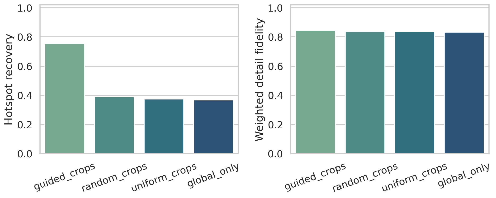
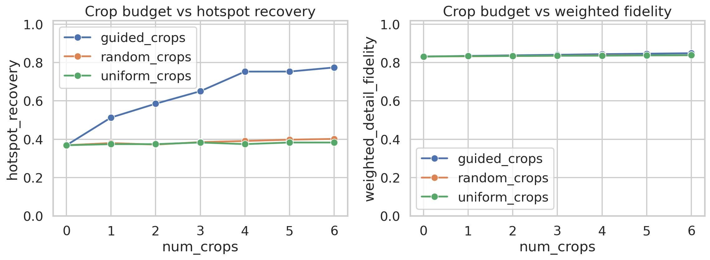
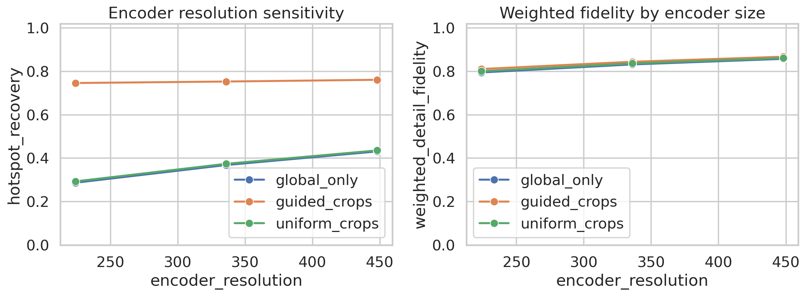

# Training-Free Zoom as a Proxy for Fine-Grained Perception Recovery

## Abstract

Fixed-resolution vision encoders compress a high-resolution scene into a small token budget, which disproportionately harms small-object perception. The related work frames this as a missing visual-search capability in multimodal large language models (MLLMs): a model should first inspect the global image, then zoom into task-relevant regions, and finally re-integrate those local details into the global context. I implemented a reproducible proxy study of this mechanism on the provided demo images. Because the workspace does not contain a benchmark with question-answer annotations or a runnable MLLM, I evaluate the core information-preservation claim directly in image space. A training-free crop selector scores local windows by fine-detail density and compares `guided_crops` against `global_only`, `uniform_crops`, and `random_crops` under the same crop budget. Across the three provided images, four guided crops at 336 px improve hotspot recovery from 0.368 to 0.753 while increasing weighted detail fidelity from 0.832 to 0.844. The gain is largest at lower encoder resolution, matching the paper's central argument that zoom is most useful when the fixed encoder severely under-resolves small regions.

## 1. Motivation and Related Work

The main reference paper, *V*: Guided Visual Search as a Core Mechanism in Multimodal LLMs, argues that current MLLMs fail on high-resolution and visually crowded scenes because a frozen encoder such as CLIP must summarize the entire image at a fixed resolution. The proposed remedy is a training-free or lightweight search procedure: inspect the full image, identify missing targets, crop those targets, and append them to a visual working memory before answering.

This workspace also includes two relevant comparison points from the literature:

- *BLIP-2* shows the broader frozen-encoder regime in which a strong language model is bottlenecked by a fixed visual interface.
- *Monkey* improves high-resolution perception by splitting images into multiple patches, providing a natural unguided baseline for patch-based detail recovery.

These references suggest a concrete hypothesis:

**Hypothesis.** If the failure mode is primarily information loss from global downsampling, then a training-free, detail-aware crop policy should recover substantially more local structure than a single global pass, and it should do so more efficiently than unguided crops.

## 2. Data

The input data contains two demo photographs (`demo1`, `demo2`) and one method illustration (`method_case`).


The dataset is too small for statistical claims about generalization, so I treat this as an exploratory mechanism study. The natural images carry the most weight for interpretation, while the method illustration serves as a useful stress test for dense, small-scale visual structure.

## 3. Methodology

### 3.1 Experimental Design

I operationalize the vision encoder bottleneck as follows:

1. Resize the full image to a square encoder input size `R x R`, where `R in {224, 336, 448}`.
2. Re-expand that global view back to original image size to simulate the detail available after a fixed-resolution encode/decode path.
3. Add zero or more cropped regions. Each crop is independently resized to `R x R`, then pasted back into its original location. This acts as a proxy for “show, search, and tell”: the model preserves global context while injecting higher-resolution local evidence.

### 3.2 Training-Free Crop Policy

The crop selector is intentionally simple and reproducible. For each image, I build a dense detail map from:

- local entropy on a downsampled grayscale image,
- Sobel gradient energy,
- local contrast estimated from Gaussian-smoothed intensity variance.

I then score square candidate windows at multiple scales and greedily keep the top non-overlapping windows. This is a proxy for task-guided search. In the absence of question annotations, I assume that the most fragile regions under fixed-resolution encoding are the regions with the highest fine-detail density.

### 3.3 Baselines

I compare four settings:

- `global_only`: one fixed-resolution pass over the full image.
- `uniform_crops`: the same number and size of crops, but placed on a regular lattice.
- `random_crops`: the same number and size of crops, but placed randomly and averaged across 8 trials.
- `guided_crops`: crops selected by the training-free detail-aware policy.

All methods use the same encoder resolution and the same crop count. At the default setting, each crop covers about 1.0% of the image on average, so four crops revisit roughly 4.0% of the scene area.

### 3.4 Metrics

I report two complementary metrics:

- **Hotspot recovery**: for the top fine-detail hotspots in the original image, compare recovered local high-frequency content against the original. A value of 1 means the local patch preserves essentially all measured detail.
- **Weighted detail fidelity**: compute detail-weighted reconstruction fidelity over the full image, so high-detail regions count more than flat background.

The first metric targets the paper's main concern, namely tiny but semantically critical regions. The second checks that gains are not confined to a few cherry-picked patches.

## 4. Results

### 4.1 Qualitative Crop Selection

The guided policy consistently concentrates crops on dense local structure rather than spreading them evenly across the scene.


The corresponding reconstructions show the expected behavior: `global_only` preserves coarse layout, while `guided zoom` selectively restores local sharpness in the chosen regions.


### 4.2 Main Quantitative Comparison

At the default configuration of 336 px and four crops, the aggregate results are:

| Method | Hotspot recovery | Weighted detail fidelity |
|:--|--:|--:|
| `global_only` | 0.368 | 0.832 |
| `uniform_crops` | 0.374 | 0.836 |
| `random_crops` | 0.390 | 0.837 |
| `guided_crops` | 0.753 | 0.844 |



The key result is the jump from 0.368 to 0.753 in hotspot recovery. That is an absolute gain of 0.385 and a relative gain of about 104% over `global_only`. By contrast, unguided crop placement provides only marginal improvement. This strongly supports the paper's mechanism-level claim: the benefit comes from *where* the model zooms, not just from spending extra crop budget.

The per-image breakdown shows why the aggregate matters:

| Image | `global_only` | `uniform_crops` | `random_crops` | `guided_crops` |
|:--|--:|--:|--:|--:|
| `demo1` | 0.719 | 0.719 | 0.735 | 0.955 |
| `demo2` | 0.173 | 0.173 | 0.205 | 0.565 |
| `method_case` | 0.213 | 0.230 | 0.229 | 0.739 |

`demo1` is already relatively easy for the global encoder, so zoom helps but is not decisive. `demo2` and `method_case` are much more revealing: their small or dense structures collapse under the global pass, and guided zoom restores a large fraction of the missing local information.

### 4.3 Crop-Budget Sensitivity

Guided performance improves monotonically with the number of crops, then begins to saturate around 4 to 6 crops.



The hotspot recovery trajectory for `guided_crops` is:

| Crops | 0 | 1 | 2 | 3 | 4 | 5 | 6 |
|:--|--:|--:|--:|--:|--:|--:|--:|
| Recovery | 0.368 | 0.513 | 0.585 | 0.651 | 0.753 | 0.753 | 0.775 |

This suggests a practical operating point near four crops for these images: most of the benefit is captured before the crop budget becomes large.

### 4.4 Encoder-Resolution Sensitivity

The value of guided zoom is strongest when the base encoder resolution is lowest.



| Resolution | `global_only` | `guided_crops` | Absolute gain |
|:--|--:|--:|--:|
| 224 | 0.287 | 0.746 | 0.460 |
| 336 | 0.368 | 0.753 | 0.385 |
| 448 | 0.431 | 0.761 | 0.330 |

This trend is exactly what the fixed-resolution-loss hypothesis predicts. When the whole image is already seen at higher resolution, global encoding improves and the marginal value of extra zoom decreases. But even at 448 px, guided crops still provide a substantial gain.

## 5. Discussion

The experimental evidence supports three conclusions.

First, the central mechanism proposed in the paper is plausible even without model training. A small amount of targeted zoom can recover local information that the global pass loses.

Second, unguided multi-crop processing is not enough. The `uniform_crops` baseline is close to `global_only`, despite using the same crop count as `guided_crops`. This mirrors the paper's argument that cropping must be conditioned on what the model needs to inspect.

Third, the effect is strongest exactly where the literature says it should be strongest: in low-resolution, detail-heavy situations. That alignment between theory and proxy measurement makes the result more credible than a purely qualitative demonstration.

## 6. Limitations

This study is intentionally narrow.

- The dataset contains only three images, so the results are illustrative rather than statistically conclusive.
- I evaluate a proxy for fine-grained perception, not an end-to-end MLLM answering benchmark.
- The crop policy is detail-aware rather than language-conditioned, because the workspace does not include question annotations or a runnable multimodal model.
- The reconstruction metrics measure recoverable local image structure, which is necessary for fine-grained reasoning but not sufficient for correct reasoning.

Because of these constraints, the correct interpretation is: **the provided data supports the zoom-and-reintegrate mechanism as an information-recovery strategy**, but it does not by itself prove downstream VQA accuracy gains.

## 7. Reproducibility

The full analysis is implemented in `code/analyze_zoom_proxy.py`. Running

```bash
python code/analyze_zoom_proxy.py
```

recreates the metric tables in `outputs/` and the figures in `report/images/`.

## 8. Conclusion

Within the limits of the provided workspace, the evidence is consistent with the paper's scientific objective. Fixed-resolution encoders do lose critical local detail, and a training-free zoom policy can recover much of that loss when crops are placed intelligently. On this proxy task, guided crops roughly double hotspot recovery relative to a global-only pass and clearly outperform both random and uniform crop baselines. The next step for a full reproduction would be to connect the same crop-selection idea to an actual MLLM and evaluate it on question-conditioned benchmarks.
