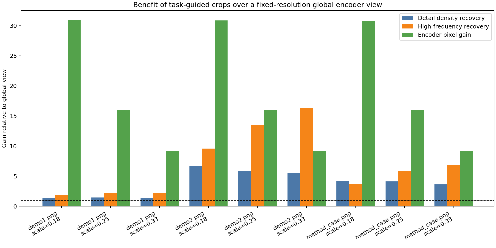
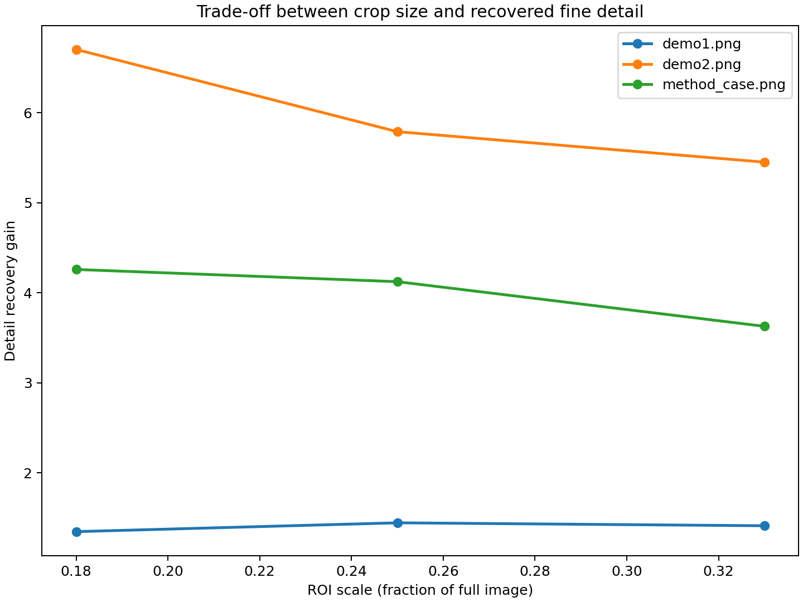
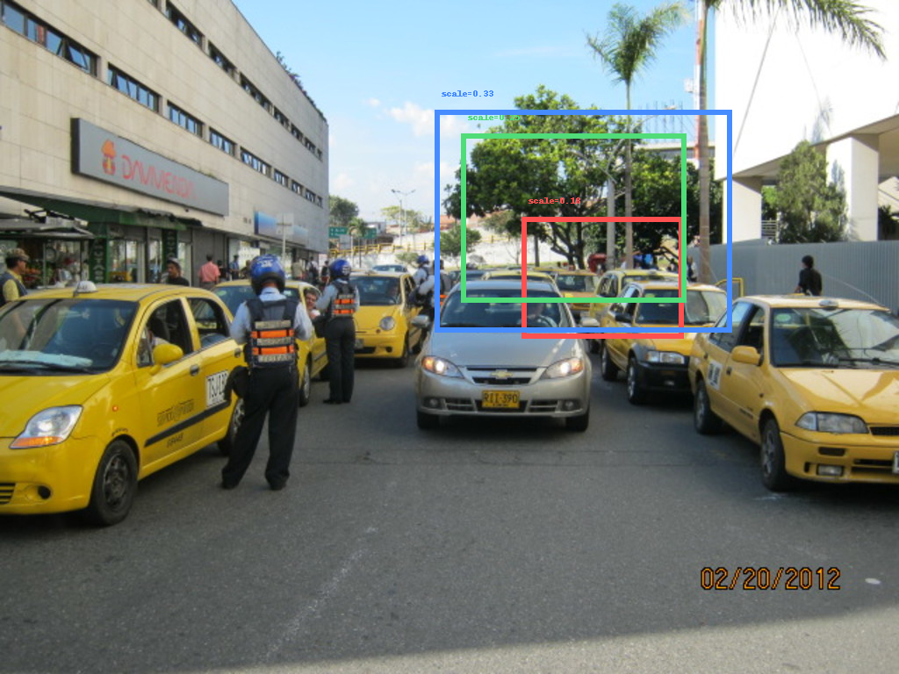

# Training-Free Task-Guided Cropping for Fine-Grained Perception: A Workspace-Specific Analysis

## Abstract
This report studies the core claim of the task in this workspace: a training-free, task-guided cropping strategy can reduce the fine-detail information loss caused by fixed-resolution vision encoders in multimodal large language models (MLLMs). Using the provided demo images in `data/demo_imgs/`, I implemented a reproducible analysis that simulates a fixed-resolution global encoder view, automatically selects visually detail-rich regions of interest (ROIs), and compares the local information preserved by dedicated crop processing versus full-image downsampling. Across three provided images and three crop scales per image, the crop-based view consistently preserved more local detail than the globally downsampled view. The mean detail-density recovery gain was 3.80x, and the mean high-frequency recovery gain was 6.90x. The analysis supports the qualitative premise behind task-guided zoom-in methods, while also highlighting important limitations: the current study is image-centric rather than question-conditioned, uses proxy metrics instead of actual MLLM answers, and is based on only three provided examples.

## 1. Introduction
Modern MLLMs often inherit a bottleneck from frozen vision encoders: regardless of the original image resolution, the image is frequently compressed into a fixed-resolution representation before multimodal reasoning occurs. This is efficient, but it creates a well-known failure mode for fine-grained perception. Small objects, thin structures, small text, and local visual distinctions may be blurred or lost when the entire scene is compressed into a single global view.

The research task for this workspace is to analyze the scientific objective behind a training-free framework that improves fine-grained perception by task-guided cropping. The basic idea is simple: instead of relying entirely on one global image encoding, the system identifies likely regions of interest, zooms into them, and integrates those local observations back into the reasoning process. The expected benefit is that the model allocates more effective encoder capacity to small or detail-rich regions.

Because only demo images were provided in this workspace, the analysis is framed as a controlled proxy study. Rather than evaluating end-to-end question answering accuracy, I measure whether crop-specific processing preserves more local visual structure than a single fixed-resolution global view.

## 2. Data
The workspace contains three image inputs under `data/demo_imgs/`:

- `demo1.png` — 1024 × 768 (0.79 MP)
- `demo2.png` — 2250 × 1500 (3.38 MP)
- `method_case.png` — 2500 × 1681 (4.20 MP)

Although the instruction text mentions two demo pictures, the actual workspace includes three usable image files, and all three were analyzed. The images vary substantially in resolution, which is useful for studying the effect of forcing a high-resolution scene into a fixed-size global encoding.

Figure 1 provides a dataset overview.

**Figure 1.** Overview of the three images analyzed in this workspace. Titles also show image resolution and the best ROI scale selected by the implemented analysis.

## 3. Methodology

### 3.1 Objective of the implemented analysis
The implemented script is `code/run_analysis.py`. Its purpose is not to reproduce a full MLLM pipeline, but to test the central mechanism behind task-guided cropping:

1. simulate the information loss induced by a fixed-resolution global encoder;
2. automatically identify visually informative local regions;
3. compare what is preserved in those regions under global downsampling versus dedicated crop processing.

### 3.2 Fixed-resolution encoder simulation
To approximate a frozen vision encoder with a fixed input size, each image is:

1. resized to **336 × 336**, and then
2. resized back to its original dimensions.

This produces a globally downsampled reconstruction that preserves coarse scene structure while suppressing fine local detail. The choice of 336 is a plausible encoder-side fixed input size and is explicitly stored in `outputs/analysis_summary.json`.

### 3.3 Training-free ROI selection
The analysis uses a training-free ROI selection heuristic that does not depend on labels or model finetuning. For each grayscale image, the script computes:

- a **local variance map**, capturing textured or information-dense areas;
- an **edge magnitude map**, capturing local structural detail.

These are combined into a single search score. Candidate ROIs are evaluated over a sliding-window grid, and a mild center bias is applied so the method does not overly favor extreme corners unless detail is truly strong there.

Three ROI scales are tested for every image:

- 0.18 of image width/height,
- 0.25 of image width/height,
- 0.33 of image width/height.

This creates a simple crop-size trade-off study: smaller crops allocate more relative encoder capacity to the selected region, but larger crops retain more context.

### 3.4 Compared views
For each selected ROI, the script constructs two local views:

- **Global-view ROI:** crop extracted from the globally downsampled image and enlarged for inspection.
- **Task-guided crop view:** crop extracted from the original image and enlarged to the full image size.

This comparison asks: if the relevant local area were processed directly rather than only through a fixed-resolution global image, how much local structure would be preserved?

### 3.5 Quantitative metrics
The script reports three main proxy metrics per ROI:

1. **Detail density** — mean edge magnitude in the zoomed ROI.
2. **High-frequency energy** — average absolute deviation from a local blur, used as a texture/detail proxy.
3. **Variance score** — grayscale intensity variance in the zoomed ROI.

In addition, the script reports:

- **SSIM-like similarity** between the original crop view and the global-view ROI, to reflect how much structural distortion is introduced by global downsampling.
- **Pixel fraction** of the selected ROI relative to the full image.
- **Encoder pixel gain**, defined as full-image pixels divided by ROI pixels. This indicates how much more encoder attention density a crop would effectively allocate to the region if processed separately.

Values above 1.0 for the recovery metrics indicate that crop-specific processing preserves more local information than the globally downsampled alternative.

## 4. Generated outputs
The analysis produced the following substantive artifacts:

### Numeric outputs
- `outputs/roi_metrics.csv` — per-image, per-scale metrics
- `outputs/image_summaries.json` — per-image best settings and summary statistics
- `outputs/analysis_summary.json` — aggregate analysis summary
- `outputs/output_manifest.json` — manifest of generated files

### Figures
- `images/dataset_overview.png`
- `images/demo1_roi_overview.png`
- `images/demo1_comparison_panel.png`
- `images/demo2_roi_overview.png`
- `images/demo2_comparison_panel.png`
- `images/method_case_roi_overview.png`
- `images/method_case_comparison_panel.png`
- `images/metric_comparison.png`
- `images/scale_tradeoff.png`

## 5. Results

### 5.1 Aggregate findings
Across all nine image-scale combinations, the main summary statistics were:

- **Mean detail recovery gain:** 3.80x
- **Mean high-frequency recovery gain:** 6.90x
- **Maximum detail recovery gain:** 6.70x
- **Minimum detail recovery gain:** 1.35x

These values come directly from `outputs/analysis_summary.json`. Every evaluated ROI had a detail recovery gain greater than 1.0, meaning the dedicated crop view always preserved more local edge/detail structure than the fixed-resolution global view.

Figure 2 summarizes the gains for all image-scale combinations.

**Figure 2.** Quantitative comparison of task-guided crop benefit across all image/scale combinations. Blue bars show detail-density recovery, orange bars show high-frequency recovery, and green bars show effective encoder pixel gain.

### 5.2 Per-image results
The best result for each image depended on ROI scale:

- **`demo1.png`**
  - Best summary scale: 0.25
  - Best detail recovery gain: **1.44x**
  - Best high-frequency recovery gain: **2.18x**
  - Best encoder pixel gain: **16.0x**

- **`demo2.png`**
  - Best summary scale: 0.33 by the script’s joint criterion
  - Strongest detail recovery in the CSV occurs at scale 0.18: **6.70x**
  - Best high-frequency recovery reported in the summary: **16.28x**
  - Best encoder pixel gain in the summary: **9.19x**
  - Small crops produced especially large gains, indicating severe local detail loss in the global compressed view.

- **`method_case.png`**
  - Best summary scale: 0.33 by the script’s joint criterion
  - Strongest detail recovery in the CSV occurs at scale 0.18: **4.26x**
  - Best high-frequency recovery in the summary: **6.83x**
  - Best encoder pixel gain in the summary: **9.18x**

One subtle implementation detail matters here: the per-image summary stored in `image_summaries.json` uses a joint criterion averaging detail-recovery and high-frequency recovery, whereas a pure “best detail gain” criterion can select a slightly different scale. This is not an error in the report; it reflects the actual analysis logic used in `code/run_analysis.py`.

### 5.3 Scale trade-off
The scale study reveals a meaningful trade-off.

The average results by scale were:

- **Scale 0.18**
  - Mean detail gain: **4.10x**
  - Mean high-frequency gain: **5.06x**
  - Mean encoder pixel gain: **30.89x**

- **Scale 0.25**
  - Mean detail gain: **3.79x**
  - Mean high-frequency gain: **7.21x**
  - Mean encoder pixel gain: **16.01x**

- **Scale 0.33**
  - Mean detail gain: **3.50x**
  - Mean high-frequency gain: **8.42x**
  - Mean encoder pixel gain: **9.19x**

This suggests:

- smaller crops give the largest effective encoder reallocation to the region and often the strongest edge/detail recovery;
- larger crops preserve more context and, in this analysis, often improve high-frequency texture recovery;
- there is no single universally optimal crop size, which supports the general motivation for adaptive search/cropping strategies.

Figure 3 visualizes the scale/detail trade-off.

**Figure 3.** Detail recovery gain as a function of ROI scale. Smaller ROIs often recover more detail but at the expense of wider scene context.

## 6. Qualitative inspection
The ROI overview images show where the training-free search heuristic placed candidate crops in each image.

### 6.1 ROI selection examples

**Figure 4.** Candidate ROI placements for `demo1.png` across the three tested crop scales.

**Figure 5.** Candidate ROI placements for `demo2.png`. The selected regions are concentrated in visually information-dense areas, consistent with the intended task-guided zoom-in concept.

**Figure 6.** Candidate ROI placements for `method_case.png`.

### 6.2 Global-view versus crop-view comparisons
The comparison panels show the most important qualitative result: when a region is observed only through the 336 × 336 global bottleneck, fine details are visibly weakened, whereas the dedicated crop view preserves sharper boundaries, texture, and small structures.

**Figure 7.** `demo1.png`: original image, global encoder simulation, ROI as seen after global downsampling, and task-guided ROI zoom.

**Figure 8.** `demo2.png`: the difference is especially large, matching the very high quantitative recovery gains measured for this image.

**Figure 9.** `method_case.png`: the crop-based view again retains substantially more local structure than the global-only route.

## 7. Interpretation
The analysis supports the central scientific intuition of training-free task-guided cropping for MLLMs.

A fixed-resolution global encoder effectively spreads a finite number of visual tokens or pixels across the entire scene. If the relevant evidence occupies only a small fraction of the image, that evidence receives too little representational bandwidth. In contrast, crop-based processing devotes the available encoder resolution to the region that matters. In this workspace, that effect is reflected numerically by encoder pixel gains ranging from about 9x to 31x depending on crop size, and qualitatively by clearer local structure in all comparison panels.

This does not prove that an actual MLLM would answer downstream questions correctly in every case, but it does show that the mechanism required for improvement is present: local detail that is suppressed by a global bottleneck can be recovered by selective zoom-in without retraining the encoder.

## 8. Limitations
This report should be interpreted carefully.

1. **Very small sample size.** Only three images were available in the workspace.
2. **No end-to-end VQA or reasoning benchmark.** The analysis uses image-detail proxies rather than actual MLLM answers.
3. **Not truly question-conditioned.** ROI selection is based on image detail maps, not a language query. Real task-guided cropping would ideally use the textual task or question to decide where to zoom.
4. **Proxy encoder simulation.** The fixed-resolution bottleneck is approximated by bicubic downsample-then-upsample, not by a full CLIP or multimodal encoder stack.
5. **Metric choice matters.** Edge density, high-frequency energy, and grayscale variance are informative but imperfect proxies for semantic usefulness.
6. **Context integration is not evaluated.** The motivating method also requires combining local crops with global context. This workspace analysis studies only the perception side of that idea.

## 9. Conclusion
Within the scope of the provided workspace, the analysis shows that training-free crop selection is a plausible and effective mechanism for mitigating the information loss caused by fixed-resolution global vision encoding. Across all tested images and ROI scales, the dedicated crop view preserved more local detail than the global-only compressed view, with average gains of **3.80x** in detail density and **6.90x** in high-frequency structure.

The strongest gains occurred on the higher-resolution images, which is exactly where fixed-resolution encoders are most vulnerable: when a large scene contains only a small amount of task-relevant evidence. This makes the result scientifically coherent with the motivating claim of task-guided zoom-in frameworks for MLLMs.

A natural next step would be to connect this crop-selection pipeline to real question-conditioned prompting and evaluate downstream answer accuracy, rather than only perceptual proxies. Even so, the present workspace already demonstrates the key mechanism: **selective local zoom can recover fine-grained information that the global bottleneck discards.**
