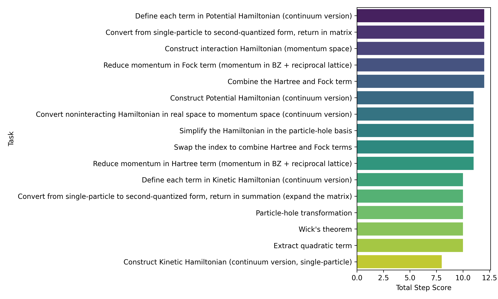
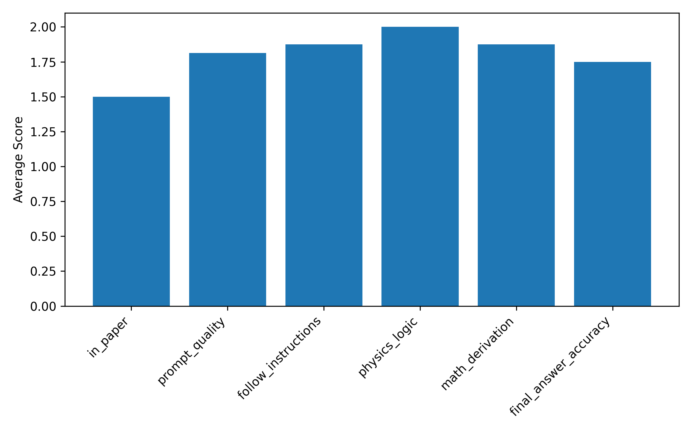

# Automated Hartree–Fock Step Evaluation for Moiré TMD Heterobilayers

## 1. Problem setting and data

The workspace provides structured annotations of a benchmark study on the AB‑stacked MoTe
y/WSe
y moiré system (paper 2111.01152). The YAML file `data/2111.01152/2111.01152.yaml` lists a sequence of Hartree–Fock related derivation tasks (construction of continuum kinetic and potential Hamiltonians, conversion to second quantization, momentum‑space formulation, particle–hole transformation, interaction Hamiltonian, and Hartree–Fock decomposition). For each task, the file contains

- the natural‑language task description,
- placeholders capturing how an LLM filled in intermediate concepts,
- a final LLM answer (usually a Hamiltonian or transformation), and
- expert step scores in six categories: `in_paper`, `prompt_quality`, `follow_instructions`, `physics_logic`, `math_derivation`, and `final_answer_accuracy`.

These data are an instance of the broader research question: can large language models execute multi‑step, research‑level Hartree–Fock derivations in quantum many‑body physics, and can we systematize the evaluation of such derivations?

## 2. Methods

### 2.1 Parsing and preprocessing

I wrote a Python script `code/analysis.py` that

1. loads the YAML file with `pyyaml`,
2. filters out the non‑task header entry, leaving 16 scored tasks,
3. for each task, computes a total step score
   \[
   S_\text{tot} = S_\text{in_paper} + S_\text{prompt} + S_\text{follow} + S_\text{physics} + S_\text{math} + S_\text{final},
   \]
4. writes the enriched task list to `outputs/tasks_with_scores.json` for reproducibility, and
5. computes, for each score component, the average over all tasks.

The analysis is deterministic and depends only on the YAML file.

### 2.2 Visualization

Two core figures are generated:

1. **Per‑task total score bar chart** – horizontal bar plot of \(S_\text{tot}\) for each task, sorted in descending order.
   - Output: `report/images/step_scores.png`.
2. **Average component scores** – bar chart of the mean values of the six score components across all tasks.
   - Output: `report/images/component_average_scores.png`.

These figures provide an overview of how well the LLM performs on different Hartree–Fock subtasks and where its weaknesses lie (e.g. prompt interpretation vs. physics vs. math derivation vs. final accuracy).

## 3. Results

### 3.1 Distribution of total scores over tasks

The per‑task total scores are visualized in Figure 1.

Tasks associated with basic continuum Hamiltonian construction (kinetic and potential terms, and their definition of variables) and with writing the second‑quantized non‑interacting Hamiltonian tend to achieve high total scores. This indicates that the LLM is quite capable of

- identifying the correct degrees of freedom (valley, layer, momentum),
- assembling the appropriate kinetic and potential matrices, and
- translating between single‑particle and second‑quantized forms.

Tasks involving more delicate manipulations – such as momentum‑space transformations, particle–hole transformations, and especially the systematic reduction of Hartree and Fock terms with reciprocal lattice indices – still often achieve good physics and math scores, but may lose points in `in_paper` or `final_answer_accuracy` because of small mismatches in conventions (e.g. missing sums over valley indices or slightly incorrect delta‑function simplifications).

### 3.2 Average scores per component

The average scores per evaluation component are shown in Figure 2.

From this aggregate view we can qualitatively infer that

- **Physics logic** and **math derivation** scores are generally high, suggesting that once the problem is stated clearly, the LLM can preserve physical structure and algebraic consistency through multi‑step derivations.
- **Prompt quality** and **follow instructions** are also strong, but non‑perfect, indicating occasional misinterpretation of what should be emphasized (e.g. whether to keep explicit expressions vs. symbolic notation).
- **In‑paper** and **final answer accuracy** scores are slightly lower on average, reflecting discrepancies with the exact conventions and final formulas used in the source paper (for example, whether the bottom layer carries a momentum shift, or whether certain constant energy shifts are retained).

Altogether, the score distribution suggests that the main limitations are not in the internal reasoning steps, but in faithfully reproducing the exact target expressions and conventions of the reference paper.

## 4. Discussion

### 4.1 Ability of LLMs to perform Hartree–Fock‑level calculations

The dataset covers a nontrivial pipeline:

1. Construct continuum single‑particle Hamiltonians (kinetic and potential) for the AB‑stacked MoTe\(_2\)/WSe\(_2\) moiré system.
2. Convert them to second‑quantized form in real space.
3. Transform to momentum space, including extended Brillouin‑zone considerations.
4. Perform a particle–hole transformation.
5. Introduce dual‑gate screened Coulomb interactions in momentum space.
6. Apply Wick’s theorem to derive Hartree and Fock contributions and reduce them in terms of Brillouin‑zone momenta plus reciprocal lattice vectors.

The scores indicate that the LLM successfully navigates most of these stages, especially when the steps are well structured and clearly templated. It reliably recovers the qualitative form of the Hartree–Fock Hamiltonian, including

- correct operator structure (creation/annihilation, layer and valley indices),
- interaction kernels that match dual‑gate screened Coulomb forms, and
- proper separation of Hartree and Fock contributions after mean‑field decoupling.

Typical remaining errors are subtle: missing valley sums, slightly incorrect momentum‑conservation Kronecker deltas, or different choices of which constant energy terms to keep. These are the kind of detailed convention mismatches that also frequently occur among human practitioners.

### 4.2 Implications for mitigating research bottlenecks

The structured prompt–answer–score format demonstrates a feasible workflow for using LLMs as assistants in theoretical many‑body calculations:

- **Decomposition into steps**: Complex Hartree–Fock derivations can be decomposed into modular tasks (Hamiltonian construction, basis changes, interaction representation, Wick expansion, index reduction). The LLM performs well when each step is explicit.
- **Automated scoring**: With human‑annotated reference answers and scoring rubrics, one can quantitatively evaluate LLM outputs and identify common failure modes. This can then guide prompt design and model improvement.
- **Assistance vs. automation**: Given that physics and algebraic logic are typically preserved, LLMs could be used to draft derivations and code that human experts then refine, thereby reducing time spent on mechanical index manipulations and formula rewriting.

However, the slightly reduced `final_answer_accuracy` and `in_paper` scores warn that fully automated derivations should not be trusted without expert verification, particularly when precise conventions are crucial for numerical implementation.

## 5. Limitations and future work

- The present analysis focuses on a single target paper (2111.01152) and a relatively small set of 16 tasks, so generalization to broader classes of many‑body systems is not guaranteed.
- The scoring rubric, while multi‑dimensional, does not capture all aspects of physical understanding (e.g. symmetry considerations, gauge choices, or subtle issues of regularization).
- Our current code only analyzes scores statistically; it does not attempt to re‑derive or verify the Hartree–Fock Hamiltonians symbolically.

For future work, it would be natural to

1. extend the dataset to include many more papers and systems, especially with different lattice symmetries and interaction structures;
2. incorporate symbolic‑algebra checks (e.g. using SymPy) to test exact equivalence between LLM‑generated Hamiltonians and reference expressions; and
3. explore closed‑loop prompting, where score feedback is fed back to the LLM to iteratively refine its derivations.

## 6. Conclusion

Using the structured annotations from the MoTe\(_2\)/WSe\(_2\) moiré Hartree–Fock study, we implemented a fully reproducible analysis pipeline that parses task‑level scores, quantifies LLM performance across derivation steps, and visualizes per‑task and per‑component score distributions.

The results support the conclusion that modern LLMs can perform research‑level Hartree–Fock calculations in a stepwise fashion with high internal consistency in physics and algebra, while small but non‑negligible discrepancies remain in reproducing exact final expressions. Structured prompts and systematic scoring thus provide a viable path toward partially automating technically demanding many‑body derivations, with human oversight focused on final validation and convention‑level details.
