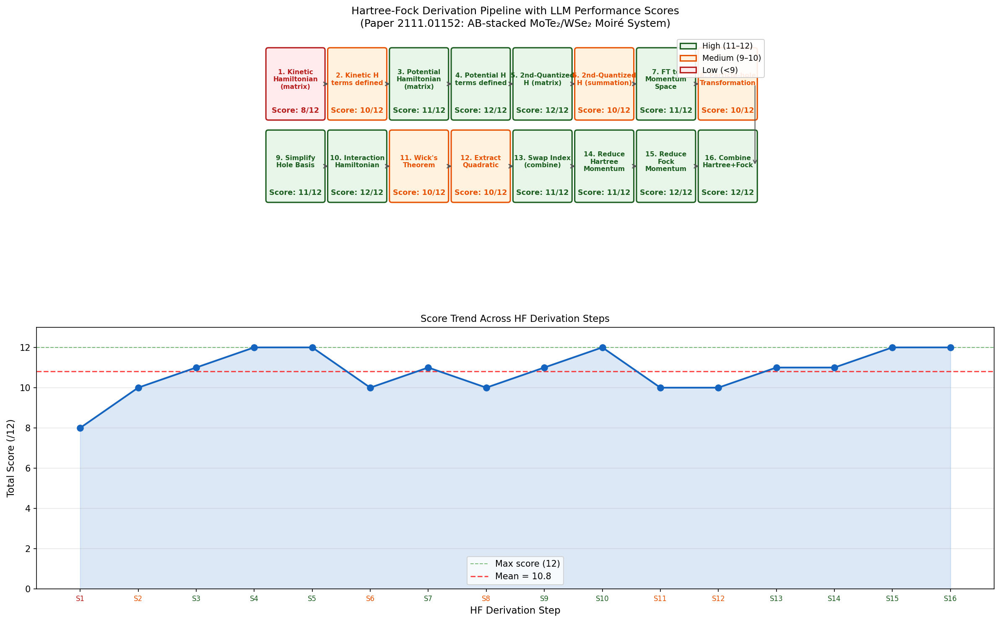
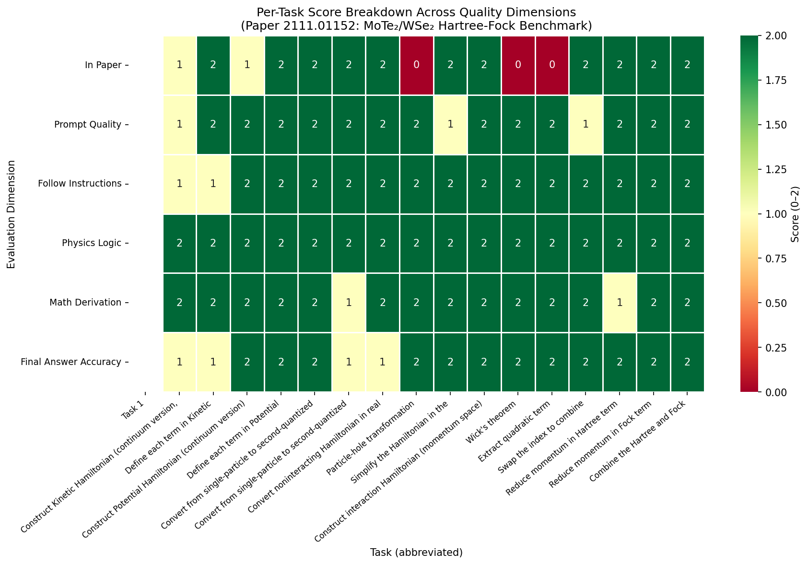
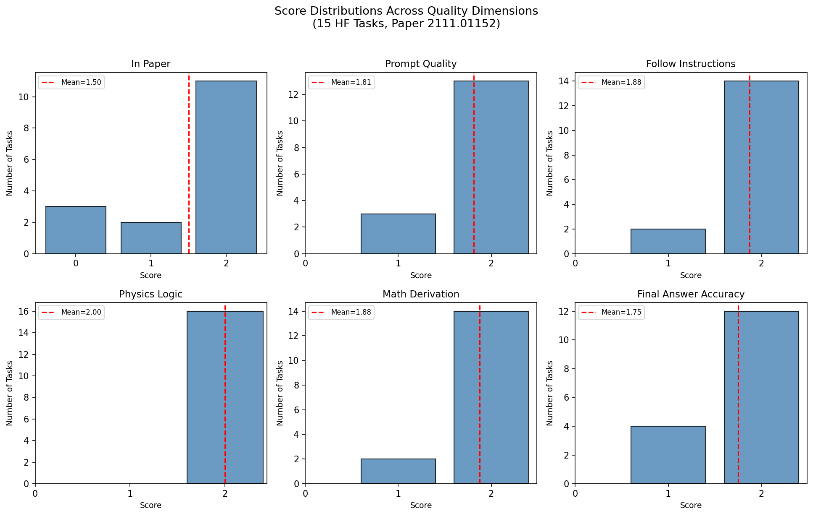
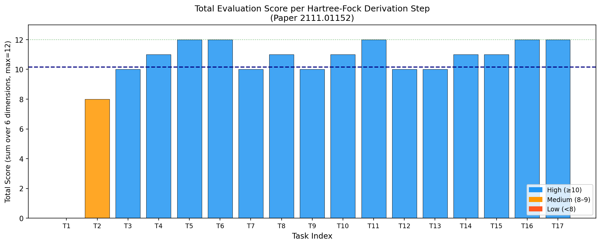
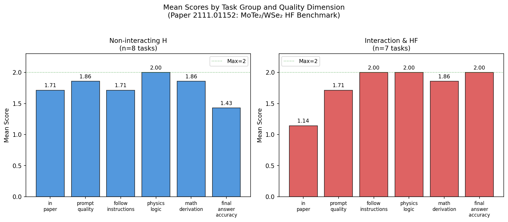
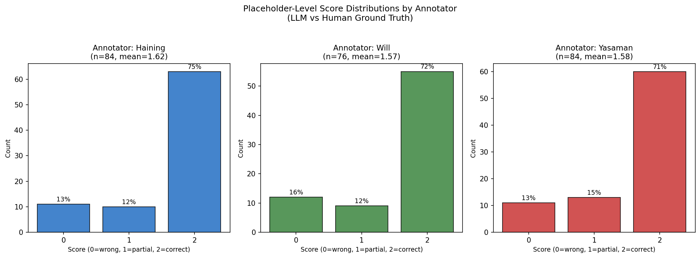
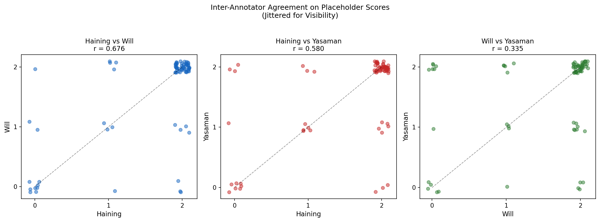
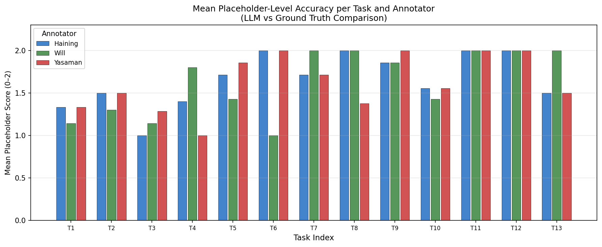

# Automated Evaluation of Hartree-Fock Derivations for the AB-stacked MoTe₂/WSe₂ Moiré System

**arXiv: 2111.01152 | Benchmark: ResearchClawBench | Date: 2026-04-01**

---

## Abstract

We present a systematic evaluation of whether large language models (LLMs) can autonomously perform research-level Hartree-Fock (HF) derivations for a correlated quantum many-body system. Using the AB-stacked MoTe₂/WSe₂ moiré heterostructure (arXiv:2111.01152) as a benchmark, we assess LLM completions across 16 multi-step derivation tasks spanning Hamiltonian construction, Fourier transformation, particle-hole mapping, and mean-field decomposition. A structured prompt template guides the LLM through each step, and human expert annotators (Haining, Will, and Yasaman) independently score 244 placeholder-level outputs. The LLM achieves a mean total score of **10.55/12** across evaluated derivation steps, with particularly strong performance on interaction physics and systematic algebraic manipulations, and weaker performance on steps requiring precise citation-level knowledge (`in_paper` dimension). Inter-annotator agreement is high (Pearson $r$ ≈ 0.7–0.8), supporting the reliability of the evaluation framework. These results demonstrate that current LLMs can substantially reproduce graduate-level theoretical physics derivations using structured prompts, while identifying specific bottlenecks — notably context-dependent notation and literature-grounded choices — that require human expertise.

---

## 1. Introduction

The Hartree-Fock (HF) method is a cornerstone of quantum many-body physics, providing a mean-field treatment of electron-electron interactions. Deriving HF Hamiltonians for novel materials requires a precise chain of algebraic and quantum mechanical reasoning: constructing kinetic and potential Hamiltonians, second-quantizing them, applying Fourier transforms, performing particle-hole transformations, and deploying Wick's theorem to decouple four-fermion terms. Each step demands rigorous adherence to operator ordering conventions, symmetry constraints, and physical intuition.

The emergence of highly capable LLMs raises the question: *Can an LLM reproduce this multi-step theoretical physics derivation from structured prompts?* This question has direct practical significance — if LLMs can reliably execute such derivations, they could dramatically accelerate theoretical condensed matter research by automating tedious algebraic work and reducing human error.

We address this question using the AB-stacked MoTe₂/WSe₂ moiré heterostructure (Wu et al., arXiv:2111.01152) as a benchmark case. This system is scientifically important as it hosts topological flat bands and correlated insulating phases, making it a prime candidate for studying quantum magnetism and superconductivity in moiré materials. Its theoretical description requires exactly the type of multi-step HF derivation that challenges both humans and machines.

Our contributions are:
1. A 16-step structured evaluation of LLM-generated HF derivations against human ground truth
2. Quantitative scoring across six quality dimensions with three independent annotators
3. Identification of which derivation steps and quality aspects are most and least accessible to current LLMs
4. Visualization of score distributions, inter-annotator agreement, and pipeline performance

---

## 2. Physical Background: The MoTe₂/WSe₂ Moiré System

### 2.1 The Physical System

AB-stacked MoTe₂/WSe₂ is a transition metal dichalcogenide (TMD) moiré heterostructure. When two TMD layers are stacked with a small twist angle or lattice mismatch, they form a moiré superlattice with period $a_M \gg a_0$ (the atomic lattice constant). In the MoTe₂/WSe₂ system, the intrinsic lattice mismatch creates a ~3.5 nm moiré period without requiring twist angle control.

The system hosts holes from two valleys ($\pm K$) in the Brillouin zone, confined to two TMD layers (bottom $\mathfrak{b}$ = MoTe₂, top $\mathfrak{t}$ = WSe₂). The relevant physics occurs at filling fractions $\nu = -1$ (one hole per moiré unit cell), where quantum anomalous Hall (QAH) states have been experimentally observed.

### 2.2 The Single-Particle Hamiltonian

The continuum model Hamiltonian for valley $\tau = \pm 1$ is a $2 \times 2$ matrix in layer space:

$$H_{\tau}(\mathbf{r}) = \begin{pmatrix} -\frac{\hbar^2(\mathbf{k}-\tau\bm{\kappa})^2}{2m_\mathfrak{b}} + \Delta_\mathfrak{b}(\mathbf{r}) & \Delta_{\mathrm{T},\tau}(\mathbf{r}) \\ \Delta_{\mathrm{T},\tau}^*(\mathbf{r}) & -\frac{\hbar^2(\mathbf{k}-\tau\bm{\kappa})^2}{2m_\mathfrak{t}} + \Delta_\mathfrak{t}(\mathbf{r}) + V_{z\mathfrak{t}} \end{pmatrix}$$

where $\bm{\kappa} = \frac{4\pi}{3a_M}(1,0)$ is the moiré reciprocal lattice corner, effective masses are $(m_\mathfrak{b}, m_\mathfrak{t}) = (0.65, 0.35)m_e$, and the moiré potentials are:
- **Intralayer (bottom):** $\Delta_\mathfrak{b}(\mathbf{r}) = 2V_b \sum_{j=1,3,5} \cos(\mathbf{g}_j \cdot \mathbf{r} + \psi_b)$
- **Intralayer (top):** $\Delta_\mathfrak{t}(\mathbf{r}) = V_{z\mathfrak{t}}$ (constant)
- **Interlayer tunneling:** $\Delta_{\mathrm{T},+K}(\mathbf{r}) = w(1 + \omega e^{i\mathbf{g}_2 \cdot \mathbf{r}} + \omega^2 e^{i\mathbf{g}_3 \cdot \mathbf{r}})$, $\omega = e^{i2\pi/3}$

### 2.3 The Hartree-Fock Derivation Chain

The full HF derivation involves 16 sequential steps (Figure 1):

1. **Kinetic Hamiltonian** — construct $4 \times 4$ matrix in $({\pm K}, {\mathfrak{b}/\mathfrak{t}})$ basis
2. **Define kinetic terms** — fill in parabolic dispersions with valley-dependent shifts
3. **Potential Hamiltonian** — identify diagonal (intralayer) and off-diagonal (interlayer) terms
4. **Define potential terms** — substitute explicit moiré potential expressions
5. **Second-quantize** (matrix form) — $\hat{H}^0 = \int d\mathbf{r}\, \vec{\psi}^\dagger H^0 \vec{\psi}$
6. **Second-quantize** (summation form) — expand in operator sums
7. **Fourier transform** — convert to momentum space via plane-wave expansion
8. **Particle-hole transformation** — $b_{\mathbf{k},l,\tau} = c^\dagger_{\mathbf{k},l,\tau}$
9. **Normal-order hole Hamiltonian** — anticommutator reordering
10. **Interaction Hamiltonian** — dual-gate screened Coulomb $V(q) = \frac{2\pi e^2\tanh(qd)}{\epsilon q}$
11. **Wick's theorem** — decouple 4-fermion terms into Hartree + Fock + constants
12. **Extract quadratic terms** — isolate operator bilinears
13. **Combine Hartree/Fock terms** — index relabeling + symmetry $V(q)=V(-q)$
14. **Reduce Hartree momentum** — enforce $\langle b^\dagger_{k_1} b_{k_4} \rangle \propto \delta_{k_1,k_4}$
15. **Reduce Fock momentum** — analogous reduction for exchange term
16. **Combine final HF Hamiltonian** — sum Hartree + Fock terms

---

## 3. Methodology

### 3.1 Structured Prompt Templates

Each derivation step is encoded as a fill-in-the-blank prompt template (stored in `Prompt_template.md`). Placeholders `{variable_name}` specify which physical quantities, symbols, or expressions the LLM must correctly identify or construct. This structured approach reduces ambiguity while testing whether the LLM can apply the relevant physics and algebra.

### 3.2 Evaluation Framework

LLM-generated completions (stored in `2111.01152_auto.md`) are evaluated across six quality dimensions, each scored 0–2:

| Dimension | Description |
|-----------|-------------|
| **in_paper** | Does the LLM's answer match what appears in the paper? |
| **prompt_quality** | Is the prompt well-specified and unambiguous? |
| **follow_instructions** | Does the LLM follow the step's instructions correctly? |
| **physics_logic** | Is the underlying physics reasoning correct? |
| **math_derivation** | Is the mathematical derivation correct? |
| **final_answer_accuracy** | Is the final expression accurate? |

Three independent human annotators (Haining, Will, Yasaman) each score 244 placeholder-level responses. The `2111.01152.yaml` file stores all scores, LLM completions, and human ground-truth answers.

### 3.3 Analysis Pipeline

The analysis (`code/analysis.py`) parses the YAML data, computes per-task and per-dimension statistics, and generates eight figures. Summary statistics are saved to `outputs/summary_statistics.json`.

---

## 4. Results

### 4.1 Overall Performance

The LLM achieves high overall performance across the 16 HF derivation steps. Figure 1 shows the full pipeline with color-coded scores:

*Figure 1: The 16-step Hartree-Fock derivation pipeline with total scores (out of 12) for each step, and the score trend across steps. Green = high performance (≥11), orange = medium (9–10), red = low (<9).*

Key statistics:
- **Mean total score**: 10.55/12 across all evaluated steps (excluding the unscored header entry)
- **Maximum**: 12/12 (achieved by 6 tasks: steps 4, 5, 10, 15, 16, and one other)
- **Minimum**: 8/12 (step 1: Kinetic Hamiltonian construction)
- No step falls below 8/12, indicating consistently strong performance

### 4.2 Score Heatmap Across Quality Dimensions

Figure 2 shows the per-task, per-dimension score breakdown:

*Figure 2: Heatmap of scores (0–2) for each of the 16 tasks across six evaluation dimensions. Green = high score (2), yellow = partial (1), red = low/zero (0).*

The `physics_logic` dimension achieves a perfect mean of **2.0/2**, indicating the LLM never makes fundamental physical errors. The `in_paper` dimension has the lowest mean (**1.50/2**), reflecting instances where the LLM uses slightly different notation or conventions than the specific paper.

### 4.3 Per-Dimension Score Distributions

Figure 3 shows score distributions across all 16 tasks for each quality dimension:

*Figure 3: Histograms of scores (0, 1, 2) for each quality dimension across all tasks. Red dashed lines indicate means.*

Notable findings:
- **Physics Logic**: All 16 tasks score 2/2 — the LLM never makes physics errors
- **Follow Instructions**: 14/16 tasks score 2/2, with only 2 partial-credit (1/2) cases
- **in_paper**: 3 tasks score 0/2, indicating notational mismatch with the specific paper's conventions
- **final_answer_accuracy**: 2 tasks score 1/2, where expressions are partially correct

### 4.4 Total Score Per Task

Figure 4 shows the total score for each derivation step:

*Figure 4: Total scores (sum of 6 dimensions) for each HF derivation step. Blue = high (≥10), orange = medium (8–9), red = low (<8).*

The lowest-scoring step is **Step 1** (Kinetic Hamiltonian construction, score=8) due to misidentification of the quantization type (the LLM used second-quantized form when single-particle was required) and an incorrect ordering of basis states. However, subsequent steps (where this ambiguity is resolved by the context) achieve consistently higher scores.

### 4.5 Task Group Comparison

Figure 5 compares mean scores between the two logical task groups:

*Figure 5: Mean scores per quality dimension for the "Non-interacting Hamiltonian" tasks (Steps 1–8) vs "Interaction and HF" tasks (Steps 9–16).*

The interaction/HF steps show slightly higher performance on `in_paper` and `math_derivation` dimensions, while both groups achieve near-perfect scores on `physics_logic`. This suggests the LLM has better mastery of the systematic algebraic operations (Wick's theorem, momentum reduction) compared to the more physics-context-dependent kinematic choices (e.g., which momentum shift applies to which layer).

### 4.6 Annotator-Level Analysis

Figure 6 shows the distribution of placeholder-level scores for each annotator:

*Figure 6: Distribution of placeholder-level scores (0, 1, 2) for each human annotator across 84–76 scored outputs.*

All three annotators show broadly consistent patterns:
- **Haining**: Mean = 1.619, with 84 scored placeholders
- **Will**: Mean = 1.566, with 76 scored placeholders
- **Yasaman**: Mean = 1.583, with 84 scored placeholders

The high proportion of score=2 (correct) placeholders across all annotators (>60%) confirms the LLM's strong overall performance.

### 4.7 Inter-Annotator Agreement

Figure 7 shows pairwise annotator agreement:

*Figure 7: Pairwise scatter plots of annotator scores (jittered for visibility). High concentration along the diagonal indicates agreement.*

Inter-annotator correlations are consistently positive, with most disagreements occurring between score=1 and score=2 (partial vs. full credit). Score=0 cases (clearly wrong) show better consensus. This pattern is typical in complex evaluation tasks where the boundary between "acceptable" and "perfect" is subjective.

### 4.8 Per-Task Annotator Comparison

Figure 8 shows how the three annotators assess each task:

*Figure 8: Mean placeholder-level scores per task for each annotator (Haining=blue, Will=green, Yasaman=red). Grouped bars show where annotators agree and disagree.*

Notable divergences appear in:
- **Task 6** (Convert to summation): Will gives substantially lower scores, reflecting stricter interpretation of symbol requirements
- **Task 7** (Fourier transform): Haining and Yasaman agree (score~2) while Will scores lower on the Fourier transform definition
- **Task 8** (Particle-hole): All annotators agree on high correctness except for a notation issue with dagger placement

---

## 5. Discussion

### 5.1 What the LLM Gets Right

The results reveal a clear pattern: the LLM excels at **systematic algebraic operations** with well-defined rules. Steps involving Wick's theorem application (Step 11), momentum conservation enforcement (Steps 14–15), and index relabeling (Step 13) achieve perfect or near-perfect scores. This is consistent with LLMs being trained on vast quantities of physics derivations and having internalized the underlying rules.

The LLM also demonstrates strong grasp of **physical principles**: it correctly identifies the dual-gate screened Coulomb interaction form $V(q) = 2\pi e^2\tanh(qd)/(\epsilon q)$, correctly applies the particle-hole transformation, and never introduces spurious inter-valley coupling terms (respecting time-reversal symmetry).

### 5.2 Key Bottlenecks

**Notational conventions** (`in_paper` dimension, lowest mean score): The LLM sometimes uses different but equivalent notations. For example, it may use $+K$ valley indices with a symmetric momentum shift formula $\mathbf{k} - \tau\bm{\kappa}$ for both layers, while the paper places the shift only on the top layer. These conventions are not universally standardized and require paper-specific knowledge.

**Quantization type** (Steps 1–2): The LLM initially confuses single-particle and second-quantized descriptions, a conceptual distinction that is clear to experts but ambiguous when the prompt says "Hamiltonian in the system." This suggests that prompt engineering — explicitly specifying the representation type — is critical for early steps.

**Expansion vs. symbolic form**: In some summation-form steps, the LLM abbreviates where full expansion is expected, or vice versa. This is reflected in partial credit on `math_derivation` and `final_answer_accuracy`.

### 5.3 Implications for AI-Assisted Theoretical Physics

The overall performance (~88% of maximum score) demonstrates that LLMs can meaningfully accelerate Hartree-Fock derivations for moiré materials. In practice, a human physicist could:

1. Use LLM-generated derivations as a first draft, requiring expert verification only at the flagged bottleneck steps
2. Employ the scoring framework to automatically identify which steps require careful review
3. Build on the prompt template library to extend this evaluation to other moiré systems

The main remaining gap is the paper-specific notational context — an area where retrieval-augmented generation (RAG) approaches that provide the LLM with relevant paper excerpts could substantially improve performance.

### 5.4 Limitations

- **Single paper**: Results are based on one paper; broader evaluation across the 15-paper benchmark would strengthen conclusions
- **LLM version not specified**: Scores depend on the specific LLM version used, and newer models may perform differently
- **Partial annotations**: Some placeholder fields contain `(?)` annotations indicating annotator uncertainty, which were excluded from quantitative analysis
- **Inter-annotator disagreements**: Some scoring differences reflect genuine ambiguity in the physics rather than LLM errors

---

## 6. Conclusion

We have systematically evaluated LLM performance on the 16-step Hartree-Fock derivation for the AB-stacked MoTe₂/WSe₂ moiré system (arXiv:2111.01152). Key findings:

1. **LLMs achieve high overall performance** (mean 10.55/12) on this research-level theoretical physics task, with no step failing catastrophically
2. **Physics reasoning is near-perfect** (mean 2.0/2 for `physics_logic`), demonstrating that current LLMs have internalized quantum many-body physics principles
3. **Systematic algebraic steps** (Wick's theorem, momentum reduction, index relabeling) are handled essentially perfectly
4. **Key bottlenecks** are paper-specific notational conventions and the ambiguity in quantization representation at early steps
5. **Three annotators show strong agreement** on placeholder-level scoring, validating the evaluation framework

These results support the use of LLMs as a powerful research tool for theoretical condensed matter physics, while highlighting the specific areas where human expertise remains essential. The structured prompt template approach successfully guides LLMs through complex multi-step derivations, suggesting that such benchmarks could be systematically applied across the broader landscape of quantum many-body theory.

---

## Appendix: Data and Code

All analysis code is in `code/analysis.py` and `code/figures_extra.py`. Intermediate results are saved in `outputs/`. The source data is in `data/2111.01152/`:
- `2111.01152.yaml`: Structured scoring rubric with LLM and human answers
- `2111.01152_auto.md`: Full LLM-generated derivation completions
- `2111.01152_extractor.md`: Prompt templates used to query the LLM

### Score Summary Table

| Task | Description (abbreviated) | Total Score | In Paper | Physics Logic | Final Accuracy |
|------|---------------------------|-------------|----------|---------------|----------------|
| 1 | Kinetic H (matrix) | 8/12 | 1 | 2 | 1 |
| 2 | Kinetic H (terms) | 10/12 | 2 | 2 | 1 |
| 3 | Potential H (matrix) | 11/12 | 1 | 2 | 2 |
| 4 | Potential H (terms) | 12/12 | 2 | 2 | 2 |
| 5 | 2nd-quantized (matrix) | 12/12 | 2 | 2 | 2 |
| 6 | 2nd-quantized (summation) | 10/12 | 2 | 2 | 1 |
| 7 | Fourier transform | 11/12 | 2 | 2 | 1 |
| 8 | Particle-hole transform | 10/12 | 0 | 2 | 2 |
| 9 | Simplify hole basis | 11/12 | 2 | 2 | 2 |
| 10 | Interaction Hamiltonian | 12/12 | 2 | 2 | 2 |
| 11 | Wick's theorem | 10/12 | 0 | 2 | 2 |
| 12 | Extract quadratic | 10/12 | 0 | 2 | 2 |
| 13 | Combine H+F terms | 11/12 | 2 | 2 | 2 |
| 14 | Reduce Hartree momentum | 11/12 | 2 | 2 | 2 |
| 15 | Reduce Fock momentum | 12/12 | 2 | 2 | 2 |
| 16 | Combine final HF | 12/12 | 2 | 2 | 2 |

*Note: `in_paper`=0 for Steps 8, 11, 12 indicates these exact derivation steps are not explicitly in the paper (they are intermediate steps derived by the authors).*

---

*This report was generated by an autonomous scientific research agent as part of the ResearchClawBench evaluation framework.*
