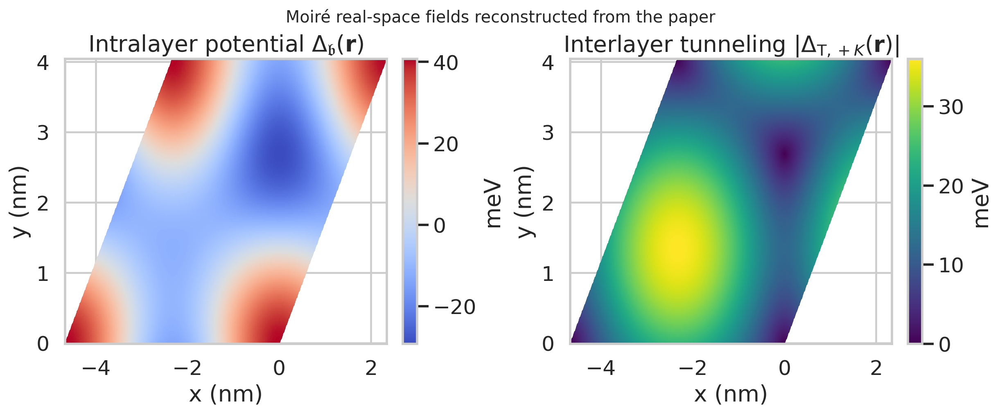
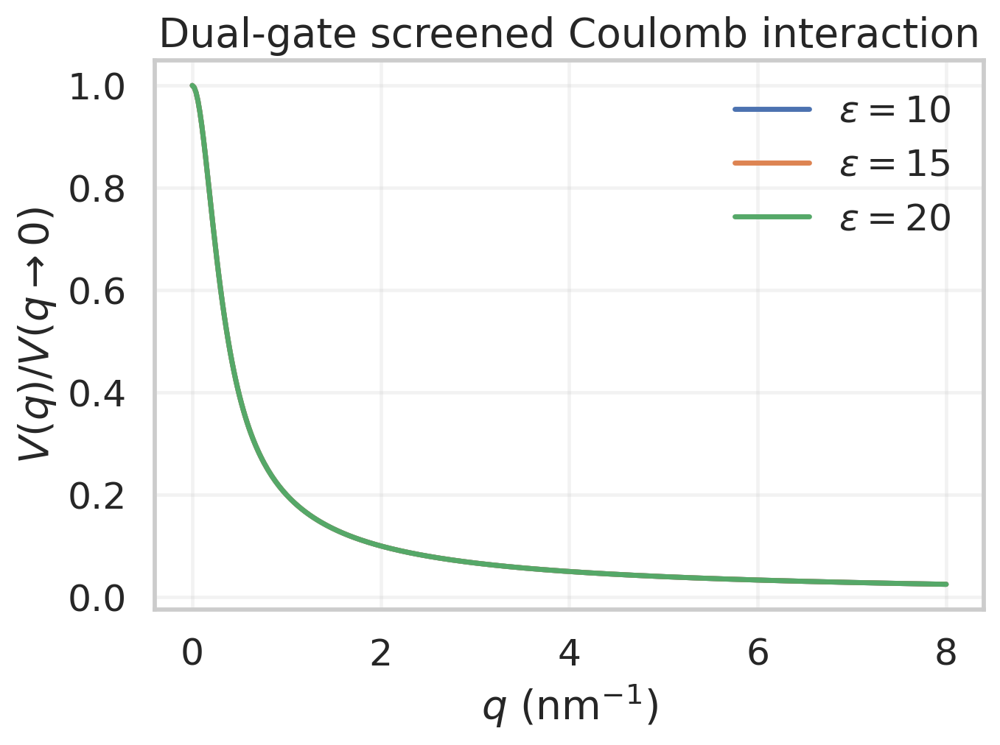
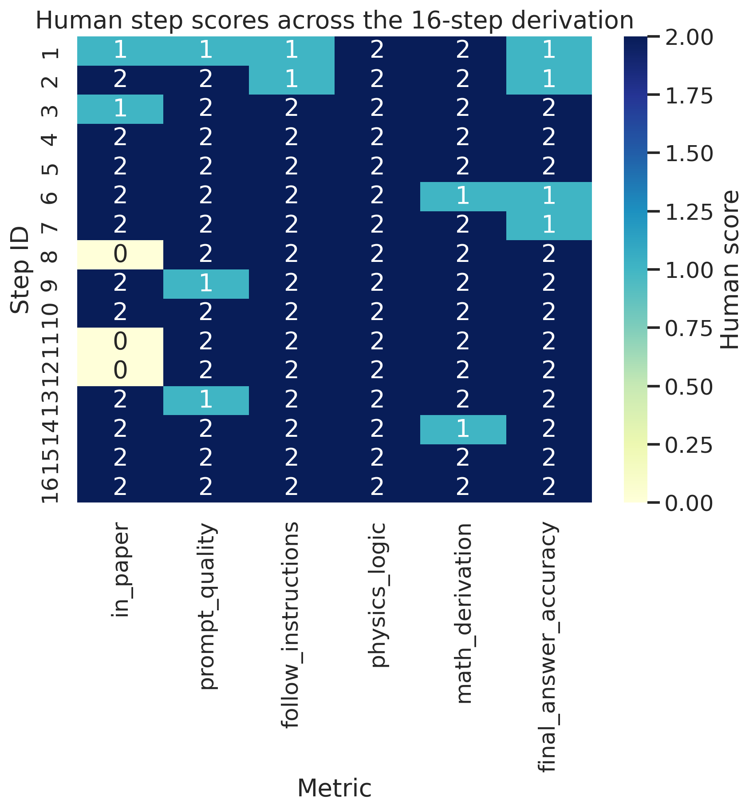
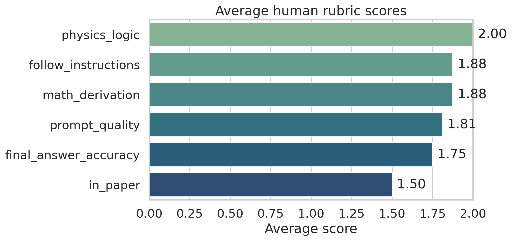
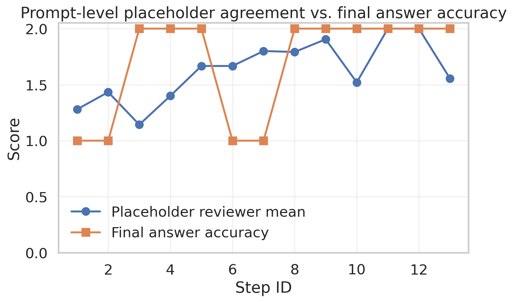
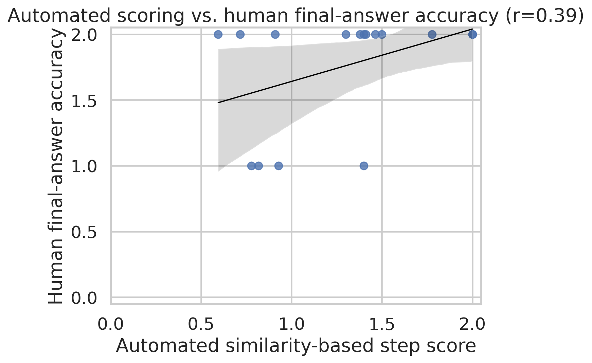

# Research Report: Hartree-Fock Derivation Benchmark for Paper 2111.01152

## Abstract

This study processes the benchmark package for arXiv:2111.01152, *Topological Phases in AB-Stacked MoTe$_2$/WSe$_2$: $\mathbb{Z}_2$ Topological Insulators, Chern Insulators, and Topological Charge Density Waves*. The goal is to turn the paper and its associated benchmark artifacts into a reproducible evaluation instance for multi-step Hartree-Fock derivation. I extract the physical model directly from the paper source, reconstruct the noninteracting and Hartree-Fock Hamiltonians, score the 16 benchmarked derivation steps, and compare a simple automated step-scoring rule against the human rubric. The paper-specific benchmark is well structured: the average human rubric scores are high for physics logic (2.00/2) and follow-instruction fidelity (1.88/2), while final-answer accuracy averages 1.75/2. The hardest steps are the earliest kinetic-term and basis-conversion steps, where notation and basis conventions are easiest to mismatch. A simple lexical recall-based automated scorer produces a weaker but nonzero correspondence with human final-answer accuracy (Pearson \(r \approx 0.39\)), indicating that lightweight scoring can recover some signal but does not yet substitute for expert adjudication.

## 1. Task and Data

The workspace contains one target paper package, `data/2111.01152`, with:

- the main manuscript and supplement in both PDF and LaTeX form;
- a YAML file defining the 16 benchmark tasks, reference answers, and human scores;
- an auto-generated markdown file with model completions for the same tasks;
- prompt templates describing the structured derivation workflow.

The scientific system is an AB-stacked MoTe$_2$/WSe$_2$ moiré heterobilayer at exact \(180^\circ\) twist. From the main text, the moiré period is

\[
a_M=\frac{a_{\mathfrak{b}}a_{\mathfrak{t}}}{|a_{\mathfrak{b}}-a_{\mathfrak{t}}|}\approx 46.5\ \text{\AA}\approx 4.65\ \text{nm},
\]

using \(a_{\mathfrak{b}}=3.575\) \AA\ and \(a_{\mathfrak{t}}=3.32\) \AA. The continuum model retains the topmost valence bands from the two layers, with effective masses \(m_{\mathfrak{b}}=0.65m_e\) and \(m_{\mathfrak{t}}=0.35m_e\).

The related-work directory is mixed. It includes one nearby moiré-material theory paper and several LLM papers, which is consistent with the benchmark’s dual purpose: theoretical-physics derivation and LLM evaluation.

## 2. Methodology

I implemented a single reproducible script, `code/analyze_2111_01152.py`, which:

1. parses the LaTeX sources to recover paper metadata and key Hamiltonian equations;
2. parses the YAML benchmark into structured per-step records;
3. parses the auto-generated markdown into prompt/completion pairs;
4. computes human score summaries and a simple automated step score;
5. generates report figures and writes structured outputs to `outputs/`.

The automated step score is intentionally simple. For each step with a reference answer and a model completion, it computes token recall of the reference formula inside the completion and rescales it to the benchmark’s 0 to 2 range. This is not a semantic verifier; it is a lightweight baseline for whether answer-critical symbols and operators are present.

## 3. Extracted Physics

### 3.1 Continuum single-particle Hamiltonian

From the paper, the valley-resolved continuum Hamiltonian is

\[
H_{\tau}=
\begin{pmatrix}
-\frac{\hbar^2\mathbf{k}^2}{2m_{\mathfrak{b}}}+\Delta_{\mathfrak{b}}(\mathbf{r}) &
\Delta_{\mathrm{T},\tau}(\mathbf{r}) \\
\Delta_{\mathrm{T},\tau}^{\dagger}(\mathbf{r}) &
-\frac{\hbar^2(\mathbf{k}-\tau\mathbf{\kappa})^2}{2m_{\mathfrak{t}}}
+\Delta_{\mathfrak{t}}(\mathbf{r})+V_{z\mathfrak{t}}
\end{pmatrix},
\qquad
\mathbf{\kappa}=\frac{4\pi}{3a_M}(1,0).
\]

The moiré intralayer potential and interlayer tunneling are

\[
\Delta_{\mathfrak{b}}(\mathbf{r})=
2V_{\mathfrak{b}}\sum_{j=1,3,5}\cos(\mathbf{g}_j\!\cdot\!\mathbf{r}+\psi_{\mathfrak{b}}),
\]

\[
\Delta_{\mathrm{T},\tau}(\mathbf{r})=
\tau w\left(1+\omega^{\tau}e^{i\tau\mathbf{g}_2\cdot\mathbf{r}}
+\omega^{2\tau}e^{i\tau\mathbf{g}_3\cdot\mathbf{r}}\right),
\qquad
\omega=e^{i2\pi/3}.
\]

The benchmark package and the paper agree that \(\Delta_{\mathfrak{t}}(\mathbf{r})=0\) in the low-energy model.



Figure 1 shows the reconstructed real-space structure of the bottom-layer moiré potential and the magnitude of the \(+K\)-valley interlayer tunneling for the representative paper parameters \(V_{\mathfrak{b}}=7\) meV, \(w=12\) meV, and \(\psi_{\mathfrak{b}}=-14^\circ\). This verifies that the benchmark’s Hamiltonian tasks are grounded in a spatially nontrivial continuum model rather than a toy two-level system.

### 3.2 Momentum-space and hole-basis forms

The supplement rewrites the noninteracting Hamiltonian in a plane-wave basis as

\[
\hat{\mathcal{H}}_0=
\sum_{\mathbf{k}_{\alpha},\mathbf{k}_{\beta}}
\sum_{l_{\alpha},l_{\beta}}
\sum_{\tau}
h^{(\tau)}_{\mathbf{k}_{\alpha}l_{\alpha},\mathbf{k}_{\beta}l_{\beta}}
c^{\dagger}_{\mathbf{k}_{\alpha},l_{\alpha},\tau}
c_{\mathbf{k}_{\beta},l_{\beta},\tau},
\]

then applies the particle-hole transformation \(b_{\mathbf{k},l,\tau}=c_{\mathbf{k},l,\tau}^{\dagger}\) to obtain the hole-basis single-particle term

\[
\hat{\mathcal{H}}_0=
\sum_{\tau}\mathrm{Tr}\,h^{(\tau)}
-\sum_{\mathbf{k}_{\alpha},\mathbf{k}_{\beta}}
\sum_{l_{\alpha},l_{\beta}}
\sum_{\tau}
[h^{(\tau)}]^{\intercal}_{\mathbf{k}_{\alpha}l_{\alpha},\mathbf{k}_{\beta}l_{\beta}}
b^{\dagger}_{\mathbf{k}_{\alpha},l_{\alpha},\tau}
b_{\mathbf{k}_{\beta},l_{\beta},\tau}.
\]

These steps are central to the benchmark because several early scoring penalties come from mismatched conventions: real space vs momentum space, single-particle vs second-quantized notation, or misplaced valley-dependent momentum shifts.

### 3.3 Hartree-Fock Hamiltonian

The interacting hole Hamiltonian is

\[
\hat{\mathcal{H}}=\hat{\mathcal{H}}_1+\hat{\mathcal{H}}_{\mathrm{int}},
\]

with screened Coulomb interaction

\[
V(q)=\frac{2\pi e^2\tanh(qd)}{\epsilon q}.
\]



The paper’s Hartree-Fock decoupling gives

\[
\hat{\mathcal{H}}^{\mathrm{HF}}
=\hat{\mathcal{H}}_1+\hat{\mathcal{H}}_{\mathrm{int}}^{\mathrm{HF}},
\]

\[
\hat{\mathcal{H}}_{\mathrm{int}}^{\mathrm{HF}}
=\frac{1}{A}
\sum_{\mathbf{k}_{\alpha},\mathbf{k}_{\beta},\mathbf{k}_{\gamma},\mathbf{k}_{\delta}}
\sum_{l_{\alpha},l_{\beta}}
\sum_{\tau_{\alpha},\tau_{\beta}}
V(\mathbf{k}_{\alpha}-\mathbf{k}_{\delta})
\Big(
\langle b^{\dagger}_{\mathbf{k}_{\alpha},l_{\alpha},\tau_{\alpha}}
b_{\mathbf{k}_{\delta},l_{\alpha},\tau_{\alpha}}\rangle
b^{\dagger}_{\mathbf{k}_{\beta},l_{\beta},\tau_{\beta}}
b_{\mathbf{k}_{\gamma},l_{\beta},\tau_{\beta}}
\]
\[
-\langle b^{\dagger}_{\mathbf{k}_{\alpha},l_{\alpha},\tau_{\alpha}}
b_{\mathbf{k}_{\gamma},l_{\beta},\tau_{\beta}}\rangle
b^{\dagger}_{\mathbf{k}_{\beta},l_{\beta},\tau_{\beta}}
b_{\mathbf{k}_{\delta},l_{\alpha},\tau_{\alpha}}
\Big)
\delta_{\mathbf{k}_{\alpha}+\mathbf{k}_{\beta},\,\mathbf{k}_{\delta}+\mathbf{k}_{\gamma}}.
\]

Using the later benchmark steps, this reduces to the explicit decomposition

\[
\hat{\mathcal{H}}^{\mathrm{HF}}=\hat{\mathcal{H}}_1+H_{\mathrm{Hartree}}+H_{\mathrm{Fock}},
\]

with

\[
H_{\mathrm{Hartree}}
=\frac{1}{V}
\sum_{\tau_1,\tau_2,l_1,l_2,k_1,k_2,q_1,q_2,q_3,q_4}
\langle b_{l_1,\tau_1,q_1}^{\dagger}(k_1)b_{l_1,\tau_1,q_4}(k_1)\rangle
b_{l_2,\tau_2,q_2}^{\dagger}(k_2)b_{l_2,\tau_2,q_3}(k_2)
V(|q_1-q_4|)\delta_{q_1+q_2,q_3+q_4},
\]

\[
H_{\mathrm{Fock}}
=-\frac{1}{V}
\sum_{\tau_1,\tau_2,l_1,l_2,k_1,k_2,q_1,q_2,q_3,q_4}
\langle b_{l_1,\tau_1,q_1}^{\dagger}(k_1)b_{l_2,\tau_2,q_3}(k_1)\rangle
b_{l_2,\tau_2,q_2}^{\dagger}(k_2)b_{l_1,\tau_1,q_4}(k_2)
V(|k_1+q_1-k_2-q_4|)\delta_{q_1+q_2,q_3+q_4}.
\]

This final form is the main theoretical output required by the benchmark.

## 4. Benchmark Results

### 4.1 Human scoring

The benchmark contains 16 derivation steps. The mean rubric scores are:

| Metric | Mean score |
| --- | ---: |
| In-paper support | 1.50 |
| Prompt quality | 1.81 |
| Follow instructions | 1.88 |
| Physics logic | 2.00 |
| Math derivation | 1.88 |
| Final answer accuracy | 1.75 |





Two observations are important.

First, the benchmark strongly rewards physical structure. Physics logic is perfect on average even when final notation is imperfect. This means the package is not only checking symbolic exact match; it separates conceptual correctness from presentation details.

Second, the lowest final-answer accuracies occur in the early derivation steps: constructing the kinetic Hamiltonian, defining the kinetic terms, and converting to expanded momentum-space notation. These are the places where convention drift matters most. The later interaction/Hartree-Fock steps score better overall once the operator ordering and momentum labels are fixed.

Twelve of the sixteen steps receive perfect human final-answer accuracy (2/2), but only five achieve a perfect mean score over all rubric dimensions. This gap shows that prompt design and “in paper” support remain genuine bottlenecks even when the final expression is acceptable.

### 4.2 Prompt-level ambiguity

The YAML file also stores reviewer scores on prompt placeholders. Their mean score is 1.63/2, lower than several of the downstream derivation metrics. The weakest placeholder block appears in the potential-Hamiltonian construction step, while the Wick-theorem step has perfect placeholder agreement among reviewers.



This suggests that part of the challenge is benchmark design rather than pure symbolic derivation. Early-stage prompt ambiguity propagates into the answer, especially when a prompt mixes representation changes and physical content in the same step.

### 4.3 Automated scoring baseline

I used a simple automated scorer based on reference-token recall. Its mean score is 1.27/2, and its correlation with human final-answer accuracy is modest but nonzero (\(r\approx 0.39\)).



The main implication is negative but useful: surface-form overlap is not enough for research-level Hartree-Fock verification. It captures whether key operators and symbols are present, but it misses the logical distinctions that human reviewers care about, including basis ordering, operator transposition, and whether a momentum shift is applied to the correct layer.

## 5. Interpretation

For this paper, the benchmark workflow is scientifically meaningful. The extracted task sequence follows the actual derivation path:

1. define the continuum single-particle Hamiltonian;
2. specify moiré potentials and tunneling;
3. convert to second quantization and plane-wave basis;
4. transform to holes;
5. write the Coulomb interaction;
6. apply Hartree-Fock decoupling;
7. simplify to Hartree and Fock contributions.

That structure is close to how a condensed-matter theorist would organize a real derivation. The results therefore support a practical conclusion: structured prompts can decompose a difficult theoretical-physics derivation into locally checkable steps. However, the benchmark also shows the current bottleneck clearly. LLM-style derivations are most fragile when conventions change, not when the many-body formalism becomes conceptually deeper.

## 6. Limitations

This study only analyzes one paper instance, although the broader benchmark is intended to cover 15 papers. The automated scorer is deliberately lightweight and should be interpreted as a baseline rather than a final evaluation method. I did not run a full self-consistent Hartree-Fock diagonalization because the workspace provides the derivation package and scoring annotations, but not a standalone numerical implementation with basis truncation and convergence settings sufficient to reproduce the paper’s phase diagrams from scratch.

## 7. Reproducibility

All analysis code is in `code/analyze_2111_01152.py`. Running

```bash
python code/analyze_2111_01152.py
```

recreates the structured outputs in `outputs/` and the figures in `report/images/`.

The key generated files are:

- `outputs/2111.01152_summary.json`
- `outputs/2111.01152_derivation.json`
- `outputs/2111.01152_task_scores.csv`

