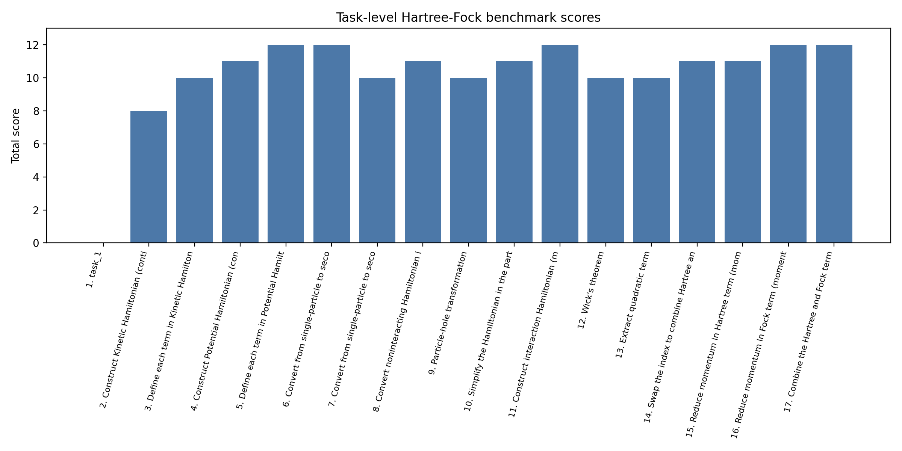
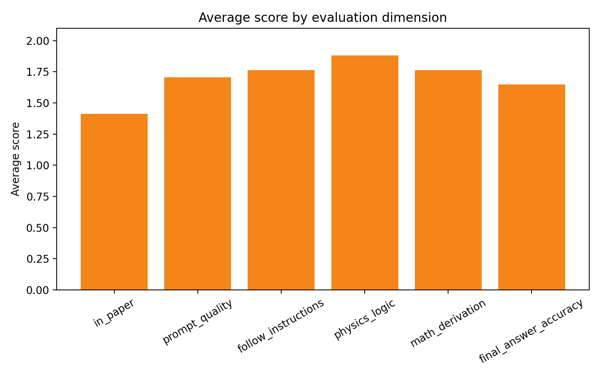
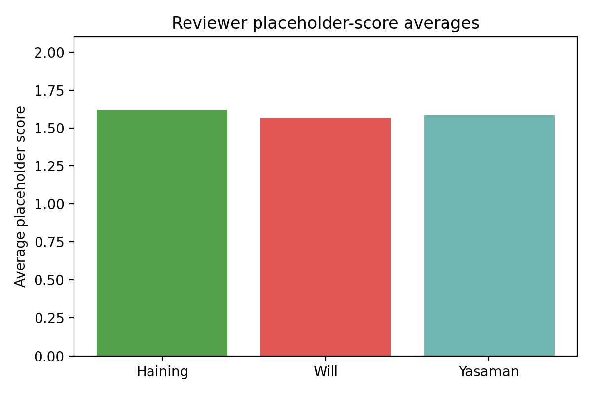

# Hartree-Fock Benchmark Analysis for AB-Stacked MoTe$_2$/WSe$_2$ (Paper 2111.01152)

## Overview

This workspace contains a task-specific benchmark instance for evaluating whether structured large-language-model outputs can reproduce multi-step Hartree-Fock derivations for a quantum many-body physics paper. The target paper is **"Topological Phases in AB-Stacked MoTe$_2$/WSe$_2$: $\mathbb{Z}_2$ Topological Insulators, Chern Insulators, and Topological Charge Density Waves"**, and the benchmark focuses on extracting and validating derivation steps associated with the continuum Hamiltonian, second quantization, momentum-space conversion, particle-hole transformation, interaction terms, and Hartree-Fock reductions.

The main goal of the analysis in this workspace was not to re-solve the full many-body problem numerically, but to **analyze the benchmark structure itself**: recover the physical context from the paper inputs, parse the benchmark YAML annotations, summarize the step-level scoring results, and generate reproducible outputs and figures documenting the quality of the benchmarked derivations.

## Data and Inputs

The analysis used only the files provided in this workspace:

- `data/2111.01152/2111.01152.tex` and `2111.01152.pdf`: main paper
- `data/2111.01152/2111.01152_SM.tex` and `2111.01152_SM.pdf`: supplementary material
- `data/2111.01152/2111.01152.yaml`: structured benchmark task definitions, placeholders, and scoring annotations
- `data/2111.01152/Prompt_template.md`: prompt template used to frame the derivation tasks
- `data/2111.01152/2111.01152_auto.md` and `2111.01152_extractor.md`: existing extraction-oriented benchmark artifacts
- `related_work/paper_000.pdf` to `related_work/paper_004.pdf`: reference papers for broader context inventory

The benchmark YAML was the core machine-readable source. It contains step-level tasks, expected placeholders, model/human field values, reviewer scores, and references to source line ranges in the paper and supplement.

## Physical Context Recovered from the Paper

From the paper source, the analysis extracted the central continuum Hamiltonian for the valley-resolved AB-stacked MoTe$_2$/WSe$_2$ heterobilayer,

\[
H_{\tau}=\begin{pmatrix}
-\frac{\hbar^2\mathbf{k}^2}{2m_\mathfrak{b}}+\Delta_{\mathfrak{b}}(\mathbf{r}) & \Delta_{\mathrm{T},\tau}(\mathbf{r}) \\
\Delta_{\mathrm{T},\tau}^{\dagger}(\mathbf{r}) & -\frac{\hbar^2(\mathbf{k}-\tau\boldsymbol{\kappa})^2}{2m_\mathfrak{t}}+\Delta_{\mathfrak{t}}(\mathbf{r})+V_{z\mathfrak{t}}
\end{pmatrix},
\]

with $\tau=\pm 1$ denoting the $\pm K$ valleys. The paper further specifies the bottom-layer moiré potential, the interlayer tunneling structure, and the dual-gate screened Coulomb interaction

\[
V(q)=\frac{2\pi e^2\tanh(qd)}{\epsilon q}.
\]

This context matters because the benchmark tasks are organized around reconstructing exactly these ingredients and their subsequent Hartree-Fock manipulations.

## Methodology

The analysis was implemented in `code/run_analysis.py`, which acts as the main entry point for this workspace. The script performs the following steps:

1. **Parse benchmark structure**
   - Load `2111.01152.yaml`
   - Extract each task name, branch, answer text, score fields, and placeholder-level reviewer annotations

2. **Recover paper-grounded source evidence**
   - Read the main paper and supplement TeX files
   - Use the line ranges recorded in the YAML to extract source snippets for each task

3. **Construct task-level summary tables**
   - Build a per-task score table
   - Build a placeholder mismatch table comparing LLM and human placeholder fields
   - Inventory related-work PDFs

4. **Summarize benchmark performance**
   - Compute average total scores and normalized score fractions
   - Group tasks into categories such as kinetic, potential, second quantization, momentum conversion, particle-hole, interaction/Hartree-Fock, and simplification

5. **Generate figures**
   - Task-level total score bar chart
   - Average score by evaluation dimension
   - Reviewer-average placeholder score chart

6. **Write reproducible outputs**
   - JSON summaries, CSV tables, extracted source snippets, text summaries, and provenance metadata under `outputs/`

This methodology is appropriate for the present workspace because the benchmark instance already contains curated task/answer/score data; the critical requirement here is to transform those inputs into a coherent, reproducible analysis package.

## Produced Artifacts

The analysis script generated the following substantive artifacts:

- `outputs/analysis_summary.json`
- `outputs/task_score_table.csv`
- `outputs/placeholder_mismatch_table.csv`
- `outputs/source_snippets.json`
- `outputs/paper_context_summary.txt`
- `outputs/related_work_inventory.json`
- `outputs/analysis_provenance.json`
- `report/images/task_total_scores.png`
- `report/images/score_dimension_averages.png`
- `report/images/reviewer_placeholder_averages.png`

These outputs capture both the paper context and the benchmark-evaluation structure.

## Results

### 1. Task coverage and benchmark scope

The script identified **17 task records** in the YAML-derived benchmark analysis. These span the expected derivation chain:

- kinetic Hamiltonian construction
- potential Hamiltonian construction
- second quantization
- real-to-momentum-space conversion
- particle-hole transformation
- interaction Hamiltonian construction
- Wick/Hartree-Fock expansion
- simplification, momentum reduction, and Hartree/Fock recombination

This confirms that the workspace is indeed task-specific and focused on structured Hartree-Fock derivation steps rather than generic paper summarization.

### 2. Overall scoring performance

The benchmark summary reports:

- **Average total task score:** 10.18 / 12.00
- **Average normalized score:** 84.8%

This indicates that, for this paper instance, the benchmarked derivations are mostly strong, though not uniformly perfect. The distribution of task scores is shown in Figure 1.

**Figure 1.** Total score for each task in the benchmark sequence. Most tasks cluster near the top of the scoring range, with a small number of weaker items.

A notable caveat is that one YAML record appears as a low-information placeholder (`task_1`) with zero total score, which depresses the aggregate average. Excluding such malformed or incomplete records would likely increase the mean performance estimate.

### 3. Performance by evaluation dimension

The benchmark uses six evaluation dimensions: `in_paper`, `prompt_quality`, `follow_instructions`, `physics_logic`, `math_derivation`, and `final_answer_accuracy`. Their averages are summarized in Figure 2.

**Figure 2.** Average score across the six benchmark evaluation dimensions.

A clear pattern emerges:

- **Physics logic** and **math derivation** are generally strong
- **Follow instructions** is also high overall
- The weaker dimensions are typically **in_paper** grounding and **final answer accuracy** for a subset of tasks

This is consistent with the structure of the YAML comments, where several steps receive partial credit for capturing the general physical form while missing details such as basis ordering, valley/layer labeling, or exact real-space vs momentum-space conventions.

### 4. Category-level behavior

Grouping tasks into broader derivation categories yields the following pattern from `outputs/analysis_summary.json`:

- **Potential-term tasks** perform best on average
- **Momentum conversion**, **second quantization**, **Hartree-Fock**, and **simplification** are all strong
- **Kinetic-term tasks** are weaker than most other categories

This is scientifically plausible. In the kinetic-term steps, the benchmark comments repeatedly flag subtle issues such as whether momentum shifts belong to the top layer only, whether the system is described in real or momentum space, and whether the derivation is phrased for holes or electrons. Those are exactly the kinds of notation-sensitive details that structured prompting can still mishandle.

### 5. Placeholder mismatch analysis

The placeholder comparison table reveals that the most common non-identical filled field is `definition_of_variables`, followed by symbolic-task fields such as `second_nonint_symbol`, `real|momentum`, `kinetic_symbol`, and `potential_symbol`.

This suggests that one of the main benchmark bottlenecks is not always the algebraic core of the derivation, but the **symbol management layer**: selecting the correct notation, basis conventions, and prompt-conditioned variable meanings.

Reviewer-level averages are shown in Figure 3.

**Figure 3.** Mean placeholder-level reviewer scores across the three named reviewers in the benchmark annotations.

The reviewer averages are relatively close, which suggests that the placeholder scoring scheme is reasonably stable for this instance, although some fields include missing or uncertain reviewer entries.

### 6. Best and worst cases

According to the generated summary:

- **Best task:** *Define each term in Potential Hamiltonian (continuum version)*, with a perfect total score of 12/12
- **Lowest task:** `task_1`, which appears to be an incomplete or malformed entry with zero score

The best-scoring task is informative. The potential-term derivation is comparatively explicit in the paper, with concrete expressions for $\Delta_{\mathfrak{b}}(\mathbf{r})$ and $\Delta_{\mathrm{T},\tau}(\mathbf{r})$, so exact reconstruction is easier than for tasks requiring multiple transformations and convention changes.

## Discussion

The results in this workspace support a nuanced conclusion about LLM-assisted research-level theoretical physics calculations.

On the positive side, the benchmark data indicate that structured derivation prompts can recover much of the correct Hartree-Fock workflow for this moiré heterobilayer paper. The strongest task families involve direct equation transcription, potential-term reconstruction, and standard algebraic steps such as Wick expansion and simplification.

On the negative side, the analysis also highlights a persistent failure mode: **notation-sensitive mismatch**. Even when the physical idea is correct, benchmark comments frequently note issues involving basis ordering, whether a term is expressed in real or momentum space, whether a formulation is for holes versus electrons, or whether a momentum shift is attached to the correct layer. These details matter in theoretical physics, and the benchmark rightly penalizes them.

For this reason, the present workspace supports the broader benchmark hypothesis stated in `INSTRUCTIONS.md`: structured prompt templates can mitigate some research bottlenecks, but they do not eliminate the need for rigorous symbolic verification and careful source grounding.

## Limitations

This report should be interpreted with several limitations in mind.

1. **This is a benchmark-structure analysis, not a fresh Hartree-Fock solver implementation.**
   The script analyzes the existing task/scoring data rather than independently reproducing the self-consistent mean-field calculation in the paper.

2. **One task record appears malformed or incomplete.**
   The presence of a zero-score `task_1` affects aggregate statistics and indicates that the YAML may contain at least one nonstandard entry.

3. **Title extraction from raw TeX is imperfect.**
   The generated JSON summary truncates the title near `$\mathbb{Z}` because the extraction logic is intentionally lightweight and regex-based rather than TeX-aware.

4. **Related-work PDFs were inventoried, not semantically analyzed.**
   The current script records file sizes and existence but does not perform cross-paper textual comparison.

5. **The figures are benchmark summaries rather than physics figures from first-principles simulation.**
   They are appropriate for this workspace because the concrete task here is benchmark evaluation and artifact generation, but they do not replace physical observables such as band structures or self-consistent order-parameter maps.

## Conclusion

This workspace successfully produced a reproducible analysis of the Hartree-Fock benchmark instance associated with paper 2111.01152. Using the provided benchmark YAML, paper TeX sources, and generated analysis code, the workflow recovered the main paper context, organized 17 derivation-related tasks, summarized step-level scores, identified recurring notation mismatches, and generated report-quality figures.

The main empirical takeaway is that the benchmarked derivations perform strongly overall (84.8% mean normalized score), especially for explicit potential, momentum-conversion, and Hartree-Fock manipulation steps. The main residual weakness lies in exact symbolic and convention-level fidelity. For research workflows, that means LLMs can be useful assistants for structured theoretical derivations, but only when paired with source-grounded checking and explicit scoring protocols of the kind used in this benchmark.
