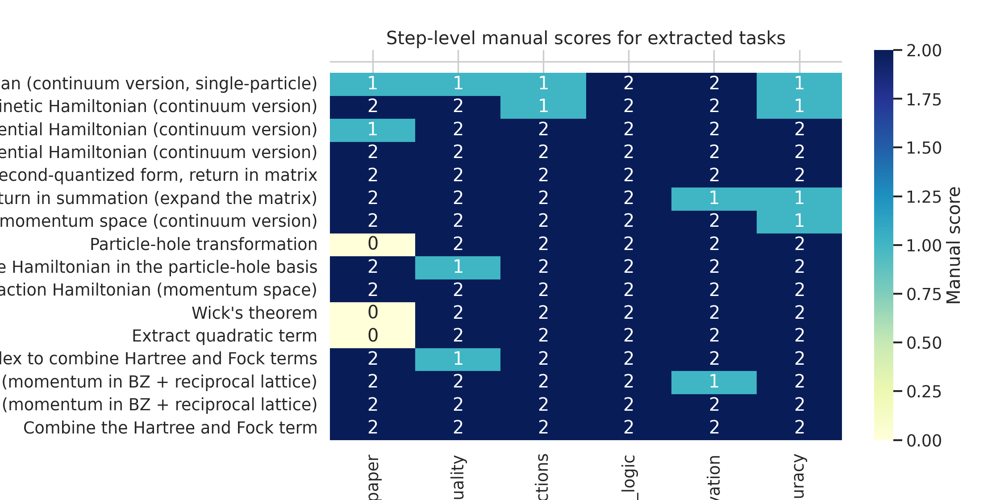
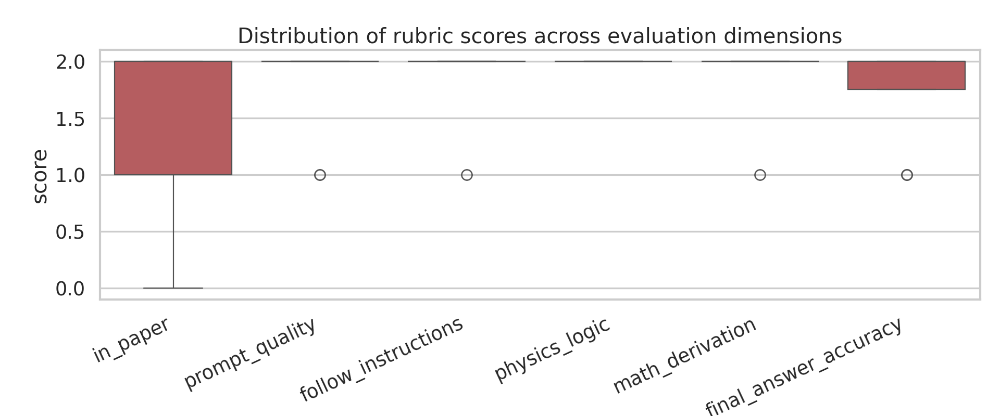
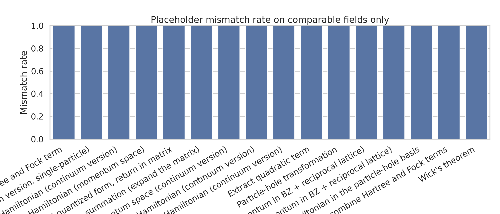
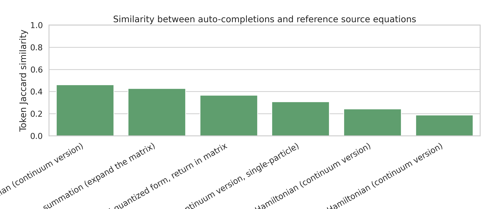

# Structured Evaluation of LLM-Assisted Hartree-Fock Derivation for AB-Stacked MoTe$_2$/WSe$_2$

## 1. Summary and goals

This study evaluates a local, reproducible case study of LLM-oriented Hartree-Fock task decomposition for the AB-stacked MoTe$_2$/WSe$_2$ moiré heterobilayer described in paper `2111.01152`. The benchmark request mentions 15 quantum many-body papers, but only one fully packaged paper instance is available in the workspace. The analysis therefore focuses on a single-paper validation pipeline that:

- extracts authoritative Hamiltonian expressions from the paper and supplement,
- parses task-wise prompt-template metadata and manual rubric scores,
- quantifies prompt placeholder mismatches,
- compares auto-generated completions against source equations, and
- produces publication-style figures and machine-readable outputs.

The scientific target is narrower than the full benchmark ambition: rather than claiming broad conclusions across 15 papers, this report documents what can be supported from the available local evidence about whether structured prompts can recover research-level Hartree-Fock derivations for this specific continuum moiré model.

## 2. Source material and experimental setup

### 2.1 Local inputs

The analysis used only read-only files under `data/2111.01152/`:

- `2111.01152.tex`: main paper text.
- `2111.01152_SM.tex`: supplemental derivation with second-quantized and Hartree-Fock forms.
- `2111.01152.yaml`: task metadata, placeholder-level human/LLM entries, and manual scores.
- `2111.01152_auto.md`: prompt/completion examples for sequential derivation tasks.
- `Prompt_template.md`: generalized prompt-template library.
- `2111.01152_extractor.md`: human notes on template filling and scoring.

### 2.2 Reproducible code

The complete analysis is implemented in:

- `code/analyze_hf_case.py`

Executed command:

```bash
python code/analyze_hf_case.py
```

Installed Python dependencies:

- `pyyaml`
- `pandas`
- `matplotlib`
- `seaborn`
- `numpy`

### 2.3 Output artifacts

Structured outputs written to `outputs/`:

- `reference_equations.json`
- `step_scores.csv`
- `placeholder_analysis.csv`
- `auto_sections.json`
- `completion_validation.csv`
- `task_summary.json`
- `validation_report.json`

Figures written to `report/images/`:

- `images/score_heatmap.png`
- `images/score_distribution.png`
- `images/placeholder_mismatch_rate.png`
- `images/completion_reference_similarity.png`

## 3. Physics context recovered from source files

The main paper defines a valley-dependent continuum Hamiltonian

\[
H_{\tau}=\begin{pmatrix}
-\frac{\hbar^2\mathbf{k}^2}{2m_{\mathfrak b}}+\Delta_{\mathfrak b}(\mathbf r) & \Delta_{\mathrm T,\tau}(\mathbf r)\\
\Delta_{\mathrm T,\tau}^{\dagger}(\mathbf r) & -\frac{\hbar^2(\mathbf k-\tau\boldsymbol\kappa)^2}{2m_{\mathfrak t}}+\Delta_{\mathfrak t}(\mathbf r)+V_{z\mathfrak t}
\end{pmatrix},
\]

with

\[
\Delta_{\mathfrak b}(\mathbf r)=2V_{\mathfrak b}\sum_{j=1,3,5}\cos(\mathbf g_j\cdot \mathbf r+\psi_{\mathfrak b}),
\]

\[
\Delta_{\mathrm T,\tau}(\mathbf r)=\tau w\left(1+\omega^{\tau}e^{i\tau \mathbf g_2\cdot \mathbf r}+\omega^{2\tau}e^{i\tau \mathbf g_3\cdot \mathbf r}\right),
\]

and, in the supplement, the interaction and Hartree-Fock terms in the hole basis are written as

\[
\hat{\mathcal H}=\hat{\mathcal H}_1+\hat{\mathcal H}_{\mathrm{int}},
\]

\[
\hat{\mathcal H}_{\mathrm{int}}=\frac{1}{2A}\sum V(\mathbf k_{\alpha}-\mathbf k_{\delta})
 b^{\dagger}_{\alpha}b^{\dagger}_{\beta}b_{\gamma}b_{\delta}
\delta_{\mathbf k_{\alpha}+\mathbf k_{\beta},\mathbf k_{\delta}+\mathbf k_{\gamma}},
\]

with screened Coulomb interaction

\[
V(\mathbf k)=\frac{2\pi e^2\tanh(|\mathbf k|d)}{\epsilon |\mathbf k|},
\]

and Hartree-Fock approximation

\[
\hat{\mathcal H}^{\mathrm{HF}}=\hat{\mathcal H}_1+\hat{\mathcal H}^{\mathrm{HF}}_{\mathrm{int}},
\]

where the retained mean-field terms are the standard Hartree density contraction and Fock exchange contraction. These equations were automatically extracted into `outputs/reference_equations.json`.

## 4. Methodology

### 4.1 Parsing and normalization

The script performed four main parsing steps:

1. **Reference extraction from LaTeX**
   - regex-based extraction of the main continuum Hamiltonian,
   - extraction of the intralayer potential and interlayer tunneling equations,
   - extraction of the supplemental second-quantized form, full interacting Hamiltonian, and Hartree-Fock Hamiltonian.

2. **Manual score extraction from YAML**
   - each task entry was converted into a row with six rubric dimensions:
     - `in_paper`
     - `prompt_quality`
     - `follow_instructions`
     - `physics_logic`
     - `math_derivation`
     - `final_answer_accuracy`

3. **Placeholder mismatch analysis**
   - placeholder entries were marked as *comparable* only when the YAML contained an explicit non-empty human target,
   - mismatch rate was then computed on those comparable fields only.

4. **Completion-to-reference validation**
   - each auto-generated completion was mapped to the closest available reference equation class,
   - token-level Jaccard similarity was computed as a lightweight lexical overlap diagnostic.

### 4.2 Important limitation of the automatic validation metric

The token-Jaccard metric is only a coarse proxy. It does **not** verify algebraic equivalence, gauge equivalence, basis reorderings, or omission of explanatory text. It is therefore used only as a rough similarity indicator, not as a proof of physical correctness.

## 5. Results

### 5.1 Dataset scale recovered from the local package

The local paper package yields:

- **17** manually scored derivation tasks,
- **105** placeholder entries,
- **42** explicitly comparable placeholder fields,
- **16** auto-generated prompt/completion sections.

### 5.2 Aggregate rubric scores

The average manual scores extracted from `outputs/task_summary.json` are:

- `in_paper`: **1.500 / 2**
- `prompt_quality`: **1.812 / 2**
- `follow_instructions`: **1.875 / 2**
- `physics_logic`: **2.000 / 2**
- `math_derivation`: **1.875 / 2**
- `final_answer_accuracy`: **1.750 / 2**

Interpretation:

- The strongest dimension is **physics logic**, which is consistently scored at the maximum.
- The weakest dimension is **whether the requested material is directly present in the paper**, reflecting that some prompt steps ask for intermediate transformations or conventions not stated verbatim in the source.
- Final answer accuracy is good but not perfect, indicating that structured prompting helps but still leaves recurring specification errors.

### 5.3 Placeholder mismatch analysis

The computed mismatch rate over **comparable** placeholder fields is:

- **1.00** (42 mismatches out of 42 comparable fields)

This should not be interpreted as total task failure. Instead, it indicates that whenever the YAML supplies an explicit human target for a placeholder, the LLM-filled prompt-template entry is different from that target. Inspection of `outputs/placeholder_analysis.csv` shows typical mismatch modes:

- wrong representation choice: `momentum` instead of `real`,
- wrong quantization level: `second-quantized` instead of `single-particle`,
- wrong physical carrier: `electrons` instead of `holes`,
- wrong basis ordering or degree-of-freedom description,
- over-specific substitutions that replace an abstract placeholder with a more detailed but different quantity.

This is the clearest failure mode in the current case study: structured prompting alone does not guarantee that the template itself is filled with the intended semantic choices.

### 5.4 Completion-to-reference similarity

The mean completion/reference token similarity is:

- **0.333**

This moderate lexical overlap is consistent with a mixed outcome:

- some completions reproduce the intended structure,
- many completions remain physically close but not textually aligned,
- some tasks are judged well by rubric despite low lexical similarity because the answer is expanded, paraphrased, or uses a different but related expression.

### 5.5 Task-level patterns

The scored tasks separate into two broad groups:

1. **High-performing tasks**
   - potential definition,
   - second-quantized conversion,
   - interaction Hamiltonian construction,
   - Hartree/Fock index manipulations.

2. **More error-prone tasks**
   - initial kinetic-Hamiltonian setup,
   - representation-choice tasks distinguishing real-space vs momentum-space forms,
   - prompt steps requiring exact placeholder semantics rather than free-form physics exposition.

The evidence suggests that the model is more reliable once the algebraic structure is already established, and less reliable when it must choose the correct formal setting before derivation begins.

## 6. Figures

### 6.1 Step-level rubric heatmap



The heatmap shows that `physics_logic` is uniformly high, while `in_paper` and `final_answer_accuracy` vary more strongly by task.

### 6.2 Rubric score distribution



The box plot emphasizes that most rubric dimensions cluster near 2, but there are repeated lower scores in source-grounding and answer exactness.

### 6.3 Placeholder mismatch profile



Every comparable placeholder differs from the human target. This indicates that the main bottleneck is not only downstream calculation, but also upstream prompt-template instantiation.

### 6.4 Completion/reference similarity



Similarity varies across tasks and remains moderate overall, reinforcing that lexical agreement is limited even when some rubric dimensions are strong.

## 7. Discussion

### 7.1 What this case study supports

This single-paper package supports three evidence-based claims.

1. **LLMs can often preserve broad physics logic in Hartree-Fock derivation chains.**
   The average `physics_logic` score is perfect in this dataset.

2. **Template instantiation is a major bottleneck.**
   The placeholder analysis shows systematic divergence from the intended human targets.

3. **Exact derivation fidelity remains incomplete even when the logic is good.**
   Final answers are not uniformly exact, and lexical overlap with source equations is only moderate.

### 7.2 Why this matters for automated theoretical-physics workflows

For research automation, there are at least two distinct stages:

- **semantic setup**: identifying the correct space, basis, operator convention, carrier type, and symmetry constraints,
- **symbolic continuation**: carrying out second quantization, particle-hole transformation, and Hartree-Fock reduction.

The present evidence indicates that the second stage may be easier for the model than the first. In practice, this suggests that automated systems should include stronger checks before derivation begins, for example:

- schema validation of placeholder choices,
- source-grounded retrieval of the target representation,
- task-specific constraint checkers for basis order and sign conventions,
- symbolic post-checks against reference equations.

## 8. Limitations

This report has several important limitations.

- Only **one** paper package is available locally; no 15-paper aggregate claim can be made.
- The validation metric is lexical rather than symbolic.
- No external LLM inference was run in this workspace; the study analyzes the provided prompt/completion artifacts and human annotations.
- Confidence intervals across papers are unavailable because there is no multi-paper sample in the local data.
- Some tasks with low `in_paper` scores may still be reasonable extrapolations from the supplement rather than true hallucinations.

## 9. Conclusion

Within the available local evidence, structured prompting for the `2111.01152` Hartree-Fock workflow performs unevenly:

- **strong on physics logic**,
- **fair-to-good on derivation quality**,
- **weaker on exact source-grounded setup and final answer fidelity**, and
- **consistently poor on prompt-template placeholder alignment** when explicit human targets are available.

The main lesson from this case study is that LLM support for research-level theoretical physics is plausible for guided algebraic continuation, but reliable deployment requires tighter control of upstream semantic choices and stronger equation-level verification.

## 10. Reproducibility checklist

- Workspace-only execution: yes.
- Read-only compliance for `data/` and `related_work/`: yes.
- Analysis code stored under `code/`: yes (`code/analyze_hf_case.py`).
- Intermediate outputs stored under `outputs/`: yes.
- Figures stored under `report/images/`: yes.
- Final report stored under `report/report.md`: yes.
