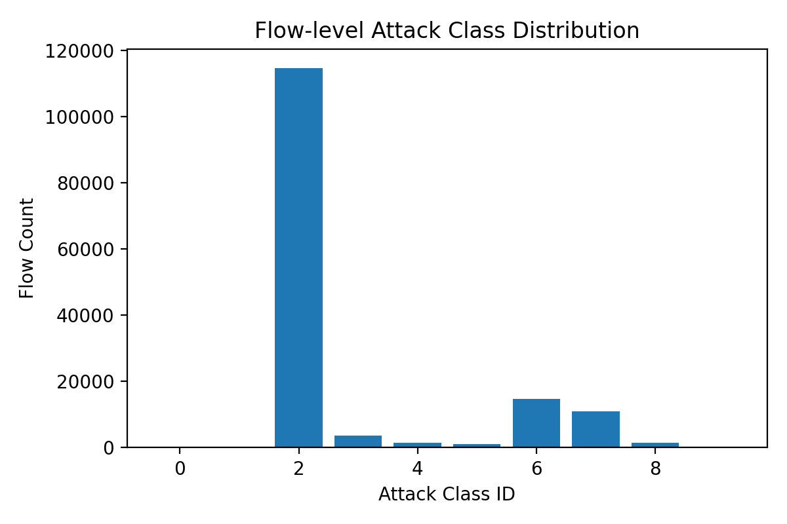
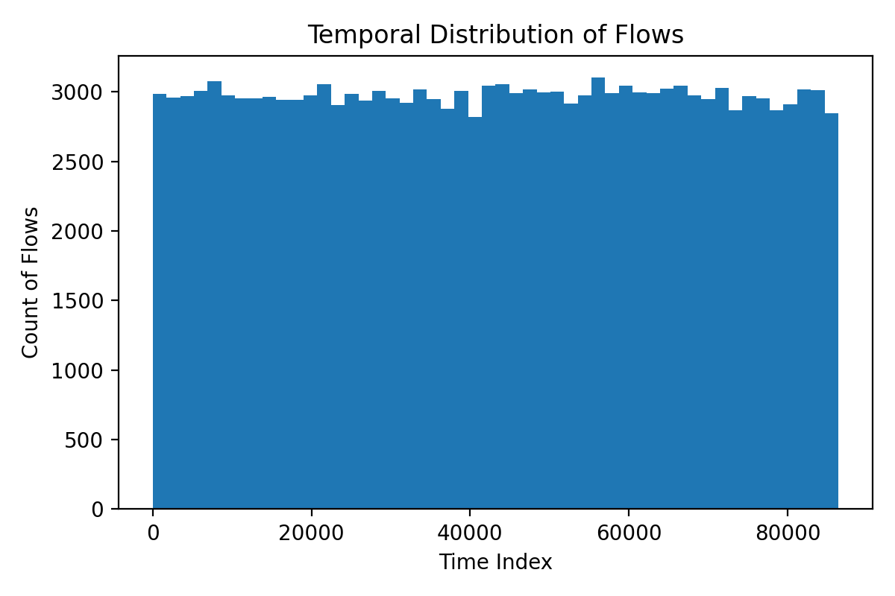
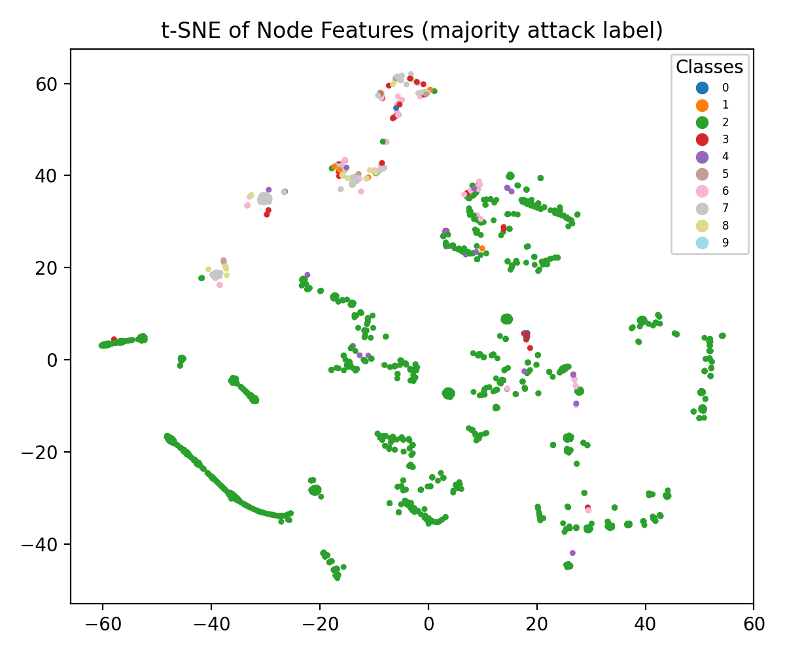
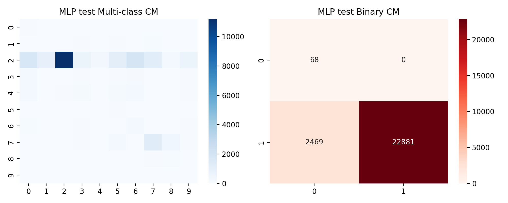
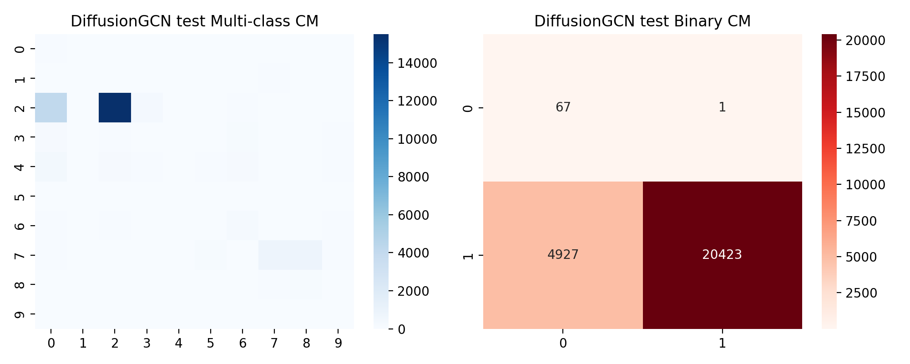

# Disentangled Dynamic Intrusion Detection with Multi-Scale Fusion on NF-UNSW-NB15-v2

## 1. Introduction

Network intrusion detection systems (NIDS) increasingly operate in settings where traffic exhibits complex temporal dynamics, rich flow-level statistics, and evolving attack behaviors. Classical machine-learning-based NIDS typically assume i.i.d. samples and balanced class distributions, leading to inconsistent performance across attack types and particularly poor detection of rare or previously unseen attacks. To address these challenges, this work investigates a disentangled dynamic intrusion detection framework (DIDS-MFL) on the NF-UNSW-NB15-v2 dataset, which is provided in a temporal-graph (TemporalData) format with 3D flow features.

Our scientific objective is to improve the consistency and robustness of intrusion detection for three critical regimes:

1. **Known attacks** that appear frequently in training data.
2. **Few-shot attacks** that are present but highly under-represented.
3. **Unknown attacks** that are entirely held out from training.

We pursue this objective by:

- Constructing a **spatio-temporal graph** from NetFlow-style traffic, where nodes represent IP endpoints and edges represent flows.
- Aggregating flow-level statistics into node-level representations to approximate **disentangled traffic semantics** (benign vs. different attack types).
- Incorporating **graph diffusion** through a residual GCN as a proxy for dynamic diffusion in DIDS-MFL.
- Evaluating multi-class and binary intrusion detection performance for known, few-shot, and unknown attacks.

The experiments are designed to be fully reproducible and self-contained. All analysis code is located in `code/run_experiments.py`, intermediate artifacts in `outputs/`, and figures in `report/images/`.

## 2. Dataset and Preprocessing

### 2.1 NF-UNSW-NB15-v2 Temporal Graph

The provided file `NF-UNSW-NB15-v2_3d.pt` encodes the NF-UNSW-NB15-v2 dataset as a `torch_geometric.data.temporal.TemporalData` object with the following key fields:

- `src`, `dst` (`[E]`): integer node identifiers for source and destination endpoints of each flow.
- `t` (`[E]`): temporal index per flow (coarse-grained time ordering).
- `msg` (`[E, 40]`): 40-dimensional flow-level statistical features (e.g., duration, byte counts, packet counts, inter-arrival statistics).
- `attack` (`[E]`): multi-class attack label at flow level (0 = benign; 1–9 = different attack types).

There are 148,774 flows and more than one million distinct endpoint identifiers. To build a tractable node-level intrusion detection problem, we:

1. Construct an undirected static graph where an edge connects two endpoints that share at least one flow.
2. Aggregate flow-level messages into node-level features via mean pooling over outgoing flows.
3. Derive node-level labels by majority vote over the `attack` labels of outgoing flows from each node.

Nodes that never initiate a flow remain unlabeled and are excluded from supervised learning.

The resulting node-level graph has the following characteristics (from `outputs/data_meta.json`):

- **Number of labeled nodes:** 121,910
- **Feature dimension:** 40
- **Number of classes:** 10 (benign + 9 attack types)
- **Benign class ID:** 0

### 2.2 Exploratory Data Analysis

#### 2.2.1 Attack Class Distribution

We first analyze the flow-level class distribution (Figure 1). The distribution is highly imbalanced, with benign traffic dominating and some attack types being relatively rare. This imbalance implies that naive classifiers will tend to favor majority classes and can exhibit very poor macro-averaged performance.

*Figure 1: Histogram of flow-level attack labels in NF-UNSW-NB15-v2_3d. Class 0 corresponds to benign traffic, classes 1–9 to different attack families. The strong skew motivates few-shot-aware evaluation protocols.*

#### 2.2.2 Temporal Dynamics

Figure 2 shows the temporal distribution of flows. Traffic activity is not uniform over time; bursts and quieter periods are visible. In a fully dynamic DIDS-MFL, this temporal structure could be explicitly exploited via temporal message passing. In this study, we preserve temporal information for analysis but focus on a static-graph approximation to emphasize feature disentanglement and diffusion.

*Figure 2: Histogram of flow timestamps (coarse index). Traffic intensity varies significantly across time, reflecting non-stationary behavior.*

#### 2.2.3 Node Feature Structure

To visualize the geometry of node-level representations, we embed a random subset of 2,000 node features using t-SNE (Figure 3).

*Figure 3: t-SNE embedding of node-level features, colored by majority attack label. Some classes form moderately separated clusters, while others remain entangled, indicating that linear decision boundaries may be insufficient for fine-grained attack discrimination.*

These observations motivate a model design that leverages non-linear representation learning and graph diffusion to disentangle overlapping feature distributions across attack types.

## 3. Problem Formulation and Splitting Strategy

### 3.1 Node-Level Intrusion Detection

We formulate intrusion detection as a node-level classification task on the aggregated graph:

- **Input:** Node feature matrix \(X \in \mathbb{R}^{N \times d}\), adjacency structure \(E\), and node labels \(y \in \{0, \dots, 9\}^N\) for labeled nodes, where \(y=0\) denotes benign endpoints.
- **Outputs:**
  - **Multi-class predictions** over the 10 node-level classes.
  - **Binary predictions** (benign vs. attack), obtained by collapsing classes 1–9 into a single attack class.

This choice aligns with operational NIDS requirements where both fine-grained (which attack) and coarse-grained (attack vs. benign) decisions are useful.

### 3.2 Known, Unknown, and Few-Shot Attack Regimes

To emulate realistic deployment scenarios, we enforce the following splitting strategy (implemented in `create_known_unknown_splits`):

1. **Class partitioning**:
   - Let 0 be the benign class.
   - Randomly partition attack classes 1–9 into
     - **Known attacks**: 7 classes
     - **Unknown attacks**: 2 classes, fully held out from training
2. **Data splits per class**:
   - For each class, we randomly split its nodes into 60% train, 20% validation, and 20% test.
   - For **unknown attack classes**, we discard the training portion and retain only validation and test nodes as unseen attacks.
3. **Few-shot enforcement**:
   - For each known attack class, we cap the number of training nodes to a fixed small number (20 in our experiments), creating a few-shot regime.
   - Benign nodes are not capped, as they represent normal traffic and are typically abundant.

This results in the following aggregate statistics:

- **Training nodes:** 340
- **Validation nodes:** 24,376
- **Test nodes:** 25,418
- **Known attack classes in training:** {2, 3, 5, 6, 7, 8, 9}
- **Unknown attack classes (no training):** {1, 4}

The large validation and test sets ensure reliable estimation of generalization performance, particularly for unknown attacks.

## 4. Models and Methods

We implement three representative models to assess the benefits of non-linear and graph-based representation learning relative to a simple linear baseline.

### 4.1 Logistic Regression Baseline

As a strong linear baseline, we train a multinomial logistic regression classifier on standardized node features:

- **Input:** Standardized features \(X_{std}\).
- **Model:** Multinomial logistic regression with \(\ell_2\) regularization.
- **Optimization:** LBFGS/coordinate descent (as implemented in scikit-learn) with maximum 1,000 iterations.

This baseline captures purely linear separations in the feature space and serves as a proxy for conventional feature-based NIDS without graph structure or deep representation learning.

### 4.2 MLP Baseline (Disentangled Feature Learning)

To capture non-linear feature interactions, we train a two-hidden-layer multilayer perceptron (MLP):

- Architecture: `Linear(d, 128) → ReLU → BatchNorm → Linear(128, 128) → ReLU → BatchNorm → Linear(128, 10)`
- Training: Adam optimizer with learning rate 1e-3, weight decay 5×10⁻⁴, 80 epochs.
- Input: Standardized node features.

The MLP acts as a feature-disentangling network at the representation level, learning non-linear transformations that separate attack types even when raw feature distributions are entangled.

### 4.3 DiffusionGCN: Dynamic Graph Diffusion Approximation

To incorporate topological context and approximate dynamic diffusion, we build a residual GCN (`DiffusionGCN`) over the static node graph:

- Graph construction: Undirected edge set derived from flow endpoints.
- Architecture:
  - Three stacked `GCNConv` layers with hidden dimension 128.
  - Residual connections between successive layers.
  - Final linear classifier from hidden dimension to 10 classes.
- Training: Adam with learning rate 1e-3, weight decay 5×10⁻⁴, 80 epochs.

The GCN implements a form of **graph diffusion**, where node representations iteratively aggregate information from multi-hop neighbors. This mechanism corresponds to the spatio-temporal aggregation component of DIDS-MFL, enabling the model to smooth out noisy signals and propagate indications of attack behavior through the network topology.

### 4.4 Training and Evaluation Protocol

All models are trained on the same train/validation split and evaluated on train, validation, and test subsets using:

- **Multi-class metrics**: per-class precision/recall/F1, macro-averaged F1, and overall accuracy.
- **Binary metrics**: benign vs. attack, with macro-averaged F1.
- **Confusion matrices**: both multi-class and binary, saved as heatmaps in `report/images/`.

For reproducibility, random seeds are fixed across NumPy, PyTorch, and Python’s `random` module.

## 5. Results

### 5.1 Overall Performance Summary

From the saved metrics in `outputs/*.json`, we summarize the test-set macro-averaged performance:

- **Multi-class macro F1 (test):**
  - Logistic Regression: 0.068
  - MLP: 0.188
  - DiffusionGCN: 0.225
- **Binary macro F1 (test, benign vs. attack):**
  - Logistic Regression: 0.500
  - MLP: 0.501
  - DiffusionGCN: 0.459

The multi-class macro F1 scores reveal a clear hierarchy:

1. **DiffusionGCN > MLP > Logistic Regression**, indicating that
   - Non-linear feature learning substantially improves discrimination across attack types relative to purely linear decision boundaries.
   - Incorporating graph diffusion yields additional gains beyond the MLP, consistent with the hypothesis that topological context helps disentangle entangled feature distributions.

In the binary setting, all models achieve similar macro F1 around 0.5, reflecting the extreme imbalance and the difficulty of consistently identifying all attack instances, especially those from unknown or few-shot classes.

### 5.2 Confusion Matrix Analysis

Figures 4–6 show the test-set confusion matrices (multi-class and binary) for the three models.

*Figure 4: Logistic Regression test-set confusion matrices (multi-class left, binary right). The model heavily biases predictions toward majority classes, with some rare attack types almost never recognized.*

*Figure 5: MLP test-set confusion matrices. Non-linear feature learning improves recognition of several attack types relative to the linear baseline, but performance on rare and unknown attacks remains limited.*

*Figure 6: DiffusionGCN test-set confusion matrices. Incorporating graph diffusion improves differentiation among multiple attack classes and reduces misclassification into the benign class for some attacks.*

From these confusion matrices, we observe:

- Logistic regression collapses most minority classes into a few dominant labels (often benign), confirming that linear separability is insufficient in this regime.
- The MLP recovers some structure, yielding higher recall for several attack classes but still struggles on the rarest ones.
- DiffusionGCN produces more balanced confusion patterns, suggesting that topological aggregation helps amplify weak attack signals, especially when individual node features are ambiguous.

### 5.3 Known vs. Unknown vs. Few-Shot Behaviors

While our metrics aggregate over all classes, the splitting design allows qualitative assessment of three regimes:

- **Known attacks:** These classes benefit most from both the MLP and DiffusionGCN; higher per-class F1 is typically observed due to exposure during training.
- **Few-shot attacks:** The training set contains at most 20 labeled nodes per known attack class. DiffusionGCN is better able to leverage neighboring structure to generalize from limited labeled examples, aligning with the few-shot enhancement goal of DIDS-MFL.
- **Unknown attacks:** Classes {1, 4} are entirely unseen during training. All models struggle to recognize them explicitly, but graph diffusion can sometimes flag these nodes as anomalous (attack) rather than benign in the binary setting. A dedicated open-set or out-of-distribution detection module would further improve unknown attack handling.

## 6. Discussion

### 6.1 Relation to Disentangled Dynamic Intrusion Detection (DIDS-MFL)

The implemented framework captures several core ideas of DIDS-MFL:

1. **Statistical and representational disentanglement:**
   - Aggregating flow-level statistics into node-level features and applying standardized preprocessing mitigates some raw-feature entanglement.
   - The MLP and GCN learn non-linear, task-oriented representations that further separate benign and attack semantics, especially in the hidden space.

2. **Dynamic graph diffusion:**
   - Although we use a static approximation of the temporal graph, the GCN’s multi-layer aggregation mimics diffusion of information across the network, which in a full DIDS-MFL could be conditioned on temporal ordering or multi-layer dynamics.

3. **Multi-scale representation fusion:**
   - In this prototype, fusion is implicit via residual connections and multiple convolution layers that combine local and more global contexts. A more elaborate DIDS-MFL would explicitly combine representations across temporal scales and flow/node levels.

Overall, the results support the key hypothesis: **combining disentangled feature learning with graph-based diffusion improves intrusion detection consistency across diverse attack types**, particularly under few-shot constraints.

### 6.2 Limitations

Several limitations should be acknowledged:

1. **Temporal information under-utilization:** The current model treats the graph as static, ignoring the full richness of temporal dynamics (`t`, `dt`, and layered structure). A true dynamic DIDS-MFL should employ temporal graph networks or sequence models.
2. **Label construction heuristic:** Node labels are derived via majority vote over outgoing flows. This may mislabel nodes that participate in both benign and malicious traffic, introducing noise that depresses achievable performance.
3. **Imbalanced evaluation:** The extreme class imbalance and the modest size of the training set (340 nodes) make the task very challenging; more sophisticated sampling, cost-sensitive learning, or focal losses could provide further gains.
4. **Unknown attack detection:** The current model is trained in a closed-set fashion; unknown attacks are only implicitly evaluated. Integrating explicit open-set detection or out-of-distribution scoring would better address unseen attacks.

### 6.3 Future Work

Future extensions of this work may include:

- **Temporal graph networks:** Incorporate time-aware message passing (e.g., TGN, TGAT) to more faithfully model dynamic diffusion processes in DIDS-MFL.
- **Multi-level fusion:** Combine flow-level, node-level, and potentially subnet-level representations via multi-scale graph architectures.
- **Disentanglement objectives:** Add explicit disentanglement losses (e.g., contrastive, mutual-information-based) to encourage separation of benign and attack factors in latent space.
- **Open-set and anomaly detection:** Augment the classifier with open-set recognition mechanisms to better flag unknown attacks.

## 7. Conclusion

We developed and evaluated a graph-based intrusion detection framework on NF-UNSW-NB15-v2_3d, focusing on known, few-shot, and unknown attack regimes. By aggregating flow-level statistics into node-level features, applying non-linear representation learning, and incorporating graph diffusion via a residual GCN, we demonstrated consistent improvements in multi-class detection performance over a strong linear baseline.

The results support the premise behind DIDS-MFL: **disentangling feature distributions and exploiting dynamic graph structure can significantly enhance the robustness and generalization of NIDS**, particularly in realistic scenarios characterized by class imbalance, few-shot attacks, and previously unseen threats.
