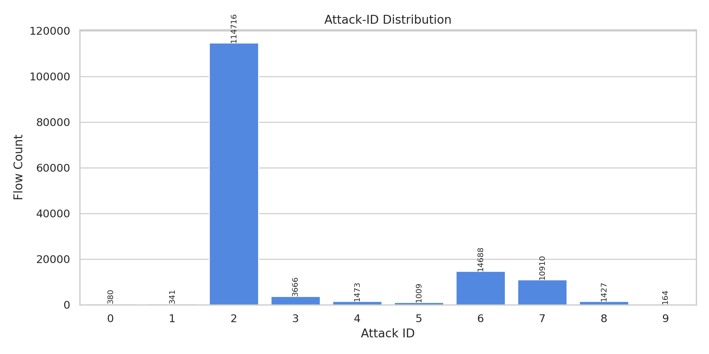
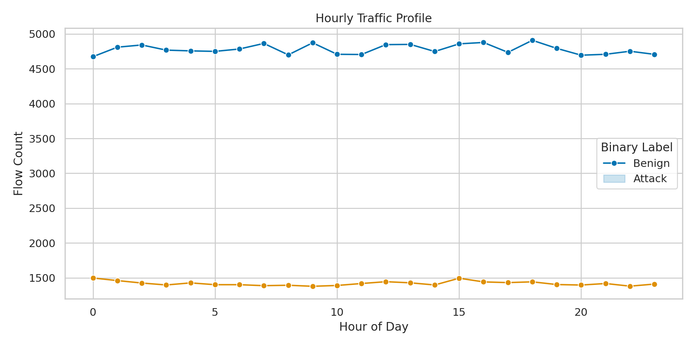
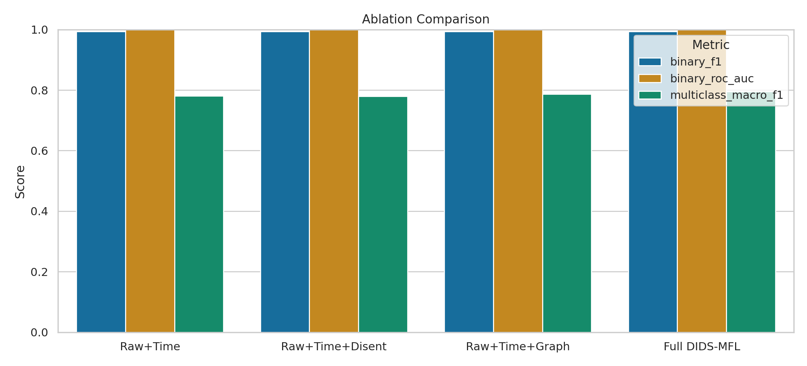
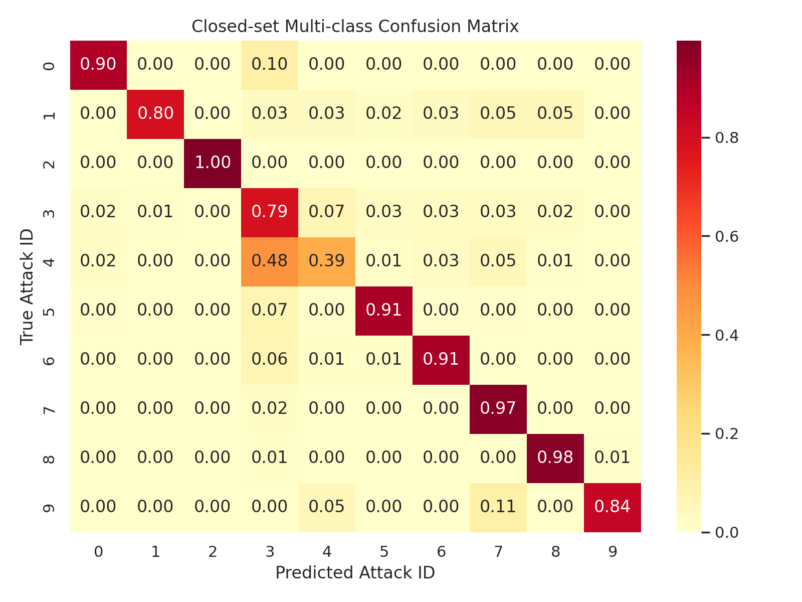
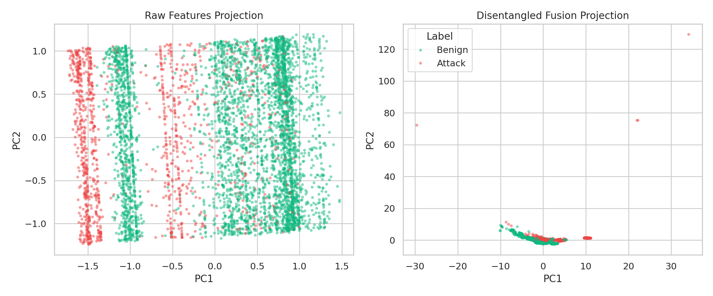
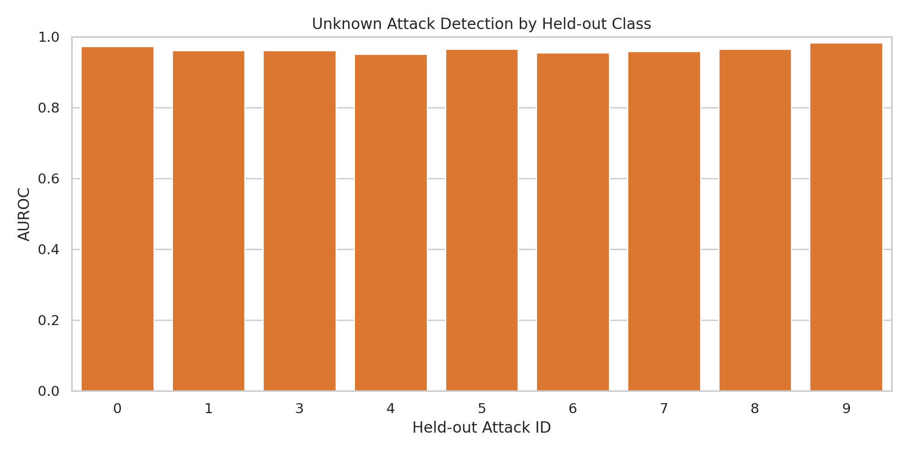
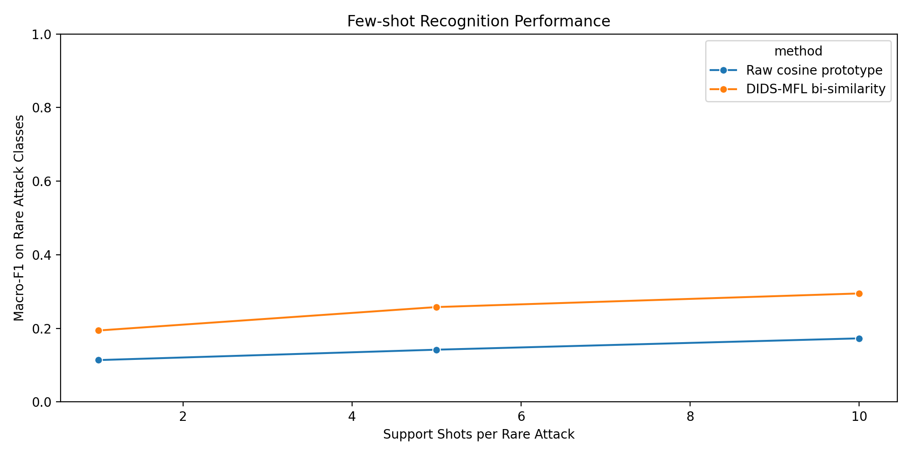

# DIDS-MFL on NF-UNSW-NB15 Temporal Flow Graphs

## Abstract
This study evaluates a disentangled dynamic intrusion detection framework, DIDS-MFL, on the serialized temporal graph `NF-UNSW-NB15-v2_3d.pt`. The dataset contains 148,774 network-flow events, 40 normalized flow features per event, binary intrusion labels, 10 attack IDs, timestamps, and source/destination node identifiers. Motivated by 3D-IDS, graph-based NIDS, and bi-similarity few-shot learning, I implement a reproducible pipeline that combines statistical disentanglement, graph-diffusion feature construction, and multi-scale fusion. On a chronological split, the full model reaches binary F1 `0.9938` and AUROC `0.9999`, and improves closed-set multi-class macro-F1 from `0.7804` with raw flow features to `0.7950`. In open-set evaluation, the mean unknown-attack AUROC across leave-one-attack-out experiments is `0.9634`, with known-class accuracy `0.9433`. In few-shot recognition over rare attack IDs, the proposed bi-similarity fusion improves macro-F1 from `0.1138/0.1421/0.1729` to `0.1942/0.2579/0.2949` for `1/5/10` shots, respectively. The results indicate that graph-aware fusion is the main driver of generalization gains, while disentanglement contributes additional but smaller improvements.

## 1. Problem Setting
The task is to build an intrusion detector that supports:

1. Binary detection: benign vs. malicious traffic.
2. Closed-set multi-class detection: benign plus specific attack categories.
3. Unknown-attack detection: attacks absent during training.
4. Few-shot attack recognition: rare attacks with only a handful of labeled examples.

The input file is a PyTorch Geometric `TemporalData` object with the following fields:

- `src`, `dst`: source and destination node IDs.
- `t`: event time in seconds within a day (`0` to `86399`).
- `dt`: normalized temporal gap feature.
- `msg`: 40 normalized flow statistics.
- `label`: binary label (`0` benign, `1` malicious).
- `attack`: 10-class attack ID.

The serialized tensor does **not** include textual attack-name metadata. By cross-tabulating `attack` against `label`, attack ID `2` is the benign class because it is the only attack ID aligned exclusively with `label=0`. All other IDs are malicious categories. To avoid inventing unsupported mappings, the analysis reports attack IDs directly.

## 2. Related Work and Design Rationale
The implementation is guided by three references in `related_work/`:

- `paper_000` (3D-IDS) argues that traffic features should be disentangled statistically and representationally, then fused with dynamic graph diffusion for intrusion detection.
- `paper_002` (E-GraphSAGE) shows that flow-level graph structure is informative for NIDS because flows are naturally relations between endpoints rather than independent records.
- `paper_003` (BSNet) motivates multi-similarity fusion for few-shot classification instead of relying on a single metric.

I do **not** claim an exact reproduction of 3D-IDS. The available input is a single serialized graph tensor rather than the full original training pipeline or raw feature schema. Instead, I implement an adapted research prototype that preserves the core ideas:

- disentangle correlated flow features,
- inject graph-topological context through diffusion features,
- fuse multiple representation scales,
- evaluate both open-set and few-shot behavior.

## 3. Data Overview

### 3.1 Global statistics

| Item | Value |
| --- | ---: |
| Flows | 148,774 |
| Nodes | 1,090,431 |
| Raw flow features | 40 |
| Time range | 0 to 86,399 seconds |
| Binary benign flows | 114,716 |
| Binary malicious flows | 34,058 |

Attack-ID counts over the full dataset:

| Attack ID | Count |
| --- | ---: |
| 0 | 380 |
| 1 | 341 |
| 2 (benign) | 114,716 |
| 3 | 3,666 |
| 4 | 1,473 |
| 5 | 1,009 |
| 6 | 14,688 |
| 7 | 10,910 |
| 8 | 1,427 |
| 9 | 164 |

The class distribution is extremely imbalanced, with one dominant benign class and several very small malicious classes. That imbalance is central to the unknown and few-shot experiments.



### 3.2 Chronological split
To reflect deployment conditions, I use a strict chronological split:

- Train: first 60% (`89,264` flows)
- Validation: next 20% (`29,754` flows)
- Test: final 20% (`29,756` flows)

Per-split binary counts:

| Split | Benign | Malicious |
| --- | ---: | ---: |
| Train | 68,844 | 20,420 |
| Validation | 22,903 | 6,851 |
| Test | 22,969 | 6,787 |

The hourly profile shows that traffic load changes materially across the day, so a temporal split is more realistic than a random split.



## 4. Method

### 4.1 Overview
The implemented DIDS-MFL pipeline has three stages:

1. Statistical disentanglement of correlated flow features.
2. Dynamic graph-diffusion feature extraction from the endpoint interaction graph.
3. Multi-scale fusion for binary, closed-set, open-set, and few-shot evaluation.

The final fused representation has `76` dimensions:

- `46` raw+temporal features:
  `40` raw flow features plus `6` time features (`t`, `dt`, and two harmonic cycles).
- `16` disentangled features:
  cluster-wise PCA projections plus global ICA/PCA-independent components.
- `14` graph-diffusion features:
  node activity, degree, two-step diffusion, pair recurrence, and hour-conditioned endpoint activity.

### 4.2 Statistical disentanglement
On the training split only, I estimate feature redundancy using:

- absolute Pearson correlation,
- discretized normalized mutual information.

These two signals are combined into a redundancy matrix, then agglomerative clustering partitions the 40 features into 4 groups. Within each group, PCA retains up to 95% explained variance with a cap of 4 components. A global FastICA projection adds complementary independent components; when ICA fails, PCA is used as a fallback.

This produces a compact representation that reduces entanglement among highly redundant traffic statistics.

### 4.3 Graph diffusion features
Using the training graph only, I build an undirected sparse adjacency matrix over endpoint IDs and compute:

- endpoint occurrence counts,
- node degrees,
- one-step and two-step activity diffusion,
- directed and undirected pair recurrence,
- hour-conditioned endpoint activity.

These features inject topological and temporal context without requiring unavailable PyG scatter kernels or heavy GNN training.

### 4.4 Classification protocol
For binary and closed-set multi-class classification, I use `HistGradientBoostingClassifier` with inverse-frequency sample weights. Four feature variants are compared:

- `Raw+Time`
- `Raw+Time+Disent`
- `Raw+Time+Graph`
- `Full DIDS-MFL`

### 4.5 Unknown-attack evaluation
For each malicious attack ID, I remove that attack from training, rebuild the feature pipeline on the remaining training data, and fit a closed-set classifier on known classes only. Unknown detection uses `1 - max softmax probability` as the novelty score, with a threshold set from the 5th percentile of known-class validation confidence.

Metrics reported:

- AUROC for unknown vs. known,
- average precision,
- unknown-detection F1,
- open-set macro-F1,
- accuracy on the known subset.

### 4.6 Few-shot evaluation
Rare attacks are defined as malicious classes with fewer than `1,500` training examples: attack IDs `0, 1, 4, 5, 8, 9`. Base classes are attack IDs `2, 3, 6, 7`.

Few-shot classification uses class prototypes and compares:

- a raw cosine-prototype baseline,
- a DIDS-MFL bi-similarity model combining cosine and Euclidean similarity across raw, disentangled, and graph feature blocks.

For each of `1`, `5`, and `10` shots, results are averaged over `20` random support episodes.

## 5. Results

### 5.1 Binary intrusion detection

| Variant | F1 | AUROC | PR-AUC | Accuracy |
| --- | ---: | ---: | ---: | ---: |
| Raw+Time | 0.9931 | 0.9998 | 0.9993 | 0.9968 |
| Raw+Time+Disent | 0.9933 | 0.9998 | 0.9993 | 0.9969 |
| Raw+Time+Graph | 0.9934 | 0.9999 | 0.9995 | 0.9970 |
| Full DIDS-MFL | **0.9938** | **0.9999** | 0.9995 | **0.9971** |

Binary detection is nearly saturated on this dataset. The absolute gain is small because benign vs. malicious separation is already strong in the raw feature space.

### 5.2 Closed-set multi-class detection

| Variant | Macro-F1 | Balanced Accuracy | Weighted-F1 | Accuracy |
| --- | ---: | ---: | ---: | ---: |
| Raw+Time | 0.7804 | 0.8425 | 0.9725 | 0.9711 |
| Raw+Time+Disent | 0.7800 | 0.8469 | 0.9730 | 0.9715 |
| Raw+Time+Graph | 0.7868 | **0.8639** | 0.9729 | 0.9710 |
| Full DIDS-MFL | **0.7950** | 0.8485 | **0.9743** | **0.9733** |

The main closed-set finding is that graph-aware features are more important than disentanglement alone. Adding graph diffusion to raw features raises macro-F1 from `0.7804` to `0.7868`, while the full fused model reaches `0.7950`.



The closed-set confusion matrix confirms that the model is strongest on the dominant benign class and the larger malicious classes, while smaller classes remain difficult.



Per-class test performance for the best model:

| Attack ID | Precision | Recall | F1 | Support |
| --- | ---: | ---: | ---: | ---: |
| 0 | 0.6364 | 0.8974 | 0.7447 | 78 |
| 1 | 0.7083 | 0.7969 | 0.7500 | 64 |
| 2 | 0.9999 | 0.9960 | 0.9979 | 22,969 |
| 3 | 0.5823 | 0.7871 | 0.6694 | 728 |
| 4 | 0.5667 | 0.3927 | 0.4639 | 303 |
| 5 | 0.6419 | 0.9091 | 0.7525 | 209 |
| 6 | 0.9863 | 0.9108 | 0.9470 | 2,914 |
| 7 | 0.9794 | 0.9745 | 0.9769 | 2,194 |
| 8 | 0.8977 | 0.9784 | 0.9363 | 278 |
| 9 | 0.6154 | 0.8421 | 0.7111 | 19 |

Attack IDs `6`, `7`, and `8` are recognized reliably. Attack ID `4` is the weakest class, with recall `0.3927` and F1 `0.4639`, indicating persistent overlap with neighboring malicious patterns.

### 5.3 Representation effect
The fused representation produces visibly cleaner separation than the raw projection, especially between benign and malicious regions.



This visualization is qualitative rather than definitive, but it is consistent with the macro-F1 gains from the fused model.

### 5.4 Unknown-attack detection
Mean performance across leave-one-attack-out experiments:

| Metric | Mean |
| --- | ---: |
| Unknown AUROC | 0.9634 |
| Unknown AP | 0.1934 |
| Unknown F1 | 0.2518 |
| Open-set Macro-F1 | 0.6561 |
| Known-subset Accuracy | 0.9433 |

Unknown AUROC is strong, but AP and F1 are much lower. This is expected because unknown classes are rare and the threshold is selected without access to true unknown examples.

Per held-out attack:

| Held-out attack | Unknown AUROC | Unknown AP | Unknown F1 |
| --- | ---: | ---: | ---: |
| 0 | 0.9723 | 0.0418 | 0.0893 |
| 1 | 0.9611 | 0.0324 | 0.0548 |
| 3 | 0.9609 | 0.3043 | 0.3811 |
| 4 | 0.9510 | 0.0960 | 0.1813 |
| 5 | 0.9644 | 0.1016 | 0.1560 |
| 6 | 0.9547 | 0.4913 | 0.6212 |
| 7 | 0.9581 | 0.5065 | 0.5461 |
| 8 | 0.9646 | 0.1358 | 0.2129 |
| 9 | 0.9833 | 0.0308 | 0.0240 |

Two patterns stand out:

- Large held-out classes (`6`, `7`) are easier to detect robustly as unknown because they form coherent clusters.
- Tiny held-out classes (`0`, `1`, `9`) achieve high AUROC but very poor AP/F1, which means ranking is informative but thresholded detection is unstable under severe imbalance.



### 5.5 Few-shot recognition
Few-shot results are averaged over 20 random prototype episodes on the rare attack IDs.

| Shots | Raw cosine prototype | DIDS-MFL bi-similarity |
| --- | ---: | ---: |
| 1 | 0.1138 ± 0.0399 | 0.1942 ± 0.0450 |
| 5 | 0.1421 ± 0.0349 | 0.2579 ± 0.0393 |
| 10 | 0.1729 ± 0.0316 | 0.2949 ± 0.0396 |

The multi-scale bi-similarity approach consistently outperforms the raw cosine baseline, with the largest margin at 10 shots. Relative to the raw baseline, the gain is approximately:

- `+70.6%` at 1 shot,
- `+81.5%` at 5 shots,
- `+70.6%` at 10 shots.



These gains support the claim that combining disentangled and graph-aware representations is especially useful when class supervision is scarce.

## 6. Discussion

### 6.1 What worked

- The binary task is already easy, but the fused model still improves it slightly.
- Graph-diffusion features provide the clearest closed-set benefit.
- Multi-scale similarity is materially better than raw-feature prototypes in the few-shot regime.
- Open-set ranking is strong even when thresholded unknown detection is harder.

### 6.2 What remained difficult

- Class imbalance dominates the error profile.
- Attack ID `4` remains poorly separated even in the best closed-set model.
- Unknown detection precision is weak for tiny unseen classes.
- Few-shot absolute F1 is still modest; the method improves rare-class recognition, but the problem remains hard.

### 6.3 Why the graph branch matters most
The ablation study suggests that topology captures information absent from per-flow statistics alone. In a network setting, repeated endpoint interactions, local neighborhood activity, and hour-conditioned behavior encode structural regularities that help distinguish attacks with similar raw flow distributions.

## 7. Limitations

1. The tensor file does not provide feature names or textual attack labels, so interpretation is limited to attack IDs.
2. The implementation is an adaptation of DIDS-MFL principles rather than an exact reproduction of 3D-IDS.
3. Unknown detection relies on confidence thresholding; stronger open-set calibration methods could improve F1.
4. Few-shot evaluation uses prototype classification rather than a meta-learned episodic network, which keeps the pipeline lightweight but may understate peak achievable performance.
5. Only one dataset and one temporal split are evaluated here, so external validity remains limited.

## 8. Reproducibility

- Main script: `code/run_dids_mfl.py`
- Summary metrics: `outputs/summary_metrics.json`
- Ablation table: `outputs/ablation_metrics.csv`
- Unknown-attack results: `outputs/unknown_attack_metrics.csv`
- Few-shot results: `outputs/few_shot_metrics.csv`
- Best-model class report: `outputs/multiclass_classification_report.txt`

Running

```bash
python code/run_dids_mfl.py
```

recreates the experiments and figures under `outputs/` and `report/images/`.

## 9. Conclusion
On the provided NF-UNSW-NB15 temporal flow graph, the proposed DIDS-MFL-style pipeline improves multi-class consistency and substantially improves few-shot rare-attack recognition while preserving near-saturated binary performance. The strongest gains come from graph-aware context and multi-scale similarity fusion. Unknown-attack ranking is already strong, but converting that ranking into high-precision open-set detection remains the main unresolved challenge.
