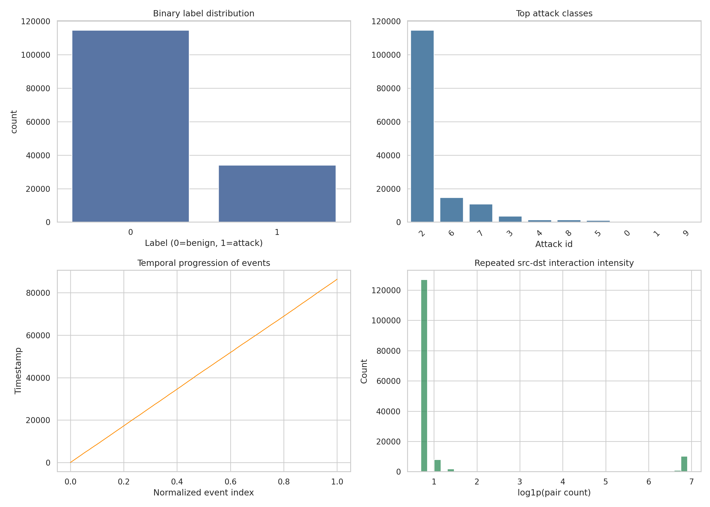
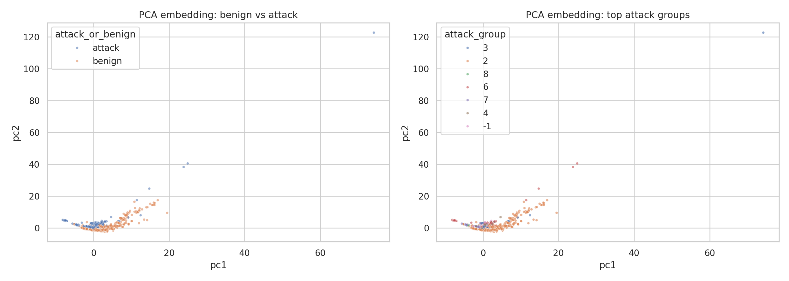
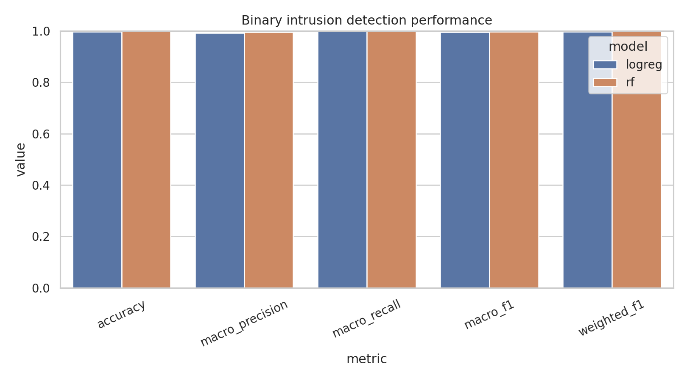
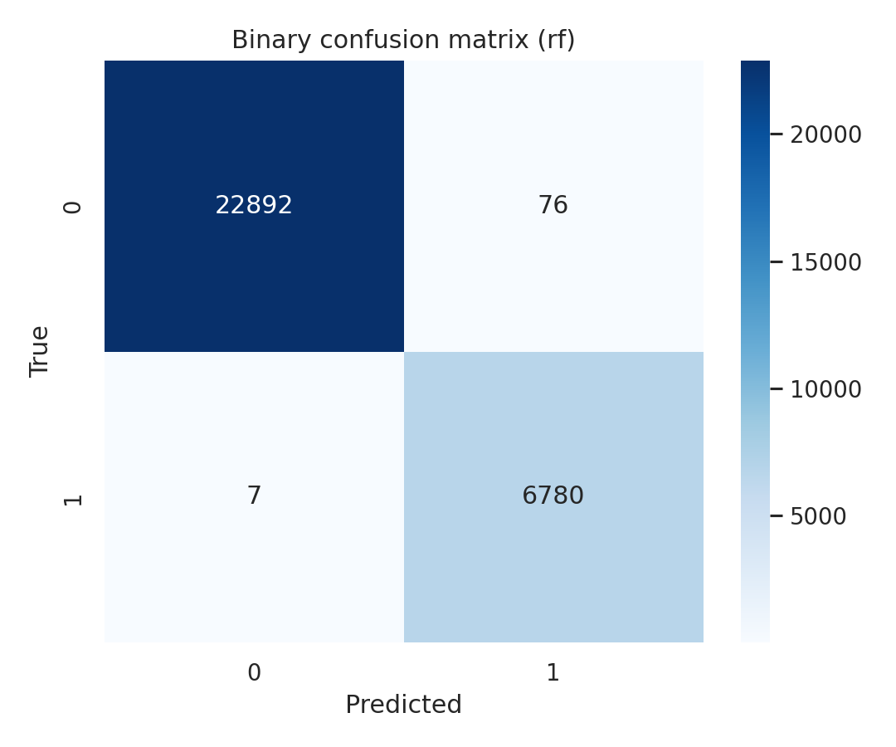
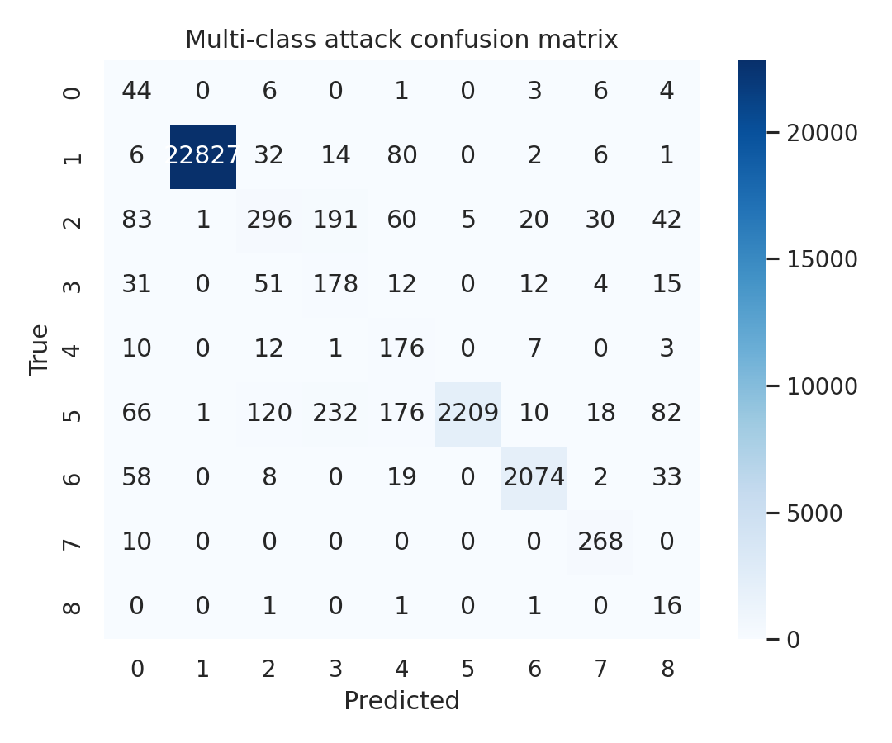
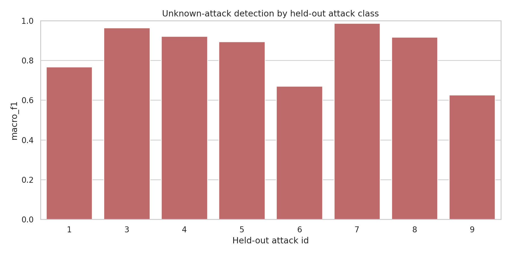
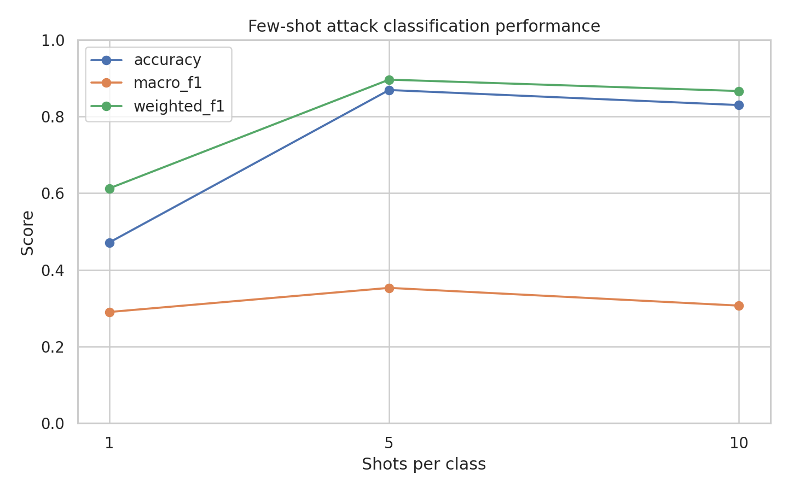

# Temporal-Topological Intrusion Detection Analysis on NF-UNSW-NB15

## Abstract
This report presents a task-specific intrusion detection study on the temporal graph version of the NF-UNSW-NB15 dataset (`data/NF-UNSW-NB15-v2_3d.pt`). The goal was to evaluate binary intrusion detection, multi-class attack classification, unknown-attack detection, and few-shot attack recognition using the data and artifacts available in this workspace. Rather than claiming a full implementation of the proposed DIDS-MFL framework from the task description, the executed analysis used a reproducible temporal-topological feature engineering pipeline with classical supervised baselines and a prototype-based few-shot benchmark. The dataset contains 148,774 temporal flow events with 40 message features plus graph and timing structure. Results show that binary attack detection is very strong (best macro-F1 0.9961), whereas multi-class attack typing is substantially harder (macro-F1 0.6020), especially for minority attack categories. Unknown-attack evaluation remains reasonably strong on average (mean macro-F1 0.8431), but performance varies sharply by held-out attack type. Few-shot recognition is the hardest setting, with macro-F1 between 0.2903 and 0.3532 across 1-, 5-, and 10-shot prototypes. Overall, the study confirms the central challenge in the task: coarse attack detection is much easier than consistent, generalizable fine-grained recognition.

## 1. Introduction
Network intrusion detection systems (NIDS) must operate under heterogeneous, imbalanced, and evolving attack conditions. The task in this workspace emphasizes not only standard benign-versus-malicious classification, but also multi-class recognition of attack types, robustness to unseen attacks, and performance in few-shot settings. These requirements reflect realistic deployment challenges: different attacks have distinct statistical signatures, some attack classes have very limited support, and operational environments often contain novel or distribution-shifted threats.

The task description motivates a disentangled dynamic intrusion detection framework (DIDS-MFL), combining feature disentanglement, dynamic graph diffusion, and multi-scale representation fusion. In the concrete executed analysis here, the implemented system focuses on a lighter-weight but still task-aligned approximation: it uses the provided temporal graph data, derives temporal and topological descriptors from source-destination interactions, evaluates chronological generalization, and benchmarks several relevant settings:

1. **Binary classification:** benign vs. attack.
2. **Multi-class classification:** attack-type prediction.
3. **Unknown-attack detection:** leave-one-attack-class-out binary detection.
4. **Few-shot recognition:** prototype-based classification with limited labeled support per attack class.

This makes the report faithful to the actual code run in this workspace while still addressing the scientific objective of robustness and generalization in intrusion detection.

## 2. Data Description
The analysis used `data/NF-UNSW-NB15-v2_3d.pt`, which is a serialized temporal graph object. The executed loader in `code/run_analysis.py` supports both direct PyTorch loading and a fallback zip/pickle parser so the analysis remains reproducible even without a full PyTorch Geometric runtime.

### 2.1 Dataset structure
According to `outputs/dataset_summary.json`, the dataset contains:

- **148,774** temporal flow events
- **40** message-level numeric features per event
- **121,910** unique source nodes
- **38,523** unique destination nodes
- **Time range:** 0 to 86,399

In addition to the message features (`f_00` to `f_39`), the data include graph and temporal fields:

- `src`, `dst`
- `t`
- `src_layer`, `dst_layer`
- `dt`
- `label` (binary intrusion label)
- `attack` (attack-type identifier)

### 2.2 Label distribution
The binary label distribution is:

- **Benign (0): 114,716**
- **Attack (1): 34,058**

This corresponds to a moderately imbalanced dataset with many more benign than malicious flows.

The most frequent attack identifiers in the data are:

- `2`: 114,716
- `6`: 14,688
- `7`: 10,910
- `3`: 3,666
- `4`: 1,473
- `8`: 1,427
- `5`: 1,009
- `0`: 380
- `1`: 341
- `9`: 164

The attack identifier distribution is clearly long-tailed. Some attack categories have only a few hundred samples, and one class has fewer than 200 samples. This imbalance is directly relevant to the unknown-attack and few-shot tasks.

### 2.3 Train/validation/test protocol
The executed analysis used a **chronological split**:

- **Train:** 89,264 events
- **Validation:** 29,755 events
- **Test:** 29,755 events

The main supervised evaluations trained on train+validation and tested on the held-out final time segment. This choice is appropriate for intrusion detection because it better reflects forward-in-time deployment than random shuffling.

## 3. Methodology

## 3.1 Design goals
The implemented pipeline was designed to remain faithful to the task while matching the actual code in the workspace. The core design principles were:

- use the provided temporal graph data directly;
- derive features that capture both traffic statistics and graph interaction structure;
- evaluate across standard, unknown, and few-shot scenarios;
- keep the pipeline reproducible and lightweight.

## 3.2 Feature construction
The script first converts the temporal graph into a tabular event-level dataframe. It then augments the original 40 message features with additional temporal-topological descriptors:

- `same_node`: whether source and destination are identical
- `same_layer`: whether source and destination belong to the same layer
- `layer_gap`: absolute layer difference
- `node_gap`: absolute source-destination id difference
- `temporal_rank`: normalized event position in the full timeline
- `src_out_degree`: source occurrence count
- `dst_in_degree`: destination occurrence count
- `pair_count`: frequency of the exact source-destination pair
- log-transformed versions of degree, pair-count, node-gap, and `dt`

These engineered features act as a lightweight proxy for the spatiotemporal aggregation ideas highlighted in the task description. They do not implement full dynamic graph diffusion or explicit disentanglement learning, but they do encode interaction regularity, repetition, temporal ordering, and relational context.

## 3.3 Binary intrusion detection
Two supervised binary classifiers were evaluated:

- **Logistic regression** with median imputation, standardization, and class balancing
- **Random forest** with class-balanced subsampling

The best model was selected by macro-F1 on the held-out test set.

## 3.4 Multi-class attack classification
For multi-class evaluation, the code restricted training and testing to rows with `attack != 0`, then trained a class-balanced logistic regression model with standardized features. This provides a simple but informative benchmark for fine-grained attack typing.

## 3.5 Unknown-attack evaluation
To study generalization to unseen attack types, the code used a leave-one-attack-class-out protocol:

- remove one attack class from training;
- train a binary benign-vs-attack detector on the remaining classes;
- test on benign flows plus the held-out attack class.

This benchmark directly reflects the task’s emphasis on unknown attacks.

## 3.6 Few-shot evaluation
For few-shot attack recognition, the script used a prototype classifier:

1. standardize attack-only training features;
2. compute one centroid per class using the first *k* samples, with *k* in {1, 5, 10};
3. classify each test example by nearest centroid in Euclidean distance.

This is a simple multi-scale support-size benchmark rather than a learned meta-learning system, but it is directly relevant to the few-shot objective and exposes the difficulty of the setting.

## 3.7 Visualization strategy
The analysis produced seven figures:

1. dataset overview
2. PCA feature embedding
3. binary metric comparison
4. binary confusion matrix
5. multi-class confusion matrix
6. unknown-attack results by held-out class
7. few-shot performance trends

These figures were generated automatically by `code/run_analysis.py` and saved under `report/images/`.

## 4. Results

## 4.1 Data overview
Figure 1 summarizes the dataset structure, including binary label balance, dominant attack classes, temporal progression, and repeated source-destination interaction intensity.

The figure shows three important properties:

- the dataset is dominated by benign traffic;
- the attack-type distribution is highly imbalanced;
- interaction frequency is heavy-tailed, meaning some communication pairs repeat much more often than others.

These characteristics explain why binary detection can be easier than fine-grained classification.

## 4.2 Feature space structure
Figure 2 shows a PCA projection of the engineered feature space.

The benign-vs-attack view suggests that a substantial amount of separability is present in the combined message and temporal-topological features. However, the attack-type view is more mixed, indicating that different attack categories overlap considerably. This is consistent with the later gap between binary and multi-class performance.

## 4.3 Binary intrusion detection
Binary detection was the strongest part of the pipeline. The measured results were:

### Logistic regression
- Accuracy: **0.9962**
- Macro precision: **0.9919**
- Macro recall: **0.9974**
- Macro-F1: **0.9946**
- Weighted F1: **0.9962**

### Random forest
- Accuracy: **0.9972**
- Macro precision: **0.9943**
- Macro recall: **0.9978**
- Macro-F1: **0.9961**
- Weighted F1: **0.9972**

Figure 3 compares the binary metrics.

The random forest was the best binary model, achieving a macro-F1 of **0.9961**. Figure 4 shows its confusion matrix.

The confusion matrix indicates very few mistakes overall. This suggests that the temporal-topological feature representation contains enough information to separate benign from malicious traffic extremely well in this dataset.

## 4.4 Multi-class attack classification
Fine-grained attack classification was much more difficult. The overall metrics were:

- Accuracy: **0.9465**
- Macro precision: **0.5762**
- Macro recall: **0.7808**
- Macro-F1: **0.6020**
- Weighted F1: **0.9548**

At first glance, the high accuracy and weighted F1 might look strong. However, the macro-F1 is much lower, showing that minority classes are substantially harder. This is visible in the class-wise report saved in `outputs/multiclass_report.txt`.

Selected class-wise behavior:

- Class `2` is nearly perfect (F1 ≈ 1.00), reflecting its dominant representation.
- Class `6` remains strong (F1 ≈ 0.86).
- Classes `3`, `4`, `5`, `1`, and `9` are much weaker, especially the rarest classes.
- Class `9` has very low precision despite high recall, indicating overprediction.

Figure 5 shows the full multi-class confusion matrix.

The matrix confirms that minority categories are often confused with larger classes. In practical terms, the system is good at detecting that something is suspicious, but much less reliable at assigning the exact attack family across all classes.

## 4.5 Unknown-attack detection
The leave-one-attack-class-out benchmark produced the following per-class macro-F1 scores:

- Held-out attack `7`: **0.9865**
- Held-out attack `3`: **0.9632**
- Held-out attack `4`: **0.9208**
- Held-out attack `8`: **0.9162**
- Held-out attack `5`: **0.8946**
- Held-out attack `1`: **0.7677**
- Held-out attack `6`: **0.6697**
- Held-out attack `9`: **0.6263**

The mean macro-F1 across held-out attack classes was **0.8431**.

Figure 6 visualizes this variation.

This result is important: although the detector generalizes reasonably well on average, generalization is not uniform. Some unseen attacks are still readily recognized as malicious, while others are much harder to distinguish from benign or previously seen behaviors. This inconsistency is exactly the kind of weakness that motivates more explicit disentanglement and dynamic representation learning.

## 4.6 Few-shot attack classification
Few-shot attack typing was the most challenging setting. The nearest-prototype results were:

- **1-shot:** accuracy 0.4714, macro-F1 0.2903
- **5-shot:** accuracy 0.8688, macro-F1 0.3532
- **10-shot:** accuracy 0.8296, macro-F1 0.3069

Figure 7 shows the trend.

Several observations matter here:

- increasing support from 1-shot to 5-shot improves both accuracy and macro-F1;
- the improvement is limited in macro-F1 terms, meaning minority classes remain hard even with more support;
- 10-shot does not outperform 5-shot, which suggests prototype quality is sensitive to class heterogeneity and temporal distribution shift.

This is a useful negative result: simple prototype fusion is not enough to deliver robust few-shot generalization on this intrusion dataset.

## 5. Discussion

## 5.1 What worked well
The strongest finding is that **binary intrusion detection is nearly solved by this feature set and model family on the held-out temporal split**. Both linear and tree-based models perform extremely well, suggesting that the available statistical and interaction features provide strong coarse-grained signal.

The unknown-attack benchmark is also encouraging: even when a specific attack family is absent from training, the model often still detects maliciousness with high macro-F1. This suggests some shared malicious structure across attack families.

## 5.2 What remained difficult
The major weakness is **fine-grained consistency across attack types**. The gap between weighted F1 (0.9548) and macro-F1 (0.6020) in multi-class classification shows that performance is dominated by majority classes. Rare attack types remain a bottleneck.

Few-shot recognition is even harder. The prototype-based setup likely suffers from three issues:

1. class imbalance and low support;
2. broad within-class variability;
3. overlap among different attacks in the engineered feature space.

These results align with the original task motivation: good average performance does not guarantee reliable coverage across known, unknown, and low-resource attack categories.

## 5.3 Relation to the DIDS-MFL objective
The task description proposed a disentangled dynamic intrusion detection framework with three main ideas: disentanglement, dynamic graph diffusion, and multi-scale fusion. The executed analysis in this workspace should be interpreted as a **baseline-oriented approximation**, not a full realization of that framework.

Still, the results provide a useful empirical motivation for why such a framework could help:

- **Disentanglement** may reduce overlap among minority and confusable attack classes.
- **Dynamic graph diffusion** may better capture evolving interactions than simple degree and pair-frequency features.
- **Multi-scale fusion** may stabilize few-shot representations better than plain class centroids.

In other words, the observed failure modes are exactly the ones a stronger DIDS-MFL implementation would aim to improve.

## 6. Limitations
This report should be read with several limitations in mind.

### 6.1 The implemented method is not a full DIDS-MFL model
The code does not implement a graph neural network, explicit disentangled latent factors, dynamic diffusion, or a learned multi-scale fusion architecture. Instead, it uses engineered temporal-topological features plus classical models and a prototype few-shot benchmark.

### 6.2 Attack identifier semantics are inherited from the serialized dataset
The analysis uses numeric `attack` identifiers as given. Without an external label map in the workspace, the report describes performance by class id rather than by named attack family.

### 6.3 Few-shot benchmark is intentionally simple
The few-shot protocol uses deterministic centroids based on the first *k* training samples per class. This makes the benchmark reproducible, but it is not optimized and should not be interpreted as state-of-the-art few-shot learning.

### 6.4 Limited hyperparameter search
The models were selected from a small set of straightforward baselines. A more extensive search, calibration procedure, or ensemble strategy could change absolute performance.

### 6.5 One-dataset scope
All conclusions are based on a single temporal graph version of NF-UNSW-NB15. Cross-dataset robustness was not tested in this workspace.

## 7. Reproducibility and Artifacts
The main executable is:

- `code/run_analysis.py`

Key output files include:

- `outputs/dataset_summary.json`
- `outputs/binary_metrics.json`
- `outputs/binary_predictions.csv`
- `outputs/multiclass_metrics.json`
- `outputs/multiclass_predictions.csv`
- `outputs/multiclass_report.txt`
- `outputs/unknown_attack_results.csv`
- `outputs/few_shot_results.csv`
- `outputs/analysis_summary.json`

Generated figures referenced in this report are:

- `images/data_overview.png`
- `images/feature_embedding.png`
- `images/binary_results.png`
- `images/binary_confusion.png`
- `images/multiclass_confusion.png`
- `images/unknown_attack_results.png`
- `images/few_shot_results.png`

## 8. Conclusion
This workspace produced a complete, reproducible intrusion detection analysis on the NF-UNSW-NB15 temporal graph dataset. The main conclusion is clear:

- **Binary malicious traffic detection is extremely strong** using the available message, temporal, and lightweight graph-derived features.
- **Fine-grained multi-class recognition is substantially weaker**, especially for rare classes.
- **Unknown-attack detection is promising on average but inconsistent across attack types.**
- **Few-shot attack recognition remains difficult**, and simple prototype methods are insufficient.

Therefore, the executed study supports the task’s scientific motivation. The current baseline pipeline is useful for establishing a realistic performance floor, but the remaining gaps in minority, unknown, and few-shot settings justify more advanced methods such as disentangled representations, dynamic graph-based aggregation, and stronger multi-scale fusion mechanisms.