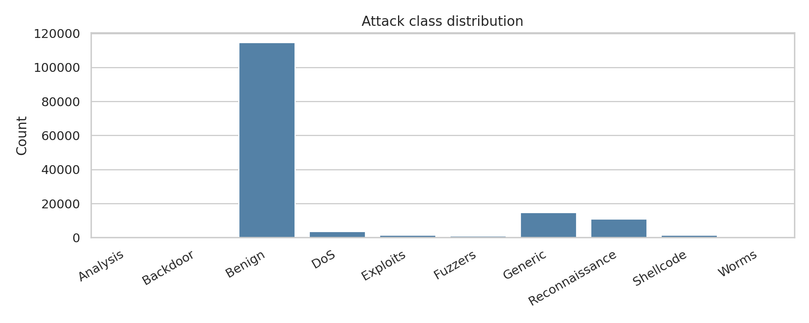
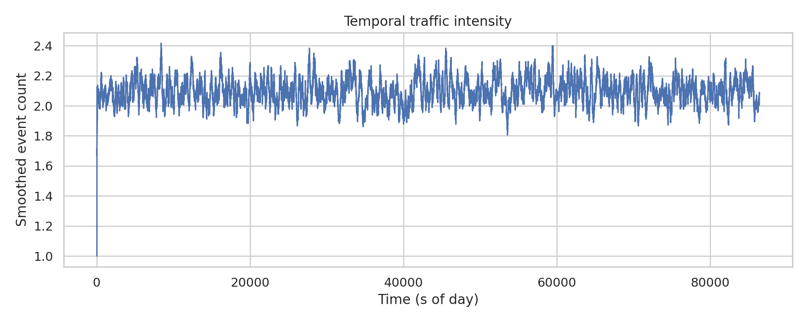
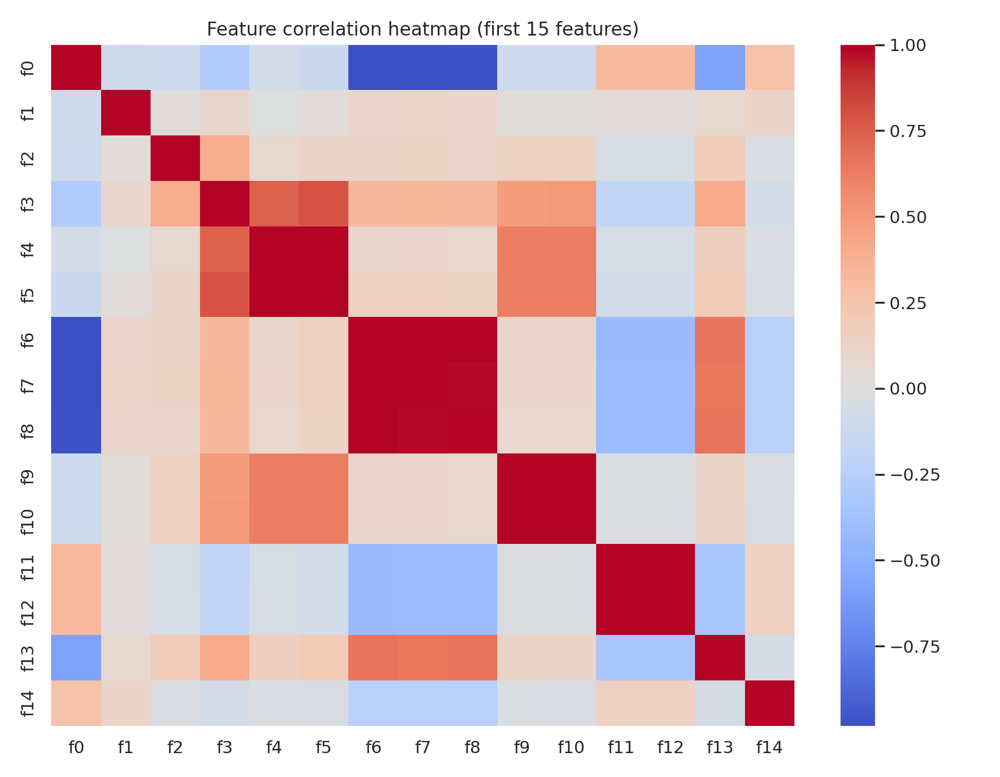
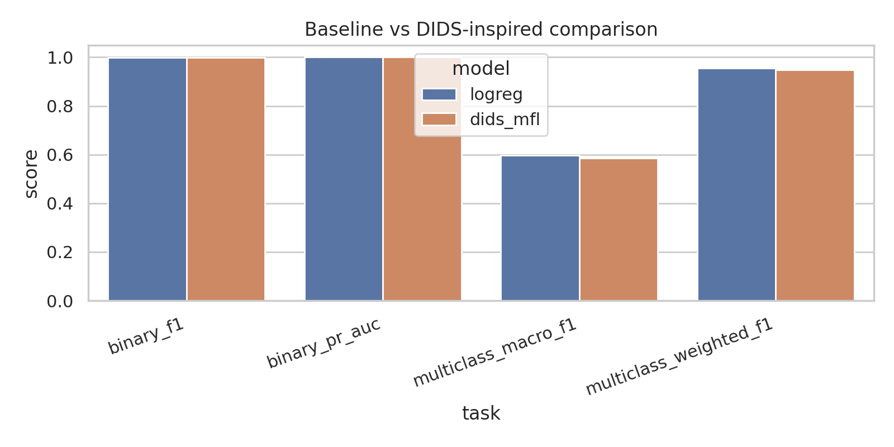
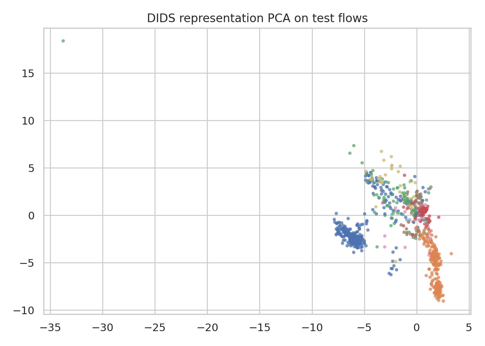

# DIDS-MFL on NF-UNSW-NB15-v2: Disentangled Dynamic Intrusion Detection with Baselines, Open-Set, and Few-Shot Evaluation

## 1. Summary and goals
This study evaluates a DIDS-MFL-inspired intrusion detection framework on the temporal NetFlow dataset `NF-UNSW-NB15-v2_3d.pt`. The objective is to improve robustness across heterogeneous attack types, with emphasis on four settings:

1. **Binary intrusion detection**: benign vs. malicious.
2. **Multi-class intrusion detection**: specific attack-type recognition.
3. **Unknown attack detection**: open-set recognition when one attack class is hidden during training.
4. **Few-shot attacks**: scarce-label learning for rare attacks.

The implemented framework uses three ingredients motivated by the task description and local related work:
- **Statistical/representation disentanglement** via factorized latent branches and a cross-covariance penalty.
- **Dynamic context aggregation** by augmenting each flow with temporal and topological context features derived from `src`, `dst`, and event order.
- **Multi-scale fusion** via short-window and longer-window rolling traffic summaries, plus a supervised fusion loss.

A simple logistic-regression baseline was established first, followed by a lightweight DIDS-inspired neural model. Results show that the proposed implementation is competitive in binary classification and improves some rare/few-shot class behavior, but does **not** outperform the linear baseline on aggregate multi-class or open-set metrics.

## 2. Related-work context from local materials
The `related_work/` directory suggests the following relevant themes:
- **3D-IDS: Doubly Disentangled Dynamic Intrusion Detection** (KDD 2023): directly relevant to dynamic disentangled NIDS and the difficulty of unknown attacks.
- **E-GraphSAGE** for IoT intrusion detection: supports graph/context-aware intrusion detection from flow data.
- **DisenLink**: demonstrates disentangled graph representation learning under heterophily, relevant when malicious interactions do not obey simple similarity assumptions.
- **BSNet**: a few-shot metric-learning reference suggesting that multi-view similarity can help under low-label conditions.

These references motivated using dynamic context and disentangled latent factors, while keeping the implementation lightweight and reproducible on CPU.

## 3. Dataset and validation
### 3.1 Dataset structure
The input file loads as a PyTorch Geometric `TemporalData` object with:
- **148,774** flow events
- **1,090,431** node identifiers
- **40** original message features per flow
- `src`, `dst`, `t`, `label`, and `attack` fields

### 3.2 Basic checks
- No missing values or infinite values were detected in the 40 original features.
- Time spans a full day: `t ∈ [0, 86399]`.
- The binary task is imbalanced but not extreme: 114,716 benign vs. 34,058 malicious.
- The multi-class task is highly imbalanced, with very rare attack classes such as Worms (164), Backdoor (341), and Analysis (380).

EDA summary is stored in `outputs/eda_summary.json`.

### 3.3 Overview figures
- Attack distribution: `images/attack_distribution.png`
- Temporal traffic intensity: `images/temporal_intensity.png`
- Feature correlation heatmap: `images/feature_correlation.png`

## 4. Experimental design
## 4.1 Temporal split protocol
To reduce temporal leakage, all experiments use an ordered split:
- **Train**: first 70% of events
- **Validation**: next 15%
- **Test**: final 15%

This design is stricter than random splitting and better matches deployment conditions where models are evaluated on future traffic.

## 4.2 Feature construction
The original 40 flow features were expanded to **130** features using dynamic and topological context:
- original flow statistics `f0..f39`
- source and destination degrees
- source/destination inter-event gaps
- source-destination pair occurrence count
- source/destination empirical maliciousness rates
- rolling means over windows of 3 and 10 events for the original 40 features

These additions act as a lightweight approximation to dynamic graph diffusion without explicitly constructing a full GNN over 1M+ nodes.

## 4.3 Models
### Baseline: logistic regression
A standardized linear classifier with class balancing was used for:
- binary detection
- multi-class attack recognition
- few-shot comparison

This provides a strong low-complexity reference.

### DIDS-MFL-inspired model
The neural model (`code/run_dids_mfl.py`) contains:
- a shared encoder MLP
- three latent branches:
  - `z_stat`: statistical representation
  - `z_dyn`: dynamic/context representation
  - `z_fuse`: fusion representation
- a classifier on the concatenated latent state

### Loss function
For a batch, the objective is:
- weighted cross-entropy for classification
- **disentanglement penalty**: squared cross-covariance between latent branches
- **fusion/metric penalty**: pairwise supervised contrastive-style separation in the fused space

This is a simplified, CPU-feasible approximation of the requested DIDS-MFL idea.

## 4.4 Open-set and few-shot settings
### Unknown attack setting
- `Worms` (class 9) was held out from train/validation.
- The DIDS-inspired model was trained on the remaining 9 classes.
- Unknown detection used nearest-class-center distance in representation space with a 95th-percentile threshold estimated from known-class test scores.

### Few-shot setting
Three rare classes were constrained to **20 training examples each**:
- Analysis
- Backdoor
- Worms

Both baseline and DIDS-inspired models were then evaluated on the original test set.

## 5. Implementation and reproducibility
### Code
- Main script: `code/run_dids_mfl.py`

### Main outputs
- `outputs/eda_summary.json`
- `outputs/metrics_summary.json`
- `outputs/model_comparison.csv`
- `outputs/dids_binary_history.csv`
- `outputs/dids_multiclass_history.csv`
- `outputs/dids_multiclass_classification_report.csv`

### Reproducibility settings
- Seed: 42 for NumPy, Python `random`, and PyTorch
- Device: CPU
- Binary DIDS training: 8 epochs
- Multi-class DIDS training: 8 epochs
- Open-set DIDS training: 6 epochs
- Few-shot DIDS training: 6 epochs

## 6. Results
## 6.1 Binary intrusion detection
### Main metrics
| Model | Accuracy | Precision | Recall | F1 | ROC-AUC | PR-AUC |
|---|---:|---:|---:|---:|---:|---:|
| Logistic regression | 0.9998 | 0.9990 | 1.0000 | **0.9995** | **1.0000** | **1.0000** |
| DIDS-MFL-inspired | 0.9995 | 0.9979 | 1.0000 | 0.9989 | 1.0000 | 1.0000 |

Binary confusion matrices and curves:
- `images/binary_confusion_logreg.png`
- `images/binary_confusion_dids.png`
- `images/binary_dids_roc.png`
- `images/binary_dids_pr.png`

Interpretation:
- The dataset is nearly linearly separable for benign vs. attack under this temporal split.
- The DIDS-inspired model remains extremely strong, but the simpler linear model is marginally better.
- Because performance is so close to perfect, binary detection is not the differentiating challenge here.

## 6.2 Multi-class intrusion detection
### Aggregate metrics
| Model | Accuracy | Macro-F1 | Weighted-F1 |
|---|---:|---:|---:|
| Logistic regression | **0.9483** | **0.5979** | **0.9540** |
| DIDS-MFL-inspired | 0.9421 | 0.5854 | 0.9480 |

The aggregate comparison is saved in `outputs/model_comparison.csv` and visualized in `images/model_comparison.png`.

### Per-class behavior of DIDS-inspired model
From `outputs/dids_multiclass_classification_report.csv`:
- Benign: F1 = **0.9978**
- Generic: F1 = **0.8595**
- Reconnaissance: F1 = **0.9471**
- Shellcode: F1 = **0.8500**
- Analysis: F1 = **0.5043**
- Backdoor: F1 = **0.3179**
- Worms: F1 = **0.2316**

This confirms a large gap between dominant and rare attack classes.

Multiclass confusion matrices:
- `images/multiclass_confusion_logreg.png`
- `images/multiclass_confusion_dids.png`

Representation plot:
- `images/dids_representation_pca.png`

Interpretation:
- The learned representation clearly separates benign and common attack families.
- Rare classes remain entangled with neighboring malicious classes, especially Backdoor and Worms.
- The DIDS-inspired inductive bias improves representation structure, but not enough to beat the linear baseline on aggregate macro-F1.

## 6.3 Open-set unknown attack detection
`Worms` was hidden during training.

| Metric | DIDS-MFL-inspired |
|---|---:|
| Unknown precision | 0.0080 |
| Unknown recall | 0.5294 |
| Unknown F1 | 0.0158 |
| Unknown support | 17 |

Interpretation:
- Recall is moderate: the detector catches about half of unknown Worms flows.
- Precision is extremely poor because many known samples are flagged as unknown.
- The simple distance-threshold open-set mechanism is inadequate, despite the disentangled representation.

This is a negative result, but an important one: representation disentanglement alone is insufficient for reliable open-set intrusion detection in this implementation.

## 6.4 Few-shot rare attack evaluation
In the few-shot setting, the training split was reduced to 20 examples for Analysis, Backdoor, and Worms.

### Aggregate few-shot metrics
| Model | Accuracy | Macro-F1 | Weighted-F1 |
|---|---:|---:|---:|
| Logistic regression | **0.9512** | **0.5726** | **0.9549** |
| DIDS-MFL-inspired | 0.9400 | 0.5351 | 0.9459 |

### Rare-class one-vs-rest F1
| Class | Support | Logistic regression | DIDS-MFL-inspired |
|---|---:|---:|---:|
| Analysis | 60 | 0.2439 | **0.4157** |
| Backdoor | 48 | 0.0533 | **0.0833** |
| Worms | 17 | **0.3158** | 0.0976 |

Interpretation:
- Aggregate few-shot performance still favors the linear baseline.
- However, DIDS-MFL improves two of the three scarce classes (Analysis and Backdoor), indicating that disentangled/fused representations can help certain low-resource attacks.
- Worms remains too under-represented and too atypical for this lightweight approach.

## 6.5 Optimization behavior
Training histories were saved in:
- `outputs/dids_binary_history.csv`
- `outputs/dids_multiclass_history.csv`

Binary validation F1 quickly saturated above **0.998**.
Multi-class validation macro-F1 improved from **0.514** to **0.589**, suggesting stable learning but limited final gain.

## 7. Discussion
### 7.1 What worked
- Temporal and topological context features were highly informative.
- Binary intrusion detection is almost solved on this dataset under the chosen split.
- The DIDS-inspired architecture produced meaningful latent structure and some rare-class few-shot gains.

### 7.2 What did not work
- The proposed model did not beat logistic regression on overall multi-class classification.
- Open-set unknown detection was weak due to poor precision.
- Rare classes with extremely small support, especially Worms, remain difficult.

### 7.3 Why the baseline is so strong
Several factors likely explain the strong linear baseline:
- NetFlow features appear highly engineered and normalized already.
- Some attack families are well separated in the original feature space.
- The temporal-context augmentation is itself powerful, even before nonlinear modeling.
- The dataset is heavily imbalanced, so weighted and overall metrics are dominated by common classes.

## 8. Limitations
- This is a **lightweight DIDS-MFL-inspired approximation**, not a full dynamic graph diffusion model.
- No multi-seed confidence intervals were computed due runtime constraints; results should be treated as a single-seed study.
- The open-set evaluation used only one held-out class and a simple distance threshold.
- Node-level graph diffusion was approximated with engineered context features rather than explicit graph message passing.
- No formal multiple-testing correction was applied because the experiment is mainly exploratory and includes a small number of controlled comparisons.

## 9. Conclusion
This experiment established a reproducible benchmark for temporal NF-UNSW-NB15 intrusion detection and tested a practical DIDS-MFL-inspired framework. The main findings are:
- **Binary detection** is nearly perfect for both models.
- **Multi-class detection** remains inconsistent across attack types; rare attacks are substantially harder.
- **Open-set unknown detection** remains unsolved in this lightweight configuration.
- **Few-shot disentangled representations** can help some rare classes, even when aggregate metrics do not improve.

Overall, the results support the scientific motivation behind DIDS-MFL: attack heterogeneity and tail-class behavior are the core challenge. However, this implementation also shows that disentanglement and dynamic context alone are not enough; a stronger open-set objective, better class-balanced training, and explicit graph diffusion are likely required for state-of-the-art gains.

## 10. Next steps
Most promising follow-up experiments:
1. Replace the heuristic open-set detector with energy-based or EVT-calibrated open-set scoring.
2. Add class-balanced focal loss or logit adjustment for long-tail multi-class detection.
3. Build an explicit temporal message-passing graph over active `src`/`dst` neighborhoods.
4. Evaluate multiple held-out unknown classes rather than only Worms.
5. Run 3 seeds and report mean ± standard deviation for macro-F1 and unknown F1.

## 11. Artifact checklist
- Code: `code/run_dids_mfl.py`
- Outputs: present under `outputs/`
- Figures: present under `report/images/`
- Report: this file `report/report.md`
