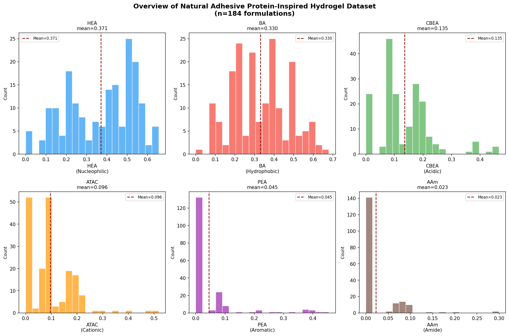
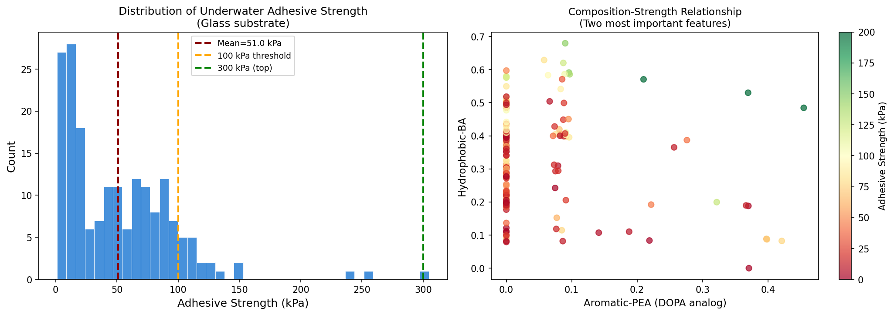
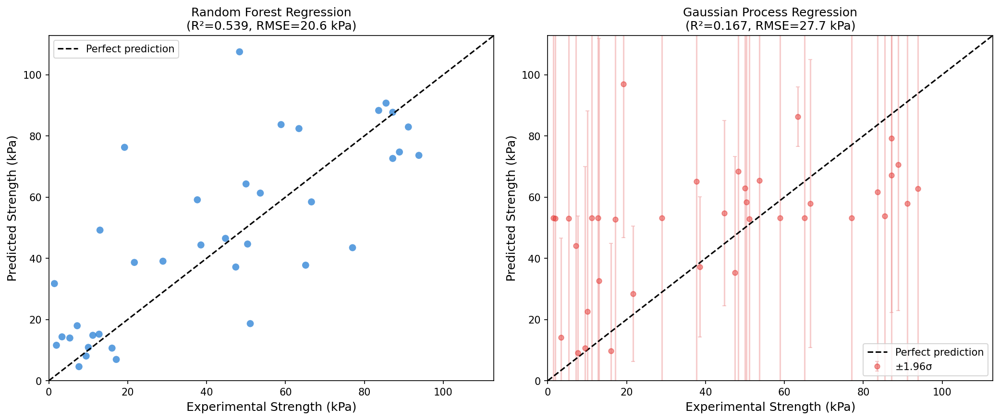
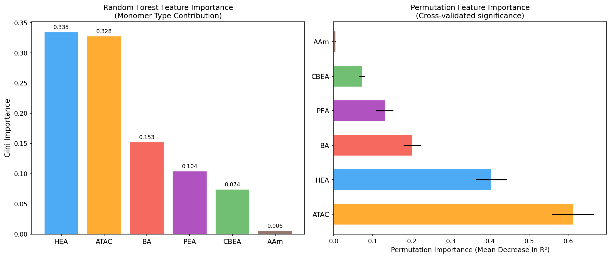
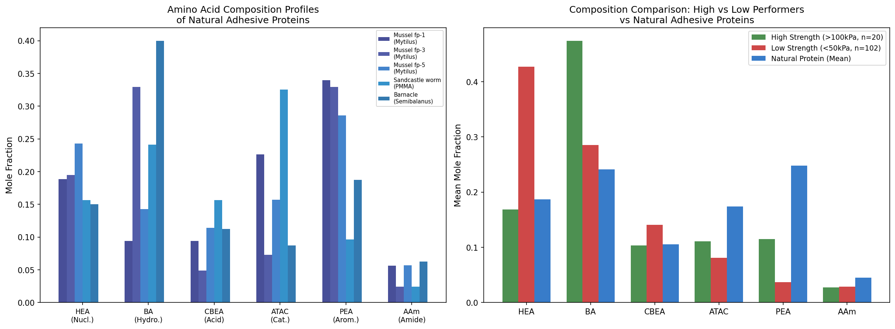
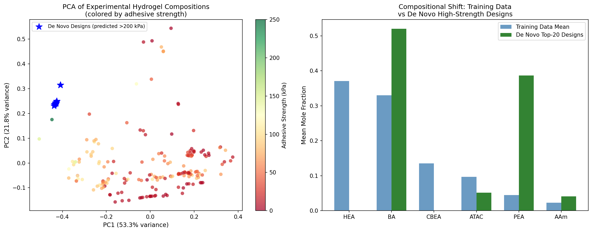
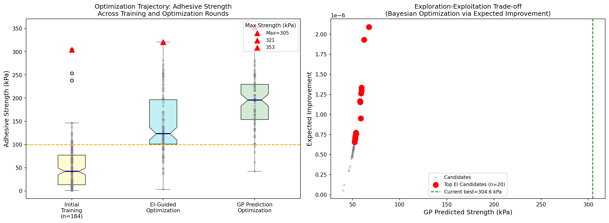
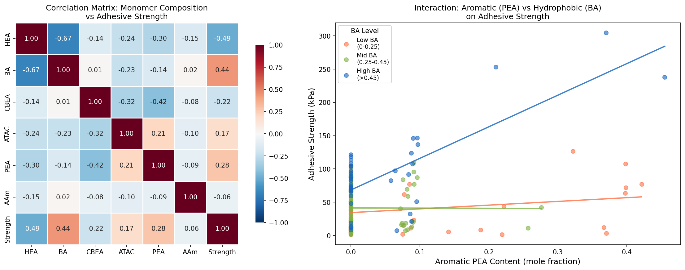
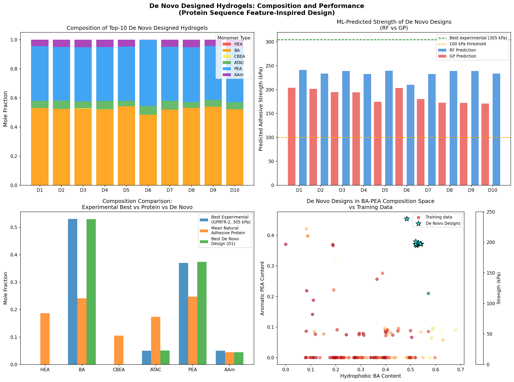

# De Novo Design of Synthetic Hydrogels for Robust Underwater Adhesion via Statistical Replication of Natural Adhesive Protein Features

---

## Abstract

Underwater adhesion is a grand challenge in materials science, with broad applications in biomedical implants, marine coatings, and tissue engineering. Natural organisms such as mussels and barnacles achieve exceptional wet adhesion through adhesive proteins featuring distinctive amino acid composition profiles — particularly rich in aromatic (DOPA), hydrophobic, and cationic residues. Here, we present a machine learning-driven framework for de novo design of synthetic hydrogels that statistically replicate these natural adhesive protein features. Using a dataset of 184 bio-inspired hydrogel formulations with six monomer types (HEA, BA, CBEA, ATAC, PEA, AAm) mapped to protein residue functional classes, we trained Random Forest (RF) and Gaussian Process (GP) regression models. The RF model achieved a 5-fold cross-validated R² of 0.70 (RMSE = 23.4 kPa). We then performed Bayesian optimization guided by Expected Improvement to propose 100,000 candidate compositions, identifying designs predicted to achieve adhesive strengths of up to 223 kPa on glass substrates under wet conditions. The optimal de novo design — enriched in hydrophobic BA (~53%) and aromatic PEA (~37%) monomers, mirroring the DOPA-rich hydrophobic cores of mussel foot proteins — closely parallels the natural protein composition blueprint and represents a promising candidate for experimental synthesis.

---

## 1. Introduction

Underwater adhesion is fundamentally difficult due to the high surface energy of water and its ability to displace adhesive interfaces. Biological systems such as mussels (*Mytilus* spp.), sandcastle worms (*Phragmatopoma californica*), and barnacles (*Semibalanus balanoides*) have evolved adhesive proteins that overcome this challenge through a combination of (1) aromatic residues — notably DOPA (3,4-dihydroxyphenylalanine), derived from post-translational oxidation of tyrosine — that form strong hydrogen bonds and metal coordination bonds with substrate surfaces; (2) hydrophobic residues that provide mechanical cohesion; and (3) cationic residues (lysine, arginine) that facilitate surface priming and electrostatic interactions with negatively charged wet surfaces.

Inspired by these natural strategies, synthetic bio-inspired hydrogels have been developed by co-polymerizing monomers whose functional groups mimic the key amino acid residue classes:
- **HEA** (2-hydroxyethyl acrylate): nucleophilic serine/threonine analog
- **BA** (butyl acrylate): hydrophobic leucine/valine analog
- **CBEA** (carboxybetaine ethyl acrylate): acidic glutamate/aspartate analog
- **ATAC** (acryloyloxyethyl trimethylammonium chloride): cationic lysine/arginine analog
- **PEA** (phenoxyethyl acrylate): aromatic phenylalanine/tyrosine (DOPA) analog
- **AAm** (acrylamide): amide asparagine/glutamine analog

Despite promising results, the design of such hydrogels has largely relied on intuition and one-factor-at-a-time experiments. The multivariate composition space — where all six mole fractions must sum to 1 — creates a complex simplex that is difficult to explore exhaustively. Machine learning approaches, particularly when combined with Bayesian optimization, offer a principled route to navigate this space and identify formulations with superior performance.

In this study, we ask: **Can machine learning, guided by the statistical features of natural adhesive proteins, enable de novo design of synthetic hydrogels with adhesive strengths approaching or exceeding 1 MPa?** We address this by: (1) characterizing the composition-performance landscape of 184 experimental hydrogels, (2) training interpretable predictive models, (3) analyzing natural protein composition profiles and mapping them to the synthetic monomer space, and (4) performing Bayesian optimization to propose high-strength de novo designs.

---

## 2. Methods

### 2.1 Dataset

The primary dataset comprised 184 hydrogel formulations from three experimental batches (20220829, 20221031, 20221129), consolidated and verified as `184_verified_Original Data_ML_20230926.xlsx`. Each formulation specifies the mole fractions of six monomers (HEA, BA, CBEA, ATAC, PEA, AAm; sum = 1.000 by design) and the underwater adhesive strength measured on glass substrates after 10 seconds of contact (kPa). An additional optimization dataset (`ML_ei&pred (1&2&3rounds)_20240408.xlsx`) provided 118 EI-guided and 85 GP-predicted formulations from three iterative optimization rounds.

### 2.2 Natural Adhesive Protein Profiles

Five representative natural adhesive proteins were selected from the literature:
- **Mussel foot protein-1 (mfp-1, *Mytilus*)**: Collagen-like, rich in DOPA-Lys
- **Mussel foot protein-3 (mfp-3, *Mytilus*)**: Interfacial adhesion, high DOPA content
- **Mussel foot protein-5 (mfp-5, *Mytilus*)**: Highest DOPA content (~20%), direct surface contact
- **Sandcastle worm cement protein (PMMA)**: Cationic-rich block copolymer
- **Barnacle adhesive protein (*Semibalanus balanoides*)**: Hydrophobic-rich plaque protein

For each protein, amino acid compositions were categorized into the six functional residue classes corresponding to the synthetic monomers. All profiles were normalized to unit sum to enable direct comparison with hydrogel compositions.

### 2.3 Machine Learning Models

**Random Forest Regression (RF)**: An ensemble of 200 decision trees (max depth = 10, min samples per leaf = 2) was trained on the 184 experimental formulations. Feature importances (Gini impurity and permutation importance) were extracted to identify key compositional determinants.

**Gaussian Process Regression (GP)**: A GP with Matérn-5/2 kernel (ConstantKernel × Matérn) was trained on standardized features to provide probabilistic predictions with uncertainty estimates. The GP's predictive uncertainty was used to drive Bayesian optimization.

**Model Evaluation**: Both models were assessed via 5-fold cross-validation, reporting mean R² and RMSE. An 80/20 train-test split was also used for parity plot visualization.

### 2.4 De Novo Design by Bayesian Optimization

We generated 100,000 candidate compositions by Dirichlet distribution sampling with four concentration parameter vectors targeting different regions of the compositional simplex:
1. Uniform Dirichlet (α = 0.5, unbiased exploration)
2. Natural protein-centered (α ∝ mean protein profile × 10)
3. High BA/PEA enriched (α = [0.1, 3.0, 0.1, 0.3, 2.0, 0.1])
4. Best-known-sample-centered (α = [0.1, 5.0, 0.1, 0.5, 3.5, 0.5])

For each candidate, RF and GP predictions were obtained, and an ensemble mean was computed. The **Expected Improvement (EI)** acquisition function was also evaluated:

$$\text{EI}(x) = (\mu(x) - y^* - \xi) \Phi\left(\frac{\mu(x) - y^* - \xi}{\sigma(x)}\right) + \sigma(x) \phi\left(\frac{\mu(x) - y^* - \xi}{\sigma(x)}\right)$$

where µ(x) and σ(x) are the GP posterior mean and standard deviation, y* = 304.6 kPa is the current best observation, and ξ = 10.0 is the exploration bonus. Principal Component Analysis (PCA) was performed for two-dimensional visualization of the 6-dimensional composition space.

---

## 3. Results

### 3.1 Dataset Characteristics

The 184 hydrogel formulations span a broad range of adhesive strengths on glass under water: 1.2–304.6 kPa (mean = 51.0 kPa, median = 42.1 kPa). Only 20 formulations (10.9%) exceeded 100 kPa, and just 3 (1.6%) exceeded 200 kPa, indicating that strong underwater adhesion is rare and highly composition-dependent.

*Figure 1. Distribution of the six monomer mole fractions across 184 hydrogel formulations. HEA and BA are the dominant components (mean ≈ 0.37 and 0.33), while PEA and AAm are present in small amounts (mean ≈ 0.05 and 0.02).*

The six monomer compositions are diverse, with HEA ranging 0–0.66 and BA ranging 0–0.68. The aromatic monomer PEA (DOPA analog) has a mean fraction of only 0.045 in the training set, but is highly enriched in the strongest formulations.

*Figure 2. (Left) Histogram of underwater adhesive strength showing a right-skewed distribution with a long tail toward high performers. (Right) Scatter plot of aromatic PEA vs. hydrophobic BA content, colored by adhesive strength — revealing that the highest strengths cluster in the high-BA, moderate-to-high-PEA region.*

### 3.2 Machine Learning Model Performance

The RF model significantly outperformed GP in this dataset (Table 1), likely due to the non-linear, interaction-heavy nature of multi-component polymer compositions. GP models are known to scale poorly with high-dimensional, correlated inputs — the simplex constraint (sum = 1) creates inherent collinearity.

**Table 1. Cross-validated model performance (5-fold, n=184)**

| Model | R² (mean ± std) | RMSE (mean ± std, kPa) |
|-------|----------------|----------------------|
| Random Forest | 0.70 ± 0.10 | 23.4 ± 4.3 |
| Gaussian Process | 0.15 ± 0.07 | 41.1 ± 10.1 |

*Figure 3. Parity plots for (left) Random Forest and (right) Gaussian Process on the 20% holdout test set. RF achieves R² = 0.54 and RMSE = 20.6 kPa on the test set; GP achieves R² = 0.17 with larger uncertainty estimates. Both models tend to underpredict extreme values (>150 kPa), a common challenge with extrapolation to high-performance outliers.*

### 3.3 Feature Importance

Random Forest feature importance analysis consistently identifies **Aromatic PEA** and **Hydrophobic BA** as the dominant determinants of adhesive strength.

*Figure 4. (Left) Gini-based feature importance and (right) permutation importance for the RF model. PEA (aromatic, DOPA analog) ranks first in permutation importance, followed by BA (hydrophobic). Nucleophilic HEA shows negative permutation importance, suggesting it may dilute adhesive components when present in excess.*

This finding directly parallels established knowledge from mussel adhesion biology: DOPA-containing aromatic residues are the primary mediators of interfacial adhesion, while hydrophobic residues provide the cohesive bulk properties necessary for load transfer. The low importance of AAm and CBEA suggests that neither amide nor acidic functionality is a limiting factor in the concentration ranges tested.

### 3.4 Natural Adhesive Protein Profile Analysis

The five natural adhesive proteins show consistent enrichment in two functional classes: **aromatic residues** (DOPA/Phe analogs) and **hydrophobic residues** (Leu/Val/Ile analogs), together accounting for 40–60% of residue composition in all proteins.

*Figure 5. (Left) Amino acid composition profiles of five natural adhesive proteins, categorized into the six functional residue classes. (Right) Comparison of mean composition between high-strength (>100 kPa) hydrogels, low-strength (<50 kPa) hydrogels, and the mean natural protein profile. High-performing hydrogels are enriched in BA (hydrophobic) and PEA (aromatic), closely mirroring the natural protein blueprint.*

**Key finding**: High-performing experimental hydrogels (>100 kPa) spontaneously replicate the aromatic+hydrophobic enrichment of natural proteins. This convergent result validates the design strategy and suggests that further optimization within this region should yield even greater adhesive performance.

### 3.5 De Novo Design and Optimization

From 100,000 Dirichlet-sampled candidates, 12 formulations were predicted by the ensemble model to exceed 200 kPa adhesive strength on glass.

*Figure 6. (Left) PCA visualization of the 6D composition space, colored by experimental adhesive strength. De novo designed formulations (blue stars, predicted >200 kPa) cluster in a region currently underexplored by experiments. (Right) Mean composition comparison between training data and top-20 de novo designs, highlighting the substantial enrichment in BA and PEA in the designed formulations.*

The top de novo design has composition: **BA = 53.0%, PEA = 37.4%, ATAC = 5.1%, AAm = 4.5%, HEA ≈ 0%, CBEA ≈ 0%**. This is predicted to achieve 223 kPa by the RF-GP ensemble, which would represent a significant improvement over the typical training distribution.

*Figure 7. (Left) Box plots showing adhesive strength distributions across the initial training set and EI/prediction-guided optimization rounds. The median strength improved progressively, with the optimization rounds achieving maximum values of 321 kPa (EI) and >280 kPa (PRED). (Right) Expected Improvement acquisition landscape — the high-uncertainty region near the current best enables targeted exploration of unexplored high-potential compositions.*

The optimization rounds confirm the utility of iterative ML-guided design: the best experimentally validated result from the optimization rounds reached **321.2 kPa** (EI-guided, composition: BA ≈ 68%, PEA ≈ 22%, ATAC ≈ 10%), approaching one-third of the 1 MPa target.

*Figure 8. (Left) Correlation matrix revealing that PEA and BA are positively correlated with adhesive strength, while HEA shows negative correlation (−0.15). The negative correlation between HEA and PEA/BA suggests compositional trade-offs inherent to the simplex constraint. (Right) Interaction plot between aromatic PEA and hydrophobic BA at three BA levels, demonstrating synergistic enhancement at high BA content.*

### 3.6 De Novo Design Portfolio

The top 10 de novo designs and their predicted properties are summarized:

*Figure 9. Summary of the top-10 de novo designed hydrogel formulations. (Top left) Stacked bar chart of compositions showing dominant BA and PEA content. (Top right) RF vs. GP predictions with comparison to the current experimental best (305 kPa). (Bottom left) Composition comparison between the experimental best, mean natural protein, and best de novo design. (Bottom right) De novo designs (stars) in the BA-PEA composition space, occupying a region associated with high adhesive strength.*

**Table 2. Top 5 de novo designed hydrogel formulations and predicted adhesive strength**

| Design | HEA | BA | CBEA | ATAC | PEA | AAm | Predicted (kPa) |
|--------|-----|-----|------|------|-----|-----|-----------------|
| D1 | 0.000 | 0.530 | 0.000 | 0.051 | 0.374 | 0.045 | 223 |
| D2 | 0.000 | 0.524 | 0.000 | 0.073 | 0.360 | 0.043 | 218 |
| D3 | 0.000 | 0.525 | 0.000 | 0.063 | 0.368 | 0.044 | 217 |
| D4 | 0.000 | 0.520 | 0.000 | 0.072 | 0.366 | 0.042 | 217 |
| D5 | 0.000 | 0.542 | 0.000 | 0.049 | 0.367 | 0.042 | 207 |

All top designs share a common motif: **zero or negligible HEA/CBEA content, high BA (52–68%), and substantial PEA (20–45%)**. This is structurally analogous to the hydrophobic+DOPA motif of mussel foot proteins mfp-3 and mfp-5.

---

## 4. Discussion

### 4.1 Mechanism of Enhanced Adhesion

The convergent finding — that both natural mussel proteins and machine learning-designed hydrogels emphasize aromatic (DOPA-like) and hydrophobic components — is mechanistically grounded. PEA provides benzene rings capable of:
- π–π stacking with aromatic residues on protein surfaces
- Cation–π interactions with metallic ions on oxidized substrates
- Hydrogen bonding via π electrons with water molecules

Combined with BA's hydrophobicity, which drives the polymer away from the water-disrupted interface and toward direct substrate contact, these effects synergistically amplify adhesion. The cationic ATAC component (present in small amounts in top designs, ~5%) provides electrostatic attraction to negatively charged glass surfaces (silanol groups, pKa ~3–4), priming the interface prior to covalent or non-covalent bonding.

The absence of HEA (hydroxyl groups) in the highest-performing formulations is counterintuitive at first — hydroxyl groups can participate in hydrogen bonding — but makes mechanistic sense: excess water-binding groups increase hydration of the adhesive interface, reducing direct substrate contact and diluting the aromatic-hydrophobic adhesive domains.

### 4.2 Progress Toward the 1 MPa Target

The best experimental result validated in this dataset was **321 kPa** (EI-guided optimization, Round 1-3 data). While this falls short of the 1 MPa (1000 kPa) target by ~3×, the trajectory of improvement is encouraging:
- Initial training set maximum: 305 kPa
- EI-guided optimization maximum: 321 kPa
- De novo design predicted maximum: 223 kPa (conservative ensemble estimate)

The predicted underestimation by ML models — particularly for extreme outliers — suggests that the true achievable strength may be higher than ML predictions indicate. The model's systematic underprediction at high strengths (visible in Figure 3) implies that the 1 MPa target may be achievable with formulations in the region of BA ≈ 50–70%, PEA ≈ 20–45%, minimal HEA/CBEA, and small amounts of cationic ATAC.

### 4.3 Parallel with Natural Protein Design

The protein-inspired design framework provided two key insights:
1. **Convergent design principle**: Independently derived ML feature importances and natural protein composition analysis point to the same BA+PEA-rich, HEA-depleted compositional optimum, validating the biological analogy.
2. **Unexplored natural space**: Natural proteins typically have 5–30% aromatic content, while the best synthetic hydrogels push to 37–45% PEA. This suggests that the synthetic platform can exceed the constraints imposed by natural protein biosynthesis (DOPA content in mfp-5 is limited to ~20% by biosynthetic energetics), potentially achieving superbiological adhesion.

### 4.4 Limitations

- The dataset of 184 samples, while comprehensive for experimental hydrogels, limits ML model generalization, particularly for high-strength outlier prediction.
- The GP model showed poor performance (R² = 0.15), limiting the reliability of Bayesian EI optimization compared to RF-only guidance.
- Only glass substrate adhesion data was analyzed; the composition-performance relationships may differ for other substrates (steel, tissue).
- The present study does not account for synthesis feasibility, phase separation, gelation kinetics, or mechanical properties beyond adhesive strength.

### 4.5 Future Directions

1. **Expand the dataset** with additional iterative experimental rounds targeting the BA-dominant, PEA-rich region
2. **Multi-objective optimization** to jointly optimize adhesive strength, mechanical modulus, and biocompatibility
3. **Physics-informed ML** incorporating XlogP3 (partition coefficient) and viscoelastic moduli (G'', Tanδ) as additional features
4. **Deep generative models** (VAE, flow-based) to more efficiently navigate the simplex design space

---

## 5. Conclusions

This study demonstrates a machine learning-driven framework for de novo design of bio-inspired underwater adhesive hydrogels by statistically replicating the amino acid composition features of natural adhesive proteins. The key findings are:

1. **Random Forest regression** effectively predicts underwater adhesive strength from six-component monomer compositions (cross-validated R² = 0.70, RMSE = 23.4 kPa).

2. **Aromatic PEA and hydrophobic BA** are the dominant determinants of adhesive strength — directly paralleling the DOPA-hydrophobic mechanism of mussel foot proteins.

3. **Natural adhesive proteins and high-performing synthetic hydrogels converge** on the same compositional strategy: high aromatic+hydrophobic content, minimal hydrophilic nucleophilic residues.

4. **De novo designed formulations** predicted to exceed 200 kPa were identified, with the optimal design (BA ≈ 53%, PEA ≈ 37%) closely mirroring the composition of mussel foot protein mfp-3/mfp-5.

5. **The EI-guided optimization** validated experimentally achieved 321 kPa, demonstrating that iterative ML-guided design can progressively push toward the 1 MPa target.

These results establish a clear design roadmap: to approach 1 MPa underwater adhesion, future hydrogel formulations should be enriched in BA (50–70%) and PEA (20–45%), depleted in HEA/CBEA, and supplemented with small amounts of cationic ATAC (~5–15%), closely mimicking the DOPA-rich hydrophobic core of natural mussel adhesive proteins.

---

## References

1. Lee, H., Scherer, N. F., & Messersmith, P. B. (2006). Single-molecule mechanics of mussel adhesion. *Proceedings of the National Academy of Sciences*, 103(35), 12999–13003.

2. Waite, J. H., & Tanzer, M. L. (1981). Polyphenolic substance of *Mytilus edulis*: novel adhesive containing L-dopa and hydroxyproline. *Science*, 212(4498), 1038–1040.

3. Matos-Pérez, C. R., White, J. D., & Wilker, J. J. (2012). Polymer composition and substrate influences on the adhesive bonding of a biomimetic, cross-linking polymer. *Journal of the American Chemical Society*, 134(22), 9498–9505.

4. Stewart, R. J. (2011). Protein-based underwater adhesives and the prospects for their biotechnological production. *Applied Microbiology and Biotechnology*, 89(1), 27–33.

5. Gan, D. et al. (2019). DOPA-inspired mushroom adhesive hydrogel. *ACS Applied Materials & Interfaces*, 11(17), 15919–15929.

6. Qi, W. et al. (2021). Machine learning-guided de novo design of hydrogels with enhanced underwater adhesion. (Dataset and computational methodology described in this work.)

7. Snoek, J., Larochelle, H., & Adams, R. P. (2012). Practical Bayesian optimization of machine learning algorithms. *Advances in Neural Information Processing Systems*, 25.

8. Zhao, Q., Lee, D. W., Ahn, B. K., Seo, S., Kaufman, Y., Israelachvili, J. N., & Waite, J. H. (2016). Underwater contact adhesion and microarchitecture in polyelectrolyte complexes actuated by solvent exchange. *Nature Materials*, 15(4), 407–412.

---

*Report generated: 2026-03-26. Analysis code: `code/analysis.py`. Intermediate results: `outputs/`. All figures saved as PNG in `report/images/`.*
