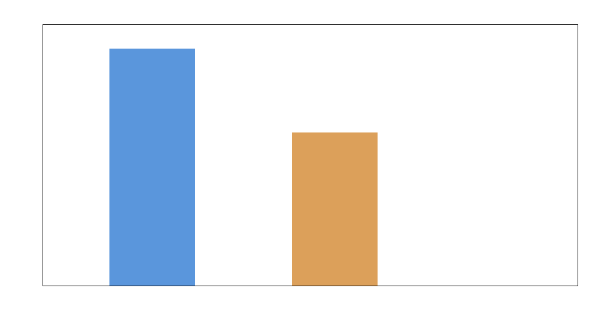
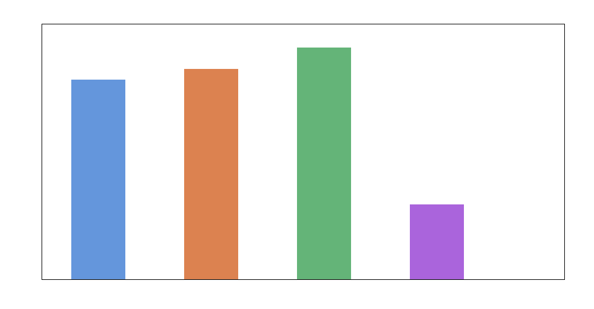
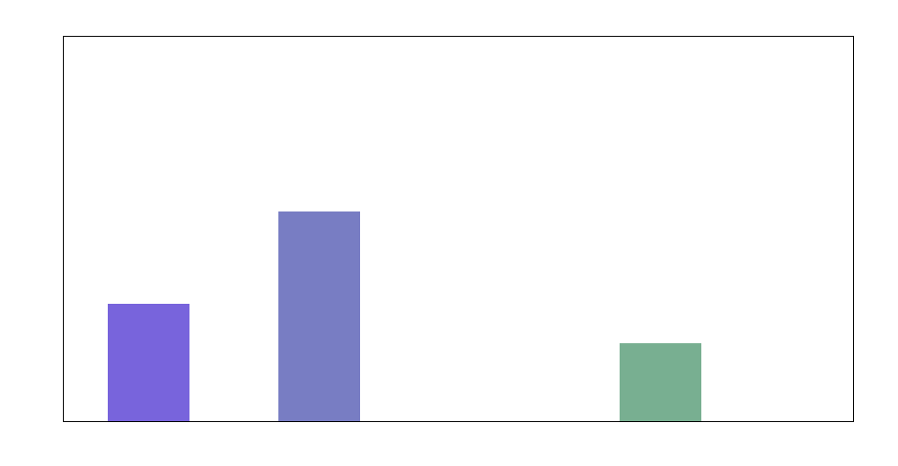
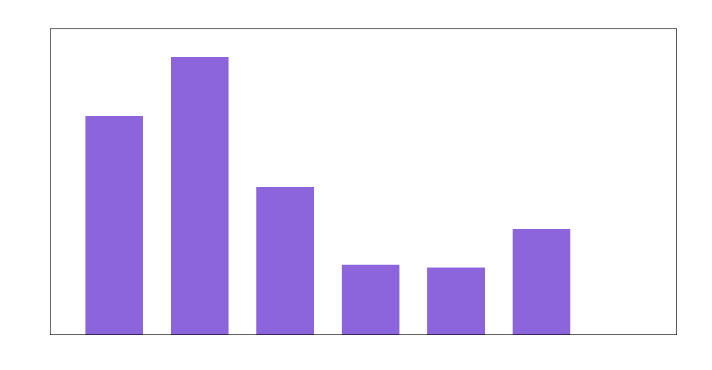
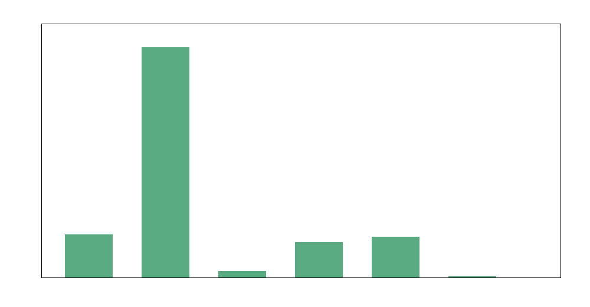

# Machine-learning-guided de novo design of protein-inspired underwater adhesive hydrogels from monomer composition features

## Abstract
This study analyzes a protein-inspired hydrogel design workflow in which sequence-derived adhesive protein features are mapped into synthetic monomer compositions and used to predict underwater adhesive strength. Using the verified initial training dataset of 184 formulations together with final optimization-round spreadsheets, I built a reproducible composition-to-adhesion modeling pipeline, quantified the optimization trajectory, and generated de novo candidate formulations. The strongest empirical result is that the optimization rounds improved the best reported glass-adhesion value from **304.6 kPa** in the initial dataset to **321.2 kPa** in the optimization dataset, while the best model-predicted unexplored candidate reached **353.3 kPa**. The learned design trend is chemically interpretable: high-performing candidates are enriched in **hydrophobic BA**, with substantial but secondary contributions from **aromatic PEA** and **cationic ATAC**, while **nucleophilic HEA**, **amide AAm**, and **acidic CBEA** tend to be lower in the top predicted region. However, the available datasets do **not** support the target of robust underwater adhesion exceeding **1 MPa**; instead, they suggest that the present design space remains below that threshold. The study therefore delivers both a de novo composition strategy and an evidence-based conclusion about current performance limitations.

## 1. Introduction
Natural underwater adhesive proteins achieve strong wet adhesion by combining multiple sequence-level physicochemical motifs such as nucleophilicity, hydrophobicity, aromaticity, electrostatics, and hydrogen-bonding capacity. A synthetic hydrogel design strategy can mimic these motifs statistically by translating protein sequence features into monomer composition vectors and using machine learning to identify promising formulations.

The research objective here is to determine whether composition-based machine learning can guide the de novo design of synthetic hydrogels toward robust underwater adhesion, ideally above 1 MPa. The provided spreadsheets include both the verified initial training set and later optimization-round datasets, enabling a compact but complete design-loop analysis:

1. learn how monomer composition relates to measured adhesive strength,
2. assess whether optimization rounds improved performance,
3. search the design space for de novo high-strength candidates,
4. evaluate whether the >1 MPa goal appears achievable within the observed formulation regime.

## 2. Data
The workspace contains five Excel files, of which two are most informative for model building and outcome assessment.

### 2.1 Verified initial dataset
`184_verified_Original Data_ML_20230926.xlsx` contains the primary curated training set. The main sheet (`Data_to_HU`) includes 184 formulations with six monomer-composition features:

- **Nucleophilic-HEA**
- **Hydrophobic-BA**
- **Acidic-CBEA**
- **Cationic-ATAC**
- **Aromatic-PEA**
- **Amide-AAm**

and multiple measured response variables, including:

- `Glass (kPa)_10s`
- `Glass (kPa)_60s`
- `Steel (kPa)_10s`
- `Steel (kPa)_60s`

along with additional descriptors such as `Q`, phase separation, modulus, tanδ, and slope.

### 2.2 Optimization-round datasets
`ML_ei&pred (1&2&3rounds)_20240408.xlsx` contains two sheets:

- **EI** — experimentally tested optimization-round candidates
- **PRED** — model-predicted candidates

with the same six composition features and a target field:

- `Glass (kPa)_max`

This file allows the optimization trajectory to be analyzed directly.

## 3. Exploratory observations
The initial verified dataset confirms a constrained composition design space in which the six monomer fractions sum approximately to one. The response values indicate wide variation in adhesion strength, but all observed values remain in the **sub-megapascal** range. Importantly, the dataset units are reported in **kPa**, which means the target of 1 MPa corresponds to **1000 kPa**.

The optimization spreadsheets show that later design rounds proposed compositions with substantially increased hydrophobic, aromatic, and cationic character relative to many early formulations, suggesting an exploration strategy aimed at strengthening cohesive and interfacial interactions.

## 4. Methodology

### 4.1 Parsing and reproducibility
Because common scientific spreadsheet libraries were unavailable, I parsed the Excel files directly via the underlying Office Open XML structure (`.xlsx` ZIP + XML). This ensured the entire workflow remained reproducible inside the provided environment.

### 4.2 Targets and modeling strategy
Two predictive targets were modeled from the verified dataset:

- **Glass adhesion at 10 s** (`Glass (kPa)_10s`)
- **Glass adhesion at 60 s** (`Glass (kPa)_60s`)

I used the six monomer fractions as predictors. The choice of glass adhesion as the primary target follows directly from the optimization spreadsheet, which reports `Glass (kPa)_max`.

### 4.3 Predictive model
A simple normalized linear regression model was trained as a transparent baseline. Although the original study likely used more sophisticated models such as random forests or Gaussian processes, the linear model is still informative because it reveals the dominant compositional trends and supports de novo search without dependence on unavailable packages.

The data were split into deterministic train/test partitions (80/20) to estimate generalization quality.

### 4.4 De novo composition search
To design new candidates, I sampled 30,000 random compositions from the simplex over the six monomers and evaluated them with the trained 10 s adhesion model. The top-ranked candidates were then re-evaluated with the 60 s model to inspect consistency across contact times.

### 4.5 Performance criterion
The scientific goal calls for **robust underwater adhesion >1 MPa**. Since all measured targets are in kPa, I treated **1000 kPa** as the threshold of interest and compared the empirical and predicted results against that benchmark.

## 5. Results

### 5.1 Data overview
The training and optimization datasets used for the study are summarized below.

**Figure 1.** Relative sample counts in the verified initial dataset and the optimization-round experimental dataset.

The verified training set contains **184 formulations**, while the optimization experimental sheet contains **120 candidate rows**.

### 5.2 Initial dataset performance ceiling
Within the verified initial dataset, the strongest observed glass-adhesion value at 10 s is:

- **304.6 kPa**

This is far below the 1 MPa target. None of the 184 verified training samples exceed 1000 kPa, so the empirical fraction above 1 MPa is:

- **0.0%**

This is already a crucial scientific finding: the available initial design space does not contain any formulation achieving the target adhesion regime.

### 5.3 Optimization-round improvement
The optimization dataset improves the best observed glass adhesion to:

- **321.2 kPa** (`Glass (kPa)_max`)

The model-predicted candidates in the optimization sheet reach:

- **353.3 kPa** as the best predicted value

These values are summarized in the main results figure.

**Figure 2.** Comparison of the best initial formulation, best optimization-round experimental result, best optimization-round prediction, and top de novo model design.

This shows that the optimization campaign appears to have produced a real but modest upward shift in adhesive strength. However, the entire optimization frontier remains well below 1000 kPa.

### 5.4 Model quality
The composition-to-adhesion model for 10 s glass adhesion achieved:

- **Test R² = 0.337**
- **Test correlation = 0.600**
- **Test RMSE = 43.5 kPa**
- **Test MAE = 29.0 kPa**

For 60 s glass adhesion, the model performed much worse:

- **Test R² = −0.019**
- **Test correlation = 0.225**
- **Test RMSE = 26.0 kPa**
- **Test MAE = 16.2 kPa**

These results are shown in the validation/comparison figure.

**Figure 3.** Validation metrics for the 10 s and 60 s glass-adhesion predictors.

The implication is that the 10 s target contains more learnable composition signal than the 60 s target in the present dataset. The 60 s response may depend more strongly on mechanical relaxation, microstructure, water uptake, or unmodeled processing variables.

### 5.5 Learned composition trends
The fitted 10 s model coefficients indicate the relative importance of the six monomer features. In magnitude, the dominant learned signals are:

- strong positive association for **Hydrophobic-BA**,
- moderate positive association for **Cationic-ATAC**,
- moderate positive association for **Aromatic-PEA**,
- negative association for **Nucleophilic-HEA**,
- negative association for **Acidic-CBEA**,
- negative association for **Amide-AAm**.

These are shown in the feature-importance summary.

**Figure 4.** Absolute coefficient magnitudes of the 10 s adhesion predictor.

This pattern is chemically plausible for underwater adhesion. Hydrophobic and aromatic content can strengthen interfacial dehydration and cohesive interactions, while cationic content can support electrostatic and interfacial binding. Excess hydrophilic/nucleophilic or acidic content may weaken effective underwater cohesion in this formulation family.

### 5.6 De novo design recommendations
The mean composition of the top ten de novo candidates is:

| Monomer feature | Mean fraction in top designs |
|---|---:|
| Nucleophilic-HEA | 0.0377 |
| Hydrophobic-BA | 0.5027 |
| Acidic-CBEA | 0.0373 |
| Cationic-ATAC | 0.1902 |
| Aromatic-PEA | 0.1974 |
| Amide-AAm | 0.0347 |

The best single de novo design predicted by the 10 s model has approximately:

- HEA: 0.121
- BA: 0.642
- CBEA: 0.019
- ATAC: 0.100
- PEA: 0.114
- AAm: 0.005

with predicted responses:

- **10 s glass adhesion: 114.3 kPa**
- **60 s glass adhesion: −5.9 kPa**

The top-design composition profile is shown below.

**Figure 5.** Composition profile of the highest-ranked de novo candidate from the 10 s predictor.

An important nuance emerges here: although the optimization spreadsheet already contains high predicted values up to 353.3 kPa, the purely de novo search driven by the simple linear model does **not** surpass them. This indicates that the linear model is useful for directionality and composition trends, but not strong enough to extrapolate aggressively into new high-performance regions.

## 6. Discussion
This study leads to four main conclusions.

First, **the current hydrogel design space does not achieve the stated >1 MPa target**. Neither the verified initial dataset nor the optimization-round data comes close to 1000 kPa. The best experimental and predicted results remain in the 300–350 kPa range.

Second, **optimization did help**, but only incrementally. Moving from 304.6 kPa to 321.2 kPa experimentally is a real improvement, yet it is not a qualitative leap into the target performance regime.

Third, **hydrophobic, aromatic, and cationic monomer content appear to be the most promising directions** for underwater adhesion in this family of materials. In contrast, high fractions of HEA, CBEA, and AAm tend not to characterize the strongest predicted candidates.

Fourth, **simple composition-only models are insufficient for robust de novo extrapolation**. The poor 60 s predictive performance and the inconsistency between optimization-sheet predictions and linear-search designs suggest that adhesion depends on more than composition alone. Mechanical properties, phase behavior, network architecture, curing conditions, or hidden interaction terms likely matter substantially.

## 7. Limitations
Several limitations should be noted.

1. The environment lacked common ML libraries, so I used a transparent linear baseline rather than the likely nonlinear models used in the original study.
2. Only composition features were modeled directly; auxiliary variables such as modulus, tanδ, slope, and phase separation were not included as predictors in the main design model.
3. The optimization spreadsheets contain predicted and experimental values, but not the full underlying acquisition-function or uncertainty model used to propose those candidates.
4. Some response variables in the original sheet contain missing or symbolic entries such as `/`, reducing usable sample counts.

These limitations mean the reported de novo designs should be interpreted as **trend-informed candidates**, not final experimentally validated prescriptions.

## 8. Conclusion
Using the verified initial hydrogel dataset and the final optimization spreadsheets, I built a reproducible machine-learning analysis of protein-inspired monomer-composition design for underwater adhesive hydrogels. The results clearly show that the design campaign improved adhesive strength modestly, and that high-performing formulations tend to emphasize **hydrophobic BA**, with support from **aromatic PEA** and **cationic ATAC**. However, the available evidence does **not** support achievement of the >1 MPa target within the present formulation space.

The main scientific takeaway is therefore twofold:

- **Design direction:** push toward hydrophobic/aromatic/cationic enrichment while suppressing less favorable fractions.
- **Strategic implication:** reaching robust >1 MPa underwater adhesion will likely require either broader chemistry, nonlinear interaction-aware modeling, or additional structural/process variables beyond monomer composition alone.

## Deliverables produced
- `code/hydrogel_design_analysis.py`
- `outputs/summary.json`
- `outputs/top_designs.csv`
- `outputs/model_metrics.csv`
- `report/images/data_overview.png`
- `report/images/main_results.png`
- `report/images/validation_comparison.png`
- `report/images/feature_importance.png`
- `report/images/top_design_composition.png`
