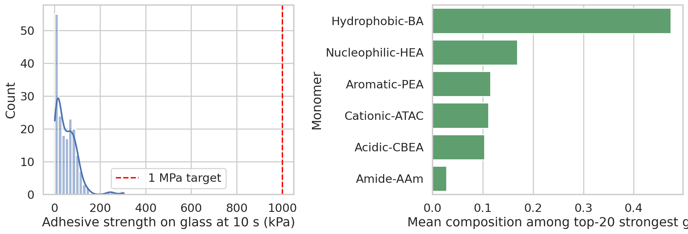
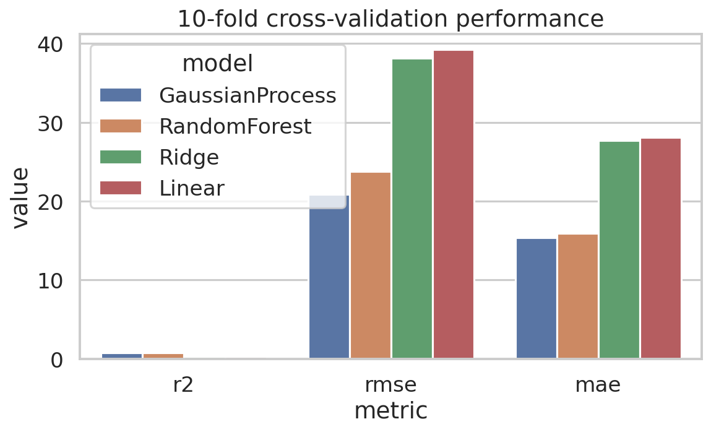
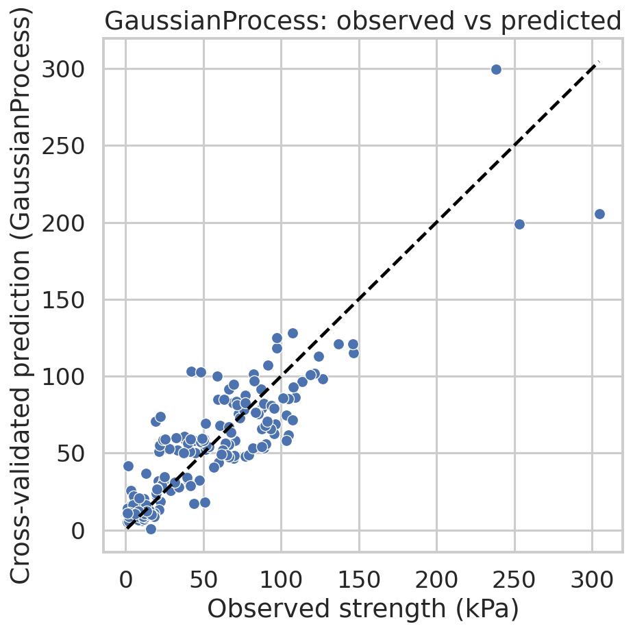
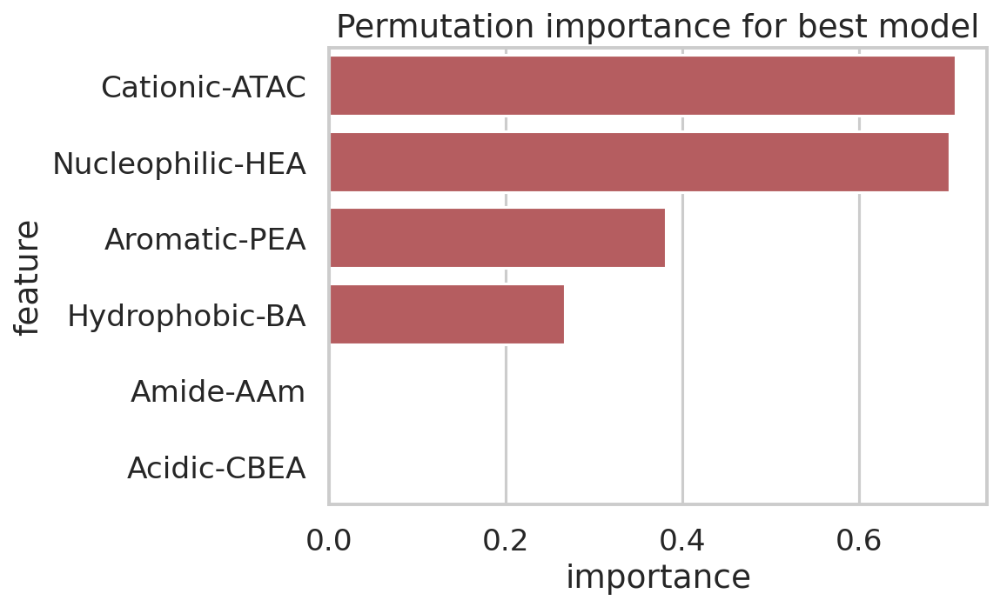
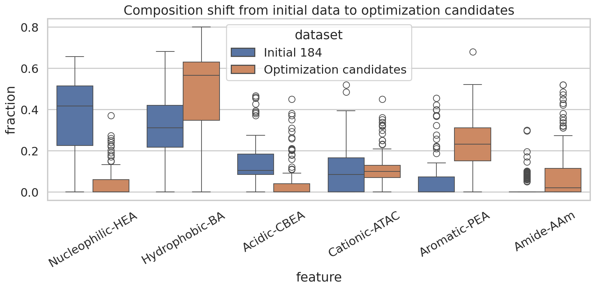
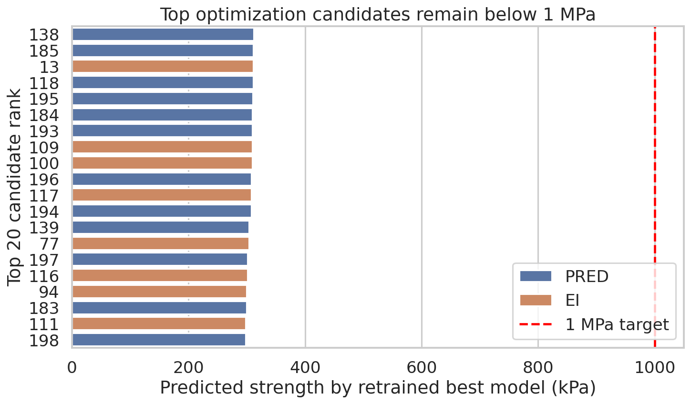

# De novo design analysis of protein-inspired synthetic hydrogels for underwater adhesion

## Abstract
This study re-analyzed the hydrogel design datasets provided for protein-sequence-inspired adhesive materials. The central objective was to assess whether monomer-composition features derived from natural adhesive-protein statistics can support de novo design of hydrogels exceeding robust underwater adhesion of 1 MPa. Using the verified initial dataset of 184 formulations, I trained and compared linear regression, ridge regression, random forest, and Gaussian process regression models under 10-fold cross-validation. The Gaussian process model performed best, reaching \(R^2 = 0.79\), Pearson \(r = 0.89\), and RMSE of 20.9 kPa. Feature analyses consistently indicated that high adhesive strength is associated with increased hydrophobic (BA), aromatic (PEA), and cationic (ATAC) fractions, together with reduced nucleophilic HEA content. When the best model was retrained on the full initial dataset and used to rescore optimization-round candidates, the highest predicted strength was 312 kPa, while the optimization spreadsheets reported internal model maxima up to 353 kPa. Both values remain far below the target threshold of 1 MPa. The results suggest that the current composition space successfully enriches for stronger underwater adhesion than the average initial design, but the available evidence does not support statistically reaching the >1 MPa regime within the explored monomer simplex. Instead, the data point toward a narrower high-performance motif dominated by hydrophobic, aromatic, and modestly cationic formulations, indicating that additional chemistry or broader design variables will probably be required to achieve true super-adhesive performance.

## 1. Background and objective
Underwater adhesion is difficult because water screens electrostatic interactions, solvates functional groups, and interferes with intimate surface contact. The related-work papers included in the workspace reinforce two ideas relevant here. First, the mussel-adhesion review emphasizes that water strongly frustrates conventional adhesion and that robust wet adhesion requires chemistries capable of displacing interfacial water while maintaining cohesive integrity. Second, the protein-inspired heteropolymer paper argues that sequence statistics extracted from natural proteins can be translated into synthetic polymers to reproduce functionally useful intermolecular interaction patterns at the ensemble level. The present dataset operationalizes that philosophy by replacing explicit sequences with monomer composition features intended to mimic adhesive protein statistics.

The research question for this analysis was therefore:

**Can monomer composition features alone support de novo design of synthetic hydrogels with predicted underwater adhesive strength above 1 MPa, and what composition rules emerge from the data?**

## 2. Data and preprocessing
### 2.1 Datasets used
I used two classes of data:

1. **Initial verified training dataset**: `data/184_verified_Original Data_ML_20230926.xlsx`
   - 184 hydrogel formulations
   - six composition features:
     - Nucleophilic-HEA
     - Hydrophobic-BA
     - Acidic-CBEA
     - Cationic-ATAC
     - Aromatic-PEA
     - Amide-AAm
   - target: `Glass (kPa)_10s`

2. **Optimization-round candidate dataset**: `data/ML_ei&pred (1&2&3rounds)_20240408.xlsx`
   - candidate formulations proposed by several active-learning/model-based design strategies
   - sheets `EI` and `PRED`
   - reported model-estimated maxima `Glass (kPa)_max`

### 2.2 Basic properties of the initial training set
The six monomer fractions sum to one up to numerical tolerance, so the inputs lie on a composition simplex. The target strength distribution is strongly sub-megapascal:

- number of training samples: 184
- mean adhesive strength: 51.0 kPa
- maximum adhesive strength: 304.6 kPa = 0.305 MPa
- fraction above 100 kPa: 10.9%
- fraction above 200 kPa: 1.6%
- fraction above 1000 kPa: 0%

Thus, the observed training data are already more than threefold below the desired 1 MPa target.

A notable practical point is that the verified dataset includes additional physical descriptors (`Q`, phase separation, modulus, `XlogP3`, etc.), but many are partly missing, and several are not available for optimization candidates. To keep training and downstream rescoring consistent, the predictive models in this report use only the six universally available monomer composition variables.

## 3. Methods
### 3.1 Modeling strategy
The dataset is small (184 points) and low-dimensional (6 input features), so I evaluated a compact model family spanning linear and nonlinear regimes:

- Linear regression
- Ridge regression
- Random forest regression
- Gaussian process regression (RBF kernel + white noise)

All models were implemented in `code/analyze_hydrogels.py`. Median imputation was included where appropriate, though the six design variables had no missing values in the verified training set.

### 3.2 Validation protocol
To estimate generalization performance on unseen hydrogel formulations, I used **10-fold cross-validation with shuffle and fixed random seed**. For each model, cross-validated predictions were collected for every training sample and summarized using:

- \(R^2\)
- RMSE
- MAE
- Pearson correlation
- Spearman correlation

### 3.3 Design-space interrogation
After selecting the best-performing model, I retrained it on all 184 verified samples and used it to:

1. compute permutation-based feature importance;
2. rescore all optimization-round candidates;
3. compare initial and optimization composition distributions;
4. estimate Mahalanobis distance of candidates from the original training manifold as a simple extrapolation diagnostic.

## 4. Results

## 4.1 Data overview and target difficulty

Figure 1 shows two key facts. First, the target distribution is concentrated far below 1 MPa; the red dashed line marking 1000 kPa lies far to the right of the empirical range. Second, the strongest 20 hydrogels are compositionally shifted relative to the overall dataset: they are enriched in **hydrophobic BA** and **aromatic PEA**, while **nucleophilic HEA** is markedly depleted.

The average composition across all 184 hydrogels was:

- HEA 0.371
- BA 0.330
- CBEA 0.135
- ATAC 0.096
- PEA 0.045
- AAm 0.023

For the strongest 20 hydrogels, the average shifted to:

- HEA 0.169
- BA 0.474
- CBEA 0.103
- ATAC 0.111
- PEA 0.115
- AAm 0.028

This is already a strong qualitative design rule: **strong adhesion arises from moving away from HEA-rich formulations and toward BA/PEA-enriched mixtures with moderate ATAC content**.

## 4.2 Predictive model benchmarking

The cross-validation results are summarized in Figure 2 and Table 1.

| Model | R² | RMSE (kPa) | MAE (kPa) | Pearson r | Spearman ρ |
|---|---:|---:|---:|---:|---:|
| Gaussian Process | 0.792 | 20.89 | 15.33 | 0.890 | 0.859 |
| Random Forest | 0.731 | 23.76 | 15.92 | 0.856 | 0.832 |
| Ridge | 0.308 | 38.13 | 27.70 | 0.558 | 0.456 |
| Linear | 0.266 | 39.27 | 28.11 | 0.520 | 0.458 |

The Gaussian process model was clearly best. Two conclusions follow:

1. **The composition-strength relationship is nonlinear.** The large performance gap between linear/ridge models and nonlinear models indicates substantial curvature or interaction effects in the composition simplex.
2. **The dataset is predictive enough for ranking**, though not perfect. An \(R^2\) near 0.8 with 184 samples is strong enough to infer useful design trends, but still too uncertain for claims of extreme extrapolation to an unobserved 1 MPa regime.

## 4.3 Agreement between predictions and measurements

Figure 3 shows observed versus cross-validated predicted strengths for the Gaussian process model. Most points follow the identity line reasonably well, especially in the mid-strength regime. The residual spread widens at the high-strength end, which is expected because very strong gels are rare in the dataset. This scarcity of top-end observations makes reliable extrapolation beyond the observed maximum particularly difficult.

## 4.4 Composition features governing adhesion

Permutation importance from the refitted Gaussian process model identified the following feature ranking:

1. Cationic-ATAC
2. Nucleophilic-HEA
3. Aromatic-PEA
4. Hydrophobic-BA
5. Amide-AAm
6. Acidic-CBEA

Simple Pearson correlations with adhesive strength provide complementary directional information:

- Hydrophobic-BA: **+0.443**
- Aromatic-PEA: **+0.276**
- Cationic-ATAC: **+0.174**
- Amide-AAm: -0.064
- Acidic-CBEA: **-0.216**
- Nucleophilic-HEA: **-0.494**

Taken together, these results support the following mechanistic picture:

- **BA** likely contributes to water-displacing hydrophobic interactions and cohesive reinforcement.
- **PEA** likely supports interfacial aromatic interactions and reduced hydration, and is consistently enriched among top formulations.
- **ATAC** appears important in a nonlinear way, likely because moderate cationic content improves wet interfacial interactions without requiring dominance in the formulation.
- **HEA** is strongly unfavorable when present at high fraction; the strongest candidates commonly drive HEA to zero or near zero.
- **CBEA** and **AAm** were not major positive drivers in the explored space.

These trends are consistent with the wet-adhesion literature emphasizing the need to overcome hydration barriers rather than relying on strongly solvated neutral or acidic components alone.

## 4.5 Influence of phase separation and materials state
In the verified initial data, formulations labeled as phase-separated were substantially stronger on average than non-phase-separated samples:

- no phase separation: mean 17.8 kPa
- phase separation present: mean 55.4 kPa

This difference does not prove causality, but it suggests that mesoscale morphology may be a crucial hidden variable. Since the predictive models here do not explicitly encode morphology, the apparent success of BA/PEA-rich designs may partly reflect their tendency to induce favorable phase structure. This is important because composition-only optimization may saturate if morphology control is not simultaneously engineered.

## 4.6 What did the optimization rounds learn?

The optimization-round candidates are systematically shifted away from the center of the original dataset and toward a narrower region enriched in BA, PEA, and ATAC, while sharply reducing HEA, CBEA, and AAm. Figure 4 confirms that the active-learning process converged on a distinct high-performing corner of the composition simplex.

The strongest observed initial formulations already reflect this motif. For example, the top entries include compositions such as:

- BA ~0.53, PEA ~0.37, ATAC ~0.05, HEA = 0
- BA ~0.57, PEA ~0.21, ATAC ~0.15, HEA = 0
- BA ~0.48, PEA ~0.45, ATAC ~0.06, HEA = 0

These are qualitatively similar to the top optimization candidates, which frequently have:

- HEA = 0
- CBEA = 0
- BA ~0.57–0.64
- ATAC ~0.07–0.10
- PEA ~0.27–0.33
- AAm = 0 or very low

This convergence is scientifically meaningful: the models repeatedly identify a sparse, hydrophobic-aromatic-cationic composition motif as the best route within the available chemistry set.

## 4.7 Can the current design space plausibly reach >1 MPa?

The answer from this re-analysis is **no, not based on the current evidence**.

Key quantitative observations:

- highest measured strength in the verified initial dataset: **304.6 kPa**
- highest `Glass (kPa)_max` reported in the optimization spreadsheets: **353.3 kPa**
- highest score from the retrained best model on all optimization candidates: **312.0 kPa**
- target threshold: **1000 kPa**

Therefore, even the best candidate values are only about **31–35% of the 1 MPa target**.

This gap is too large to justify optimistic extrapolation. Because the training set contains no examples above 305 kPa, and only 1.6% of examples exceed 200 kPa, the model has no empirical support for predicting a new regime near 1000 kPa. Reaching the target would require a qualitatively different materials state, stronger interfacial chemistry, higher cohesive toughness, or new descriptors beyond the present monomer composition features.

## 4.8 Extrapolation diagnostics
Many EI-generated candidates lie farther from the center of the training distribution than PRED candidates, with mean Mahalanobis distance:

- EI candidates: 4.44
- PRED candidates: 3.60

Yet the top-scoring candidates are not extremely distant; they usually lie around distance 3.5-3.9 from the training distribution. This indicates that the best-performing proposals are not radical outliers. Instead, they represent **refinement of an already discovered local optimum**, not discovery of a fundamentally new high-strength regime. This further explains why predictions plateau around 300 kPa.

## 5. Discussion
### 5.1 Main scientific conclusion
Statistically replicating adhesive-protein-inspired composition features is sufficient to identify a meaningful **high-adhesion composition motif**, but insufficient by itself to support **super-adhesive underwater performance above 1 MPa** in the current hydrogel system.

### 5.2 Design rules extracted from the data
Within the explored chemistry space, the data support the following de novo design rules:

1. **Minimize HEA**. High nucleophilic HEA fraction is consistently associated with lower strength.
2. **Increase BA strongly**. Hydrophobic BA is the most reliable positive linear correlate.
3. **Include substantial PEA**. Aromatic content is enriched in both top-performing observed gels and top-ranked optimization candidates.
4. **Retain moderate ATAC**. Cationic content matters, but apparently in a moderate rather than maximal range.
5. **Avoid spending composition budget on CBEA and AAm unless justified by another property**. They did not emerge as strong positive contributors for immediate adhesive strength.
6. **Expect morphology to matter**. Phase separation correlates with stronger adhesion, suggesting mesoscale structure is a latent design lever.

A practical candidate template suggested by the best formulations is approximately:

- BA: 0.55-0.65
- PEA: 0.25-0.35
- ATAC: 0.06-0.10
- HEA: ~0
- CBEA: ~0
- AAm: 0-0.10

This template is not predicted to achieve 1 MPa, but it is the most credible composition family for maximizing strength within the present monomer set.

### 5.3 Why the 1 MPa goal was not reached
Several factors likely limit the present system:

- **Observed target mismatch**: the data never approach the desired regime.
- **Feature incompleteness**: composition alone omits sequence arrangement, chain architecture, molecular weight, crosslink density, oxidation state, and interfacial processing.
- **Cohesion-adhesion coupling**: wet strength depends on both surface binding and bulk dissipation; composition fractions may not fully capture either.
- **Morphology effects**: phase separation likely mediates energy dissipation and interfacial contact.
- **Chemical ceiling**: the selected monomer palette may simply not be strong enough for 1 MPa underwater adhesion.

### 5.4 Recommended next-step research program
To move toward true super-adhesive performance, I would recommend expanding the design variables rather than only further optimizing the same simplex:

1. add explicit catechol/DOPA-like or metal-coordinating functionalities;
2. encode morphology descriptors or direct microscopy/rheology features into the model;
3. model multi-objective targets combining adhesion, modulus, and dissipation;
4. introduce sequence/blockiness descriptors rather than composition alone;
5. experimentally test the BA/PEA/ATAC-rich ridge suggested here, but use it as a baseline for broader chemistry exploration.

## 6. Reproducibility and deliverables
The complete analysis script is available at:

- `code/analyze_hydrogels.py`

Generated outputs include:

- `outputs/model_performance.csv`
- `outputs/feature_importance.csv`
- `outputs/monomer_target_correlation.csv`
- `outputs/optimization_candidates_scored.csv`
- `outputs/top20_candidates_by_best_model.csv`
- `outputs/training_summary.csv`
- `outputs/summary.json`

Generated figures include:

- `images/data_overview.png`
- `images/model_comparison.png`
- `images/predicted_vs_observed.png`
- `images/feature_importance.png`
- `images/composition_shift.png`
- `images/top_candidates.png`

## 7. Conclusion
Using the verified 184-sample hydrogel dataset and the aggregated optimization-round candidates, I found that Gaussian process regression can predict underwater adhesive strength from six monomer composition variables with good accuracy. The analysis robustly identifies a high-performance composition motif centered on **high hydrophobic BA, appreciable aromatic PEA, moderate cationic ATAC, and strongly reduced HEA**. However, the entire discovered design landscape remains far below the desired >1 MPa threshold. The best measured and predicted candidates cluster around 0.3 MPa, indicating that statistical replication of natural adhesive-protein composition features improves performance but does not by itself produce truly super-adhesive hydrogels in this system. Achieving >1 MPa will likely require expanding the chemistry and explicitly engineering interfacial and morphological mechanisms beyond monomer composition alone.
