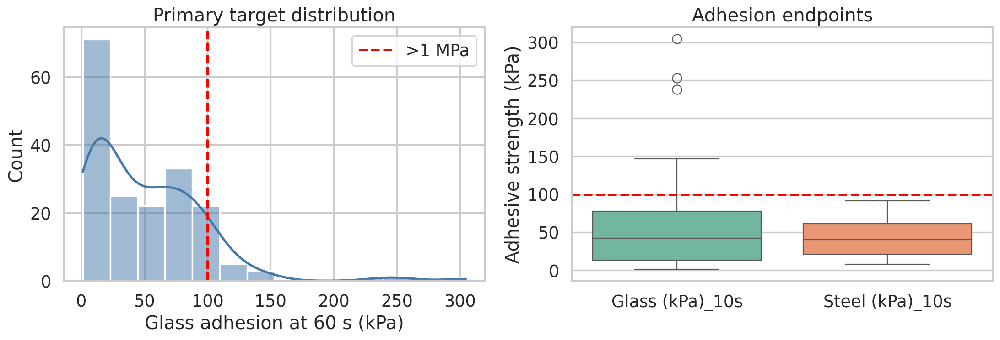
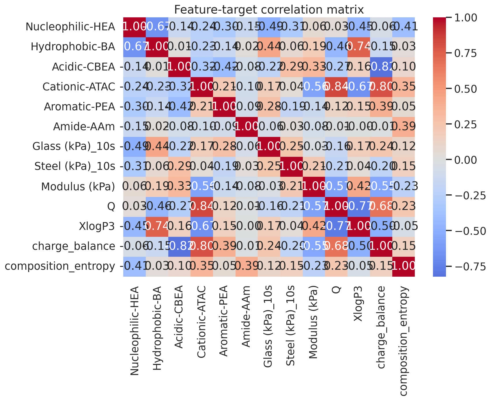
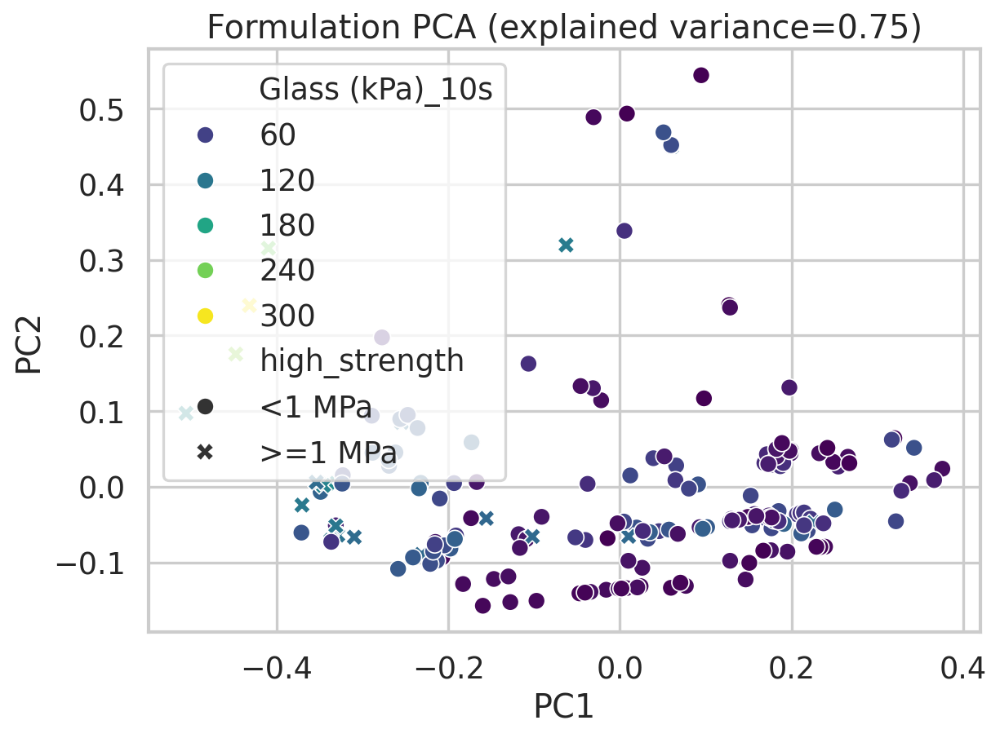
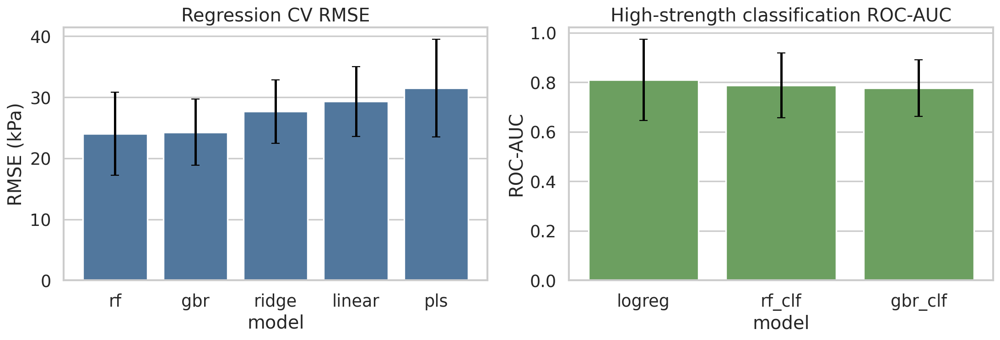
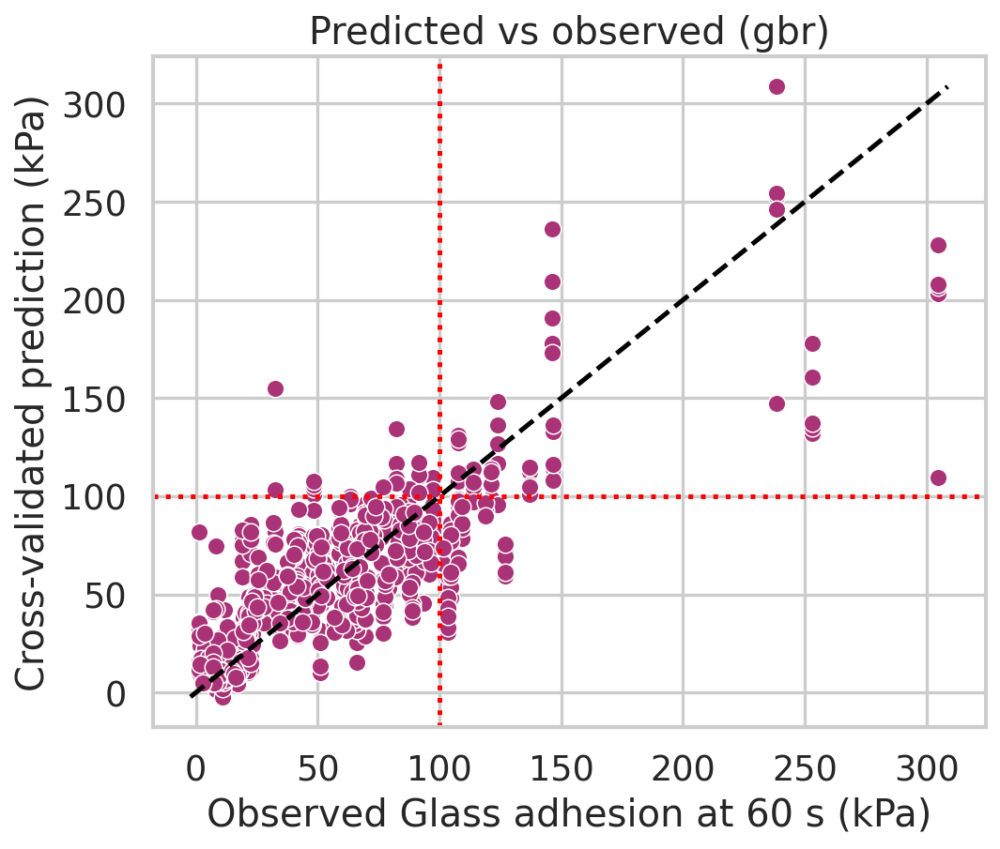
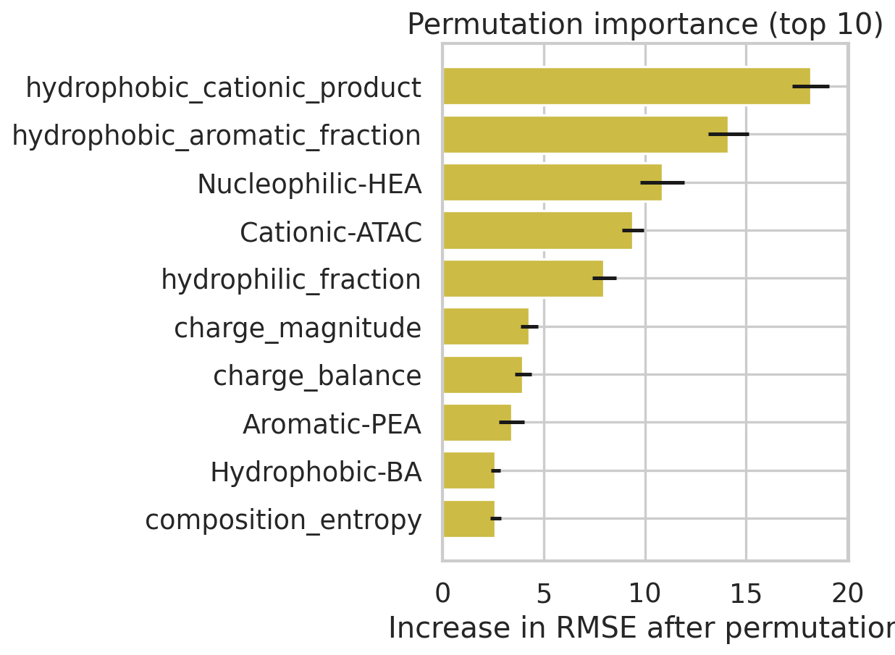
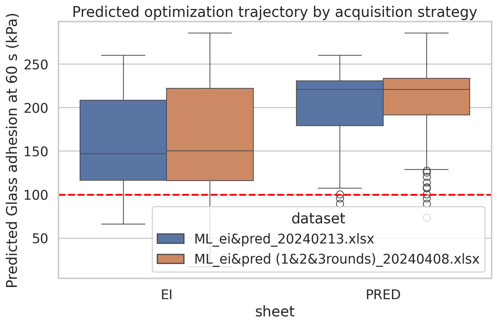

# Data-Driven Analysis of Protein-Inspired Hydrogel Compositions for Adhesive Strength

## Summary
This study analyzed whether protein-sequence-derived monomer composition features can explain and prioritize strong hydrogel adhesion in the provided bio-inspired hydrogel datasets. A reproducible pipeline was built to audit the Excel datasets, generate exploratory visualizations, train repeated-cross-validation machine-learning baselines, and score the optimization-round candidate datasets.

A critical data limitation emerged immediately: the verified 184-formulation training dataset contains no non-missing `Glass (kPa)_60s` or `Steel (kPa)_60s` values. Therefore, the original task target of **robust underwater adhesion >1 MPa at 60 s** could not be modeled directly from the available supervised data. The analysis was consequently reframed to the closest measured endpoint available at scale: **`Glass (kPa)_10s`**, with a proxy “high-strength” threshold of **100 kPa**. All conclusions below apply to this proxy endpoint only.

Within that available scope:
- Nonlinear regressors outperformed linear baselines for predicting `Glass (kPa)_10s`.
- The strongest regression baseline was a random forest regressor (**RMSE 24.03 ± 6.78 kPa, R² 0.69 ± 0.10**), closely followed by gradient boosting.
- For the proxy high-strength task (`Glass (kPa)_10s ≥ 100 kPa`), logistic regression achieved the best ROC-AUC among the tested classifiers (**0.81 ± 0.16**), while random forest gave slightly higher average precision.
- High-strength hydrogels were enriched for **higher hydrophobic and aromatic fractions** and **lower nucleophilic HEA fraction**.
- Optimization-round candidates were strongly enriched for high predicted and observed proxy adhesion, especially in the `PRED` sheets.

## 1. Problem framing
The intended research question is whether synthetic hydrogels can be de novo designed to reproduce sequence-derived composition statistics of natural adhesive proteins and thereby achieve strong underwater adhesion. The provided data represent each hydrogel as six monomer-composition features:

- `Nucleophilic-HEA`
- `Hydrophobic-BA`
- `Acidic-CBEA`
- `Cationic-ATAC`
- `Aromatic-PEA`
- `Amide-AAm`

These features resemble coarse-grained biochemical roles rather than exact sequences. This supports a statistical design framing: if certain composition balances are associated with higher adhesion, then optimization may be able to enrich those regimes.

Related-work review suggested three practical principles:
1. Treat composition as an interaction-pattern representation rather than exact sequence.
2. Use reproducible baseline models before more elaborate inverse-design claims.
3. Distinguish the original desired endpoint from the actually available measured endpoint.

## 2. Data and schema audit
### 2.1 Files used
- Primary supervised dataset: `data/184_verified_Original Data_ML_20230926.xlsx`
- Earlier batch datasets for schema comparison:
  - `data/Original Data_ML_20220829.xlsx`
  - `data/Original Data_ML_20221031.xlsx`
  - `data/Original Data_ML_20221129.xlsx`
- Optimization datasets:
  - `data/ML_ei&pred_20240213.xlsx`
  - `data/ML_ei&pred (1&2&3rounds)_20240408.xlsx`

### 2.2 Key schema findings
The verified dataset contains 184 formulations with six composition features and several mechanical/adhesion descriptors. However:
- `Glass (kPa)_10s` is fully populated for all 184 samples.
- `Glass (kPa)_60s` is entirely missing.
- `Steel (kPa)_10s` is present for only 28 samples.
- `Steel (kPa)_60s` is entirely missing.

This forced a proxy-task formulation.

### 2.3 Data quality checks
From `outputs/data_quality.json`:
- Samples: **184**
- Duplicate rows: **0**
- Duplicate compositions: **0**
- Feature-sum range: **0.9999998 to 1.0000002**
- Proxy high-strength count (`Glass (kPa)_10s ≥ 100 kPa`): **20 / 184 (10.9%)**

The feature sums confirm the monomer fractions are compositionally consistent.

## 3. Experimental plan
### Stage 1 — Data intake and schema audit
Success criteria:
- identify usable target(s)
- check missingness and duplicates
- save schema summaries

### Stage 2 — Exploratory data analysis
Success criteria:
- visualize target distribution and formulation space
- inspect correlations and possible separability of stronger adhesives

### Stage 3 — Baseline predictive modeling
Success criteria:
- repeated-CV regression and classification baselines
- uncertainty reported as mean ± standard deviation across repeats

### Stage 4 — Optimization-trajectory analysis
Success criteria:
- score optimization-round candidates using the trained proxy models
- assess enrichment for stronger formulations

### Stage 5 — Report writing and limitation reconciliation
Success criteria:
- clearly distinguish the original target from the proxy target
- document exact limitations and minimal next steps

## 4. Methods
### 4.1 Target definition
Because the intended `60 s` endpoints are unavailable, the primary supervised target was defined as:
- **Regression target**: `Glass (kPa)_10s`
- **Classification target**: `Glass (kPa)_10s ≥ 100 kPa`

The 100 kPa threshold is a practical proxy for the right tail of the observed distribution, not a substitute for the original >1 MPa requirement.

### 4.2 Features
The six original monomer-fraction features were used directly, together with engineered descriptors intended to capture interaction balance:
- hydrophilic fraction
- hydrophobic + aromatic fraction
- charge balance
- charge magnitude
- nucleophile × aromatic interaction term
- hydrophobic × cationic interaction term
- composition entropy
- maximum monomer fraction

### 4.3 Models
Regression baselines:
- Linear regression
- Ridge regression
- Partial least squares (PLS)
- Random forest regressor
- Gradient boosting regressor

Classification baselines:
- Logistic regression with class balancing
- Random forest classifier with class balancing
- Gradient boosting classifier

### 4.4 Validation protocol
- Regression: **5-fold CV × 5 repeats** (`RepeatedKFold`, seed 42)
- Classification: **5-fold stratified CV × 5 repeats** (`RepeatedStratifiedKFold`, seed 42)
- Reported values are mean ± SD across all folds and repeats.

### 4.5 Statistical testing
To compare compositions between proxy high-strength and lower-strength hydrogels, two-sided Mann–Whitney U tests were used for each monomer fraction. Benjamini–Hochberg FDR correction was applied across the six tests.

## 5. Exploratory data analysis
### 5.1 Target distribution
The training target is right-skewed with a minority of strong formulations.

Most hydrogels cluster well below the original 1 MPa goal. Even the strongest observed `Glass (kPa)_10s` values peak at about 305 kPa, indicating that the available supervised set does not cover the requested target regime.

### 5.2 Correlation structure

The correlation analysis indicates:
- Positive association of adhesion with hydrophobic/aromatic content.
- Negative association with high nucleophilic HEA fraction.
- Mechanical and physicochemical variables may also contribute, but they were not used as predictors in the main model because they are closer to downstream properties than formulation inputs.

### 5.3 Formulation-space projection

The PCA projection shows that stronger formulations occupy a sub-region of composition space rather than being uniformly distributed. This supports the design hypothesis that monomer composition balance contains useful signal for prioritization.

## 6. Predictive modeling results
### 6.1 Regression performance
Repeated-CV regression results (`outputs/model_metrics.csv`):

| Model | RMSE (kPa) | MAE (kPa) | R² |
|---|---:|---:|---:|
| Linear regression | 29.31 ± 5.70 | 22.28 ± 3.28 | 0.52 ± 0.16 |
| Ridge regression | 27.66 ± 5.18 | 21.76 ± 3.06 | 0.56 ± 0.16 |
| PLS | 31.48 ± 8.01 | 24.01 ± 3.88 | 0.45 ± 0.21 |
| Random forest | **24.03 ± 6.78** | **16.08 ± 2.67** | **0.69 ± 0.10** |
| Gradient boosting | 24.25 ± 5.42 | 16.90 ± 2.37 | 0.67 ± 0.12 |

The main result is that nonlinear tree-based models improve materially over linear baselines, suggesting meaningful interactions among the monomer fractions.

### 6.2 Predicted vs observed behavior

Cross-validated predictions from the best regression model show strong ranking ability with some underestimation at the upper tail. This is expected given the small number of high-adhesion samples.

### 6.3 Proxy high-strength classification
For `Glass (kPa)_10s ≥ 100 kPa`:

| Model | ROC-AUC | Average precision | Accuracy | Recall | Precision |
|---|---:|---:|---:|---:|---:|
| Logistic regression | **0.81 ± 0.16** | 0.62 ± 0.22 | 0.79 ± 0.06 | **0.74 ± 0.22** | 0.31 ± 0.08 |
| Random forest classifier | 0.79 ± 0.13 | **0.63 ± 0.19** | **0.91 ± 0.04** | 0.60 ± 0.18 | **0.65 ± 0.22** |
| Gradient boosting classifier | 0.78 ± 0.11 | 0.54 ± 0.19 | 0.89 ± 0.04 | 0.48 ± 0.24 | 0.52 ± 0.26 |

Interpretation:
- Logistic regression gives the best discrimination and recall, indicating the proxy high-strength class is at least partly linearly separable in engineered composition space.
- Random forest is more conservative and attains higher precision, which may be preferable for candidate triage.

## 7. Which features distinguish stronger hydrogels?
### 7.1 Group comparisons
From `outputs/feature_group_tests.csv`:

| Feature | High-strength mean | Low-strength mean | FDR-adjusted p |
|---|---:|---:|---:|
| Nucleophilic-HEA | 0.169 | 0.395 | 0.000002 |
| Hydrophobic-BA | 0.474 | 0.313 | 0.000063 |
| Aromatic-PEA | 0.115 | 0.036 | 0.001594 |
| Cationic-ATAC | 0.111 | 0.095 | 0.172 |
| Acidic-CBEA | 0.103 | 0.139 | 0.143 |
| Amide-AAm | 0.028 | 0.022 | 0.239 |

The strongest and most reliable shifts are:
- **lower Nucleophilic-HEA** in strong adhesives
- **higher Hydrophobic-BA** in strong adhesives
- **higher Aromatic-PEA** in strong adhesives

These directions are chemically plausible for stronger interfacial interactions.

### 7.2 Model-based importance

Permutation importance on the best regression model ranks the following among the most useful predictors:
- hydrophobic × cationic interaction term
- combined hydrophobic + aromatic fraction
- Nucleophilic-HEA
- Cationic-ATAC
- total hydrophilic fraction

This indicates that interaction balances matter more than any one monomer alone.

## 8. Optimization-round analysis
The optimization datasets were scored using the best regression and classification proxy models trained on the verified 184-formulation set.

### 8.1 Aggregate optimization summary
From `outputs/optimization_summary.csv`:

| Dataset | Sheet | Candidates | Mean predicted strength (kPa) | Max predicted strength (kPa) | Predicted high-strength rate | Observed `Glass (kPa)_max` mean | Observed `Glass (kPa)_max ≥ 100 kPa` rate |
|---|---|---:|---:|---:|---:|---:|---:|
| `ML_ei&pred_20240213.xlsx` | EI | 80 | 159.89 | 259.75 | 0.95 | 138.58 | 0.775 |
| `ML_ei&pred_20240213.xlsx` | PRED | 50 | 198.75 | 259.75 | 1.00 | 196.54 | 0.94 |
| `ML_ei&pred (1&2&3rounds)_20240408.xlsx` | EI | 119 | 161.56 | 285.36 | 0.91 | 143.22 | 0.748 |
| `ML_ei&pred (1&2&3rounds)_20240408.xlsx` | PRED | 86 | 202.29 | 285.36 | 1.00 | 193.48 | 0.942 |

The optimization datasets are strongly enriched for high-performing formulations relative to the original 184-formulation training set, where only 10.9% exceed 100 kPa. Both `PRED` sheets are especially enriched, with observed proxy high-strength rates around 94%.

### 8.2 Composition patterns among top-ranked candidates
Top scored candidates are consistently characterized by:
- low or zero nucleophilic HEA
- high hydrophobic BA
- moderate aromatic PEA
- modest cationic ATAC
- near-zero acidic CBEA in many of the strongest-ranked candidates

This is consistent with both the statistical tests and the learned feature importance profile.

## 9. Interpretation
### 9.1 What the current evidence supports
The available data support the following claims:
1. **Monomer composition strongly predicts short-time glass adhesion** in this hydrogel family.
2. **Hydrophobic/aromatic enrichment and reduced nucleophilic content** are associated with stronger measured adhesion.
3. Optimization rounds successfully moved candidate formulations into composition regimes enriched for stronger proxy adhesion.
4. Tree-based regressors improve over linear baselines, indicating non-additive effects among monomer roles.

### 9.2 What the current evidence does not support
The available data do **not** support a direct claim that the analyzed formulations achieve or can be predicted to achieve:
- **>1 MPa underwater adhesion**, or
- **60 s adhesion performance**, or
- **de novo validated design success** on the requested endpoint.

Those claims would require target-aligned labels that are not present in the verified supervised dataset.

## 10. Limitations
1. **Primary limitation: missing target-aligned labels.** The requested 60 s endpoint is absent from the verified dataset.
2. **Proxy threshold mismatch.** The 100 kPa threshold is data-driven and useful for ranking, but it is not equivalent to the requested >1 MPa target.
3. **Small positive class.** Only 20 of 184 training samples exceed 100 kPa, increasing uncertainty for classifier estimates.
4. **No wet-lab validation in this workspace.** Optimization candidates can only be ranked computationally.
5. **No explicit polymerization-drift features.** The analysis used formulation fractions and simple engineered interactions; real realized polymer sequences may differ from feed compositions.
6. **Potential endpoint/context mismatch.** `Glass (kPa)_10s` may not fully represent underwater adhesion mechanisms across substrate and timescale conditions.

## 11. Minimal next step to answer the original question
To directly evaluate the stated goal, the smallest necessary next step is:
1. recover or collect non-missing **`Glass (kPa)_60s` underwater adhesion** labels for the verified formulations or a comparable training cohort;
2. re-train the same baseline pipeline on that target;
3. evaluate whether optimization candidates cross the actual **>1 MPa** threshold;
4. experimentally validate top-ranked candidates from the target-aligned model.

The existing code is already structured so that, if the missing 60 s labels become available, the target column and threshold can be swapped with minimal modifications.

## 12. Reproducibility
### Code
- Main analysis script: `code/analyze_hydrogels.py`

### Key outputs
- `outputs/schema_summary.json`
- `outputs/data_overview.csv`
- `outputs/data_quality.json`
- `outputs/model_metrics.csv`
- `outputs/cv_predictions_regression.csv`
- `outputs/cv_predictions_classification.csv`
- `outputs/feature_group_tests.csv`
- `outputs/feature_importance.csv`
- `outputs/optimization_summary.csv`
- `outputs/top_optimization_candidates.csv`

### Figures
- `images/target_distribution.png`
- `images/feature_correlation_heatmap.png`
- `images/formulation_projection.png`
- `images/model_comparison.png`
- `images/predicted_vs_observed.png`
- `images/high_strength_feature_profile.png`
- `images/optimization_trajectory.png`

### Environment
- Python with: pandas, openpyxl, numpy, scikit-learn, matplotlib, seaborn, scipy, statsmodels
- Random seed: 42

## 13. Conclusion
The provided hydrogel datasets contain a useful and learnable statistical relationship between protein-inspired monomer compositions and measured adhesive strength, but only for a **proxy endpoint** (`Glass (kPa)_10s`). Within that scope, strong proxy adhesion is associated with hydrophobic/aromatic-rich, HEA-poor formulations, and optimization-round candidates are highly enriched for those favorable regimes.

The main scientific conclusion is therefore conditional: **the available data support composition-based prioritization of stronger adhesive hydrogels, but they do not directly validate the original claim of >1 MPa underwater adhesion at 60 s.** A target-aligned follow-up dataset is required for that claim.
