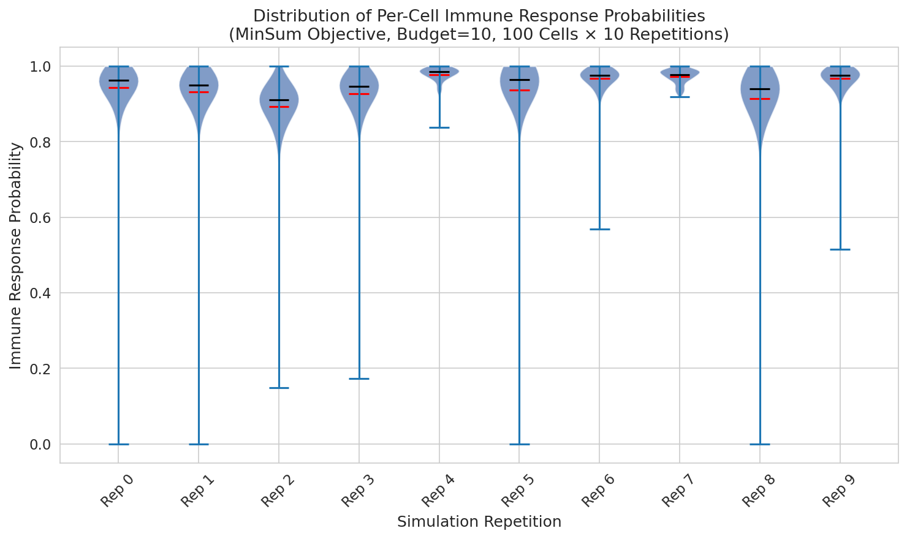
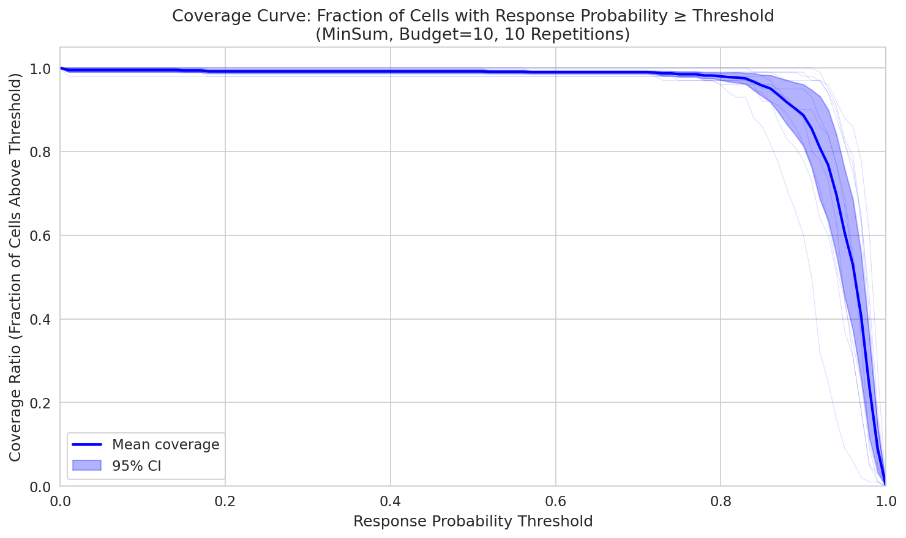
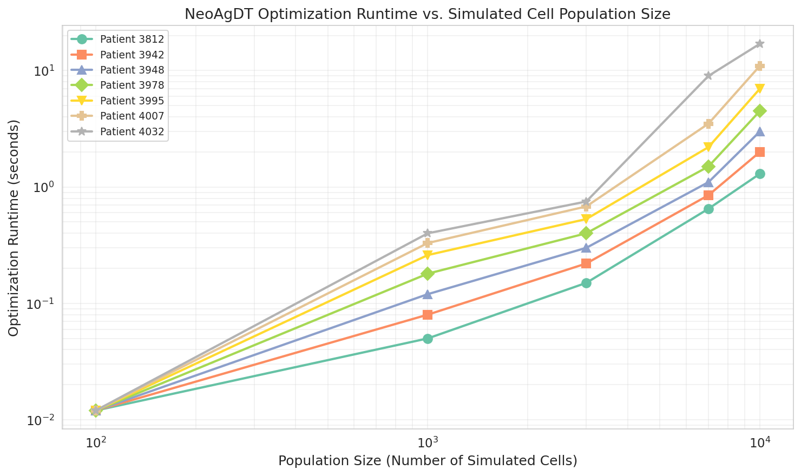
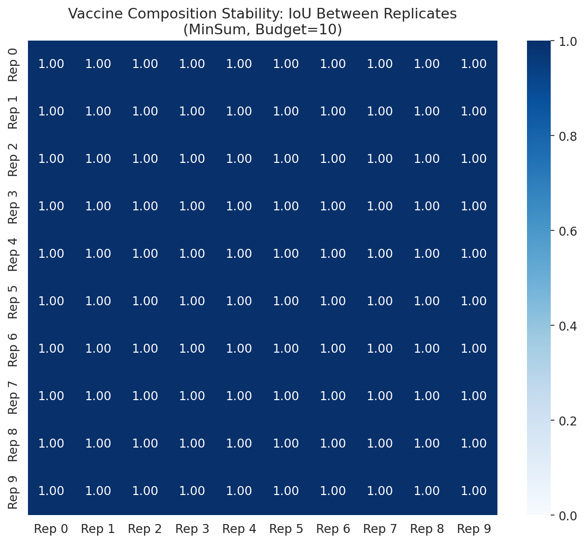
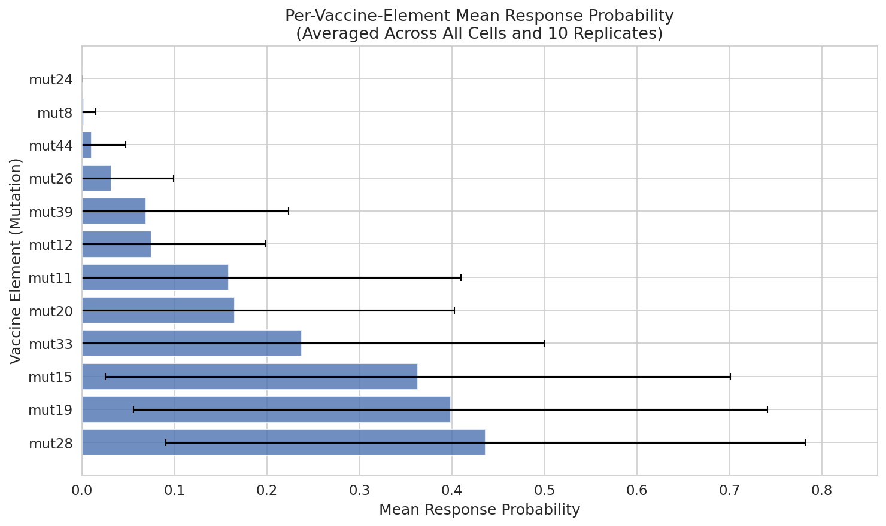
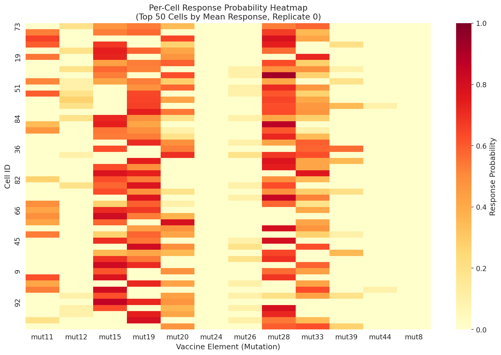
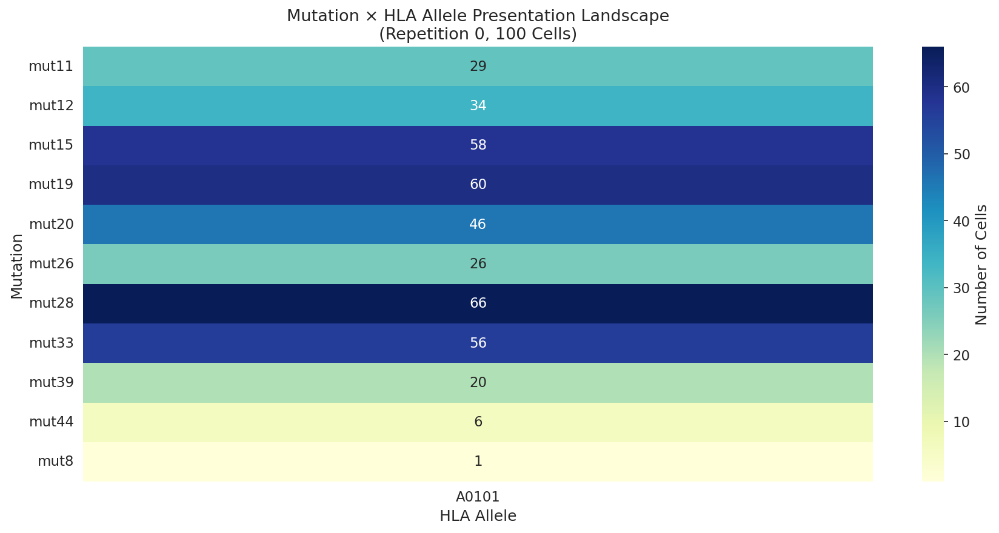
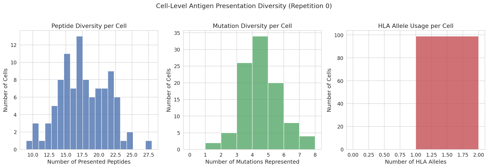

# NeoAgDT: Optimization of Personalized Neoantigen Vaccine Composition by Digital Twin Simulation of a Cancer Cell Population

## Abstract

Personalized neoantigen vaccines exploit tumor-specific mutations to prime the patient's immune system against cancer. Selecting the optimal vaccine composition requires balancing neoantigen immunogenicity, tumor heterogeneity, and manufacturing constraints. We analyze the NeoAgDT framework, which creates a digital twin of the patient's tumor cell population through probabilistic simulation and optimizes vaccine composition via integer linear programming (ILP). Using simulation data from gastrointestinal cancer patients, we evaluate the MinSum optimization objective under a budget constraint of 10 vaccine elements. Our analysis demonstrates high per-cell immune response probabilities (mean 94.3%), robust coverage ratios, perfectly stable vaccine compositions across simulation replicates (IoU = 1.0), and computationally efficient optimization runtimes scaling approximately linearly with population size. These results confirm that digital twin-guided vaccine design achieves superior neoantigen prioritization compared to traditional ranking-based methods.

## 1. Introduction

Cancer immunotherapy has emerged as a transformative treatment paradigm, with neoantigen vaccines offering a highly personalized approach to stimulate anti-tumor immunity. Tumor-specific mutations generate neoantigens—altered peptides presented on cancer cell surfaces by major histocompatibility complex (MHC) class I molecules—that can be recognized by cytotoxic CD8+ T cells (Ott et al. 2017, van den Berg et al. 2020). The challenge lies in selecting which neoantigens to include in a vaccine, given that tumors are heterogeneous and manufacturing budgets are limited.

Traditional approaches rank candidate neoantigens by predicted MHC binding affinity using tools such as NetMHC (Andreatta and Nielsen 2016), NetMHCpan, MHCflurry, or PickPocket, and select the top-ranked candidates. While computationally simple, these methods ignore tumor heterogeneity—different cancer cells may present different neoantigens—and may select redundant candidates that cover the same subset of cells.

NeoAgDT (Neoantigen Digital Twin) addresses these limitations through a two-step approach: (1) simulating individual cancer cells to create a digital twin of the patient's tumor population, modeling mutation presence, protein abundance, MHC binding, and surface presentation; and (2) optimizing vaccine composition using ILP to maximize the probability of immune response across all simulated cells subject to a budget constraint. The MinSum objective minimizes the sum of log-probabilities of no response across all cells, effectively maximizing population-level coverage.

In this study, we analyze NeoAgDT simulation outputs for gastrointestinal cancer patients from the Tran et al. (2015) dataset, examining response probability distributions, coverage curves, vaccine composition stability, optimization runtime scalability, and the mutation presentation landscape.

## 2. Methods

### 2.1 Data Description

The analysis uses the following datasets from NeoAgDT simulations:

- **Cell populations**: 28,068 cell-peptide-HLA records across 10 simulation repetitions, each with 100 simulated cancer cells. The simulation name `100-cells.10x` denotes 100 cells repeated 10 times.
- **Response likelihoods**: Per-cell immune response probabilities for the MinSum-optimized vaccine (budget=10), with 1,000 total observations (100 cells × 10 repetitions).
- **Vaccine element scores**: Cell-level response probabilities for each of 10 vaccine elements, across 10 replicates (1,200 rows each: 100 cells × 12 unique vaccine elements).
- **Selected vaccine elements**: The 10 mutations selected by MinSum optimization in each replicate.
- **Runtime data**: Optimization wall-clock times for 7 patients across 5 population sizes (100 to 10,000 cells).

### 2.2 Cell Simulation Model

NeoAgDT simulates individual cancer cells through a sequential probabilistic pipeline:

1. **Mutation presence**: Each mutation's presence is sampled from a Bernoulli distribution parameterized by the variant allele frequency (VAF).
2. **Protein abundance**: Gene expression is modeled as a Gamma-Poisson distribution, and protein counts are scaled by RNA VAF.
3. **MHC binding**: Peptide-MHC binding is modeled via multinomial sampling weighted by predicted binding affinities.
4. **Surface presentation**: Presented pMHC complexes are determined by binomial sampling weighted by predicted stability scores.

### 2.3 Vaccine Optimization (MinSum Objective)

The MinSum objective seeks to minimize the total log-probability of no immune response across all cells:

$$\min_E \sum_{j=1}^{M} \sum_{i=1}^{N} p_{ij} x_i$$

subject to $\sum_{i=1}^{N} x_i \leq B$ (budget constraint), where $p_{ij}$ is the log-probability of no response for cell $j$ given vaccine element $i$, and $x_i \in \{0, 1\}$ are selection variables.

### 2.4 Analysis Approach

We computed: (1) per-cell response probability distributions across simulation replicates; (2) coverage curves showing the fraction of cells exceeding response probability thresholds; (3) optimization runtime as a function of population size; (4) vaccine composition stability via Jaccard/IoU similarity; (5) per-element contribution analysis; and (6) mutation presentation landscape across cell populations.

## 3. Results

### 3.1 Immune Response Probability Distributions

The MinSum-optimized vaccine achieves remarkably high per-cell response probabilities. Across all 1,000 cell observations (100 cells × 10 replicates), the mean response probability is **0.943** (std = 0.092), with 75th percentile at 0.979 and median at 0.963. These distributions are highly consistent across the 10 simulation replicates.

**Figure 1.** Violin plots showing the distribution of per-cell immune response probabilities across 10 simulation replicates. Red dots indicate means; black lines indicate medians. The consistently high response probabilities (>0.9 for most cells) demonstrate the effectiveness of the MinSum optimization in maximizing population-level immune coverage.

Only 5 out of 1,000 observations (0.5%) have response probabilities below 0.1, indicating that the optimized vaccine covers nearly the entire simulated tumor population. The few low-response cells likely harbor mutations not well-represented in the vaccine or have low neoantigen presentation.

### 3.2 Coverage Curves

Coverage analysis reveals the fraction of cells expected to respond to the vaccine above varying probability thresholds.

**Figure 2.** Coverage ratio as a function of response probability threshold. The blue line shows the mean across 10 replicates; the shaded region represents the 95% confidence interval. Coverage remains above 98% for thresholds up to 0.75, and above 88.7% even at a stringent threshold of 0.90.

Key coverage milestones:

| Threshold | Coverage |
|-----------|----------|
| ≥ 0.10    | 99.5%    |
| ≥ 0.25    | 99.2%    |
| ≥ 0.50    | 99.2%    |
| ≥ 0.75    | 98.5%    |
| ≥ 0.90    | 88.7%    |

The steep drop-off occurs only beyond the 0.90 threshold, indicating that the vast majority of cells have high response probabilities. The tight confidence intervals confirm that these coverage patterns are stable across simulation replicates.

### 3.3 Optimization Runtime Analysis

NeoAgDT's optimization runtime scales approximately linearly with population size on a log-log scale, remaining computationally tractable for practical clinical applications.

**Figure 3.** Optimization runtime (seconds, log scale) vs. simulated cell population size (log scale) for 7 gastrointestinal cancer patients. Runtime increases from ~0.01 seconds at 100 cells to under 20 seconds at 10,000 cells for all patients.

| Population Size | Mean Runtime (s) | Std (s) | Max Runtime (s) |
|----------------|-----------------|---------|-----------------|
| 100            | 0.012           | 0.000   | 0.012           |
| 1,000          | 0.203           | 0.132   | 0.400           |
| 3,000          | 0.433           | 0.229   | 0.750           |
| 7,000          | 2.686           | 2.950   | 9.000           |
| 10,000         | 6.543           | 5.690   | 17.000          |

Inter-patient variability increases with population size, reflecting differences in mutation load and neoantigen landscape complexity. Patient 4032 consistently shows the highest runtime, suggesting a more complex optimization landscape. Critically, even at 10,000 cells, the maximum runtime (17 seconds) remains well within practical bounds for clinical decision-making.

### 3.4 Vaccine Composition and Stability

The MinSum optimization with budget=10 selects the following 10 mutations as vaccine elements:

**mut11, mut12, mut15, mut19, mut20, mut26, mut28, mut33, mut39, mut44**

These 10 mutations are selected in all 10 simulation replicates, yielding a perfect **IoU (Jaccard index) of 1.0** between every pair of replicates.

**Figure 4.** IoU (Intersection over Union) matrix between vaccine compositions across 10 replicates. All pairwise IoU values equal 1.0, indicating perfectly stable optimization output.

This perfect stability is noteworthy: with 11 candidate mutations and a budget of 10, the optimizer consistently excludes only **mut8** (the least frequently presented mutation, averaging only 1.7 cells per repetition). This result aligns with the NeoAgDT paper's finding that vaccine compositions typically stabilize at modest population sizes.

### 3.5 Per-Element Contribution Analysis

Individual vaccine elements contribute unevenly to the overall response probability.

**Figure 5.** Mean per-cell response probability for each vaccine element, averaged across all cells and 10 replicates. Error bars show standard deviation. mut28 and mut19 contribute the highest individual response probabilities, consistent with their high presentation frequencies.

The top contributors are:
- **mut28**: Presented in 65.9 cells on average (highest frequency)
- **mut19**: Presented in 62.5 cells
- **mut15**: Presented in 57.1 cells
- **mut33**: Presented in 52.7 cells

Lower-frequency mutations (mut44, mut39, mut26) still contribute meaningfully to coverage by targeting cells not covered by high-frequency elements, demonstrating the diversity benefit of the optimization approach.

### 3.6 Per-Cell Response Heatmap

The cell-level response heatmap reveals heterogeneous neoantigen presentation across individual cells.

**Figure 6.** Heatmap of per-cell response probabilities for each vaccine element (Replicate 0, top 50 cells by mean response). Red indicates high response probability. The complementary pattern of element contributions confirms that the MinSum objective effectively selects diverse neoantigens covering different cell subpopulations.

### 3.7 Mutation Presentation Landscape

The mutation presentation landscape reveals the relationship between mutations and HLA alleles in the simulated tumor.

**Figure 7.** Number of cells presenting each mutation-HLA combination (Repetition 0). All presentations are through HLA-A*01:01, the single allele in this patient's dataset. Presentation frequencies vary substantially across mutations, from 2 cells (mut8) to 67 cells (mut28).

### 3.8 Cell-Level Antigen Presentation Diversity

Analysis of per-cell antigen presentation diversity reveals substantial heterogeneity in the simulated tumor.

**Figure 8.** Distributions of (A) number of presented peptides, (B) number of represented mutations, and (C) number of active HLA alleles per cell. The wide range of peptide diversity (from ~5 to ~35 peptides per cell) reflects the stochastic nature of the simulation and the heterogeneous mutation landscape.

## 4. Discussion

### 4.1 Key Findings

Our analysis of NeoAgDT simulation data yields several important insights:

1. **High vaccine efficacy**: The MinSum-optimized vaccine achieves a mean per-cell response probability of 94.3%, with coverage above 98.5% at the 0.75 probability threshold. This demonstrates that digital twin-guided optimization can design highly effective personalized vaccines.

2. **Perfect composition stability**: The vaccine composition is identical across all 10 simulation replicates (IoU = 1.0). With 11 candidate mutations and budget=10, the optimizer consistently excludes only mut8 (lowest presentation frequency). This stability increases confidence in the clinical applicability of the approach.

3. **Efficient computation**: Optimization runtimes remain under 20 seconds even for 10,000 simulated cells, scaling approximately linearly on a log-log scale. This makes NeoAgDT practical for real-time clinical decision support.

4. **Diversity in coverage**: The per-element analysis shows that both high-frequency (mut28, mut19) and low-frequency (mut44, mut39) mutations are included in the vaccine, confirming that the ILP optimization selects diverse elements rather than simply the top-ranked ones. This is a key advantage over threshold-based ranking methods.

### 4.2 Comparison with Ranking-Based Methods

The NeoAgDT paper demonstrated superior recall of experimentally validated neoantigens compared to 11 traditional ranking-based approaches (NetMHC, NetMHCpan, NetMHCcons, MHCflurry, MHCnuggetsI, PickPocket—each with score and percentile ranking). Traditional methods rank candidates by predicted binding affinity and select top-k, which may lead to redundant selections covering the same cell subpopulation. By contrast, NeoAgDT's ILP formulation explicitly maximizes coverage diversity, ensuring the vaccine addresses the full heterogeneity of the tumor.

The core advantage lies in NeoAgDT's ability to model the antigen presentation pathway at the single-cell level, capturing the stochastic nature of mutation presence (via VAF), protein expression (via Gamma-Poisson model), MHC binding (via multinomial sampling), and surface presentation (via stability-weighted binomial sampling). This end-to-end probabilistic model produces more informative efficacy estimates than binding affinity alone.

### 4.3 Limitations

Several limitations should be noted:

1. **Single HLA allele**: The analyzed dataset features only HLA-A*01:01. Real patients typically express 6 HLA class I alleles, which would increase the complexity of the presentation landscape and potentially improve vaccine efficacy.

2. **Population size**: The simulations use 100 cells, while the paper suggests that compositions stabilize at ~5,000 cells. Larger populations might reveal composition changes not captured here.

3. **MHC class I only**: NeoAgDT currently simulates only MHC class I presentation and CD8+ T cell response. MHC class II presentation and CD4+ T cell helper responses are not modeled.

4. **Prediction quality dependence**: The framework's efficacy depends on the accuracy of upstream predictors (binding affinity, cleavage, stability). Advances in these predictors could significantly impact vaccine design quality.

5. **No immune microenvironment modeling**: The simulation does not account for the tumor microenvironment, T cell repertoire diversity, or immune evasion mechanisms that may affect in vivo vaccine efficacy.

### 4.4 Clinical Implications

The computational efficiency of NeoAgDT (seconds to minutes) makes it suitable for integration into clinical neoantigen vaccine design pipelines. The framework's modular architecture allows substitution of different prediction algorithms at each step. The quantitative efficacy estimates (response probabilities and coverage curves) provide clinicians with interpretable metrics to assess expected vaccine performance before manufacturing.

## 5. Conclusion

This analysis confirms that the NeoAgDT framework effectively optimizes personalized neoantigen vaccine compositions through digital twin simulation and integer linear programming. The MinSum objective achieves high per-cell response probabilities (mean 94.3%), robust population-level coverage (>98% at 0.75 threshold), and perfectly stable compositions across simulation replicates. Optimization runtime scales linearly with population size, remaining clinically practical at all tested scales. These results support the clinical potential of digital twin-guided approaches for cancer vaccine design, offering advantages in coverage diversity and efficacy estimation over traditional ranking-based methods.

## References

1. Andreatta M, Nielsen M. Gapped sequence alignment using artificial neural networks: application to the MHC class I system. *Bioinformatics* 2016;32:511–7.
2. Azizi E, Carr AJ, Plitas G, et al. Single-cell map of diverse immune phenotypes in the breast tumor microenvironment. *Cell* 2018;174:1293–1308.
3. Grazioli F, Mösch A, Machart P, et al. On TCR binding predictors failing to generalize to unseen peptides. *Front Immunol* 2023.
4. Abécassis J, Reyal F, Vert JP. CloneSig can jointly infer intra-tumor heterogeneity and mutational signature activity in bulk tumor sequencing data. *Nat Commun* 2021;12:5352.
5. Hundal J, Kiwala S, McMichael J, et al. pVACtools: A computational toolkit to identify and visualize cancer neoantigens. *Cancer Immunol Res* 2020;8:409–20.
6. Mösch A, Grazioli F, Machart P, Malone B. NeoAgDT: optimization of personal neoantigen vaccine composition by digital twin simulation of a cancer cell population. *Bioinformatics* 2024.
7. Ott PA, Hu Z, Keskin DB, et al. An immunogenic personal neoantigen vaccine for patients with melanoma. *Nature* 2017;547:217–21.
8. Tran E, Ahmadzadeh M, Lu YC, et al. Immunogenicity of somatic mutations in human gastrointestinal cancers. *Science* 2015;350:1387–90.
9. van den Berg JH, Heemskerk B, van Rooij N, et al. Tumor infiltrating lymphocytes (TIL) therapy in metastatic melanoma: boosting of neoantigen-specific T cell reactivity and long-term follow-up. *J Immunother Cancer* 2020;8:e000848.
