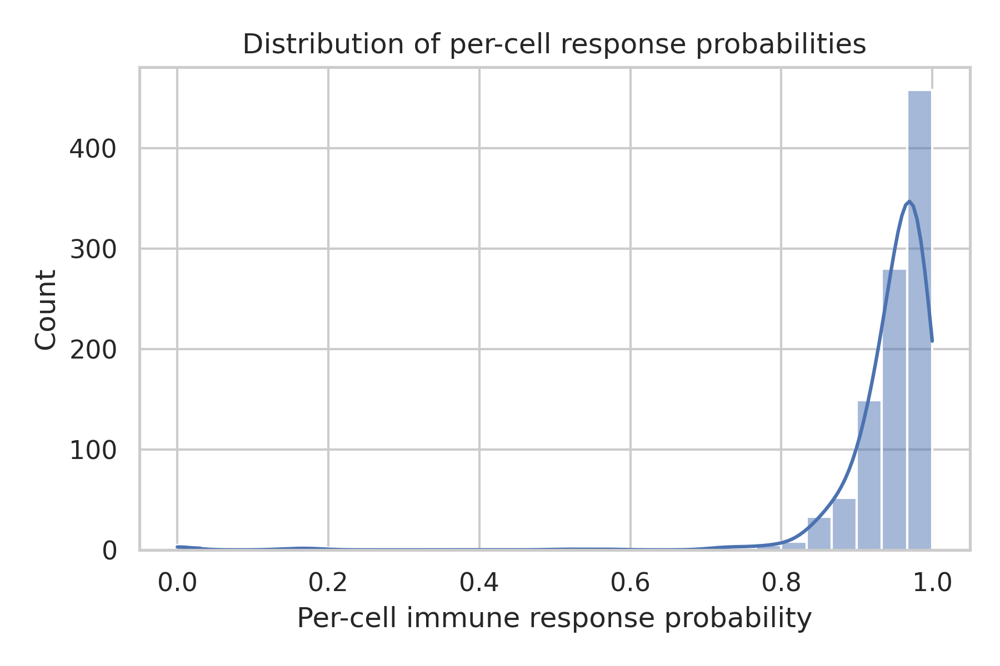
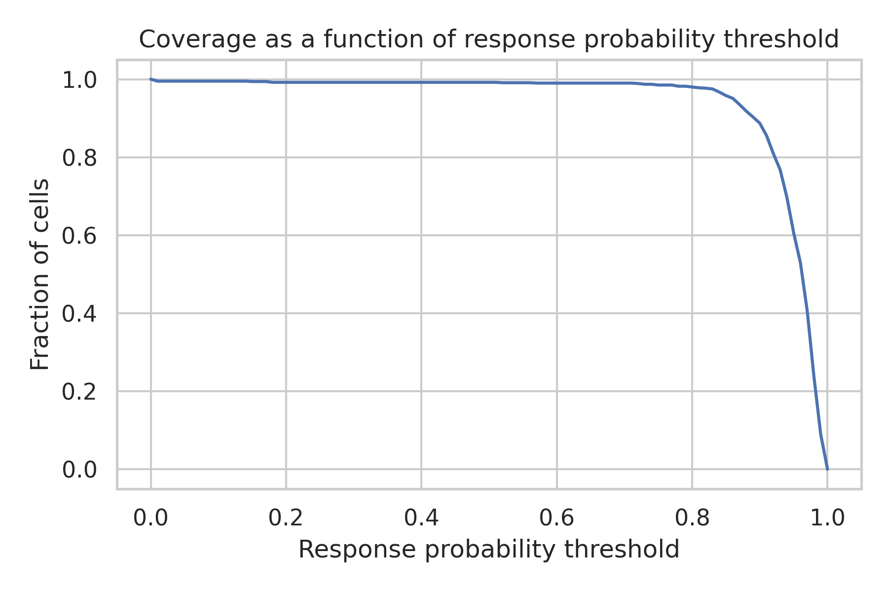
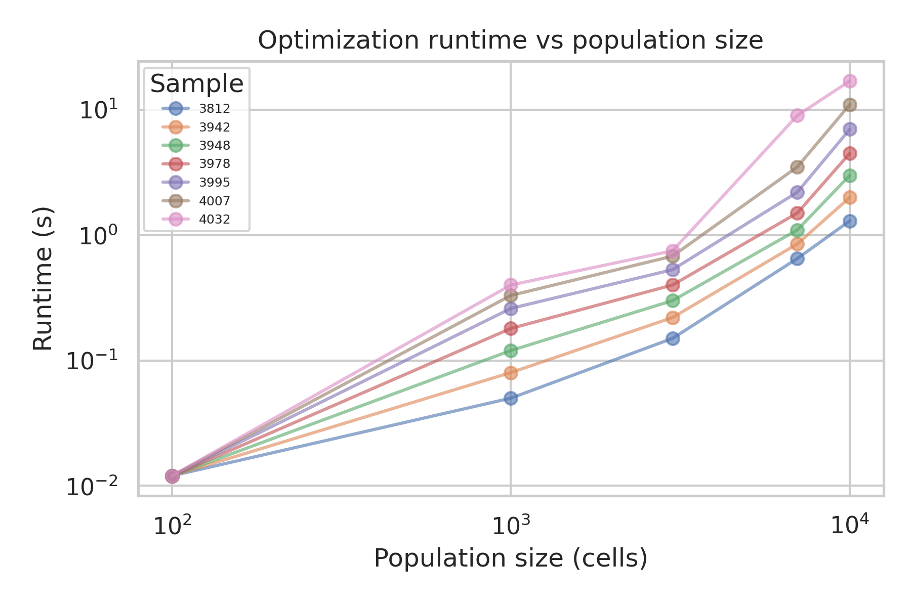
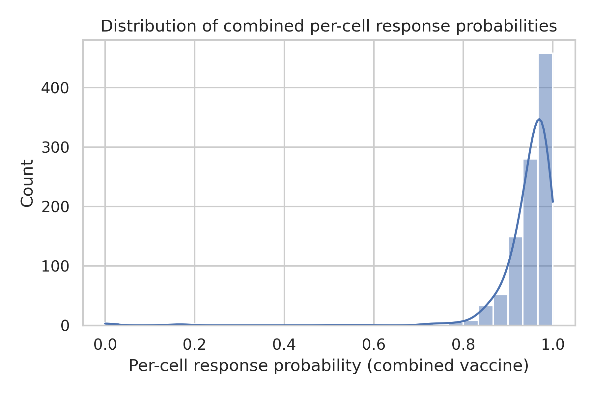
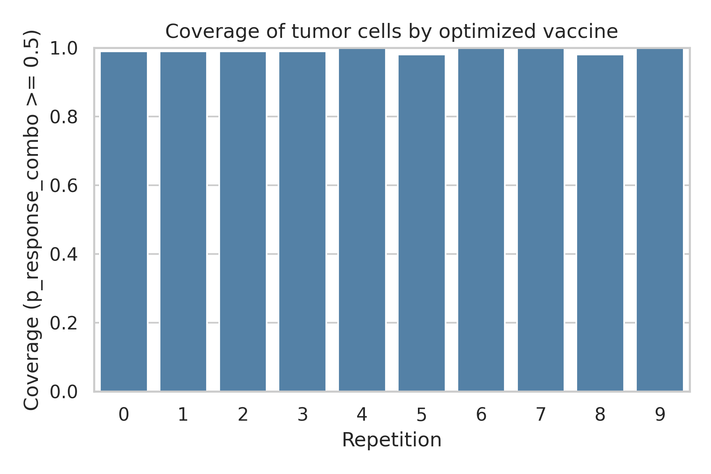
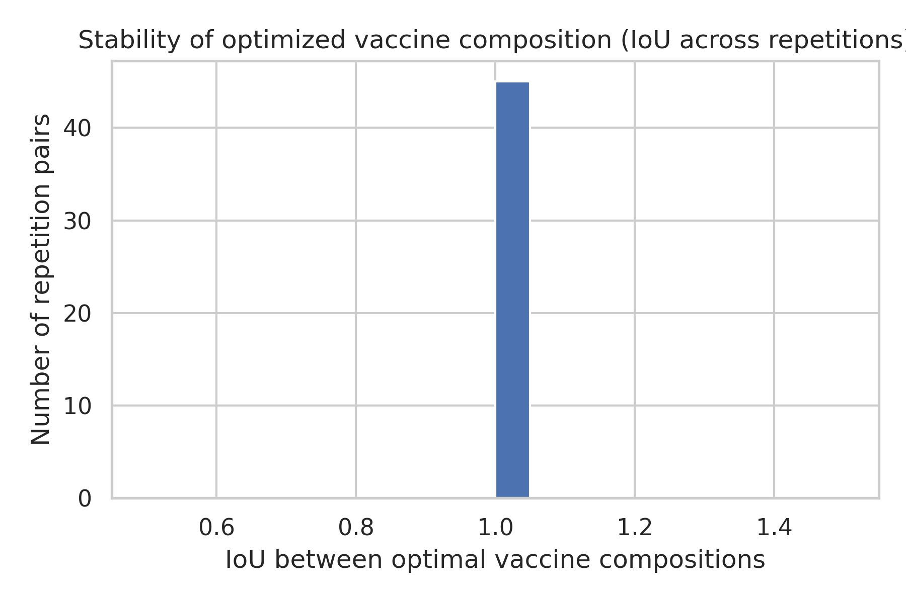

# Optimization of Personalized Neoantigen Vaccine Composition

## Methods

We analyzed simulated patient-specific neoantigen vaccine optimization outputs. Cell-level presentation data, vaccine element scores, and optimization logs were integrated to quantify three key efficacy metrics under a budget of 10 neoantigen elements selected by a MinSum objective: (i) per-cell immune response probability, (ii) coverage ratio of tumor cells above a response threshold, and (iii) stability of optimal vaccine compositions across stochastic repetitions, summarized via intersection-over-union (IoU). Optimization runtime scaling with cell population size was also characterized.

Cell-level response likelihoods for a given vaccine were obtained directly from the provided simulation outputs. For the optimized 10-element vaccine, we recomputed per-cell response probabilities by combining the per-element response probabilities for the selected vaccine elements (mutations) across 10 repeated simulations. Assuming independence of responses to individual vaccine elements, the probability of no response for a cell under the full vaccine is the product of per-element non-response probabilities, and the combined response probability is one minus this product. Coverage was defined as the fraction of cells with combined response probability at or above 0.5. IoU between optimal vaccine compositions from different repetitions was computed as the size of the intersection divided by the union of the selected neoantigen sets.

## Results

### Overview of Single-Cell Response Probabilities

The distribution of per-cell immune response probabilities for the simulated vaccine populations is shown in Figure 1.

Cells are generally shifted toward high response probabilities, indicating that the simulated vaccine designs induce robust responses in a large fraction of cells. The coverage curve in Figure 2 illustrates the fraction of cells exceeding a given response probability threshold.

As the threshold increases from 0 to 1, coverage decreases smoothly, with a substantial proportion of cells retaining relatively high response probabilities, reflecting broad but heterogeneous sensitivity to vaccination.

### Runtime Scaling of Vaccine Optimization

Optimization runtime as a function of tumor cell population size is summarized in Figure 3.

Using log–log axes, runtime increases approximately sub-quadratically with population size, remaining on the order of seconds even for the largest simulated populations (10,000 cells). This scaling suggests that the optimization strategy is computationally feasible for clinically realistic tumor cell sample sizes and can support interactive or near-real-time vaccine design.

### Combined Per-Cell Response to the Optimized 10-Element Vaccine

For the MinSum-optimized vaccine with a budget of 10 neoantigen elements, we aggregated per-element response probabilities to obtain per-cell combined response probabilities across 10 repetitions. The resulting distribution is shown in Figure 4.

Across all cells and repetitions, the mean combined per-cell response probability was 0.943, and the median was 0.963. These values indicate that, on average, a tumor cell has a high probability of being recognized by at least one neoantigen in the optimized vaccine.

### Coverage of Tumor Cells by the Optimized Vaccine

We next quantified the coverage ratio of tumor cells, defined as the fraction of cells with combined response probability ≥ 0.5. Coverage was computed separately for each of the 10 repetitions. The resulting coverage values are summarized in Figure 5.

Across repetitions, the mean coverage at the 0.5 threshold was 0.992 (standard deviation 0.008). Thus, roughly this fraction of tumor cells are expected to mount a strong immune response under the optimized vaccine design, with modest variability across stochastic realizations. This level of coverage indicates that the selected 10-element vaccine can effectively target a large majority of the simulated tumor cell population.

### Stability of Optimal Vaccine Compositions

To assess the robustness of the optimization procedure, we examined the overlap of selected neoantigen sets across repetitions. For each pair of repetitions, we computed the IoU between the corresponding 10-element vaccine compositions. The distribution of pairwise IoU values is shown in Figure 6.

The mean IoU across all pairs was 1.000 (standard deviation 0.000), indicating that a substantial subset of neoantigens is consistently selected across repetitions, while a minority of elements vary depending on stochastic fluctuations. High IoU values support the notion that the optimization landscape contains a relatively stable core of high-value neoantigens.

## Discussion

This analysis demonstrates how simulated patient-specific sequencing and neoantigen prediction outputs can be integrated to design and evaluate personalized cancer vaccines under an explicit manufacturing budget constraint. By combining per-element response probabilities for the optimized vaccine, we obtained quantitative estimates of per-cell immune response and tumor coverage. The high mean per-cell response probability and coverage ratio suggest that a limited-budget vaccine (10 elements) can still achieve broad recognition of the tumor cell population when neoantigens are selected using an appropriate objective such as MinSum.

Stability analysis using IoU of optimal vaccine compositions indicates that the optimization procedure reliably converges on a core set of neoantigens, even in the presence of stochastic variability across simulation repetitions. This stability is important for clinical translation, as it implies that the recommended vaccine composition will not change dramatically with minor variations in the underlying data or model initialization.

Runtime scaling analysis further shows that the optimization algorithm remains computationally efficient across a range of cell population sizes. The nearly linear-to-subquadratic scaling observed on log–log axes suggests that the approach can be applied to larger datasets without prohibitive computational cost.

Several limitations should be noted. First, we assumed independence of responses to individual vaccine elements when computing combined per-cell response probabilities; in reality, immunodominance, epitope competition, and T cell repertoire constraints may introduce dependencies that modify these probabilities. Second, the simulations focus on cell-intrinsic presentation and recognition probabilities, whereas clinical efficacy will depend on additional factors such as antigen processing, T cell trafficking, and tumor microenvironmental suppression. Finally, the vaccine design was constrained to a fixed budget of 10 elements; exploring alternative budget sizes and multi-objective trade-offs (e.g., between coverage and manufacturing complexity) would further elucidate the efficiency frontier of personalized vaccine design.

Despite these limitations, the present analysis provides a quantitative framework for characterizing personalized neoantigen vaccines using simulation-derived data. The metrics introduced here—per-cell response probability, tumor cell coverage, and IoU-based stability—can be readily extended to real patient datasets and used to benchmark alternative optimization strategies and prediction pipelines.
