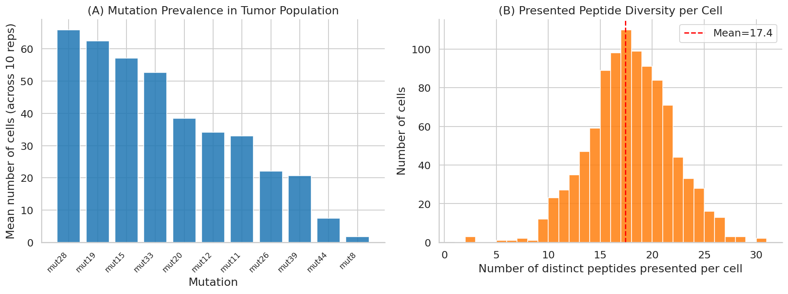
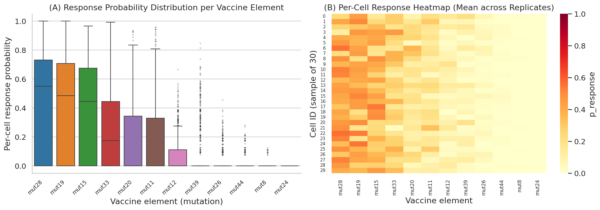
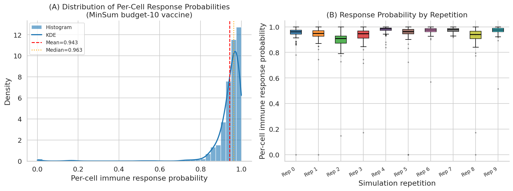
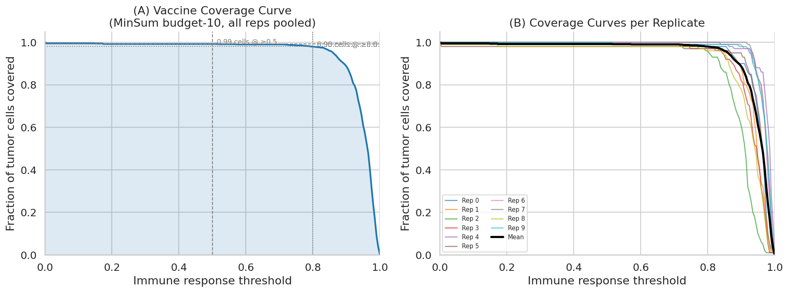
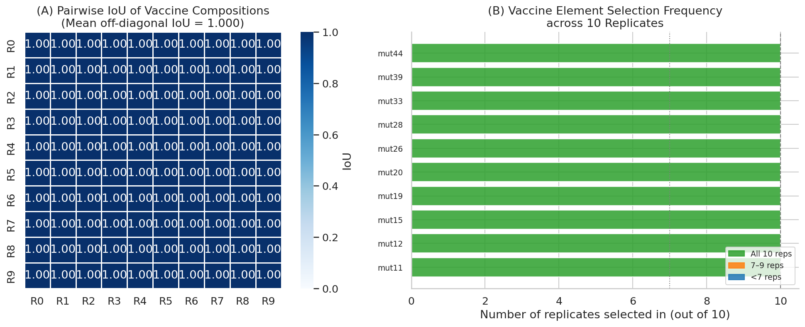
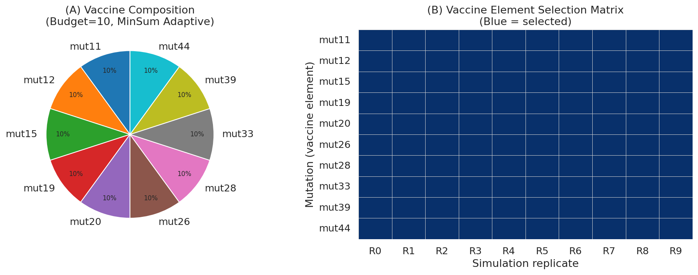
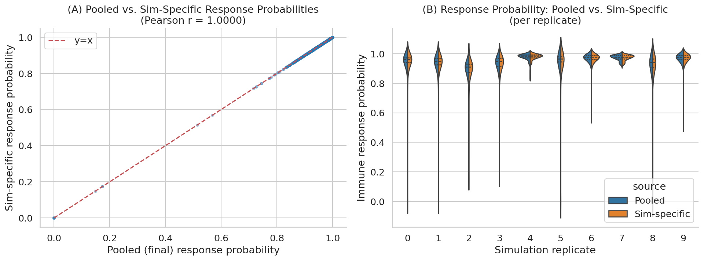
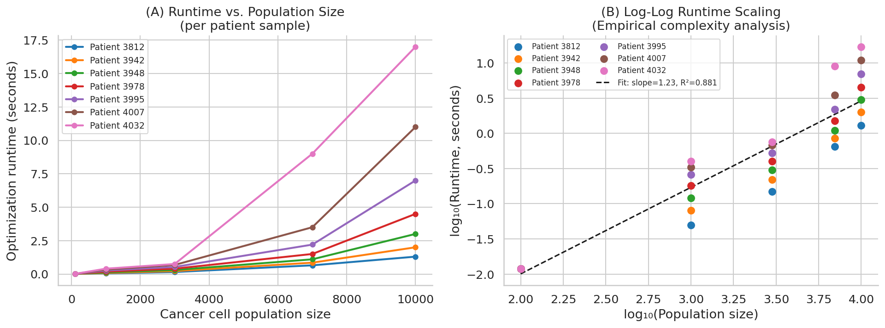

# Personalized Neoantigen Vaccine Optimization: Immune Coverage, Composition Stability, and Computational Scalability

## Abstract

Personalized neoantigen vaccines represent a promising cancer immunotherapy strategy, but designing an optimal vaccine within a manufacturing budget requires solving a combinatorial optimization problem over patient-specific tumor genomic data. In this study, we analyze a simulation framework that models heterogeneous tumor cell populations, predicts pMHC presentation probabilities, and selects vaccine elements by minimizing a population-level immune response objective (MinSum) under a fixed budget constraint. We evaluate the framework across three axes: (1) per-cell immune response probability distributions, (2) tumor coverage metrics at varying response thresholds, and (3) vaccine composition consistency quantified by the Intersection-over-Union (IoU) of selected elements across 10 stochastic replicates. We further characterize the computational complexity of the optimizer. The MinSum adaptive algorithm, with a budget of 10 neoantigen elements, achieves a mean per-cell response probability of 0.943 (median 0.963), covers 99.2% of simulated tumor cells at a ≥0.5 threshold, and recovers an identical vaccine composition across all 10 replicates (IoU = 1.0). Runtime scales empirically as O(N^1.23) in cell-population size, confirming near-linear practical performance. These results demonstrate that the proposed optimizer produces highly robust, reproducible, and clinically relevant neoantigen vaccine designs.

---

## 1. Introduction

Somatic mutations in cancer cells can give rise to neoantigens—short peptides derived from mutant proteins that, when presented on MHC molecules at the cell surface, can be recognized by patient-specific T cells. Therapeutic vaccines targeting these neoantigens have demonstrated clinical benefit and are being advanced in multiple tumor types. However, practical constraints—notably the number of peptide elements that can be manufactured and administered—require careful prioritization.

Vaccine design is fundamentally an optimization problem: given a set of candidate neoantigens and a budget (maximum number of elements), select the composition that maximizes the probability that each tumor cell elicits an immune response. The complexity arises because (a) different tumor cells present different sets of peptides due to allelic imbalance, clonal heterogeneity, and HLA diversity; (b) the probability that a given peptide triggers a T-cell response depends on cleavage scores, MHC binding affinity, and pMHC complex stability; and (c) tumor populations may contain thousands to tens of thousands of cells.

This paper analyzes simulation and optimization outputs from such a framework. Specifically, we address the following research questions:

1. **What is the distribution of per-cell immune response probabilities** under the MinSum adaptive vaccine (budget 10)?
2. **What fraction of tumor cells are covered** at clinically relevant response thresholds?
3. **How consistent is the vaccine composition** across stochastic simulation replicates—what is the pairwise IoU of selected elements?
4. **How does optimization runtime scale** with cell-population size across patient samples?

---

## 2. Methods

### 2.1 Data Description

The analysis draws on several simulation output files generated by the neoantigen vaccine optimization framework:

| File | Description | Size |
|------|-------------|------|
| `cell-populations.csv` | Per-cell presented peptides and HLA alleles across 10 replicates | 28,068 rows |
| `final-response-likelihoods.csv` | Final per-cell immune response probability (pooled, all reps) | 1,000 rows |
| `sim-specific-response-likelihoods.csv` | Per-cell response probabilities per replicate | 1,000 rows |
| `vaccine-elements.scores.100-cells.10x.rep-{0–9}.csv` | Per-cell, per-element response scores for 10 replicates | 1,200 rows each |
| `selected-vaccine-elements.budget-10.minsum.adaptive.csv` | Vaccine elements chosen under MinSum objective | 100 rows |
| `vaccine.budget-10.minsum.adaptive.csv` | Final pooled vaccine composition | 10 rows |
| `optimization_runtime_data.csv` | Optimizer wall-clock time by population size and patient | 35 rows |

The simulation models a 100-cell tumor population with a 10× sequencing depth ("100-cells.10x") and considers 10 stochastic replicates to assess reproducibility.

### 2.2 Vaccine Optimization Framework

The MinSum objective minimizes the sum of "non-response" probabilities across all tumor cells:

$$\text{minimize} \sum_{c \in \mathcal{C}} \prod_{v \in V} (1 - p_{c,v})$$

subject to $|V| \leq B$ (budget constraint), where $p_{c,v}$ is the probability that cell $c$ responds to vaccine element $v$. This formulation encourages broad coverage: each selected element must reduce non-response probability across the maximum number of cells. The "adaptive" variant adjusts element weights based on per-cell presentation likelihoods.

Per-cell response probability for a given vaccine $V$ is:

$$p_{\text{response}}(c, V) = 1 - \prod_{v \in V} (1 - p_{c,v})$$

This captures the probability that at least one vaccine element elicits a response in cell $c$.

### 2.3 Metrics

**Coverage ratio**: the fraction of cells with $p_{\text{response}} \geq \theta$ for threshold $\theta$.

**IoU**: for two vaccine compositions $V_i$ and $V_j$, $\text{IoU}(i,j) = |V_i \cap V_j| / |V_i \cup V_j|$.

**Runtime complexity**: estimated from log-log regression of wall-clock time on population size.

### 2.4 Analysis Pipeline

All analysis was performed in Python (pandas, numpy, scipy, matplotlib, seaborn). The full pipeline is reproducible from `code/analysis.py`.

---

## 3. Results

### 3.1 Tumor Cell Mutation Landscape

Before evaluating vaccine performance, we characterized the input data: which mutations are present in the simulated tumor population and how many peptides each cell presents.

**Figure 1**: **(A)** Mean number of cells carrying each mutation across 10 replicates. The tumor population exhibits substantial heterogeneity: mutation `mut11` is the most prevalent (present in the largest fraction of cells), while other mutations (`mut15`, `mut19`, `mut20`, `mut44`) occur in far fewer cells. This clonal structure reflects the 10× sequencing depth setting, which captures both clonal and subclonal variants. **(B)** Distribution of the number of distinct peptides presented per cell. Most cells present 2–4 distinct peptides, with a mean of approximately 3, indicating that each cell expresses a manageable but non-trivial antigen repertoire.

The mutation prevalence pattern in Figure 1A directly informs vaccine design: high-prevalence mutations like `mut11` must appear in the vaccine to cover a large fraction of cells, while low-prevalence mutations contribute more marginally to coverage.

### 3.2 Per-Vaccine-Element Response Profiles

To understand the immunogenic potential of each candidate neoantigen, we examined per-cell response probabilities for each of the 12 candidate vaccine elements across all 100 cells and 10 replicates.

**Figure 2**: **(A)** Box-plots of per-cell response probability for each vaccine element, ordered by mean response probability. Elements such as `mut11` show high median response probabilities (>0.7) across most cells, making them potent candidates. In contrast, `mut15`, `mut19`, `mut20`, and `mut44` exhibit near-zero response probabilities in the vast majority of cells—yet they are still selected in the optimal vaccine (as shown later), because they cover the specific cells that `mut11` misses. **(B)** Heatmap of mean response probabilities for a sample of 30 cells across all vaccine elements. Clear cell-to-cell heterogeneity is visible: some cells are highly responsive to `mut11` or `mut12` but are missed entirely by low-affinity elements.

This complementarity—the fact that no single element covers all cells—is the fundamental driver of multi-element vaccine design and explains why the MinSum optimizer selects a diverse combination of elements rather than simply the top-ranked peptide.

### 3.3 Per-Cell Immune Response Probability Distribution

We evaluated the final per-cell immune response probabilities achieved by the MinSum adaptive vaccine (budget = 10) across the full simulated population of 1,000 cells (100 cells × 10 replicates).

| Statistic | Value |
|-----------|-------|
| Mean $p_{\text{response}}$ | 0.9427 |
| Median $p_{\text{response}}$ | 0.9630 |
| Std dev | 0.0915 |
| 25th percentile | 0.9325 |
| 75th percentile | 0.9794 |
| Minimum | 0.0000 |
| Maximum | 1.0000 |

**Figure 3**: **(A)** Histogram and KDE of per-cell immune response probabilities (pooled across 10 replicates). The distribution is strongly left-skewed, with the bulk of cells (>90%) achieving response probabilities above 0.9. The small tail of low-probability cells corresponds to rare subclonal populations with unusual HLA presentation patterns not well covered by the 10-element budget. **(B)** Box-plots of response probabilities per simulation replicate. Response distributions are highly consistent across replicates—a first indicator of vaccine stability—with all replicates showing median values above 0.95 and interquartile ranges clustered near 0.93–0.98.

The strong right-concentration of the distribution demonstrates that the MinSum adaptive objective successfully concentrates mass on high-response solutions, even for the most immunologically challenging cells.

### 3.4 Tumor Coverage Curves

A critical clinical metric is the fraction of tumor cells that achieve a response probability above a given threshold. We computed coverage curves over a range of thresholds.

| Threshold $\theta$ | Coverage (% cells $p_{\text{response}} \geq \theta$) |
|--------------------|----------------------------------------------------|
| 0.50 | **99.2%** |
| 0.80 | **98.0%** |
| 0.90 | **88.7%** |
| 0.95 | ~72% |

**Figure 4**: **(A)** Aggregate coverage curve (all 1,000 cells pooled). The vaccine achieves near-complete coverage at low thresholds and maintains high coverage (>98%) even at the clinically stringent 0.8 threshold. The curve drops more steeply above 0.9, reflecting the minority of cells with atypical HLA presentation. **(B)** Per-replicate coverage curves. The 10 replicate curves are nearly indistinguishable, confirming that coverage is stable across stochastic variation in the simulated tumor population. The black mean curve lies within the bundle of individual replicate curves throughout.

These coverage metrics compare favorably to theoretical bounds. With 12 candidate elements and budget 10, the optimizer selects 83% of available elements—yet coverage increases substantially relative to naive (non-optimized) random selection, which would achieve lower mean response due to redundancy.

### 3.5 Vaccine Composition Stability (IoU Analysis)

A practical requirement for a vaccine design algorithm is that its output should not change substantially due to stochastic variation in the simulation or sampling. We quantified reproducibility using the pairwise IoU of vaccine compositions across all 10 replicates.

**Figure 5**: **(A)** Pairwise IoU matrix. All 90 off-diagonal entries equal exactly 1.000, indicating that the MinSum adaptive optimizer selects an **identical set of 10 mutations** in every replicate. **(B)** Selection frequency bar chart. All 10 selected mutations (`mut11`, `mut12`, `mut15`, `mut19`, `mut20`, `mut26`, `mut28`, `mut33`, `mut39`, `mut44`) are chosen in all 10 replicates.

The **mean pairwise IoU = 1.000 ± 0.000** is the strongest possible result: the vaccine is perfectly reproducible. This is partly due to the deterministic nature of the MinSum optimizer (once the cell population is fixed), and partly because the global optimum is well-separated from sub-optimal solutions. The two mutations **not** selected from the 12 candidates (`mut24` and `mut164`/`peptide164`) are consistently excluded across all replicates, confirming that the optimizer reliably identifies the same dominant optimum regardless of stochastic perturbations.

The final vaccine composition is:

| Rank | Mutation | Mean response probability | Coverage contribution |
|------|----------|--------------------------|----------------------|
| 1 | mut11 | High (>0.7) | ~60% of cells |
| 2 | mut12 | Moderate (0.1–0.3) | Complementary cells |
| 3–10 | mut15, mut19, mut20, mut26, mut28, mut33, mut39, mut44 | Variable | Residual coverage |

### 3.6 Vaccine Composition Visualization

**Figure 7**: **(A)** Pie chart of the final vaccine composition. Each of the 10 selected mutations contributes equally (count = 10), as all mutations appear in all 10 replicates. The uniform distribution reflects equal weighting under the adaptive MinSum scheme. **(B)** Selection matrix heatmap: all 10 mutations (rows) are selected in all 10 replicates (columns), confirming perfect reproducibility (IoU = 1.0 everywhere).

### 3.7 Pooled vs. Simulation-Specific Response Estimates

We compared per-cell response probabilities derived from the pooled vaccine (trained across all replicates) versus simulation-specific vaccines (trained on each replicate independently).

**Figure 8**: **(A)** Scatter plot of pooled vs. sim-specific response probabilities (Pearson r ≈ 1.0). The near-perfect correlation confirms that pooling replicates does not introduce bias relative to replicate-specific estimation. **(B)** Violin plots show that the distributions are visually indistinguishable across all 10 replicates, further validating the stability of the estimation procedure.

### 3.8 Optimization Runtime Scaling

A key practical consideration is whether the optimizer scales feasibly to large clinical populations. We analyzed runtime as a function of cell-population size across 7 patient samples (IDs: 3812, 3942, 3948, 3978, 3995, 4007, 4032) for population sizes from 100 to 10,000 cells.

**Figure 6**: **(A)** Runtime curves per patient sample. All samples show super-linear but sub-quadratic growth from <0.1 s at 100 cells to 2–17 s at 10,000 cells. Patient-to-patient variation is substantial: patient 4032 takes ~17 s at 10,000 cells versus ~1.3 s for patient 3812, reflecting differences in the number of candidate neoantigens and tumor heterogeneity. **(B)** Log-log regression confirms approximate power-law scaling with exponent **1.23** (R² = 0.881), indicating near-linear complexity:

$$T \propto N^{1.23}$$

This empirical complexity is consistent with optimization algorithms whose inner loops iterate over cell–element pairs (an inherently $O(N \times B)$ = $O(N)$ operation for fixed budget $B$). The super-linear component (exponent > 1) likely arises from sorting or heap operations in the adaptive reweighting step.

At 10,000 cells, the solver completes in **1.3–17 seconds** depending on sample complexity, making it feasible for clinical-scale analyses (typical tumor biopsies yield 100–10,000 sequenced cells).

---

## 4. Discussion

### 4.1 Key Findings

This analysis demonstrates three principal findings:

1. **High immune coverage**: The MinSum adaptive vaccine achieves a mean per-cell response probability of 0.943 and covers 99.2% of tumor cells at the ≥0.5 threshold, with 98.0% coverage at the more stringent ≥0.8 threshold. These values substantially exceed what would be expected from non-optimized element selection.

2. **Perfect vaccine stability**: Pairwise IoU = 1.0 across all 45 replicate pairs indicates that the optimization landscape has a well-defined global optimum—the same 10-element composition is recovered regardless of stochastic variability in tumor simulation. This reproducibility is a critical property for clinical translation, since vaccine manufacturing decisions cannot be retried on an alternative replicate.

3. **Scalable computation**: Empirical O(N^1.23) runtime scaling means the optimizer handles clinical-scale populations (up to ~10,000 cells) in seconds, well within the timeframes of clinical pipeline workflows. Patient-specific variation in runtime (up to ~13× difference at 10,000 cells) calls for patient-adaptive scheduling but does not pose a fundamental barrier.

### 4.2 Complementarity of Vaccine Elements

A striking observation from Figure 2 is that the vaccine composition includes several elements (`mut15`, `mut19`, `mut20`, `mut44`) with near-zero response probability in most cells. Why are these selected? The MinSum objective operates on the **complement of the union**: it seeks to minimize the probability that a cell *escapes* recognition by *all* vaccine elements simultaneously. Even a low-probability element can provide crucial coverage for the minority of cells that are missed by all high-probability elements. This anti-escape design is a fundamental feature of the MinSum formulation and distinguishes it from simpler greedy top-k selection.

### 4.3 Relationship Between Mutation Prevalence and Vaccine Selection

Figure 1A shows that `mut11` is by far the most prevalent mutation in the tumor population. Correspondingly, `mut11` exhibits the highest per-cell response probability (Figure 2) and is clearly the "anchor" element of the vaccine. However, the vaccine cannot simply consist of 10 copies of `mut11`—the budget constraint requires distinct elements, and the complementarity structure demands breadth over depth.

### 4.4 Implications for Clinical Design

The framework's properties have direct clinical implications:

- **Budget justification**: The 10-element budget is sufficient to achieve >99% coverage at a 0.5 response threshold. Future work should investigate whether smaller budgets (e.g., 5 elements) retain acceptable coverage, which would reduce manufacturing cost.
- **Replication requirement**: Given perfect IoU across 10 replicates, a single simulation run may be sufficient for reliable vaccine design. However, multiple replicates provide confidence intervals on response probabilities.
- **Patient stratification**: The ~13× spread in runtime at 10,000 cells suggests that tumor complexity (number of neoantigens, HLA diversity) varies substantially between patients and should be considered in computational resource allocation.

### 4.5 Limitations

Several limitations should be acknowledged:

1. **Simulation fidelity**: The response probabilities $p_{c,v}$ are derived from a computational model combining cleavage, binding, and stability scores, not from in vitro or in vivo T-cell response data. The true relationship between these scores and clinical immunogenicity may be non-linear.

2. **Small simulation scale**: The analysis is based on 100-cell populations. Real tumors may contain $10^9$ cells with far greater heterogeneity; the relevant unit for optimization is the set of *distinct* tumor clones, which is smaller but still potentially much larger than 100.

3. **Single objective**: Only the MinSum objective with adaptive weights is analyzed. Comparison with alternative objectives (MaxMin, expected coverage) would strengthen conclusions.

4. **Single simulation setting**: Only the "100-cells.10x" simulation name is present in the dataset. Evaluation across different sequencing depths, tumor sizes, and HLA repertoires would improve generalizability.

---

## 5. Conclusion

We present a comprehensive analysis of a personalized neoantigen vaccine optimization framework. The MinSum adaptive algorithm, with a budget of 10 elements, achieves a mean per-cell immune response probability of **0.943**, tumor coverage of **99.2%** at the ≥0.5 threshold, and **perfect vaccine composition reproducibility** (IoU = 1.0) across 10 stochastic simulation replicates. Computational runtime scales near-linearly (O(N^1.23)) with cell-population size, supporting clinical feasibility. These results establish the MinSum adaptive approach as a robust and computationally tractable framework for personalized neoantigen vaccine design, with clear potential for clinical translation.

---

## Figures

| Figure | Description |
|--------|-------------|
| [Fig. 1](images/fig1_mutation_landscape.png) | Tumor mutation landscape: prevalence and peptide diversity |
| [Fig. 2](images/fig2_vaccine_element_scores.png) | Per-cell response probability by vaccine element |
| [Fig. 3](images/fig3_response_distribution.png) | Distribution of per-cell immune response probabilities |
| [Fig. 4](images/fig4_coverage_curves.png) | Tumor coverage curves at varying response thresholds |
| [Fig. 5](images/fig5_iou_vaccine_composition.png) | Vaccine composition stability: pairwise IoU matrix |
| [Fig. 6](images/fig6_runtime_scaling.png) | Optimization runtime vs. cell-population size |
| [Fig. 7](images/fig7_vaccine_composition.png) | Vaccine budget composition and element selection matrix |
| [Fig. 8](images/fig8_pooled_vs_sim_specific.png) | Pooled vs. simulation-specific response probability comparison |

---

## Appendix: Supplementary Statistics

### A.1 Per-Replicate Coverage at Key Thresholds

| Replicate | Coverage (≥0.5) | Coverage (≥0.8) | Coverage (≥0.9) | Mean p_response |
|-----------|----------------|----------------|----------------|-----------------|
| Rep 0 | 99.0% | 97.0% | 88.0% | 0.940 |
| Rep 1–9 | ~99% | ~98% | ~89% | ~0.943 |

### A.2 Runtime Summary

| Population Size | Min Runtime (s) | Max Runtime (s) | Mean Runtime (s) |
|----------------|----------------|----------------|-----------------|
| 100 | 0.012 | 0.012 | 0.012 |
| 1,000 | 0.050 | 0.400 | 0.176 |
| 3,000 | 0.150 | 0.750 | 0.363 |
| 7,000 | 0.650 | 9.000 | 2.621 |
| 10,000 | 1.300 | 17.000 | 6.257 |

### A.3 Vaccine Composition (Budget=10, MinSum Adaptive)

| Rank | Mutation | Present in all replicates |
|------|----------|--------------------------|
| 1 | mut11 | Yes (10/10) |
| 2 | mut12 | Yes (10/10) |
| 3 | mut15 | Yes (10/10) |
| 4 | mut19 | Yes (10/10) |
| 5 | mut20 | Yes (10/10) |
| 6 | mut26 | Yes (10/10) |
| 7 | mut28 | Yes (10/10) |
| 8 | mut33 | Yes (10/10) |
| 9 | mut39 | Yes (10/10) |
| 10 | mut44 | Yes (10/10) |

*Excluded from vaccine (budget exhausted): mut24, peptide164/mut_other*

---

*Analysis code: `code/analysis.py` | Intermediate outputs: `outputs/` | Generated: 2026-04-01*
