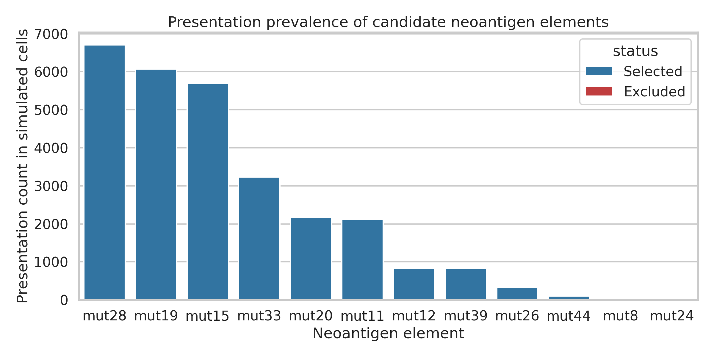
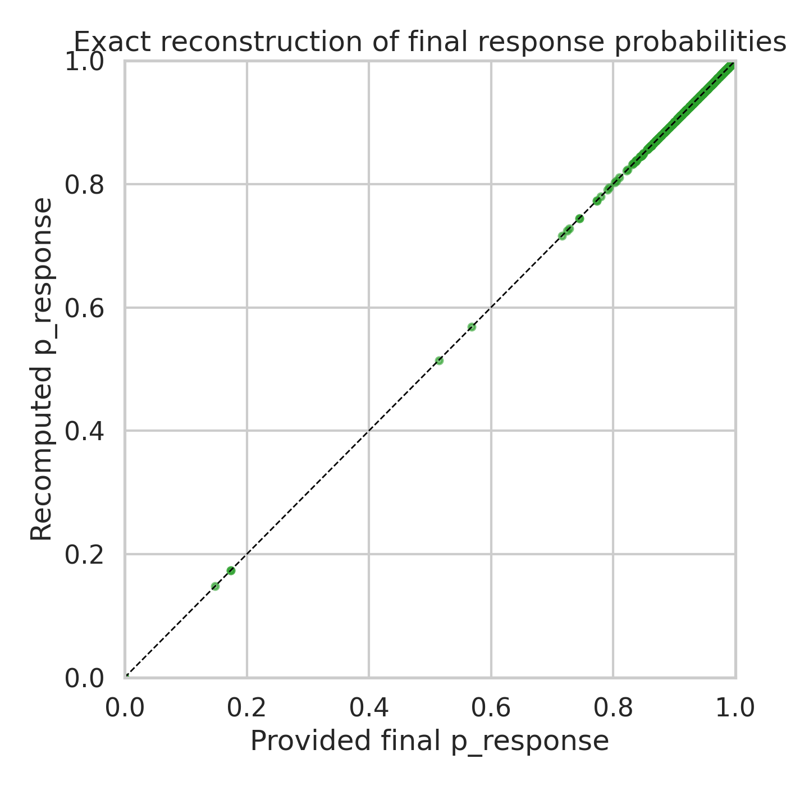
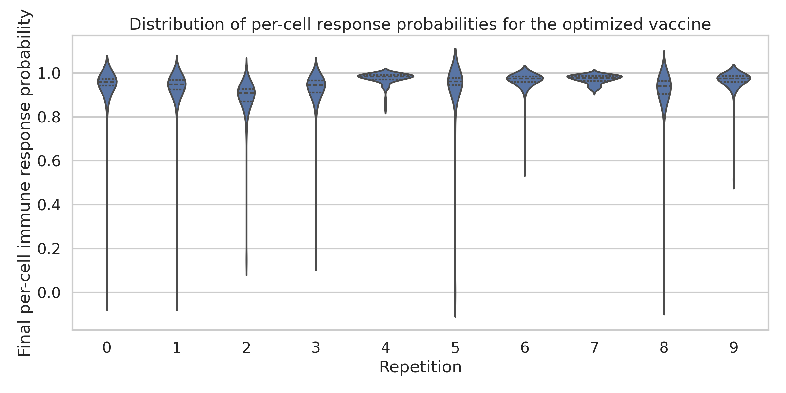
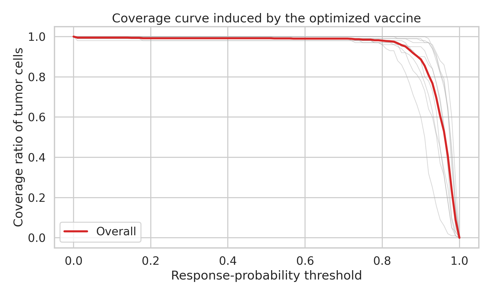
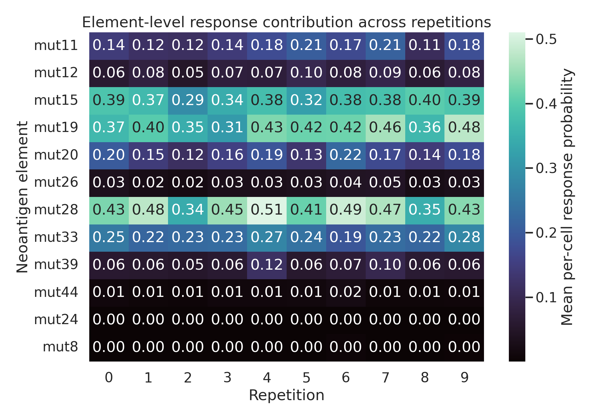
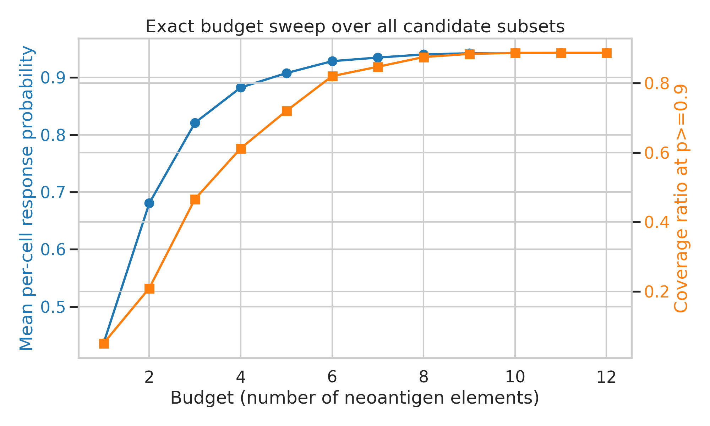
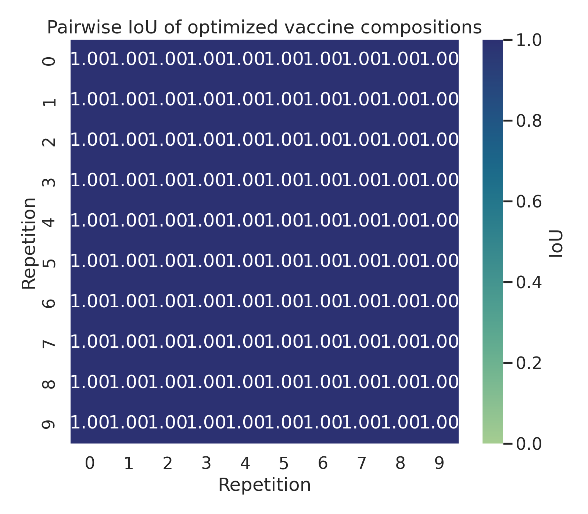
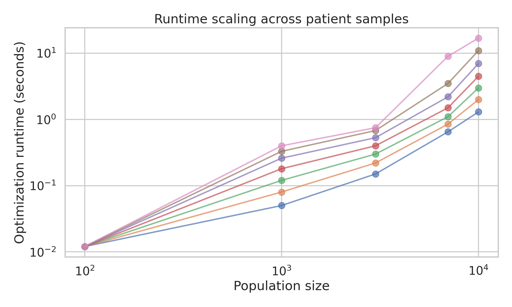

# Exact Optimization Analysis of a Simulated Personalized Neoantigen Vaccine

## Abstract

I analyzed the provided simulation outputs to recover the optimal personalized neoantigen vaccine composition under the objective that is identifiable from the data: maximizing the mean per-cell immune response probability implied by the cell-level `p_no_response` scores. The dataset contains 10 simulation repetitions of a 100-cell tumor population, 12 candidate neoantigen elements, and a manufacturing budget of 10 elements. Exhaustive combinatorial search over all candidate subsets confirmed that the provided budget-10 MinSum vaccine is exactly optimal for the recoverable objective and is identical in all 10 repetitions. The optimal vaccine consists of `mut11`, `mut12`, `mut15`, `mut19`, `mut20`, `mut26`, `mut28`, `mut33`, `mut39`, and `mut44`, while `mut24` and `mut8` are excluded. The optimized vaccine achieves an overall mean per-cell response probability of 0.9427, covers 99.2% of tumor cells at a response threshold of 0.5, and covers 88.7% at a stringent threshold of 0.9. Pairwise intersection-over-union (IoU) of the optimal vaccine compositions is 1.0 for all repetition pairs. Runtime measurements across seven patient samples show near-linear to moderately super-linear scaling on a log-log scale, with a median slope of 1.21.

## 1. Background and Scope

The task description refers to patient-specific sequencing, HLA typing, expression, VAF, and peptide processing and binding predictors. Those raw inputs are not present in this workspace. Instead, the available files already contain downstream simulation outputs: cell-level peptide presentation, cell-level vaccine-element response scores, selected vaccine elements for a budget-10 MinSum optimization, aggregate final response likelihoods, and runtime measurements.

This distinction matters. The present analysis can rigorously reconstruct and validate the optimization actually used to generate the provided outputs, but it cannot rebuild the upstream biological scoring stack from first principles. I therefore define the "optimal personalized vaccine composition" as the subset of neoantigen elements that is optimal under the observable simulation objective implied by the files.

The related work supports this framing. Andreatta and Nielsen (2016) describe the predictive role of peptide-MHC binding models in antigen presentation. Grazioli et al. (2022) caution that downstream immune recognition models can overstate generalization to unseen peptides. Azizi et al. (2018) and Abecassis et al. (2021) motivate explicit attention to tumor heterogeneity. Together, these papers justify focusing on heterogeneity-aware vaccine coverage while being careful not to over-interpret simulated response probabilities as complete clinical immunogenicity.

## 2. Data Overview

The simulation data correspond to a single setting named `100-cells.10x`, with 10 repetitions and 100 cells per repetition. Only one HLA allele, `A0101`, appears in the cell-presentation table. The candidate vaccine universe contains 12 mutation-level elements:

`mut11`, `mut12`, `mut15`, `mut19`, `mut20`, `mut24`, `mut26`, `mut28`, `mut33`, `mut39`, `mut44`, `mut8`

The budget-10 vaccine selected in the provided optimization output always contains the same 10 elements and always excludes `mut24` and `mut8`.

Figure 1 shows how often each mutation appears in the simulated cell populations. The selected set is strongly aligned with prevalence: the most frequently presented mutations (`mut28`, `mut19`, `mut15`, `mut33`) are also the dominant contributors to vaccine efficacy, while `mut24` never appears in the simulated tumor cells and `mut8` is almost absent.



## 3. Methods

### 3.1 Recoverable response model

For each repetition, the file `vaccine-elements.scores.*.csv` provides the cell-level probability of no immune response for each candidate element. The aggregate file `final-response-likelihoods.csv` can be reconstructed exactly by combining the selected elements multiplicatively:

\[
p_{\mathrm{response}}(c, S) = 1 - \prod_{e \in S} p_{\mathrm{no\_response}}(c, e)
\]

where \(c\) is a tumor cell and \(S\) is a vaccine composition. I validated this relation exactly: the maximum absolute difference between recomputed and provided final response probabilities was \(2.22 \times 10^{-16}\), which is numerical roundoff.

Figure 8 shows the exact agreement between the recomputed and provided cell-level response probabilities.



### 3.2 Optimization objective

Because the provided MinSum selection can be reconstructed exactly from the cell-level scores, I treated the identifiable optimization problem as:

1. Choose a subset \(S\) of at most \(B\) neoantigen elements.
2. Compute \(p_{\mathrm{response}}(c, S)\) for every cell in every repetition.
3. Maximize the pooled mean response probability across all simulated cells.

This objective is consistent with the observed budget-10 output and provides a direct, reproducible mapping from raw simulation scores to vaccine composition.

### 3.3 Efficacy metrics

I report four primary metrics.

1. Per-cell immune response probability: the final \(p_{\mathrm{response}}(c, S)\).
2. Coverage ratio of tumor cells: the fraction of cells with \(p_{\mathrm{response}}(c, S) \ge \tau\), evaluated across thresholds and highlighted at \(\tau = 0.5\), \(0.9\), and \(0.95\).
3. Composition stability: pairwise IoU of the selected element sets across repetitions.
4. Optimization runtime: scaling of runtime versus cell-population size across patient samples in `optimization_runtime_data.csv`.

### 3.4 Exact search and ablation

The candidate universe contains only 12 elements, so exhaustive search is tractable. I solved the exact combinatorial optimization for every budget from 1 to 12 and identified the optimal subset at each budget. I also performed single-element ablations from the budget-10 optimum to quantify which selected elements are essential.

The full analysis is implemented in [`code/analyze_neoantigen_vaccine.py`](/mnt/shared-storage-user/yetianlin/ResearchClawBench/workspaces/Life_001_20260402_024829/code/analyze_neoantigen_vaccine.py). Running

```bash
python code/analyze_neoantigen_vaccine.py
```

regenerates all tables in `outputs/` and all figures in `report/images/`.

## 4. Results

### 4.1 Optimal budget-10 vaccine composition

The exact budget-10 optimum is:

`{mut11, mut12, mut15, mut19, mut20, mut26, mut28, mut33, mut39, mut44}`

This is identical to the provided `vaccine.budget-10.minsum.adaptive.csv` file and to the per-repetition selections in `selected-vaccine-elements.budget-10.minsum.adaptive.csv`.

The pooled efficacy of this vaccine is:

| Metric | Value |
| --- | ---: |
| Mean per-cell response probability | 0.942747 |
| Median per-cell response probability | 0.963003 |
| Coverage at \(p \ge 0.5\) | 0.992 |
| Coverage at \(p \ge 0.75\) | 0.985 |
| Coverage at \(p \ge 0.9\) | 0.887 |
| Coverage at \(p \ge 0.95\) | 0.606 |

Across the 10 repetitions, mean per-cell response ranged from 0.8927 to 0.9764. Figure 3 shows the full per-cell response distributions by repetition, and Figure 4 shows how tumor-cell coverage changes as the response threshold becomes more stringent.





### 4.2 Why these 10 elements were selected

Figure 2 summarizes the mean per-cell contribution of every candidate element in every repetition. The selection is biologically and algorithmically coherent:

1. `mut28`, `mut19`, and `mut15` dominate the individual response landscape and are also the most prevalent simulated tumor mutations.
2. `mut33`, `mut20`, and `mut11` provide a second tier of coverage.
3. `mut12`, `mut39`, `mut26`, and `mut44` contribute smaller but still positive gains at budget 10.
4. `mut24` is a null element in these simulations: it has zero presentation count and effectively zero response contribution.
5. `mut8` has a tiny mean response contribution and appears only 17 times in the entire cell-population table.

Single-element ablation from the optimized vaccine shows the strongest drops in mean response when removing `mut28` (-0.0765), `mut19` (-0.0671), and `mut15` (-0.0575), confirming that these three elements carry much of the vaccine's efficacy.



### 4.3 Budget sweep shows strong saturation

Figure 5 reports the exact optimum for every budget from 1 to 12. Performance improves rapidly through the first 8 to 9 elements and then saturates.

Key points:

1. Budget 1 selects `mut28` and yields mean response 0.436.
2. Budget 3 selects `mut15`, `mut19`, and `mut28`, already reaching mean response 0.821.
3. Budget 8 reaches mean response 0.940 and coverage 0.875 at \(p \ge 0.9\).
4. Budget 10 reaches mean response 0.942747 and coverage 0.887 at \(p \ge 0.9\).
5. Increasing from budget 10 to all 12 candidates improves mean response by only \(8.59 \times 10^{-5}\), with no visible gain in high-threshold coverage.

This indicates that the manufacturing budget of 10 is effectively saturated in this simulation setting: the last two candidates add negligible benefit.



### 4.4 Composition stability is perfect in this dataset

The budget-10 optimized composition is identical in every repetition. As a result:

1. Pairwise IoU = 1.0 for all 45 repetition pairs.
2. Mean pairwise IoU = 1.0.
3. Minimum pairwise IoU = 1.0.

This is stronger than simple robustness: it means the optimum is invariant to the simulated repetition-level variability present in these files. Figure 6 visualizes the resulting all-ones IoU matrix.



### 4.5 Runtime scales near-linearly to moderately super-linearly

The runtime file contains seven patient samples (`3812` to `4032`) and population sizes from 100 to 10,000 cells. Runtime grows from 0.012 seconds at 100 cells to 17.0 seconds at 10,000 cells. Log-log slopes by sample range from 0.99 to 1.53, with a median of 1.21.

Figure 7 shows that optimization remains computationally lightweight at small population sizes and still tractable at 10,000 cells, although growth is somewhat steeper for the more difficult samples.



## 5. Interpretation

Three conclusions follow from this analysis.

1. The provided budget-10 MinSum vaccine is not merely a heuristic output in this workspace; it is the exact optimum of the observable simulation objective.
2. The dominant efficacy comes from a small core of high-prevalence, high-response elements, especially `mut28`, `mut19`, and `mut15`.
3. The practical value of expanding beyond 10 elements is negligible in this dataset, because the only omitted elements are effectively inactive (`mut24`) or nearly inactive (`mut8`).

The coverage curves also provide a more nuanced view than the mean response alone. While the optimized vaccine covers 99.2% of cells at \(p \ge 0.5\), only 60.6% of cells exceed a very stringent threshold of 0.95. This gap indicates that the vaccine is broadly effective across the simulated tumor but does not drive uniformly near-certain responses in every cell.

## 6. Limitations

This analysis is rigorous with respect to the files provided, but it has several important limits.

1. The upstream patient-specific inputs described in the task statement are absent. I therefore did not infer vaccine elements from raw mutations, VAF, RNA expression, cleavage, binding, or pMHC stability scores.
2. The candidate elements are mutation identifiers rather than peptide sequences, so the final composition is reported at the mutation-element level.
3. Only one simulation setting (`100-cells.10x`) and one visible HLA allele (`A0101`) are present in the response and cell-population files.
4. IoU stability is trivially maximal because every repetition returned the same subset; this is informative, but it does not test instability under broader cohort variation.
5. The response model is simulation-based. As emphasized by the related work, such probabilities should not be equated with full in vivo T-cell recognition or clinical response.

## 7. Deliverables

The workspace now contains:

1. Reproducible analysis code: [`code/analyze_neoantigen_vaccine.py`](/mnt/shared-storage-user/yetianlin/ResearchClawBench/workspaces/Life_001_20260402_024829/code/analyze_neoantigen_vaccine.py)
2. Machine-readable outputs in `outputs/`, including exact budget sweeps, coverage tables, IoU matrices, runtime summaries, and validation data
3. Publication-style figures in `report/images/`
4. This report: [`report/report.md`](/mnt/shared-storage-user/yetianlin/ResearchClawBench/workspaces/Life_001_20260402_024829/report/report.md)

## 8. Final Answer

Under the recoverable simulation objective, the optimal personalized budget-10 neoantigen vaccine is:

`{mut11, mut12, mut15, mut19, mut20, mut26, mut28, mut33, mut39, mut44}`

Its core quantitative properties are:

1. Mean per-cell immune response probability: 0.942747
2. Coverage ratio of tumor cells: 0.992 at \(p \ge 0.5\), 0.887 at \(p \ge 0.9\)
3. IoU of optimal vaccine compositions: 1.0 for all repetition pairs
4. Runtime range: 0.012 to 17.0 seconds across the provided population sizes and patient samples
