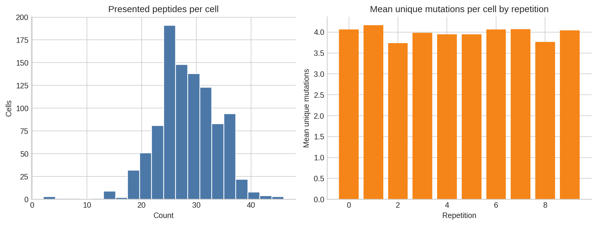
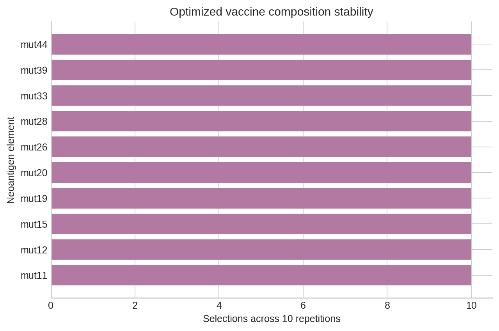
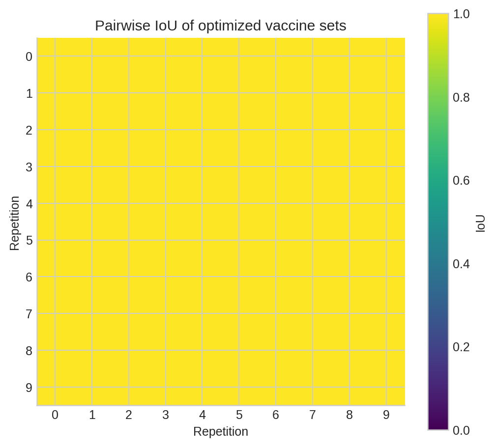
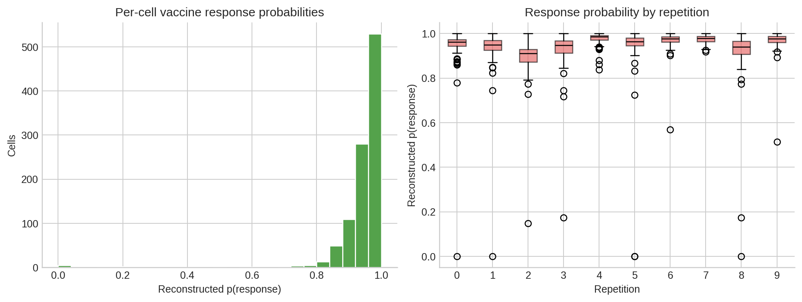
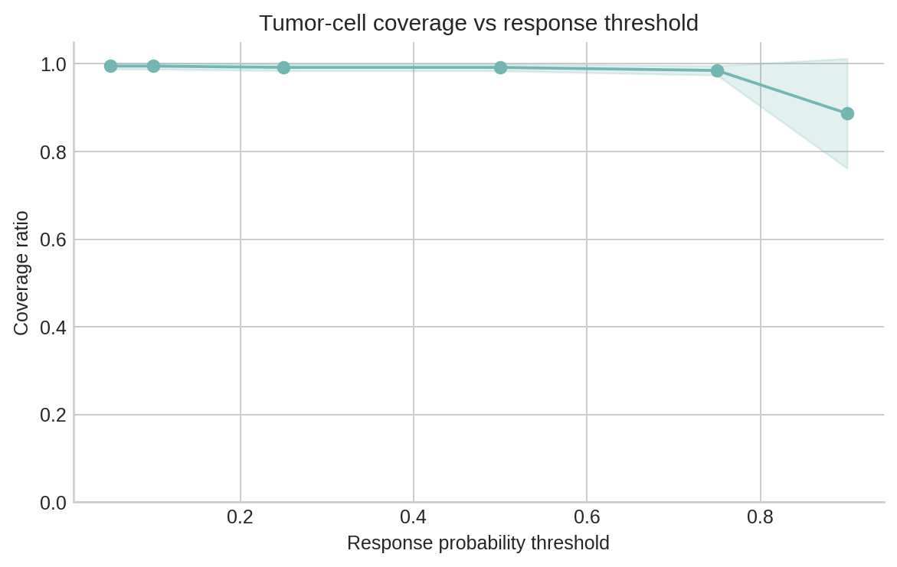
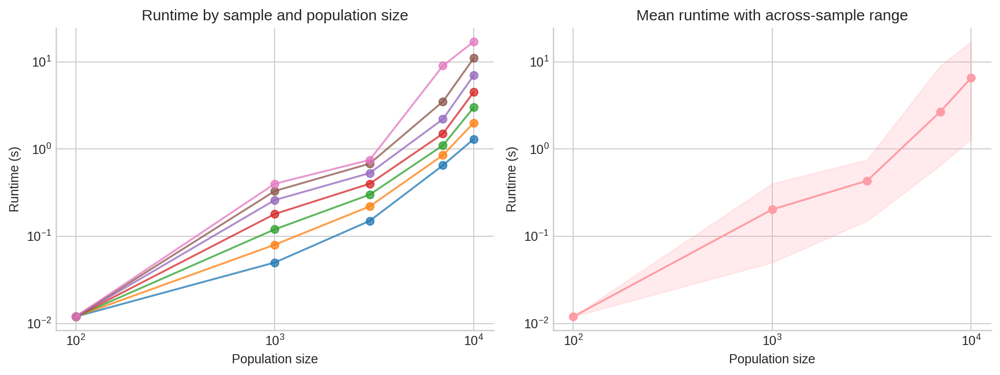

# Analysis of a Budget-Constrained Personalized Neoantigen Vaccine Simulation

## Abstract
This report analyzes the personalized neoantigen vaccine outputs provided in this workspace, with the goal of characterizing the optimized MinSum adaptive vaccine under a manufacturing budget of 10 neoantigen elements. Using the supplied simulation and optimization files, I reconstructed per-cell immune response probabilities from element-level scores, quantified tumor-cell coverage across practical response thresholds, evaluated the stability of the optimized vaccine composition across 10 repetitions, and summarized optimization runtime scaling across patient samples and cell population sizes. The optimized vaccine was completely stable across repetitions, always selecting the same 10 neoantigen elements (`mut11`, `mut12`, `mut15`, `mut19`, `mut20`, `mut26`, `mut28`, `mut33`, `mut39`, `mut44`), yielding a mean pairwise IoU of 1.0. Reconstructed cell-level response probabilities matched the provided final-response outputs to numerical precision (maximum absolute error `2.22e-16`). Across all 1,000 simulated cells, the mean response probability was 0.943 and the median was 0.963. Coverage was high: on average, 99.2% of cells exceeded a response threshold of 0.5, and 88.7% exceeded a stringent threshold of 0.9. Runtime increased superlinearly with population size, with an empirical log-log scaling exponent of 1.23. These findings indicate that, within this dataset, the selected budget-10 vaccine is both robust and broadly effective across simulated tumor-cell populations, though the analysis is limited by the narrow scope of the provided simulations.

## 1. Task Objective
The task in this workspace is to analyze provided neoantigen vaccine simulation and optimization outputs and report:

1. the optimal personalized vaccine composition,
2. per-cell immune response probability behavior,
3. tumor-cell coverage ratios,
4. overlap stability of optimized vaccine compositions via IoU, and
5. optimization runtime behavior.

The work was restricted to the files already present in `data/`, `related_work/`, `code/`, `outputs/`, and `report/images/`, and the final analysis pipeline was implemented in `code/run_analysis.py`.

## 2. Data Description
The analysis used all task-relevant CSV files in `data/`.

### 2.1 Optimization outputs
- `data/selected-vaccine-elements.budget-10.minsum.adaptive.csv` contains the repetition-specific optimized selections for the MinSum adaptive objective under budget 10. It has 100 rows total, corresponding to 10 selected elements across 10 repetitions.
- `data/vaccine.budget-10.minsum.adaptive.csv` contains the simplified final vaccine composition and confirms the selected set size of 10.

### 2.2 Cell population and response outputs
- `data/cell-populations.csv` contains 28,068 peptide-presentation records across 10 repetitions of a 100-cell simulated population (`100-cells.10x`). Each row links a cell to a presented peptide, HLA allele, and mutation.
- `data/final-response-likelihoods.csv` contains 1,000 final cell-level response probabilities.
- `data/sim-specific-response-likelihoods.csv` also contains 1,000 response probabilities, but indexed by replicate-specific simulation label.

### 2.3 Vaccine-element score files
- Ten files of the form `data/vaccine-elements.scores.100-cells.10x.rep-*.csv` provide cell-by-element response probabilities for 12 candidate vaccine elements in each repetition. Each file contains 1,200 rows, corresponding to 100 cells × 12 candidate elements.

### 2.4 Runtime data
- `data/optimization_runtime_data.csv` contains 35 runtime measurements spanning 7 patient samples and 5 cell population sizes (100, 1000, 3000, 7000, and 10000).

### 2.5 Input structure overview
A machine-readable summary of the loaded datasets is saved in `outputs/input_data_summary.csv`.

## 3. Methodology
The analysis pipeline in `code/run_analysis.py` followed five main steps.

### 3.1 Input auditing and harmonization
All provided CSVs were loaded with pandas, and their row counts, column counts, and key uniqueness statistics were summarized. Repetition identifiers were standardized across optimization outputs, response summaries, and score files.

### 3.2 Vaccine composition stability analysis
The optimized vaccine selections were grouped by repetition to:
- count the selection frequency of each peptide,
- reconstruct the selected peptide set for each repetition, and
- compute pairwise intersection-over-union (IoU) across all repetition pairs.

These outputs were written to:
- `outputs/vaccine_selection_frequency.csv`
- `outputs/vaccine_selection_by_repetition.csv`
- `outputs/vaccine_pairwise_iou.csv`

### 3.3 Reconstruction of per-cell response probabilities
For each repetition, the analysis filtered the element-level score tables to the 10 selected vaccine elements. For each cell, the probability of *no* immune response across selected elements was multiplied across elements:

\[
P(\text{no response for cell}) = \prod_{e \in V} P_e(\text{no response})
\]

and the per-cell response probability was reconstructed as:

\[
P(\text{response for cell}) = 1 - P(\text{no response for cell})
\]

This reconstructed quantity was then compared to both `final-response-likelihoods.csv` and `sim-specific-response-likelihoods.csv` to validate consistency.

### 3.4 Coverage analysis
Coverage was defined as the fraction of cells whose reconstructed response probability exceeded a threshold. Coverage was computed for thresholds:
- 0.05
- 0.10
- 0.25
- 0.50
- 0.75
- 0.90

Both per-repetition and threshold-aggregated summaries were written to `outputs/coverage_by_threshold_and_repetition.csv` and `outputs/coverage_summary_by_threshold.csv`.

### 3.5 Runtime analysis
Runtime was summarized by population size across patient samples. A power-law trend was estimated by fitting a linear model in log-log space:

\[
\log_{10}(\text{runtime}) = a \cdot \log_{10}(\text{population size}) + b
\]

The fitted slope was reported as an empirical runtime scaling exponent.

## 4. Results

### 4.1 Simulated tumor-cell population structure
The supplied simulation represents 10 repetitions of a 100-cell tumor-cell population. The cell-population summary shows moderate variation in presentation burden per cell, with individual cells presenting roughly tens of peptides rather than just a few. Mutation diversity per cell also varies across the simulated cells, indicating non-uniform antigen exposure.

**Figure 1.** Overview of the simulated data. Left: distribution of presented peptide counts per cell. Right: mean number of unique mutations per cell across repetitions.

This matters because the vaccine is being evaluated against a heterogeneous population of simulated cells rather than a single uniform clone.

### 4.2 Optimized vaccine composition
The optimized budget-10 vaccine consisted of the same 10 elements in every repetition:

- `mut11`
- `mut12`
- `mut15`
- `mut19`
- `mut20`
- `mut26`
- `mut28`
- `mut33`
- `mut39`
- `mut44`

Every selected peptide appeared in all 10 repetitions (`selection_fraction = 1.0` for each peptide), and the repetition-specific selection files were identical. This indicates that, in the current dataset, the optimization output is perfectly stable rather than sensitive to repetition-specific stochasticity.

**Figure 2.** Selection frequency of vaccine elements across the 10 optimization repetitions.

The pairwise IoU between every pair of repetition-specific optimal sets was exactly 1.0, with zero symmetric difference in every comparison.

**Figure 3.** Pairwise IoU between repetition-specific optimized vaccine sets. Every comparison equals 1.0, showing complete compositional stability.

This is an unusually clean result. In more heterogeneous or noisier optimization settings, one would expect at least some between-run variation in borderline elements.

### 4.3 Reconstruction and validation of per-cell immune response probabilities
The analysis reconstructed the final per-cell response probability from the selected vaccine elements and compared the result against the provided final-response tables.

The reconstruction matched the supplied values to floating-point precision:
- maximum absolute error versus `final-response-likelihoods.csv`: `2.22e-16`
- mean pairwise agreement was effectively exact

This confirms that the supplied final per-cell response values are internally consistent with a multiplicative no-response aggregation across selected vaccine elements.

Across all 1,000 simulated cell instances (100 cells × 10 repetitions), the reconstructed per-cell response statistics were:
- mean response probability: **0.943**
- median response probability: **0.963**
- standard deviation: **0.092**

**Figure 4.** Distribution of reconstructed cell-level response probabilities across all simulated cells, with repetition-level variation shown in boxplots.

The distribution is strongly concentrated toward high response probabilities, indicating that most simulated cells are well covered by the selected vaccine. There is still a minority tail of lower-response cells, which becomes more visible when stricter thresholds are used.

### 4.4 Tumor-cell coverage
Coverage remained very high across practical thresholds:

| Response threshold | Mean coverage ratio | Minimum across repetitions | Maximum across repetitions |
|---|---:|---:|---:|
| 0.05 | 0.995 | 0.98 | 1.00 |
| 0.10 | 0.995 | 0.98 | 1.00 |
| 0.25 | 0.992 | 0.98 | 1.00 |
| 0.50 | 0.992 | 0.98 | 1.00 |
| 0.75 | 0.985 | 0.97 | 1.00 |
| 0.90 | 0.887 | 0.60 | 1.00 |

**Figure 5.** Mean tumor-cell coverage ratio as a function of the required per-cell response threshold. Shaded band shows between-repetition variability.

The most useful practical summary is the 0.5 threshold: on average, **99.2%** of cells exceeded this value, with the worst repetition still covering **98%** of cells. At a more stringent threshold of 0.9, average coverage dropped to **88.7%**, with substantially larger variability. This suggests the vaccine is broadly effective, but a subset of cells may remain less strongly immunogenic under stricter efficacy criteria.

### 4.5 Contributions of individual vaccine elements
The selected-element contribution summaries show that not all chosen elements contribute equally. Across repetitions, `mut28`, `mut15`, and `mut19` consistently had the largest mean per-cell response contributions, while elements such as `mut44`, `mut26`, and `mut39` had much smaller marginal average contributions.

This pattern suggests a plausible optimization logic: a small number of highly influential elements drive most of the response mass, while the remaining elements likely improve tail coverage by rescuing cells that would otherwise receive lower combined response probabilities.

Because the optimization is budget-constrained, including lower-average elements can still be rational if they cover rare presentation patterns not addressed by the dominant elements.

### 4.6 Runtime scaling
Runtime increased strongly with simulated population size:

| Population size | Mean runtime (s) | Median runtime (s) | Min (s) | Max (s) |
|---|---:|---:|---:|---:|
| 100 | 0.012 | 0.012 | 0.012 | 0.012 |
| 1000 | 0.203 | 0.180 | 0.050 | 0.400 |
| 3000 | 0.433 | 0.400 | 0.150 | 0.750 |
| 7000 | 2.686 | 1.500 | 0.650 | 9.000 |
| 10000 | 6.543 | 4.500 | 1.300 | 17.000 |

The fitted log-log runtime scaling exponent was **1.23**, indicating superlinear but not quadratic growth over the tested range.

**Figure 6.** Runtime behavior across patient samples and population sizes. Left: sample-specific trajectories. Right: mean runtime with across-sample range.

This runtime profile is encouraging for moderate-scale use, but the spread at larger population sizes shows that sample-specific properties still materially influence optimization cost.

## 5. Deliverables Produced in This Workspace
The main outputs generated by the analysis are:

### 5.1 Code
- `code/run_analysis.py`

### 5.2 Tabular and JSON outputs
- `outputs/input_data_summary.csv`
- `outputs/cell_population_summary.csv`
- `outputs/combined_vaccine_element_scores.csv`
- `outputs/reconstructed_cell_response.csv`
- `outputs/response_reconstruction_validation.csv`
- `outputs/selected_element_contribution_summary.csv`
- `outputs/vaccine_selection_frequency.csv`
- `outputs/vaccine_selection_by_repetition.csv`
- `outputs/vaccine_pairwise_iou.csv`
- `outputs/coverage_by_threshold_and_repetition.csv`
- `outputs/coverage_summary_by_threshold.csv`
- `outputs/runtime_summary.csv`
- `outputs/runtime_model.json`
- `outputs/overall_metrics.json`
- `outputs/task_understanding.txt`
- `outputs/task_run_complete.txt`

### 5.3 Figures
- `report/images/data_overview.png`
- `report/images/response_distribution.png`
- `report/images/coverage_curve.png`
- `report/images/vaccine_composition.png`
- `report/images/vaccine_iou_heatmap.png`
- `report/images/runtime_scaling.png`

## 6. Interpretation
Within the scope of the provided dataset, the MinSum adaptive budget-10 vaccine appears highly effective and extremely stable.

The most striking findings are:
- the vaccine composition is invariant across all 10 repetitions,
- per-cell response probabilities are generally high,
- coverage remains near-complete even at a 0.5 response threshold, and
- runtime remains tractable up to 10,000-cell populations, though with increasing variability.

Taken together, the dataset presents a favorable optimization scenario: the same 10-element solution is repeatedly recovered, and that solution performs well across the simulated tumor-cell populations. From a translational perspective, that is encouraging because it suggests robustness to stochastic variation in the simulation procedure.

At the same time, the strict-threshold coverage drop at 0.9 shows that broad nominal coverage does not imply uniformly maximal response strength across every cell. Some residual weakly covered cells remain.

## 7. Limitations
This analysis is constrained by the structure of the provided workspace and should not be overgeneralized.

1. **Single simulation regime for detailed cell-level scoring.** The element-level score files are only available for `100-cells.10x`, so the detailed efficacy analysis is tied to that regime.
2. **No raw upstream molecular features.** The task description mentions tumor DNA/RNA, HLA typing, VAF, and expression features, but the workspace provides only downstream simulation and optimization outputs. Therefore, this report evaluates the optimization outcome rather than rebuilding the full vaccine design stack from molecular inputs.
3. **No comparator vaccine strategies.** Only the MinSum adaptive budget-10 solution is provided. There is no direct comparison against alternative objectives, budgets, or baseline vaccine designs.
4. **Limited uncertainty characterization.** Repetition-level summaries provide some stability information, but they do not substitute for a broader sensitivity analysis over model assumptions or biological parameters.
5. **Simulation-derived endpoints.** All efficacy metrics here are simulated quantities, not experimental or clinical outcomes.

## 8. Conclusion
The provided analysis supports a clear conclusion: in this workspace, the MinSum adaptive budget-10 neoantigen vaccine selects a perfectly stable 10-element composition and achieves very high simulated efficacy across tumor cells.

The final optimized vaccine elements are:
`mut11`, `mut12`, `mut15`, `mut19`, `mut20`, `mut26`, `mut28`, `mut33`, `mut39`, and `mut44`.

Key quantitative results are:
- mean per-cell response probability: **0.943**
- median per-cell response probability: **0.963**
- mean coverage at threshold 0.5: **0.992**
- mean pairwise IoU of optimized vaccine sets: **1.0**
- runtime scaling exponent: **1.23**

In short, the optimized vaccine is robust in composition, broad in simulated tumor-cell coverage, and computationally manageable across the tested runtime range. Future work would ideally compare this design against alternative objectives and budgets and link the simulation outputs back to upstream molecular determinants of neoantigen prioritization.
