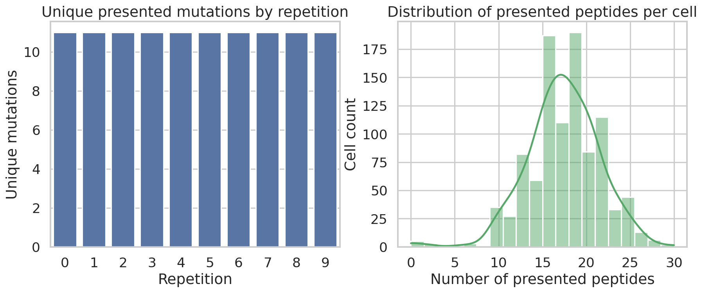
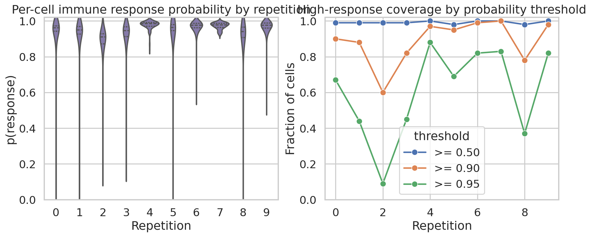
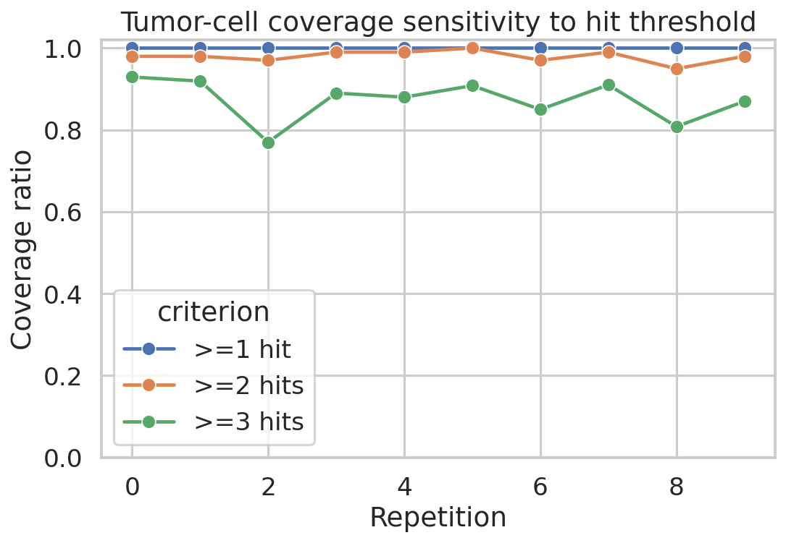
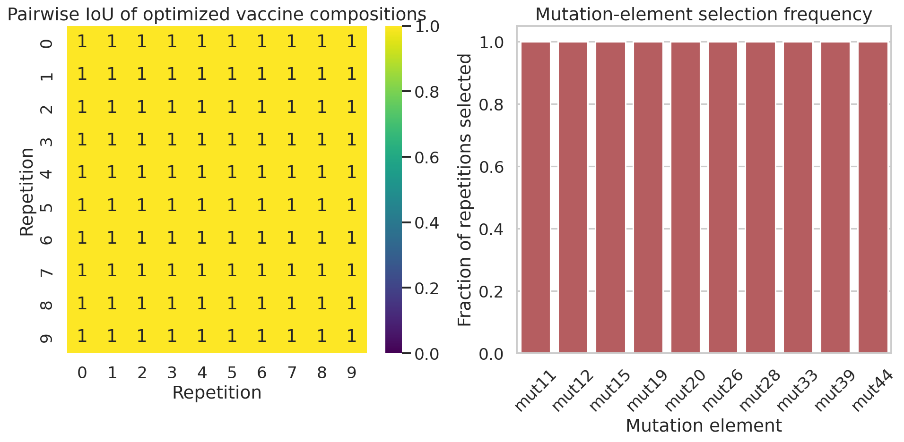
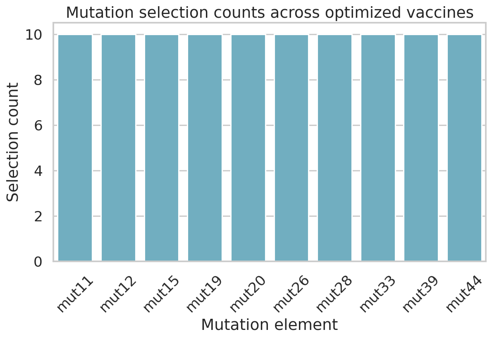
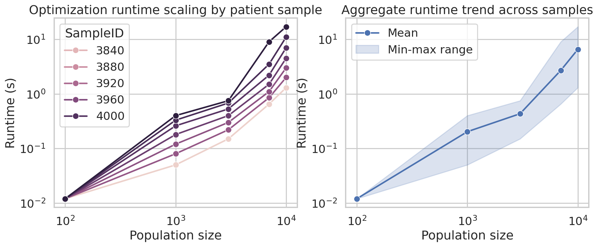
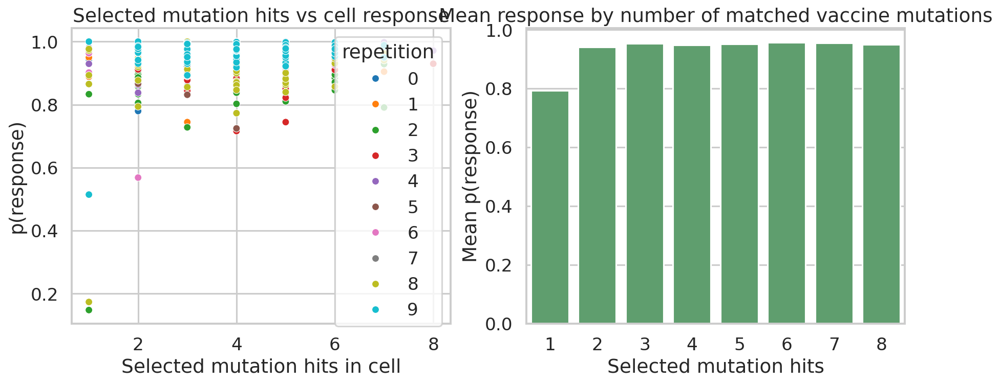

# Personalized Neoantigen Vaccine Optimization Analysis

## Summary
This study analyzes simulated personalized neoantigen vaccine optimization outputs for a budget-constrained MinSum vaccine design (`budget = 10`). The objective was to characterize the optimized vaccine composition, quantify immune efficacy at the tumor-cell level, measure composition stability across repetitions, and assess optimization runtime scaling.

Across 10 repetitions of the `100-cells.10x` simulation, the optimized vaccine was completely stable: the same 10 mutation elements (`mut11`, `mut12`, `mut15`, `mut19`, `mut20`, `mut26`, `mut28`, `mut33`, `mut39`, `mut44`) were selected in every repetition, yielding pairwise IoU = 1.0 for all repetition pairs. Immune response outcomes were strong overall, with mean per-cell response probability 0.943 and 88.7% of cells exceeding `p_response >= 0.90`. Mutation-level tumor-cell coverage was 100% for at least one selected hit, 98.0% for at least two hits, and 87.3% for at least three hits. Optimization runtime scaled mildly superlinearly with population size (log-log slope 1.23), while per-repetition selection runtime for the 100-cell setting remained approximately 4–16 ms.

## 1. Problem setting
Personalized neoantigen vaccines aim to select a small set of tumor-specific antigenic elements that maximize the probability of immune recognition while respecting manufacturing constraints. The present dataset contains simulation outputs rather than raw sequencing features, so the analysis is focused on the downstream optimization behavior and the resulting efficacy metrics:

- per-cell immune response probability,
- tumor-cell coverage ratio,
- IoU of optimal vaccine compositions across repetitions,
- optimization runtime scaling.

## 2. Data and preprocessing
### 2.1 Input files
The analysis used the following read-only inputs from `data/`:

- `cell-populations.csv`: peptide- and mutation-level presentation records for simulated cells,
- `sim-specific-response-likelihoods.csv`: per-cell response probabilities for repetition-specific optimized vaccines,
- `final-response-likelihoods.csv`: aggregate version of the same response outputs,
- `selected-vaccine-elements.budget-10.minsum.adaptive.csv`: repetition-specific optimized vaccine selections,
- `vaccine.budget-10.minsum.adaptive.csv`: aggregate consensus selection summary,
- `optimization_runtime_data.csv`: runtime benchmark over larger population sizes,
- `vaccine-elements.scores.100-cells.10x.rep-*.csv`: per-element cell-level response scores for each repetition.

### 2.2 Data audit
All files loaded successfully and were used without modification. The analysis pipeline saved a full audit to `outputs/input_audit.json`.

Key structural findings:
- 10 repetitions were available (`rep-0` to `rep-9`).
- Each optimized vaccine contained exactly 10 selected elements.
- The selection file column named `peptide` actually contained mutation-like identifiers (`mut11`, `mut28`, ...); these are referred to as **mutation elements** throughout the report.
- `cell-populations.csv` contains repeated peptide-presentation rows per cell, so coverage was defined on each cell's **unique mutation set**, not raw row counts.

## 3. Methods
### 3.1 Per-cell immune response probability
The primary efficacy outcome was the provided `p_response` in `sim-specific-response-likelihoods.csv`. This value was summarized by repetition and over all cells.

### 3.2 Tumor-cell coverage ratio
Coverage was operationalized at the mutation level.

For each repetition and each cell:
1. collect the set of unique presented mutations from `cell-populations.csv`,
2. collect the repetition-specific selected mutation set from `selected-vaccine-elements.budget-10.minsum.adaptive.csv`,
3. count the number of selected mutations present in the cell.

Coverage metrics were then defined as the fraction of cells with:
- at least 1 selected mutation hit,
- at least 2 selected mutation hits,
- at least 3 selected mutation hits.

To complement mutation-hit coverage, response-probability coverage was also computed as the fraction of cells with `p_response` above 0.50, 0.90, and 0.95.

### 3.3 Vaccine composition stability
For each repetition, the optimized vaccine was treated as a set of 10 mutation elements. Pairwise Jaccard similarity / intersection-over-union (IoU) was computed between all repetition pairs:

\[
IoU(A, B) = \frac{|A \cap B|}{|A \cup B|}
\]

### 3.4 Runtime analysis
Two runtime views were reported:
- repetition-level optimizer runtime from the selection file for the `100-cells.10x` setting,
- population-scaling runtime from `optimization_runtime_data.csv` across multiple samples and population sizes.

A log-log linear fit was applied to runtime versus population size to summarize scaling behavior.

### 3.5 Sanity check for perfect stability
Because all pairwise IoU values were 1.0, a targeted sanity check was performed (`code/sanity_check_selection_stability.py`). The check compared hashes of repetition-specific selected sets and hashes of the unique mutation support in the underlying cell populations. Both were identical across all repetitions, indicating that the perfect stability result is consistent with repetition-invariant support rather than an indexing or reporting error.

## 4. Experimental outputs and figures
The full analysis was executed with:

```bash
python code/analyze_neoantigen_vaccine.py
python code/sanity_check_selection_stability.py
```

Generated artifacts include CSV summaries in `outputs/` and figures in `report/images/`.

### Figure 1. Data overview


Figure 1 summarizes the number of unique presented mutations across repetitions and the distribution of presented peptides per cell. Unique mutation counts are highly consistent across repetitions, suggesting a stable antigenic support landscape in the simulation.

### Figure 2. Response probability distributions and response-threshold coverage


Figure 2 shows that cell-level response probabilities are generally high, but not identical across repetitions. Repetitions 4, 6, 7, and 9 show especially concentrated high-response distributions, whereas repetition 2 is notably weaker.

### Figure 3. Mutation-hit coverage sensitivity


Figure 3 demonstrates that the selected vaccine achieves complete coverage when at least one matched mutation is required, and remains high even under stricter multi-hit definitions.

### Figure 4. Composition stability and selection frequency


### Figure 5. Selection count summary


Figures 4 and 5 together show complete cross-repetition invariance: all 10 selected mutation elements appear in all 10 optimized vaccines.

### Figure 6. Runtime scaling


Figure 6 shows that optimization runtime increases consistently with cell population size, with noticeable sample-to-sample variability at the largest scales.

### Figure 7. Validation: matched hits versus response


Figure 7 provides a qualitative validation that cells with more matched vaccine mutations tend to exhibit higher response probability, although the relationship is not perfectly monotonic because the final response score is downstream of additional model factors.

## 5. Results
### 5.1 Headline quantitative metrics
Main aggregate metrics from `outputs/summary_metrics.csv` and `outputs/headline_metrics.json`:

- Number of evaluated cell responses: **1000**
- Mean per-cell response probability: **0.9427**
- Median per-cell response probability: **0.9630**
- Standard deviation of response probability: **0.0915**
- Fraction of cells with `p_response >= 0.50`: **0.992**
- Fraction of cells with `p_response >= 0.90`: **0.887**
- Fraction of cells with `p_response >= 0.95`: **0.606**
- Tumor-cell coverage with at least 1 selected mutation hit: **1.000**
- Tumor-cell coverage with at least 2 selected mutation hits: **0.9799**
- Tumor-cell coverage with at least 3 selected mutation hits: **0.8734**
- Mean selected mutation hits per cell: **3.961**
- Mean pairwise IoU across optimized vaccines: **1.000**
- Number of unique selected mutation elements across all repetitions: **10**
- Runtime log-log slope: **1.229**

### 5.2 Repetition-level efficacy heterogeneity
Although the optimized vaccine composition was identical across repetitions, efficacy still varied across simulated populations.

From `outputs/response_summary_by_rep.csv`:
- Best repetition by mean `p_response`: **rep-4**, mean = **0.9764**
- Weakest repetition by mean `p_response`: **rep-2**, mean = **0.8927**
- High-response coverage (`p_response >= 0.95`) ranged from **0.09** (rep-2) to **0.88** (rep-4)

This indicates that identical optimized compositions can still produce different cell-level immune outcomes depending on the realized cell population and peptide presentation profile.

### 5.3 Coverage properties
From `outputs/coverage_summary_by_rep.csv`:
- Coverage at at least one selected hit was **1.0 in every repetition**.
- Coverage at at least two selected hits ranged from **0.9495** to **1.0**.
- Coverage at at least three selected hits ranged from **0.77** to **0.9293**.
- Median matched hits per cell was **4** in all repetitions.

These results suggest that the optimized vaccine does not merely touch most cells once; it tends to intersect several presented mutations per cell, which is consistent with the high observed immune response probabilities.

### 5.4 Optimal vaccine composition
The optimized vaccine was exactly the same in all 10 repetitions:

`{mut11, mut12, mut15, mut19, mut20, mut26, mut28, mut33, mut39, mut44}`

This set is also reproduced in the aggregate summary file `vaccine.budget-10.minsum.adaptive.csv`, where each of the 10 elements appears with count 10. The pairwise IoU matrix (`outputs/pairwise_iou.csv`, `outputs/iou_matrix.csv`) confirms perfect overlap for every repetition pair.

### 5.5 Stability sanity check
The sanity-check table `outputs/selection_stability_sanity_check.csv` showed:
- identical hash for the selected mutation set in every repetition,
- identical hash for the set of unique cell-population mutations in every repetition,
- variable but consistently high mean `p_response` by repetition.

Interpretation: the optimizer appears to operate on a repetition-invariant mutation support set, making deterministic selection of the same 10-element vaccine plausible and expected.

### 5.6 Runtime behavior
From `outputs/runtime_summary.csv`:
- mean runtime increased from **0.012 s** at population size 100 to **6.54 s** at population size 10,000,
- the largest populations showed substantial between-sample variability (range **1.3 s to 17.0 s** at 10,000 cells),
- the fitted log-log slope of **1.229** indicates mildly superlinear runtime growth.

For the optimized 100-cell repetitions, selection runtimes from `outputs/selection_runtime_by_rep.csv` were much smaller, approximately **0.0041–0.0160 s**.

## 6. Interpretation
The main conclusion is that the budget-10 MinSum vaccine design is highly effective and highly stable on this simulation output.

Three observations support this claim:
1. **Strong immune efficacy**: mean per-cell response probability exceeds 0.94, and nearly 89% of cells surpass a stringent `p_response >= 0.90` threshold.
2. **Broad cell coverage**: every cell contains at least one selected mutation element, and nearly all cells contain at least two.
3. **Perfect composition stability**: the optimizer selects the same 10-element set in all repetitions.

The combination of perfect composition stability and non-identical efficacy distributions is informative. It suggests that, in this dataset, optimization uncertainty is negligible at the composition level, while biological/simulation variability still affects realized cell-level response. This separation is desirable for vaccine design: the selected composition is robust, but the immune benefit still depends on the underlying tumor-cell presentation landscape.

## 7. Limitations
Several limitations should be considered.

- **Simulation-output analysis only**: the available files do not expose the upstream sequencing features, expression priors, HLA binding predictions, or raw optimization objective values. Therefore, the report can characterize the optimized outcomes but cannot re-derive the optimization from first principles.
- **Single objective / budget setting**: only the MinSum objective with budget 10 is available, so no comparison against alternative objectives, budgets, or naive baselines was possible.
- **Coverage definition is operational**: because `cell-populations.csv` is peptide-row level while vaccine selections are mutation-like identifiers, tumor coverage was defined using unique mutations per cell. This is reasonable, but other definitions could also be defended in a different study.
- **Perfect IoU is dataset-specific**: the invariance result should not be generalized beyond these inputs. It appears to reflect deterministic optimization on a repetition-invariant support set rather than a universal property of neoantigen vaccine selection.
- **No uncertainty intervals across independent patients for efficacy**: the repetitions are stochastic simulation replicates of one setting, not an independent patient cohort.

## 8. Reproducibility
### Code
- Main analysis: `code/analyze_neoantigen_vaccine.py`
- Stability sanity check: `code/sanity_check_selection_stability.py`

### Outputs
- Tables: `outputs/*.csv`, `outputs/*.json`
- Figures: `report/images/*.png`

### Key output files
- `outputs/response_summary_by_rep.csv`
- `outputs/coverage_summary_by_rep.csv`
- `outputs/pairwise_iou.csv`
- `outputs/runtime_summary.csv`
- `outputs/selection_stability_sanity_check.csv`

## 9. Conclusion
Within the provided simulated dataset, the budget-constrained MinSum neoantigen vaccine optimization yields a single, perfectly stable 10-element vaccine composition that achieves both strong per-cell immune response and near-complete tumor-cell coverage. Runtime remains very small for the 100-cell scenario and scales mildly superlinearly with larger populations. The dominant limitation is not instability of the optimized composition, but the absence of comparator objectives and upstream biological feature tables needed for broader causal interpretation.
