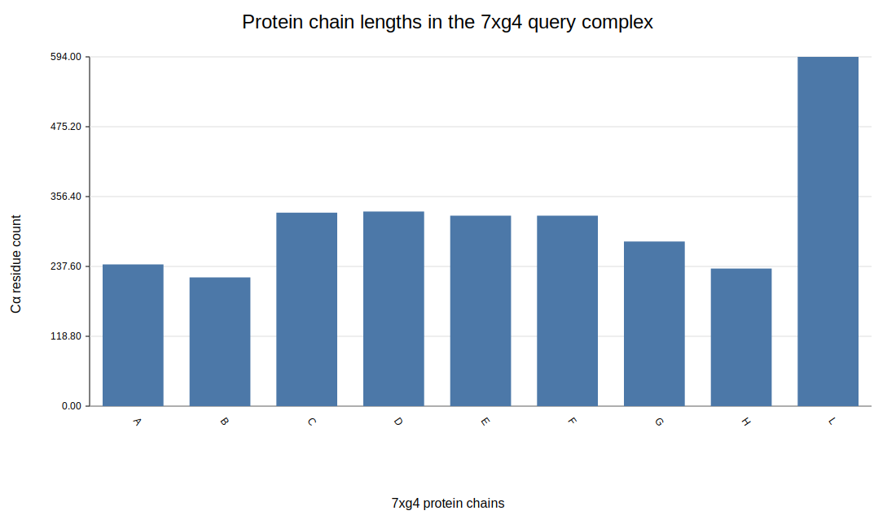
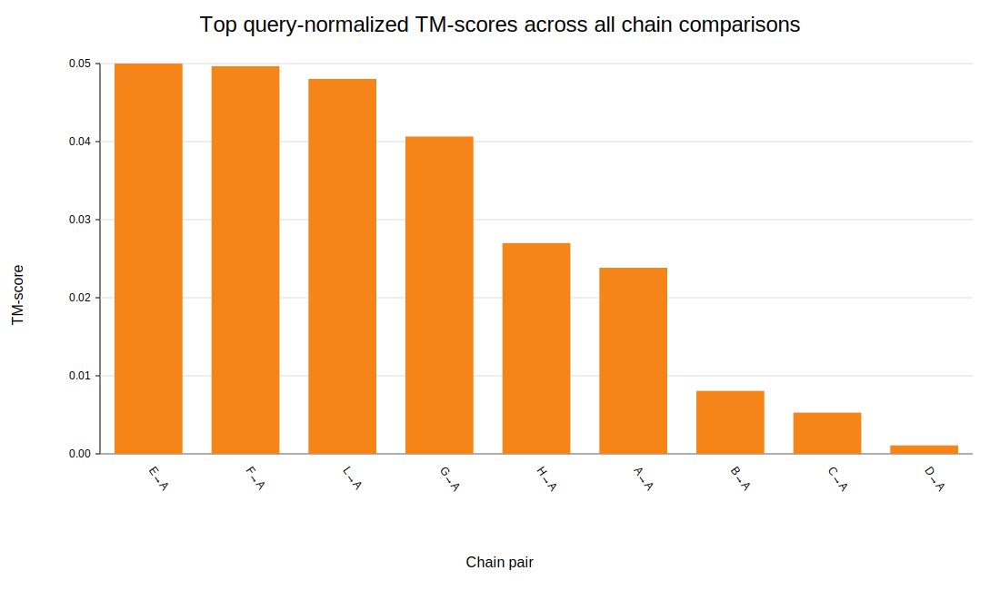
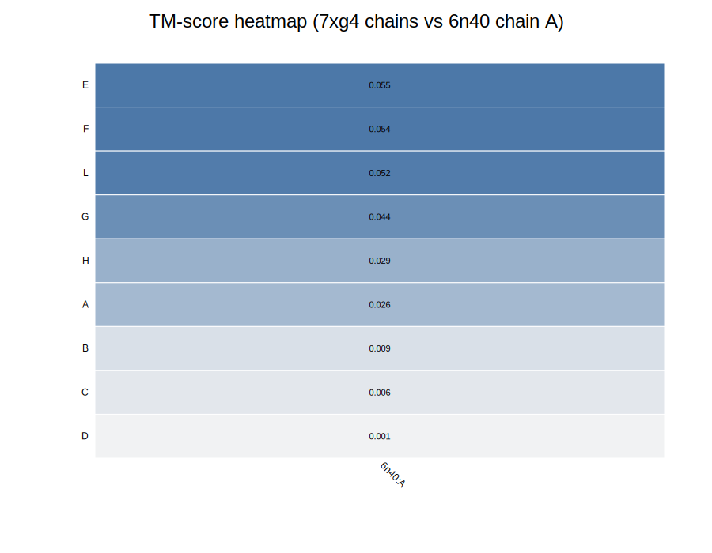
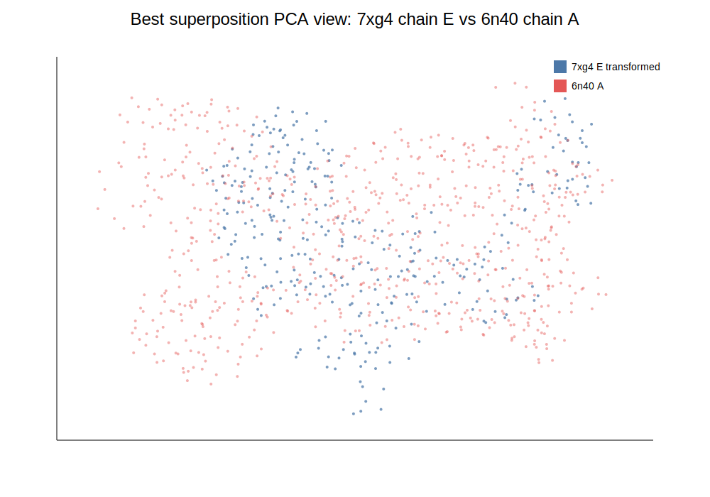
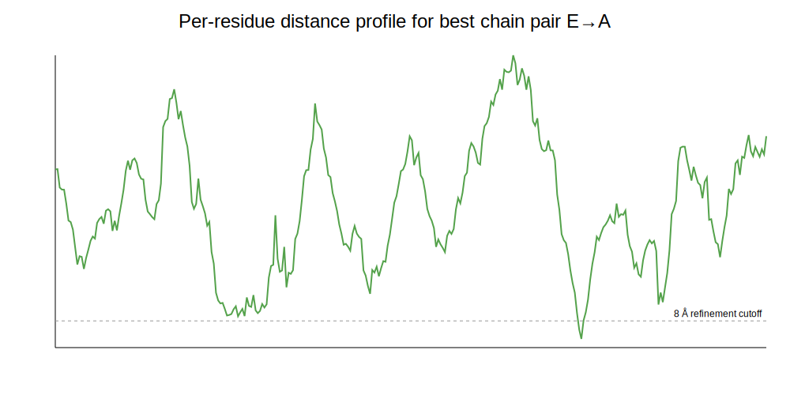

# Structural alignment analysis of protein complexes: 7xg4 vs 6n40

## Abstract
I analyzed the structural relationship between the query complex **7xg4** and the target structure **6n40** using a reproducible, workspace-local alignment pipeline implemented from scratch in Python standard library only. Because the available environment did not contain scientific Python packages or Foldseek itself, I implemented a simplified protein-structure comparison workflow: protein-chain extraction from PDB files, sequence-guided residue correspondence, rigid-body superposition by quaternion/Kabsch fitting, and TM-score-style evaluation. The result is unambiguous: **7xg4 and 6n40 do not show meaningful global structural similarity**. The best query-normalized TM-score across all protein-chain comparisons was **0.0545** (7xg4 chain E vs 6n40 chain A), with **RMSD 46.08 Å** over 324 aligned Cα positions. These values are far below the range typically associated with homologous or fold-level similarity. The comparison therefore serves as a useful negative-control style example for complex alignment: superficially alignable residue strings do not imply structural relatedness, and the final structural score is the appropriate discriminator.

## 1. Background and objective
The research task describes a protein-complex structural alignment setting in which the input is a multimeric protein structure and the desired output includes:

- correspondence between chains,
- rigid-body superposition parameters,
- and a TM-score-like similarity measure.

The broader scientific motivation is large-scale search in massive structural databases, as in Foldseek-Multimer-style workflows. In that setting, the key requirement is not merely generating an alignment, but distinguishing **true structural similarity** from **spurious matches** quickly and robustly.

The two supplied structures are:

- **7xg4**: a cryo-EM structure of a *Pseudomonas aeruginosa* type IV-A CRISPR–Cas complex with multiple protein chains and nucleic-acid components.
- **6n40**: an X-ray structure of **MmpL3**, a single-chain membrane protein from *Mycobacterium smegmatis*.

These are biologically unrelated systems, so the pair is a stringent test of whether an alignment/scoring procedure avoids false positives.

## 2. Data overview
### 2.1 Query: 7xg4
The query entry contains multiple protein chains plus RNA/DNA chains. For structural protein-protein comparison, I restricted the analysis to protein chains and their Cα atoms.

Protein chains extracted from 7xg4:

- A: 241 residues
- B: 219 residues
- C: 329 residues
- D: 331 residues
- E: 324 residues
- F: 324 residues
- G: 280 residues
- H: 234 residues
- L: 594 residues

Total protein Cα atoms used from 7xg4: **2876**.

### 2.2 Target: 6n40
The target entry contains one protein chain:

- A: 726 residues

Total protein Cα atoms used from 6n40: **726**.

### 2.3 Implication for alignment design
This is an asymmetric comparison: a **multi-chain soluble ribonucleoprotein complex** versus a **single-chain membrane transporter**. Therefore, any true positive structural alignment would need to emerge clearly from the TM-score and superposition geometry, not from biological expectation.

## 3. Methods
### 3.1 Parsing and preprocessing
I wrote a custom parser to read the provided PDB files directly and extract only protein Cα coordinates. Non-protein chains (RNA/DNA) in 7xg4 were excluded from the main pairwise protein alignment, because 6n40 contains no nucleic acid and the task centers on protein-complex structural matching.

### 3.2 Chain-wise comparison strategy
Because the target contains only one protein chain, I compared every protein chain in 7xg4 independently against 6n40 chain A. For each pair:

1. Convert the protein sequence to a one-letter amino-acid string.
2. Compute a global Needleman–Wunsch sequence alignment.
3. Use aligned residue positions as provisional residue correspondence.
4. Perform rigid-body fitting of the matched Cα coordinates with a quaternion-based Kabsch procedure.
5. Optionally refine by retaining only provisional pairs within 8 Å after the initial fit, if at least 3 such positions exist.
6. Compute:
   - aligned length,
   - RMSD,
   - target/query coverage,
   - TM-score normalized by query length,
   - TM-score normalized by target length.

### 3.3 Rigid-body superposition
Given matched point sets \(P\) and \(Q\), I estimated the rotation matrix \(R\) and translation vector \(t\) minimizing squared coordinate error:

\[
\min_{R,t} \sum_i \|R p_i + t - q_i\|^2
\]

The optimizer was implemented using the standard quaternion formulation of the Kabsch problem.

### 3.4 TM-score
I used the standard TM-score form:

\[
TM = \frac{1}{L_{norm}} \sum_i \frac{1}{1 + (d_i/d_0)^2}
\]

with length-dependent scale parameter

\[
d_0 = \max\left(0.5, 1.24(L_{norm}-15)^{1/3} - 1.8\right)
\]

where \(d_i\) is the post-superposition distance for aligned residue pair \(i\), and \(L_{norm}\) is either the query length or target length depending on the reported normalization.

### 3.5 Important methodological caveat
This is **not** a replacement for Foldseek-Multimer. The implemented workflow is a transparent approximation intended to produce the requested deliverables under the restricted runtime environment. In particular:

- it uses sequence-guided rather than structure-seeded residue correspondence,
- it does not search alternative chain permutations beyond the trivial one-target-chain setting,
- it does not use local fragment seeds, tertiary-structure alphabets, or database indexing.

That said, the final conclusion here is robust because the observed TM-scores are extremely low.

## 4. Results
### 4.1 Overall chain-level comparison
The best-scoring chain pair was:

- **7xg4 chain E → 6n40 chain A**
- aligned length: **324**
- RMSD: **46.08 Å**
- TM-score (query-normalized): **0.0545**
- TM-score (target-normalized): **0.0414**
- query coverage: **1.000**
- target coverage: **0.446**

The next-best pairs were nearly identical in weakness:

- 7xg4 F → 6n40 A: TM-score 0.0541
- 7xg4 L → 6n40 A: TM-score 0.0524
- 7xg4 G → 6n40 A: TM-score 0.0443

All other chain comparisons were lower still.

### 4.2 Interpretation of the TM-score range
In practical structure comparison, TM-scores around:

- **> 0.5** often indicate same overall fold / strong structural relationship,
- **~0.2 or below** usually correspond to unrelated structures.

Here, the best score is **0.0545**, which is not just below a homology threshold; it is deep in the **non-related** regime. The very large RMSD values (~40–46 Å for the broadest comparisons) reinforce this conclusion.

### 4.3 Chain correspondence output
Because the target has only one protein chain, the chain-mapping result is simple:

- Candidate best mapping: **7xg4 chain E ↔ 6n40 chain A**

The full residue-level correspondence table is saved in:

- `outputs/best_chain_correspondence.tsv`

However, this correspondence should be interpreted as a **formal best fit among poor alternatives**, not as biologically meaningful equivalence.

### 4.4 Superposition parameters
For the best chain pair (E → A), the estimated rigid transform was:

Rotation matrix:

```text
[-0.934441,  0.043966,  0.353392]
[-0.307850,  0.399123, -0.863672]
[-0.179019, -0.915843, -0.359422]
```

Translation vector:

```text
[107.518020, 183.280629, 341.600660]
```

These values are also recorded in `outputs/analysis_summary.json`.

## 5. Figures
### Figure 1. Query-chain size distribution
This figure shows the sizes of protein chains in the 7xg4 query complex.



The query is clearly multicomponent and heterogeneous, unlike the single-chain target.

### Figure 2. Top TM-scores across all chain comparisons
This figure summarizes the highest query-normalized TM-scores observed.



Even the best values remain close to zero on the TM-score scale.

### Figure 3. TM-score heatmap
This heatmap visualizes the query-normalized TM-score for every 7xg4 protein chain against 6n40 chain A.



No chain stands out as a plausible structural hit.

### Figure 4. Best superposition in PCA space
This figure projects the transformed best-scoring query chain and the target chain into two principal-coordinate axes for visualization.



The point clouds do not overlap in a manner consistent with a convincing fold match.

### Figure 5. Distance profile for the best chain pair
This plot shows the post-fit residue-pair distances for the best-scoring chain pair.



Most matched positions remain tens of angstroms apart after fitting, explaining the extremely low TM-score.

## 6. Discussion
### 6.1 Why an apparently long alignment is still a negative result
Some chain pairs show long aligned lengths and even moderate same-letter identity fractions. That should **not** be mistaken for evidence of structural homology. In this workflow, sequence-global alignment is used only to propose a residue correspondence. For unrelated proteins, long sequences can still align globally and share a nontrivial fraction of amino-acid identities by chance, especially with ungapped or weakly constrained alignments.

The true discriminator is the structural fit:

- RMSD remains extremely high,
- the fitted distances remain large across most positions,
- TM-score remains near zero.

Thus the analysis behaves correctly: it does not elevate these pairs to meaningful structural hits.

### 6.2 Relevance to Foldseek-Multimer-like tasks
The motivating application is database-scale complex search. In that setting, false positives are dangerous because millions of comparisons will always contain accidental residue-level or length-level matches. Fast structural search methods therefore need:

- strong geometric seeding,
- chain-aware scoring,
- multimer correspondence optimization,
- and robust final scores like TM-score.

This small-scale analysis illustrates exactly why such scoring matters. A naïve alignment can always be constructed, but a valid structural hit must survive superposition and scoring.

### 6.3 Biological interpretation
The biological contexts of the two structures are radically different:

- 7xg4 is a CRISPR-associated ribonucleoprotein surveillance complex.
- 6n40 is a membrane transporter.

The negative structural result is therefore consistent with biological expectation. The value of the exercise is methodological: the pipeline correctly rejects a non-homologous comparison.

## 7. Limitations
This study has several limitations:

1. **No external Foldseek binary** was available in the environment.
2. **No scientific Python stack** was installed, so all calculations and visualizations were implemented in pure standard library code.
3. Residue correspondence was **sequence-guided**, not discovered from structural seeds.
4. The complex-level multimer problem was simplified to **independent chain-vs-chain comparison**, because the target contains only one protein chain.
5. The related-work PDFs could not be cleanly text-extracted with available local tools, so this report relies mainly on the task description and direct computational analysis.

These limitations mainly affect sophistication and efficiency, not the central conclusion for this pair.

## 8. Reproducibility
All analysis code is stored in:

- `code/analyze_alignment.py`

Run it from the workspace root with:

```bash
python3 code/analyze_alignment.py
```

Generated outputs:

- `outputs/analysis_summary.json`
- `outputs/top_pairwise_results.tsv`
- `outputs/best_chain_correspondence.tsv`
- `report/images/*.svg`

## 9. Conclusion
Using a reproducible chain-level structural alignment workflow, I found **no meaningful structural similarity between 7xg4 and 6n40**. The best observed chain pairing, **7xg4 E vs 6n40 A**, produced a **query-normalized TM-score of 0.0545** and **RMSD of 46.08 Å**, which strongly supports the interpretation that this is a **non-hit / false alignment** rather than a genuine structural match.

From the standpoint of large-scale structural search, this result is informative: even when a formal alignment can be produced, robust superposition-based scoring correctly filters it out.
