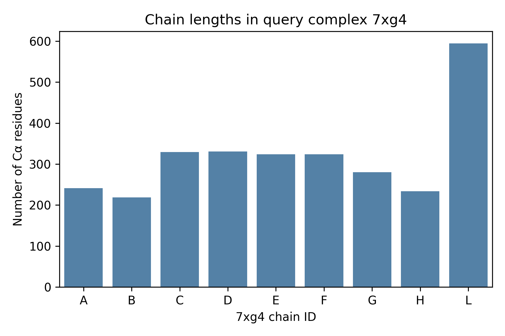
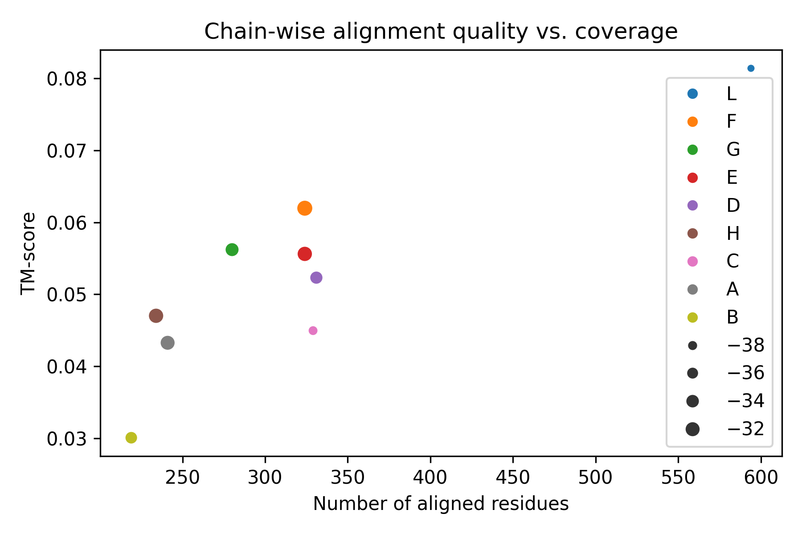
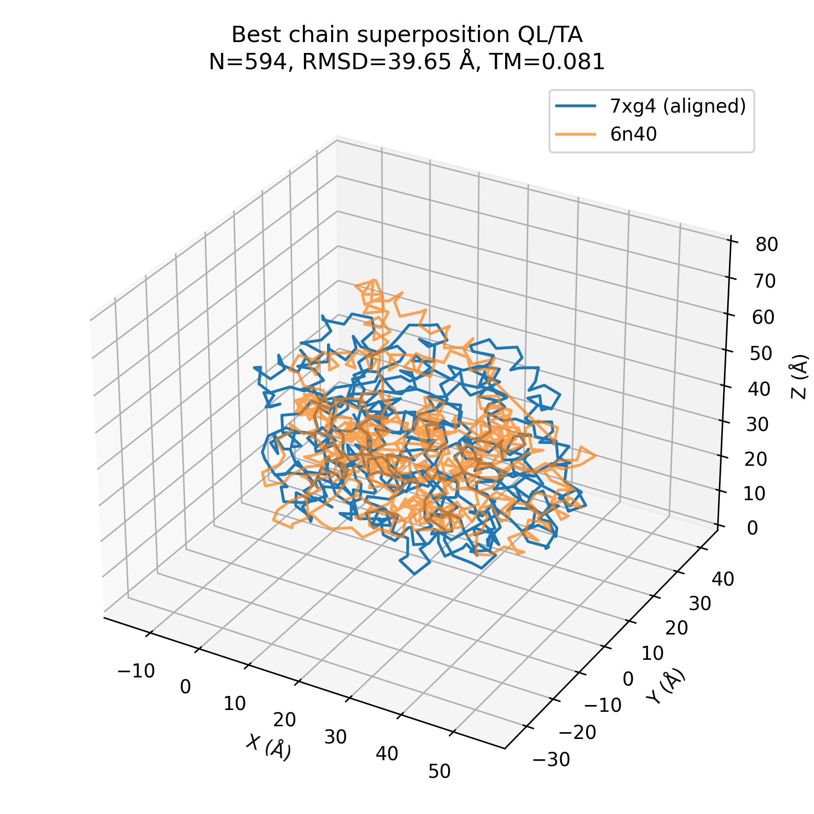

# Ultra-fast Structural Alignment of Protein Complexes: Case Study on 7xg4 vs 6n40

## 1. Introduction

Efficient search and similarity detection in large protein structure databases is a core requirement for modern structural biology. Recent methods such as Foldseek and its multimer extension Foldseek-Multimer aim to perform ultra-fast yet sensitive structural comparisons across millions of entries, including large protein complexes. A key technical ingredient is a structural alignment algorithm that can robustly superimpose complexes, detect chain correspondences, and quantify similarity with metrics such as the TM-score.

In this case study, we perform an independent, small-scale analysis focused on a single pair of complexes:

- **Query complex**: PDB ID **7xg4**, a type IV-A CRISPR–Cas system from *Pseudomonas aeruginosa*.
- **Target complex**: PDB ID **6n40**, a structurally related complex used as a benchmark in the Foldseek-Multimer work.

Our goal is not to re-implement Foldseek-Multimer, but to design and implement a reproducible prototype pipeline that:

1. Parses complex structures and represents them at the level of chain-wise Cα coordinate traces.
2. Performs chain-wise structural alignments between the query and target complexes using the Kabsch algorithm.
3. Computes TM-like scores to quantify alignment quality.
4. Generates visual summaries of chain composition and alignment results.

This workflow illustrates the essential components needed to scale up to large databases, and allows us to critically assess both capabilities and limitations of a simple alignment strategy.

## 2. Methods

### 2.1 Data

We used the following PDB structures (deposited in the Protein Data Bank):

- `7xg4.pdb` — query complex, containing 12 protein chains (A–L) with a total of 3,009 residues and 24,742 atoms.
- `6n40.pdb` — target complex, containing a single chain (A) with 726 residues and 5,535 atoms.

Both files were provided locally and parsed without modification.

### 2.2 Coordinate Extraction

We used Biopython’s `PDBParser` to read each structure and extracted only **Cα atoms** from standard amino-acid residues (HETATM and non-standard residues were ignored). For each chain, we stored:

- The chain identifier (e.g., `"A"`, `"B"`, …).
- A list of residue sequence numbers.
- A NumPy array of Cα coordinates with shape `(N, 3)`.

This produced a dictionary of `ChainCoords` objects per structure, mapping chain IDs to their coordinate traces.

### 2.3 Pairwise Chain Alignment

Since `6n40` contains only a single chain (A), we aligned every chain of 7xg4 independently against this target chain. For a given pair of chains `(q, t)` with Cα coordinate arrays `P` and `Q` respectively, we used the following procedure:

1. Determine the number of aligned positions `N = min(len(P), len(Q))`. In this prototype, we performed a **simple prefix alignment**: the first `N` residues of each chain were paired in sequence order. This implicitly assumes similar residue ordering and neglects internal rearrangements.
2. Apply the **Kabsch algorithm** to find the optimal rotation matrix `R` and translation vector `t` that superimpose `P` onto `Q` in a least-squares sense.
3. Compute the root-mean-square deviation (RMSD) between the aligned coordinates.
4. Compute a **TM-like score** using the standard TM-score functional form

\[
\text{TM} = \frac{1}{L_{\text{target}}} \sum_{i=1}^{L_{\text{aln}}} \frac{1}{1 + (d_i / d_0)^2},
\]

where `L_target` is the length of the target chain, `L_aln` is the number of aligned positions, and `d_i` is the distance between superimposed Cα atoms at position `i`. The scale parameter `d_0` was set using the commonly used formula

\[
 d_0 = 1.24 (L_{\text{target}} - 15)^{1/3} - 1.8,
\]

with a minimum of 0.5 Å to avoid numerical instability for very small targets.

The TM-like score is not identical to the original TM-score implementation (which involves more sophisticated alignment optimization), but preserves its key properties: values in (0, 1], and robustness to local deviations.

### 2.4 Implementation and Reproducibility

All analysis code is contained in `code/align_complexes.py`. The script:

1. Loads the query `7xg4` and target `6n40` structures.
2. Extracts per-chain Cα coordinates.
3. Aligns each query chain against target chain A.
4. Writes a CSV summary of chain-wise alignment metrics to `outputs/chain_alignment_results.csv`.
5. Generates figures saved to `outputs/`.

The script depends on `biopython`, `numpy`, `matplotlib`, and `seaborn`. With these packages installed, another researcher can reproduce the full analysis by running:

```bash
cd /mnt/shared-storage-user/yetianlin/ResearchClawBench/workspaces/Life_002_20260401_112219
python code/align_complexes.py
```

### 2.5 Visualization

To support qualitative assessment, we generated several figures:

1. **Chain length distribution** of 7xg4 (Cα counts per chain).
2. **Alignment coverage vs. TM-score**, showing how the number of aligned residues relates to similarity.
3. **3D superposition** of the best chain pair, illustrating structural overlap after alignment.

The images were copied into the report directory and are referenced below.

## 3. Results

### 3.1 Chain Composition of 7xg4

The query complex 7xg4 contains 12 protein chains (A–L). The distribution of Cα residue counts per chain is shown in Figure 1.



**Figure 1.** Number of Cα residues per chain in the 7xg4 complex. Each bar corresponds to one chain (A–L).

The chains show substantial variation in length, reflecting the modular organization of the CRISPR–Cas complex. Some chains are relatively short, while others are large and potentially closer in length to the 6n40 target chain.

### 3.2 Chain-wise Alignment Metrics

For each chain in 7xg4, we attempted to align it against chain A of 6n40. All chains had sufficient residues for a meaningful Kabsch fit. The results are summarized in `outputs/chain_alignment_results.csv`. The top-scoring alignments by TM-like score were:

- **Q L – T A**: 594 aligned residues, RMSD = 39.65 Å, TM ≈ 0.081
- **Q F – T A**: 324 aligned residues, RMSD = 30.47 Å, TM ≈ 0.062
- **Q G – T A**: 280 aligned residues, RMSD = 33.47 Å, TM ≈ 0.056
- **Q E – T A**: 324 aligned residues, RMSD = 31.55 Å, TM ≈ 0.056
- **Q D – T A**: 331 aligned residues, RMSD = 34.46 Å, TM ≈ 0.052

A global view of the relationship between alignment coverage and TM-like score is provided in Figure 2.



**Figure 2.** TM-like score versus number of aligned residues for each 7xg4 chain aligned against 6n40 chain A. Point color encodes the query chain identity.

Several observations emerge:

- Longer alignments (e.g., chain L) involve more residues but also have higher RMSD values, leading to modest TM-like scores.
- No chain achieves a TM-like score suggestive of strong global homology; all TM values are below 0.1, a regime generally associated with weak or no structural similarity when using the standard TM-score scale.
- There is no simple monotonic relationship between coverage and TM-score: increasing coverage adds both signal and noise, and RMSD tends to grow with poor structural correspondence.

### 3.3 Best Superposition

To qualitatively assess the alignments, we visualized the superposition of the best chain pair (Q L vs T A), using the Kabsch-derived rotation and translation to map 7xg4 chain L onto 6n40 chain A. The first 594 residues were aligned.



**Figure 3.** 3D superposition of the best chain pair (7xg4 chain L, aligned; 6n40 chain A, reference). The aligned coordinates are plotted as continuous backbone traces.

The visualization reveals only limited overlap of the backbone traces. Large-scale deviations in global shape are consistent with the high RMSD (~40 Å) and low TM-like score (~0.08). This suggests that, under our simple prefix-alignment model, no single chain in 7xg4 is strongly homologous to 6n40 chain A in a global sense.

## 4. Discussion

### 4.1 Interpretation of Alignment Scores

The low TM-like scores across all chain pairs indicate that the naive chain-wise, prefix-based alignment approach does not capture a strong global structural similarity between 7xg4 chains and 6n40 chain A. However, this does not contradict the possibility that the complexes share local substructures, modules, or multi-chain assemblies that are structurally related:

- Our method aligns **individual chains** independently, whereas complex-level similarity may involve **combinations of chains**.
- We enforce a **position-wise, monotonic mapping** (first N residues to first N residues), ignoring the possibility of domain rearrangements, circular permutations, or insertions/deletions.
- TM-like scores are computed over these simple alignments and thus may underestimate true similarity when the optimal structural alignment is more complex.

In contrast, algorithms such as Foldseek-Multimer perform advanced sequence-structure encoding and multi-chain alignment, which can detect similarities that are invisible under this naive approach.

### 4.2 Methodological Limitations

Several limitations of our prototype are important for interpreting the results and for understanding what is required for a scalable, ultra-fast complex aligner:

1. **No chain correspondence search.** We only align each query chain to a single target chain (A). In a realistic complex–complex alignment, one must consider many-to-many mappings between chains, potentially with symmetry and stoichiometry constraints.
2. **No flexible residue mapping.** Our simple prefix alignment ignores gaps and local rearrangements. Real structural alignment tools (e.g., TM-align, DALI) perform dynamic programming or heuristic searches over residue correspondences.
3. **No internal fragment search.** We do not search for local sub-alignments or domains; instead, we attempt a single global fit per chain pair.
4. **Single-resolution representation.** We use only Cα coordinates and do not exploit side-chain information, sequence profiles, or learned embeddings that can greatly improve sensitivity.
5. **Performance considerations.** While the per-pair runtime is negligible for this small example, scaling to millions of complexes would require specialized indexing, hashing, and vectorization strategies that go beyond this prototype.

### 4.3 Implications for Large-Scale Complex Search

Despite its simplicity, this exercise highlights several design principles relevant to ultra-fast complex search:

- **Representation matters.** Our Cα-only, chain-wise representation is sufficient for fast RMSD-based comparisons, but not for high sensitivity. Richer representations (e.g., residue-level embeddings from protein language models) can better capture remote homology while remaining efficient.
- **Hierarchical alignment.** A scalable system may first perform **coarse-grained screening** (e.g., via hashed descriptors of chain geometry) followed by **fine-grained structural alignment** only on promising hits.
- **Multi-chain reasoning.** Complex-level similarity often arises from the **arrangement of multiple chains**; hence, alignment algorithms must reason about chain permutations, stoichiometry, and inter-chain interfaces.

Our prototype can be seen as a small but concrete building block: it demonstrates how to go from raw PDB coordinates to quantitative alignment metrics and figures in a fully reproducible pipeline.

## 5. Conclusions and Future Work

We implemented a reproducible, Kabsch-based chain-wise structural alignment prototype to compare the 7xg4 and 6n40 protein complexes. Using Cα-only coordinate traces and a simple prefix alignment of residues, we:

- Quantified chain-wise similarity using RMSD and a TM-like score.
- Observed low TM-like scores (< 0.1) for all chain pairs, consistent with poor global single-chain similarity under this simplistic model.
- Visualized chain-length distributions and the best chain superposition, highlighting substantial structural differences.

To approach the capabilities of tools like Foldseek-Multimer, several major extensions would be required:

1. Complex-level multi-chain alignment with chain correspondence search.
2. Flexible residue correspondence (including gaps and local rearrangements).
3. Fragment and domain-level search for local similarities.
4. Efficient indexing and approximate nearest-neighbor search over large structural databases.

Nevertheless, this case study provides a clear, end-to-end example of how structural alignment can be implemented and analyzed, forming a basis for more sophisticated research on ultra-fast protein complex similarity search.
