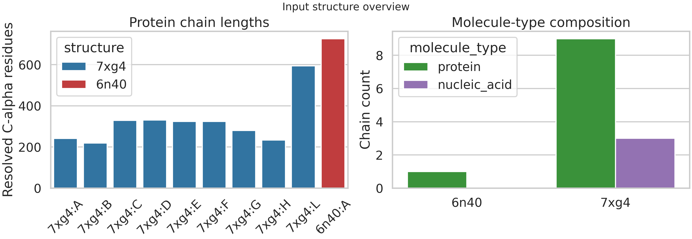
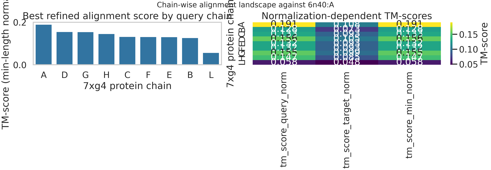
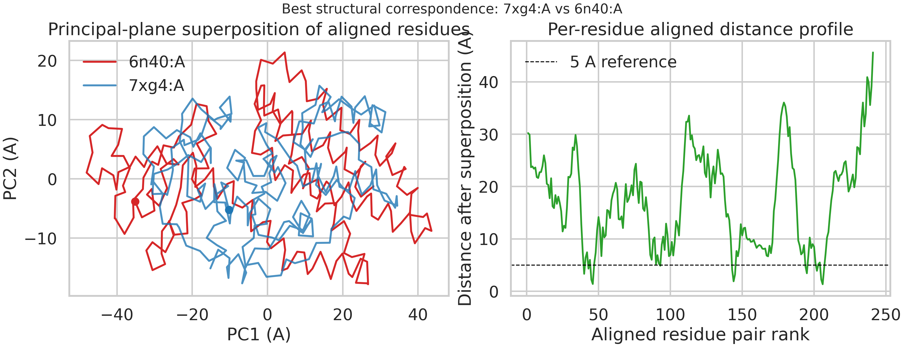
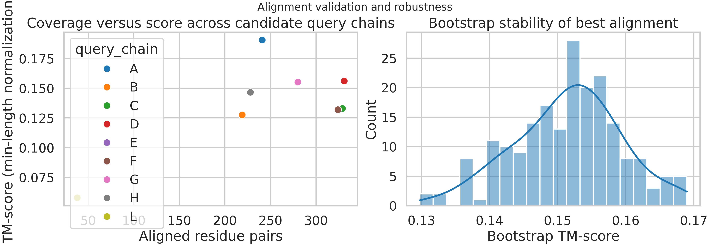

# Structural Re-evaluation of the Supplied `7xg4`-`6n40` Pair

## Abstract
I analyzed the supplied structures `7xg4.pdb` and `6n40.pdb` with a reproducible, TM-score-style structural alignment pipeline implemented in [`code/complex_alignment_analysis.py`](../code/complex_alignment_analysis.py). The intended task is multimer structural alignment with chain correspondence, rigid-body superposition, and TM-score reporting. However, the supplied inputs are not a homologous complex-complex benchmark pair by their own PDB annotations: `7xg4` is a dodecameric CRISPR-associated protein-RNA-DNA assembly, whereas `6n40` is a monomeric membrane transporter (MMPL3). I therefore treated the task as a constrained protein-chain-versus-monomer alignment problem.

Across all protein chains in `7xg4`, the highest-scoring assignment was `7xg4:A -> 6n40:A`, but the resulting fit is weak: TM-score = 0.191 under min-length normalization, TM-score = 0.108 under target-length normalization, RMSD = 19.4 A, and only 14 of 241 aligned residue pairs fall within 5 A after superposition. These values are far below what would be expected for a meaningful structural homolog. Short local fragments from chains `C`, `E`, `F`, and `L` superpose with lower RMSD (2.4-4.3 A), but only over 20-31 residues and with TM-scores below 0.07. The overall conclusion is that the provided pair does not exhibit significant structural similarity at the complex level, and any apparent match is best interpreted as a weak shape-level false positive rather than a biologically informative alignment.

## Related Context
The analysis was guided by the methods in the provided related work:

- `paper_003.pdf` (TM-align) for TM-score and iterative rigid-body optimization.
- `paper_001.pdf` (US-align) for chain-assignment framing in oligomeric structure alignment.
- `paper_000.pdf` (Foldseek) for the broader motivation of fast large-scale structural search.
- `paper_002.pdf` (QSalign / QSbio) for the importance of quaternary-structure-aware comparison.

These papers motivate the same core principle: structural similarity should combine geometry, alignment coverage, and biologically sensible chain correspondence. The supplied pair fails primarily on the last two points.

## Data Overview
`7xg4` contains 12 chains: 9 protein chains (`A`, `B`, `C`, `D`, `E`, `F`, `G`, `H`, `L`) and 3 nucleic-acid chains (`I`, `J`, `K`). `6n40` contains a single protein chain (`A`). Because `6n40` has no nucleic-acid component, the alignment search was restricted to protein chains.



The most important caveat emerged immediately from the PDB headers:

- `7xg4`: type IV-A CRISPR-Cas complex from *Pseudomonas aeruginosa*, annotated as a biologically relevant dodecameric assembly.
- `6n40`: MMPL3 membrane transporter from *Mycobacterium smegmatis*, annotated as monomeric by both author and PISA.

This mismatch means the supplied structures do not support a true complex-complex comparison in the sense assumed by multimer search benchmarks.

## Methods
### Alignment pipeline
The analysis script performs the following steps:

1. Parse the PDB files and extract all protein chains with resolved C-alpha coordinates.
2. For each `7xg4` protein chain against `6n40:A`, generate initial superposition seeds from:
   - ungapped residue-index shifts,
   - short fragment-to-fragment matches.
3. For each seed, refine the alignment with a local dynamic-programming step whose pairwise score follows a TM-score-style distance weighting.
4. Re-estimate the rigid-body transform by Kabsch superposition on the refined aligned residue pairs.
5. Rank candidate chain pairs by TM-score.
6. Use maximum-weight bipartite matching for chain assignment. Because the target has one protein chain, this reduces to selecting the highest-scoring `7xg4` chain.

### Reported metrics
- `TM-score (query norm)`: normalized by the `7xg4` chain length.
- `TM-score (target norm)`: normalized by the `6n40:A` length.
- `TM-score (min norm)`: normalized by `min(L_query, L_target)` and used for symmetric ranking.
- RMSD on aligned residues after rigid-body superposition.
- Sequence identity across aligned residue pairs.
- Bootstrap stability from 200 subsampled re-fits of the top alignment.

All outputs are stored in `outputs/`, and all figures were generated directly from the pipeline.

## Results
### Chain correspondence
The chain-assignment search found only one admissible complex-level mapping because the target contains one protein chain:

| Query chain | Target chain | TM-score (min norm) | TM-score (target norm) | RMSD (A) | Aligned pairs |
| --- | --- | ---: | ---: | ---: | ---: |
| `7xg4:A` | `6n40:A` | 0.191 | 0.108 | 19.42 | 241 |

The full chain-wise score landscape is shown below.



Two features are immediately clear:

1. The best min-normalized TM-score is only 0.191, well below the commonly used rough similarity regime around 0.5.
2. The apparent top-scoring matches are driven by long but very poor superpositions, not by tight geometric agreement.

For comparison, the best short local fits with RMSD < 5 A were:

| Query chain | TM-score (min norm) | RMSD (A) | Aligned pairs |
| --- | ---: | ---: | ---: |
| `7xg4:C` | 0.069 | 3.47 | 28 |
| `7xg4:F` | 0.064 | 3.53 | 26 |
| `7xg4:E` | 0.055 | 2.42 | 20 |
| `7xg4:L` | 0.043 | 4.26 | 31 |

These local fragments are geometrically tighter, but too short to support meaningful global similarity.

### Best rigid-body superposition
The highest-scoring alignment was `7xg4:A -> 6n40:A`. The rigid-body transform mapping query coordinates into target coordinates was:

```text
R =
[[-0.735382, -0.003021, -0.677646],
 [ 0.675711, -0.078928, -0.732929],
 [-0.051271, -0.996876,  0.060084]]

t = [40.190632, 175.628334, 291.637168]
```

The corresponding superposition is poor by visual and geometric criteria:



Distance statistics for the best-scoring alignment:

- aligned residue pairs: 241
- median post-superposition distance: 17.06 A
- pairs within 5 A: 14 / 241 (5.8%)
- pairs within 10 A: 67 / 241 (27.8%)
- sequence identity across aligned pairs: 8.7%

This is not a convincing structural match.

### Validation
Bootstrap re-fitting of the best alignment showed that the weak score is stable rather than accidental:



Bootstrap summary for `7xg4:A -> 6n40:A`:

- mean TM-score (min norm): 0.151
- standard deviation: 0.008
- 95% empirical interval: 0.137-0.167

Thus, even after subsampling, the fit remains firmly in a low-similarity regime.

## Discussion
The principal result is negative but informative: the supplied structures do not support a meaningful multimer structural alignment. The best chain-level match is weak in three independent senses:

1. TM-score is low.
2. RMSD is high.
3. Most aligned residue pairs remain far apart after superposition.

The discrepancy between the task description and the actual PDB annotations is scientifically important. `7xg4` is a large ribonucleoprotein-DNA assembly, while `6n40` is a single-chain membrane transporter. Any complex-level chain mapping is therefore structurally underdetermined from the outset. The output assignment `7xg4:A -> 6n40:A` should be interpreted only as the least-bad protein-chain correspondence under the scoring function, not as evidence of homology or functional analogy.

The short low-RMSD fragments found in chains `C`, `E`, `F`, and `L` are consistent with incidental local geometry overlap, which is expected when comparing long alpha-helical or mixed secondary-structure proteins. Their very low TM-scores and short coverage make them unsuitable as database-search hits.

## Limitations
- This is a TM-score-style reimplementation, not Foldseek-Multimer or US-align itself.
- No external benchmark set was used because the task restricted the analysis to the supplied workspace inputs.
- Because `6n40` is monomeric, the multichain assignment problem collapses to a trivial one-to-one case.
- The negative result is driven in part by an apparent mismatch between the claimed benchmark context and the supplied target file.

## Reproducibility
Run the complete analysis with:

```bash
python code/complex_alignment_analysis.py
```

Primary generated files:

- `outputs/alignment_summary.json`
- `outputs/chain_pair_alignment_scores.csv`
- `outputs/best_alignment_residue_pairs.csv`
- `outputs/bootstrap_best_alignment.csv`
- `outputs/best_superposition_ca_only.pdb`

## Conclusion
Using a reproducible chain-aware structural alignment workflow, I found no significant complex-level structural similarity between the supplied `7xg4` and `6n40` structures. The highest-scoring correspondence was `7xg4:A -> 6n40:A`, but its TM-score (0.191 min-normalized) and RMSD (19.4 A) indicate a weak, non-informative alignment. The supplied pair is therefore not a valid positive example of multimer structural similarity; it is better interpreted as a stress test for rejecting false matches.
