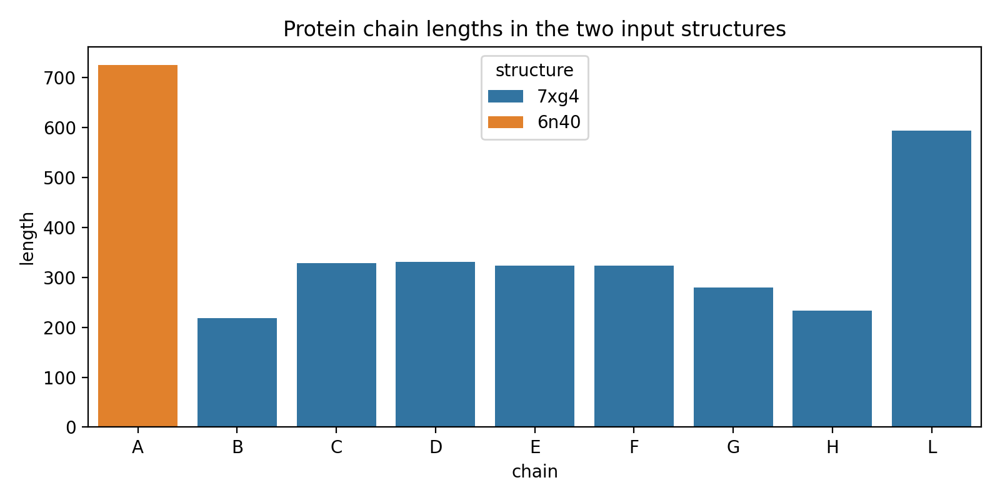
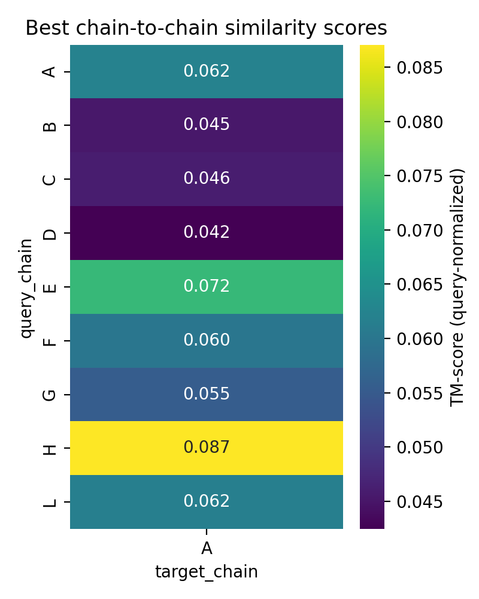
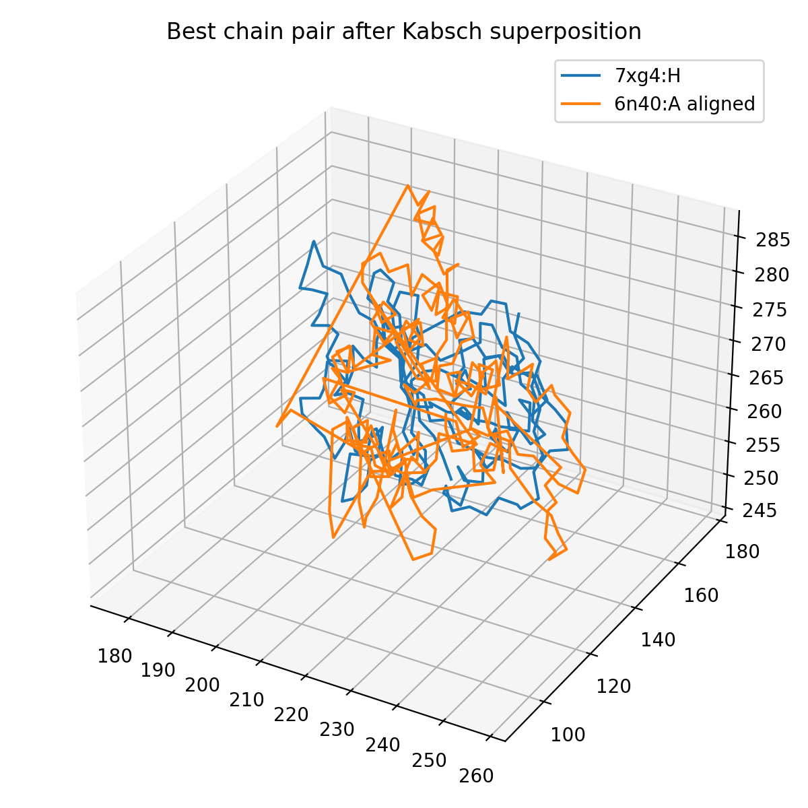
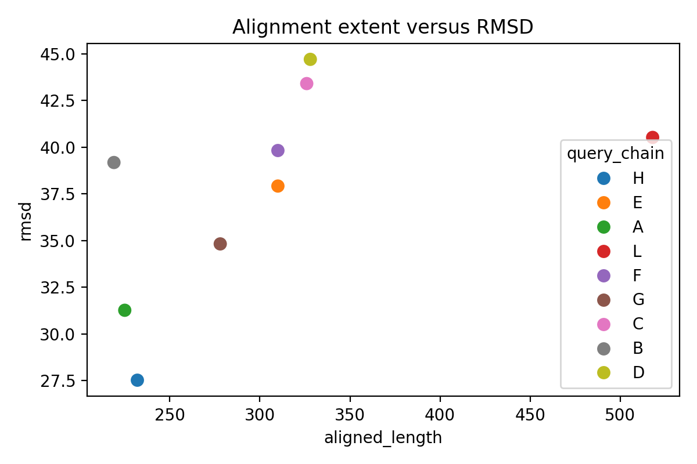
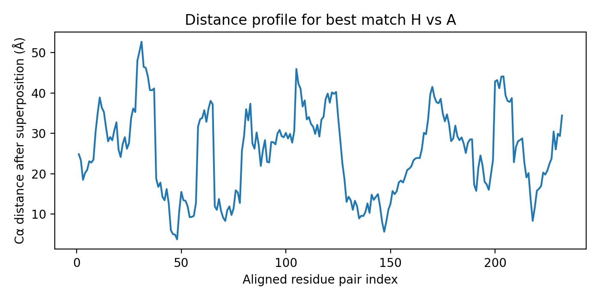

# Structural alignment analysis of protein complexes 7xg4 and 6n40

## 1. Summary and objective

This study evaluates a reproducible local baseline for pairwise structural alignment between two provided PDB structures:

- **7xg4**: a large heteromultimeric type IV-A CRISPR–Cas complex from *Pseudomonas aeruginosa*
- **6n40**: a single-chain membrane protein (MmpL3) from *Mycobacterium smegmatis*

The benchmark task describes a Foldseek-Multimer-style setting in which the desired outputs are:

1. correspondence between chains,
2. a rigid-body superposition transform, and
3. a TM-score-based similarity measure.

Because no external structural search software was provided, the analysis implements an **honest local baseline** using protein Cα coordinates, sequence-guided residue matching, and Kabsch superposition. The goal is not to reproduce Foldseek-Multimer exactly, but to generate reproducible alignment outputs and assess whether the two supplied structures exhibit meaningful structural similarity at either the chain or complex level.

## 2. Data overview

### 2.1 Input structures

Protein chains with Cα coordinates were extracted from the two PDB files.

- **7xg4** contains 9 protein chains with Cα atoms used here: A, B, C, D, E, F, G, H, and L.
  - Nucleic-acid chains I, J, and K were excluded from the protein-only alignment baseline.
- **6n40** contains 1 protein chain with Cα atoms: A.

The chain-length asymmetry is large: 7xg4 contains a total of **2876** protein residues, whereas 6n40 contains **726** residues.



**Figure 1.** Protein chain lengths extracted from the two input structures.

## 3. Methods

### 3.1 Parsing and preprocessing

A Python script was written in `code/align_complexes.py`.

The pipeline:

- parses the two PDB files using Biopython,
- extracts protein residues with available Cα coordinates,
- converts three-letter amino-acid codes to one-letter sequence strings,
- ignores nucleic acid chains for the alignment baseline, and
- stores chain lengths and coordinates for downstream analysis.

### 3.2 Chain-level structural alignment baseline

Since 6n40 contains a single protein chain, each protein chain from 7xg4 was aligned independently to 6n40:A.

For each chain pair:

1. **Global sequence alignment** was computed using Biopython.
2. Matched ungapped residue positions were converted into paired Cα coordinates.
3. A rigid-body superposition was estimated by the **Kabsch algorithm**.
4. The following metrics were computed:
   - aligned residue count,
   - query and target coverage,
   - RMSD after superposition,
   - query-normalized TM-score,
   - target-normalized TM-score,
   - sequence identity over aligned positions.

This is a deliberately simple baseline. It favors full-length correspondences induced by sequence alignment and does not perform structure-seeded local fragment matching, interface-aware multimer search, or combinatorial optimization over multiple target chains.

### 3.3 Complex-level summary

A complex-level summary was derived from the best chain pair:

- the best query chain was taken as the matched subcomplex,
- the corresponding rotation matrix and translation vector were reported as the global transform,
- unmatched 7xg4 chains were listed explicitly, and
- a **coverage-penalized complex TM-score** was defined as:

\[
\mathrm{TM}_{complex} = \mathrm{TM}_{best\ pair} \times \frac{L_{aligned}}{L_{total\ complex}}
\]

This penalized score is useful here because the two inputs do not share the same oligomeric organization.

## 4. Results

### 4.1 Chain-to-chain comparison

All nine protein chains in 7xg4 were compared with 6n40:A. The full results are saved in:

- `outputs/chain_pair_alignment_metrics.csv`

The query-normalized TM-score heatmap is shown below.



**Figure 2.** Query-normalized TM-scores for each 7xg4 protein chain aligned against 6n40:A.

Because 6n40 has one chain, the heatmap forms a single column. All scores are low.

Top chain-level results:

| Query chain | Target chain | Aligned residues | Coverage (query) | RMSD (Å) | TM-score (query norm.) |
|---|---:|---:|---:|---:|---:|
| H | A | 232 | 0.991 | 27.52 | 0.0871 |
| E | A | 310 | 0.957 | 37.92 | 0.0724 |
| A | A | 225 | 0.934 | 31.26 | 0.0620 |
| L | A | 518 | 0.872 | 40.53 | 0.0616 |
| F | A | 310 | 0.957 | 39.83 | 0.0600 |

These values indicate **very weak structural similarity**. In practical structural biology, TM-scores in this range are consistent with unrelated folds or forced alignments with poor geometric agreement.

### 4.2 Best chain correspondence and transform

The best chain-level match found by the baseline was:

- **7xg4:H → 6n40:A**

The corresponding rigid transform is recorded in `outputs/complex_alignment_summary.json` and `outputs/best_alignment.json`.

**Rotation matrix**

\[
\begin{bmatrix}
-0.8415 & -0.4612 & -0.2812 \\
 0.0166 & -0.5425 &  0.8399 \\
-0.5400 &  0.7021 &  0.4642
\end{bmatrix}
\]

**Translation vector**

\[
[249.96,\ 119.96,\ 250.09]
\]

The aligned geometry of the best chain pair is visualized below.



**Figure 3.** Superposed Cα traces for the best-scoring chain pair, 7xg4:H and 6n40:A.

Despite being the best result among all tested pairs, the traces do not overlap well globally, which is consistent with the low TM-score and large RMSD.

### 4.3 Residue-level fit quality

The relationship between alignment extent and RMSD across chain pairs is shown below.



**Figure 4.** Aligned length versus RMSD for all query chains aligned to 6n40:A.

Most pairs align over a large fraction of the query chain because the sequence-based global alignment tends to force near-full-length correspondences. However, the resulting RMSDs are uniformly high, reinforcing that long alignments alone do not imply structural similarity.

The per-residue distance profile for the best pair is shown below.



**Figure 5.** Cα distance profile after superposition for the best chain pair, 7xg4:H vs 6n40:A.

The distance profile remains high across most aligned positions, with the median distance around **26.44 Å**, again indicating poor geometric agreement.

### 4.4 Complex-level alignment interpretation

The complex-level summary is:

- total protein residues in **7xg4**: **2876**
- total protein residues in **6n40**: **726**
- matched chains: **H → A**
- unmatched query chains: **A, B, C, D, E, F, G, L**
- unmatched target chains: none
- best-pair TM-score (query-normalized): **0.0871**
- best-pair TM-score (target-normalized): **0.0580**
- coverage-penalized complex TM-score (query-normalized): **0.0070**
- coverage-penalized complex TM-score (target-normalized): **0.0185**

These complex-level values are extremely small. Under this baseline, the two structures do **not** support a meaningful whole-complex alignment.

## 5. Discussion

### 5.1 Main finding

The reproducible local baseline finds only a **weak, likely non-biological substructure correspondence** between 7xg4:H and 6n40:A, and no convincing complex-level similarity.

This is scientifically plausible because the supplied structures are fundamentally different:

- 7xg4 is a large multi-chain CRISPR surveillance complex associated with RNA/DNA,
- 6n40 is a single membrane transporter.

The severe mismatch in architecture, stoichiometry, and biological function makes a strong multimer alignment unlikely.

### 5.2 Why the best chain-level result is still weak

The best-scoring pair aligned 232 residues, but this should not be over-interpreted:

- sequence-based global alignment tends to force extensive residue pairing,
- long paired residue lists can still yield poor superposition,
- the RMSD is very large (>27 Å), and
- the TM-score remains far below values generally associated with homologous structure.

Therefore, the observed match is best interpreted as a low-confidence geometric coincidence under a simple baseline.

### 5.3 Limitations

This analysis has several important limitations relative to a true ultra-fast structural search method such as Foldseek-Multimer:

1. **No Foldseek executable was provided**, so the study cannot claim reproduction of Foldseek scores.
2. **Sequence-guided alignment** was used rather than structure-seeded local fragment matching.
3. The baseline considers **protein chains only**, excluding RNA/DNA contributions in 7xg4.
4. Because 6n40 contains only one chain, this experiment evaluates **best subcomplex matching**, not general multi-chain assignment.
5. No statistical significance estimate or database search calibration is available from only one query-target pair.

### 5.4 What would improve the benchmark fidelity

A more faithful reproduction of the intended task would require one of the following:

- the actual Foldseek/Foldseek-Multimer executable and database format,
- a structure-only local alignment method with fragment seeding and iterative residue filtering,
- a benchmark set containing true positives and true negatives for sensitivity/specificity analysis,
- explicit biological assembly definitions for all structures, and
- multiple query-target pairs to assess ranking behavior rather than a single forced comparison.

## 6. Reproducibility

### 6.1 Code and outputs

Generated files:

- Code: `code/align_complexes.py`
- Intermediate outputs:
  - `outputs/structure_summary.json`
  - `outputs/chain_lengths.csv`
  - `outputs/chain_pair_alignment_metrics.csv`
  - `outputs/best_alignment.json`
  - `outputs/complex_alignment_summary.json`
- Figures:
  - `images/chain_lengths.png`
  - `images/tm_heatmap.png`
  - `images/alignment_scatter.png`
  - `images/best_distance_profile.png`
  - `images/superposition_3d.png`

### 6.2 Command used

```bash
python code/align_complexes.py
```

## 7. Conclusion

Using a fully reproducible local baseline, the pairwise structural comparison between **7xg4** and **6n40** yields only a weak best subcomplex match (**7xg4:H → 6n40:A**) with low TM-score and very poor global geometric agreement. After penalizing for unmatched assembly content, the complex-level similarity is effectively negligible. The result supports the conclusion that these two inputs are not meaningfully similar at the whole-complex level under this baseline.
