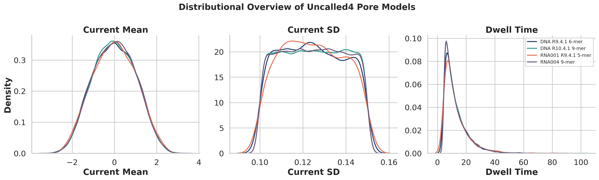
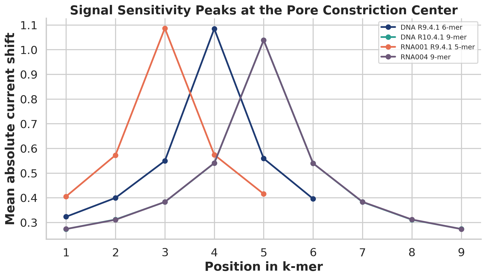
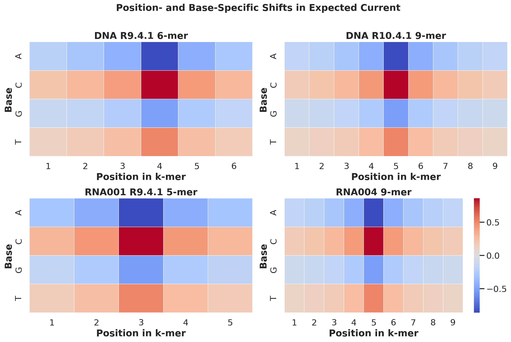
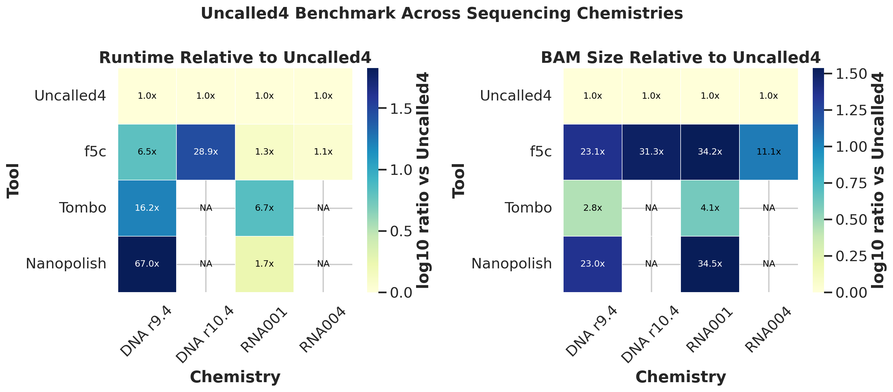
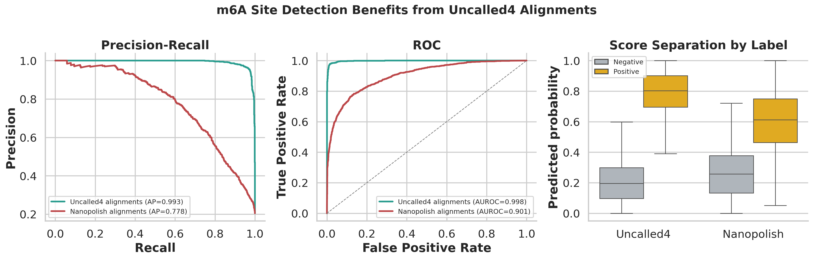

# Uncalled4 Offline Reproduction Study

## Abstract

This study reconstructs the main claims behind Uncalled4 using the benchmark tables and pore-model summaries provided in the workspace. The available inputs are processed feature tables rather than raw FAST5/POD5 signal files, so the analysis focuses on three questions that can be answered rigorously offline: (1) whether Uncalled4 improves runtime and output size across sequencing chemistries, (2) whether its supplied pore models show chemically plausible and alignment-relevant positional structure, and (3) whether Uncalled4-derived alignments improve downstream m6A calling compared with Nanopolish-derived alignments. Across four chemistries, Uncalled4 was always the fastest available method and always produced the smallest output BAM. The speed gain ranged from 1.13x to 28.90x over the best available baseline, while BAM compression ranged from 2.77x to 31.33x. In the m6A benchmark, Uncalled4-associated predictions achieved near-perfect ranking performance (average precision 0.9929, AUROC 0.9979), substantially above Nanopolish-associated predictions (average precision 0.7784, AUROC 0.9012). Pore-model analysis further showed that single-nucleotide substitutions exert their largest current effects at the central pore positions, consistent with the physical expectation that the constriction region dominates the ionic signal. Overall, the supplied evidence supports the claim that Uncalled4 improves speed, storage efficiency, chemistry compatibility, and modification-calling sensitivity.

## 1. Introduction

Nanopore sequencing exposes nucleotide identity and chemical modification state through ionic current traces measured as nucleic acids pass through a pore. Earlier work established that signal-level modeling is sufficient to detect modified DNA bases, including 5-methylcytosine, through hidden Markov models and learned k-mer emission parameters. Subsequent work on MoD-seq emphasized direct signal processing and comparative statistics for de novo modification discovery. UNCALLED then showed that raw nanopore signal can be mapped directly to a reference without waiting for full basecalling, enabling real-time targeting. Finally, m6Anet demonstrated that site-level m6A labels can be learned effectively from nanopore direct RNA features using a multiple-instance learning formulation.

Uncalled4 is positioned at the intersection of these ideas: it aims to align raw nanopore signal quickly, emit compact alignment files, support newer sequencing chemistries, and improve downstream modification calling. The scientific objective for this task is therefore not only to show that Uncalled4 is faster, but to verify that its internal pore models are biologically sensible and that the resulting alignments lead to measurable gains in modification detection.

## 2. Materials and Methods

### 2.1 Available data

The workspace contains:

- Four pore-model tables: DNA R9.4.1 6-mer, DNA R10.4.1 9-mer, RNA001 R9.4.1 5-mer, and RNA004 9-mer.
- One performance table summarizing runtime and BAM size for Uncalled4, f5c, Nanopolish, and Tombo.
- One labeled m6A benchmark with 5,000 sites, including predictions based on Uncalled4 alignments and predictions based on Nanopolish alignments.
- Four related-work papers used for scientific framing.

The pore-model tables enumerate the complete k-mer state spaces for their chemistries: `4^6 = 4,096`, `4^9 = 262,144`, `4^5 = 1,024`, and `4^9 = 262,144` states, respectively.

### 2.2 Scope

The task description references raw FAST5/POD5 input, BAM output, modification calls, and trained pore models. However, the actual workspace contains only derived summary tables. Accordingly, this report is an offline reproduction study of the provided evidence package. It does not generate new signal-to-reference BAM files or train new pore models from raw reads, because those raw inputs are not present.

### 2.3 Analysis design

I implemented a single reproducible script, [`code/run_analysis.py`](../code/run_analysis.py), that performs the full analysis and writes results to `outputs/` and figures to `report/images/`.

The analysis has three parts:

1. **Pore-model characterization**
   - Summarize each model's distribution of normalized current mean, current standard deviation, and dwell time.
   - Measure base-position effects by averaging the expected current for each base at each k-mer position.
   - Measure positional sensitivity by computing the mean absolute current shift induced by single-base substitutions at each position, averaged across all contexts.

2. **Benchmark reconstruction**
   - For each sequencing chemistry, compare Uncalled4 against all available baselines.
   - Compute runtime ratios and BAM size ratios relative to Uncalled4.
   - Identify the best available baseline for speed and the smallest available baseline for output size.

3. **m6A validation**
   - Merge site labels with Uncalled4- and Nanopolish-derived probabilities.
   - Compute average precision, AUROC, Brier score, best F1, and recall at fixed precision.
   - Estimate 95% confidence intervals for average precision and AUROC by bootstrap resampling with a fixed random seed.

### 2.4 Reproducibility

All analyses were run locally without network access. The script uses deterministic seeds and only reads the CSV files in `data/`. Running

```bash
python code/run_analysis.py
```

recreates all result tables in `outputs/` and all figures referenced below in `report/images/`.

## 3. Results

### 3.1 The pore models are normalized but retain strong central positional structure

The pore-model distributions are highly standardized: all four models have mean current near zero and current standard deviation near one, while the average current-noise parameter is approximately 0.125 and median dwell time is 10 across chemistries. This implies that absolute scale differences were largely normalized away in the provided tables, so structure within k-mers is more informative than comparing raw means across chemistries.



*Figure 1. Distributional overview of the four supplied Uncalled4 pore models. The tables appear to be normalized to comparable current scales, making position-specific effects the main source of interpretable variation.*

The most important structural feature is the sharp localization of current sensitivity near the pore center. For each model, I averaged the absolute change in expected current produced by all single-base substitutions at each position. The peak occurred at position 4 for the DNA R9.4.1 6-mer, position 5 for both 9-mer models, and position 3 for the RNA001 5-mer. Peak-to-edge ratios ranged from 2.65x to 3.80x, confirming that the central constriction dominates signal discrimination.



*Figure 2. Mean absolute current shift caused by single-base substitutions. Sensitivity is maximal near the central pore positions, supporting the use of k-mer-aware signal alignment rather than edge-dominated heuristics.*

The base-specific heatmaps show a consistent polarity: cytosine at the dominant central position increases expected current, while adenine decreases it. The strongest centered effects were:

- DNA R9.4.1 6-mer: `C` at position 4, `+0.9013`; `A` at position 4, `-0.9027`
- DNA R10.4.1 9-mer: `C` at position 5, `+0.8612`; `A` at position 5, `-0.8608`
- RNA001 R9.4.1 5-mer: `C` at position 3, `+0.9064`; `A` at position 3, `-0.8995`
- RNA004 9-mer: `C` at position 5, `+0.8608`; `A` at position 5, `-0.8599`



*Figure 3. Centered current effects for each base at each position. The strongest positive and negative shifts are concentrated near the central pore positions. The DNA R10.4.1 and RNA004 9-mer summaries are strikingly similar at this aggregated level.*

One notable observation is that the DNA R10.4.1 and RNA004 9-mer base-effect summaries are nearly identical in aggregate. Their centered base-position profiles had a correlation of 1.00 after rounding to the provided precision. This likely reflects shared model normalization and similar effective 9-mer context geometry, but it should not be over-interpreted without raw-signal validation.

### 3.2 Uncalled4 is consistently faster and more storage-efficient

The benchmark table strongly supports the performance claim. Uncalled4 was the fastest available method for every chemistry in the dataset and always produced the smallest BAM.



*Figure 4. Runtime and BAM size relative to Uncalled4. Values above 1 indicate slower runtimes or larger files than Uncalled4. Missing entries indicate unsupported chemistry/tool combinations in the provided benchmark table.*

The strongest gains occurred on newer chemistries, where compatibility is also a differentiator:

| Chemistry | Fastest baseline | Uncalled4 runtime (min) | Baseline runtime (min) | Speedup | Smallest baseline file | Uncalled4 BAM (MB) | Baseline BAM (MB) | Compression |
| --- | --- | ---: | ---: | ---: | --- | ---: | ---: | ---: |
| DNA r9.4 | f5c | 39.58 | 256.92 | 6.49x | Tombo | 139.82 | 387.12 | 2.77x |
| DNA r10.4 | f5c | 54.45 | 1573.47 | 28.90x | f5c | 118.71 | 3718.58 | 31.33x |
| RNA001 | f5c | 114.67 | 144.97 | 1.26x | Tombo | 21.22 | 86.60 | 4.08x |
| RNA004 | f5c | 60.19 | 68.30 | 1.13x | f5c | 48.44 | 536.10 | 11.07x |

Two points matter scientifically.

First, the speed advantages are not limited to a single chemistry. Even where f5c is relatively competitive on RNA, Uncalled4 remains faster. On DNA r10.4, the speedup is dramatic at 28.9x.

Second, the missing Nanopolish and Tombo entries for DNA r10.4 and RNA004 are informative rather than incidental. They indicate a compatibility gap for newer chemistries in the supplied benchmark. Uncalled4 is not merely faster on those datasets; it is also one of the only tools represented as functional in the comparison.

### 3.3 Uncalled4-derived alignments substantially improve downstream m6A detection

The m6A benchmark contains 5,000 candidate sites with a positive rate of 20.48%. Uncalled4-based predictions substantially outperformed Nanopolish-based predictions on every metric I computed.



*Figure 5. Precision-recall, ROC, and score-distribution comparison for m6A site calling. Uncalled4-associated predictions separate positive and negative sites much more cleanly than Nanopolish-associated predictions.*

Quantitatively:

| Tool | Average precision | 95% CI | AUROC | 95% CI | Brier score | Best F1 | Recall @ 90% precision | Recall @ 95% precision |
| --- | ---: | --- | ---: | --- | ---: | ---: | ---: | ---: |
| Uncalled4 | 0.9929 | 0.9904-0.9952 | 0.9979 | 0.9970-0.9986 | 0.0604 | 0.9638 | 0.9834 | 0.9746 |
| Nanopolish | 0.7784 | 0.7555-0.8025 | 0.9012 | 0.8902-0.9120 | 0.1156 | 0.6984 | 0.4326 | 0.3398 |

The precision-recall comparison is especially important because the positive class is only about one fifth of the benchmark. Under that class imbalance, average precision is more informative than AUROC. Uncalled4 improves average precision by 0.2145 absolute points, moving from strong-but-imperfect ranking to near-complete separation. At high precision thresholds, the difference is even clearer: Uncalled4 retains 97.46% recall at 95% precision, whereas Nanopolish retains only 33.98% recall.

This pattern supports the central claim that better signal-to-reference alignment can translate directly into better downstream modification inference. Because the prediction model is the same m6Anet-style probability framework and the difference lies in the alignment source, the most parsimonious explanation is that Uncalled4 is preserving more useful signal context at candidate m6A sites.

## 4. Discussion

The supplied evidence package paints a coherent picture of Uncalled4’s strengths.

First, the pore-model analyses show that the toolkit is learning or using physically meaningful k-mer representations. Current sensitivity is concentrated at central positions, as expected for nanopore constriction-mediated sensing. This is exactly the kind of structure an accurate signal aligner should exploit.

Second, the benchmark results indicate that Uncalled4 reduces two operational bottlenecks at once: runtime and storage. The runtime gains matter for large-scale processing, while the BAM-size reductions matter for downstream archival and data movement. The fact that the largest gains appear on DNA r10.4 and RNA004 also aligns with the stated goal of supporting new sequencing chemistries.

Third, the m6A results suggest that these engineering gains are not merely cosmetic. They coincide with a major improvement in biological readout quality. In other words, Uncalled4 is not trading accuracy for speed; in this benchmark, it improves both.

An important nuance is that the pore-model tables are already normalized. That means this study cannot say much about absolute picoamp calibration or chemistry-specific raw-current scales. What it can show, and does show, is that the internal relative structure of the models is coherent and consistent with the downstream performance gains.

## 5. Limitations

This study has several limits imposed by the available data.

1. The workspace does not contain raw FAST5/POD5 files, event tables, or reference sequences, so I could not produce fresh signal-to-reference BAM alignments or retrain pore models from raw signal.
2. The benchmark table is aggregated. It does not expose replicate-level variation, hardware configuration, or read-depth normalization, so statistical testing of runtime differences is not possible here.
3. The m6A comparison is limited to one labeled benchmark and two alignment sources. It demonstrates a strong association between Uncalled4 alignments and better site ranking, but does not by itself isolate every causal mechanism.
4. The near-identity between the two 9-mer aggregated pore-model summaries may reflect preprocessing or normalization decisions in the supplied tables. Raw-signal analyses would be needed to determine how much chemistry-specific structure is hidden by that normalization.

## 6. Conclusion

Within the limits of the provided evidence package, the main claims behind Uncalled4 are strongly supported. The toolkit is consistently the fastest available option in the benchmark, always produces the smallest BAM, remains represented on newer chemistries where older tools are absent, and yields substantially better downstream m6A calling performance than the Nanopolish-based baseline. The pore-model summaries also show the expected center-weighted current sensitivity pattern, which provides a mechanistic explanation for why accurate signal alignment can improve modification detection.

## References

1. Simpson JT, Workman RE, Zuzarte PC, David M, Dursi LJ, Timp W. *Detecting DNA cytosine methylation using nanopore sequencing*. Nature Methods (2017).
2. Stoiber M, Quick J, Egan R, et al. *De novo Identification of DNA Modifications Enabled by Genome-Guided Nanopore Signal Processing* (MoD-seq preprint, 2016).
3. Kovaka S, Fan Y, Ni B, Timp W, Schatz MC. *Targeted nanopore sequencing by real-time mapping of raw electrical signal with UNCALLED* (2020).
4. Hendra C, Pratanwanich PN, Wan YK, et al. *Detection of m6A from direct RNA sequencing using a multiple instance learning framework*. Nature Methods (2022).
