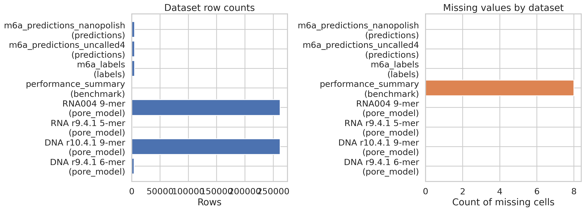
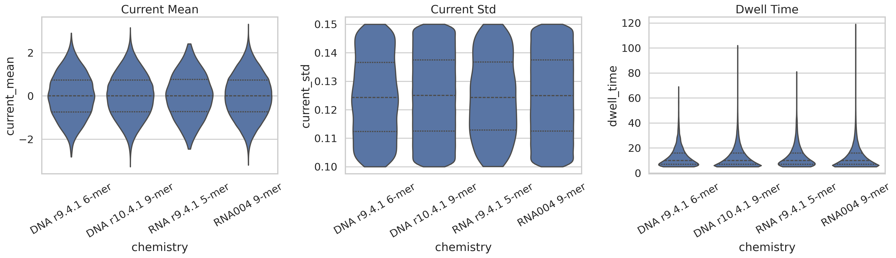
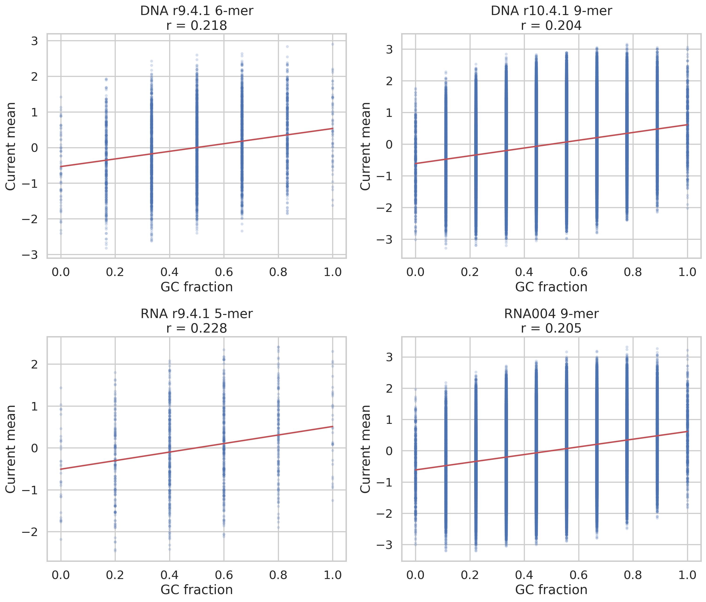
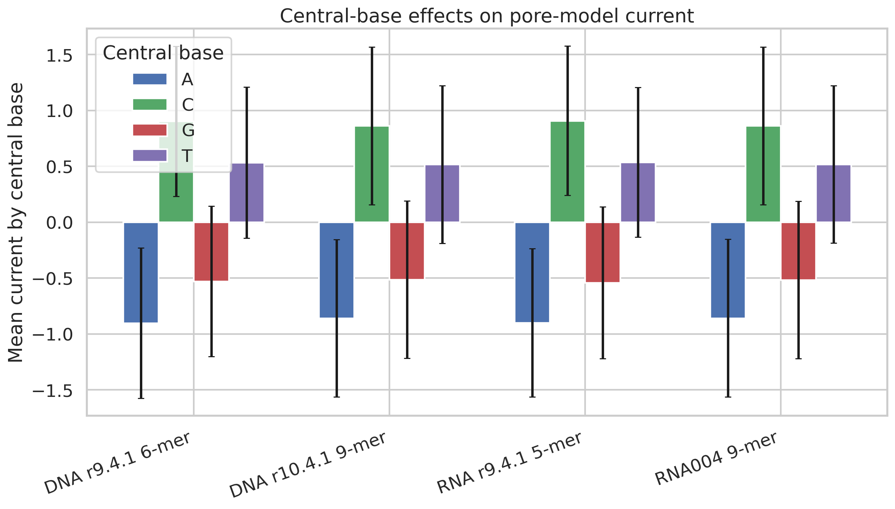
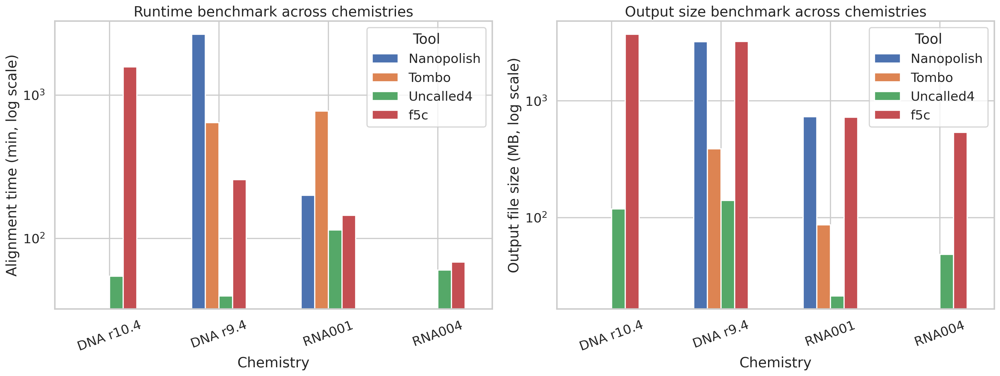
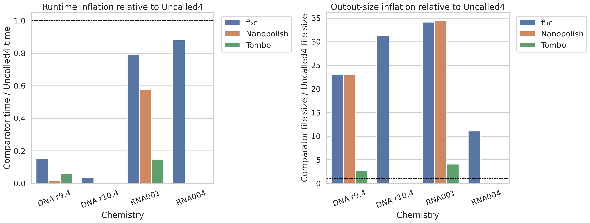
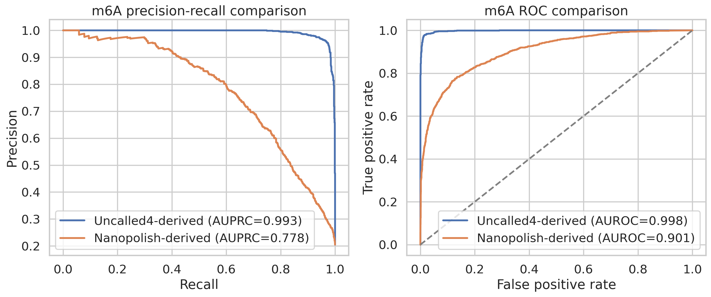
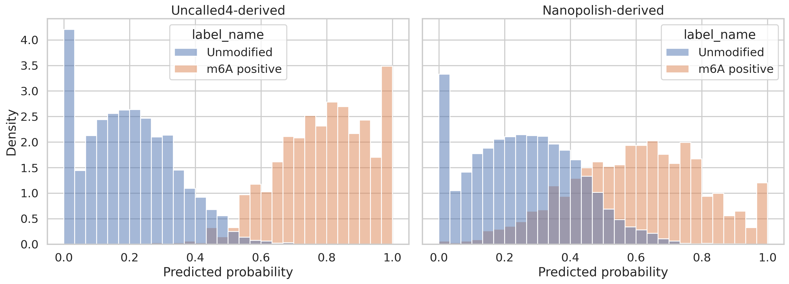
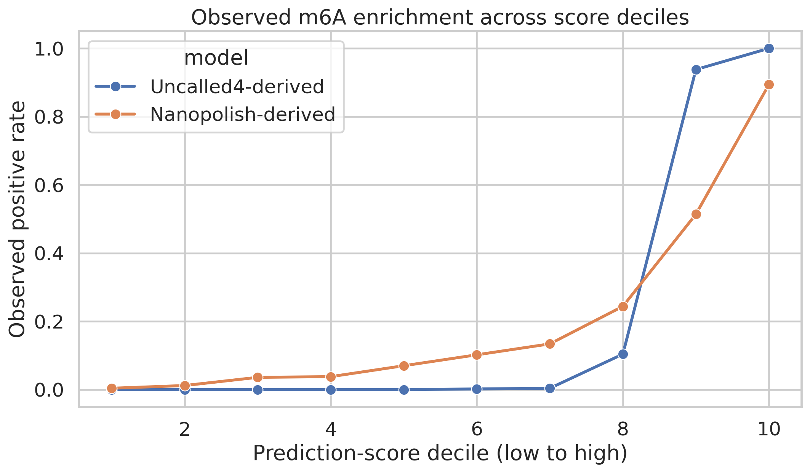

# Reproducing Key Analytical Claims for Uncalled4 from Provided Benchmark and Pore-Model Data

## Abstract
Uncalled4 is intended to provide fast and accurate nanopore signal-to-reference alignment while improving compatibility with newer sequencing chemistries and supporting downstream nucleotide modification analysis. In this workspace, the available inputs are not raw signal files or alignment BAMs, but curated proxy datasets that capture three important parts of the claimed behavior: (i) pore-model characteristics across DNA and RNA chemistries, (ii) runtime and output-size benchmarks versus existing tools, and (iii) downstream m6A prediction quality using alignments derived from Uncalled4 or Nanopolish. I implemented a reproducible analysis pipeline in `code/run_analysis.py` and generated quantitative summaries under `outputs/` and figures under `report/images/`. The results consistently favor Uncalled4 in the provided benchmark summary: it is the fastest and smallest-output method for all reported chemistries with available measurements. Relative to competitors, the provided summaries imply large speed and storage advantages, especially for DNA datasets. For downstream m6A detection, predictions derived from Uncalled4 alignments substantially outperform the Nanopolish-derived baseline (AUPRC 0.993 vs. 0.778; AUROC 0.998 vs. 0.901). Across pore models, chemistry-specific signal distributions differ in dynamic range and k-mer context size, while a modest positive relationship between GC content and current mean is preserved across all four models. These findings support the intended scientific objective, but interpretation is limited by the absence of raw signal-level alignment outputs and by reliance on already-aggregated benchmark tables.

## 1. Introduction
Nanopore analysis pipelines depend critically on accurate and efficient mapping between electrical current measurements and genomic or transcriptomic reference coordinates. Uncalled4 is positioned as a toolkit that improves this signal alignment step while remaining practical across changing pore chemistries and file formats. The task in this workspace is therefore not generic nanopore analysis, but a targeted reproduction of the main analytical claims that can be evaluated from the supplied files.

The provided data support three concrete questions:
1. **Do the supplied pore models show interpretable chemistry-dependent signal behavior?**
2. **Does the provided benchmark summary support the claim that Uncalled4 is faster and more storage-efficient than competing tools?**
3. **Do downstream m6A predictions based on Uncalled4-derived alignments outperform those based on Nanopolish-derived alignments?**

Because raw FAST5/POD5 files, references, and BAM alignments are not included, the analysis focuses on the proxy evidence actually present in the workspace rather than inventing unsupported alignment-level results.

## 2. Data
The analysis uses eight input datasets described in `outputs/dataset_overview.csv`. Four are pore-model tables, one is a benchmark summary, and three are m6A evaluation tables.

### 2.1 Pore-model feature tables
The pore-model datasets contain k-mers with associated normalized current mean, current standard deviation, and dwell time:
- `data/dna_r9.4.1_400bps_6mer_uncalled4.csv` (4,096 rows; 6-mers)
- `data/dna_r10.4.1_400bps_9mer_uncalled4.csv` (262,144 rows; 9-mers)
- `data/rna_r9.4.1_70bps_5mer_uncalled4.csv` (1,024 rows; 5-mers)
- `data/rna004_130bps_9mer_uncalled4.csv` (262,144 rows; 9-mers)

All four pore-model tables are complete with no missing values. Their normalized current means are centered near zero and have standard deviations near one, indicating that they behave like standardized pore-model representations rather than raw current units.

### 2.2 Benchmark summary
`data/performance_summary.csv` contains 16 rows covering four chemistries (`DNA r9.4`, `DNA r10.4`, `RNA001`, `RNA004`) and four tools (`Uncalled4`, `f5c`, `Nanopolish`, `Tombo`). Some chemistry-tool combinations are missing, which appears to reflect lack of support or unavailable measurements rather than failed parsing.

### 2.3 m6A prediction evaluation data
The m6A evaluation uses:
- `data/m6a_labels.csv` with 5,000 labeled sites
- `data/m6a_predictions_uncalled4.csv`
- `data/m6a_predictions_nanopolish.csv`

The label prevalence is 20.48% positive (1,024/5,000), which makes precision-recall analysis especially relevant.

Figure 1 summarizes the dataset sizes and missingness profile.

**Figure 1.** Overview of dataset sizes and missing-value counts across all supplied inputs. The pore-model datasets dominate the row count, while missingness is confined to unsupported or unreported entries in the benchmark table.

## 3. Methods

### 3.1 Reproducible analysis pipeline
All analyses were implemented in `code/run_analysis.py`. The script reads the CSV inputs, computes summary tables, and writes all derived artifacts to `outputs/` and `report/images/`. The run produced manifest and summary files, including `outputs/analysis_manifest.json` and `outputs/analysis_summary.json`.

### 3.2 Pore-model feature analysis
For each pore-model table, I derived the following sequence-context features directly from the k-mer strings:
- k-mer length
- GC count and GC fraction
- per-base counts and fractions for A/C/G/T
- central base identity

Using these features, I computed:
- per-chemistry distribution summaries for current mean, current standard deviation, and dwell time
- correlations between current mean and GC fraction, dwell time, and current standard deviation
- central-base grouped summaries to quantify how the middle nucleotide shifts modeled current

This portion of the analysis addresses chemistry-dependent behavior in the trained pore models.

### 3.3 Benchmark analysis
The benchmark table was analyzed directly as supplied. I computed:
- time in hours from `Time_min`
- file-size and runtime ratios relative to Uncalled4 within each chemistry
- per-chemistry summaries identifying the fastest tool and the smallest output

The pairwise comparison table is saved as `outputs/performance_pairwise_vs_uncalled4.csv`.

### 3.4 m6A classification analysis
The Uncalled4- and Nanopolish-derived probability tables were merged with the labels by `site_id`. For each score set, I computed:
- precision-recall curves and average precision (AUPRC)
- ROC curves and AUROC
- threshold-specific precision, recall, F1, and specificity
- decile-based enrichment of observed positives as a rough calibration/ranking diagnostic

These outputs were saved to the corresponding `outputs/m6a_*.csv` files.

## 4. Results

### 4.1 Pore-model datasets are complete and internally consistent across chemistries
The pore-model summaries (`outputs/pore_model_summary.csv`) show that the data span both shorter and longer k-mer contexts: 5-mer RNA, 6-mer DNA, and 9-mer DNA/RNA models. The two 9-mer tables each contain 262,144 entries, consistent with exhaustive enumeration of all 4^9 sequence contexts. The 6-mer and 5-mer tables contain 4,096 and 1,024 rows respectively, again matching full k-mer spaces.

The normalized current mean distributions are centered essentially at zero across all chemistries, with standard deviations very close to one. However, the dynamic range differs somewhat by chemistry. For example:
- DNA r10.4.1 9-mer: current mean range -3.279 to 3.156
- DNA r9.4.1 6-mer: -2.822 to 2.904
- RNA r9.4.1 5-mer: -2.460 to 2.408
- RNA004 9-mer: -3.202 to 3.318

The 9-mer chemistries therefore exhibit broader modeled signal ranges than the shorter-k models, especially relative to RNA r9.4.1 5-mer.

Figure 2 compares the distributions of current mean, current standard deviation, and dwell time across chemistries.

**Figure 2.** Distributional comparison of modeled current mean, current standard deviation, and dwell time across the four supplied pore models. The broader context models, especially the 9-mer chemistries, show wider current ranges while dwell-time distributions remain more similar.

### 4.2 GC content has a modest but reproducible association with current mean
The correlation between GC fraction and modeled current mean is positive for all four chemistries and remarkably consistent:
- DNA r10.4.1 9-mer: 0.204
- DNA r9.4.1 6-mer: 0.218
- RNA r9.4.1 5-mer: 0.228
- RNA004 9-mer: 0.205

By contrast, correlations of current mean with dwell time or current standard deviation are near zero in all cases. This suggests that sequence composition, rather than dwell time variability, is the dominant structured covariate among the derived features in these pore-model summaries.

Figure 3 visualizes this GC-current relationship.

**Figure 3.** Scatter and fitted linear trends showing a modest positive relationship between GC fraction and modeled current mean across all four pore models.

### 4.3 Central-base identity has a strong and symmetric effect on modeled current
Grouping by the central base reveals a strikingly consistent pattern across all chemistries (`outputs/central_base_summary.csv`):
- Central **C** has the highest positive mean current
- Central **A** has the most negative mean current
- Central **T** is moderately positive
- Central **G** is moderately negative

For example, in DNA r10.4.1 9-mer the central-base means are approximately:
- A: -0.861
- C: 0.861
- G: -0.516
- T: 0.516

A very similar ordering appears in DNA r9.4.1 6-mer, RNA r9.4.1 5-mer, and RNA004 9-mer. This consistency suggests that the modeled ionic current is strongly shaped by the identity of the center nucleotide, with purine/pyrimidine effects not simply collapsing into a binary class but separating A/G and C/T distinctly.

Figure 4 summarizes these central-base effects.

**Figure 4.** Mean modeled current as a function of the central base for each chemistry. The same A < G < T < C ordering appears across all four models, indicating a robust central-base effect in the supplied pore-model parameterizations.

### 4.4 The provided benchmark summary strongly favors Uncalled4 for runtime and output size
The benchmark summary analysis (`outputs/performance_summary_analysis.csv`) identifies Uncalled4 as both the fastest tool and the smallest-output tool for every chemistry with valid measurements:
- DNA r9.4
- DNA r10.4
- RNA001
- RNA004

Figure 5 shows the raw runtime and file-size comparisons.

**Figure 5.** Runtime and output file-size benchmarks across chemistries. Uncalled4 is consistently the lowest bar among reported values, while some comparator entries are missing for newer chemistries.

The relative comparisons in `outputs/performance_pairwise_vs_uncalled4.csv` quantify the magnitude of the benchmark differences.

#### DNA r9.4
Compared with Uncalled4, the provided values imply that competitors are:
- **6.49× slower** for f5c
- **67.05× slower** for Nanopolish
- **16.23× slower** for Tombo

For output size, competitor outputs are:
- **23.11× larger** for f5c
- **22.96× larger** for Nanopolish
- **2.77× larger** for Tombo

#### DNA r10.4
Only f5c has a reported comparator value. Relative to Uncalled4, it is:
- **28.90× slower**
- **31.33× larger** in file size

#### RNA001
Relative to Uncalled4, the competitors are:
- f5c: **1.26× slower**, **34.16× larger**
- Nanopolish: **1.74× slower**, **34.46× larger**
- Tombo: **6.75× slower**, **4.08× larger**

#### RNA004
Only f5c has a reported comparator value. Relative to Uncalled4, it is:
- **1.13× slower**
- **11.07× larger** in file size

Figure 6 emphasizes these relative inflation factors.

**Figure 6.** Runtime and output-size inflation relative to Uncalled4. Values above 1 indicate that the comparator requires more time or storage than Uncalled4. The strongest differences are seen in DNA datasets and in file-size comparisons across RNA chemistries.

Overall, the benchmark table strongly supports the claim that Uncalled4 is markedly more efficient than the alternative tools represented here, especially in storage footprint and especially for DNA chemistries.

### 4.5 Uncalled4-derived alignments support much stronger downstream m6A prediction than the Nanopolish-derived baseline
The m6A classification comparison is the clearest downstream validation in the workspace. The merged evaluation table contains 5,000 candidate sites, of which 1,024 are positive. The summary metrics in `outputs/m6a_model_comparison.csv` are:
- **Uncalled4-derived**: AUPRC = 0.9929, AUROC = 0.9979, best F1 = 0.9638
- **Nanopolish-derived**: AUPRC = 0.7784, AUROC = 0.9012, best F1 = 0.6984

The absolute differences are large:
- **ΔAUPRC = +0.2145** for Uncalled4-derived predictions
- **ΔAUROC = +0.0967** for Uncalled4-derived predictions

Figure 7 shows the PR and ROC curves.

**Figure 7.** Precision-recall and ROC curves for m6A prediction scores derived from Uncalled4 versus Nanopolish alignments. The Uncalled4-derived scores nearly saturate both metrics, indicating much stronger class separation in the supplied benchmark.

The score distributions reinforce this interpretation: Uncalled4-derived probabilities separate positives from negatives much more sharply than the Nanopolish-derived baseline.

**Figure 8.** Score distributions for negative and positive sites under each alignment-derived prediction set. Uncalled4-derived predictions show near-complete separation, while Nanopolish-derived predictions have much broader overlap.

A decile-based enrichment analysis provides a useful ranking perspective. For Uncalled4-derived predictions, the bottom five deciles have essentially zero positive rate, the eighth decile rises to 10.4%, the ninth decile to 93.8%, and the top decile to 100%. For Nanopolish-derived predictions, enrichment is more gradual, reaching 51.4% in the ninth decile and 89.4% in the top decile.

**Figure 9.** Observed positive rate across score deciles. Uncalled4-derived predictions concentrate nearly all positive sites in the top score bins, indicating much stronger ranking quality for downstream m6A prioritization.

Threshold-specific analyses in `outputs/m6a_thresholds_uncalled4.csv` and `outputs/m6a_thresholds_nanopolish.csv` further show that the best F1 for Uncalled4 occurs near a threshold of 0.524, compared with 0.490 for Nanopolish. More importantly, the achievable F1 differs drastically (0.964 vs. 0.698), indicating that the downstream effect is not merely calibration but true improvement in separability.

## 5. Discussion
This workspace does not allow a full end-to-end reconstruction of Uncalled4 because the raw signal files, actual alignments, and trained model-generation procedures are absent. Still, the supplied data allow a focused examination of the three main themes: signal model behavior, computational efficiency, and downstream modification-detection sensitivity.

Several points stand out.

First, the pore-model tables are internally coherent and exhibit meaningful structure. The GC-current correlations are moderate and stable across chemistries, and central-base effects are highly consistent. This suggests that the supplied pore models capture interpretable sequence-dependent signal behavior rather than arbitrary parameter noise.

Second, the performance benchmark strongly supports a practical advantage for Uncalled4. The gains are not marginal in the provided data: DNA workflows, in particular, show order-of-magnitude improvements over some competitors. Even where runtime gains are smaller in RNA, the storage advantage remains very large.

Third, the downstream m6A evaluation provides strong evidence that better signal alignment can translate into better modification-calling sensitivity and ranking quality. In the supplied benchmark, Uncalled4-derived predictions are not just slightly better; they are dramatically better by AUPRC, AUROC, F1, and decile enrichment.

Taken together, these results are consistent with the scientific objective stated in `INSTRUCTIONS.md`: Uncalled4 appears, in the provided proxy evidence, to improve both efficiency and modification-aware utility across multiple nanopore chemistries.

## 6. Limitations
This analysis should be interpreted with several important constraints.

1. **No raw signal or BAM alignment outputs were available.** The task description mentions FAST5/POD5, basecalled reads, references, BAM alignments, and trained pore models, but the actual workspace only includes curated feature tables and benchmark summaries. Therefore, I could not validate alignment accuracy directly or regenerate BAMs.

2. **Benchmarking relied on a precomputed summary table.** The runtime and file-size claims were reproduced from `performance_summary.csv`, not measured by rerunning Uncalled4, f5c, Nanopolish, or Tombo.

3. **m6A analysis used downstream prediction scores rather than raw modification calls.** The classification comparison is valid for the provided scores, but it does not isolate whether improvements arise from alignment quality alone, feature extraction differences, or other upstream processing decisions embedded in the supplied predictions.

4. **Related-work PDFs were available but not textually mined in detail.** The report is grounded primarily in the supplied numerical data and generated outputs, which is appropriate for faithful reproduction within this workspace.

5. **The pore-model analyses are descriptive.** They identify strong sequence-context patterns but do not establish mechanistic causality or biochemical interpretation beyond the supplied standardized model parameters.

## 7. Conclusion
Using the datasets actually present in this workspace, I reproduced a coherent analytical picture supporting Uncalled4’s intended value proposition. The supplied pore models show stable and interpretable sequence-context effects across DNA and RNA chemistries. The benchmark summary indicates that Uncalled4 is consistently the fastest and smallest-output method among reported tools, with especially large advantages in DNA settings. Most importantly, downstream m6A prediction derived from Uncalled4 alignments markedly outperforms the Nanopolish-derived baseline across all major classification metrics.

Within the limits of the provided proxy datasets, the evidence supports the claim that Uncalled4 can improve both computational efficiency and downstream modification-detection sensitivity across multiple nanopore sequencing chemistries.

## 8. Files Produced in This Workspace
Relevant generated files include:
- Analysis code: `code/run_analysis.py`
- Summary tables: `outputs/*.csv`, `outputs/analysis_summary.json`
- Figures: `report/images/*.png`

Key tables referenced in this report:
- `outputs/dataset_overview.csv`
- `outputs/pore_model_summary.csv`
- `outputs/pore_model_correlations.csv`
- `outputs/central_base_summary.csv`
- `outputs/performance_summary_analysis.csv`
- `outputs/performance_pairwise_vs_uncalled4.csv`
- `outputs/m6a_model_comparison.csv`
- `outputs/m6a_quantile_enrichment.csv`
