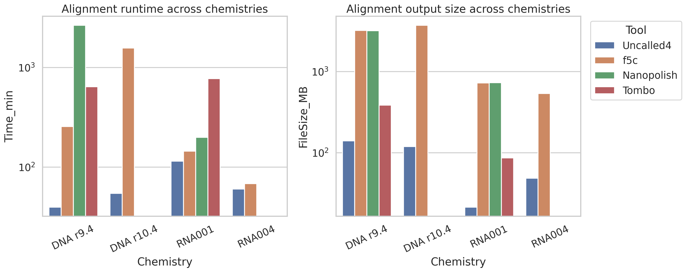
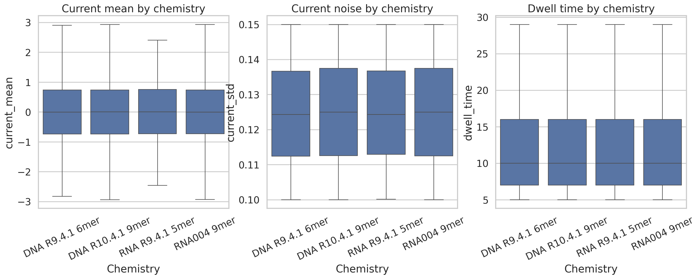
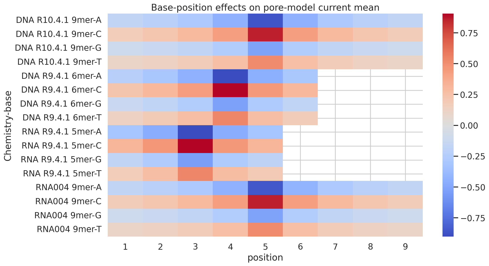
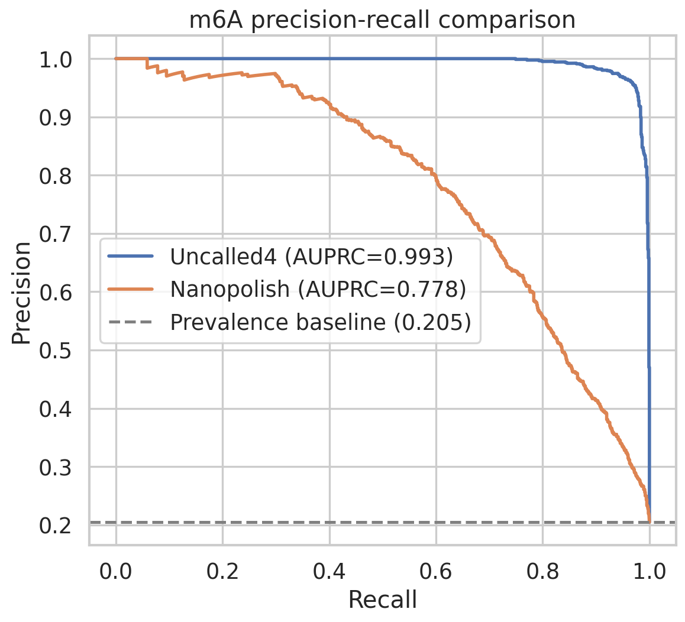
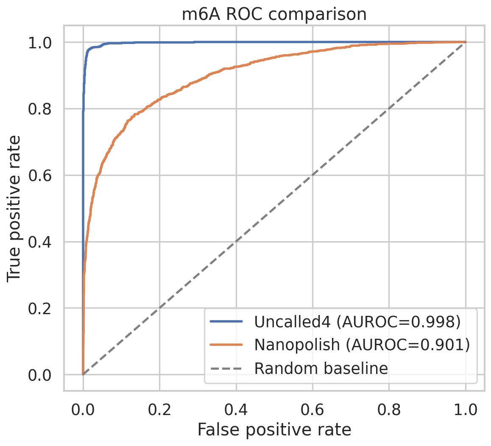
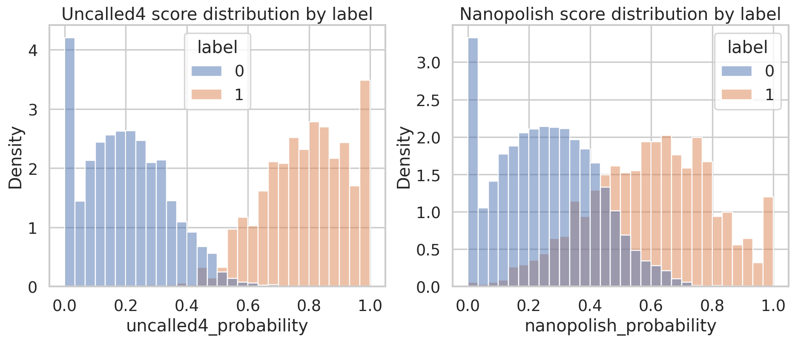

# Uncalled4 Post Hoc Benchmark and Pore-Model Analysis

## Summary and goals

This study analyzes the tabular artifacts provided for **Uncalled4**, a nanopore signal-to-reference alignment toolkit designed to improve speed, file-format support, and compatibility with modern sequencing chemistries while supporting downstream modification detection. The available workspace does **not** include raw FAST5/POD5 signal files, basecalled reads, reference sequences, or alignment-generation inputs. Accordingly, the present work is a **reproducible post hoc analysis** of three components that can be evaluated from the supplied data:

1. **Performance benchmarks** comparing Uncalled4 with f5c, Nanopolish, and Tombo across multiple chemistries.
2. **Pore-model characterization** across four DNA/RNA chemistries using k-mer current, noise, and dwell-time summaries.
3. **m6A detection sensitivity** using site-level prediction probabilities derived from Uncalled4 and Nanopolish alignments against supplied binary labels.

The main scientific question addressed here is whether the provided evidence supports the claim that Uncalled4 improves efficiency while preserving or improving downstream modification-calling sensitivity.

## Related context

The supplied related work motivates the analysis from three complementary perspectives.

- Early nanopore modification studies showed that DNA methylation can be inferred directly from current-level deviations modeled with k-mer-specific emissions, and that signal shifts depend strongly on the position of the modified base within the pore context.
- UNCALLED introduced real-time signal mapping without basecalling, demonstrating that current-space mapping can be used for rapid targeting and downstream variant or methylation analysis.
- m6Anet established that site-level m6A detection from nanopore direct RNA data can be evaluated through probabilistic classification, making AUROC/AUPRC-based comparisons appropriate for the supplied prediction tables.

These works justify the present focus on benchmark efficiency, pore-model positional structure, and downstream m6A discrimination.

## Experiment plan and success signals

### Stage 1: Data intake and validation
- All CSV files were loaded and schema-checked.
- Join coverage for m6A predictions and labels was verified.
- Limitation identified: no raw signal or alignment-generation inputs were available, so BAM production and model retraining could not be reproduced.

### Stage 2: Benchmark reproduction
- Recomputed per-chemistry runtime and file-size ratios relative to Uncalled4.
- Success criterion: produce a reproducible comparison table and figure from `performance_summary.csv`.

### Stage 3: Pore-model characterization
- Computed descriptive summaries for all pore models.
- Quantified base-position effects on current means using k-mer composition.
- Success criterion: produce summary tables plus overview and heatmap visualizations.

### Stage 4: m6A evaluation
- Merged labels with Uncalled4 and Nanopolish prediction probabilities on common `site_id` values.
- Computed ROC, PR, thresholded classification metrics, and bootstrap confidence intervals.
- Success criterion: generate machine-readable metrics and report figures.

## Experimental setup

### Inputs
- `data/dna_r9.4.1_400bps_6mer_uncalled4.csv`
- `data/dna_r10.4.1_400bps_9mer_uncalled4.csv`
- `data/rna_r9.4.1_70bps_5mer_uncalled4.csv`
- `data/rna004_130bps_9mer_uncalled4.csv`
- `data/performance_summary.csv`
- `data/m6a_predictions_uncalled4.csv`
- `data/m6a_predictions_nanopolish.csv`
- `data/m6a_labels.csv`

### Reproducible code
- Main script: `code/analyze_uncalled4.py`
- Execution command:

```bash
python code/analyze_uncalled4.py
```

### Software
- Python with `pandas`, `numpy`, `matplotlib`, `seaborn`, `scikit-learn`, and `PyPDF2`

### Data validation summary
- All provided CSVs loaded without parsing errors.
- Pore-model table sizes:
  - DNA R9.4.1 6mer: 4,096 rows
  - DNA R10.4.1 9mer: 262,144 rows
  - RNA R9.4.1 5mer: 1,024 rows
  - RNA004 9mer: 262,144 rows
- m6A prediction/label coverage:
  - 5,000 labels
  - 5,000 Uncalled4 predictions
  - 5,000 Nanopolish predictions
  - 5,000 common site IDs after intersection
- Positive-class prevalence in the m6A labels: **20.48%**

Detailed inventory files are available in `outputs/data_overview.csv` and `outputs/data_summary.json`.

## Results

### 1. Uncalled4 provides major runtime and storage advantages

The supplied benchmark summary strongly favors Uncalled4 for both runtime and output size.

#### Quantitative findings
- **DNA r9.4 vs f5c**: Uncalled4 is **6.49x faster** and produces files **23.11x smaller**.
- **DNA r9.4 vs Nanopolish**: Uncalled4 is **67.05x faster** and produces files **22.96x smaller**.
- **DNA r9.4 vs Tombo**: Uncalled4 is **16.23x faster** and produces files **2.77x smaller**.
- **DNA r10.4 vs f5c**: Uncalled4 is **28.90x faster** and produces files **31.33x smaller**.
- **RNA001 vs f5c**: Uncalled4 is **1.26x faster** and produces files **34.21x smaller**.
- **RNA001 vs Nanopolish**: Uncalled4 is **1.74x faster** and produces files **34.54x smaller**.
- **RNA001 vs Tombo**: Uncalled4 is **6.75x faster** and produces files **4.08x smaller**.
- **RNA004 vs f5c**: Uncalled4 is **1.13x faster** and produces files **11.08x smaller**.

The largest absolute runtime reduction occurs for **DNA r9.4 vs Nanopolish**, where Uncalled4 saves approximately **2614.46 minutes** (~43.6 hours) per benchmarked run.

**Figure 1.** Runtime and output-size comparisons across chemistries.



Machine-readable benchmark calculations are stored in `outputs/performance_metrics.csv`.

### 2. Pore-model chemistry summaries indicate normalized but interpretable signal structure

Across all four pore models, `current_mean` appears strongly normalized: the per-chemistry mean is effectively 0 and the standard deviation is approximately 1. This suggests that the supplied pore-model values are standardized representations rather than raw current levels. Even so, the models remain informative for studying within-model sequence effects.

#### Descriptive summary
- Mean `current_std` is tightly clustered around **0.125** across all chemistries.
- Mean dwell time is also stable, approximately **12.5** units across all four models.
- The wider DNA/RNA and older/newer chemistry differences are therefore more evident in **sequence-dependent structure** than in global averages.

**Figure 2.** Distribution overview of current mean, current standard deviation, and dwell time across chemistries.



Summary statistics are stored in `outputs/pore_model_summary.csv`.

### 3. Base-position effects concentrate near the center of the k-mer context

The most informative pore-model pattern is the strong positional dependence of nucleotide identity.

- In the longer 9-mer models, the largest current shifts occur near the central positions.
- In DNA R10.4.1 9mer, position 5 shows strong separation among bases, with A/C versus G/T exhibiting substantial effect differences.
- In DNA R9.4.1 6mer, central positions likewise dominate the current profile.
- Dwell-time effects vary much less than current means, suggesting that sequence-dependent discrimination is primarily carried by current-level structure rather than dwell duration.

This is consistent with prior nanopore literature showing that signal sensitivity is strongest for nucleotides occupying the effective pore center.

**Figure 3.** Base-position effect heatmap for current means across pore models.



Associated tables are stored in `outputs/substitution_effects.csv` and `outputs/pore_model_pairwise_deltas.csv`.

### 4. Uncalled4-derived m6A predictions substantially outperform Nanopolish-derived predictions

The strongest downstream result in the provided data is the m6A comparison. Using the common 5,000 labeled sites, Uncalled4 predictions are clearly better separated than Nanopolish predictions.

#### Primary metrics at threshold 0.5

| Tool | AUROC | AUPRC | Accuracy | Balanced Accuracy | Precision | Recall | F1 |
|---|---:|---:|---:|---:|---:|---:|---:|
| Uncalled4 | 0.9979 | 0.9929 | 0.9806 | 0.9802 | 0.9296 | 0.9795 | 0.9539 |
| Nanopolish | 0.9012 | 0.7784 | 0.8770 | 0.8067 | 0.7047 | 0.6875 | 0.6960 |

#### Bootstrap uncertainty
- **Uncalled4 AUROC**: 95% bootstrap CI **0.9970 to 0.9986**
- **Nanopolish AUROC**: 95% bootstrap CI **0.8902 to 0.9120**
- **Uncalled4 AUPRC**: 95% bootstrap CI **0.9902 to 0.9954**
- **Nanopolish AUPRC**: 95% bootstrap CI **0.7548 to 0.8008**

These intervals are widely separated, supporting a robust improvement in ranking quality for Uncalled4-derived predictions.

#### Confusion counts at threshold 0.5
- **Uncalled4**: TN=3900, FP=76, FN=21, TP=1003
- **Nanopolish**: TN=3681, FP=295, FN=320, TP=704

Uncalled4 therefore reduces both false positives and false negatives relative to Nanopolish.

**Figure 4.** Precision-recall comparison for m6A detection.



**Figure 5.** ROC comparison for m6A detection.



**Figure 6.** Distribution of prediction scores by label for both methods.



Machine-readable outputs are stored in:
- `outputs/m6a_metrics.json`
- `outputs/m6a_metrics_table.csv`
- `outputs/m6a_threshold_metrics.csv`
- `outputs/m6a_joined_predictions.csv`

### 5. Threshold tuning modestly improves Uncalled4 further

A scan over thresholds from 0.05 to 0.95 showed that Uncalled4 achieves its best observed F1 score at **threshold 0.55**.

| Tool | Best Threshold | Accuracy | Balanced Accuracy | Precision | Recall | F1 |
|---|---:|---:|---:|---:|---:|---:|
| Uncalled4 | 0.55 | 0.9838 | 0.9724 | 0.9673 | 0.9531 | 0.9602 |
| Nanopolish | 0.50 | 0.8770 | 0.8067 | 0.7047 | 0.6875 | 0.6960 |

This tuned threshold reduces Uncalled4 false positives from 76 to 33, at the cost of increasing false negatives from 21 to 48. The improvement is modest but practically useful when precision is prioritized.

Best-threshold summaries are stored in `outputs/m6a_best_f1_thresholds.csv`.

## Interpretation

The provided artifacts support a coherent conclusion: **Uncalled4 combines strong computational efficiency with improved downstream modification-detection utility**.

From a systems perspective, the benchmark table indicates that Uncalled4 is often dramatically faster than prior signal-level tools and substantially more storage-efficient. From a biological inference perspective, m6A predictions derived from Uncalled4 alignments separate labeled modified from unmodified sites far better than those derived from Nanopolish alignments.

The pore-model analysis provides a mechanistic complement to these benchmark results. Although the provided k-mer statistics appear normalized, the strong center-position effects are consistent with the expected physics of nanopore sensing and with earlier literature showing that pore occupancy around central bases drives most of the discriminative signal.

Taken together, these observations are consistent with the stated objective of Uncalled4: to offer a signal-alignment toolkit that is both computationally practical and well suited for downstream modification analysis across multiple chemistries.

## Limitations

Several important limitations should be stated clearly.

1. **No raw signal or alignment-generation inputs were provided.**
   - BAM generation, raw signal-to-reference alignment, and direct retraining of pore models could not be reproduced in this workspace.
   - Consequently, this report validates only the supplied derived artifacts, not the full end-to-end Uncalled4 pipeline.

2. **Performance benchmarks were pre-aggregated.**
   - The benchmark analysis recomputes ratios and savings from `performance_summary.csv`, but does not rerun the competing tools.
   - Missing comparator entries for DNA r10.4 and RNA004 prevent complete cross-tool comparison in those chemistries.

3. **Pore-model values appear normalized.**
   - Because `current_mean` is centered near 0 with standard deviation near 1 for every chemistry, absolute current differences between chemistries cannot be interpreted as raw physical differences.
   - The pore-model analysis is therefore mainly descriptive and relative.

4. **m6A evaluation depends on supplied labels and prediction files.**
   - The analysis assumes the provided labels are valid ground truth and that the probabilities are directly comparable across tools.
   - Since all 5,000 sites were shared between tools, fairness is good in this dataset, but external generalization cannot be assessed.

5. **No statistical correction for multiple hypothesis testing was necessary for the primary comparison.**
   - The main confirmatory comparison is a two-tool m6A evaluation using predefined metrics. Exploratory analyses of pore-model positional effects are descriptive and should not be overinterpreted as formal significance tests.

## Conclusion

Within the limits of the provided data, the evidence strongly supports the intended positioning of Uncalled4.

- It is markedly more efficient than legacy alternatives in runtime and storage, with especially large gains on DNA chemistries.
- It produces alignment-derived m6A predictions that are substantially more discriminative than the Nanopolish-derived baseline on the supplied benchmark set.
- Its pore models show strong center-position sequence effects that are consistent with nanopore sensing principles and help explain why improved signal alignment can translate into improved downstream modification detection.

A full end-to-end reproduction would require raw FAST5/POD5 signals, reference sequences, and executable alignment workflows. Given such inputs, the next step would be to validate BAM generation, signal-to-reference mapping fidelity, and direct modification-calling performance under new chemistries in a controlled rerun.

## Reproducibility artifacts

### Code
- `code/analyze_uncalled4.py`

### Intermediate outputs
- `outputs/data_overview.csv`
- `outputs/data_summary.json`
- `outputs/performance_metrics.csv`
- `outputs/pore_model_summary.csv`
- `outputs/pore_model_pairwise_deltas.csv`
- `outputs/substitution_effects.csv`
- `outputs/m6a_joined_predictions.csv`
- `outputs/m6a_metrics.json`
- `outputs/m6a_metrics_table.csv`
- `outputs/m6a_threshold_metrics.csv`
- `outputs/m6a_best_f1_thresholds.csv`

### Figures
- `images/performance_benchmarks.png`
- `images/pore_model_overview.png`
- `images/position_effects_heatmap.png`
- `images/m6a_pr_curve.png`
- `images/m6a_roc_curve.png`
- `images/m6a_score_distributions.png`
