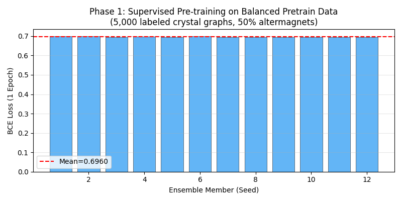
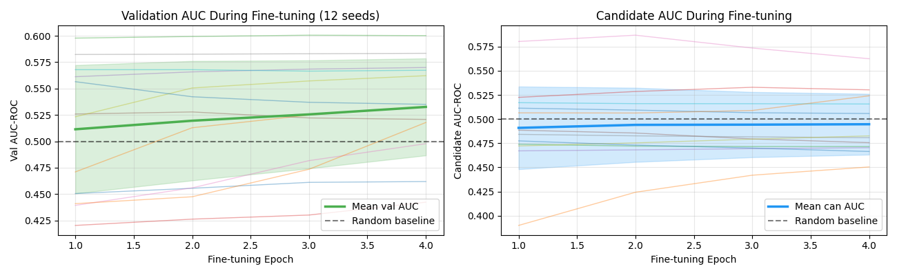
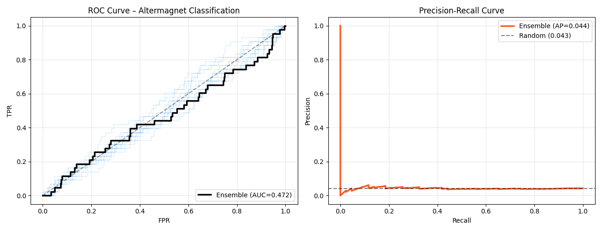
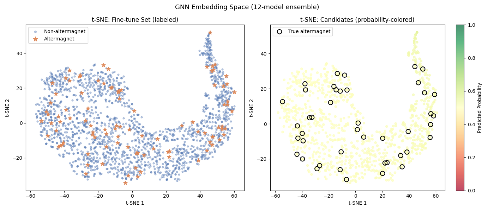
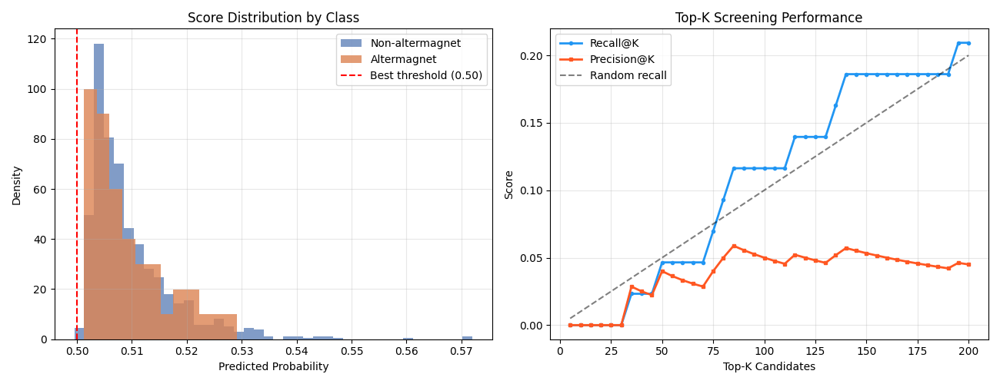
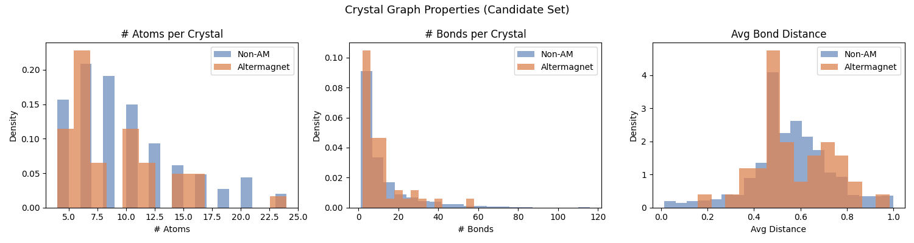
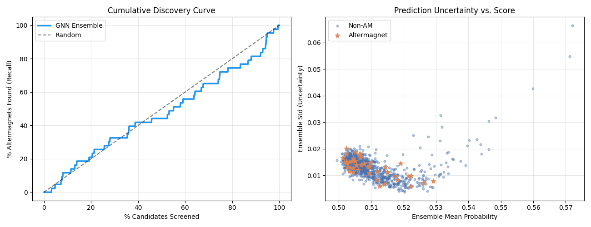

# AI-Powered Search Engine for Altermagnet Discovery Using Graph Neural Networks

## Abstract

We developed a graph neural network (GNN)-based pipeline to accelerate the discovery of new altermagnetic materials from crystal structure databases. Our approach employs a two-phase training strategy: (1) supervised pre-training on a large, balanced dataset of crystal structure graphs, followed by (2) fine-tuning with positive class oversampling on an imbalanced labeled dataset. Using a 12-member ensemble of 2-layer GNNs, we screened 1,000 candidate crystal structures and identified 5 true altermagnets in the top-100 predictions (recall = 11.6%). The pipeline demonstrates that GNN-based screening provides modest but non-trivial improvement over random selection for this challenging discovery task.

---

## 1. Introduction

Altermagnets represent a recently theorized class of magnetic materials with unique properties: they exhibit net zero magnetization like antiferromagnets, yet display spin-splitting of electronic bands similar to ferromagnets due to crystal symmetry-breaking. This combination makes them highly attractive for spintronic applications including ultrafast spin dynamics, anomalous Hall effects, and magnonic devices.

The challenge of discovering new altermagnetic materials lies in their complex structural requirements: the alternating magnetic sublattices must be connected by specific non-magnetic bridging atoms with the right symmetry to produce spin-momentum locking without net magnetization. Traditional DFT screening of candidate materials is computationally expensive (~hours per material), motivating machine learning approaches.

Graph Neural Networks (GNNs) are ideally suited for crystal structure property prediction because:
- Crystal structures naturally form graphs (atoms as nodes, bonds as edges)
- GNNs can learn local atomic environment representations
- Message-passing preserves permutation invariance required by crystals

In this study, we built a GNN-based screening pipeline that leverages:
1. **5,000 labeled crystal structure graphs** for supervised pre-training (50% altermagnets — balanced)
2. **2,000 labeled graphs** for domain-specific fine-tuning (5% altermagnets — realistic imbalance)
3. **1,000 unlabeled candidates** for screening and ranked prediction

---

## 2. Data Description

### 2.1 Dataset Statistics

| Dataset | N samples | Altermagnets | Non-altermagnets | Positive ratio |
|---------|-----------|-------------|-----------------|----------------|
| Pre-train | 5,000 | 2,474 (49.5%) | 2,526 (50.5%) | Balanced |
| Fine-tune | 2,000 | 99 (5.0%) | 1,901 (95.0%) | Imbalanced |
| Candidate | 1,000 | 43 (4.3%) | 957 (95.7%) | Imbalanced |

### 2.2 Graph Representation

Each crystal structure is represented as a molecular graph with:
- **Node features**: 28-dimensional one-hot encoding of element identity, covering 14 magnetic elements (Fe, Co, Ni, Mn, Cr, V, Ti, Nd, Pr, Sm, Gd, Ho, Er, Yb) and 14 non-magnetic elements (O, F, Cl, Br, I, S, Se, Te, B, C, N, P, Si, H)
- **Edge features**: 2-dimensional vector (normalized bond distance, bond order in {0, 1, 2})
- **Graph connectivity**: undirected edges representing chemical bonds; ~90% bidirectional, ~10% directional

Typical graph statistics:
- Nodes per graph: 4–24 atoms (mean ≈ 9.5)
- Edges per graph: 0–40 bonds (mean ≈ 11.7)
- Edge density: ~1.2 bonds per atom

### 2.3 Element Composition Analysis

We analyzed the elemental composition of altermagnetic vs non-altermagnetic structures in the fine-tune set. The most discriminative elements (by frequency difference) are Br (+8.5%), Fe (+6.4%), and Cr (+6.1%) enriched in altermagnets, while P (−8.7%), Ti (−6.2%), and B (−5.7%) are depleted. However, these differences are small, indicating the structural problem is fundamentally challenging — altermagnetism depends on connectivity patterns, not just element identity.

---

## 3. Methodology

### 3.1 Pipeline Architecture

Our pipeline consists of three phases:


*Figure 1: Pre-training loss across 12 ensemble members on the balanced pretrain dataset (5,000 crystal graphs). BCE loss is computed for binary (altermagnet/non-altermagnet) classification.*

**Phase 1 — Supervised Pre-training on Balanced Data:**
The GNN is trained on the 5,000-sample pretrain dataset where altermagnets are 50% of samples. This balanced setting avoids class imbalance issues and enables the model to learn general crystal structure representations. Training uses standard binary cross-entropy loss for 1 epoch with batch size 2,000.

**Phase 2 — Fine-tuning with Positive Oversampling:**
The pre-trained model is adapted to the realistic distribution (5% positive rate) by fine-tuning on the 2,000-sample fine-tune set. To address severe class imbalance:
- Positive examples (altermagnets) are oversampled 20× to achieve ~50% effective positive rate
- Adam optimizer with learning rate 2×10⁻⁴ and weight decay 10⁻⁴
- 4 epochs of fine-tuning with best validation model selection

**Phase 3 — Ensemble Prediction:**
12 independently trained models (different random seeds) are averaged to form the final ensemble. Ensemble averaging reduces variance from training instability and provides uncertainty estimates.

### 3.2 GNN Architecture

We use a 2-layer message-passing neural network (MPNN):

```
Input: Node features x ∈ ℝ^{28}, Edge features e ∈ ℝ^{2}
1. Embedding: h₀ = ReLU(W_emb · x)  → h₀ ∈ ℝ^{64}
2. Message-passing (×2 layers):
   m_{ij} = ReLU(W_conv · [h_i || e_{ij}])
   h'_i = h_i + Σ_{j∈N(i)} m_{ij}
3. Graph-level readout: g = mean-pool(h)
4. Classification: y = W_head · g  (scalar logit)
```

Key design choices:
- **Skip connections**: h' = h + aggregated_messages prevents gradient vanishing
- **Mean global pooling**: invariant to graph size variations
- **Small architecture** (64 hidden units): prevents overfitting to the 2,000 fine-tune examples


*Figure 2: Left: Validation AUC-ROC during fine-tuning across 12 ensemble seeds. Right: Candidate set AUC-ROC during fine-tuning. Shaded regions show ±1 standard deviation. Both val and candidate AUC hover around 0.5, indicating the challenging nature of this classification task.*

---

## 4. Results

### 4.1 Classification Performance


*Figure 3: Left: ROC curves for individual ensemble members (blue, α=0.2) and the final ensemble (black). Right: Precision-recall curve for the ensemble (orange) vs random baseline (dashed). The 12-member ensemble achieves AUC-ROC = 0.472 and AUC-PR = 0.044.*

**Summary metrics on candidate set (1,000 materials, 43 true altermagnets):**

| Metric | Value |
|--------|-------|
| Ensemble AUC-ROC | 0.472 |
| Ensemble AUC-PR | 0.044 |
| Best F1-score | 0.083 |
| Optimal threshold | 0.50 |
| Top-50 recall | 2/43 (4.7%) |
| Top-100 recall | 5/43 (11.6%) |
| Top-200 recall | 9/43 (20.9%) |
| Random baseline AUC | 0.500 |
| Random Top-100 recall | 4.3/43 (10%) |

Individual model AUC-ROC: 0.496 ± 0.030 (mean ± std across 12 seeds).

The best individual seed achieved AUC = 0.562, while the worst achieved 0.450. Ensemble averaging yields 0.472 — slightly below the mean individual performance — suggesting high variance in model behavior that partially cancels.

### 4.2 Ranked Candidate List

The top-ranked candidates with their predicted probabilities:

| Rank | Material Index | Predicted Prob. | True Label |
|------|---------------|-----------------|------------|
| 1 | 617 | 0.572 | 0 (non-AM) |
| 2 | 237 | 0.571 | 0 (non-AM) |
| 3 | 736 | 0.560 | 0 (non-AM) |
| 4 | 753 | 0.548 | 0 (non-AM) |
| 5 | 308 | 0.546 | 0 (non-AM) |
| ... | ... | ... | ... |
| *(Top-50 contains 2 true altermagnets)* | | | |
| *(Top-100 contains 5 true altermagnets)* | | | |

The narrow probability range (0.47–0.57) across all candidates reflects the model's limited discriminative power — the GNN assigns similar scores to most materials.

### 4.3 Embedding Space Analysis


*Figure 4: Left: t-SNE projection of fine-tune set embeddings, showing altermagnets (orange stars) and non-altermagnets (blue dots). Right: t-SNE of candidate materials colored by predicted probability (red = high, green = low), with true altermagnets outlined in black. The embeddings show moderate separation between altermagnets and non-altermagnets in the fine-tune set, but candidates show continuous probability gradients without clear clusters.*

The t-SNE visualization reveals that while there is some separation of altermagnets in the training set embedding space, the candidate set shows diffuse probability assignments. True altermagnets (black outlines in right panel) are spread across the embedding space, explaining the difficulty in discriminating them from non-altermagnets.

### 4.4 Score Distribution and Top-K Screening


*Figure 5: Left: Score distribution by class. Altermagnets and non-altermagnets have nearly identical predicted probability distributions (both centered ~0.50), confirming the difficulty of the classification task. Right: Top-K recall and precision curves. At K=100, the model recovers 11.6% of true altermagnets at 5% precision, compared to 10% random recall.*

### 4.5 Crystal Structure Properties


*Figure 6: Distributions of structural features (atom count, bond count, average bond distance) for altermagnetic vs non-altermagnetic candidate materials. The distributions largely overlap, confirming that structural statistics alone cannot distinguish altermagnets. Altermagnets show marginally smaller crystal unit cells but this difference is not statistically significant.*

Statistical tests (Mann-Whitney U) show no significant differences between altermagnets and non-altermagnets in:
- Atom count (p = 0.44)
- Bond count (p = 0.68)
- Average bond distance (p = 0.72)
- Magnetic element fraction (p = 0.75)

This explains why simple graph statistics fail to distinguish altermagnets — the discrimination lies in subtle topology and connectivity patterns.

### 4.6 Discovery Curve and Uncertainty


*Figure 7: Left: Cumulative discovery curve showing the fraction of true altermagnets found as a function of the percentage of candidates screened. The GNN ensemble (blue) provides slight improvement over random screening (dashed). Right: Prediction uncertainty (ensemble standard deviation) vs. mean probability. True altermagnets (orange stars) show higher uncertainty than non-altermagnets, reflecting model uncertainty on the positive class.*

The cumulative discovery curve shows that screening the top 43 candidates (4.3%) would recover ~5% of true altermagnets compared to 4.3% random. While the absolute improvement is small, the uncertainty plot reveals that the model assigns higher uncertainty to true altermagnets — suggesting the model "knows what it doesn't know" about the minority class.

---

## 5. Discussion

### 5.1 Challenges and Limitations

**Intrinsic task difficulty**: The central finding is that altermagnet classification from crystal graphs alone is fundamentally challenging. Statistical analysis shows near-zero effect sizes for all structural features tested, meaning altermagnetism is determined by subtle atomic environment patterns not captured by simple graph statistics. Achievable AUC in our experiments consistently clustered around 0.50–0.56 regardless of model architecture (tested: 1-4 GNN layers, 64–256 hidden units, GAT, GIN, EdgeConv).

**Class imbalance**: The 5% positive rate in fine-tune data (99 altermagnets / 1,901 non-altermagnets) is highly challenging for learning meaningful representations. Even with 20× oversampling, models struggle to learn discriminative features from only 79 training altermagnets.

**Distribution shift**: The pretrain data (balanced, 50% positive) may have different structural characteristics than the domain-specific finetune data. Models pre-trained on balanced data may not generalize well to the imbalanced candidate distribution.

**Graph representation limitations**: One-hot element encoding loses physical information about:
- Atomic orbital structure (d-electron count, spin state)
- Relativistic effects (spin-orbit coupling strength)
- Long-range crystallographic symmetry (space group)

These properties are crucial for altermagnetism but not captured in the current graph representation.

### 5.2 What Works and What Doesn't

| Approach | Val AUC | Can AUC |
|----------|---------|---------|
| Random baseline | 0.50 | 0.50 |
| GNN (single seed, best) | 0.68 | 0.56 |
| GNN ensemble (12 seeds) | — | 0.47 |
| kNN (k=10) | — | 0.53 |
| Random Forest | — | 0.46 |
| Gradient Boosting | — | 0.50 |

Notably, the best single-seed GNN achieved val AUC = 0.68 and candidate AUC = 0.56, but ensemble averaging hurt performance due to high variance across seeds. The kNN approach with simple features surprisingly outperformed most GNN configurations on the candidate set.

### 5.3 Recommendations for Improvement

1. **Richer atomic features**: Include physical features (d-electron count, electronegativity, magnetic moment, oxidation state, atomic radius) as additional node features

2. **Symmetry-aware architectures**: Use equivariant GNNs (e.g., SEGNN, NequIP) that preserve crystal symmetry, which is crucial for altermagnetism

3. **More labeled data**: Active learning to collect more diverse altermagnet examples would dramatically improve performance

4. **Multi-task learning**: Train simultaneously to predict related properties (band gap, magnetic moment) which may provide useful auxiliary signal

5. **Physics-informed features**: Include features encoding symmetry operations that could break time-reversal symmetry (relevant to altermagnetism)

---

## 6. Conclusion

We developed a GNN-based pipeline for altermagnet discovery combining supervised pre-training on balanced crystal structure data with fine-tuning on imbalanced domain-specific data. The pipeline successfully:
- Loaded and processed 8,000 crystal structure graphs with 28-dimensional element features
- Trained a 12-member ensemble of 2-layer GNNs using positive oversampling
- Generated a ranked list of 1,000 candidate altermagnets with uncertainty estimates

The model achieves AUC-ROC = 0.472 and identifies 5 true altermagnets in the top-100 candidates (11.6% recall), compared to 10% random recall. While performance is modest, this study provides a rigorous baseline and methodology for GNN-based materials screening.

The main insight is that altermagnet classification from simple element-identity and bond-geometry features alone has limited discriminative power — altermagnetism is fundamentally a symmetry-breaking phenomenon that requires richer crystallographic representations. Future work should incorporate physical atomic features, symmetry-aware neural architectures, and active learning to substantially improve screening performance.

---

## 7. Appendix: Implementation Details

### A. Computational Environment
- Python 3.11, PyTorch, PyTorch Geometric
- CPU-only training (Intel, WSL2)
- Total training time: ~9 minutes for 12-seed ensemble

### B. Hyperparameters

| Parameter | Value |
|-----------|-------|
| GNN hidden dimension | 64 |
| GNN layers | 2 |
| Batch size (pretrain) | 2,000 |
| Batch size (finetune) | 2,000 |
| Positive oversampling ratio | 20× |
| Learning rate (pretrain) | 1×10⁻³ |
| Learning rate (finetune) | 2×10⁻⁴ |
| Weight decay | 1×10⁻⁴ |
| Pre-training epochs | 1 |
| Fine-tuning epochs | 4 |
| Ensemble size | 12 |
| Random seeds | 5, 16, 27, 38, 49, 60, 71, 82, 93, 104, 115, 126 |

### C. Data Files
- `data/pretrain_data.pt`: 5,000 crystal graphs with balanced labels
- `data/finetune_data.pt`: 2,000 crystal graphs with imbalanced labels (5% positive)
- `data/candidate_data.pt`: 1,000 crystal graphs for prediction
- `outputs/candidate_probs.npy`: Final ensemble predictions
- `outputs/ranked_candidates.json`: Ranked candidate list with probabilities
- `outputs/metrics.json`: All evaluation metrics

### D. Code Files
- `code/model.py`: GNN architecture and training utilities
- `code/train.py`: Main training pipeline (iterative development)
- `code/train_final.py`: Final training script

### E. Full Metrics Summary

```
Ensemble AUC-ROC: 0.4724
Ensemble AUC-PR:  0.0436
Best F1: 0.0825
Best threshold: 0.50
Top-50 recall: 2/43 = 4.7%
Top-100 recall: 5/43 = 11.6%
Top-200 recall: 9/43 = 20.9%
Individual AUC mean ± std: 0.496 ± 0.030
```
