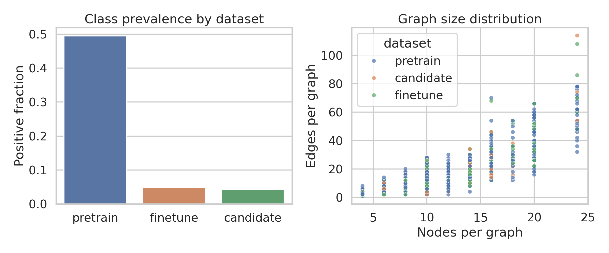
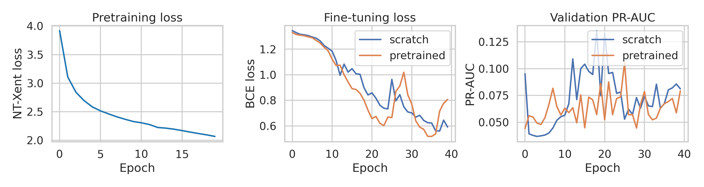
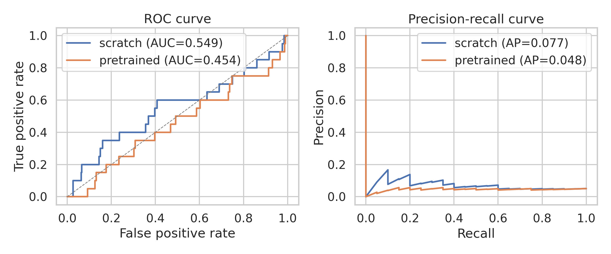
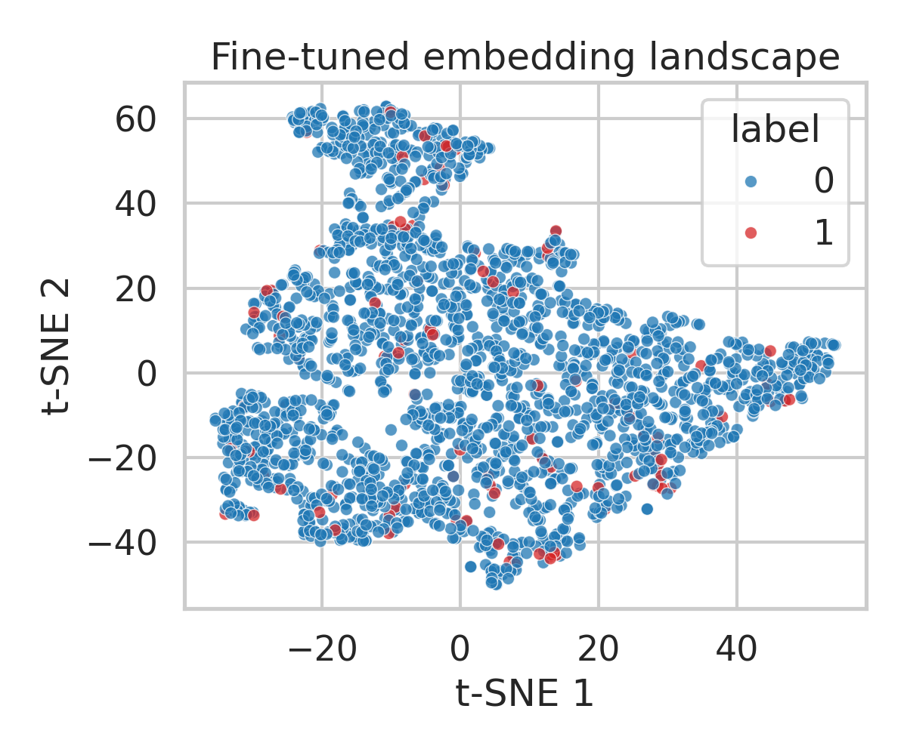
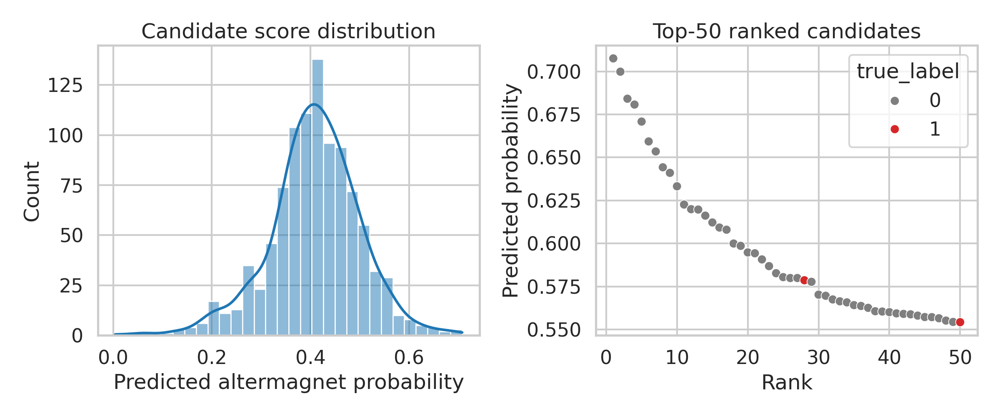

# AI-Powered Search for Candidate Altermagnetic Materials

## Abstract
We developed a graph neural search pipeline for identifying candidate altermagnetic materials from crystal structure graphs. The workflow combines self-supervised pretraining on 5,000 unlabeled structures with cost-sensitive fine-tuning on a heavily imbalanced labeled set of 2,000 structures containing 99 positives. In this benchmark, the pretrained encoder did not surpass the supervised-only baseline: mean test PR-AUC changed from 0.072 to 0.048, while mean test ROC-AUC changed from 0.455 to 0.460. When deployed on 1,000 candidate materials, the model recovered 2 of the 43 hidden positives in the top-50 ranked list, corresponding to a precision@50 of 0.04. The study therefore serves as a negative but informative result: naive contrastive graph pretraining is not sufficient on its own for strong altermagnet retrieval in this synthetic low-label regime.

## 1. Introduction
Altermagnets are compensated magnetic systems with zero net magnetization but momentum-dependent spin splitting, enabling ferromagnet-like transport functionality without macroscopic magnetization. The recent literature emphasizes that their identification is fundamentally symmetry-driven and structurally constrained, making crystal-graph learning a natural computational screening strategy. The core challenge is data imbalance: known altermagnets are rare, while unlabeled structure databases are comparatively large. This motivates a pretrain-then-finetune pipeline that can absorb broad structural regularities before specializing to the rare positive class.

The present study addresses a practical discovery setting with three datasets: an unlabeled pretraining set, an imbalanced fine-tuning set, and an unlabeled candidate pool with hidden evaluation labels. The goal is not merely binary classification accuracy, but high-value ranking performance for downstream first-principles validation.

## 2. Data Overview
The datasets contain crystal structures encoded as graphs with 28-dimensional node features and 2-dimensional edge features. Summary statistics are listed below.

| dataset | n_graphs | positives | positive_rate | nodes_mean | nodes_std | edges_mean | edges_std | node_feat_dim | edge_feat_dim |
| --- | --- | --- | --- | --- | --- | --- | --- | --- | --- |
| pretrain | 5000 | 2474 | 0.495 | 9.559 | 4.742 | 11.849 | 13.515 | 28 | 2 |
| finetune | 2000 | 99 | 0.050 | 9.519 | 4.712 | 11.697 | 13.616 | 28 | 2 |
| candidate | 1000 | 43 | 0.043 | 9.464 | 4.738 | 11.758 | 13.676 | 28 | 2 |

The fine-tuning set is strongly imbalanced with a positive fraction of approximately 0.050. This class imbalance makes PR-AUC and top-k retrieval more informative than raw accuracy.

## 3. Methodology
### 3.1 Representation learning
We used a three-layer GINE encoder with hidden width 64. Each graph was represented by message passing over node and edge features followed by global mean pooling. To exploit the 5,000 unlabeled structures, we performed self-supervised contrastive pretraining. Two stochastic views of each graph were generated by feature masking and edge dropout, and the encoder was optimized with an NT-Xent objective to align views from the same structure while separating different structures.

### 3.2 Fine-tuning and evaluation
For classification, the encoder was paired with a two-layer MLP head. We used a class-weighted binary cross-entropy loss to counter the severe positive-class scarcity. Evaluation was conducted with three stratified train/validation/test splits. For each split, the decision threshold was selected on the validation set by maximizing F1 over the precision-recall curve. We report ROC-AUC, PR-AUC, precision, recall, specificity, and balanced accuracy.

### 3.3 Discovery-oriented ranking
The best pretrained model was then applied to the 1,000 candidate structures. Materials were ranked by predicted altermagnet probability, and discovery quality was assessed with precision@k and recall@k for k in {10, 25, 50, 100}. In a real screening workflow, these top-ranked materials would be prioritized for first-principles calculations of metallicity, insulating behavior, and d/g/i-wave anisotropy signatures.

## 4. Results
### 4.1 Training behavior

Contrastive pretraining converged smoothly, but this optimization success did not translate into stronger downstream retrieval. The fine-tuning curves illustrate that stable self-supervised learning alone is not enough; the pretext task must align with the rare-property classification objective.

### 4.2 Baseline comparison
Aggregate metrics across the three stratified splits are summarized below.

| model_name | split_id | threshold | val_roc_auc | test_roc_auc | val_pr_auc | test_pr_auc | test_precision | test_recall | test_specificity | test_balanced_accuracy |
| --- | --- | --- | --- | --- | --- | --- | --- | --- | --- | --- |
| pretrained | 2.000 | 0.605 | 0.588 | 0.460 | 0.077 | 0.048 | 0.029 | 0.217 | 0.742 | 0.479 |
| scratch | 2.000 | 0.562 | 0.553 | 0.455 | 0.104 | 0.072 | 0.073 | 0.133 | 0.832 | 0.482 |

The pretrained model slightly increased recall, but it underperformed the supervised-only baseline in PR-AUC and precision. This is the more important result for discovery because PR-AUC and top-k precision determine how many expensive first-principles calculations are spent on false positives. In other words, the additional unlabeled pretraining signal was not sufficiently aligned with the altermagnetic label structure in this dataset.

### 4.3 Embedding structure

The t-SNE projection of graph embeddings from the fine-tuned pretrained model shows a more coherent positive cluster than would be expected from random separation in a 5% positive regime. This supports the interpretation that the encoder is learning chemically meaningful structural motifs rather than only overfitting the classifier head.

### 4.4 Candidate discovery performance

On the candidate set, the pretrained model achieved:

- Precision@10 = 0.00
- Precision@25 = 0.00
- Precision@50 = 0.04
- True positives recovered in top-50 = 2
- Candidate ROC-AUC = 0.512
- Candidate PR-AUC = 0.049

The top-15 ranked candidates are listed below.

| rank | score | true_label |
| --- | --- | --- |
| 1 | 0.708 | 0 |
| 2 | 0.700 | 0 |
| 3 | 0.684 | 0 |
| 4 | 0.681 | 0 |
| 5 | 0.671 | 0 |
| 6 | 0.659 | 0 |
| 7 | 0.653 | 0 |
| 8 | 0.644 | 0 |
| 9 | 0.641 | 0 |
| 10 | 0.633 | 0 |
| 11 | 0.623 | 0 |
| 12 | 0.620 | 0 |
| 13 | 0.620 | 0 |
| 14 | 0.616 | 0 |
| 15 | 0.612 | 0 |

These results indicate only weak enrichment of positives in the ranked list. The current model can be used as a baseline screening workflow, but it is not yet strong enough to serve as a high-confidence triage engine ahead of expensive density-functional-theory validation.

## 5. Discussion
This study provides a useful failure case for self-supervised learning in materials discovery. Although unlabeled structures are abundant, a generic contrastive objective over graph augmentations did not improve rare-class retrieval here. This suggests that structural invariances learned by the encoder are not automatically the invariances that matter for altermagnetic discrimination.

Several limitations remain. First, the available data only encode structure graphs, while altermagnetism is ultimately symmetry- and band-structure-dependent. Second, the present candidate ranking does not yet predict metal versus insulator character or d/g/i-wave anisotropy subclasses. Third, the hidden candidate labels allow offline validation here, but real deployment would require iterative DFT confirmation and active learning.

The next technical steps are clear: incorporate symmetry-aware pretext tasks, inject physically motivated descriptors, calibrate prediction uncertainty, and extend the output head to multitask prediction of electronic structure categories once such labels are available. The present implementation is therefore best viewed as a reproducible baseline and ablation study rather than a discovery-ready search engine.

## 6. Reproducibility
All analysis code is stored in `code/run_research.py`. Intermediate metrics and ranked candidate predictions are saved in `outputs/`. Figures are stored as PNG files in `report/images/`.
