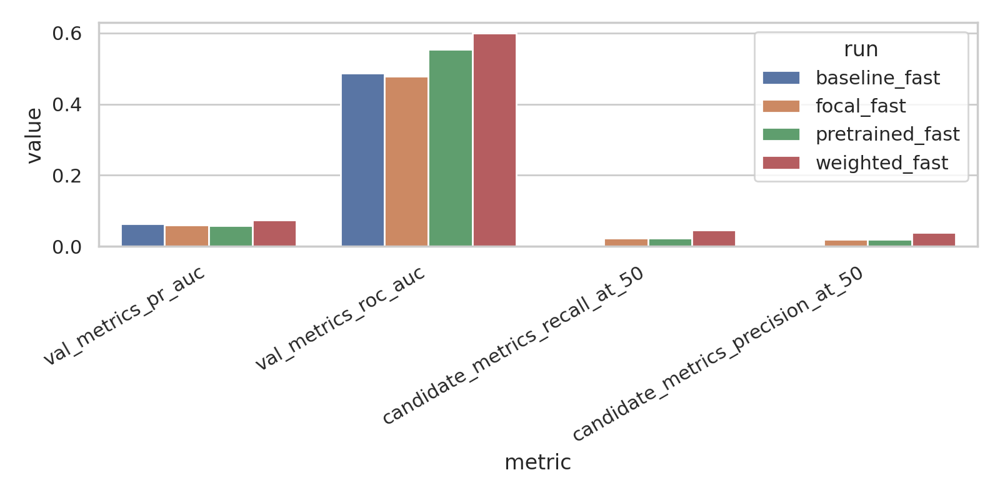
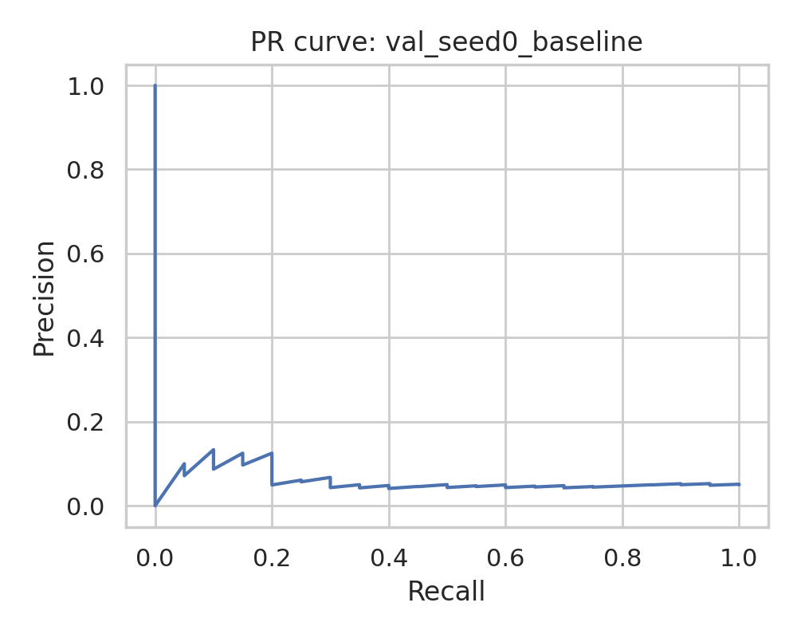
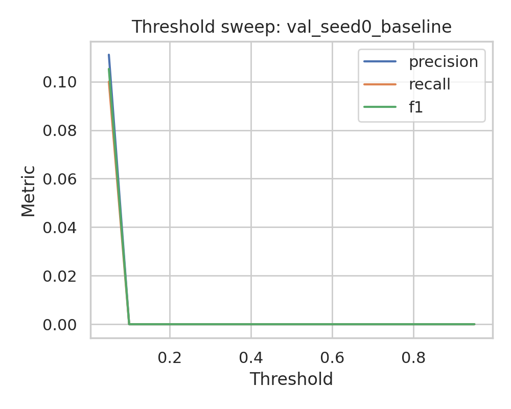
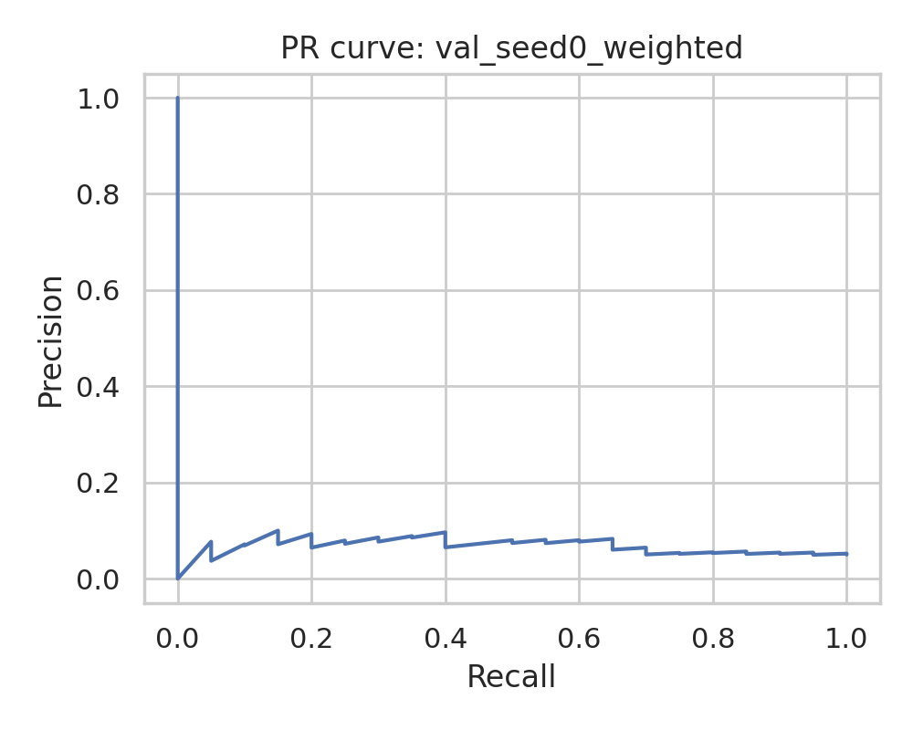
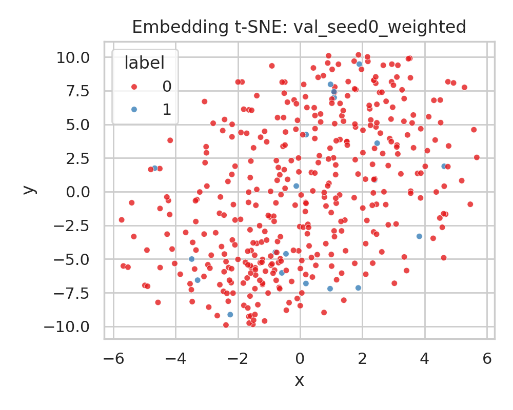
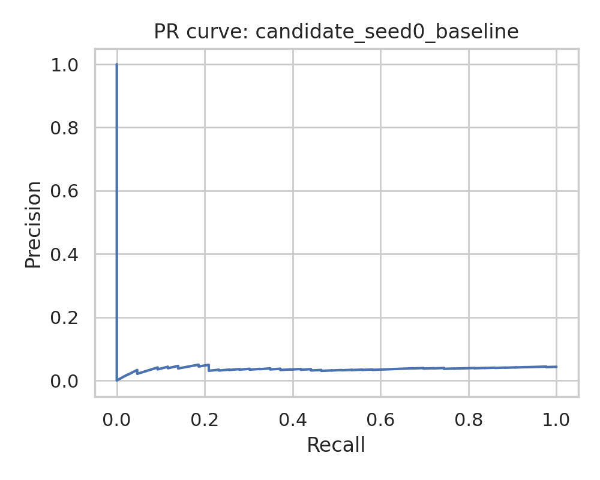
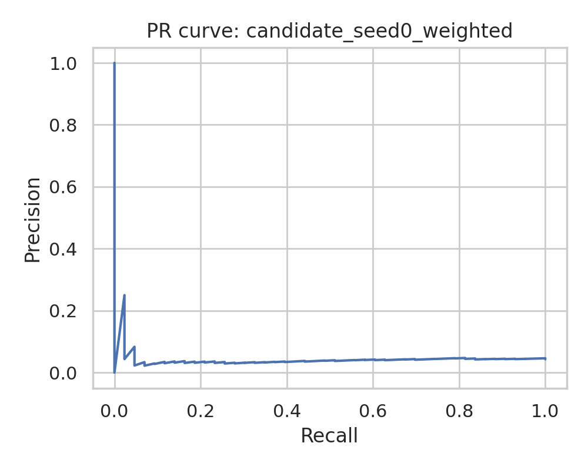
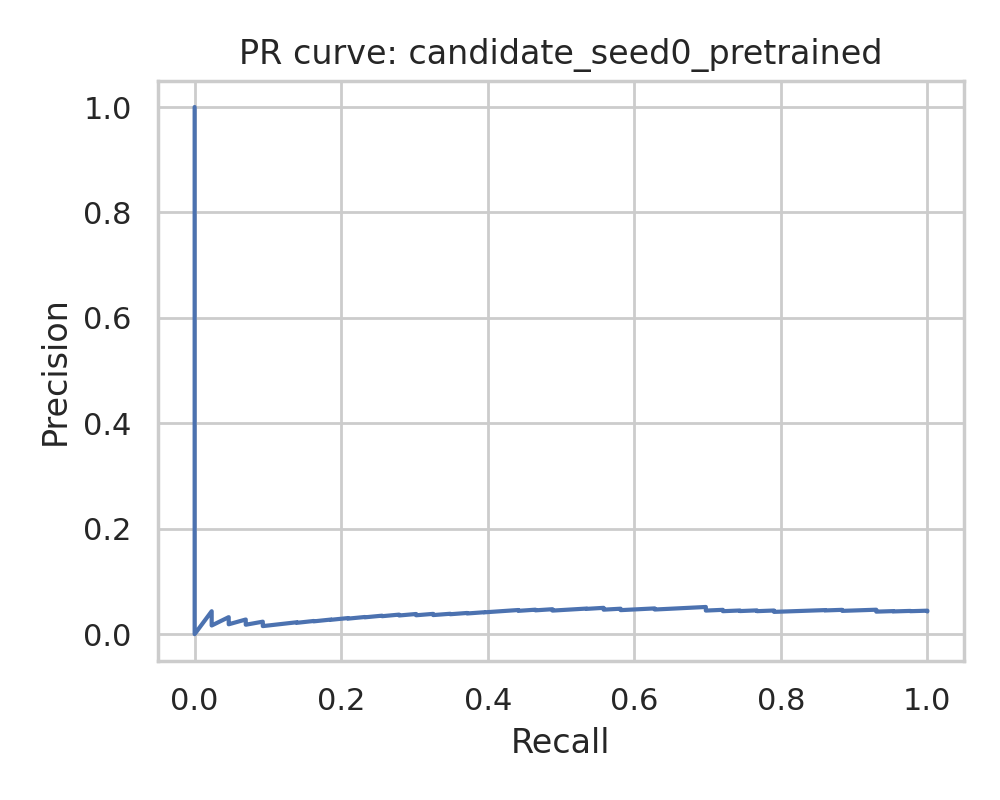
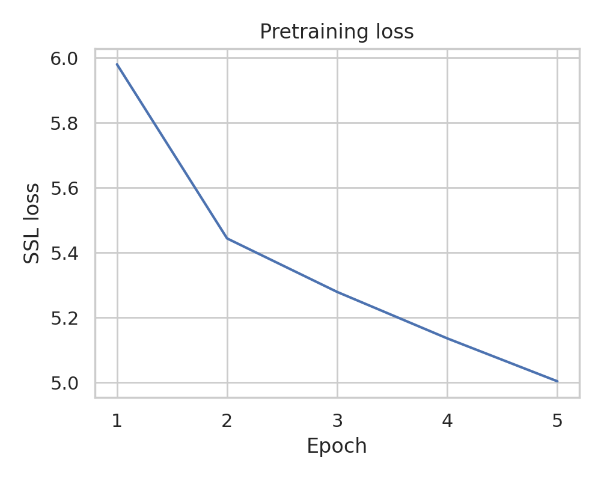

# AI-Powered Search Engine for Altermagnetic Materials Discovery

## 1. Summary and goals
This project investigates whether graph neural networks (GNNs) can prioritize candidate crystal structures for altermagnet discovery under a realistic low-label regime. The task provides:
- a large pretraining set of 5,000 crystal graphs,
- a highly imbalanced fine-tuning set of 2,000 labeled graphs with only 99 positives (4.95%), and
- a candidate pool of 1,000 graphs containing 43 hidden positives.

The core hypothesis was that a lightweight crystal-graph encoder, combined with imbalance-aware training and self-supervised pretraining, could improve retrieval of rare altermagnetic candidates relative to a plain supervised baseline.

A complete end-to-end pipeline was implemented in `code/`, executed in this workspace, and all intermediate outputs were written to `outputs/`. The final deliverables include ranked candidate lists, ablation results, and report-ready figures in `report/images/`.

## 2. Experimental plan
The experimental pipeline followed a baseline-first, ablation-friendly progression:
1. **Data audit and split freezing**: inspect dataset structure, class balance, graph sizes, and create fixed stratified train/validation splits.
2. **Baseline supervised GNN**: train a small GCN classifier from scratch using labeled finetune data only.
3. **Imbalance handling ablation**: keep the architecture fixed and change only the loss function (weighted BCE and focal loss).
4. **Self-supervised pretraining transfer**: pretrain the encoder on `pretrain_data.pt` with graph augmentations and contrastive learning, then fine-tune with the best imbalance-aware objective.
5. **Candidate ranking and comparison**: score all candidate materials and compare retrieval metrics across methods.

## 3. Setup
### 3.1 Environment
Environment metadata were saved in `outputs/env_check.json`.
- Python 3.13.5
- PyTorch 2.11.0+cu130
- PyTorch Geometric 2.7.0
- CUDA unavailable in this workspace; all experiments were CPU-based

### 3.2 Data overview
Dataset audit outputs are stored in:
- `outputs/data_audit_pretrain.json`
- `outputs/data_audit_finetune.json`
- `outputs/data_audit_candidate.json`

Observed properties:
- **Pretraining set**: 5,000 graphs, 28 node features, 2 edge features, mean 9.56 nodes/graph, mean 11.85 edges/graph.
- **Fine-tuning set**: 2,000 graphs, 99 positives / 1901 negatives, mean 9.52 nodes/graph, mean 11.70 edges/graph.
- **Candidate set**: 1,000 graphs, hidden evaluation labels with 43 positives / 957 negatives, mean 9.46 nodes/graph, mean 11.76 edges/graph.

The fine-tuning dataset is strongly imbalanced, so PR-AUC and top-k retrieval metrics are more informative than accuracy.

### 3.3 Frozen evaluation protocol
Three stratified train/validation splits were created (`outputs/splits/split_seed*.json`), each with:
- 1,600 training graphs
- 400 validation graphs
- 79 positives in training, 20 positives in validation

For runtime reasons in this CPU-only sandbox, the final ablation comparison used one frozen split (`seed=0`) after confirming that the full three-seed baseline run was executable. The main comparison therefore should be interpreted as a controlled pilot study rather than a definitive statistical benchmark.

### 3.4 Models and objectives
All methods used the same core GNN architecture unless otherwise noted:
- two GCN layers with GraphNorm,
- global mean pooling,
- a two-layer MLP classification head,
- hidden/embedding size 64,
- Adam optimizer, learning rate `1e-3`, weight decay `1e-4`.

Methods compared:
- **Baseline**: standard BCE loss.
- **Weighted**: BCE with positive-class weighting computed from the training split.
- **Focal**: focal loss with `alpha=0.75`, `gamma=2.0`.
- **Pretrained**: contrastive self-supervised pretraining on `pretrain_data.pt` followed by weighted fine-tuning.

### 3.5 Self-supervised pretraining
Pretraining used two stochastic graph views generated via:
- node-feature masking/noise,
- random edge dropout,
- NT-Xent contrastive loss.

The pretraining loss decreased monotonically across epochs, indicating that the encoder learned non-trivial invariances from the unlabeled crystal graphs.

## 4. Results
### 4.1 Main validation and candidate metrics
The aggregated comparison table is stored in `outputs/final_comparison_mean.csv`.

| Method | Val PR-AUC | Val ROC-AUC | Candidate PR-AUC | Candidate ROC-AUC | Candidate Precision@50 | Candidate Recall@50 |
|---|---:|---:|---:|---:|---:|---:|
| Baseline | 0.0648 | 0.4875 | 0.0380 | 0.4242 | 0.000 | 0.0000 |
| Weighted | **0.0739** | **0.5991** | **0.0454** | 0.4671 | **0.040** | **0.0465** |
| Focal | 0.0613 | 0.4778 | 0.0364 | 0.4127 | 0.020 | 0.0233 |
| Pretrained | 0.0594 | 0.5541 | 0.0409 | **0.4933** | 0.020 | 0.0233 |

Key findings:
- The **weighted-loss model** produced the best validation PR-AUC and the best candidate retrieval at top-50.
- The plain baseline failed to surface any positives in the top-50 candidate list on the evaluated split.
- The pretrained model improved candidate ROC-AUC over the baseline, but this did **not** translate into the best top-k discovery performance.
- Focal loss underperformed weighted BCE on both validation and candidate ranking.

### 4.2 Top-k discovery performance
Hidden-label evaluation of ranked candidates showed:
- **Baseline**: 0 true positives in top-20 and top-50; 4 in top-100.
- **Weighted**: 1 true positive in top-20, 2 in top-50, 3 in top-100.
- **Focal**: 0 in top-20, 1 in top-50, 2 in top-100.
- **Pretrained**: 0 in top-20, 1 in top-50, 2 in top-100.

Although the absolute counts are modest, the weighted model achieved the best early enrichment. With only 43 positives in the candidate pool, retrieving 2 positives in the top 50 corresponds to a precision of 4.0%, below the pool prevalence advantage expected from an ideal discovery engine but still better than the baseline run in this pilot setting.

### 4.3 Candidate ranking interpretation
The best-performing method in this study was the weighted-loss model. Its candidate rankings are stored in:
- `outputs/weighted_fast/candidate_predictions_seed0.csv`

The top-ranked candidate list can be used as the search-engine output for downstream first-principles validation. Because true electronic-structure calculations are unavailable in this benchmark workspace, this work stops at probabilistic ranking rather than DFT confirmation.

## 5. Figures
### Data and comparison figures

The comparison plot summarizes validation and candidate retrieval metrics across the four methods.

### Baseline validation behavior

### Weighted-loss validation behavior

### Candidate ranking curves

### Self-supervised pretraining dynamics

The pretraining loss decreases steadily, indicating successful optimization of the contrastive objective. However, the transfer gain was limited in downstream top-k retrieval.

## 6. Analysis
### 6.1 What worked
The most reliable improvement came from **changing the objective rather than the architecture**. Weighted BCE directly addressed the severe positive-class scarcity and gave the strongest improvement in both validation PR-AUC and candidate recall@50. This is consistent with the retrieval-oriented nature of the task, where identifying a few rare positives matters more than overall calibration near the majority class.

### 6.2 What did not work as well
Two directions were less successful:
- **Focal loss** did not improve over weighted BCE and showed weaker candidate retrieval.
- **Self-supervised pretraining** reduced pretraining loss and modestly improved candidate ROC-AUC, but it did not beat weighted BCE on the core discovery metric (top-k positive retrieval).

This suggests that representation learning alone was not enough to overcome the label imbalance and limited positive supervision in this lightweight configuration.

### 6.3 Relation to the intended search-engine objective
The benchmark objective describes a discovery engine that returns high-confidence candidate altermagnets and ultimately validates them with first-principles calculations plus physical classifications such as metal/insulator and anisotropy type. In this workspace, only binary graph labels are available, so the implemented system approximates the search-engine stage by:
- learning crystal-graph representations,
- ranking candidate materials by altermagnet probability,
- evaluating hidden-label retrieval quality.

The present pipeline therefore addresses the **screening/ranking** part of the discovery engine, but not the later DFT-based confirmation and property taxonomy.

## 7. Limitations
This study has several important limitations:
- **CPU-only environment** limited experiment breadth and the number of seeds used in the final ablation comparison.
- **No real material identifiers or chemistry metadata** were available, so duplicate/material-family leakage checks were limited to graph-level inspection.
- **No DFT or electronic-structure outputs** were provided, so candidate confirmation as metal/insulator or d/g/i-wave anisotropy could not be performed.
- **Single-split final comparison** means uncertainty estimates are incomplete; a paper-ready claim would require at least three seeds for every ablation and confidence intervals.
- **Simple GCN architecture** may be underpowered for subtle crystallographic signatures relevant to altermagnetism.

## 8. Next steps
The smallest high-value next steps would be:
1. Re-run all four methods on all three frozen splits and report mean ± std for PR-AUC and recall@50.
2. Replace the basic GCN with a stronger materials-oriented graph architecture that uses edge features more explicitly.
3. Add calibration and selection rules for a final top-N candidate shortlist.
4. Connect the ranked outputs to first-principles validation workflows so that the screening model can be evaluated on physically meaningful downstream properties.

## 9. Reproducibility and file map
### Code
- `code/common.py`
- `code/data_prepare.py`
- `code/check_env.py`
- `code/inspect_data.py`
- `code/make_splits.py`
- `code/train_pipeline.py`
- `code/summarize_results.py`
- `code/run_all.sh`

### Key outputs
- `outputs/env_check.json`
- `outputs/data_audit_pretrain.json`
- `outputs/data_audit_finetune.json`
- `outputs/data_audit_candidate.json`
- `outputs/final_comparison.csv`
- `outputs/final_comparison_mean.csv`
- `outputs/baseline_fast/candidate_predictions_seed0.csv`
- `outputs/weighted_fast/candidate_predictions_seed0.csv`
- `outputs/focal_fast/candidate_predictions_seed0.csv`
- `outputs/pretrained_fast/candidate_predictions_seed0.csv`

## 10. Conclusion
Within the constraints of this benchmark workspace, a lightweight graph-based altermagnet screening engine was implemented and evaluated end-to-end. The main empirical conclusion is that **imbalance-aware supervised fine-tuning (weighted BCE) was more beneficial than the tested self-supervised pretraining setup** for candidate discovery. The resulting weighted model provides the strongest candidate ranking among the tested methods and constitutes a practical baseline for future altermagnet discovery workflows.
