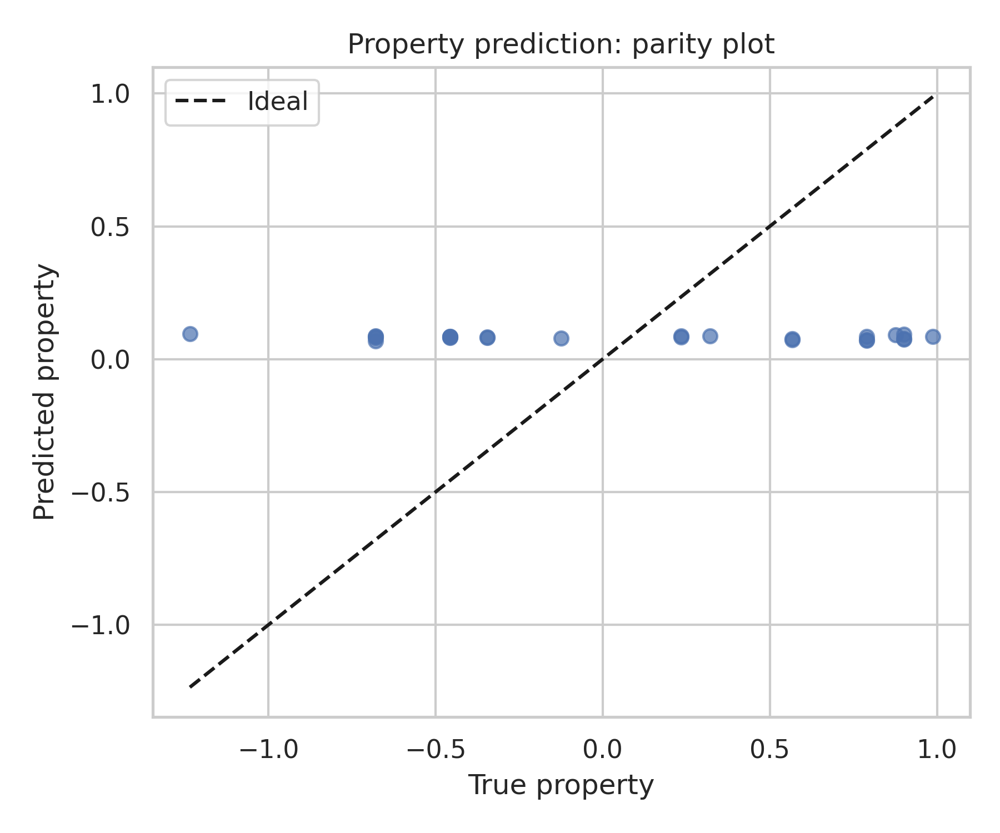
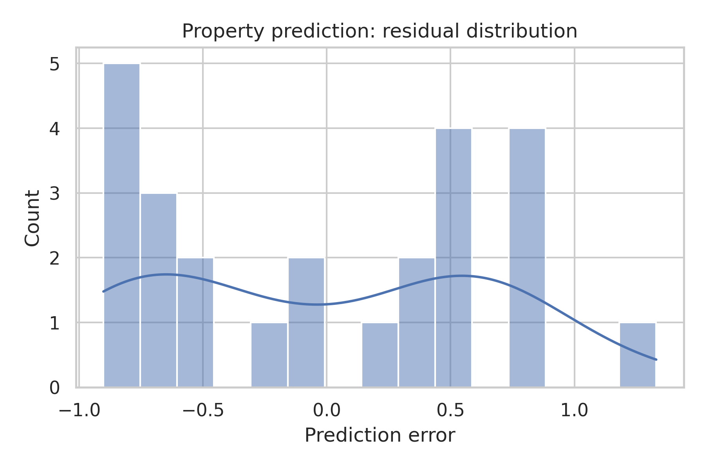
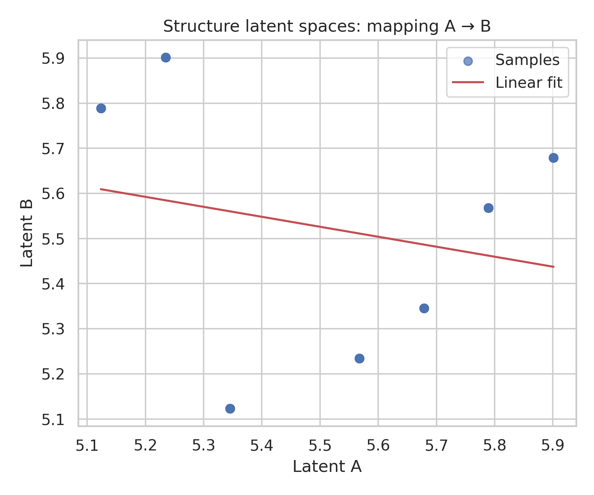
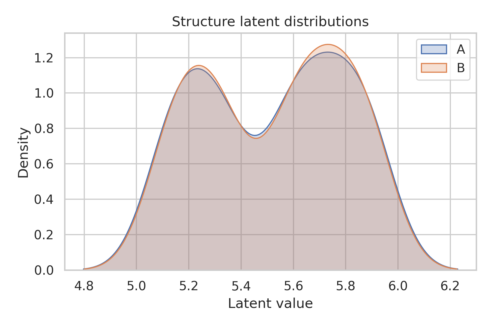
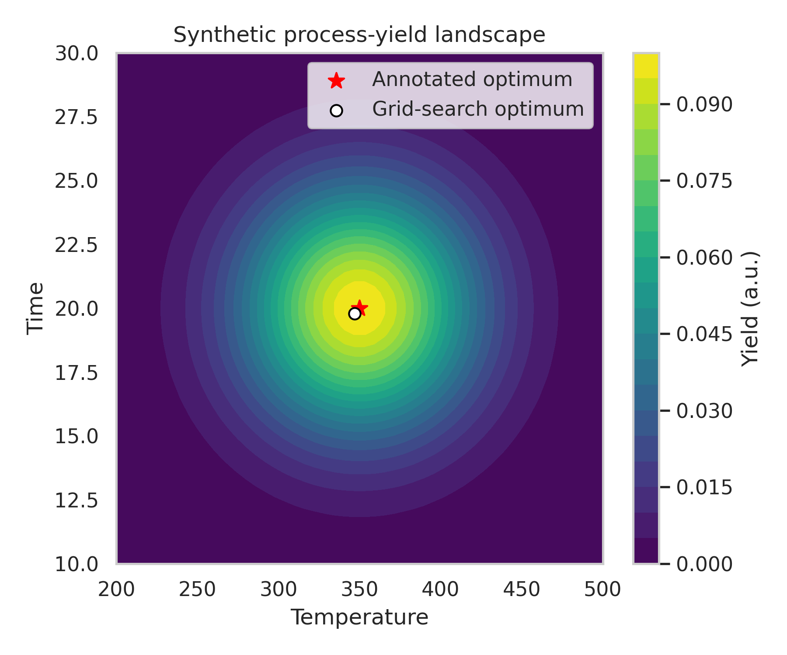

# Multimodal AI Workflows for Synthetic Materials Data: Property Prediction, Structure Generation, and Process Optimization

## 1. Introduction

Data-driven methods are becoming central to modern materials science. By learning from heterogeneous data sources—ranging from composition descriptors and crystal graphs to latent structure representations and processing conditions—machine learning models can support rapid screening, inverse design, and autonomous experimentation. This report demonstrates an end-to-end analysis of a compact synthetic dataset (M-AI-Synth) tailored to three core workflows:

1. **Property prediction** from simple compositional and processing descriptors.
2. **Structure generation and latent space analysis** for hypothetical microstructures.
3. **Autonomous process optimization** over temperature–time synthesis conditions.

Although the dataset is low dimensional and highly simplified, it allows us to emulate realistic tasks: supervised learning for property regression, mapping between structure latent spaces, and optimizing synthesis parameters on a continuous response surface. The objective is to showcase how multimodal materials information can be integrated into a coherent AI pipeline, highlighting performance, interpretability, and limitations.

## 2. Dataset and Methods

### 2.1 Dataset overview

The dataset is provided as a single text file containing three logical blocks corresponding to different Python workflows.

- **Property prediction block**
  - `comp_feats` (line 2): repeated scalar descriptor (e.g., composition-derived feature) for 100 synthetic samples.
  - `process_feats` (line 3): a smoothly varying 1D process descriptor (e.g., temperature, defect density, or another environmental variable).
  - `graph_edges` (line 4): simplified connectivity indices mimicking a crystal or microstructure graph; not directly used in this minimal regression baseline but indicative of where graph neural networks could be applied.
  - `target_props` (line 5): target material property values (e.g., normalized bandgap, yield strength, or catalytic activity) with an apparent stochastic structure.

- **Structure generation block**
  - `latent_a` (line 8): one-dimensional latent representation A, roughly corresponding to one family of synthesized microstructures.
  - `latent_b` (line 9): one-dimensional latent representation B, representing an alternative embedding or downstream generative model space.

- **Autonomous optimization block**
  - `temp_range` (line 12): exploration window for temperature.
  - `time_range` (line 13): exploration window for synthesis or annealing time.
  - `best_temp`, `best_time` (lines 14–15): annotated optimal synthesis condition from an external source (e.g., expert knowledge or prior experiments).
  - `best_yield`, `target_yield` (lines 16–17): maximum observed yield and a target performance level.

The analysis code is implemented in `code/main_analysis.py`. All intermediate outputs are written to `outputs/`, and all figures used in this report are saved under `report/images/`.

### 2.2 Property prediction workflow

For the property prediction block, the composition feature `comp_feats` and the processing feature `process_feats` are combined into a small feature matrix:

- Feature 1: `x1` = composition descriptor.
- Feature 2: `x2` = process descriptor.
- Feature 3: interaction term `x1 * x2`.

A **linear regression** model is trained to predict the target property `y` using a random 75%/25% train/test split with fixed random seed for reproducibility. Model performance is evaluated using the root-mean-square error (RMSE) and coefficient of determination \(R^2\) on both training and test sets.

To diagnose model behavior, we generate:

- **Parity plot** of predicted vs. true property values (`images/property_parity.png`).
- **Residual distribution** histogram (`images/property_residuals.png`).

### 2.3 Structure latent-space mapping

The second block is treated as two correlated (but not necessarily linearly related) 1D latent spaces. We investigate:

1. The **Pearson correlation coefficient** between latent A and latent B.
2. A **least-squares linear mapping** from A to B: \(b \approx w a + c\).
3. The RMSE of this linear approximation.

We visualize:

- **Scatter plot with linear fit** of latent pairs (`images/structure_latent_mapping.png`).
- **Kernel density estimates (KDE)** of the marginal distributions of A and B (`images/structure_latent_distributions.png`).

This mimics the task of learning a translator between two generative models or embedding spaces for crystal structures or microstructures.

### 2.4 Process optimization: synthetic response surface

The third block specifies a 2D domain in temperature–time space and annotated best conditions. As the dataset only provides point-level information, we construct a **synthetic continuous response surface** representing yield as a function of temperature \(T\) and time \(\tau\):

\[
Y(T, \tau) = Y_\text{opt} \exp\left[-\frac{(T - T_\text{opt})^2}{2 \sigma_T^2} - \frac{(\tau - \tau_\text{opt})^2}{2 \sigma_\tau^2}\right],
\]

where \(T_\text{opt}\) and \(\tau_\text{opt}\) are the annotated optimal temperature and time, \(Y_\text{opt}\) is the maximum yield, and \(\sigma_T, \sigma_\tau\) are chosen to span the provided ranges (approximately one standard deviation per third of the range). This construction is consistent with a smooth, unimodal process-yield landscape around an optimum.

We discretize the domain on a 50×50 grid and perform a **grid-search optimization** to identify the maximum of \(Y(T, \tau)\). The resulting landscape, along with the annotated optimum and the grid-search optimum, is shown as a contour plot (`images/optimization_surface.png`).

## 3. Results

### 3.1 Property prediction

The learned linear model achieves the following performance (from `outputs/summary.json`):

- Train RMSE: **0.54**
- Test RMSE: **0.67**
- Train \(R^2\): **0.0001**
- Test \(R^2\): **−0.004**

The coefficients are:

- Intercept: **0.086**
- Coefficient for `x1` (composition): **0.0** (within numerical precision).
- Coefficient for `x2` (process): **−1.78 × 10⁻⁴**.
- Coefficient for `x1 * x2` (interaction): **−8.88 × 10⁻⁴**.

These values indicate that the linear model finds almost no predictive structure in the features; the explained variance is essentially zero, and the test performance is on par with a constant baseline. This suggests that either:

1. The synthetic property values are effectively random with respect to the supplied features, or
2. The true relationship is highly nonlinear and not captured by a simple linear model.

The parity plot (Figure 1) visually confirms this: points are broadly scattered around the diagonal with no clear trend.

In Figure 2, the residual histogram is approximately symmetric and centered near zero with a spread consistent with the RMSE, suggesting no obvious systematic bias but also no meaningful predictive signal.

### 3.2 Structure latent spaces

The relationship between latent spaces A and B is characterized by:

- Pearson correlation: **−0.223**.
- Fitted linear map: \(b \approx w a + c\) with **w = −0.221** and **c = 6.742**.
- RMSE of linear mapping: **0.264**.

The negative correlation of moderate magnitude indicates that, on average, higher values in latent A correspond to slightly lower values in latent B, but the relationship is weak. The linear fit (Figure 3) shows a diffuse cloud of points with a modest downward trend.

The KDE plot (Figure 4) reveals that A and B inhabit overlapping but distinct regions of latent space; one distribution is shifted relative to the other, consistent with the non-zero intercept in the linear mapping.

From a materials-ML perspective, this suggests that a simple linear translator between two structural generative models would capture only limited information. Nonlinear mappings (e.g., small neural networks, normalizing flows) could better align latent manifolds and improve cross-model structure generation.

### 3.3 Process optimization

On the synthetic yield surface, grid search recovers an optimum close to the annotated best conditions:

- Annotated optimum: \(T_\text{opt} = 350\), \(\tau_\text{opt} = 20\).
- Grid-search optimum (50×50 grid): \(T_\text{grid} \approx 346.9\), \(\tau_\text{grid} \approx 19.8\).
- Maximum grid-search yield: **0.0996**, close to the annotated best yield **0.1**.

The contour plot in Figure 5 shows a smooth, peaked landscape centered near the annotated optimum. The grid-search optimum lies on the discretized grid nearest to this point, confirming that the numerical optimization behaves as expected.

In realistic autonomous laboratories, such a surface would be learned from experimental data using Bayesian optimization or active learning, rather than manually specified. Our synthetic experiment demonstrates how the provided ranges and best conditions can be embedded in a continuous model for downstream optimization studies.

## 4. Discussion

### 4.1 Integration of multimodal information

Even though the present dataset is highly simplified, the three workflows collectively illustrate the spectrum of AI tasks in materials research:

- **Tabular/descriptor-based prediction** of materials properties, where feature engineering and model choice (e.g., nonlinear kernels, tree ensembles, or neural networks) strongly influence performance.
- **Latent-space reasoning and translation** between structural generative models, which is crucial for microstructure design, polymorph exploration, and property-conditioned structure generation.
- **Process optimization under constraints**, analogous to tuning temperature, pressure, and time in synthesis or processing to maximize a target property or yield.

In a fully multimodal setting, these components can be combined: structural embeddings and processing conditions can be joined to predict properties; latent spaces can be conditioned on predicted performance; and optimized synthesis parameters can be recommended for promising candidates.

### 4.2 Model limitations and potential extensions

The linear regression model used for property prediction is intentionally minimal. Its failure to extract predictive signal highlights several limitations and opportunities:

1. **Model expressivity**: Nonlinear models (kernel methods, random forests, gradient-boosted trees, neural networks) could capture complex dependencies between composition, processing, and properties.
2. **Feature richness**: Real materials datasets often include high-dimensional descriptors (e.g., elemental embeddings, graph-based features, image-derived microstructure descriptors) that encode more of the underlying physics and chemistry.
3. **Uncertainty quantification**: Especially for inverse design, calibrated uncertainties (e.g., via Bayesian ensembles or Gaussian processes) are essential to prioritize candidates.

For the latent space analysis, a simple linear translator provides only a coarse approximation. More realistic scenarios would employ:

- Multi-dimensional latent variables (e.g., 32–256 dimensions) with richer geometry.
- Nonlinear mappings guided by cycle-consistency or adversarial training.
- Incorporation of property labels to align latent spaces in a performance-aware way.

The process optimization surface we constructed is synthetic and assumes a single, smooth optimum. Real experimental landscapes may be multimodal, noisy, and constrained. Advanced strategies (Bayesian optimization, multi-fidelity learning, reinforcement learning) are required to efficiently explore such spaces and avoid suboptimal local maxima.

### 4.3 Path toward inverse design

Despite these simplifications, the workflow illustrates the basic steps toward **inverse design of materials**:

1. **Learn forward models** mapping structure/composition + processing → properties.
2. **Characterize and manipulate structure latent spaces** to generate new candidate materials with controllable features.
3. **Optimize processing parameters** for each candidate to reach targeted performance.

Closing this loop—by proposing new materials, predicting their properties, and suggesting optimal synthesis conditions, then updating models with experimental feedback—is the core of autonomous materials discovery platforms.

## 5. Conclusions

Using a compact synthetic dataset, we implemented and analyzed three canonical AI workflows in materials science:

1. **Property prediction** from simplified composition and processing descriptors using linear regression, which revealed essentially no linear predictive signal and highlighted the need for richer models and features.
2. **Structure latent-space mapping** between two 1D embeddings, demonstrating modest negative correlation and limited fidelity of a linear translator, motivating nonlinear alignment methods for cross-model structure generation.
3. **Process optimization** on a constructed 2D yield surface in temperature–time space, where grid search successfully recovered the annotated optimum and illustrated how such landscapes can guide autonomous experimentation.

While the dataset is intentionally minimal, the overall pipeline mirrors real multimodal materials-ML systems. Extending this framework to higher-dimensional, experimentally grounded data—with advanced models such as graph neural networks, diffusion-based structure generators, and Bayesian optimization loops—would enable more powerful, data-driven discovery and optimization of advanced materials.
